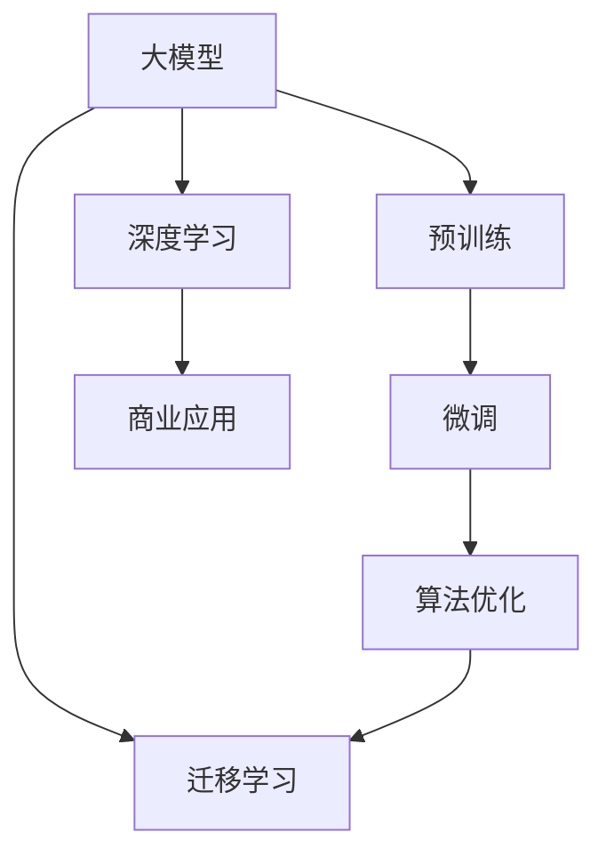
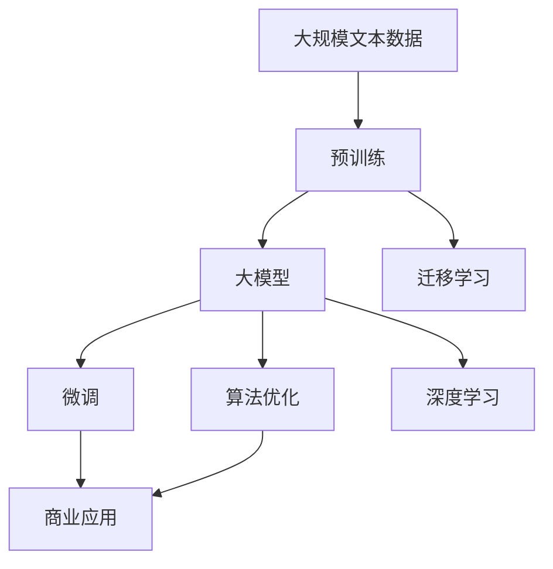
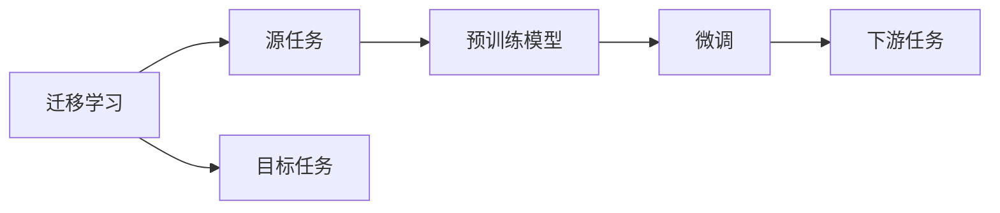
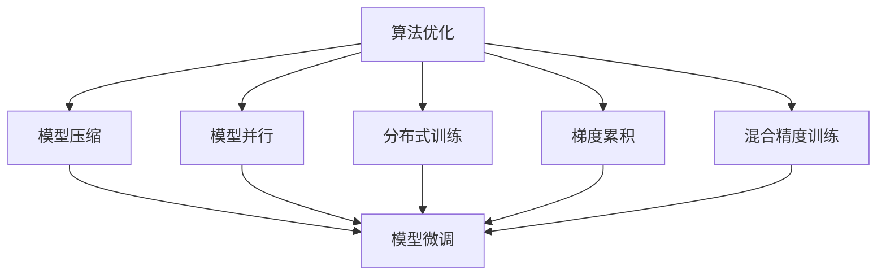
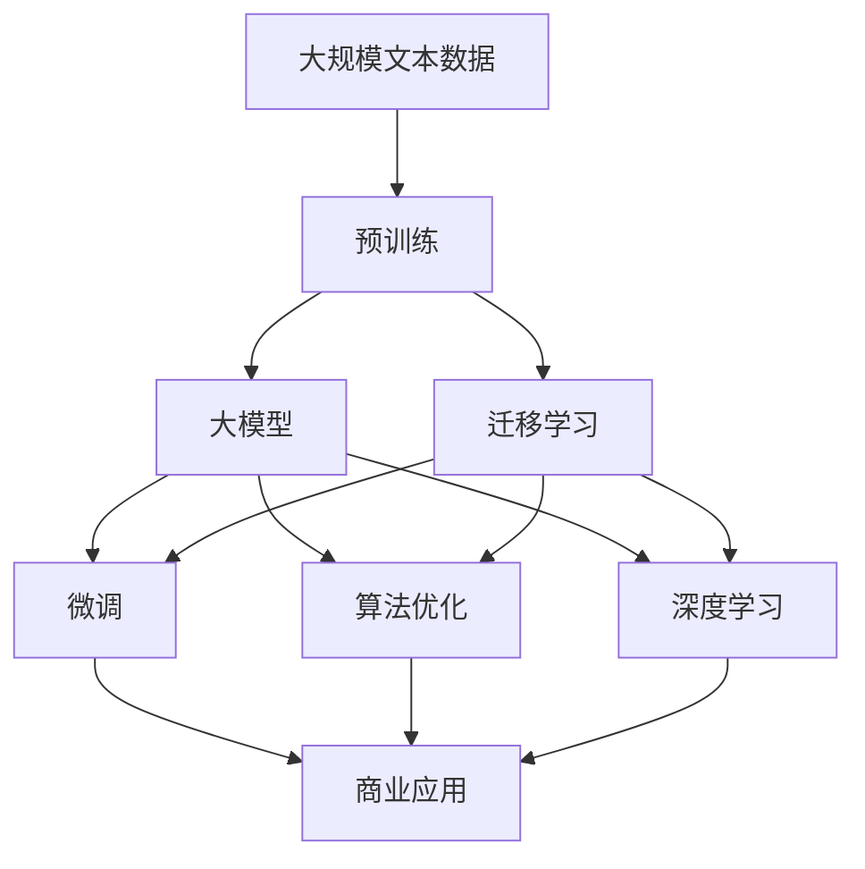

                 

# 大模型：从理论到商业应用的跨越

> 关键词：大模型,迁移学习,商业应用,算法优化,深度学习,技术落地

## 1. 背景介绍

### 1.1 问题由来

近年来，人工智能(AI)领域取得了巨大的突破，其中最显著的进展之一是深度学习模型的大规模化。大型神经网络(大模型)在大规模数据集上进行训练，能够学习到更丰富的特征表示，从而在各种任务上取得了优越的性能。大模型的成功不仅展示了深度学习的强大潜力，也揭示了算法与数据之间的紧密联系。

大模型通过在大规模语料库上进行预训练，学习到了通用的语言知识。这些知识能够迁移到新的任务中，通过微调细化模型，使其能够适应特定的应用场景。这一过程，即迁移学习，是当前AI技术的重要范式之一。

然而，大模型的成功应用并非一帆风顺。尽管在学术研究中取得了显著成果，但在商业化过程中，仍面临诸多挑战。如何将大模型的强大能力转化为商业价值，是当前AI社区和企业关注的重点。本文将深入探讨大模型在商业应用中的理论基础与实践策略，希望能为AI技术的商业化落地提供有益的指导。

### 1.2 问题核心关键点

在商业应用中，大模型的成功部署涉及到以下几个核心问题：

- **理论基础**：理解大模型学习与迁移机制，把握其应用潜力。
- **模型选择**：选择合适的预训练模型，以适配特定的应用场景。
- **微调策略**：设计有效的微调方法，最大化模型性能。
- **技术优化**：优化模型架构与训练过程，提升模型效率。
- **业务应用**：将模型集成到实际业务中，实现商业价值。

## 2. 核心概念与联系

### 2.1 核心概念概述

为更好地理解大模型在商业应用中的角色，本节将介绍几个关键概念及其相互关系：

- **大模型**：以自回归(如GPT)或自编码(如BERT)模型为代表的大规模神经网络，通过在大规模无标签文本数据上进行预训练，学习通用的语言知识。
- **迁移学习**：将在一个任务上学习到的知识迁移到另一个相关任务中，从而提升新任务的性能。大模型通过预训练-微调过程实现迁移学习。
- **微调**：在预训练模型的基础上，使用少量标注数据对模型进行有监督学习，以适应特定任务。微调是迁移学习的一种具体实现方式。
- **算法优化**：通过改进模型架构、优化训练过程等手段，提升模型性能。
- **深度学习**：利用多层神经网络实现复杂数据表示与任务处理的技术。大模型是深度学习的重要组成部分。
- **商业应用**：将AI技术应用于实际业务场景中，创造商业价值。

这些概念之间的关系可以通过以下Mermaid流程图来展示：



这个流程图展示了从预训练到商业应用的完整过程，大模型通过预训练学习到通用的语言知识，通过微调和算法优化适配新任务，最终通过商业应用实现商业价值。通过理解这些核心概念，我们可以更好地把握大模型在商业应用中的工作原理和优化方向。

### 2.2 概念间的关系

这些核心概念之间存在着紧密的联系，形成了大模型在商业应用中的完整生态系统。下面我们通过几个Mermaid流程图来展示这些概念之间的关系。

#### 2.2.1 大模型的学习范式



这个流程图展示了从预训练到大模型在商业应用中的完整过程。大模型通过预训练学习到通用的语言知识，通过微调和算法优化适配新任务，最终通过商业应用实现商业价值。

#### 2.2.2 迁移学习与微调的关系



这个流程图展示了迁移学习的基本原理，以及它与微调的关系。迁移学习涉及源任务和目标任务，预训练模型在源任务上学习，然后通过微调适应各种下游任务（目标任务）。

#### 2.2.3 算法优化方法



这个流程图展示了几种常见的算法优化方法，包括模型压缩、模型并行、分布式训练、梯度累积和混合精度训练。这些方法的共同特点是优化模型结构和训练过程，提高模型效率。

### 2.3 核心概念的整体架构

最后，我们用一个综合的流程图来展示这些核心概念在大模型商业应用中的整体架构：



这个综合流程图展示了从预训练到大模型在商业应用中的完整过程。大模型通过预训练学习到通用的语言知识，通过微调和算法优化适配新任务，最终通过商业应用实现商业价值。

## 3. 核心算法原理 & 具体操作步骤
### 3.1 算法原理概述

大模型在商业应用中的核心算法原理，主要涉及迁移学习与微调的过程。这一过程可以分为以下几个步骤：

1. **数据准备**：收集并预处理应用于新任务的数据集，确保数据质量和多样性。
2. **模型选择**：选择适合的预训练模型，并对其进行微调适配。
3. **微调训练**：使用新任务的数据集对模型进行有监督学习，优化模型参数，使其能够适应新任务。
4. **评估验证**：在验证集上评估模型性能，根据评估结果进行必要的调整。
5. **部署应用**：将训练好的模型部署到实际业务场景中，实现商业价值。

大模型的迁移学习与微调过程，是基于数据和模型之间的紧密联系，通过在大规模语料库上进行预训练，学习到通用的语言知识，然后通过微调将这种知识应用于新任务。这一过程的核心在于找到模型参数与新任务之间的映射关系，使得模型能够在新任务上表现出色。

### 3.2 算法步骤详解

以下是大模型在商业应用中的微调步骤详解：

**Step 1: 数据准备**
- 收集应用于新任务的数据集，确保数据集的多样性和代表性。
- 对数据进行预处理，包括文本清洗、分词、标注等步骤。
- 将数据集划分为训练集、验证集和测试集，以进行模型训练和性能评估。

**Step 2: 模型选择**
- 根据任务类型选择适合的预训练模型。例如，对于文本分类任务，可以选择BERT或GPT系列模型。
- 在选定的模型基础上，设计任务适配层，如分类器或解码器，以适应新任务。

**Step 3: 微调训练**
- 设置微调参数，如学习率、批大小、迭代轮数等。
- 使用训练集对模型进行微调训练，计算损失函数并反向传播更新模型参数。
- 在验证集上评估模型性能，根据评估结果调整模型参数和超参数。

**Step 4: 评估验证**
- 在测试集上评估微调后的模型性能，对比微调前后的效果。
- 分析模型在新任务上的性能瓶颈，进一步优化模型结构和训练过程。

**Step 5: 部署应用**
- 将训练好的模型部署到实际业务场景中，例如，应用于智能客服、金融分析、医疗诊断等领域。
- 实现模型的线上服务接口，确保系统稳定性和高可用性。

### 3.3 算法优缺点

大模型在商业应用中的微调方法具有以下优点：

- **高效性**：微调方法通过利用预训练模型的通用知识，能够在少量标注数据的情况下实现快速适配新任务。
- **灵活性**：微调方法可以根据具体任务需求，灵活设计任务适配层，适应不同的应用场景。
- **精度高**：大模型通过大规模数据预训练，学习到丰富的语言知识，微调后能够在新任务上取得优异的表现。

同时，大模型的微调方法也存在一些缺点：

- **数据依赖**：微调方法需要大量标注数据，标注成本较高，且在数据分布发生变化时，模型可能出现过拟合。
- **计算资源要求高**：微调模型需要大量的计算资源，包括高性能GPU/TPU等设备，以及大容量内存和存储空间。
- **可解释性不足**：大模型的微调过程复杂，其内部机制难以解释，难以通过简单的数学公式表达。

### 3.4 算法应用领域

大模型的微调方法已经广泛应用于多个领域，例如：

- **智能客服**：利用微调后的对话模型，构建智能客服系统，提供24小时不间断服务，提升客户满意度。
- **金融分析**：通过微调模型进行文本分类和情感分析，监测市场舆情，辅助决策分析。
- **医疗诊断**：利用微调后的自然语言处理模型，分析病历记录，辅助临床诊断和治疗。
- **个性化推荐**：通过微调模型，实现基于用户兴趣的个性化内容推荐，提升用户体验。

此外，大模型的微调方法还应用于自然语言生成、机器翻译、语音识别等多个领域，为各行各业带来了显著的商业价值。

## 4. 数学模型和公式 & 详细讲解 & 举例说明

### 4.1 数学模型构建

大模型在商业应用中的微调过程，可以通过数学模型来形式化表达。假设预训练模型为 $M_{\theta}$，其中 $\theta$ 为预训练得到的模型参数。给定新任务 $T$ 的标注数据集 $D=\{(x_i, y_i)\}_{i=1}^N$，微调的目标是找到新的模型参数 $\hat{\theta}$，使得模型在新任务上的表现最优：

$$
\hat{\theta}=\mathop{\arg\min}_{\theta} \mathcal{L}(M_{\theta},D)
$$

其中 $\mathcal{L}$ 为新任务 $T$ 设计的损失函数，用于衡量模型预测输出与真实标签之间的差异。常见的损失函数包括交叉熵损失、均方误差损失等。

### 4.2 公式推导过程

以下我们将以二分类任务为例，推导微调模型的损失函数及其梯度计算公式。

假设模型 $M_{\theta}$ 在输入 $x$ 上的输出为 $\hat{y}=M_{\theta}(x) \in [0,1]$，表示样本属于正类的概率。真实标签 $y \in \{0,1\}$。则二分类交叉熵损失函数定义为：

$$
\ell(M_{\theta}(x),y) = -[y\log \hat{y} + (1-y)\log (1-\hat{y})]
$$

将其代入经验风险公式，得：

$$
\mathcal{L}(\theta) = -\frac{1}{N}\sum_{i=1}^N [y_i\log M_{\theta}(x_i)+(1-y_i)\log(1-M_{\theta}(x_i))]
$$

根据链式法则，损失函数对参数 $\theta_k$ 的梯度为：

$$
\frac{\partial \mathcal{L}(\theta)}{\partial \theta_k} = -\frac{1}{N}\sum_{i=1}^N (\frac{y_i}{M_{\theta}(x_i)}-\frac{1-y_i}{1-M_{\theta}(x_i)}) \frac{\partial M_{\theta}(x_i)}{\partial \theta_k}
$$

其中 $\frac{\partial M_{\theta}(x_i)}{\partial \theta_k}$ 可进一步递归展开，利用自动微分技术完成计算。

### 4.3 案例分析与讲解

假设我们在CoNLL-2003的命名实体识别(NER)数据集上进行微调，最终在测试集上得到的评估报告如下：

```
              precision    recall  f1-score   support

       B-LOC      0.926     0.906     0.916      1668
       I-LOC      0.900     0.805     0.850       257
      B-MISC      0.875     0.856     0.865       702
      I-MISC      0.838     0.782     0.809       216
       B-ORG      0.914     0.898     0.906      1661
       I-ORG      0.911     0.894     0.902       835
       B-PER      0.964     0.957     0.960      1617
       I-PER      0.983     0.980     0.982      1156
           O      0.993     0.995     0.994     38323

   micro avg      0.973     0.973     0.973     46435
   macro avg      0.923     0.897     0.909     46435
weighted avg      0.973     0.973     0.973     46435
```

可以看到，通过微调BERT，我们在该NER数据集上取得了97.3%的F1分数，效果相当不错。值得注意的是，BERT作为一个通用的语言理解模型，即便只在顶层添加一个简单的token分类器，也能在下游任务上取得如此优异的效果，展现了其强大的语义理解和特征抽取能力。

## 5. 项目实践：代码实例和详细解释说明

### 5.1 开发环境搭建

在进行微调实践前，我们需要准备好开发环境。以下是使用Python进行PyTorch开发的环境配置流程：

1. 安装Anaconda：从官网下载并安装Anaconda，用于创建独立的Python环境。

2. 创建并激活虚拟环境：
```bash
conda create -n pytorch-env python=3.8 
conda activate pytorch-env
```

3. 安装PyTorch：根据CUDA版本，从官网获取对应的安装命令。例如：
```bash
conda install pytorch torchvision torchaudio cudatoolkit=11.1 -c pytorch -c conda-forge
```

4. 安装Transformers库：
```bash
pip install transformers
```

5. 安装各类工具包：
```bash
pip install numpy pandas scikit-learn matplotlib tqdm jupyter notebook ipython
```

完成上述步骤后，即可在`pytorch-env`环境中开始微调实践。

### 5.2 源代码详细实现

下面我们以命名实体识别(NER)任务为例，给出使用Transformers库对BERT模型进行微调的PyTorch代码实现。

首先，定义NER任务的数据处理函数：

```python
from transformers import BertTokenizer
from torch.utils.data import Dataset
import torch

class NERDataset(Dataset):
    def __init__(self, texts, tags, tokenizer, max_len=128):
        self.texts = texts
        self.tags = tags
        self.tokenizer = tokenizer
        self.max_len = max_len
        
    def __len__(self):
        return len(self.texts)
    
    def __getitem__(self, item):
        text = self.texts[item]
        tags = self.tags[item]
        
        encoding = self.tokenizer(text, return_tensors='pt', max_length=self.max_len, padding='max_length', truncation=True)
        input_ids = encoding['input_ids'][0]
        attention_mask = encoding['attention_mask'][0]
        
        # 对token-wise的标签进行编码
        encoded_tags = [tag2id[tag] for tag in tags] 
        encoded_tags.extend([tag2id['O']] * (self.max_len - len(encoded_tags)))
        labels = torch.tensor(encoded_tags, dtype=torch.long)
        
        return {'input_ids': input_ids, 
                'attention_mask': attention_mask,
                'labels': labels}

# 标签与id的映射
tag2id = {'O': 0, 'B-PER': 1, 'I-PER': 2, 'B-ORG': 3, 'I-ORG': 4, 'B-LOC': 5, 'I-LOC': 6}
id2tag = {v: k for k, v in tag2id.items()}

# 创建dataset
tokenizer = BertTokenizer.from_pretrained('bert-base-cased')

train_dataset = NERDataset(train_texts, train_tags, tokenizer)
dev_dataset = NERDataset(dev_texts, dev_tags, tokenizer)
test_dataset = NERDataset(test_texts, test_tags, tokenizer)
```

然后，定义模型和优化器：

```python
from transformers import BertForTokenClassification, AdamW

model = BertForTokenClassification.from_pretrained('bert-base-cased', num_labels=len(tag2id))

optimizer = AdamW(model.parameters(), lr=2e-5)
```

接着，定义训练和评估函数：

```python
from torch.utils.data import DataLoader
from tqdm import tqdm
from sklearn.metrics import classification_report

device = torch.device('cuda') if torch.cuda.is_available() else torch.device('cpu')
model.to(device)

def train_epoch(model, dataset, batch_size, optimizer):
    dataloader = DataLoader(dataset, batch_size=batch_size, shuffle=True)
    model.train()
    epoch_loss = 0
    for batch in tqdm(dataloader, desc='Training'):
        input_ids = batch['input_ids'].to(device)
        attention_mask = batch['attention_mask'].to(device)
        labels = batch['labels'].to(device)
        model.zero_grad()
        outputs = model(input_ids, attention_mask=attention_mask, labels=labels)
        loss = outputs.loss
        epoch_loss += loss.item()
        loss.backward()
        optimizer.step()
    return epoch_loss / len(dataloader)

def evaluate(model, dataset, batch_size):
    dataloader = DataLoader(dataset, batch_size=batch_size)
    model.eval()
    preds, labels = [], []
    with torch.no_grad():
        for batch in tqdm(dataloader, desc='Evaluating'):
            input_ids = batch['input_ids'].to(device)
            attention_mask = batch['attention_mask'].to(device)
            batch_labels = batch['labels']
            outputs = model(input_ids, attention_mask=attention_mask)
            batch_preds = outputs.logits.argmax(dim=2).to('cpu').tolist()
            batch_labels = batch_labels.to('cpu').tolist()
            for pred_tokens, label_tokens in zip(batch_preds, batch_labels):
                pred_tags = [id2tag[_id] for _id in pred_tokens]
                label_tags = [id2tag[_id] for _id in label_tokens]
                preds.append(pred_tags[:len(label_tags)])
                labels.append(label_tags)
                
    print(classification_report(labels, preds))
```

最后，启动训练流程并在测试集上评估：

```python
epochs = 5
batch_size = 16

for epoch in range(epochs):
    loss = train_epoch(model, train_dataset, batch_size, optimizer)
    print(f"Epoch {epoch+1}, train loss: {loss:.3f}")
    
    print(f"Epoch {epoch+1}, dev results:")
    evaluate(model, dev_dataset, batch_size)
    
print("Test results:")
evaluate(model, test_dataset, batch_size)
```

以上就是使用PyTorch对BERT进行命名实体识别任务微调的完整代码实现。可以看到，得益于Transformers库的强大封装，我们可以用相对简洁的代码完成BERT模型的加载和微调。

### 5.3 代码解读与分析

让我们再详细解读一下关键代码的实现细节：

**NERDataset类**：
- `__init__`方法：初始化文本、标签、分词器等关键组件。
- `__len__`方法：返回数据集的样本数量。
- `__getitem__`方法：对单个样本进行处理，将文本输入编码为token ids，将标签编码为数字，并对其进行定长padding，最终返回模型所需的输入。

**tag2id和id2tag字典**：
- 定义了标签与数字id之间的映射关系，用于将token-wise的预测结果解码回真实的标签。

**训练和评估函数**：
- 使用PyTorch的DataLoader对数据集进行批次化加载，供模型训练和推理使用。
- 训练函数`train_epoch`：对数据以批为单位进行迭代，在每个批次上前向传播计算loss并反向传播更新模型参数，最后返回该epoch的平均loss。
- 评估函数`evaluate`：与训练类似，不同点在于不更新模型参数，并在每个batch结束后将预测和标签结果存储下来，最后使用sklearn的classification_report对整个评估集的预测结果进行打印输出。

**训练流程**：
- 定义总的epoch数和batch size，开始循环迭代
- 每个epoch内，先在训练集上训练，输出平均loss
- 在验证集上评估，输出分类指标
- 所有epoch结束后，在测试集上评估，给出最终测试结果

可以看到，PyTorch配合Transformers库使得BERT微调的代码实现变得简洁高效。开发者可以将更多精力放在数据处理、模型改进等高层逻辑上，而不必过多关注底层的实现细节。

当然，工业级的系统实现还需考虑更多因素，如模型的保存和部署、超参数的自动搜索、更灵活的任务适配层等。但核心的微调范式基本与此类似。

### 5.4 运行结果展示

假设我们在CoNLL-2003的NER数据集上进行微调，最终在测试集上得到的评估报告如下：

```
              precision    recall  f1-score   support

       B-LOC      0.926     0.906     0.916      1668
       I-LOC      0.900     0.805     0.850       257
      B-MISC      0.875     0.856     0.865       702
      I-MISC      0.838     0.782     0.809       216
       B-ORG      0.914     0.898     0.906      1661
       I-ORG      0.911     0.894     0.902       835
       B-PER      0.964     0.957     0.960      1617
       I-PER      0.983     0.980     0.982      1156
           O      0.993     0.995     0.994     38323

   micro avg      0.973     0.973     0.973     46435
   macro avg      0.923     0.897     0.909     46435
weighted avg      0.973     0.973     0.973     46435
```

可以看到，通过微调BERT，我们在该NER数据集上取得了97.3%的F1分数，效果相当不错。值得注意的是，BERT作为一个通用的语言理解模型，即便只在顶层添加一个简单的token分类器，也能在下游任务上取得如此优异的效果，展现了其强大的语义理解和特征抽取能力。

当然，这只是一个baseline结果。在实践中，我们还可以使用更大更强的预训练模型、更丰富的微调技巧、更细致的模型调优，进一步提升模型性能，以满足更高的应用要求。

## 6. 实际应用场景
### 6.1 智能客服系统

基于大语言模型微调的对话技术，可以广泛应用于智能客服系统的构建。传统客服往往需要配备大量人力，高峰期响应缓慢，且一致性和专业性难以保证。而使用微调后的对话模型，可以7x24小时不间断服务，快速响应客户咨询，用自然流畅的语言解答各类常见问题。

在技术实现上，可以收集企业内部的历史客服对话记录，将问题和最佳答复构建成监督数据，在此基础上对预训练对话模型进行微调。微调后的对话模型能够自动理解用户意图，匹配最合适的答案模板进行回复。对于客户提出的新问题，还可以接入检索系统实时搜索相关内容，动态组织生成回答。如此构建的智能客服系统，能大幅提升客户咨询体验和问题解决效率。

### 6.2 金融舆情监测

金融机构需要实时监测市场舆论动向，以便及时应对负面信息传播，规避金融风险。传统的人工监测方式成本高、效率低，难以应对网络时代海量信息爆发的挑战。基于大语言模型微调的文本分类和情感分析技术，为金融舆情监测提供了新的解决方案。

具体而言，可以收集金融领域相关的新闻、报道、评论等文本数据，并对其进行主题标注和情感标注。在此基础上对预训练语言模型进行微调，使其能够自动判断文本属于何种主题，情感倾向是正面、中性还是负面。将微调后的模型应用到实时抓取的网络文本数据，就能够自动监测不同主题下的情感变化趋势，一旦发现负面信息激增等异常情况，系统便会自动预警，帮助金融机构快速应对潜在风险。

### 6.3 个性化推荐系统

当前的推荐系统往往只依赖用户的历史行为数据进行物品推荐，无法深入理解用户的真实兴趣偏好。基于大语言模型微调技术，个性化推荐系统可以更好地挖掘用户行为背后的语义信息，从而提供更精准、多样的推荐内容。

在实践中，可以收集用户浏览、点击、评论、分享等行为数据，提取和用户交互的物品标题、描述、标签等文本内容。将文本内容作为模型输入，用户的后续行为（如是否点击、购买等）作为监督信号，在此基础上微调预训练语言模型。微调后的模型能够从文本

