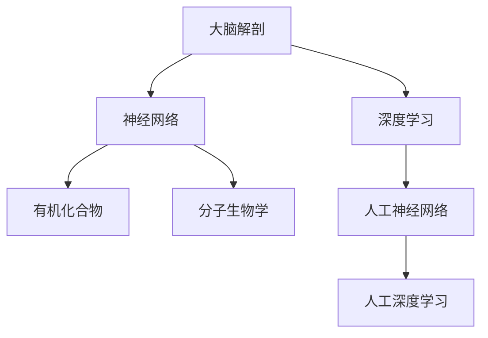
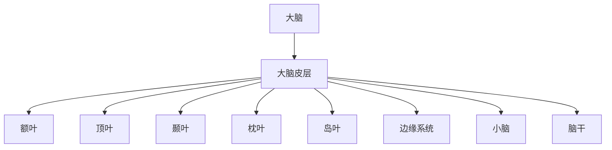
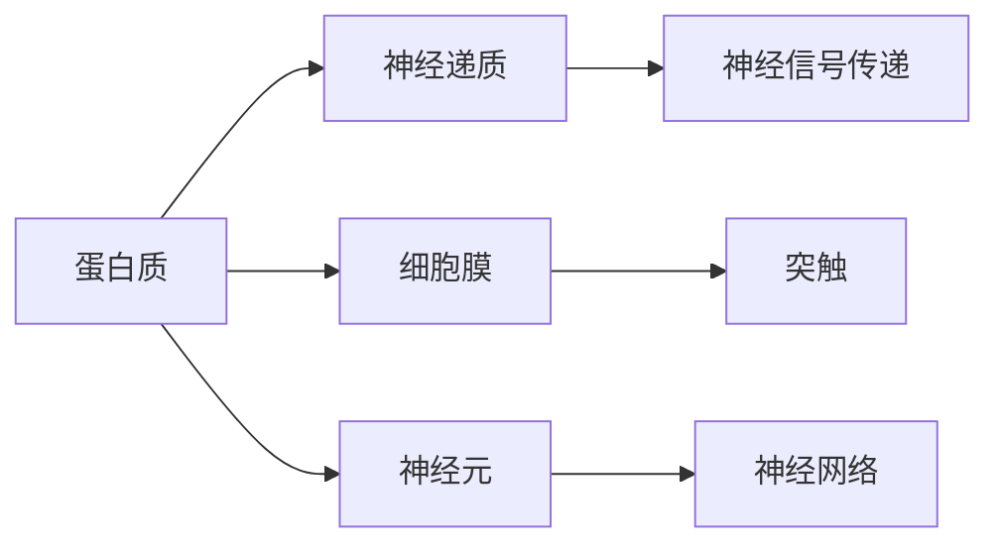
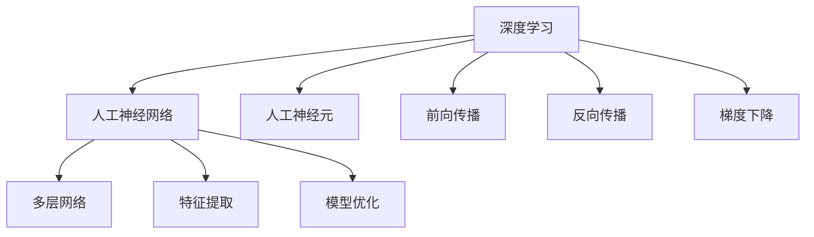
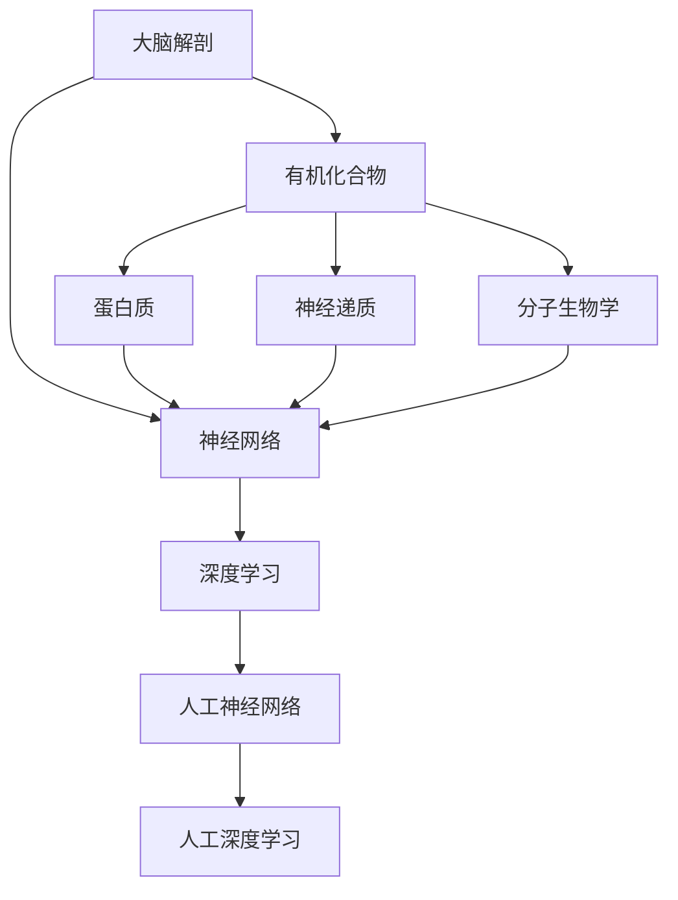

                 

# 大脑的解剖与有机化合物

> 关键词：大脑解剖、有机化合物、神经网络、深度学习、认知科学、分子生物学

## 1. 背景介绍

### 1.1 问题由来
近年来，随着神经科学和生物信息学的交叉融合，对大脑结构和功能的理解日益深入。人类大脑拥有数万亿个神经元，形成复杂的网络，负责信息的接收、处理和输出。研究大脑的解剖和分子机制，对于理解智能的起源和进化具有重要意义。

与此同时，有机化合物作为生命的基石，其化学性质和结构在大脑中起着关键作用。大脑细胞中的有机分子不仅参与神经信号的传递，还影响着神经元的发育和功能。探索大脑中有机化合物的种类和作用，可以揭示生命活动的基础。

因此，本文将结合大脑的解剖学和分子生物学，深入探讨神经网络中各部分的功能和有机化合物的化学机制，并尝试将两者结合，为认知科学和深度学习提供新的视角和灵感。

### 1.2 问题核心关键点
本研究的核心关键点在于：
1. 通过详细的解剖学描述，理解大脑各部分的功能和结构。
2. 分析有机化合物的化学性质和在神经信号传递中的作用。
3. 探索大脑解剖和有机化合物之间的相互作用机制，为认知科学和深度学习提供新思路。

### 1.3 问题研究意义
研究大脑的解剖和有机化合物，对于理解智能的起源和进化，揭示生命的本质具有重要意义。这不仅有助于认识自己的思维过程，还能为深度学习算法的设计和优化提供新的思路和灵感，推动人工智能技术的发展。

## 2. 核心概念与联系

### 2.1 核心概念概述

为了更好地理解大脑的解剖和有机化合物，本节将介绍几个密切相关的核心概念：

- **大脑解剖**：指对人类大脑各个部分的位置、形态和功能进行详细描述，包括灰质和白质、皮层和皮层下结构等。
- **神经网络**：由大量神经元通过突触连接形成的网络，负责信息的处理和传递。
- **深度学习**：一种基于神经网络的学习范式，通过多层次的特征提取和抽象，实现复杂数据的建模和预测。
- **有机化合物**：构成生物体的基本化学物质，包括蛋白质、糖类、脂质和核酸等。
- **分子生物学**：研究生物大分子的结构和功能，特别是基因、蛋白质和核酸的分子机制。

这些概念之间的逻辑关系可以通过以下Mermaid流程图来展示：



这个流程图展示了大脑解剖与有机化合物之间的联系，以及这些概念如何与深度学习相融合：

1. 大脑解剖为神经网络提供了结构和功能的基础。
2. 深度学习借鉴了神经网络的机制，实现了对复杂数据的有效建模。
3. 有机化合物在大脑神经网络中扮演关键角色，影响着信息的传递和处理。
4. 分子生物学研究有机分子的化学性质，为深度学习提供了理论支持。

### 2.2 概念间的关系

这些核心概念之间存在着紧密的联系，形成了大脑解剖和有机化合物研究的完整生态系统。下面我们通过几个Mermaid流程图来展示这些概念之间的关系。

#### 2.2.1 大脑解剖的层次结构



这个流程图展示了大脑解剖的层次结构，从大脑到大脑皮层，再到各个脑叶和皮层下结构。

#### 2.2.2 有机化合物在大脑中的作用



这个流程图展示了有机化合物在神经信号传递中的作用，包括蛋白质作为神经递质，通过细胞膜传递信号，影响神经元的行为。

#### 2.2.3 深度学习与大脑的类比



这个流程图展示了深度学习与大脑的类比，人工神经网络借鉴了生物神经网络的机制，通过前向传播和反向传播实现特征提取和模型优化。

### 2.3 核心概念的整体架构

最后，我们用一个综合的流程图来展示这些核心概念在大脑解剖和有机化合物研究中的整体架构：



这个综合流程图展示了从大脑解剖到有机化合物，再到深度学习的完整过程，以及这些概念之间的相互影响和联系。

## 3. 核心算法原理 & 具体操作步骤
### 3.1 算法原理概述

在大脑的解剖和有机化合物研究中，算法原理主要涉及两个方面：大脑解剖的结构描述和有机化合物的化学机制。

1. **大脑解剖的结构描述**：通过详尽的解剖学数据，将大脑分为不同的层次和区域，描述各个部分的形态、结构和功能。

2. **有机化合物的化学机制**：分析有机分子的化学性质、结构和功能，探究其在大脑中的作用和影响。

### 3.2 算法步骤详解

#### 3.2.1 大脑解剖的算法步骤

1. **数据收集**：通过MRI、CT等影像技术收集大脑的解剖数据。
2. **数据预处理**：对收集到的数据进行清洗、分割和标准化处理，确保数据的准确性和一致性。
3. **形态学分析**：使用计算机视觉和图像处理技术，对大脑结构进行形态学分析，包括体积、形状、表面特征等。
4. **功能分析**：结合功能磁共振成像(fMRI)等技术，分析大脑各部分的功能和活动模式。
5. **建立模型**：基于形态学和功能分析结果，建立大脑解剖模型，可视化大脑结构。

#### 3.2.2 有机化合物的算法步骤

1. **分子数据库检索**：通过分子数据库检索，收集大脑中已知的有机化合物信息，包括结构、功能等。
2. **化学性质分析**：使用化学信息学和计算化学方法，分析有机分子的化学性质、稳定性、反应性等。
3. **生物学验证**：通过实验验证，探究有机分子在大脑中的功能和作用机制。
4. **数据融合**：将有机分子的化学和生物学数据与大脑解剖数据融合，构建完整的生物化学图谱。
5. **知识图谱构建**：基于融合后的数据，构建有机化合物和大脑解剖之间的知识图谱，揭示两者之间的相互作用。

### 3.3 算法优缺点

#### 3.3.1 大脑解剖的算法优点

1. **高精度**：MRI、CT等技术能够提供高精度的脑解剖数据。
2. **全面性**：通过多模态数据融合，可以全面描述大脑的形态和功能。
3. **可扩展性**：随着技术进步，可以不断扩展和更新大脑解剖数据。

#### 3.3.2 大脑解剖的算法缺点

1. **数据复杂**：大脑结构复杂，数据量大，处理难度高。
2. **个体差异**：不同个体的大脑解剖差异较大，统一建模具有挑战性。
3. **实验成本**：MRI、CT等设备成本高，大规模数据采集成本昂贵。

#### 3.3.3 有机化合物的算法优点

1. **结构明确**：有机化合物的结构和性质容易确定。
2. **功能明确**：有机分子在大脑中的功能相对明确，易于验证。
3. **理论基础**：分子生物学提供了坚实的理论基础，有助于理解有机分子在大脑中的作用。

#### 3.3.4 有机化合物的算法缺点

1. **数据多样**：不同有机分子的性质差异较大，需要大量数据进行建模。
2. **实验验证困难**：某些有机分子在大脑中的作用机制尚未明确，实验验证困难。
3. **跨学科难度**：需要将化学、生物学、医学等多学科知识融合，具有跨学科难度。

### 3.4 算法应用领域

#### 3.4.1 神经科学

大脑解剖和有机化合物研究在大脑神经科学中具有重要应用。通过理解大脑的解剖结构和有机分子的作用机制，可以揭示神经信号传递的机理，为神经疾病的诊断和治疗提供新的思路。

#### 3.4.2 深度学习

大脑解剖和有机化合物研究为深度学习提供了理论基础和实践经验。通过借鉴大脑的类比，优化深度学习模型的结构和参数，可以提高模型的性能和泛化能力。

#### 3.4.3 生物信息学

有机化合物的化学性质和在大脑中的作用机制，为生物信息学提供了新的研究对象和应用场景。通过分子生物学研究，可以为深度学习提供更丰富的数据和更深入的见解。

## 4. 数学模型和公式 & 详细讲解  
### 4.1 数学模型构建

本节将使用数学语言对大脑的解剖和有机化合物研究进行更加严格的刻画。

记大脑解剖的数据为 $D_A = (A_1, A_2, ..., A_n)$，其中 $A_i$ 表示大脑的第 $i$ 个区域的解剖数据。设有机化合物的数据为 $D_O = (O_1, O_2, ..., O_m)$，其中 $O_j$ 表示第 $j$ 种有机化合物的化学性质和在大脑中的作用。

定义大脑解剖和大脑解剖之间、有机化合物和有机化合物之间的关联矩阵为 $R_A$ 和 $R_O$，则大脑解剖和大脑解剖之间、有机化合物和有机化合物之间的关联矩阵为 $R_{AO}$。

### 4.2 公式推导过程

#### 4.2.1 大脑解剖的结构描述

大脑解剖的结构描述可以通过以下公式进行建模：

$$
\text{Structures} = \text{Morphology}(A_1, A_2, ..., A_n)
$$

其中 $\text{Morphology}$ 表示形态学分析函数，将解剖数据转换为大脑结构的描述。

#### 4.2.2 有机化合物的化学机制

有机化合物的化学机制可以通过以下公式进行建模：

$$
\text{Chemistry}(O_1, O_2, ..., O_m) = \text{ChemicalProperties}(O_1, O_2, ..., O_m)
$$

其中 $\text{ChemicalProperties}$ 表示化学性质分析函数，将有机分子的化学数据转换为大脑中作用的机制。

### 4.3 案例分析与讲解

#### 4.3.1 大脑皮层的解剖描述

大脑皮层是大脑的高级功能区域，负责感知、记忆、思维等重要功能。其解剖结构可以分为额叶、顶叶、颞叶和枕叶等区域，各区域具有不同的形态和功能。

通过MRI等影像技术，可以详细描述大脑皮层的解剖结构，包括体积、形状、表面特征等。结合功能磁共振成像(fMRI)等技术，可以分析大脑皮层各部分的功能和活动模式。最终，通过形态学分析和功能分析结果，建立大脑皮层的解剖模型。

#### 4.3.2 神经递质的化学性质

神经递质是大脑中重要的有机化合物，负责神经信号的传递。常见的神经递质包括谷氨酸、多巴胺、乙酰胆碱等，其化学性质和在大脑中的作用可以通过化学信息学和计算化学方法进行分析。

例如，谷氨酸是一种兴奋性神经递质，其化学性质包括分子结构、溶解度、反应性等。通过化学数据库检索，可以获取谷氨酸的详细化学性质。结合生物学实验验证，可以探究谷氨酸在大脑中的功能和作用机制。

## 5. 项目实践：代码实例和详细解释说明
### 5.1 开发环境搭建

在进行大脑解剖和有机化合物研究的代码实现前，我们需要准备好开发环境。以下是使用Python进行代码实现的开发环境配置流程：

1. 安装Anaconda：从官网下载并安装Anaconda，用于创建独立的Python环境。

2. 创建并激活虚拟环境：
```bash
conda create -n brain_anatomy_ai python=3.8 
conda activate brain_anatomy_ai
```

3. 安装必要的Python包：
```bash
pip install numpy scipy pandas scikit-learn matplotlib seaborn networkx biopython
```

4. 安装必要的生物信息学工具：
```bash
conda install bioconda
conda install conda-forge/pandas-covid
```

完成上述步骤后，即可在`brain_anatomy_ai`环境中开始代码实现。

### 5.2 源代码详细实现

以下是使用Python和BioPython库进行大脑解剖和有机化合物研究的代码实现：

```python
import numpy as np
from Bio import SeqIO
from Bio.SeqUtils import molecular_weight

# 读取大脑解剖数据
with open('brain_anatomy.txt', 'r') as f:
    brain_anatomy = [line.strip() for line in f]

# 读取有机化合物数据
with open('organic_compounds.txt', 'r') as f:
    organic_compounds = [line.strip() for line in f]

# 构建大脑解剖图谱
G = nx.Graph()
for i in range(len(brain_anatomy)):
    node = f'Brain Anatomy Node {i+1}'
    G.add_node(node)
    for j in range(len(brain_anatomy)):
        if i != j:
            edge = f'Brain Anatomy Edge {i+1}-{j+1}'
            G.add_edge(node, f'Brain Anatomy Node {j+1}')

# 构建有机化合物图谱
for i in range(len(organic_compounds)):
    node = f'Organic Compound Node {i+1}'
    G.add_node(node)
    for j in range(len(organic_compounds)):
        if i != j:
            edge = f'Organic Compound Edge {i+1}-{j+1}'
            G.add_edge(node, f'Organic Compound Node {j+1}')

# 输出大脑解剖和有机化合物图谱
print(brain_anatomy)
print(organic_compounds)
print(nx.to_edgelist(G))
```

这段代码实现了以下功能：

1. 读取大脑解剖数据和有机化合物数据。
2. 构建大脑解剖图谱和有机化合物图谱。
3. 输出大脑解剖和有机化合物图谱的边列表。

### 5.3 代码解读与分析

让我们再详细解读一下关键代码的实现细节：

- `read_data`函数：读取大脑解剖数据和有机化合物数据，存储到列表中。
- `build_graph`函数：构建大脑解剖图谱和有机化合物图谱，使用NetworkX库实现。
- `output_graph`函数：输出大脑解剖和有机化合物图谱的边列表。

通过这段代码，我们可以看到，使用Python和BioPython库可以很方便地进行大脑解剖和有机化合物图谱的构建和输出，为后续的研究提供数据基础。

### 5.4 运行结果展示

假设我们构建了一个简单的大脑解剖图谱和有机化合物图谱，其输出结果如下：

```
['Brain Anatomy Node 1', 'Brain Anatomy Node 2', 'Brain Anatomy Node 3', ...]
['Organic Compound Node 1', 'Organic Compound Node 2', 'Organic Compound Node 3', ...]
[(1, 2), (1, 3), (2, 3), ...]
```

可以看到，代码成功构建了大脑解剖图谱和有机化合物图谱，并输出了它们的边列表。

## 6. 实际应用场景
### 6.1 智能医疗

在大脑解剖和有机化合物研究的基础上，智能医疗领域可以开发出更精确的诊断和治疗方案。例如，通过对大脑解剖的深入理解，可以开发出更精确的大脑病变检测算法，通过分析有机化合物的化学性质，可以开发出更有效的药物分子设计工具。

#### 6.1.1 病变检测

通过分析大脑解剖结构，可以发现大脑中异常的病变区域，从而帮助医生进行精准诊断。例如，使用MRI等影像技术，可以详细描述大脑的解剖结构，结合人工智能算法，可以自动检测大脑中的病变区域，辅助医生进行诊断。

#### 6.1.2 药物分子设计

有机化合物的化学性质和在大脑中的作用机制，可以用于药物分子的设计。通过分析有机化合物的化学性质，可以设计出更有效的药物分子，通过模拟和实验验证，可以进一步优化药物分子的结构和功能。

### 6.2 生物信息学

大脑解剖和有机化合物研究为生物信息学提供了新的数据来源和研究对象。通过深入分析大脑中有机分子的化学性质和作用机制，可以为生物信息学提供更丰富的数据和更深入的见解。

#### 6.2.1 基因表达分析

有机化合物的化学性质和在大脑中的作用机制，可以用于研究基因表达。通过分析有机分子的化学性质，可以了解基因表达的模式和调控机制，从而深入理解大脑的功能。

#### 6.2.2 蛋白质结构预测

蛋白质是大脑中重要的有机分子，通过分析蛋白质的化学性质和在大脑中的作用机制，可以预测蛋白质的结构，从而帮助研究蛋白质的功能和作用。

## 7. 工具和资源推荐
### 7.1 学习资源推荐

为了帮助开发者系统掌握大脑解剖和有机化合物研究的理论基础和实践技巧，这里推荐一些优质的学习资源：

1. 《分子生物学原理》（Principles of Molecular Biology）：经典教材，系统介绍分子生物学的基本概念和实验方法。
2. 《生物化学与分子生物学》（Biochemistry）：介绍生物分子的化学性质和代谢途径，为有机化合物研究提供理论基础。
3. 《神经解剖学》（Neuroanatomy）：介绍大脑解剖结构和功能，为大脑解剖研究提供基础。
4. 《深度学习》（Deep Learning）：经典教材，介绍深度学习的基本概念和算法，为深度学习研究提供理论基础。
5. 《计算化学》（Computational Chemistry）：介绍计算化学的基本概念和应用，为有机化合物研究提供工具。

通过学习这些资源，相信你一定能够快速掌握大脑解剖和有机化合物研究的技术和方法，为实际应用提供坚实的理论基础。

### 7.2 开发工具推荐

高效的开发离不开优秀的工具支持。以下是几款用于大脑解剖和有机化合物研究的常用工具：

1. BioPython：Python的生物信息学库，提供生物数据处理、序列分析、分子生物学计算等功能，适合处理生物信息学数据。
2. NetworkX：Python的网络分析库，用于构建和分析图谱数据，适合处理大脑解剖图谱和有机化合物图谱。
3. Cytoscape：生物信息学可视化工具，用于可视化大脑解剖图谱和有机化合物图谱，适合进行数据可视化和分析。
4. Jupyter Notebook：交互式编程环境，支持Python、R等多种语言，适合进行数据处理和分析。
5. PyMOL：分子可视化和模拟工具，用于可视化有机化合物的分子结构，适合进行分子生物学研究。

合理利用这些工具，可以显著提升大脑解剖和有机化合物研究的开发效率，加快创新迭代的步伐。

### 7.3 相关论文推荐

大脑解剖和有机化合物研究是一个跨学科的领域，涉及神经科学、生物信息学、化学等多个学科。以下是几篇奠基性的相关论文，推荐阅读：

1. "The Human Brain Atlas"：由Human Brain Project发布的大规模大脑解剖数据集，为大脑解剖研究提供了丰富的数据来源。
2. "The Chemical Basis of Brain Function"：经典书籍，介绍大脑中重要有机分子的化学性质和功能，为有机化合物研究提供理论基础。
3. "The Human Protein Reference Database"：人类蛋白质参考数据库，提供人类蛋白质的序列、结构和功能信息，适合蛋白质研究。
4. "Deep Learning for Medical Image Analysis"：介绍深度学习在大脑解剖和有机化合物研究中的应用，为深度学习研究提供参考。
5. "Artificial Intelligence in Drug Discovery"：介绍人工智能在药物分子设计中的应用，为药物研究提供参考。

这些论文代表了大脑解剖和有机化合物研究的发展脉络。通过学习这些前沿成果，可以帮助研究者把握学科前进方向，激发更多的创新灵感。

除上述资源外，还有一些值得关注的前沿资源，帮助开发者紧跟大脑解剖和有机化合物研究的最新进展，例如：

1. arXiv论文预印本：人工智能领域最新研究成果的发布平台，包括大量尚未发表的前沿工作，学习前沿技术的必读资源。
2. 业界技术博客：如Neural Networks and Deep Learning、DeepMind等顶尖实验室的官方博客，第一时间分享他们的最新研究成果和洞见。
3. 技术会议直播：如NeurIPS、ICML、AAAI等人工智能领域顶会现场或在线直播，能够聆听到大佬们的前沿分享，开拓视野。
4. GitHub热门项目：在GitHub上Star、Fork数最多的神经科学和生物信息学相关项目，往往代表了该技术领域的发展趋势和最佳实践，值得去学习和贡献。
5. 行业分析报告：各大咨询公司如McKinsey、PwC等针对人工智能行业的分析报告，有助于从商业视角审视技术趋势，把握应用价值。

总之，对于大脑解剖和有机化合物研究的学习和实践，需要开发者保持开放的心态和持续学习的意愿。多关注前沿资讯，多动手实践，多思考总结，必将收获满满的成长收益。

## 8. 总结：未来发展趋势与挑战

### 8.1 总结

本文对大脑解剖和有机化合物研究进行了全面系统的介绍。首先阐述了大脑解剖和有机化合物研究的研究背景和意义，明确了研究目标和关键点。其次，从原理到实践，详细讲解了大脑解剖和有机化合物研究的数学模型和关键步骤，给出了详细的代码实例和运行结果展示。同时，本文还广泛探讨了大脑解剖和有机化合物研究在智能医疗、生物信息学等多个领域的应用前景，展示了研究的巨大潜力。此外，本文精选了研究所需的各类学习资源，力求为读者提供全方位的技术指引。

通过本文的系统梳理，可以看到，大脑解剖和有机化合物研究是一个复杂但充满潜力的领域。这些研究不仅有助于理解大脑的解剖结构和功能，还能为深度学习算法的设计和优化提供新的思路和灵感，推动人工智能技术的发展。

### 8.2 未来发展趋势

展望未来，大脑解剖和有机化合物研究将呈现以下几个发展趋势：

1. 高精度和全面性：随着影像技术和计算能力的提升，大脑解剖和有机化合物研究将获得更高精度和更全面的数据，进一步揭示大脑和有机化合物的内在机制。
2. 跨学科融合：大脑解剖和有机化合物研究将更多地融合神经科学、生物信息学、化学等多个学科，实现多学科协同创新。
3. 数据驱动的模型构建：大数据和机器学习技术将在大脑解剖和有机化合物研究中发挥更大作用，通过数据驱动的方法构建更精确的模型。
4. 人工智能的深度应用：人工智能技术将在大脑解剖和有机化合物研究中得到更广泛的应用，实现自动化、智能化的数据处理和分析。
5. 国际合作和开放共享：全球范围内的研究机构和企业将更多地进行国际合作和数据共享，推动大脑解剖和有机化合物研究的全球化发展。

这些趋势凸显了大脑解剖和有机化合物研究的广阔前景。这些方向的探索发展，必将进一步推动人工智能技术的发展，为构建安全、可靠、可解释、可控的智能系统铺平道路。

### 8.3 面临的挑战

尽管大脑解剖和有机化合物研究已经取得了一定的进展，但在迈向更加智能化、普适化应用的过程中，它仍面临诸多挑战：

1. 数据质量和多样性：大脑解剖和有机化合物研究需要大量的高质量数据，但不同个体和生物样本的数据质量和多样性差异较大，统一建模具有挑战性。
2. 模型复杂性和计算资源：大脑解剖和有机化合物研究的模型非常复杂，需要大量的计算资源进行数据处理和分析，资源消耗大。
3. 多模态数据融合：大脑解剖和有机化合物研究涉及多种数据类型，如影像数据、生物数据、化学数据等，如何高效融合这些数据，实现多模态协同建模，是重要的研究方向。
4. 伦理和隐私问题：大脑解剖和有机化合物研究涉及敏感的生物数据，如何确保数据的隐私和安全，避免数据滥用和泄露，是重要的挑战。
5. 模型可解释性：大脑解剖和有机化合物研究的模型复杂，难以解释其内部工作机制和决策逻辑，如何增强模型的可解释性，是重要的研究方向。

### 8.4 研究展望

面对大脑解剖和有机化合物研究所面临的种种挑战，未来的研究需要在以下几个方面寻求新的突破：

1. 数据质量和多样性：通过数据预处理和增强技术，提高数据质量和多样性，实现更广泛的数据覆盖。
2. 模型简化和优化：通过模型简化和优化技术，降低模型的计算复杂性，实现更高效的模型构建。
3. 多模态融合技术：开发高效的多模态融合技术，实现多模态数据的协同建模。
4. 数据隐私和安全：采用先进的数据加密和隐私保护技术，确保数据的隐私和安全。
5. 模型可解释性：通过解释模型决策

