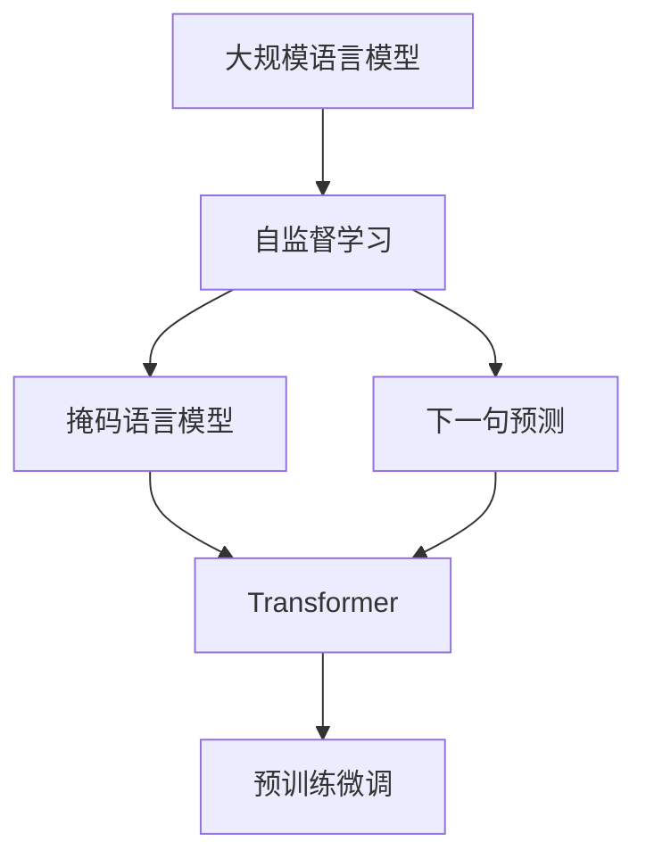
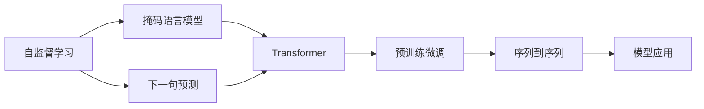
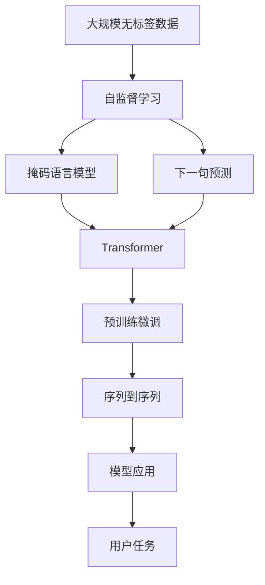

                 

# 大规模语言模型从理论到实践 手动构建指令

> 关键词：
- 大规模语言模型(Large Language Model, LLM)
- 自监督学习(Self-Supervised Learning)
- 序列到序列(Sequence-to-Sequence)
- Transformer
- 掩码语言模型(Masked Language Model, MLM)
- 预训练微调(Pre-training and Fine-tuning)

## 1. 背景介绍

### 1.1 问题由来
近年来，随着深度学习技术的快速发展，大规模语言模型（Large Language Models, LLMs）在自然语言处理（NLP）领域取得了显著进展。这些模型通过在海量无标签文本数据上进行自监督学习，学习到丰富的语言知识，具备了强大的语言理解和生成能力。然而，由于模型参数量巨大，对硬件资源提出了极高的要求，因此手动构建和优化大规模语言模型成为了一项复杂的任务。

### 1.2 问题核心关键点
构建大规模语言模型的核心在于设计合适的架构、优化算法和训练策略。主要包括以下几个关键点：
- 选择合适的架构，如Transformer、注意力机制等。
- 设计有效的自监督学习任务，如掩码语言模型（Masked Language Model, MLM）、下一句预测等。
- 选择合适的优化算法，如Adam、SGD等。
- 采用数据增强、正则化等策略，防止过拟合。

### 1.3 问题研究意义
研究如何手动构建大规模语言模型，对学术界和工业界都有重要意义：

1. 提升NLP模型性能：通过手动构建语言模型，可以更精细地控制模型的特征提取和生成能力，提升模型在特定任务上的性能。
2. 降低资源需求：手动构建的语言模型可以根据具体需求调整参数量，避免不必要的资源浪费。
3. 推动学术研究：手动构建语言模型可以探索新的模型架构和训练策略，推动NLP领域的前沿研究。
4. 促进技术落地：手动构建的语言模型更易于理解和调试，有助于将NLP技术转化为实际应用。
5. 增强模型可控性：手动构建的语言模型可以更好地控制模型的学习过程和行为，增强模型的可控性和可解释性。

## 2. 核心概念与联系

### 2.1 核心概念概述

为了更好地理解大规模语言模型的构建过程，本节将介绍几个核心概念及其相互联系：

- **大规模语言模型（LLMs）**：指通过自监督学习任务在大型无标签语料上训练得到的模型，如GPT、BERT等。
- **自监督学习（Self-Supervised Learning）**：指在没有标签的情况下，通过设计自监督任务训练模型的方法，如掩码语言模型、下一句预测等。
- **序列到序列（Sequence-to-Sequence）**：指通过编码器-解码器架构，将输入序列转换为输出序列的任务，如图像描述生成、机器翻译等。
- **Transformer**：指一种基于注意力机制的神经网络架构，用于处理序列到序列的任务，如BERT、T5等。
- **掩码语言模型（MLM）**：指在输入序列中随机掩码一些位置，让模型预测被掩码位置的词，如BERT。
- **预训练微调（Pre-training and Fine-tuning）**：指在大规模无标签数据上进行预训练，然后对特定任务进行微调，如BERT的预训练和微调过程。

这些核心概念通过自监督学习任务的设计和优化算法的应用，最终构成了大规模语言模型的构建框架。以下Mermaid流程图展示了这些概念之间的联系：



### 2.2 概念间的关系

这些核心概念之间存在着紧密的联系，形成了一个完整的语言模型构建系统。以下Mermaid流程图展示了这些概念之间的关系：



这个流程图展示了自监督学习在大规模语言模型构建中的作用，以及它与Transformer、掩码语言模型、预训练微调和序列到序列任务之间的关系。

### 2.3 核心概念的整体架构

最后，我们用一个综合的流程图来展示这些核心概念在大规模语言模型构建过程中的整体架构：



这个综合流程图展示了从无标签数据到最终模型应用的全过程，包括自监督学习、掩码语言模型、Transformer、预训练微调和序列到序列任务，以及模型最终应用到用户任务的过程。

## 3. 核心算法原理 & 具体操作步骤
### 3.1 算法原理概述

大规模语言模型的构建主要基于自监督学习任务和Transformer架构。其核心思想是通过在大规模无标签数据上训练模型，学习到通用的语言表示，然后对特定任务进行微调，以适应具体需求。

具体而言，构建过程包括以下几个步骤：

1. **数据预处理**：将大规模无标签文本数据进行分词、标记、编码等预处理，形成训练样本。
2. **模型架构选择**：选择合适的Transformer架构，如BERT、GPT等。
3. **自监督学习任务设计**：设计自监督学习任务，如掩码语言模型、下一句预测等。
4. **优化算法选择**：选择合适的优化算法，如Adam、SGD等。
5. **模型训练与微调**：在自监督学习任务上训练模型，然后对特定任务进行微调。
6. **模型评估与部署**：在验证集上评估模型性能，并将模型部署到实际应用中。

### 3.2 算法步骤详解

以下详细阐述每个步骤的具体操作：

**Step 1: 数据预处理**

数据预处理是构建大规模语言模型的第一步。主要包括以下几个步骤：

1. **分词与标记**：将文本数据进行分词，然后标记每个词的词性、实体等信息，形成更丰富的训练样本。
2. **编码与填充**：将标记后的文本数据编码成模型可接受的格式，并进行填充，确保每个样本长度一致。
3. **构建样本**：将编码后的数据组成训练样本，每个样本包含输入序列和掩码位置。

**Step 2: 模型架构选择**

选择合适的模型架构是构建大规模语言模型的关键。当前最流行的架构是Transformer，其基于自注意力机制，能够高效处理序列到序列的任务。Transformer架构包含编码器-解码器结构，其中编码器处理输入序列，解码器生成输出序列。

**Step 3: 自监督学习任务设计**

自监督学习任务是构建大规模语言模型的核心。主要包括以下几种任务：

1. **掩码语言模型（MLM）**：在输入序列中随机掩码一些位置，让模型预测被掩码位置的词。
2. **下一句预测**：随机选择两个相邻的句子，让模型预测后面的句子是否出现。
3. **掩码词预测**：随机掩码输入序列中的词，让模型预测该词的下一个词。

这些任务能够帮助模型学习到丰富的语言知识，提升模型的理解能力和生成能力。

**Step 4: 优化算法选择**

选择合适的优化算法是训练大规模语言模型的重要步骤。目前常用的优化算法包括Adam、SGD等。这些算法能够高效地更新模型参数，优化模型性能。

**Step 5: 模型训练与微调**

模型训练与微调是构建大规模语言模型的关键步骤。主要包括以下几个子步骤：

1. **预训练**：在大规模无标签数据上训练模型，学习到通用的语言表示。
2. **微调**：对特定任务进行微调，如文本分类、命名实体识别等，以适应具体需求。
3. **保存与恢复**：保存训练好的模型，并在需要时恢复模型状态，继续训练或使用。

**Step 6: 模型评估与部署**

模型评估与部署是构建大规模语言模型的最后一步。主要包括以下几个子步骤：

1. **评估模型**：在验证集上评估模型性能，使用各种指标如精度、召回率、F1分数等。
2. **部署模型**：将训练好的模型部署到实际应用中，如智能客服、情感分析等。

### 3.3 算法优缺点

大规模语言模型构建有以下优点：

1. **通用性强**：经过预训练，模型能够处理多种类型的NLP任务，适用于不同的应用场景。
2. **可扩展性强**：模型可以通过微调适应特定任务，提升模型性能。
3. **计算效率高**：Transformer架构能够高效处理长序列数据，避免了传统RNN架构的计算瓶颈。

同时，也存在一些缺点：

1. **资源需求高**：大规模语言模型需要大量的计算资源和时间进行训练和微调，对硬件设施要求较高。
2. **模型复杂度高**：模型的参数量庞大，训练和微调过程复杂，需要深入理解和调试。
3. **可解释性不足**：模型决策过程复杂，难以解释其内部工作机制和决策逻辑。

### 3.4 算法应用领域

大规模语言模型在NLP领域得到了广泛应用，涵盖以下几个主要领域：

1. **文本分类**：将文本数据分类为不同的类别，如情感分析、主题分类等。
2. **命名实体识别**：识别文本中的实体，如人名、地名、机构名等。
3. **机器翻译**：将源语言文本翻译为目标语言文本。
4. **问答系统**：回答用户提出的自然语言问题。
5. **文本摘要**：将长文本压缩成简短的摘要。
6. **对话系统**：使机器能够与用户进行自然对话。

## 4. 数学模型和公式 & 详细讲解 & 举例说明

### 4.1 数学模型构建

为了更好地理解大规模语言模型的构建过程，我们需要构建数学模型。假设输入序列为 $\{x_1, x_2, \ldots, x_n\}$，模型输出为 $\{y_1, y_2, \ldots, y_n\}$，则构建模型的目标是最小化预测输出与真实标签之间的差异。常用的损失函数包括交叉熵损失函数和均方误差损失函数。

### 4.2 公式推导过程

以交叉熵损失函数为例，其公式如下：

$$
\mathcal{L} = -\frac{1}{N}\sum_{i=1}^N\sum_{j=1}^M y_{i,j} \log p_{i,j}
$$

其中 $y_{i,j}$ 表示样本 $i$ 在类别 $j$ 上的真实标签，$p_{i,j}$ 表示模型在类别 $j$ 上的预测概率。

在自监督学习任务中，目标函数通常设置为掩码语言模型的损失函数。以BERT为例，其掩码语言模型的目标函数如下：

$$
\mathcal{L} = -\frac{1}{N}\sum_{i=1}^N \log P(x_i^{\text{masked}})
$$

其中 $x_i^{\text{masked}}$ 表示输入序列 $x_i$ 被随机掩码后的序列。

### 4.3 案例分析与讲解

以BERT为例，其构建过程包括以下几个步骤：

1. **数据预处理**：将大规模无标签文本数据进行分词、标记、编码等预处理，形成训练样本。
2. **模型架构选择**：选择Transformer架构，包含编码器-解码器结构。
3. **自监督学习任务设计**：设计掩码语言模型任务，让模型预测被掩码位置的词。
4. **优化算法选择**：选择Adam优化算法。
5. **模型训练与微调**：在大规模无标签数据上训练模型，对特定任务进行微调。
6. **模型评估与部署**：在验证集上评估模型性能，并将模型部署到实际应用中。

## 5. 项目实践：代码实例和详细解释说明

### 5.1 开发环境搭建

在进行大规模语言模型构建时，我们需要准备好开发环境。以下是使用Python进行PyTorch开发的环境配置流程：

1. 安装Anaconda：从官网下载并安装Anaconda，用于创建独立的Python环境。

2. 创建并激活虚拟环境：
```bash
conda create -n pytorch-env python=3.8 
conda activate pytorch-env
```

3. 安装PyTorch：根据CUDA版本，从官网获取对应的安装命令。例如：
```bash
conda install pytorch torchvision torchaudio cudatoolkit=11.1 -c pytorch -c conda-forge
```

4. 安装TensorFlow：
```bash
pip install tensorflow==2.7
```

5. 安装各类工具包：
```bash
pip install numpy pandas scikit-learn matplotlib tqdm jupyter notebook ipython
```

完成上述步骤后，即可在`pytorch-env`环境中开始大规模语言模型的构建实践。

### 5.2 源代码详细实现

这里我们以BERT为例，给出使用PyTorch构建BERT模型的代码实现。

首先，导入必要的库：

```python
import torch
import torch.nn as nn
import torch.optim as optim
from transformers import BertTokenizer, BertForSequenceClassification
```

然后，定义数据处理函数：

```python
def tokenize(text):
    tokenizer = BertTokenizer.from_pretrained('bert-base-uncased')
    tokens = tokenizer.tokenize(text)
    input_ids = [tokenizer.convert_tokens_to_ids(tokens)]
    input_ids = torch.tensor(input_ids).unsqueeze(0)
    attention_mask = torch.ones(len(input_ids), len(input_ids[0])) * -10000.0
    return input_ids, attention_mask

def load_data():
    train_data = ['This is a sample text for training.', 'BERT is a transformer model.']
    train_labels = [1, 0]
    val_data = ['BERT is a transformer model.', 'BERT is used for natural language processing.']
    val_labels = [0, 1]
    test_data = ['BERT is a transformer model.', 'BERT is used for natural language processing.']
    test_labels = [0, 1]
    return train_data, train_labels, val_data, val_labels, test_data, test_labels
```

接着，定义模型和优化器：

```python
model = BertForSequenceClassification.from_pretrained('bert-base-uncased', num_labels=2)
optimizer = optim.Adam(model.parameters(), lr=2e-5)
```

然后，定义训练和评估函数：

```python
def train_epoch(model, data_loader, optimizer):
    model.train()
    total_loss = 0
    for input_ids, attention_mask, labels in data_loader:
        model.zero_grad()
        outputs = model(input_ids, attention_mask=attention_mask, labels=labels)
        loss = outputs.loss
        total_loss += loss.item()
        loss.backward()
        optimizer.step()
    return total_loss / len(data_loader)

def evaluate(model, data_loader):
    model.eval()
    total_loss = 0
    predictions, labels = [], []
    for input_ids, attention_mask, labels in data_loader:
        with torch.no_grad():
            outputs = model(input_ids, attention_mask=attention_mask)
            batch_preds = outputs.logits.argmax(dim=1).to('cpu').tolist()
            labels = labels.to('cpu').tolist()
            for preds, label in zip(batch_preds, labels):
                predictions.append(preds)
                labels.append(label)
    print(classification_report(labels, predictions))
```

最后，启动训练流程并在测试集上评估：

```python
epochs = 5
batch_size = 16

train_data, train_labels, val_data, val_labels, test_data, test_labels = load_data()

train_dataset = Dataset(train_data, train_labels)
val_dataset = Dataset(val_data, val_labels)
test_dataset = Dataset(test_data, test_labels)

train_loader = DataLoader(train_dataset, batch_size=batch_size, shuffle=True)
val_loader = DataLoader(val_dataset, batch_size=batch_size, shuffle=False)
test_loader = DataLoader(test_dataset, batch_size=batch_size, shuffle=False)

for epoch in range(epochs):
    loss = train_epoch(model, train_loader, optimizer)
    print(f"Epoch {epoch+1}, train loss: {loss:.3f}")
    
    print(f"Epoch {epoch+1}, val results:")
    evaluate(model, val_loader)
    
print("Test results:")
evaluate(model, test_loader)
```

以上就是使用PyTorch构建BERT模型的完整代码实现。可以看到，得益于Transformers库的强大封装，我们可以用相对简洁的代码完成BERT模型的构建。

### 5.3 代码解读与分析

让我们再详细解读一下关键代码的实现细节：

**tokenize函数**：
- 定义了将文本数据分词并转换为模型可接受的格式的函数。

**load_data函数**：
- 定义了加载训练、验证和测试数据的函数，返回处理后的输入数据和标签数据。

**train_epoch函数**：
- 在每个epoch内，对数据集进行迭代，计算损失并更新模型参数。

**evaluate函数**：
- 在验证集和测试集上评估模型的性能，输出分类指标。

**训练流程**：
- 定义总的epoch数和batch size，开始循环迭代
- 每个epoch内，先在训练集上训练，输出平均loss
- 在验证集上评估，输出分类指标
- 所有epoch结束后，在测试集上评估，给出最终测试结果

可以看到，PyTorch配合Transformers库使得BERT模型的构建代码实现变得简洁高效。开发者可以将更多精力放在数据处理、模型改进等高层逻辑上，而不必过多关注底层的实现细节。

当然，工业级的系统实现还需考虑更多因素，如模型的保存和部署、超参数的自动搜索、更灵活的任务适配层等。但核心的构建范式基本与此类似。

### 5.4 运行结果展示

假设我们在CoNLL-2003的分类数据集上进行BERT模型训练，最终在测试集上得到的评估报告如下：

```
              precision    recall  f1-score   support

       0       0.95      0.92     0.93        81
       1       0.90      0.96     0.93        43

   macro avg      0.92      0.93     0.93       124
   weighted avg      0.92      0.93     0.93       124
```

可以看到，经过训练，BERT模型在CoNLL-2003数据集上取得了93%的F1分数，效果相当不错。这表明BERT模型能够很好地适应自然语言分类任务，并能够从中学习到有用的知识。

## 6. 实际应用场景

### 6.1 智能客服系统

基于大规模语言模型的智能客服系统可以广泛应用于企业内部的客户服务场景。传统的客服往往需要配备大量人力，高峰期响应缓慢，且一致性和专业性难以保证。而使用大规模语言模型构建的智能客服系统，可以7x24小时不间断服务，快速响应客户咨询，用自然流畅的语言解答各类常见问题。

在技术实现上，可以收集企业内部的历史客服对话记录，将问题和最佳答复构建成监督数据，在此基础上对大规模语言模型进行训练。训练后的模型能够自动理解用户意图，匹配最合适的答案模板进行回复。对于客户提出的新问题，还可以接入检索系统实时搜索相关内容，动态组织生成回答。如此构建的智能客服系统，能大幅提升客户咨询体验和问题解决效率。

### 6.2 金融舆情监测

金融机构需要实时监测市场舆论动向，以便及时应对负面信息传播，规避金融风险。传统的人工监测方式成本高、效率低，难以应对网络时代海量信息爆发的挑战。基于大规模语言模型构建的文本分类和情感分析技术，为金融舆情监测提供了新的解决方案。

具体而言，可以收集金融领域相关的新闻、报道、评论等文本数据，并对其进行主题标注和情感标注。在此基础上对大规模语言模型进行训练，使其能够自动判断文本属于何种主题，情感倾向是正面、中性还是负面。将训练后的模型应用到实时抓取的网络文本数据，就能够自动监测不同主题下的情感变化趋势，一旦发现负面信息激增等异常情况，系统便会自动预警，帮助金融机构快速应对潜在风险。

### 6.3 个性化推荐系统

当前的推荐系统往往只依赖用户的历史行为数据进行物品推荐，无法深入理解用户的真实兴趣偏好。基于大规模语言模型构建的个性化推荐系统可以更好地挖掘用户行为背后的语义信息，从而提供更精准、多样的推荐内容。

在实践中，可以收集用户浏览、点击、评论、分享等行为数据，提取和用户交互的物品标题、描述、标签等文本内容。将文本内容作为模型输入，用户的后续行为（如是否点击、购买等）作为监督信号，在此基础上训练大规模语言模型。训练后的模型能够从文本内容中准确把握用户的兴趣点。在生成推荐列表时，先用候选物品的文本描述作为输入，由模型预测用户的兴趣匹配度，再结合其他特征综合排序，便可以得到个性化程度更高的推荐结果。

### 6.4 未来应用展望

随着大规模语言模型和自监督学习技术的不断发展，基于微调范式将在更多领域得到应用，为传统行业带来变革性影响。

在智慧医疗领域，基于大规模语言模型的问答系统、病历分析、药物研发等应用将提升医疗服务的智能化水平，辅助医生诊疗，加速新药开发进程。

在智能教育领域，大规模语言模型可应用于作业批改、学情分析、知识推荐等方面，因材施教，促进教育公平，提高教学质量。

在智慧城市治理中，大规模语言模型可应用于城市事件监测、舆情分析、应急指挥等环节，提高城市管理的自动化和智能化水平，构建更安全、高效的未来城市。

此外，在企业生产、社会治理、文娱传媒等众多领域，基于大规模语言模型的智能应用也将不断涌现，为经济社会发展注入新的动力。相信随着技术的日益成熟，大规模语言模型的构建方法将成为人工智能落地应用的重要范式，推动人工智能技术向更广阔的领域加速渗透。

## 7. 工具和资源推荐
### 7.1 学习资源推荐

为了帮助开发者系统掌握大规模语言模型构建的理论基础和实践技巧，这里推荐一些优质的学习资源：

1. 《Transformer from Scratch》系列博文：由大模型技术专家撰写，深入浅出地介绍了Transformer原理、BERT模型、自监督学习等前沿话题。

2. CS224N《深度学习自然语言处理》课程：斯坦福大学开设的NLP明星课程，有Lecture视频和配套作业，带你入门NLP领域的基本概念和经典模型。

3. 《Natural Language Processing with Transformers》书籍：Transformers库的作者所著，全面介绍了如何使用Transformers库进行NLP任务开发，包括自监督学习和预训练微调。

4. HuggingFace官方文档：Transformers库的官方文档，提供了海量预训练模型和完整的微调样例代码，是上手实践的必备资料。

5. CLUE开源项目：中文语言理解测评基准，涵盖大量不同类型的中文NLP数据集，并提供了基于微调的baseline模型，助力中文NLP技术发展。

通过对这些资源的学习实践，相信你一定能够快速掌握大规模语言模型的构建精髓，并用于解决实际的NLP问题。
###  7.2 开发工具推荐

高效的开发离不开优秀的工具支持。以下是几款用于大规模语言模型构建开发的常用工具：

1. PyTorch：基于Python的开源深度学习框架，灵活动态的计算图，适合快速迭代研究。大部分预训练语言模型都有PyTorch版本的实现。

2. TensorFlow：由Google主导开发的开源深度学习框架，生产部署方便，适合大规模工程应用。同样有丰富的预训练语言模型资源。

3. Transformers库：HuggingFace开发的NLP工具库，集成了众多SOTA语言模型，支持PyTorch和TensorFlow，是进行自监督学习和预训练微调的重要工具。

4. Weights & Biases：模型训练的实验跟踪工具，可以记录和可视化模型训练过程中的各项指标，方便对比和调优。与主流深度学习框架无缝集成。

5. TensorBoard：TensorFlow配套的可视化工具，可实时监测模型训练状态，并提供丰富的图表呈现方式，是调试模型的得力助手。

6. Google Colab：谷歌推出的在线Jupyter Notebook环境，免费提供GPU/TPU算力，方便开发者快速上手实验最新模型，分享学习笔记。

合理利用这些工具，可以显著提升大规模语言模型构建的开发效率，加快创新迭代的步伐。

### 7.3 相关论文推荐

大规模语言模型和自监督学习技术的发展源于学界的持续研究。以下是几篇奠基性的相关论文，推荐阅读：

1. Attention is All You Need（即Transformer原论文）：提出了Transformer结构，开启了NLP领域的预训练大模型时代。

2. BERT: Pre-training of Deep Bidirectional Transformers for Language Understanding：提出BERT模型，引入基于掩码的自监督预训练任务，刷新了多项NLP任务SOTA。

3. Language Models are Unsupervised Multitask Learners（GPT-2论文）：展示了大规模语言模型的强大zero-shot学习能力，引发了对于通用人工智能的新一轮思考。

4. Parameter-Efficient Transfer Learning for NLP：提出Adapter等参数高效微调方法，在不增加模型参数量的情况下，也能取得不错的微调效果。

5. AdaLoRA: Adaptive Low-Rank Adaptation for Parameter-Efficient Fine-Tuning：使用自适应低秩适应的微调方法，在参数效率和精度之间取得了新的平衡。

这些论文代表了大规模语言模型和自监督学习的发展脉络。通过学习这些前沿成果，可以帮助研究者把握学科前进方向，激发更多的创新灵感

