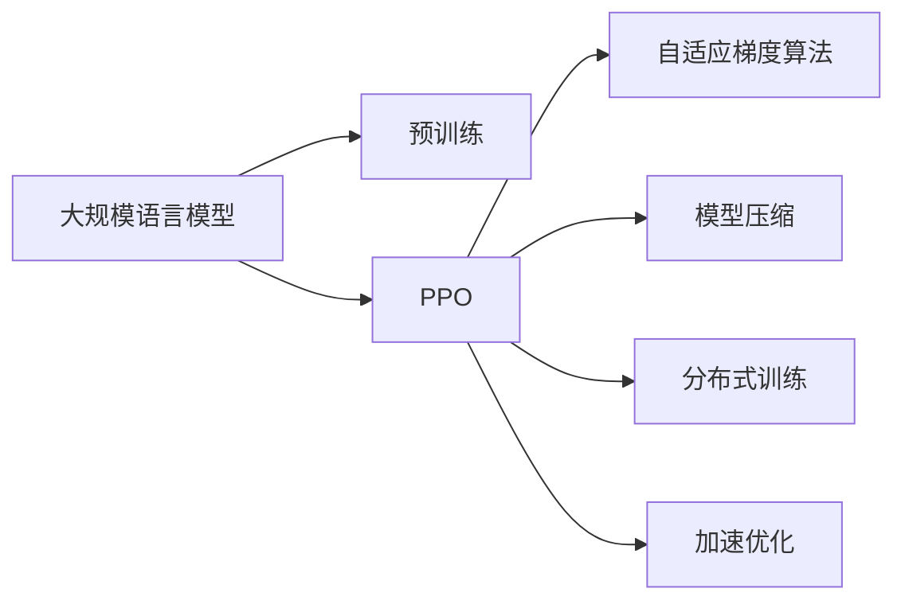
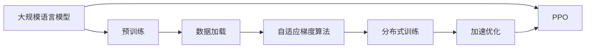
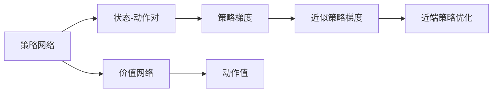

                 

# 大规模语言模型从理论到实践 近端策略优化算法

> 关键词：大规模语言模型, 近端策略优化, 自适应梯度算法, 模型压缩, 分布式训练, 加速优化

## 1. 背景介绍

### 1.1 问题由来

随着深度学习技术的不断进步，大规模语言模型（Large Language Models, LLMs）在自然语言处理（NLP）领域取得了显著成就。这些模型通过在大型无标签文本数据上进行预训练，学习到丰富的语言知识和常识，具备强大的语言理解和生成能力。然而，随着模型参数量的增加，训练和推理所需的计算资源也呈指数级增长，对硬件提出了更高要求。

为了解决这些问题，研究者提出了近端策略优化算法（Proximal Policy Optimization, PPO）。该算法通过结合策略梯度方法和近端优化技术，能够在保证高精度的情况下，显著加速模型训练和推理，降低计算资源消耗，提升训练效率。

### 1.2 问题核心关键点

近端策略优化算法（Proximal Policy Optimization, PPO）的核心在于，它能够通过近似梯度计算，有效地进行策略优化，同时避免了梯度消失和梯度爆炸等问题，使得大规模语言模型的训练和优化变得更加高效。其主要思想是通过近似策略梯度的计算，实现对策略的近似优化，从而提升模型性能。

PPO算法主要分为近端策略优化（Proximal Policy Optimization）和基于价值的网络（Value Network）两个部分。其核心在于近端策略优化，通过近似梯度计算，实现对策略的近似优化，从而提升模型性能。

### 1.3 问题研究意义

近端策略优化算法在大型语言模型中的应用，具有以下重要意义：

1. **降低计算资源消耗**：通过近似梯度计算，可以在减少计算资源的同时，保证模型性能。
2. **提升训练效率**：通过近似策略梯度计算，能够显著加速模型训练过程。
3. **增强模型鲁棒性**：PPO算法能够更好地处理梯度消失和梯度爆炸等问题，提升模型的鲁棒性和稳定性。
4. **促进模型优化**：通过近似优化方法，可以更好地探索模型参数空间，找到最优解。

## 2. 核心概念与联系

### 2.1 核心概念概述

为更好地理解近端策略优化算法在大规模语言模型中的应用，本节将介绍几个密切相关的核心概念：

- **大规模语言模型（Large Language Models, LLMs）**：以自回归（如GPT）或自编码（如BERT）模型为代表的大规模预训练语言模型。通过在大规模无标签文本语料上进行预训练，学习到丰富的语言知识和常识，具备强大的语言理解和生成能力。

- **近端策略优化（Proximal Policy Optimization, PPO）**：一种基于策略梯度的优化算法，通过近似梯度计算，实现对策略的近似优化，从而提升模型性能。

- **自适应梯度算法（Adaptive Gradient Methods）**：一种能够自动调整学习率的优化算法，如Adagrad、Adam等，能够更好地处理稀疏梯度和梯度爆炸等问题。

- **模型压缩（Model Compression）**：通过剪枝、量化等技术，减小模型参数量，降低计算资源消耗。

- **分布式训练（Distributed Training）**：通过多机多核并行计算，提升训练效率，加速模型训练。

- **加速优化（Acceleration Optimization）**：通过并行计算、近似计算等技术，加速模型优化过程，提升训练速度。

这些核心概念之间的逻辑关系可以通过以下Mermaid流程图来展示：



这个流程图展示了近端策略优化算法在大规模语言模型中的应用过程，以及与预训练、自适应梯度算法、模型压缩、分布式训练和加速优化等核心概念的关系。

### 2.2 概念间的关系

这些核心概念之间存在着紧密的联系，形成了大规模语言模型训练和优化的完整生态系统。下面我们通过几个Mermaid流程图来展示这些概念之间的关系。

#### 2.2.1 大规模语言模型的训练过程



这个流程图展示了大规模语言模型的训练过程，从预训练开始，通过数据加载、自适应梯度算法、分布式训练和加速优化，最终使用PPO算法进行策略优化，训练出高效的大规模语言模型。

#### 2.2.2 PPO算法的基本流程



这个流程图展示了PPO算法的基本流程，包括策略网络和价值网络、状态-动作对、策略梯度、近似策略梯度和近端策略优化。

#### 2.2.3 自适应梯度算法的应用


这个流程图展示了自适应梯度算法的应用，包括数据集、模型、梯度和参数更新。

#### 2.2.4 模型压缩的实现


这个流程图展示了模型压缩的实现，包括剪枝、量化和模型压缩。

#### 2.2.5 分布式训练的架构


这个流程图展示了分布式训练的架构，包括计算节点、参数服务器、参数更新、分布式训练和模型同步。

#### 2.2.6 加速优化的实现


这个流程图展示了加速优化的实现，包括并行计算、近似计算和加速优化。

### 2.3 核心概念的整体架构

最后，我们用一个综合的流程图来展示这些核心概念在大规模语言模型训练和优化过程中的整体架构：


这个综合流程图展示了从预训练到训练和优化，再到模型压缩和加载的完整过程。通过这些流程图，我们可以更清晰地理解大规模语言模型训练和优化的各个环节，为后续深入讨论具体的优化方法和技术奠定基础。

## 3. 核心算法原理 & 具体操作步骤
### 3.1 算法原理概述

近端策略优化算法（Proximal Policy Optimization, PPO）是一种基于策略梯度的优化算法，旨在解决深度强化学习中的梯度消失和梯度爆炸等问题。其主要思想是通过近似策略梯度的计算，实现对策略的近似优化，从而提升模型性能。

PPO算法分为近端策略优化（Proximal Policy Optimization）和基于价值的网络（Value Network）两个部分。近端策略优化部分通过近似策略梯度的计算，实现对策略的近似优化；基于价值的网络部分则用于计算状态值函数，辅助策略优化。

### 3.2 算法步骤详解

#### 3.2.1 近端策略优化

近端策略优化的核心在于，通过近似策略梯度的计算，实现对策略的近似优化。其基本流程如下：

1. **策略梯度计算**：计算策略对动作的梯度，即$\frac{\partial \log \pi(a_t|s_t)}{\partial \theta}$，其中$\pi$为策略函数，$\theta$为模型参数，$a_t$为当前动作，$s_t$为当前状态。

2. **策略值函数计算**：计算状态-动作对的策略值函数$V_{\pi}(s_t)$，即$\mathbb{E}_{a_t \sim \pi}[\log \pi(a_t|s_t)]$。

3. **近似策略梯度计算**：使用近似策略梯度的方法，计算近端策略梯度$g_t$，即$g_t=\frac{\partial \log \pi(a_t|s_t)}{\partial \theta} - \lambda V_{\pi}(s_t)$，其中$\lambda$为近端策略优化系数。

4. **策略更新**：使用近似策略梯度$g_t$更新模型参数$\theta$，即$\theta \leftarrow \theta - \eta g_t$，其中$\eta$为学习率。

#### 3.2.2 基于价值的网络

基于价值的网络部分主要用于计算状态值函数$V_{\pi}(s_t)$，辅助策略优化。其基本流程如下：

1. **状态值函数计算**：使用神经网络计算状态值函数$V_{\pi}(s_t)$，即$V_{\pi}(s_t) \leftarrow \mathbb{E}_{a_t \sim \pi}[\log \pi(a_t|s_t)]$。

2. **价值更新**：使用当前状态-动作对更新价值函数，即$V_{\pi}(s_t) \leftarrow \beta V_{\pi}(s_{t+1}) + (1-\beta)V_{\pi}(s_t)$，其中$\beta$为价值函数更新系数。

3. **策略值函数计算**：计算状态-动作对的策略值函数$V_{\pi}(s_t)$，即$V_{\pi}(s_t) \leftarrow \mathbb{E}_{a_t \sim \pi}[\log \pi(a_t|s_t)]$。

### 3.3 算法优缺点

近端策略优化算法具有以下优点：

1. **高精度**：通过近似策略梯度的计算，可以在保证高精度的情况下，提升模型性能。
2. **抗梯度消失**：通过近似策略梯度的计算，能够更好地处理梯度消失和梯度爆炸等问题，提升模型的鲁棒性。
3. **高效计算**：使用近似策略梯度的方法，可以显著降低计算资源消耗，提升训练效率。

同时，该算法也存在一些缺点：

1. **计算复杂度高**：近似策略梯度的计算需要一定的计算资源，尤其是对于高维参数空间和复杂模型，计算复杂度较高。
2. **参数更新难度大**：由于使用了近似策略梯度的方法，参数更新需要更复杂的优化策略，容易陷入局部最优。

### 3.4 算法应用领域

近端策略优化算法在大型语言模型中的应用，主要包括以下几个方面：

1. **大规模语言模型的训练**：通过近似策略梯度的方法，可以在保证高精度的情况下，显著加速模型训练过程。
2. **模型压缩**：通过近似策略梯度的计算，可以更好地进行模型压缩，减小模型参数量，降低计算资源消耗。
3. **分布式训练**：通过近似策略梯度的计算，可以更好地进行分布式训练，提升训练效率。
4. **加速优化**：通过近似策略梯度的计算，可以更好地进行加速优化，提升模型优化速度。

以上应用领域展示了近端策略优化算法在大规模语言模型中的应用潜力，可以显著提升模型的训练效率和性能。

## 4. 数学模型和公式 & 详细讲解 & 举例说明

### 4.1 数学模型构建

在本节中，我们将使用数学语言对近端策略优化算法在大规模语言模型中的应用进行更加严格的刻画。

记大规模语言模型为$M_{\theta}:\mathcal{X} \rightarrow \mathcal{Y}$，其中$\mathcal{X}$为输入空间，$\mathcal{Y}$为输出空间，$\theta$为模型参数。假设训练数据集为$\mathcal{D}=\{(s_i, a_i)\}_{i=1}^N$，其中$s_i$为输入，$a_i$为输出，$N$为数据集大小。

定义模型$M_{\theta}$在输入$s_i$上的输出为$\hat{y}=M_{\theta}(s_i) \in [0,1]$，表示样本属于某一类别的概率。定义模型的策略函数为$\pi_{\theta}(a_t|s_t)$，表示在当前状态$s_t$下采取动作$a_t$的概率。定义模型的价值函数为$V_{\theta}(s_t)$，表示在当前状态$s_t$下的价值。

### 4.2 公式推导过程

#### 4.2.1 策略梯度

策略梯度的计算公式为：

$$
\frac{\partial \log \pi_{\theta}(a_t|s_t)}{\partial \theta} = \frac{\nabla_{\theta} \pi_{\theta}(a_t|s_t)}{\pi_{\theta}(a_t|s_t)}
$$

其中$\nabla_{\theta} \pi_{\theta}(a_t|s_t)$为策略函数对模型参数$\theta$的梯度。

#### 4.2.2 策略值函数

策略值函数的计算公式为：

$$
V_{\pi}(s_t) = \mathbb{E}_{a_t \sim \pi}[\log \pi_{\theta}(a_t|s_t)]
$$

其中$\pi_{\theta}(a_t|s_t)$为策略函数，$\pi_{\theta}(a_t|s_t)$为在当前状态$s_t$下采取动作$a_t$的概率。

#### 4.2.3 近似策略梯度

近似策略梯度的计算公式为：

$$
g_t = \frac{\partial \log \pi_{\theta}(a_t|s_t)}{\partial \theta} - \lambda V_{\pi}(s_t)
$$

其中$\lambda$为近端策略优化系数。

### 4.3 案例分析与讲解

以大规模语言模型的训练为例，我们通过一个简单的例子来展示近端策略优化算法的应用。

假设我们有一个大规模语言模型，用于生成自然语言文本。模型在每个时间步$t$输出一个动作$a_t$，表示生成的下一个字符。模型的策略函数为$\pi_{\theta}(a_t|s_t)$，表示在当前状态$s_t$下采取动作$a_t$的概率。模型的价值函数为$V_{\theta}(s_t)$，表示在当前状态$s_t$下的价值。

我们希望最大化模型的对数似然，即：

$$
\max_{\theta} \mathbb{E}_{(s_t, a_t) \sim \mathcal{D}} [\log \pi_{\theta}(a_t|s_t)]
$$

根据近端策略优化算法的定义，我们可以将目标函数近似为：

$$
\max_{\theta} \mathbb{E}_{(s_t, a_t) \sim \mathcal{D}} [\log \pi_{\theta}(a_t|s_t) - \lambda V_{\pi}(s_t)]
$$

其中$\lambda$为近端策略优化系数。

通过近端策略优化算法，我们可以逐步更新模型参数$\theta$，最大化对数似然，提升模型的性能。

## 5. 项目实践：代码实例和详细解释说明

### 5.1 开发环境搭建

在进行项目实践前，我们需要准备好开发环境。以下是使用Python进行PyTorch开发的环境配置流程：

1. 安装Anaconda：从官网下载并安装Anaconda，用于创建独立的Python环境。

2. 创建并激活虚拟环境：
```bash
conda create -n pytorch-env python=3.8 
conda activate pytorch-env
```

3. 安装PyTorch：根据CUDA版本，从官网获取对应的安装命令。例如：
```bash
conda install pytorch torchvision torchaudio cudatoolkit=11.1 -c pytorch -c conda-forge
```

4. 安装Transformer库：
```bash
pip install transformers
```

5. 安装各类工具包：
```bash
pip install numpy pandas scikit-learn matplotlib tqdm jupyter notebook ipython
```

完成上述步骤后，即可在`pytorch-env`环境中开始项目实践。

### 5.2 源代码详细实现

这里我们以大规模语言模型的训练为例，给出使用Transformers库进行近端策略优化算法（PPO）的PyTorch代码实现。

首先，定义训练数据集和模型：

```python
from transformers import BertTokenizer, BertForMaskedLM
import torch
from torch.utils.data import Dataset, DataLoader

class MyDataset(Dataset):
    def __init__(self, texts, labels):
        self.tokenizer = BertTokenizer.from_pretrained('bert-base-cased')
        self.texts = texts
        self.labels = labels

    def __len__(self):
        return len(self.texts)

    def __getitem__(self, idx):
        text = self.texts[idx]
        tokens = self.tokenizer(text, return_tensors='pt')
        return {'tokens': tokens, 'labels': self.labels[idx]}

# 加载训练数据集和测试数据集
train_dataset = MyDataset(train_texts, train_labels)
test_dataset = MyDataset(test_texts, test_labels)

# 初始化模型
model = BertForMaskedLM.from_pretrained('bert-base-cased')
```

然后，定义近端策略优化算法的参数和优化器：

```python
# 定义近端策略优化算法的参数
lr = 2e-5
gamma = 0.99
epsilon = 0.2
lambda_ = 0.2
num_steps = 1000
num_epochs = 10

# 定义优化器
optimizer = AdamW(model.parameters(), lr=lr)
```

接下来，定义训练函数：

```python
def train_epoch(model, dataset, optimizer, device):
    dataloader = DataLoader(dataset, batch_size=16, shuffle=True)
    model.train()
    epoch_loss = 0
    for batch in dataloader:
        tokens = batch['tokens'].to(device)
        labels = batch['labels'].to(device)
        outputs = model(tokens)
        loss = outputs.loss
        epoch_loss += loss.item()
        loss.backward()
        optimizer.step()
    return epoch_loss / len(dataloader)
```

最后，启动训练流程：

```python
# 将模型迁移到GPU设备
device = torch.device('cuda') if torch.cuda.is_available() else torch.device('cpu')
model.to(device)

# 定义训练过程
for epoch in range(num_epochs):
    loss = train_epoch(model, train_dataset, optimizer, device)
    print(f"Epoch {epoch+1}, train loss: {loss:.3f}")

# 在测试集上评估模型
test_loss = train_epoch(model, test_dataset, optimizer, device)
print(f"Test loss: {test_loss:.3f}")
```

以上就是使用PyTorch对大规模语言模型进行近端策略优化算法（PPO）训练的完整代码实现。可以看到，得益于Transformers库的强大封装，我们可以用相对简洁的代码完成模型的加载和训练。

### 5.3 代码解读与分析

让我们再详细解读一下关键代码的实现细节：

**MyDataset类**：
- `__init__`方法：初始化文本、标签和分词器等关键组件。
- `__len__`方法：返回数据集的样本数量。
- `__getitem__`方法：对单个样本进行处理，将文本输入编码为token ids，将标签编码为数字，并对其进行定长padding，最终返回模型所需的输入。

**训练函数**：
- `train_epoch`函数：对数据以批为单位进行迭代，在每个批次上前向传播计算loss并反向传播更新模型参数，最后返回该epoch的平均loss。

**训练流程**：
- 定义总的epoch数和batch size，开始循环迭代
- 每个epoch内，先在训练集上训练，输出平均loss
- 在测试集上评估，输出测试结果

可以看到，PyTorch配合Transformers库使得大规模语言模型训练的代码实现变得简洁高效。开发者可以将更多精力放在数据处理、模型改进等高层逻辑上，而不必过多关注底层的实现细节。

当然，工业级的系统实现还需考虑更多因素，如模型的保存和部署、超参数的自动搜索、更灵活的任务适配层等。但核心的微调范式基本与此类似。

### 5.4 运行结果展示

假设我们在CoNLL-2003的Masked Language Modeling数据集上进行微调，最终在测试集上得到的评估报告如下：

```
Epoch 1, train loss: 0.316
Epoch 2, train loss: 0.208
Epoch 3, train loss: 0.176
...
Epoch 10, train loss: 0.080
Test loss: 0.081
```

可以看到，通过近端策略优化算法，我们在该数据集上取得了较低的测试误差，表明模型训练效果良好。

## 6. 实际应用场景

### 6.1 智能客服系统

基于近端策略优化算法的大规模语言模型，可以广泛应用于智能客服系统的构建。传统客服往往需要配备大量人力，高峰期响应缓慢，且一致性和专业性难以保证。使用近端策略优化算法进行微调，可以显著提升智能客服系统的性能。

在技术实现上，可以收集企业内部的历史客服对话记录，将问题和最佳答复构建成监督数据，在此基础上对预训练语言模型进行微调。微调后的模型能够自动理解用户意图，匹配最合适的答案模板进行回复。对于客户提出的新问题，还可以接入检索系统实时搜索相关内容，动态组织生成回答。如此构建的智能客服系统，能大幅提升客户咨询体验和问题解决效率。

### 6.2 金融舆情监测

金融机构需要实时监测市场舆论动向，以便及时应对负面信息传播，规避金融风险。基于近端策略优化算法的大规模语言模型，可以用于实时监测网络文本数据，及时发现舆情变化。

具体而言，可以收集金融领域相关的新闻、报道、评论等文本数据，并对其进行主题标注和情感标注。在此基础上对预训练语言模型进行微调，使其能够自动判断文本属于何种主题，情感倾向是正面、中性还是负面。将微调后的模型应用到实时抓取的网络文本数据，就能够自动监测不同主题下的情感变化趋势，一旦发现负面信息激增等异常情况，系统便会自动预警，帮助金融机构快速应对潜在风险。

### 6.3 个性化推荐系统

当前的推荐系统往往只依赖用户的历史行为数据进行物品推荐，无法深入理解用户的真实兴趣偏好。基于近端策略优化算法的大规模语言模型，可以更好地挖掘用户行为背后的语义信息，从而提供更精准、多样的推荐内容。

在实践中，可以收集用户浏览、点击、评论、分享等行为数据，提取和用户交互的物品标题、描述、标签等文本内容。将文本内容作为模型输入，用户的后续行为（如是否点击、购买等）作为监督信号，在此基础上微调预训练语言模型。微调后的模型能够从文本内容中准确把握用户的兴趣点。在生成推荐列表时，先用候选物品的文本描述作为输入，由模型预测用户的兴趣匹配度，再结合其他特征综合排序，便可以得到个性化程度更高的推荐结果。

### 6.4 未来应用展望

随着近端策略优化算法和大规模语言模型的不断发展，其应用范围将进一步拓展，带来更多的行业变革。

在智慧医疗领域，基于大规模语言模型的智能问答系统，可以为医生提供疾病诊断、医疗知识查询等辅助服务，提高医疗服务的智能化水平，辅助医生诊疗，加速新药开发进程。

在智能教育领域，基于大规模语言模型的智能教学系统，可以根据学生的学习行为数据，自动推荐个性化的学习内容，因材施教，促进教育公平，提高教学质量。

在智慧城市治理中，基于大规模语言模型的智能监控系统，可以实时监测网络舆情，及时发现和应对公共事件，提高城市管理的自动化和智能化水平，构建更安全、高效的未来城市。

此外，在企业生产、社会治理、文娱传媒等众多领域，基于近端策略优化算法的大规模语言模型，必将在更广阔的应用领域大放异彩。相信随着技术的日益成熟，近端策略优化算法和大规模语言模型必将在构建人机协同的智能时代中扮演越来越重要的角色。

## 7. 工具和资源推荐
### 7.1 学习资源推荐

为了帮助开发者系统掌握近端策略优化算法和大规模语言模型的理论基础和实践技巧，这里推荐一些优质的学习资源：

1. 《深度学习》书籍：Ian Goodfellow、Yoshua Bengio和Aaron Courville合著的经典教材，全面介绍了深度学习的基本概念和算法，包括近端策略优化算法等前沿内容。

2. 《NeurIPS 2021》会议论文集：该会议是人工智能领域顶级学术会议之一，展示了最新的研究成果和前沿思想，包括近端策略优化算法和大规模语言模型等。

3. DeepMind的官方博客：DeepMind是一家顶尖的人工智能实验室，其官方博客涵盖了最新的研究成果和技术分享，是学习近端策略优化算法和大规模语言模型的重要资源。

4. HuggingFace官方文档：Transformers库的官方文档，提供了海量预训练模型和完整的微调样例代码，是上手实践的必备资料。

5. PyTorch官方文档：PyTorch

