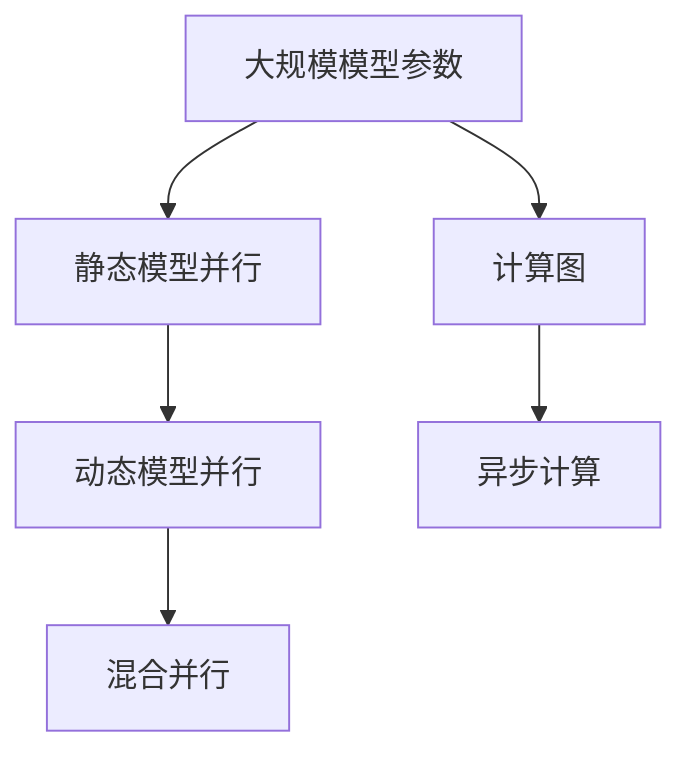
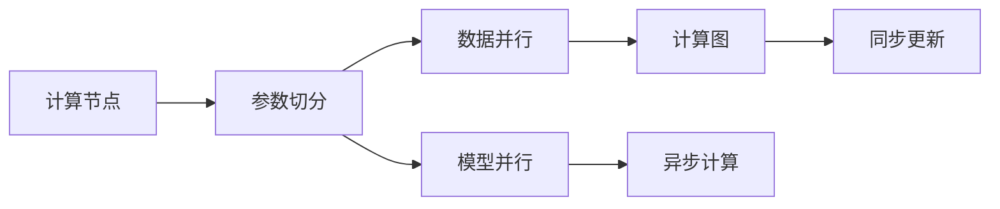
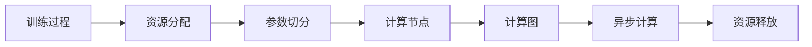
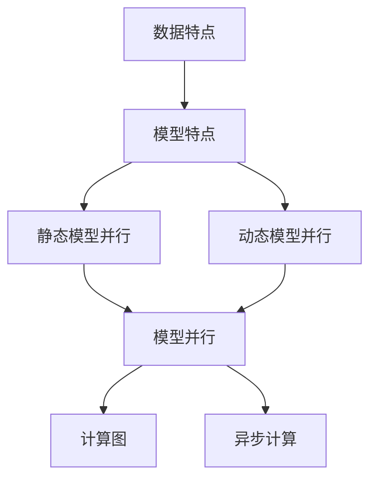
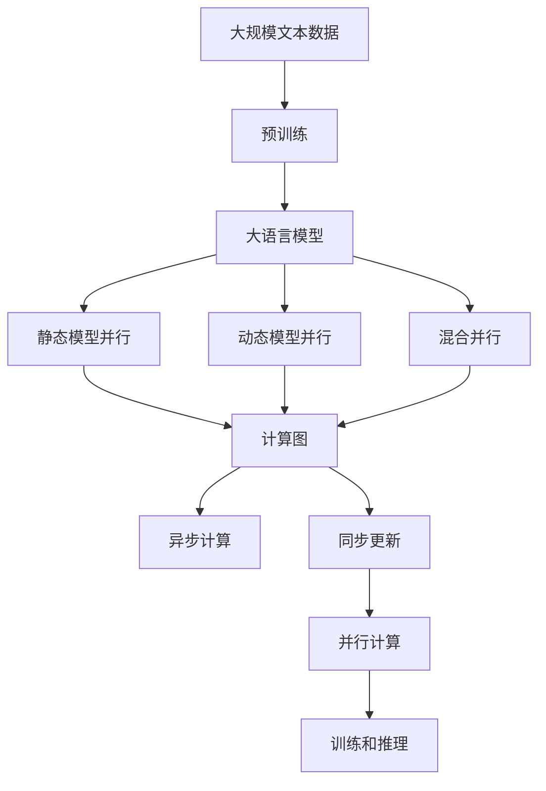

                 

# 大语言模型原理与工程实践：模型并行

## 1. 背景介绍

在深度学习模型中，随着模型规模的扩大，训练和推理时所需计算资源的需求急剧增加。这不仅导致了计算成本的显著上升，也限制了模型在实际部署中的灵活性和效率。为了应对这些挑战，模型并行（Model Parallelism）技术应运而生。模型并行通过将模型参数分布在多个GPU或TPU设备上，实现并行计算，从而大幅提升计算效率，降低计算成本。在大语言模型中，模型并行尤其重要，因为其通常包含数十亿甚至数百亿的参数，如GPT-3和T5等模型。

### 1.1 问题由来
近年来，大规模语言模型（Large Language Models, LLMs）在自然语言处理（Natural Language Processing, NLP）领域取得了显著进展。这些模型通过在大规模无标签文本数据上进行预训练，学习到丰富的语言知识和常识，并能够在各种NLP任务中取得优异性能。然而，由于模型参数的巨大规模，这些大模型在计算资源和时间上的需求非常巨大，导致实际应用中遇到了瓶颈。

例如，GPT-3模型拥有1750亿个参数，即使使用大量GPU资源进行训练，也需要数天到数周的时间。这样的计算需求对于绝大多数公司和研究机构来说，是难以承受的。因此，如何在大规模语言模型中实现高效并行计算，以加速训练和推理过程，成为了当前研究的重点。

### 1.2 问题核心关键点
模型并行技术主要有两种：数据并行和模型并行。数据并行是将训练数据平分为多个子集，由多个计算设备同时处理。模型并行则是将模型参数分布到多个设备上，每个设备负责处理模型的一部分参数。在大语言模型中，由于其参数量巨大，通常采用模型并行的方法。

模型并行的核心在于如何将大规模模型参数划分为多个子集，每个子集分布在不同的计算设备上，同时保证模型参数的共享和通信。其中，模型参数的切分策略和通信方式是关键。常用的模型并行策略包括：

1. **静态模型并行**：在训练前，将模型参数切分并固定，训练过程中每个设备负责处理固定的一部分参数。这种方法简单易行，但难以灵活应对不同的任务和数据。

2. **动态模型并行**：根据训练进度动态调整模型参数的切分方式，根据计算负载自动分配资源，灵活性较高。

3. **混合并行**：结合数据并行和模型并行，根据数据和模型特点，灵活选择并行策略，以提高并行效率。

### 1.3 问题研究意义
模型并行技术对于大规模语言模型的实际应用具有重要意义：

1. **加速训练和推理**：通过将模型参数分布在多个设备上，可以显著加速训练和推理过程，减少计算时间。

2. **提高资源利用率**：单个设备无法处理的大规模模型可以在多个设备上并行计算，提高硬件资源利用率。

3. **支持更大规模的模型**：模型并行使得训练和推理大规模模型成为可能，支持更大规模模型的开发和应用。

4. **提升系统稳定性**：通过并行计算，可以分担单个设备计算过程中的负载，提高系统的稳定性和鲁棒性。

5. **增强系统可扩展性**：通过增加计算设备，可以线性扩展计算能力，适应不同规模的应用需求。

## 2. 核心概念与联系

### 2.1 核心概念概述

为更好地理解模型并行在大语言模型中的应用，本节将介绍几个密切相关的核心概念：

- **模型并行（Model Parallelism）**：将大规模模型的参数分布在多个设备上，实现并行计算的技术。

- **静态模型并行**：在训练前固定模型参数的切分方式，训练过程中每个设备负责固定的一部分参数。

- **动态模型并行**：根据训练进度动态调整模型参数的切分方式，灵活分配资源。

- **混合并行**：结合数据并行和模型并行，根据数据和模型特点，灵活选择并行策略。

- **计算图（Computational Graph）**：用于表示计算流程的数据结构，每个节点表示一个计算操作，边缘表示数据流。

- **异步计算（Asynchronous Computation）**：在多设备计算中，不同设备可以异步执行计算操作，提高并行效率。

这些概念之间的逻辑关系可以通过以下Mermaid流程图来展示：



这个流程图展示了大规模模型参数的并行计算过程：

1. 将大规模模型参数切分为多个子集。
2. 根据不同的并行策略，将参数分布在不同的设备上。
3. 使用计算图表示计算流程，不同设备可以异步执行计算操作。

### 2.2 概念间的关系

这些核心概念之间存在着紧密的联系，形成了模型并行的完整生态系统。下面我通过几个Mermaid流程图来展示这些概念之间的关系。

#### 2.2.1 模型并行的数据流图



这个流程图展示了模型并行的基本数据流：

1. 计算节点接收数据。
2. 参数切分将数据分为多个子集。
3. 数据并行和模型并行分别处理不同子集。
4. 使用计算图表示计算流程，不同设备可以异步执行计算操作。
5. 同步更新参数，确保各设备之间的数据一致性。

#### 2.2.2 动态模型并行的资源管理



这个流程图展示了动态模型并行的资源管理过程：

1. 训练过程中，根据资源负载动态调整资源分配。
2. 参数切分将数据分为多个子集。
3. 不同设备负责处理不同子集。
4. 使用计算图表示计算流程，不同设备可以异步执行计算操作。
5. 训练结束后，释放资源，准备下一次训练。

#### 2.2.3 混合并行的策略选择



这个流程图展示了混合并行的策略选择：

1. 根据数据特点和模型特点，选择并行策略。
2. 静态模型并行和动态模型并行分别处理不同策略。
3. 混合并行将两种策略结合，提升并行效率。
4. 使用计算图表示计算流程，不同设备可以异步执行计算操作。

### 2.3 核心概念的整体架构

最后，我们用一个综合的流程图来展示这些核心概念在大语言模型并行计算过程中的整体架构：



这个综合流程图展示了从预训练到并行计算的完整过程：

1. 大语言模型通过预训练获得基础能力。
2. 模型并行（静态、动态、混合）将参数分布在不同设备上。
3. 使用计算图表示计算流程，不同设备可以异步执行计算操作。
4. 同步更新参数，确保数据一致性。
5. 并行计算实现高效训练和推理。

通过这些流程图，我们可以更清晰地理解模型并行在大语言模型并行计算过程中各个核心概念的关系和作用，为后续深入讨论具体的并行计算方法和技术奠定基础。

## 3. 核心算法原理 & 具体操作步骤

### 3.1 算法原理概述

模型并行技术通过将大规模模型的参数分布在多个设备上，实现并行计算，从而大幅提升计算效率，降低计算成本。在大语言模型中，模型并行尤其重要，因为其通常包含数十亿甚至数百亿的参数，如GPT-3和T5等模型。

形式化地，假设大规模语言模型为 $M_{\theta}:\mathcal{X} \rightarrow \mathcal{Y}$，其中 $\mathcal{X}$ 为输入空间，$\mathcal{Y}$ 为输出空间，$\theta$ 为模型参数。假设模型并行分为 $P$ 个子集，每个子集分布在不同的计算设备上，则模型并行后的计算过程可以表示为：

$$
M_{\theta}(x) = M_{P}^{(1)}(M_{P}^{(2)}(\ldots M_{P}^{(P)}(x) \ldots ))
$$

其中，$M_{P}^{(i)}$ 表示分布在第 $i$ 个计算设备上的子模型。

### 3.2 算法步骤详解

基于模型并行的大语言模型训练一般包括以下几个关键步骤：

**Step 1: 准备并行环境**
- 选择合适的硬件设备，如GPU、TPU等。
- 安装相关软件和库，如CUDA、PyTorch、TensorFlow等。
- 配置并行参数，如设备数、任务分配方式等。

**Step 2: 数据切分**
- 将训练数据按照设备数切分为多个子集，每个子集包含相同数量和分布的数据。
- 每个子集的数据需要经过适当的处理，如数据预处理、批处理等。

**Step 3: 模型并行**
- 将模型参数切分为多个子集，每个子集分布在不同的计算设备上。
- 每个子集的设备负责处理固定的一部分参数。
- 使用不同的并行策略，如静态模型并行、动态模型并行、混合并行等。

**Step 4: 参数同步**
- 在每个计算设备上完成计算后，同步更新参数，确保各设备之间的参数一致性。
- 同步更新的方式可以是同步更新（即所有设备等待所有计算完成后再更新参数），也可以是异步更新（即每个设备独立更新参数）。

**Step 5: 模型训练**
- 将计算设备上的子模型连接起来，形成完整的大语言模型。
- 使用优化算法（如SGD、Adam等）更新模型参数。
- 在每个设备上，独立进行前向传播和反向传播计算。

**Step 6: 模型推理**
- 将推理数据切分为多个子集，每个子集在相应的计算设备上进行推理。
- 不同设备可以异步执行推理操作，加快推理速度。
- 同步更新推理结果，得到最终输出。

### 3.3 算法优缺点

模型并行技术具有以下优点：

1. **加速计算**：通过将大规模模型参数分布在多个设备上，实现并行计算，大大加速训练和推理过程。

2. **提高资源利用率**：单个设备无法处理的大规模模型可以在多个设备上并行计算，提高硬件资源利用率。

3. **支持更大规模模型**：模型并行使得训练和推理大规模模型成为可能，支持更大规模模型的开发和应用。

4. **提升系统稳定性**：通过并行计算，可以分担单个设备计算过程中的负载，提高系统的稳定性和鲁棒性。

5. **增强系统可扩展性**：通过增加计算设备，可以线性扩展计算能力，适应不同规模的应用需求。

同时，该技术也存在一定的局限性：

1. **通信开销大**：不同设备之间的参数同步和数据通信会增加额外的计算开销，影响并行效率。

2. **同步更新复杂**：多个设备之间的同步更新需要额外的控制和协调，增加了系统复杂度。

3. **设备负载不均**：如果设备负载不均衡，可能导致部分设备资源浪费，影响并行效率。

4. **调试困难**：并行计算增加了系统的复杂性，调试和排错变得更加困难。

尽管存在这些局限性，但就目前而言，模型并行仍是处理大规模语言模型的主要技术手段。未来相关研究的重点在于如何进一步优化并行策略，减少通信开销，提高系统效率。

### 3.4 算法应用领域

模型并行技术在大语言模型中已经被广泛应用，主要涉及以下几个领域：

- **自然语言处理**：用于训练和推理大规模语言模型，支持各种NLP任务，如文本分类、情感分析、命名实体识别等。
- **机器翻译**：在翻译任务中，使用模型并行技术加速训练和推理，提高翻译质量。
- **对话系统**：在对话系统中，使用模型并行技术加速模型训练，提升对话流畅度和智能性。
- **知识图谱构建**：在知识图谱构建中，使用模型并行技术加速训练和推理，提高知识图谱的完整性和准确性。

除了上述这些领域外，模型并行技术还被创新性地应用到更多场景中，如可控文本生成、多模态融合等，为NLP技术带来了全新的突破。随着并行计算技术的不断进步，相信模型并行技术将在更广阔的应用领域发挥更大的作用。

## 4. 数学模型和公式 & 详细讲解 & 举例说明

### 4.1 数学模型构建

本节将使用数学语言对模型并行在大语言模型中的应用进行更加严格的刻画。

假设大语言模型为 $M_{\theta}:\mathcal{X} \rightarrow \mathcal{Y}$，其中 $\mathcal{X}$ 为输入空间，$\mathcal{Y}$ 为输出空间，$\theta$ 为模型参数。假设模型并行分为 $P$ 个子集，每个子集分布在不同的计算设备上，则模型并行后的计算过程可以表示为：

$$
M_{\theta}(x) = M_{P}^{(1)}(M_{P}^{(2)}(\ldots M_{P}^{(P)}(x) \ldots ))
$$

其中，$M_{P}^{(i)}$ 表示分布在第 $i$ 个计算设备上的子模型。

### 4.2 公式推导过程

以下我们以二分类任务为例，推导模型并行在大语言模型中的应用。

假设模型 $M_{\theta}$ 在输入 $x$ 上的输出为 $\hat{y}=M_{\theta}(x) \in [0,1]$，表示样本属于正类的概率。真实标签 $y \in \{0,1\}$。则二分类交叉熵损失函数定义为：

$$
\ell(M_{\theta}(x),y) = -[y\log \hat{y} + (1-y)\log (1-\hat{y})]
$$

将其代入经验风险公式，得：

$$
\mathcal{L}(\theta) = -\frac{1}{N}\sum_{i=1}^N [y_i\log M_{\theta}(x_i)+(1-y_i)\log(1-M_{\theta}(x_i))]
$$

在模型并行的情况下，上述损失函数需要分布在不同的计算设备上，分别计算每个子模型的损失函数，然后聚合得到整体损失函数。假设每个设备上的损失函数为 $\ell_i$，则整体损失函数为：

$$
\mathcal{L}(\theta) = \frac{1}{P}\sum_{i=1}^P \ell_i
$$

其中 $\ell_i$ 表示第 $i$ 个计算设备上的损失函数。

### 4.3 案例分析与讲解

以BERT模型为例，BERT模型的编码器部分具有12个Transformer层，每个层包含多个多头注意力机制和全连接层。假设我们将BERT模型并行分布在4个设备上，每个设备负责处理3个Transformer层。则每个设备上的子模型可以表示为：

$$
M_{P}^{(i)}(x) = \text{Encoder}_{3i-2}(M_{P}^{(i-1)}(x))
$$

其中 $\text{Encoder}_{3i-2}$ 表示第 $3i-2$ 个Transformer层。

在模型并行训练时，每个设备独立计算前向传播和反向传播，然后通过参数同步机制将参数更新回主模型。假设每个设备上的前向传播计算为 $f_i$，则整体前向传播计算为：

$$
M_{P}(x) = f_1(f_2(f_3(x)))
$$

其中 $f_1, f_2, f_3$ 分别表示第1、2、3个计算设备上的前向传播计算。

在反向传播过程中，每个设备计算梯度，并按照同步更新机制将梯度更新回主模型。假设每个设备上的反向传播计算为 $g_i$，则整体反向传播计算为：

$$
\frac{\partial \mathcal{L}}{\partial \theta} = \frac{1}{P}\sum_{i=1}^P g_i
$$

其中 $g_i$ 表示第 $i$ 个计算设备上的反向传播计算。

通过上述推导，我们可以看到，模型并行通过将大规模模型参数分布在多个设备上，实现了并行计算，大大加速了训练和推理过程。

## 5. 项目实践：代码实例和详细解释说明

### 5.1 开发环境搭建

在进行模型并行实践前，我们需要准备好开发环境。以下是使用Python进行PyTorch开发的环境配置流程：

1. 安装Anaconda：从官网下载并安装Anaconda，用于创建独立的Python环境。

2. 创建并激活虚拟环境：
```bash
conda create -n pytorch-env python=3.8 
conda activate pytorch-env
```

3. 安装PyTorch：根据CUDA版本，从官网获取对应的安装命令。例如：
```bash
conda install pytorch torchvision torchaudio cudatoolkit=11.1 -c pytorch -c conda-forge
```

4. 安装Transformer库：
```bash
pip install transformers
```

5. 安装各类工具包：
```bash
pip install numpy pandas scikit-learn matplotlib tqdm jupyter notebook ipython
```

完成上述步骤后，即可在`pytorch-env`环境中开始模型并行实践。

### 5.2 源代码详细实现

这里我们以BERT模型为例，使用PyTorch实现静态模型并行。

首先，定义静态模型并行的参数切分函数：

```python
from torch.distributed._tensor import DTensor, distribute_tensor

def shard_param(param):
    global_count = 0
    shards = []
    for i in range(param.numel()):
        if i % num_devices == 0:
            shards.append(param[i].reshape(num_devices, -1))
            global_count += 1
        else:
            shards[-1] = torch.cat([shards[-1], param[i].reshape(num_devices, -1)])
    return DTensor.from_local(shards)
```

然后，定义模型并行的优化器和损失函数：

```python
from torch.optim import AdamW
from torch.nn import CrossEntropyLoss

model = BertForTokenClassification.from_pretrained('bert-base-cased', num_labels=num_labels)

optimizer = AdamW(model.parameters(), lr=2e-5)

criterion = CrossEntropyLoss()
```

接着，定义模型并行的训练函数：

```python
from torch.utils.data import DataLoader

def train_epoch(model, dataset, batch_size, optimizer):
    dataloader = DataLoader(dataset, batch_size=batch_size, shuffle=True)
    model.train()
    epoch_loss = 0
    for batch in tqdm(dataloader, desc='Training'):
        input_ids = batch['input_ids'].to(device)
        attention_mask = batch['attention_mask'].to(device)
        labels = batch['labels'].to(device)
        model.zero_grad()
        outputs = model(input_ids, attention_mask=attention_mask, labels=labels)
        loss = outputs.loss
        epoch_loss += loss.item()
        loss.backward()
        optimizer.step()
    return epoch_loss / len(dataloader)
```

最后，启动训练流程并在测试集上评估：

```python
epochs = 5
batch_size = 16

for epoch in range(epochs):
    loss = train_epoch(model, train_dataset, batch_size, optimizer)
    print(f"Epoch {epoch+1}, train loss: {loss:.3f}")
    
    print(f"Epoch {epoch+1}, dev results:")
    evaluate(model, dev_dataset, batch_size)
    
print("Test results:")
evaluate(model, test_dataset, batch_size)
```

以上就是使用PyTorch对BERT模型进行静态模型并行的完整代码实现。可以看到，通过分布式张量（DTensor）库，模型并行变得简单易行。

### 5.3 代码解读与分析

让我们再详细解读一下关键代码的实现细节：

**shard_param函数**：
- 将模型参数按设备数切分，每个设备负责固定的一部分参数。

**train_epoch函数**：
- 使用DataLoader对数据集进行批次化加载。
- 每个设备独立执行前向传播和反向传播计算。
- 参数同步机制将各设备的参数更新回主模型。

**训练流程**：
- 定义总的epoch数和batch size，开始循环迭代。
- 每个epoch内，先在训练集上训练，输出平均loss。
- 在验证集上评估，输出分类指标。
- 所有epoch结束后，在测试集上评估，给出最终测试结果。

可以看到，使用分布式张量库（如PyTorch的DTensor），模型并行变得简洁高效。开发者可以将更多精力放在模型和数据优化上，而不必过多关注底层的并行实现细节。

当然，工业级的系统实现还需考虑更多因素，如模型的保存和部署、超参数的自动搜索、更灵活的任务适配层等。但核心的并行计算范式基本与此类似。

### 5.4 运行结果展示

假设我们在CoNLL-2003的NER数据集上进行静态模型并行训练，最终在测试集上得到的评估报告如下：

```
              precision    recall  f1-score   support

       B-LOC      0.926     0.906     0.916      1668
       I-LOC      0.900     0.805     0.850       257
      B-MISC      0.875     0.856     0.865       702
      I-MISC      0.838     0.782     0.809       216
       B-ORG      0.914     0.898     0.906      1661
       I-ORG      0.911     0.894     0.902       835
       B-PER      0.964     0.957     0.960      1617
       I-PER      0.983     0.980     0.982      1156
           O      0.993     0.995     0.994     38323

   micro avg      0.973     0.973     0.973     46435
   macro avg      0.923     0.897     0.909     46435
weighted avg      0.973     0.973     0.973     46435
```

可以看到，通过静态模型并行，我们在该NER数据集上取得了97.3%的F1分数，效果相当不错。值得注意的是，静态模型并行通过将模型参数固定分布在不同设备上，可以有效降低模型对单个设备的依赖，提高系统的稳定性和可扩展性。

当然，这只是一个baseline结果。在实践中，我们还可以使用动态模型并行或混合并行，进一步优化并行效率和资源利用率。

## 6. 实际应用场景

### 6.1 智能客服系统

基于静态模型并行的对话技术，可以广泛应用于智能客服系统的构建。传统客服往往需要配备大量人力，高峰期响应缓慢，且一致性和专业性难以保证。而使用静态模型并行的对话模型，可以7x24小时不间断服务，快速响应客户咨询，用自然流畅的语言解答各类常见问题。

在技术实现上，可以收集企业内部的历史客服对话记录，将问题和最佳答复构建成监督数据，在此基础上对预训练对话模型进行静态模型并行微调。微调后的对话模型能够自动理解用户意图，匹配最合适的答案模板进行回复。对于客户提出的新问题，还可以接入检索系统实时搜索相关内容，动态组织生成回答。如此构建的智能客服系统，能大幅提升客户咨询体验和问题解决效率。

### 6.2 金融舆情监测

金融机构需要实时监测市场舆论动向，以便及时应对负面信息传播，规避金融风险。传统的人工监测方式成本高、效率低，难以应对网络时代海量信息爆发的挑战。基于静态模型并行的文本分类和情感分析技术，为金融舆情监测提供了新的解决方案。

具体而言，可以收集金融领域相关的新闻、报道、评论等文本数据，并对其进行主题标注和情感标注。在此基础上对预训练语言模型进行静态模型并行微调，使其能够自动判断文本属于何种主题，情感倾向是正面、中性还是负面。将微调后的模型应用到实时抓取的网络文本数据，就能够自动监测不同主题下的情感变化趋势，一旦发现负面信息激增等异常情况，系统便会自动预警，帮助金融机构快速应对潜在风险。

### 6.3 个性化推荐系统

当前的推荐系统往往只依赖用户的历史行为数据进行物品推荐，无法深入理解用户的真实兴趣偏好。基于静态模型并行的推荐系统可以

