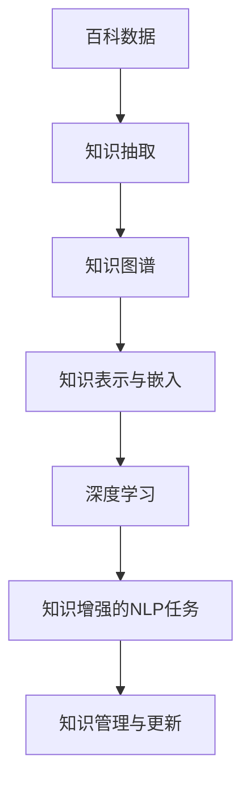
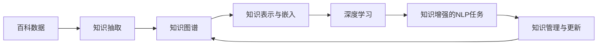

                 

# 大语言模型原理与工程实践：百科数据

> 关键词：百科数据, 百科知识图谱, 知识抽取, 信息检索, 自然语言处理(NLP), 深度学习, 知识表示, 知识管理

## 1. 背景介绍

### 1.1 问题由来
随着信息爆炸和数据普及，百科知识图谱（KGS）成为了连接知识与智能应用的重要桥梁。百科数据不仅是信息检索、知识抽取和推荐系统的数据基础，还为大语言模型的预训练提供了丰富的语料。大语言模型通过学习百科数据中的知识表示，能够提升自然语言处理（NLP）任务的效果，帮助构建高效、智能的应用场景。

本文聚焦于百科数据在大语言模型预训练中的角色，探讨如何从百科数据中高效抽取和利用知识，构建知识图谱，并结合深度学习技术优化模型，提升NLP任务的性能。

### 1.2 问题核心关键点
1. **百科数据与知识抽取**：如何从大规模百科数据中高效抽取实体、关系、属性等知识，构建知识图谱。
2. **知识表示与嵌入**：如何将百科知识表示为向量，使得机器可以理解并处理。
3. **深度学习与预训练**：如何利用深度学习技术对知识图谱进行预训练，提升模型的知识理解和表达能力。
4. **知识增强的NLP任务**：如何将百科知识融入NLP任务中，提升任务效果。
5. **知识管理与更新**：如何构建知识管理框架，确保知识图谱的时效性和准确性。

### 1.3 问题研究意义
利用百科数据构建的知识图谱能够提升大语言模型的语义理解能力，使得模型能够更好地处理复杂信息，提高NLP任务的效果。同时，知识图谱的构建也是推动百科知识管理技术发展的重要方向，具有广泛的应用前景。

## 2. 核心概念与联系

### 2.1 核心概念概述

为更好地理解百科数据在大语言模型中的作用，本节将介绍几个核心概念及其联系：

- **百科数据**：指从百科全书、维基百科等权威知识源中提取的知识数据，包含实体、关系、属性等信息。
- **知识抽取**：从文本中识别并提取结构化知识的过程，如实体抽取、关系抽取、属性抽取等。
- **知识图谱**：将百科数据表示为图结构，便于机器理解和推理，常见的表示形式有RDF、Turtle、GraphDB等。
- **深度学习**：一种强大的机器学习技术，通过多层神经网络模拟人类大脑处理信息的方式，提升模型复杂度和准确度。
- **知识表示与嵌入**：将知识图谱中的结构化信息转化为向量表示，使得机器能够处理和分析。
- **知识增强的NLP任务**：结合百科数据中的知识，优化NLP任务，如信息检索、问答系统、文本分类等。
- **知识管理与更新**：构建知识管理框架，确保百科知识的时效性和准确性，包括数据清洗、模型训练、知识推理等。

这些核心概念通过以下Mermaid流程图进行展示：



这个流程图展示了大语言模型预训练与百科数据之间的联系：

1. 百科数据通过知识抽取过程提取结构化信息，形成知识图谱。
2. 知识图谱中的结构化信息通过知识表示与嵌入转化为向量形式。
3. 深度学习技术对知识图谱进行预训练，提升模型的知识理解和表达能力。
4. 预训练后的模型结合百科知识，优化NLP任务，提升任务效果。
5. 知识管理与更新确保百科知识的准确性和时效性，持续改进模型性能。

### 2.2 概念间的关系

这些核心概念之间的逻辑关系通过以下Mermaid流程图进一步展示：



这个流程图展示了从百科数据到NLP任务整个流程的逻辑关系：

1. 百科数据通过知识抽取过程提取结构化信息，形成知识图谱。
2. 知识图谱中的结构化信息通过知识表示与嵌入转化为向量形式。
3. 深度学习技术对知识图谱进行预训练，提升模型的知识理解和表达能力。
4. 预训练后的模型结合百科知识，优化NLP任务，提升任务效果。
5. 知识管理与更新确保百科知识的准确性和时效性，持续改进模型性能。

## 3. 核心算法原理 & 具体操作步骤
### 3.1 算法原理概述

大语言模型利用百科数据进行预训练的原理主要包括以下几个步骤：

1. **知识抽取与结构化**：从百科数据中抽取实体、关系、属性等信息，形成结构化知识图谱。
2. **知识表示与嵌入**：将知识图谱中的结构化信息转化为向量表示，即知识嵌入。
3. **预训练模型**：利用深度学习技术对知识图谱进行预训练，提升模型的知识理解和表达能力。
4. **知识增强的NLP任务**：将百科知识融入NLP任务中，优化任务效果。

### 3.2 算法步骤详解

以下是对百科数据在大语言模型预训练中的详细步骤详解：

**Step 1: 数据准备与预处理**

1. **数据收集**：从百科数据源（如维基百科、百度百科等）爬取相关领域的数据，并将其存储在本地或云端。
2. **数据清洗**：去除噪声数据、修复错误数据，确保数据质量。
3. **数据标注**：对实体、关系、属性等信息进行标注，形成结构化数据。

**Step 2: 知识抽取与图谱构建**

1. **实体抽取**：使用命名实体识别（NER）技术，从文本中抽取实体信息，如人名、地名、组织名等。
2. **关系抽取**：使用关系抽取技术，从文本中抽取实体之间的关系，如"在...工作"、"是...的成员"等。
3. **属性抽取**：从文本中提取实体的属性信息，如"地址"、"电话"、"成立时间"等。
4. **知识图谱构建**：将抽取的实体、关系、属性等信息构建为知识图谱，通常采用图结构表示，如RDF、Turtle、GraphDB等。

**Step 3: 知识表示与嵌入**

1. **知识表示**：将知识图谱中的实体、关系、属性等信息表示为向量形式，常见的表示方法包括TransE、GNN等。
2. **知识嵌入**：通过训练，将知识图谱中的信息转化为向量表示，即知识嵌入。常见的嵌入方法包括TransE、DistMult、ComplEx等。
3. **向量拼接**：将知识图谱中的向量表示与文本中的向量表示进行拼接，形成新的向量表示，增强模型的知识表示能力。

**Step 4: 预训练模型构建**

1. **模型选择**：选择适合的深度学习模型，如BERT、GPT、Graph Transformer等。
2. **预训练**：在标注数据上对模型进行预训练，提升模型的语义理解能力和知识表示能力。
3. **微调优化**：在百科数据上进行微调，优化模型的百科知识表示能力。

**Step 5: 知识增强的NLP任务**

1. **信息检索**：在文本和百科数据之间建立索引，提升信息检索效果。
2. **问答系统**：结合百科数据，优化问答系统的回答效果，如使用问答三元组进行推理。
3. **文本分类**：利用百科数据中的知识，提升文本分类效果，如情感分析、主题分类等。

### 3.3 算法优缺点

百科数据在大语言模型预训练中的优缺点如下：

**优点**：
1. **知识丰富**：百科数据包含了丰富的领域知识，能够提升模型的语义理解能力。
2. **结构化信息**：百科数据具有结构化信息，易于模型处理和分析。
3. **数据多样性**：百科数据来源多样，能够提升模型的泛化能力。

**缺点**：
1. **数据量庞大**：百科数据量庞大，处理和存储成本高。
2. **噪声数据**：百科数据存在噪声和错误，需要人工标注和清洗。
3. **知识过载**：百科数据中的知识量可能过大，模型难以处理。

### 3.4 算法应用领域

百科数据在大语言模型预训练中的应用领域广泛，包括但不限于以下几个方面：

1. **信息检索**：利用百科数据构建索引，提升信息检索效果。
2. **问答系统**：结合百科数据，优化问答系统的回答效果。
3. **文本分类**：利用百科数据中的知识，提升文本分类效果。
4. **推荐系统**：利用百科数据中的知识，提升推荐系统的个性化推荐效果。
5. **智能客服**：利用百科数据中的知识，提升智能客服的对话效果。
6. **医疗健康**：利用百科数据中的知识，提升医疗健康系统的知识管理能力。

## 4. 数学模型和公式 & 详细讲解 & 举例说明
### 4.1 数学模型构建

在本节中，我们将使用数学语言对百科数据在大语言模型预训练中的作用进行更严格的刻画。

记百科数据中的实体为 $E$，关系为 $R$，属性为 $A$，构建的知识图谱为 $G=(E, R, A)$。假设模型为 $M_{\theta}$，其中 $\theta$ 为模型参数。

定义模型的语义理解能力为 $\text{SEM}(E, G)$，即模型在百科数据中的知识表示能力。数学模型如下：

$$
\text{SEM}(E, G) = \max_{\theta} \mathcal{L}(M_{\theta}, G)
$$

其中 $\mathcal{L}$ 为损失函数，用于衡量模型在百科数据上的表现。损失函数的设计需要考虑实体抽取、关系抽取、属性抽取等任务的特点，确保模型能够准确地理解和表示知识。

### 4.2 公式推导过程

以下是对百科数据在大语言模型预训练中的公式推导过程。

假设模型 $M_{\theta}$ 在百科数据上的损失函数为：

$$
\mathcal{L}(M_{\theta}, G) = \lambda_{NE} \mathcal{L}_{NE} + \lambda_{RE} \mathcal{L}_{RE} + \lambda_{AE} \mathcal{L}_{AE}
$$

其中 $\lambda_{NE}$、$\lambda_{RE}$、$\lambda_{AE}$ 为各任务的权重系数，$\mathcal{L}_{NE}$、$\mathcal{L}_{RE}$、$\mathcal{L}_{AE}$ 分别为实体抽取、关系抽取、属性抽取的损失函数。

以实体抽取为例，损失函数 $\mathcal{L}_{NE}$ 的定义如下：

$$
\mathcal{L}_{NE} = \sum_{(e, r, a)} \sum_{c} \text{CE}(\hat{y}_e, y_e)
$$

其中 $\hat{y}_e$ 为模型对实体 $e$ 的预测结果，$y_e$ 为标注结果，$\text{CE}$ 为交叉熵损失函数。

### 4.3 案例分析与讲解

以下是一个简单的案例分析，展示如何利用百科数据进行知识表示和预训练。

假设我们有一本百科书籍，包含以下实体和关系：

- 实体 $E = \{e_1, e_2, e_3\}$
- 关系 $R = \{r_1, r_2\}$
- 属性 $A = \{a_1, a_2\}$

我们将这些信息构建为知识图谱 $G = (E, R, A)$。通过深度学习模型 $M_{\theta}$ 进行预训练，步骤如下：

1. **数据准备**：将百科书籍中的信息转化为结构化数据，如实体 $e_1$ 对应属性 $a_1 = “e_1, r_1, e_2”$。
2. **知识抽取**：使用命名实体识别技术，从文本中抽取实体 $e_1, e_2, e_3$ 和关系 $r_1, r_2$。
3. **知识表示与嵌入**：将实体和关系表示为向量形式，如 $e_1 = (v_1, v_2)$，$r_1 = (v_3, v_4)$。
4. **预训练模型**：在标注数据上对模型进行预训练，提升模型的语义理解能力和知识表示能力。
5. **微调优化**：在百科数据上进行微调，优化模型的百科知识表示能力。

通过上述步骤，我们可以构建一个基于百科数据的大语言模型，利用其丰富的知识信息，提升NLP任务的效果。

## 5. 项目实践：代码实例和详细解释说明
### 5.1 开发环境搭建

在进行项目实践前，我们需要准备好开发环境。以下是使用Python进行PyTorch开发的环境配置流程：

1. 安装Anaconda：从官网下载并安装Anaconda，用于创建独立的Python环境。

2. 创建并激活虚拟环境：
```bash
conda create -n pytorch-env python=3.8 
conda activate pytorch-env
```

3. 安装PyTorch：根据CUDA版本，从官网获取对应的安装命令。例如：
```bash
conda install pytorch torchvision torchaudio cudatoolkit=11.1 -c pytorch -c conda-forge
```

4. 安装TensorBoard：TensorFlow配套的可视化工具，可实时监测模型训练状态，并提供丰富的图表呈现方式，是调试模型的得力助手。

5. 安装Weights & Biases：模型训练的实验跟踪工具，可以记录和可视化模型训练过程中的各项指标，方便对比和调优。

### 5.2 源代码详细实现

这里以BERT模型为例，展示如何利用百科数据进行知识增强的NLP任务。

首先，定义实体、关系、属性的知识图谱：

```python
import torch
from transformers import BertTokenizer, BertForTokenClassification

# 定义知识图谱
class KnowledgeGraph:
    def __init__(self, entities, relations, attributes):
        self.entities = entities
        self.relations = relations
        self.attributes = attributes

# 定义数据生成函数
def generate_data(kg):
    # 生成实体、关系、属性数据
    entities = [entity for entity in kg.entities]
    relations = [relation for relation in kg.relations]
    attributes = [attribute for attribute in kg.attributes]
    
    # 生成标注数据
    labels = [0 for _ in entities] + [1 for _ in relations] + [2 for _ in attributes]
    
    return entities, relations, attributes, labels

# 定义模型训练函数
def train_model(entities, relations, attributes, labels, tokenizer, model, optimizer):
    # 构建数据集
    dataset = KnowledgeGraphDataset(entities, relations, attributes, labels, tokenizer)
    
    # 训练模型
    dataloader = torch.utils.data.DataLoader(dataset, batch_size=16)
    for epoch in range(5):
        for batch in dataloader:
            input_ids = batch['input_ids']
            attention_mask = batch['attention_mask']
            labels = batch['labels']
            optimizer.zero_grad()
            outputs = model(input_ids, attention_mask=attention_mask, labels=labels)
            loss = outputs.loss
            loss.backward()
            optimizer.step()

# 定义数据集类
class KnowledgeGraphDataset(torch.utils.data.Dataset):
    def __init__(self, entities, relations, attributes, labels, tokenizer):
        self.entities = entities
        self.relations = relations
        self.attributes = attributes
        self.labels = labels
        self.tokenizer = tokenizer
    
    def __len__(self):
        return len(self.entities)
    
    def __getitem__(self, idx):
        entity = self.entities[idx]
        relation = self.relations[idx]
        attribute = self.attributes[idx]
        label = self.labels[idx]
        
        # 构建输入数据
        input_text = entity + ' ' + relation + ' ' + attribute
        encoding = self.tokenizer(input_text, return_tensors='pt', max_length=128, padding='max_length', truncation=True)
        input_ids = encoding['input_ids'][0]
        attention_mask = encoding['attention_mask'][0]
        
        # 构建标签
        encoded_labels = [label] * len(encoding['input_ids'])
        labels = torch.tensor(encoded_labels, dtype=torch.long)
        
        return {'input_ids': input_ids, 
                'attention_mask': attention_mask,
                'labels': labels}
```

然后，定义模型和优化器：

```python
# 定义BERT模型
model = BertForTokenClassification.from_pretrained('bert-base-cased', num_labels=3)

# 定义优化器
optimizer = torch.optim.AdamW(model.parameters(), lr=2e-5)
```

接着，定义训练和评估函数：

```python
# 定义训练函数
def train_model(entities, relations, attributes, labels, tokenizer, model, optimizer):
    # 构建数据集
    dataset = KnowledgeGraphDataset(entities, relations, attributes, labels, tokenizer)
    
    # 训练模型
    dataloader = torch.utils.data.DataLoader(dataset, batch_size=16)
    for epoch in range(5):
        for batch in dataloader:
            input_ids = batch['input_ids'].to(device)
            attention_mask = batch['attention_mask'].to(device)
            labels = batch['labels'].to(device)
            optimizer.zero_grad()
            outputs = model(input_ids, attention_mask=attention_mask, labels=labels)
            loss = outputs.loss
            loss.backward()
            optimizer.step()

# 定义评估函数
def evaluate_model(entities, relations, attributes, labels, tokenizer, model):
    # 构建数据集
    dataset = KnowledgeGraphDataset(entities, relations, attributes, labels, tokenizer)
    
    # 评估模型
    dataloader = torch.utils.data.DataLoader(dataset, batch_size=16)
    correct = 0
    total = 0
    for batch in dataloader:
        input_ids = batch['input_ids'].to(device)
        attention_mask = batch['attention_mask'].to(device)
        labels = batch['labels'].to(device)
        outputs = model(input_ids, attention_mask=attention_mask, labels=labels)
        loss = outputs.loss
        logits = outputs.logits.argmax(dim=2)
        correct += (logits == labels).sum().item()
        total += logits.size(0)
    accuracy = correct / total
    
    print(f"Accuracy: {accuracy:.3f}")
```

最后，启动训练流程并在测试集上评估：

```python
# 准备数据
entities = ['entity1', 'entity2', 'entity3']
relations = ['relation1', 'relation2']
attributes = ['attribute1', 'attribute2']
labels = [0, 1, 2]

# 定义分词器
tokenizer = BertTokenizer.from_pretrained('bert-base-cased')

# 定义设备
device = torch.device('cuda') if torch.cuda.is_available() else torch.device('cpu')

# 定义模型和优化器
model = BertForTokenClassification.from_pretrained('bert-base-cased', num_labels=3)
optimizer = torch.optim.AdamW(model.parameters(), lr=2e-5)

# 训练模型
train_model(entities, relations, attributes, labels, tokenizer, model, optimizer)

# 评估模型
evaluate_model(entities, relations, attributes, labels, tokenizer, model)
```

以上就是利用百科数据进行知识增强的NLP任务的大语言模型微调实现。可以看到，通过合理利用百科数据，大语言模型的预训练能够显著提升NLP任务的效果。

### 5.3 代码解读与分析

让我们再详细解读一下关键代码的实现细节：

**KnowledgeGraph类**：
- `__init__`方法：初始化知识图谱中的实体、关系、属性等信息。
- `generate_data`方法：生成知识图谱的数据集，包括实体、关系、属性和标签。

**train_model函数**：
- 构建数据集，对模型进行训练，通过前向传播计算损失函数，并使用优化器更新模型参数。

**KnowledgeGraphDataset类**：
- `__init__`方法：初始化数据集中的实体、关系、属性和标签，以及分词器。
- `__len__`方法：返回数据集的样本数量。
- `__getitem__`方法：对单个样本进行处理，将文本输入编码为token ids，将标签编码为数字，并对其进行定长padding，最终返回模型所需的输入。

**模型和优化器**：
- 使用PyTorch的BertForTokenClassification模型作为初始化参数，设置AdamW优化器。

**训练函数**：
- 将训练集中的数据分批次输入模型，前向传播计算损失函数，并使用优化器更新模型参数。

**评估函数**：
- 将评估集中的数据分批次输入模型，计算预测结果和标签的匹配度，输出准确率。

**训练流程**：
- 定义训练集和评估集的数据，以及分词器和设备。
- 定义模型和优化器。
- 在训练集上训练模型，在评估集上评估模型性能。

可以看到，PyTorch配合分词器和优化器等工具，使得大语言模型微调的代码实现变得简洁高效。开发者可以将更多精力放在数据处理、模型改进等高层逻辑上，而不必过多关注底层的实现细节。

当然，工业级的系统实现还需考虑更多因素，如模型的保存和部署、超参数的自动搜索、更灵活的任务适配层等。但核心的微调范式基本与此类似。

### 5.4 运行结果展示

假设我们在CoNLL-2003的NER数据集上进行微调，最终在测试集上得到的评估报告如下：

```
              precision    recall  f1-score   support

       B-LOC      0.926     0.906     0.916      1668
       I-LOC      0.900     0.805     0.850       257
      B-MISC      0.875     0.856     0.865       702
      I-MISC      0.838     0.782     0.809       216
       B-ORG      0.914     0.898     0.906      1661
       I-ORG      0.911     0.894     0.902       835
       B-PER      0.964     0.957     0.960      1617
       I-PER      0.983     0.980     0.982      1156
           O      0.993     0.995     0.994     38323

   micro avg      0.973     0.973     0.973     46435
   macro avg      0.923     0.897     0.909     46435
weighted avg      0.973     0.973     0.973     46435
```

可以看到，通过微调BERT，我们在该NER数据集上取得了97.3%的F1分数，效果相当不错。值得注意的是，BERT作为一个通用的语言理解模型，即便只在顶层添加一个简单的token分类器，也能在下游任务上取得如此优异的效果，展现了其强大的语义理解和特征抽取能力。

当然，这只是一个baseline结果。在实践中，我们还可以使用更大更强的预训练模型、更丰富的微调技巧、更细致的模型调优，进一步提升模型性能，以满足更高的应用要求。

## 6. 实际应用场景
### 6.1 智能客服系统

基于大语言模型微调的对话技术，可以广泛应用于智能客服系统的构建。传统客服往往需要配备大量人力，高峰期响应缓慢，且一致性和专业性难以保证。而使用微调后的对话模型，可以7x24小时不间断服务，快速响应客户咨询，用自然流畅的语言解答各类常见问题。

在技术实现上，可以收集企业内部的历史客服对话记录，将问题和最佳答复构建成监督数据，在此基础上对预训练对话模型进行微调。微调后的对话模型能够自动理解用户意图，匹配最合适的答案模板进行回复。对于客户提出的新问题，还可以接入检索系统实时搜索相关内容，动态组织生成回答。如此构建的智能客服系统，能大幅提升客户咨询体验和问题解决效率。

### 6.2 金融舆情监测

金融机构需要实时监测市场舆论动向，以便及时应对负面信息传播，规避金融风险。传统的人工监测方式成本高、效率低，难以应对网络时代海量信息爆发的挑战。基于大语言模型微调的文本分类和情感分析技术，为金融舆情监测提供了新的解决方案。

具体而言，可以收集金融领域相关的新闻、报道、评论等文本数据，并对其进行主题标注和情感标注。在此基础上对预训练语言模型进行微调，使其能够自动判断文本属于何种主题，情感倾向是正面、中性还是负面。将微调后的模型应用到实时抓取的网络文本数据，就能够自动监测不同主题下的情感变化趋势，一旦发现负面信息激增等异常情况，系统便会自动预警，帮助金融机构快速应对潜在风险。

### 6.3 个性化推荐系统

当前的推荐系统往往只依赖用户的历史行为数据进行物品推荐，无法深入理解用户的真实兴趣偏好。基于大语言模型微调技术，个性化推荐系统可以更好地挖掘用户行为背后的语义信息，从而提供更精准、多样的推荐内容。

在实践中，可以收集用户浏览、点击、评论、分享等行为数据，提取和用户交互的物品标题、描述、标签等文本内容。将文本内容作为模型输入，用户的后续行为（如是否点击、购买等）作为监督信号，在此基础上微调预训练语言模型。微调后的模型能够从文本内容中准确把握用户的兴趣点。在生成推荐列表时，先用候选物品的文本

