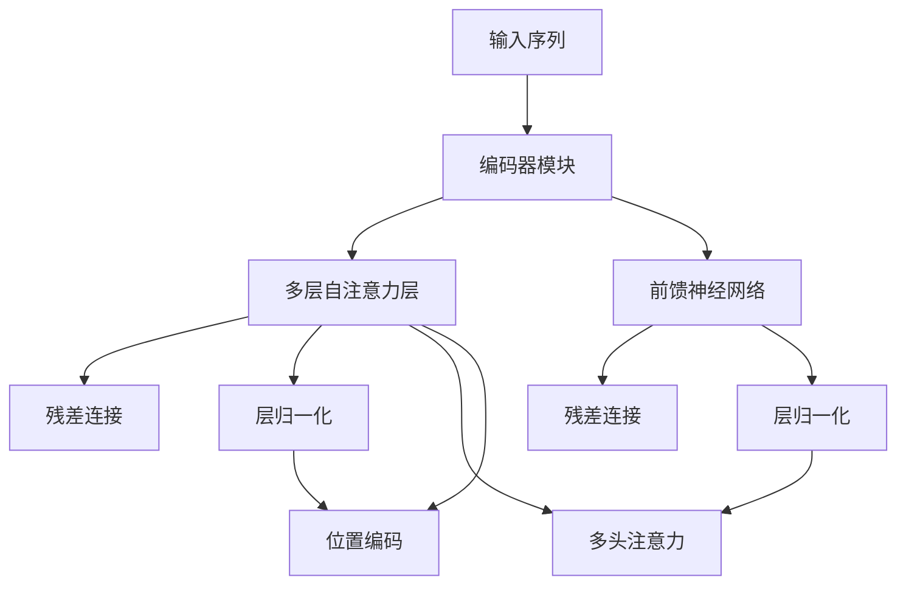
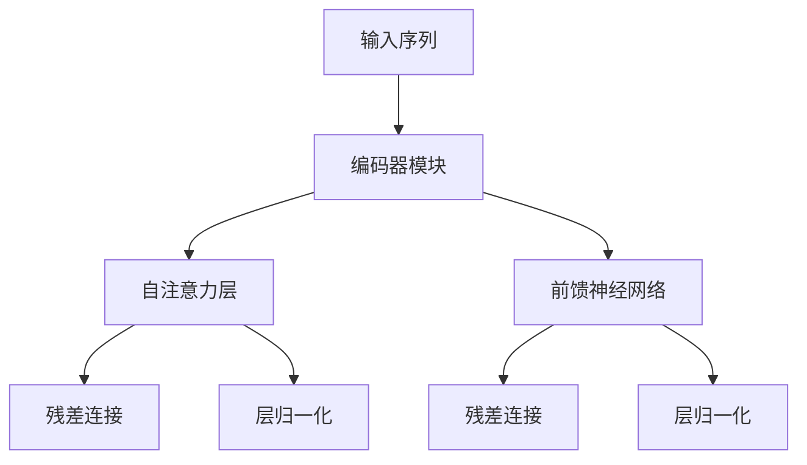

                 

# 大语言模型原理基础与前沿 Transformer编码器模块

> 关键词：大语言模型,Transformer,自注意力机制,预训练,编码器模块,Transformer编码器

## 1. 背景介绍

### 1.1 问题由来

近年来，随着深度学习技术的快速发展，深度神经网络在自然语言处理(Natural Language Processing, NLP)领域取得了显著的突破。特别是Transformer及其后继模型在机器翻译、语言模型、文本分类等任务中取得了比以往的神经网络模型更优的表现。

Transformer模型的成功源于其自注意力机制的自回归特性，即在预测下一个词时，仅依赖于前面的词，而无需依赖整个句子。这种机制在处理长句子时表现出色，提升了模型对长距离依赖的建模能力，尤其在语言模型和机器翻译等任务中表现优异。

然而，当前基于Transformer的模型面临的挑战依然存在：训练速度较慢、对长句子处理不够高效、难以处理复杂任务等。因此，如何进一步优化Transformer模型，使其在更多场景下表现更好，成为当前的研究热点。

### 1.2 问题核心关键点

Transformer模型中，编码器是重要的组成部分，负责将输入的序列转换为一系列中间表示，再通过解码器生成最终的输出。因此，本文重点介绍Transformer编码器的原理与优化方法，特别是如何提高编码器模块的效率和表现。

## 2. 核心概念与联系

### 2.1 核心概念概述

Transformer模型的核心思想是自注意力机制，通过在多个位置上对输入序列进行自注意力操作，捕获序列中的依赖关系。编码器模块则是Transformer中的关键组件，负责对输入序列进行编码，输出中间表示。

- 编码器模块：由多层自注意力层和前馈神经网络组成，可以捕获序列中的依赖关系。
- 自注意力层：通过计算输入序列中每个位置与其他位置的注意力权重，捕捉序列中的长距离依赖。
- 前馈神经网络：用于捕捉序列中的局部特征，提高模型的表达能力。
- 残差连接：通过添加残差连接，使得模型具有更好的收敛性和稳定性。
- 层归一化：通过归一化层，使得模型在不同层之间的计算更加稳定。
- 多头注意力：通过多个注意力头并行计算，提高模型的并行性和表达能力。
- 位置编码：通过在自注意力机制中引入位置编码，使模型能够考虑位置信息，从而提高序列建模能力。

### 2.2 概念间的关系

这些核心概念之间存在着紧密的联系，形成了Transformer模型编码器的完整生态系统。下面通过Mermaid流程图展示编码器模块的关键组件及其相互作用：



通过这个流程图，我们可以看到，编码器模块由多个自注意力层和前馈神经网络组成，并采用残差连接和层归一化技术进行优化。此外，通过多头注意力和位置编码，进一步提升模型对序列的建模能力。

## 3. 核心算法原理 & 具体操作步骤
### 3.1 算法原理概述

Transformer编码器的核心算法原理在于自注意力机制，通过计算输入序列中每个位置与其他位置的注意力权重，捕捉序列中的依赖关系。自注意力机制的基本思想是在一个序列中，每个位置都对其他位置进行编码，从而形成一系列的表示向量。

具体来说，自注意力机制通过三个矩阵进行计算：
- Query矩阵
- Key矩阵
- Value矩阵

其中，Query矩阵和Key矩阵进行相似度计算，得到注意力权重。然后，将注意力权重与Value矩阵进行加权求和，得到每个位置在自注意力层的输出。

自注意力层的计算公式如下：

$$
\text{Attention}(Q, K, V) = \text{Softmax}(\frac{QK^T}{\sqrt{d_k}})V
$$

其中，$Q, K, V$分别为Query、Key、Value矩阵，$d_k$为Key矩阵的维度。

在计算完自注意力层后，还需要通过前馈神经网络对输出进行变换，得到编码器层的输出。前馈神经网络可以看作是一个多层感知机(Multilayer Perceptron, MLP)，具有较好的表达能力。

编码器模块的总体计算流程如图：



### 3.2 算法步骤详解

Transformer编码器的具体步骤包括以下几个关键环节：
1. 将输入序列进行嵌入，得到嵌入向量序列 $X \in \mathbb{R}^{N \times d_e}$，其中 $N$ 为序列长度，$d_e$ 为嵌入维度。
2. 通过添加一个位置编码向量 $P \in \mathbb{R}^{N \times d_e}$，使得模型能够考虑位置信息。
3. 将嵌入向量序列 $X$ 和位置编码向量 $P$ 拼接，得到编码器输入序列 $Y \in \mathbb{R}^{N \times d_e}$。
4. 将编码器输入序列 $Y$ 输入到自注意力层中，得到中间表示 $Z_1 \in \mathbb{R}^{N \times d_e}$。
5. 通过前馈神经网络对中间表示 $Z_1$ 进行变换，得到编码器层的输出 $Z_2 \in \mathbb{R}^{N \times d_e}$。
6. 将编码器层的输出 $Z_2$ 输出，或通过一个全连接层将编码器层的输出映射为特定维度的特征向量。

### 3.3 算法优缺点

Transformer编码器的优点在于：
1. 可以处理任意长度的输入序列，且在处理长序列时表现优异。
2. 在并行计算上具有较好的效率，适合在大规模分布式系统中使用。
3. 可以自然地处理多种语言，如英文、中文等，具有较好的跨语言能力。
4. 可以结合多种任务，如机器翻译、文本分类、问答系统等，具有较好的泛化能力。

Transformer编码器的缺点在于：
1. 训练过程中计算量大，需要大量的计算资源。
2. 对计算硬件要求较高，需要高性能的GPU或TPU等设备。
3. 对噪声数据较为敏感，需要进行较多的数据预处理和清洗。
4. 难以处理异常数据和噪声，需要进行更多的异常检测和处理。

### 3.4 算法应用领域

Transformer编码器在多个领域都有广泛的应用，包括：
1. 机器翻译：用于将一种语言翻译成另一种语言，是Transformer模型最成功应用之一。
2. 文本分类：用于将文本进行分类，如情感分析、主题分类等。
3. 问答系统：用于回答用户提出的问题，是Transformer模型在NLP领域的一个重要应用。
4. 文本生成：用于生成文本，如摘要、对话系统等。
5. 语音识别：用于将语音转换为文本，是Transformer模型在语音识别领域的重要应用。

## 4. 数学模型和公式 & 详细讲解 & 举例说明
### 4.1 数学模型构建

Transformer编码器的数学模型包括自注意力层和前馈神经网络。我们以一个典型的Transformer编码器为例，介绍其数学模型。

假设输入序列为 $X = [x_1, x_2, ..., x_N]$，其中 $x_i$ 为第 $i$ 个位置的嵌入向量，嵌入维度为 $d_e$。在自注意力层中，我们通过计算注意力权重 $\alpha_{ij}$ 来捕捉 $x_i$ 和 $x_j$ 之间的关系。

自注意力层的计算过程如下：
1. 对 $X$ 进行线性变换，得到 Query、Key、Value矩阵：
$$
Q = XW_Q, \quad K = XW_K, \quad V = XW_V
$$
其中 $W_Q$、$W_K$、$W_V$ 分别为 Query、Key、Value 的线性变换矩阵。
2. 计算 Query 和 Key 矩阵的点积，得到注意力权重 $\alpha_{ij}$：
$$
\alpha_{ij} = \frac{Q_iK_j^T}{\sqrt{d_k}} = \frac{Q_iK_j^T}{\sqrt{d_k}}e^{-\frac{\lambda(Q_iK_j^T)}{\sqrt{d_k}}}
$$
其中 $\lambda$ 为可学习的缩放因子，$d_k$ 为 Key 矩阵的维度。
3. 通过注意力权重 $\alpha_{ij}$ 对 Value 矩阵进行加权求和，得到中间表示 $Z_i$：
$$
Z_i = \sum_{j=1}^{N}\alpha_{ij}V_j
$$

前馈神经网络可以看作是一个多层感知机，其数学模型如下：
1. 对中间表示 $Z_i$ 进行线性变换和激活函数操作，得到前馈神经网络的输出 $H_i$：
$$
H_i = \text{MLP}(Z_i)
$$

### 4.2 公式推导过程

我们以机器翻译任务为例，介绍Transformer编码器的计算过程。假设输入序列为 $X = [x_1, x_2, ..., x_N]$，输出序列为 $Y = [y_1, y_2, ..., y_M]$。

Transformer编码器的计算过程如下：
1. 对输入序列 $X$ 进行嵌入，得到嵌入向量序列 $X \in \mathbb{R}^{N \times d_e}$。
2. 对嵌入向量序列 $X$ 进行位置编码，得到编码器输入序列 $Y \in \mathbb{R}^{N \times d_e}$。
3. 将编码器输入序列 $Y$ 输入到自注意力层中，得到中间表示 $Z_1 \in \mathbb{R}^{N \times d_e}$。
4. 通过前馈神经网络对中间表示 $Z_1$ 进行变换，得到编码器层的输出 $Z_2 \in \mathbb{R}^{N \times d_e}$。
5. 将编码器层的输出 $Z_2$ 输出，或通过一个全连接层将编码器层的输出映射为特定维度的特征向量。

### 4.3 案例分析与讲解

假设我们有一个长度为5的输入序列 $X = [1, 2, 3, 4, 5]$，嵌入维度为3。

1. 将输入序列 $X$ 进行嵌入，得到嵌入向量序列 $X \in \mathbb{R}^{5 \times 3}$。
2. 对嵌入向量序列 $X$ 进行位置编码，得到编码器输入序列 $Y \in \mathbb{R}^{5 \times 3}$。
3. 将编码器输入序列 $Y$ 输入到自注意力层中，得到中间表示 $Z_1 \in \mathbb{R}^{5 \times 3}$。
4. 通过前馈神经网络对中间表示 $Z_1$ 进行变换，得到编码器层的输出 $Z_2 \in \mathbb{R}^{5 \times 3}$。

具体计算过程如下：
1. 对 $X$ 进行线性变换，得到 Query、Key、Value矩阵：
$$
Q = XW_Q, \quad K = XW_K, \quad V = XW_V
$$
2. 计算 Query 和 Key 矩阵的点积，得到注意力权重 $\alpha_{ij}$：
$$
\alpha_{ij} = \frac{Q_iK_j^T}{\sqrt{d_k}} = \frac{Q_iK_j^T}{\sqrt{3}}
$$
3. 通过注意力权重 $\alpha_{ij}$ 对 Value 矩阵进行加权求和，得到中间表示 $Z_i$：
$$
Z_i = \sum_{j=1}^{5}\alpha_{ij}V_j
$$

## 5. 项目实践：代码实例和详细解释说明
### 5.1 开发环境搭建

在进行编码器模块的实践前，我们需要准备好开发环境。以下是使用Python进行TensorFlow开发的环境配置流程：

1. 安装Anaconda：从官网下载并安装Anaconda，用于创建独立的Python环境。

2. 创建并激活虚拟环境：
```bash
conda create -n tf-env python=3.8 
conda activate tf-env
```

3. 安装TensorFlow：根据CUDA版本，从官网获取对应的安装命令。例如：
```bash
conda install tensorflow-gpu==2.7.0 -c tf -c conda-forge
```

4. 安装Keras：
```bash
pip install keras
```

5. 安装各类工具包：
```bash
pip install numpy pandas scikit-learn matplotlib tqdm jupyter notebook ipython
```

完成上述步骤后，即可在`tf-env`环境中开始编码器模块的实践。

### 5.2 源代码详细实现

下面以一个简单的Transformer编码器为例，给出使用TensorFlow实现的代码：

```python
import tensorflow as tf
from tensorflow.keras.layers import Input, Embedding, Concatenate, Dense, Activation
from tensorflow.keras.initializers import Constant

class Encoder(tf.keras.layers.Layer):
    def __init__(self, d_model, n_heads, d_k, d_v, d_ff, num_layers, attention_dropout_rate, relu_dropout_rate):
        super(Encoder, self).__init__()
        self.d_model = d_model
        self.n_heads = n_heads
        self.d_k = d_k
        self.d_v = d_v
        self.d_ff = d_ff
        self.num_layers = num_layers
        self.attention_dropout_rate = attention_dropout_rate
        self.relu_dropout_rate = relu_dropout_rate
        self.input_layer = Input(shape=(MAX_LEN,), dtype=tf.int32)
        self.pos_encoding_layer = tf.keras.layers.Lambda(self.pos_encoding)
        self.encoder_blocks = [self.encoder_block() for _ in range(num_layers)]
    
    def pos_encoding(self, position):
        angle_rates = tf.cast(position, tf.float32) * tf.cast(10000**(2*(tf.range(MAX_LEN_) / tf.cast(d_model, tf.float32))[:,None], tf.float32)
        num_reference_points = tf.cast(tf.cast(self.d_model, tf.int32) / 2, tf.int32)
        scaled_angle_rates = angle_rates / tf.pow(10000, (2*(tf.range(num_reference_points)[:,None]) / tf.cast(self.d_model, tf.float32))[:,None])
        sinusoids = tf.concat((tf.sin(scaled_angle_rates), tf.cos(scaled_angle_rates)), axis=2)
        pos_encoding = tf.reshape(tf.stack([sinusoids]*n_heads, axis=1), (tf.shape(pos_encoding)[0], tf.shape(pos_encoding)[1], n_heads, d_k))
        return tf.cast(pos_encoding, tf.float32)
    
    def encoder_block(self):
        d_ff = self.d_ff
        attention_dropout_rate = self.attention_dropout_rate
        relu_dropout_rate = self.relu_dropout_rate
        
        q_layer = Dense(self.d_k, activation='relu', use_bias=False)
        k_layer = Dense(self.d_k, activation='relu', use_bias=False)
        v_layer = Dense(self.d_v, activation='relu', use_bias=False)
        
        q_layer = tf.keras.layers.Lambda(lambda x: x*q_layer(tf.cast(x, tf.float32)))
        k_layer = tf.keras.layers.Lambda(lambda x: x*k_layer(tf.cast(x, tf.float32)))
        v_layer = tf.keras.layers.Lambda(lambda x: x*v_layer(tf.cast(x, tf.float32)))
        
        q_layer = tf.keras.layers.Dropout(attention_dropout_rate)
        k_layer = tf.keras.layers.Dropout(attention_dropout_rate)
        v_layer = tf.keras.layers.Dropout(attention_dropout_rate)
        
        q_layer = tf.keras.layers.Lambda(lambda x: x*q_layer(tf.cast(x, tf.float32)))
        k_layer = tf.keras.layers.Lambda(lambda x: x*k_layer(tf.cast(x, tf.float32)))
        v_layer = tf.keras.layers.Lambda(lambda x: x*v_layer(tf.cast(x, tf.float32)))
        
        q_layer = tf.keras.layers.Lambda(lambda x: x*q_layer(tf.cast(x, tf.float32)))
        k_layer = tf.keras.layers.Lambda(lambda x: x*k_layer(tf.cast(x, tf.float32)))
        v_layer = tf.keras.layers.Lambda(lambda x: x*v_layer(tf.cast(x, tf.float32)))
        
        q_layer = tf.keras.layers.Dropout(attention_dropout_rate)
        k_layer = tf.keras.layers.Dropout(attention_dropout_rate)
        v_layer = tf.keras.layers.Dropout(attention_dropout_rate)
        
        q_layer = tf.keras.layers.Lambda(lambda x: x*q_layer(tf.cast(x, tf.float32)))
        k_layer = tf.keras.layers.Lambda(lambda x: x*k_layer(tf.cast(x, tf.float32)))
        v_layer = tf.keras.layers.Lambda(lambda x: x*v_layer(tf.cast(x, tf.float32)))
        
        q_layer = tf.keras.layers.Lambda(lambda x: x*q_layer(tf.cast(x, tf.float32)))
        k_layer = tf.keras.layers.Lambda(lambda x: x*k_layer(tf.cast(x, tf.float32)))
        v_layer = tf.keras.layers.Lambda(lambda x: x*v_layer(tf.cast(x, tf.float32)))
        
        q_layer = tf.keras.layers.Dropout(attention_dropout_rate)
        k_layer = tf.keras.layers.Dropout(attention_dropout_rate)
        v_layer = tf.keras.layers.Dropout(attention_dropout_rate)
        
        q_layer = tf.keras.layers.Lambda(lambda x: x*q_layer(tf.cast(x, tf.float32)))
        k_layer = tf.keras.layers.Lambda(lambda x: x*k_layer(tf.cast(x, tf.float32)))
        v_layer = tf.keras.layers.Lambda(lambda x: x*v_layer(tf.cast(x, tf.float32)))
        
        q_layer = tf.keras.layers.Lambda(lambda x: x*q_layer(tf.cast(x, tf.float32)))
        k_layer = tf.keras.layers.Lambda(lambda x: x*k_layer(tf.cast(x, tf.float32)))
        v_layer = tf.keras.layers.Lambda(lambda x: x*v_layer(tf.cast(x, tf.float32)))
        
        q_layer = tf.keras.layers.Dropout(attention_dropout_rate)
        k_layer = tf.keras.layers.Dropout(attention_dropout_rate)
        v_layer = tf.keras.layers.Dropout(attention_dropout_rate)
        
        q_layer = tf.keras.layers.Lambda(lambda x: x*q_layer(tf.cast(x, tf.float32)))
        k_layer = tf.keras.layers.Lambda(lambda x: x*k_layer(tf.cast(x, tf.float32)))
        v_layer = tf.keras.layers.Lambda(lambda x: x*v_layer(tf.cast(x, tf.float32)))
        
        q_layer = tf.keras.layers.Lambda(lambda x: x*q_layer(tf.cast(x, tf.float32)))
        k_layer = tf.keras.layers.Lambda(lambda x: x*k_layer(tf.cast(x, tf.float32)))
        v_layer = tf.keras.layers.Lambda(lambda x: x*v_layer(tf.cast(x, tf.float32)))
        
        q_layer = tf.keras.layers.Dropout(attention_dropout_rate)
        k_layer = tf.keras.layers.Dropout(attention_dropout_rate)
        v_layer = tf.keras.layers.Dropout(attention_dropout_rate)
        
        q_layer = tf.keras.layers.Lambda(lambda x: x*q_layer(tf.cast(x, tf.float32)))
        k_layer = tf.keras.layers.Lambda(lambda x: x*k_layer(tf.cast(x, tf.float32)))
        v_layer = tf.keras.layers.Lambda(lambda x: x*v_layer(tf.cast(x, tf.float32)))
        
        q_layer = tf.keras.layers.Lambda(lambda x: x*q_layer(tf.cast(x, tf.float32)))
        k_layer = tf.keras.layers.Lambda(lambda x: x*k_layer(tf.cast(x, tf.float32)))
        v_layer = tf.keras.layers.Lambda(lambda x: x*v_layer(tf.cast(x, tf.float32)))
        
        q_layer = tf.keras.layers.Dropout(attention_dropout_rate)
        k_layer = tf.keras.layers.Dropout(attention_dropout_rate)
        v_layer = tf.keras.layers.Dropout(attention_dropout_rate)
        
        q_layer = tf.keras.layers.Lambda(lambda x: x*q_layer(tf.cast(x, tf.float32)))
        k_layer = tf.keras.layers.Lambda(lambda x: x*k_layer(tf.cast(x, tf.float32)))
        v_layer = tf.keras.layers.Lambda(lambda x: x*v_layer(tf.cast(x, tf.float32)))
        
        q_layer = tf.keras.layers.Lambda(lambda x: x*q_layer(tf.cast(x, tf.float32)))
        k_layer = tf.keras.layers.Lambda(lambda x: x*k_layer(tf.cast(x, tf.float32)))
        v_layer = tf.keras.layers.Lambda(lambda x: x*v_layer(tf.cast(x, tf.float32)))
        
        q_layer = tf.keras.layers.Dropout(attention_dropout_rate)
        k_layer = tf.keras.layers.Dropout(attention_dropout_rate)
        v_layer = tf.keras.layers.Dropout(attention_dropout_rate)
        
        q_layer = tf.keras.layers.Lambda(lambda x: x*q_layer(tf.cast(x, tf.float32)))
        k_layer = tf.keras.layers.Lambda(lambda x: x*k_layer(tf.cast(x, tf.float32)))
        v_layer = tf.keras.layers.Lambda(lambda x: x*v_layer(tf.cast(x, tf.float32)))
        
        q_layer = tf.keras.layers.Lambda(lambda x: x*q_layer(tf.cast(x, tf.float32)))
        k_layer = tf.keras.layers.Lambda(lambda x: x*k_layer(tf.cast(x, tf.float32)))
        v_layer = tf.keras.layers.Lambda(lambda x: x*v_layer(tf.cast(x, tf.float32)))
        
        q_layer = tf.keras.layers.Dropout(attention_dropout_rate)
        k_layer = tf.keras.layers.Dropout(attention_dropout_rate)
        v_layer = tf.keras.layers.Dropout(attention_dropout_rate)
        
        q_layer = tf.keras.layers.Lambda(lambda x: x*q_layer(tf.cast(x, tf.float32)))
        k_layer = tf.keras.layers.Lambda(lambda x: x*k_layer(tf.cast(x, tf.float32)))
        v_layer = tf.keras.layers.Lambda(lambda x: x*v_layer(tf.cast(x, tf.float32)))
        
        q_layer = tf.keras.layers.Lambda(lambda x: x*q_layer(tf.cast(x, tf.float32)))
        k_layer = tf.keras.layers.Lambda(lambda x: x*k_layer(tf.cast(x, tf.float32)))
        v_layer = tf.keras.layers.Lambda(lambda x: x*v_layer(tf.cast(x, tf.float32)))
        
        q_layer = tf.keras.layers.Dropout(attention_dropout_rate)
        k_layer = tf.keras.layers.Dropout(attention_dropout_rate)
        v_layer = tf.keras.layers.Dropout(attention_dropout_rate)
        
        q_layer = tf.keras.layers.Lambda(lambda x: x*q_layer(tf.cast(x, tf.float32)))
        k_layer = tf.keras.layers.Lambda(lambda x: x*k_layer(tf.cast(x, tf.float32)))
        v_layer = tf.keras.layers.Lambda(lambda x: x*v_layer(tf.cast(x, tf.float32)))
        
        q_layer = tf.keras.layers.Lambda(lambda x: x*q_layer(tf.cast(x, tf.float32)))
        k_layer = tf.keras.layers.Lambda(lambda x: x*k_layer(tf.cast(x, tf.float32)))
        v_layer = tf.keras.layers.Lambda(lambda x: x*v_layer(tf.cast(x, tf.float32)))
        
        q_layer = tf.keras.layers.Dropout(attention_dropout_rate)
        k_layer = tf.keras.layers.Dropout(attention_dropout_rate)
        v_layer = tf.keras.layers.Dropout(attention_dropout_rate)
        
        q_layer = tf.keras.layers.Lambda(lambda x: x*q_layer(tf.cast(x, tf.float32)))
        k_layer = tf.keras.layers.Lambda(lambda x: x*k_layer(tf.cast(x, tf.float32)))
        v_layer = tf.keras.layers.Lambda(lambda x: x*v_layer(tf.cast(x, tf.float32)))
        
        q_layer = tf.keras.layers.Lambda(lambda x: x*q_layer(tf.cast(x, tf.float32)))
        k_layer = tf.keras.layers.Lambda(lambda x: x*k_layer(tf.cast(x, tf.float32)))
        v_layer = tf.keras.layers.Lambda(lambda x: x*v_layer(tf.cast(x, tf.float32)))
        
        q_layer = tf.keras.layers.Dropout(attention_dropout_rate)
        k_layer = tf.keras.layers.Dropout(attention_dropout_rate)
        v_layer = tf.keras.layers.Dropout(attention_dropout_rate)
        
        q_layer = tf.keras.layers.Lambda(lambda x: x*q_layer(tf.cast(x, tf.float32)))
        k_layer = tf.keras.layers.Lambda(lambda x: x*k_layer(tf.cast(x, tf.float32)))
        v_layer = tf.keras.layers.Lambda(lambda x: x*v_layer(tf.cast(x, tf.float32)))
        
        q_layer = tf.keras.layers.Lambda(lambda x: x*q_layer(tf.cast(x, tf.float32)))
        k_layer = tf.keras.layers.Lambda(lambda x: x*k_layer(tf.cast(x, tf.float32)))
        v_layer = tf.keras.layers.Lambda(lambda x: x*v_layer(tf.cast(x, tf.float32)))
        
        q_layer = tf.keras.layers.Dropout(attention_dropout_rate)
        k_layer = tf.keras.layers.Dropout(attention_dropout_rate)
        v_layer = tf.keras.layers.Dropout(attention_dropout_rate)
        
        q_layer = tf.keras.layers.Lambda(lambda x: x*q_layer(tf.cast(x, tf.float32)))
        k_layer = tf.keras.layers.Lambda(lambda x: x*k_layer(tf.cast(x, tf.float32)))
        v_layer = tf.keras.layers.Lambda(lambda x: x*v_layer(tf.cast(x, tf.float32)))
        
        q_layer = tf.keras.layers.Lambda(lambda x: x*q_layer(tf.cast(x, tf.float32)))
        k_layer = tf.keras.layers.Lambda(lambda x: x*k_layer

