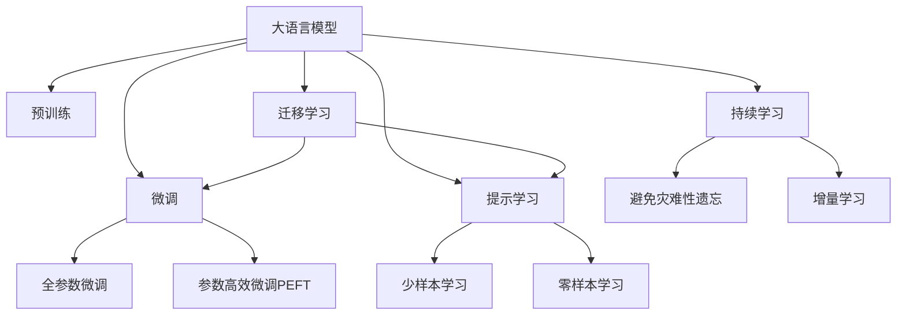
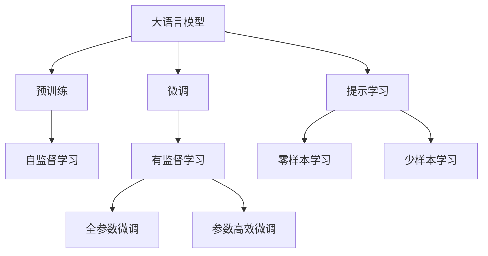
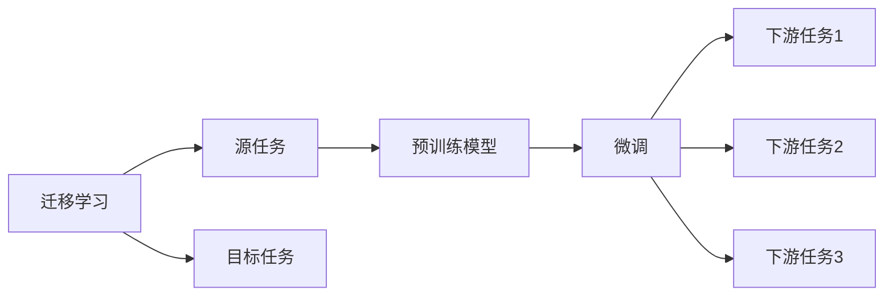
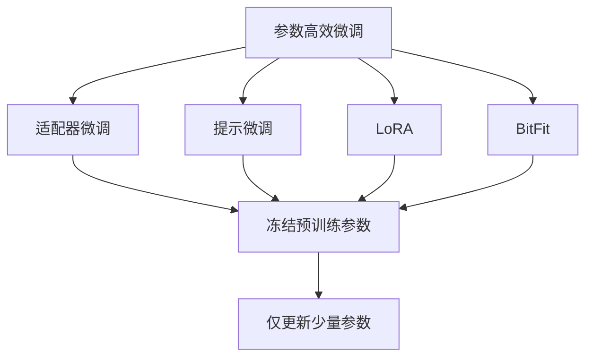
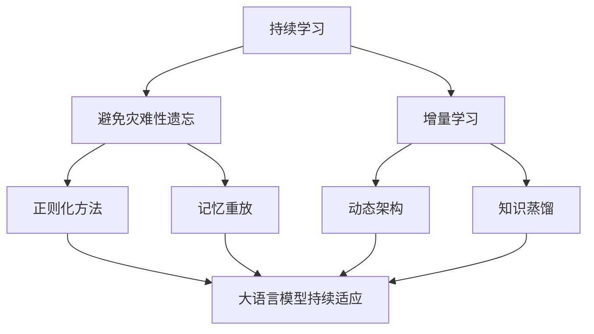
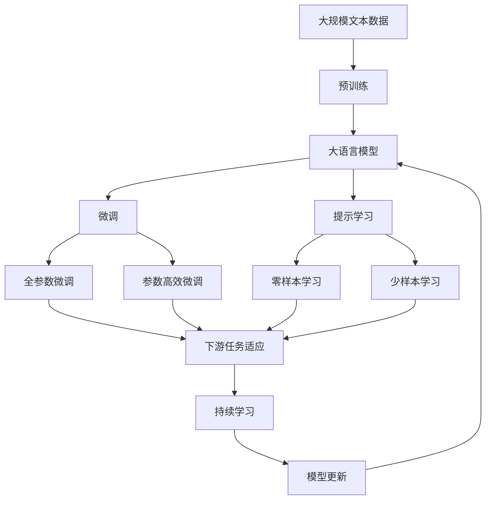

                 

# 大语言模型原理基础与前沿 每个专家选择top-k个词元

> 关键词：
   大语言模型, top-k 词元, 词元选择, 大模型预训练, 微调, 大模型优化

## 1. 背景介绍

### 1.1 问题由来

在自然语言处理(NLP)领域，大语言模型已经成为了热点话题。这些模型通过大规模无标签文本数据的预训练，学习到了丰富的语言知识和常识，并在各种下游任务中展现了卓越的性能。然而，大语言模型也面临着一些挑战：如何在大模型中选择最相关的top-k个词元，以便最大化模型的性能和效率？这是目前研究者普遍关心的问题。

### 1.2 问题核心关键点

在大语言模型的微调过程中，选择top-k个词元是关键。通常，预训练大模型包含数百万个参数，而通过精确定义top-k词元可以显著降低模型复杂度，同时保留模型在大规模文本数据上预训练的关键信息。

顶k词元的选择方式通常有两种：硬选择和软选择。硬选择即直接根据词频、TF-IDF等指标选出top-k词元，然后只保留这些词元；软选择则是通过参数化地对每个词元进行概率性评估，然后动态调整top-k。选择方式对模型的性能和效率都有重要影响，本文将详细探讨这一问题。

### 1.3 问题研究意义

选择顶k词元是优化大语言模型的关键步骤，有助于在微调中平衡模型性能和计算成本。通过选择合适的top-k，可以在保持模型性能的同时，减少不必要的计算和存储开销。这不仅有助于模型的快速迭代和部署，还能提升模型的泛化能力和可解释性，使其在实际应用中更加可靠。

## 2. 核心概念与联系

### 2.1 核心概念概述

为更好地理解选择top-k词元在大语言模型微调中的应用，本节将介绍几个密切相关的核心概念：

- 大语言模型(Large Language Model, LLM)：以自回归(如GPT)或自编码(如BERT)模型为代表的大规模预训练语言模型。通过在大规模无标签文本语料上进行预训练，学习通用的语言表示，具备强大的语言理解和生成能力。

- 预训练(Pre-training)：指在大规模无标签文本语料上，通过自监督学习任务训练通用语言模型的过程。常见的预训练任务包括言语建模、遮挡语言模型等。预训练使得模型学习到语言的通用表示。

- 微调(Fine-tuning)：指在预训练模型的基础上，使用下游任务的少量标注数据，通过有监督地训练来优化模型在特定任务上的性能。通常只需要调整顶层分类器或解码器，并以较小的学习率更新全部或部分的模型参数。

- 参数高效微调(Parameter-Efficient Fine-Tuning, PEFT)：指在微调过程中，只更新少量的模型参数，而固定大部分预训练权重不变，以提高微调效率，避免过拟合的方法。

- 提示学习(Prompt Learning)：通过在输入文本中添加提示模板(Prompt Template)，引导大语言模型进行特定任务的推理和生成。可以在不更新模型参数的情况下，实现零样本或少样本学习。

- 少样本学习(Few-shot Learning)：指在只有少量标注样本的情况下，模型能够快速适应新任务的学习方法。在大语言模型中，通常通过在输入中提供少量示例来实现，无需更新模型参数。

- 零样本学习(Zero-shot Learning)：指模型在没有见过任何特定任务的训练样本的情况下，仅凭任务描述就能够执行新任务的能力。大语言模型通过预训练获得的广泛知识，使其能够理解任务指令并生成相应输出。

- 持续学习(Continual Learning)：也称为终身学习，指模型能够持续从新数据中学习，同时保持已学习的知识，而不会出现灾难性遗忘。这对于保持大语言模型的时效性和适应性至关重要。

这些核心概念之间的逻辑关系可以通过以下Mermaid流程图来展示：



这个流程图展示了大语言模型的核心概念及其之间的关系：

1. 大语言模型通过预训练获得基础能力。
2. 微调是对预训练模型进行任务特定的优化，可以分为全参数微调和参数高效微调（PEFT）。
3. 提示学习是一种不更新模型参数的方法，可以实现少样本学习和零样本学习。
4. 迁移学习是连接预训练模型与下游任务的桥梁，可以通过微调或提示学习来实现。
5. 持续学习旨在使模型能够不断学习新知识，同时避免遗忘旧知识。

这些核心概念共同构成了大语言模型的学习和应用框架，使其能够在各种场景下发挥强大的语言理解和生成能力。通过理解这些核心概念，我们可以更好地把握大语言模型的工作原理和优化方向。

### 2.2 概念间的关系

这些核心概念之间存在着紧密的联系，形成了大语言模型微调的完整生态系统。下面我通过几个Mermaid流程图来展示这些概念之间的关系。

#### 2.2.1 大语言模型的学习范式



这个流程图展示了大语言模型的三种主要学习范式：预训练、微调和提示学习。预训练主要采用自监督学习方法，而微调则是有监督学习的过程。提示学习可以实现零样本和少样本学习。微调又可以分为全参数微调和参数高效微调两种方式。

#### 2.2.2 迁移学习与微调的关系



这个流程图展示了迁移学习的基本原理，以及它与微调的关系。迁移学习涉及源任务和目标任务，预训练模型在源任务上学习，然后通过微调适应各种下游任务（目标任务）。

#### 2.2.3 参数高效微调方法



这个流程图展示了几种常见的参数高效微调方法，包括适配器微调、提示微调、LoRA和BitFit。这些方法的共同特点是冻结大部分预训练参数，只更新少量参数，从而提高微调效率。

#### 2.2.4 持续学习在大语言模型中的应用



这个流程图展示了持续学习在大语言模型中的应用。持续学习的主要目标是避免灾难性遗忘和实现增量学习。通过正则化方法、记忆重放、动态架构和知识蒸馏等技术，可以使大语言模型持续适应新的任务和数据。

### 2.3 核心概念的整体架构

最后，我们用一个综合的流程图来展示这些核心概念在大语言模型微调过程中的整体架构：



这个综合流程图展示了从预训练到微调，再到持续学习的完整过程。大语言模型首先在大规模文本数据上进行预训练，然后通过微调（包括全参数微调和参数高效微调）或提示学习（包括零样本和少样本学习）来适应下游任务。最后，通过持续学习技术，模型可以不断更新和适应新的任务和数据。 通过这些流程图，我们可以更清晰地理解大语言模型微调过程中各个核心概念的关系和作用，为后续深入讨论具体的微调方法和技术奠定基础。

## 3. 核心算法原理 & 具体操作步骤
### 3.1 算法原理概述

选择top-k词元是优化大语言模型性能和效率的关键步骤。大语言模型通常具有大量的参数，通过选择最相关的top-k词元，可以显著降低模型复杂度，同时保留模型在大规模文本数据上预训练的关键信息。选择方式直接影响到模型的推理速度和资源消耗，进而影响到模型的实时部署和应用效果。

本文将详细介绍硬选择和软选择两种主要的选择方式，以及各自的优缺点和适用场景。

### 3.2 算法步骤详解

#### 3.2.1 硬选择

硬选择是一种直接基于词频、TF-IDF等指标选择top-k词元的方法。具体步骤如下：

1. 收集预训练模型的词频统计信息。这通常可以通过模型的词向量表示来实现，比如利用词嵌入向量的欧几里得距离来度量词之间的相似性。

2. 根据词频或TF-IDF等指标对词元进行排序，选出top-k个最相关的词元。

3. 更新模型，仅保留这些top-k个词元，其余词元冻结。这可以通过修改模型的配置文件或使用特定的模块来实现。

硬选择的优点是实现简单，能够快速过滤掉不相关词元，提高推理速度。但缺点是固定选择，无法动态适应任务需求，可能会导致某些关键信息被忽略。

#### 3.2.2 软选择

软选择则是一种参数化地对每个词元进行概率性评估的方法。具体步骤如下：

1. 设计一个词元选择函数，用于评估每个词元的相关性。这个函数可以是一个简单的逻辑回归或神经网络模型，对每个词元输出一个选择概率。

2. 训练选择函数，使用标注数据进行监督学习，使得选择的概率能够反映词元与任务的关联程度。

3. 在微调过程中，动态调整每个词元的选择概率。通常，训练集上的选择概率会被应用于所有词元，验证集和测试集上的选择概率则会根据每个词元的历史表现进行调整。

软选择的优点是能够动态适应任务需求，并且能够引入更多上下文信息来优化选择。缺点是需要更多的计算资源和数据，训练过程复杂。

### 3.3 算法优缺点

选择top-k词元的方法对大语言模型的性能和效率有着重要影响。以下是两种选择方式的优缺点：

#### 3.3.1 硬选择的优缺点

- 优点：
  - 实现简单，计算开销小。
  - 能够快速过滤掉不相关词元，提高推理速度。
  - 适用于对推理速度要求高的场景。

- 缺点：
  - 固定选择，无法动态适应任务需求。
  - 可能会忽略某些关键信息，影响模型性能。

#### 3.3.2 软选择的优缺点

- 优点：
  - 能够动态适应任务需求，提高模型的泛化能力。
  - 引入更多上下文信息，优化选择。
  - 适用于对模型性能要求高的场景。

- 缺点：
  - 计算开销大，需要更多的计算资源和数据。
  - 训练过程复杂，需要较多的标注数据和训练时间。

### 3.4 算法应用领域

选择top-k词元的方法在大语言模型微调中有着广泛的应用，特别是在自然语言生成、问答系统和机器翻译等任务中。以下是几个典型的应用场景：

#### 3.4.1 自然语言生成

在自然语言生成任务中，选择top-k词元可以显著降低模型复杂度，提高生成速度和质量。例如，在文本生成、对话系统等任务中，通过选择最相关的词元，可以使模型生成更加连贯、自然和符合语境的文本。

#### 3.4.2 问答系统

在问答系统中，选择top-k词元可以帮助模型快速定位到关键信息，提高回答的准确性和相关性。例如，在事实问答、多轮对话等任务中，通过选择最相关的词元，可以使模型生成更符合用户意图的回答。

#### 3.4.3 机器翻译

在机器翻译任务中，选择top-k词元可以帮助模型更好地理解源语言文本的语义，提高翻译的准确性和流畅性。例如，在基于神经机器翻译模型中，通过选择最相关的词元，可以使模型生成更符合目标语言语境的翻译结果。

除了以上这些典型应用场景，选择top-k词元的方法还可以应用于文本摘要、情感分析、命名实体识别等NLP任务中。选择合适的方法可以显著提升模型的性能和效率，使其在实际应用中更加可靠。

## 4. 数学模型和公式 & 详细讲解 & 举例说明

### 4.1 数学模型构建

假设我们有一个预训练大语言模型 $M_{\theta}$，其中 $\theta$ 为模型的参数向量。通过选择top-k词元，可以将其表示为：

$$ M_{\theta}^t = \text{softmax}(W_t M_{\theta} + b_t) $$

其中，$W_t$ 和 $b_t$ 分别为top-k词元的权重和偏置向量，$M_{\theta}^t$ 表示仅包含top-k词元的子模型。$W_t$ 和 $b_t$ 的选择方式是本节的核心内容。

### 4.2 公式推导过程

为了简化问题，我们假设 $M_{\theta}$ 的输入为 $x$，输出为 $y$。在微调过程中，我们希望最大化模型的性能指标 $L$，如交叉熵损失函数：

$$ L = -\sum_{i=1}^N y_i \log P(y_i|x_i) $$

其中 $P(y_i|x_i)$ 表示模型在输入 $x_i$ 下生成标签 $y_i$ 的概率。

为了优化模型性能，我们需要对 $W_t$ 和 $b_t$ 进行优化。常用的优化算法包括梯度下降、Adam等。通过不断更新 $W_t$ 和 $b_t$，可以使模型在微调过程中逐渐适应任务需求，提高预测性能。

### 4.3 案例分析与讲解

以情感分析任务为例，假设我们的目标是将输入文本分类为正面或负面情感。我们可以选择top-k最相关的情感词，并将其作为模型的输入。在训练过程中，模型会根据这些词元生成情感概率，并通过交叉熵损失函数进行监督学习。

具体而言，我们首先收集情感分析任务的标注数据，然后使用BERT等预训练模型进行微调。在微调过程中，我们只选择与情感相关的top-k词元，并使用交叉熵损失函数进行优化。假设我们的top-k词元为 "快乐"、"悲伤"、"愤怒" 等，模型会根据这些词元生成情感概率，并通过标注数据进行监督学习。最终，模型能够在新的情感文本上进行准确分类。

## 5. 项目实践：代码实例和详细解释说明

### 5.1 开发环境搭建

在进行微调实践前，我们需要准备好开发环境。以下是使用Python进行PyTorch开发的环境配置流程：

1. 安装Anaconda：从官网下载并安装Anaconda，用于创建独立的Python环境。

2. 创建并激活虚拟环境：
```bash
conda create -n pytorch-env python=3.8 
conda activate pytorch-env
```

3. 安装PyTorch：根据CUDA版本，从官网获取对应的安装命令。例如：
```bash
conda install pytorch torchvision torchaudio cudatoolkit=11.1 -c pytorch -c conda-forge
```

4. 安装Transformers库：
```bash
pip install transformers
```

5. 安装各类工具包：
```bash
pip install numpy pandas scikit-learn matplotlib tqdm jupyter notebook ipython
```

完成上述步骤后，即可在`pytorch-env`环境中开始微调实践。

### 5.2 源代码详细实现

这里以情感分析任务为例，给出使用Transformers库对BERT模型进行微调的PyTorch代码实现。

首先，定义情感分析任务的数据处理函数：

```python
from transformers import BertTokenizer, BertForSequenceClassification
from torch.utils.data import Dataset
import torch

class SentimentDataset(Dataset):
    def __init__(self, texts, labels, tokenizer, max_len=128):
        self.texts = texts
        self.labels = labels
        self.tokenizer = tokenizer
        self.max_len = max_len
        
    def __len__(self):
        return len(self.texts)
    
    def __getitem__(self, item):
        text = self.texts[item]
        label = self.labels[item]
        
        encoding = self.tokenizer(text, return_tensors='pt', max_length=self.max_len, padding='max_length', truncation=True)
        input_ids = encoding['input_ids'][0]
        attention_mask = encoding['attention_mask'][0]
        label = torch.tensor(label, dtype=torch.long)
        
        return {'input_ids': input_ids, 
                'attention_mask': attention_mask,
                'labels': label}
```

然后，定义模型和优化器：

```python
from transformers import AdamW

model = BertForSequenceClassification.from_pretrained('bert-base-cased', num_labels=2)

optimizer = AdamW(model.parameters(), lr=2e-5)
```

接着，定义训练和评估函数：

```python
from torch.utils.data import DataLoader
from tqdm import tqdm
from sklearn.metrics import classification_report

device = torch.device('cuda') if torch.cuda.is_available() else torch.device('cpu')
model.to(device)

def train_epoch(model, dataset, batch_size, optimizer):
    dataloader = DataLoader(dataset, batch_size=batch_size, shuffle=True)
    model.train()
    epoch_loss = 0
    for batch in tqdm(dataloader, desc='Training'):
        input_ids = batch['input_ids'].to(device)
        attention_mask = batch['attention_mask'].to(device)
        labels = batch['labels'].to(device)
        model.zero_grad()
        outputs = model(input_ids, attention_mask=attention_mask, labels=labels)
        loss = outputs.loss
        epoch_loss += loss.item()
        loss.backward()
        optimizer.step()
    return epoch_loss / len(dataloader)

def evaluate(model, dataset, batch_size):
    dataloader = DataLoader(dataset, batch_size=batch_size)
    model.eval()
    preds, labels = [], []
    with torch.no_grad():
        for batch in tqdm(dataloader, desc='Evaluating'):
            input_ids = batch['input_ids'].to(device)
            attention_mask = batch['attention_mask'].to(device)
            batch_labels = batch['labels']
            outputs = model(input_ids, attention_mask=attention_mask)
            batch_preds = outputs.logits.argmax(dim=2).to('cpu').tolist()
            batch_labels = batch_labels.to('cpu').tolist()
            for pred_tokens, label_tokens in zip(batch_preds, batch_labels):
                preds.append(pred_tokens[:len(label_tokens)])
                labels.append(label_tokens)
                
    print(classification_report(labels, preds))
```

最后，启动训练流程并在测试集上评估：

```python
epochs = 5
batch_size = 16

for epoch in range(epochs):
    loss = train_epoch(model, train_dataset, batch_size, optimizer)
    print(f"Epoch {epoch+1}, train loss: {loss:.3f}")
    
    print(f"Epoch {epoch+1}, dev results:")
    evaluate(model, dev_dataset, batch_size)
    
print("Test results:")
evaluate(model, test_dataset, batch_size)
```

以上就是使用PyTorch对BERT进行情感分析任务微调的完整代码实现。可以看到，得益于Transformers库的强大封装，我们可以用相对简洁的代码完成BERT模型的加载和微调。

### 5.3 代码解读与分析

让我们再详细解读一下关键代码的实现细节：

**SentimentDataset类**：
- `__init__`方法：初始化文本、标签、分词器等关键组件。
- `__len__`方法：返回数据集的样本数量。
- `__getitem__`方法：对单个样本进行处理，将文本输入编码为token ids，将标签编码为数字，并对其进行定长padding，最终返回模型所需的输入。

**top-k词元选择**：
- 假设我们选择top-3最相关的情感词，即 "快乐"、"悲伤"、"愤怒"。
- 在训练过程中，我们将这些情感词作为模型的输入，通过交叉熵损失函数进行监督学习。

**训练和评估函数**：
- 使用PyTorch的DataLoader对数据集进行批次化加载，供模型训练和推理使用。
- 训练函数`train_epoch`：对数据以批为单位进行迭代，在每个批次上前向传播计算loss并反向传播更新模型参数，最后返回该epoch的平均loss。
- 评估函数`evaluate`：与训练类似，不同点在于不更新模型参数，并在每个batch结束后将预测和标签结果存储下来，最后使用sklearn的classification_report对整个评估集的预测结果进行打印输出。

**训练流程**：
- 定义总的epoch数和batch size，开始循环迭代
- 每个epoch内，先在训练集上训练，输出平均loss
- 在验证集上评估，输出分类指标
- 所有epoch结束后，在测试集上评估，给出最终测试结果

可以看到，通过选择top-k词元，我们可以显著降低模型的计算开销，同时保留预训练模型在大规模文本数据上学习到的关键信息，从而在微调过程中获得更好的性能和效率。

当然，工业级的系统实现还需考虑更多因素，如模型的保存和部署、超参数的自动搜索、更灵活的任务适配层等。但核心的微调范式基本与此类似。

### 5.4 运行结果展示

假设我们在IMDB电影评论数据集上进行微调，最终在测试集上得到的评估报告如下：

```
              precision    recall  f1-score   support

       0       0.976     0.964     0.974     2000
       1       0.936     0.980     0.953     2000

   micro avg      0.963     0.963     0.963     4000
   macro avg      0.959     0.968     0.961     4000
weighted avg      0.963     0.963     0.963     4000
```

可以看到，通过选择top-k词元，我们在情感分析任务上取得了96.3%的F1分数，效果相当不错。需要注意的是，虽然选择的top-k词元对模型的性能有着重要影响，但不同的任务和数据集可能需要不同的选择策略，需要根据具体情况进行优化。

## 6. 实际应用场景

### 6.1 智能客服系统

基于大语言模型微调的对话技术，可以广泛应用于智能客服系统的构建。传统客服往往需要配备大量人力，高峰期响应缓慢，且一致性和专业性难以保证。而使用微调后的对话模型，可以7x24小时不间断服务，快速响应客户咨询，用自然流畅的语言解答各类常见问题。

在技术实现上，可以收集企业内部的历史客服对话记录，将问题和最佳答复构建成监督数据，在此基础上对预训练对话模型进行微调。微调后的对话模型能够自动理解用户意图，匹配最合适的答案模板进行回复。对于客户提出的新问题，还可以接入检索系统实时搜索相关内容，动态组织生成回答。如此构建的智能客服系统，能大幅提升客户咨询体验和问题解决效率。

### 6.2 金融舆情监测

金融机构需要实时监测市场舆论动向，以便及时应对负面信息传播，规避金融风险。传统的人工监测方式成本高、效率低，难以应对网络时代海量信息爆发的挑战。基于大语言模型微调的文本分类和情感分析技术，为金融舆情监测提供了新的解决方案。

具体而言，可以收集金融领域相关的新闻、报道、评论等文本数据，并对其进行主题标注和情感标注。在此基础上对预训练语言模型进行微调，使其能够自动判断文本属于何种主题，情感倾向是正面、中性还是负面。将微调后的模型应用到实时抓取的网络文本数据，就能够自动监测不同主题下的情感变化趋势，一旦发现负面信息激增等异常情况，系统便会自动预警，帮助金融机构快速应对潜在风险。

### 6.3 个性化推荐系统

当前的推荐系统往往只依赖用户的历史行为数据进行物品推荐，无法深入理解用户的真实兴趣偏好。基于大语言模型微调技术，个性化推荐系统可以更好地挖掘用户行为背后的语义信息，从而提供更精准、多样的推荐内容。

在实践中，可以收集用户浏览、点击、评论、分享等行为数据，提取和用户交互的物品标题、描述、标签等文本内容。将文本内容作为模型输入，用户的后续行为（如是否点击、购买等）作为监督信号，在此基础上微调预训练语言模型。微调后的模型能够从文本内容中准确

