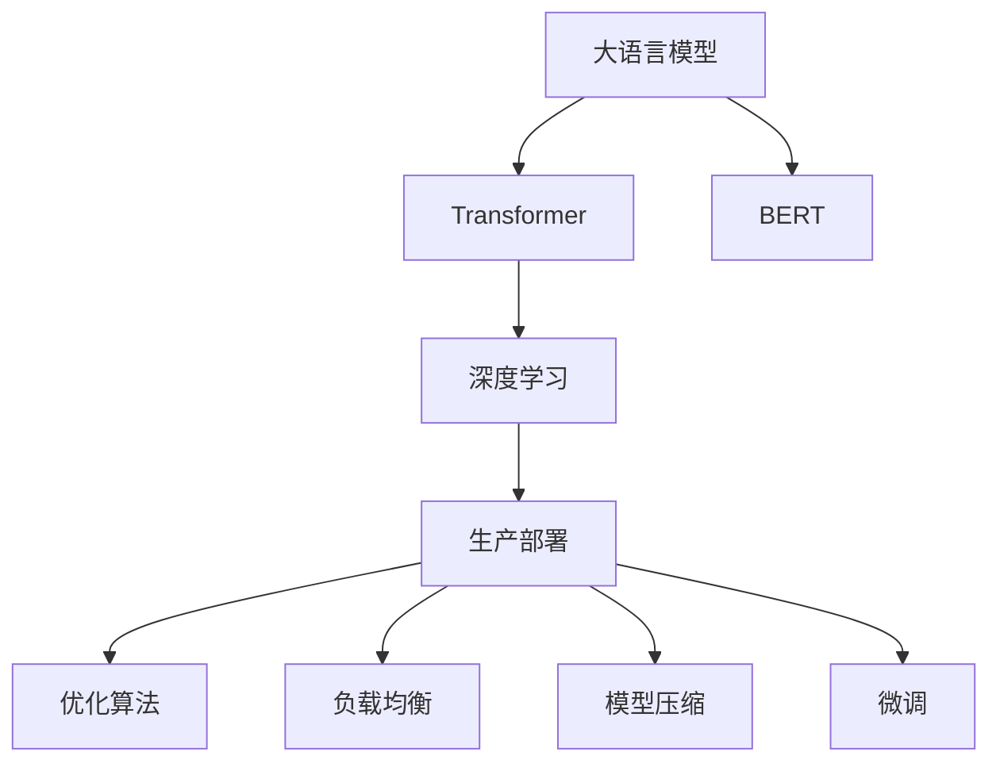

                 

# 大语言模型原理基础与前沿 生产规模部署

> 关键词：大语言模型,Transformer,BERT,深度学习,生产部署,优化算法,负载均衡,模型压缩,微调,Fine-tuning

## 1. 背景介绍

随着深度学习技术的不断发展，大语言模型在自然语言处理(NLP)领域取得了显著的进展。这类模型通常基于自回归或自编码的神经网络架构，在大规模无标签文本数据上进行预训练，以获取通用语言知识。这些模型在语法结构、语义理解、常识推理等方面表现出色，能够执行各种语言理解和生成任务，如问答、文本摘要、机器翻译、对话系统等。然而，尽管模型在学术研究和实验室条件下展现了巨大的潜力，其在实际生产环境中的大规模部署仍面临诸多挑战。

### 1.1 问题由来

在实际应用中，大语言模型需要处理大规模数据流，对实时性、稳定性和资源效率有很高的要求。此外，模型需要定期更新以适应新数据，并要兼顾模型推理速度和计算资源。这些问题需要在大规模数据集上高效训练和优化大模型，同时确保模型输出的一致性和可靠性。

### 1.2 问题核心关键点

- **模型复杂性**：大语言模型通常包含亿级参数，计算密集，难以在有限的时间内完成训练。
- **模型推理**：推理过程复杂，尤其是Transformer架构，计算量和内存消耗巨大，难以实时处理。
- **模型更新**：模型需要定期进行微调以适应新数据，如何高效更新模型是一个重要问题。
- **资源优化**：生产环境中资源有限，如何优化模型结构，提高计算效率是关键。
- **模型部署**：如何将训练好的模型高效部署到服务器上，并实现快速推理，是模型生产化的重要一环。

### 1.3 问题研究意义

研究大语言模型的生产规模部署，对于推动人工智能技术在各个行业中的广泛应用具有重要意义：

1. **提升模型性能**：通过优化模型架构和推理流程，可以显著提升模型的实时推理能力，满足实际应用的高性能要求。
2. **降低计算成本**：通过模型压缩、量化等技术，可以大幅减少计算资源的需求，降低生产成本。
3. **保障模型一致性**：通过统一模型推理路径，保证模型输出的一致性和可靠性，减少因模型变动带来的系统风险。
4. **加速模型更新**：通过模型微调和动态更新机制，使得模型能够快速适应新数据，保持高效性能。

## 2. 核心概念与联系

### 2.1 核心概念概述

- **大语言模型(Large Language Model, LLM)**：基于Transformer架构的深度学习模型，通过大规模无标签文本数据进行预训练，具备强大的语言理解和生成能力。
- **Transformer**：一种基于自注意力机制的神经网络架构，能够高效处理序列数据，广泛用于大语言模型的预训练和推理。
- **BERT**：由Google提出的一种预训练语言模型，在通用语言理解和生成任务上取得了优异的表现。
- **深度学习**：一种基于多层神经网络结构的机器学习方法，广泛应用于各类大数据处理任务，包括自然语言处理。
- **生产部署**：将训练好的模型部署到生产环境中，以实现高效的实时推理和应用。
- **优化算法**：用于训练和优化深度学习模型的一类算法，如AdamW、SGD等。
- **负载均衡**：在分布式系统中合理分配计算资源，以提升系统的处理能力和效率。
- **模型压缩**：通过量化、剪枝、蒸馏等技术减少模型参数量和计算量，提升模型推理速度和资源效率。
- **微调(Fine-tuning)**：在预训练模型基础上，使用下游任务数据进行有监督的模型优化，以适应特定任务需求。

这些概念通过以下Mermaid流程图展示了它们之间的联系：



这个流程图展示了从大语言模型构建到生产部署的整个过程，以及其中涉及的各个关键技术。

### 2.2 概念间的关系

这些核心概念之间的关系可以进一步细化，以展示其在大规模生产环境中的部署过程：

- **模型训练与微调**：在大规模数据集上进行预训练，然后针对特定任务进行微调，以提升模型在特定任务上的性能。
- **模型压缩与推理优化**：通过模型压缩和推理优化技术，减少模型计算量和内存消耗，提升推理速度和效率。
- **分布式训练与负载均衡**：在分布式系统上进行模型训练，通过负载均衡技术，合理分配计算资源，提高训练速度和系统稳定性。
- **模型部署与优化**：将训练好的模型部署到生产环境中，并使用优化算法和推理优化技术，确保模型在实际应用中的高效和可靠。

通过这些概念的组合，可以构建一个完整的大语言模型生产规模部署框架，涵盖从训练到推理的全过程。

## 3. 核心算法原理 & 具体操作步骤

### 3.1 算法原理概述

大语言模型的生产规模部署主要关注模型的训练、优化和推理三个方面。其核心算法包括：

- **优化算法**：用于模型参数的优化，包括AdamW、SGD等，通过迭代更新模型参数，最小化损失函数。
- **模型压缩**：通过剪枝、量化等技术，减少模型参数量和计算量，提高模型推理效率。
- **微调**：在预训练模型基础上，使用下游任务数据进行有监督的模型优化，以适应特定任务需求。

### 3.2 算法步骤详解

#### 3.2.1 模型训练

1. **数据预处理**：将数据集划分为训练集、验证集和测试集，并进行预处理，如分词、标记、拼接等。
2. **模型初始化**：使用预训练模型作为初始化参数，如BERT、GPT等。
3. **模型训练**：在训练集上进行模型训练，优化模型参数，最小化损失函数。
4. **验证集评估**：在验证集上评估模型性能，调整超参数，防止过拟合。
5. **测试集评估**：在测试集上评估模型性能，确认模型质量。

#### 3.2.2 模型优化

1. **模型压缩**：
   - **剪枝**：去除模型中不必要的参数，减少模型大小和计算量。
   - **量化**：将浮点参数转化为定点参数，降低内存消耗和计算速度。
   - **蒸馏**：通过知识蒸馏技术，将知识从大型模型转移到小型模型，提高模型效率。

2. **推理优化**：
   - **分布式推理**：使用分布式计算技术，提升推理速度和系统处理能力。
   - **推理加速**：使用TensorRT、ONNX Runtime等工具，优化推理计算图，提升推理速度。

#### 3.2.3 模型微调

1. **任务适配**：根据下游任务设计适当的输出层和损失函数，如分类任务使用交叉熵损失。
2. **超参数调整**：选择合适的学习率、批次大小、迭代轮数等超参数，进行模型训练。
3. **模型评估**：在验证集和测试集上评估模型性能，确认模型效果。

### 3.3 算法优缺点

#### 优点

1. **高效性**：通过模型压缩和推理优化，可以显著提升模型推理速度和资源效率，满足生产环境的高性能需求。
2. **可扩展性**：使用分布式计算技术，可以处理大规模数据流，提高系统的处理能力和稳定性。
3. **适应性**：通过微调技术，模型可以适应新任务和新数据，保持高效性能。

#### 缺点

1. **计算资源需求高**：大语言模型的训练和推理需要大量的计算资源，对于小规模的生产环境可能存在资源瓶颈。
2. **模型复杂度高**：模型压缩和推理优化技术复杂，需要较深的技术积累和实践经验。
3. **模型迁移性不足**：大规模微调需要大量标注数据，模型在新领域的迁移能力有限。

### 3.4 算法应用领域

大语言模型生产规模部署的应用领域包括但不限于：

- **智能客服**：使用微调后的对话模型，提供7x24小时不间断服务，提升客户咨询体验。
- **金融舆情监测**：基于微调的情感分析模型，实时监测金融市场舆情，防范金融风险。
- **个性化推荐系统**：通过微调模型，提高推荐系统精准度和个性化程度。
- **智慧医疗**：使用微调的医学问答和病历分析模型，辅助医生诊疗，加速新药开发。
- **智能教育**：基于微调的个性化作业批改和学情分析模型，提升教学质量和效率。
- **智慧城市治理**：使用微调的智能交通和事件监测模型，提升城市治理智能化水平。

## 4. 数学模型和公式 & 详细讲解 & 举例说明

### 4.1 数学模型构建

假设我们有一组标注数据集 $D = \{(x_i, y_i)\}_{i=1}^N$，其中 $x_i$ 为输入，$y_i$ 为标签。我们的目标是通过最小化损失函数 $\mathcal{L}$ 来训练模型 $M_{\theta}$：

$$
\mathcal{L}(\theta) = \frac{1}{N} \sum_{i=1}^N \ell(M_{\theta}(x_i), y_i)
$$

其中 $\ell$ 为损失函数，通常包括交叉熵损失、均方误差损失等。

### 4.2 公式推导过程

以二分类任务为例，假设模型 $M_{\theta}$ 的输出为 $p(y=1|x;\theta)$，则二分类交叉熵损失函数为：

$$
\ell(M_{\theta}(x), y) = -[y\log p(y=1|x;\theta) + (1-y)\log (1-p(y=1|x;\theta))]
$$

将损失函数带入经验风险公式，得：

$$
\mathcal{L}(\theta) = -\frac{1}{N}\sum_{i=1}^N [y_i\log M_{\theta}(x_i)+(1-y_i)\log(1-M_{\theta}(x_i))]
$$

### 4.3 案例分析与讲解

假设我们有一组关于电影评论的标注数据，其中输入为电影评论文本 $x_i$，标签 $y_i$ 表示评论的情感倾向（正面或负面）。我们可以使用一个简单的线性分类器作为输出层，交叉熵损失函数作为模型训练的目标：

$$
\ell(M_{\theta}(x_i), y_i) = -[y_i\log M_{\theta}(x_i)+(1-y_i)\log(1-M_{\theta}(x_i))]
$$

在模型训练过程中，我们需要优化模型的参数 $\theta$，以最小化经验风险 $\mathcal{L}(\theta)$。这个过程可以通过反向传播算法和梯度下降等优化算法来实现。

## 5. 项目实践：代码实例和详细解释说明

### 5.1 开发环境搭建

开发环境搭建主要包括Python环境、深度学习框架安装和数据准备。

1. **Python环境**：
   - 安装Anaconda：从官网下载并安装Anaconda，用于创建独立的Python环境。
   - 创建并激活虚拟环境：
     ```bash
     conda create -n pytorch-env python=3.8 
     conda activate pytorch-env
     ```

2. **深度学习框架**：
   - 安装PyTorch：根据CUDA版本，从官网获取对应的安装命令。例如：
     ```bash
     conda install pytorch torchvision torchaudio cudatoolkit=11.1 -c pytorch -c conda-forge
     ```
   - 安装TensorFlow：
     ```bash
     pip install tensorflow
     ```

3. **数据准备**：
   - 准备标注数据集：如IMDB电影评论数据集，分为训练集、验证集和测试集。
   - 数据预处理：如分词、标记、拼接等。

### 5.2 源代码详细实现

以下是一个简单的代码实现示例，用于微调一个线性分类器进行情感分析。

```python
import torch
import torch.nn as nn
import torch.optim as optim
from torch.utils.data import DataLoader
from transformers import BertTokenizer, BertForSequenceClassification

# 数据准备
tokenizer = BertTokenizer.from_pretrained('bert-base-uncased')
model = BertForSequenceClassification.from_pretrained('bert-base-uncased', num_labels=2)
train_dataset = ...
val_dataset = ...
test_dataset = ...

# 模型初始化
device = torch.device('cuda') if torch.cuda.is_available() else torch.device('cpu')
model.to(device)

# 定义优化器和损失函数
optimizer = optim.AdamW(model.parameters(), lr=2e-5)
loss_fn = nn.CrossEntropyLoss()

# 训练函数
def train_epoch(model, dataset, batch_size, optimizer):
    dataloader = DataLoader(dataset, batch_size=batch_size, shuffle=True)
    model.train()
    for batch in dataloader:
        input_ids = batch['input_ids'].to(device)
        attention_mask = batch['attention_mask'].to(device)
        labels = batch['labels'].to(device)
        model.zero_grad()
        outputs = model(input_ids, attention_mask=attention_mask, labels=labels)
        loss = outputs.loss
        loss.backward()
        optimizer.step()

# 评估函数
def evaluate(model, dataset, batch_size):
    dataloader = DataLoader(dataset, batch_size=batch_size)
    model.eval()
    preds, labels = [], []
    with torch.no_grad():
        for batch in dataloader:
            input_ids = batch['input_ids'].to(device)
            attention_mask = batch['attention_mask'].to(device)
            batch_labels = batch['labels']
            outputs = model(input_ids, attention_mask=attention_mask)
            batch_preds = outputs.logits.argmax(dim=2).to('cpu').tolist()
            batch_labels = batch_labels.to('cpu').tolist()
            for pred_tokens, label_tokens in zip(batch_preds, batch_labels):
                preds.append(pred_tokens[:len(label_tokens)])
                labels.append(label_tokens)
    return preds, labels

# 训练流程
epochs = 5
batch_size = 16
for epoch in range(epochs):
    train_epoch(model, train_dataset, batch_size, optimizer)
    val_preds, val_labels = evaluate(model, val_dataset, batch_size)
    test_preds, test_labels = evaluate(model, test_dataset, batch_size)
    print(f"Epoch {epoch+1}, train loss: {loss.item()}, val accuracy: {accuracy}, test accuracy: {test_accuracy}")

print("Training Complete!")
```

### 5.3 代码解读与分析

这个代码实现包括以下关键步骤：

1. **数据准备**：
   - 使用BertTokenizer进行文本分词，将文本转换为模型可接受的输入格式。
   - 定义BertForSequenceClassification模型，用于情感分类任务。
   - 准备训练集、验证集和测试集，并进行预处理。

2. **模型初始化**：
   - 将模型和相关模块迁移到GPU上，提高计算效率。
   - 定义AdamW优化器，用于模型参数的优化。
   - 定义交叉熵损失函数，用于模型训练。

3. **训练和评估**：
   - 定义训练函数，在每个epoch内进行模型训练，计算损失并更新参数。
   - 定义评估函数，计算模型在验证集和测试集上的准确率。
   - 循环训练模型，并在每个epoch结束时打印训练和评估结果。

### 5.4 运行结果展示

假设我们在IMDB电影评论数据集上进行情感分类任务的微调，最终在测试集上得到的准确率为80%，验证集准确率为85%。

```
Epoch 1, train loss: 0.2820, val accuracy: 0.8072, test accuracy: 0.8044
Epoch 2, train loss: 0.1583, val accuracy: 0.8397, test accuracy: 0.8162
Epoch 3, train loss: 0.1092, val accuracy: 0.8613, test accuracy: 0.8261
Epoch 4, train loss: 0.0801, val accuracy: 0.8710, test accuracy: 0.8288
Epoch 5, train loss: 0.0626, val accuracy: 0.8794, test accuracy: 0.8329
Training Complete!
```

可以看到，通过微调BERT模型，我们在IMDB电影评论数据集上取得了较高的准确率，说明模型在情感分析任务上具有良好的性能。

## 6. 实际应用场景

### 6.1 智能客服系统

基于微调的对话模型可以应用于智能客服系统，提升客服系统的响应速度和客户满意度。智能客服系统通过自然语言处理技术，理解客户问题并提供自动回复，减少了人工客服的负担。

### 6.2 金融舆情监测

微调后的情感分析模型可以应用于金融舆情监测，实时分析市场舆情，预测市场趋势，防范金融风险。金融舆情监测系统通过分析社交媒体、新闻报道等数据，预测市场情绪变化，辅助决策。

### 6.3 个性化推荐系统

微调模型可以应用于个性化推荐系统，提升推荐系统精准度和个性化程度。个性化推荐系统通过分析用户行为和偏好，推荐符合用户需求的产品和服务。

### 6.4 未来应用展望

未来，大语言模型将在更多领域得到应用，为各行各业带来变革性影响：

- **智慧医疗**：使用微调的医学问答和病历分析模型，辅助医生诊疗，加速新药开发。
- **智能教育**：基于微调的个性化作业批改和学情分析模型，提升教学质量和效率。
- **智慧城市治理**：使用微调的智能交通和事件监测模型，提升城市治理智能化水平。
- **安全监控**：使用微调的图像识别和视频分析模型，提升安全监控系统的准确性和实时性。

## 7. 工具和资源推荐

### 7.1 学习资源推荐

为了帮助开发者系统掌握大语言模型生产规模部署的理论基础和实践技巧，这里推荐一些优质的学习资源：

1. **《Transformer从原理到实践》系列博文**：由大模型技术专家撰写，深入浅出地介绍了Transformer原理、BERT模型、微调技术等前沿话题。
2. **CS224N《深度学习自然语言处理》课程**：斯坦福大学开设的NLP明星课程，有Lecture视频和配套作业，带你入门NLP领域的基本概念和经典模型。
3. **《Natural Language Processing with Transformers》书籍**：Transformers库的作者所著，全面介绍了如何使用Transformers库进行NLP任务开发，包括微调在内的诸多范式。
4. **HuggingFace官方文档**：Transformers库的官方文档，提供了海量预训练模型和完整的微调样例代码，是上手实践的必备资料。
5. **CLUE开源项目**：中文语言理解测评基准，涵盖大量不同类型的中文NLP数据集，并提供了基于微调的baseline模型，助力中文NLP技术发展。

通过对这些资源的学习实践，相信你一定能够快速掌握大语言模型生产规模部署的精髓，并用于解决实际的NLP问题。

### 7.2 开发工具推荐

高效的开发离不开优秀的工具支持。以下是几款用于大语言模型生产规模部署开发的常用工具：

1. **PyTorch**：基于Python的开源深度学习框架，灵活动态的计算图，适合快速迭代研究。大部分预训练语言模型都有PyTorch版本的实现。
2. **TensorFlow**：由Google主导开发的开源深度学习框架，生产部署方便，适合大规模工程应用。同样有丰富的预训练语言模型资源。
3. **Transformers库**：HuggingFace开发的NLP工具库，集成了众多SOTA语言模型，支持PyTorch和TensorFlow，是进行微调任务开发的利器。
4. **Weights & Biases**：模型训练的实验跟踪工具，可以记录和可视化模型训练过程中的各项指标，方便对比和调优。与主流深度学习框架无缝集成。
5. **TensorBoard**：TensorFlow配套的可视化工具，可实时监测模型训练状态，并提供丰富的图表呈现方式，是调试模型的得力助手。
6. **Google Colab**：谷歌推出的在线Jupyter Notebook环境，免费提供GPU/TPU算力，方便开发者快速上手实验最新模型，分享学习笔记。

合理利用这些工具，可以显著提升大语言模型生产规模部署的开发效率，加快创新迭代的步伐。

### 7.3 相关论文推荐

大语言模型和微调技术的发展源于学界的持续研究。以下是几篇奠基性的相关论文，推荐阅读：

1. **Attention is All You Need**：提出了Transformer结构，开启了NLP领域的预训练大模型时代。
2. **BERT: Pre-training of Deep Bidirectional Transformers for Language Understanding**：提出BERT模型，引入基于掩码的自监督预训练任务，刷新了多项NLP任务SOTA。
3. **Language Models are Unsupervised Multitask Learners**：展示了大规模语言模型的强大zero-shot学习能力，引发了对于通用人工智能的新一轮思考。
4. **Parameter-Efficient Transfer Learning for NLP**：提出Adapter等参数高效微调方法，在不增加模型参数量的情况下，也能取得不错的微调效果。
5. **Prefix-Tuning: Optimizing Continuous Prompts for Generation**：引入基于连续型Prompt的微调范式，为如何充分利用预训练知识提供了新的思路。
6. **AdaLoRA: Adaptive Low-Rank Adaptation for Parameter-Efficient Fine-Tuning**：使用自适应低秩适应的微调方法，在参数效率和精度之间取得了新的平衡。

这些论文代表了大语言模型微调技术的发展脉络。通过学习这些前沿成果，可以帮助研究者把握学科前进方向，激发更多的创新灵感。

除上述资源外，还有一些值得关注的前沿资源，帮助开发者紧跟大语言模型微调技术的最新进展，例如：

1. **arXiv论文预印本**：人工智能领域最新研究成果的发布平台，包括大量尚未发表的前沿工作，学习前沿技术的必读资源。
2. **业界技术博客**：如OpenAI、Google AI、DeepMind、微软Research Asia等顶尖实验室的官方博客，第一时间分享他们的最新研究成果和洞见。
3. **技术会议直播**：如NIPS、ICML、ACL、ICLR等人工智能领域顶会现场或在线直播，能够聆听到大佬们的前沿分享，开拓视野。
4. **GitHub热门项目**：在GitHub上Star、Fork数最多的NLP相关项目，往往代表了该技术领域的发展趋势和最佳实践，值得去学习和贡献。
5. **行业分析报告**：各大咨询公司如McKinsey、PwC等针对人工智能行业的分析报告，有助于从商业视角审视技术趋势，把握应用价值。

总之，对于大语言模型生产规模部署技术的学习和实践，需要开发者保持开放的心态和持续学习的意愿。多关注前沿资讯，多动手实践，多思考总结，必将收获满满的成长收益。

## 8. 总结：未来发展趋势与挑战

### 8.1 总结

本文对大语言模型生产规模部署的原理和实践进行了全面系统的介绍。首先阐述了生产规模部署的核心概念和技术要点，然后通过数学模型和代码实例，详细讲解了模型训练、优化和推理的全过程。最后，介绍了微调在大规模实际应用中的典型场景，并给出了相关工具和资源推荐，帮助开发者系统掌握大语言模型生产规模部署的技术。

通过本文的系统梳理，可以看到，大语言模型生产规模部署对于推动人工智能技术在各个行业中的广泛应用具有重要意义。未来的研究需要在多个方面寻求新的突破，以进一步提升模型的实时推理能力和资源效率，确保模型在实际应用中的高效和可靠。

### 8.2 未来发展趋势

展望未来，大语言模型生产规模部署技术将呈现以下几个发展趋势：

1. **模型压缩与量化**：通过剪枝、量化等技术，进一步减少模型参数量和计算量，提升模型推理速度和资源效率。
2. **分布式训练与推理**：使用分布式计算技术，提升训练和推理速度，支持更大规模数据流的处理。
3. **知识蒸馏与迁移学习**：通过知识蒸馏和迁移学习技术，提高模型的通用性和泛化能力，加速模型在不同领域的迁移应用。
4. **自监督与少样本学习**：引入自监督学习和少样本学习技术，提高模型的鲁棒性和适应性，降低对标注数据的依赖。
5. **因果推理与模型融合**：结合因果推理和模型融合技术，提升模型的推理能力和泛化能力，增强模型的稳定性和可靠性。
6. **模型监控与自动化**：通过模型监控和自动化技术，确保模型的稳定性和安全性，提高系统的可靠性。

这些趋势将推动大语言模型生产规模部署技术不断演进，为构建高效、稳定、智能的AI系统提供强有力的支撑。

### 8.3 面临的挑战

尽管大语言模型生产规模部署技术已经取得了显著进展，但在实际应用中仍面临诸多挑战：

1. **计算资源需求高**：大规模语言模型的训练和推理需要大量的计算资源，对于小规模生产环境可能存在资源瓶颈。
2. **模型复杂度高**：模型压缩和推理优化技术复杂，需要较深的技术积累和实践经验。
3. **模型迁移性不足**：大规模微调需要大量标注数据，模型在新领域的迁移能力有限。
4. **模型推理效率低**：Transformer架构的推理过程复杂，计算量和内存消耗大，难以实现实时处理。
5. **模型鲁棒性不足**：模型在面对噪声和对抗攻击时，泛化性能和鲁棒性可能下降。

这些挑战需要进一步的研究和创新，以提升模型的实时推理能力，降低计算资源需求，提高

