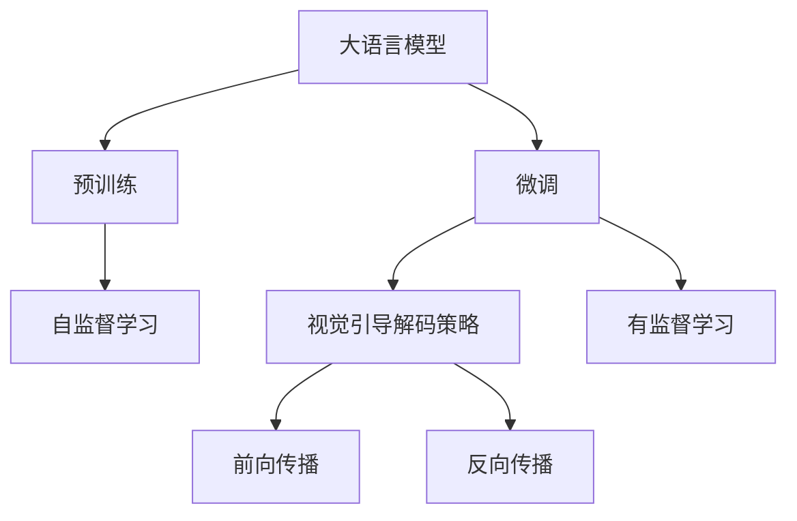
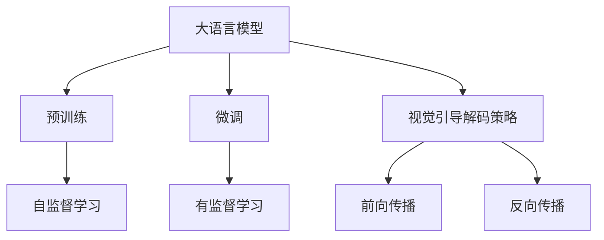
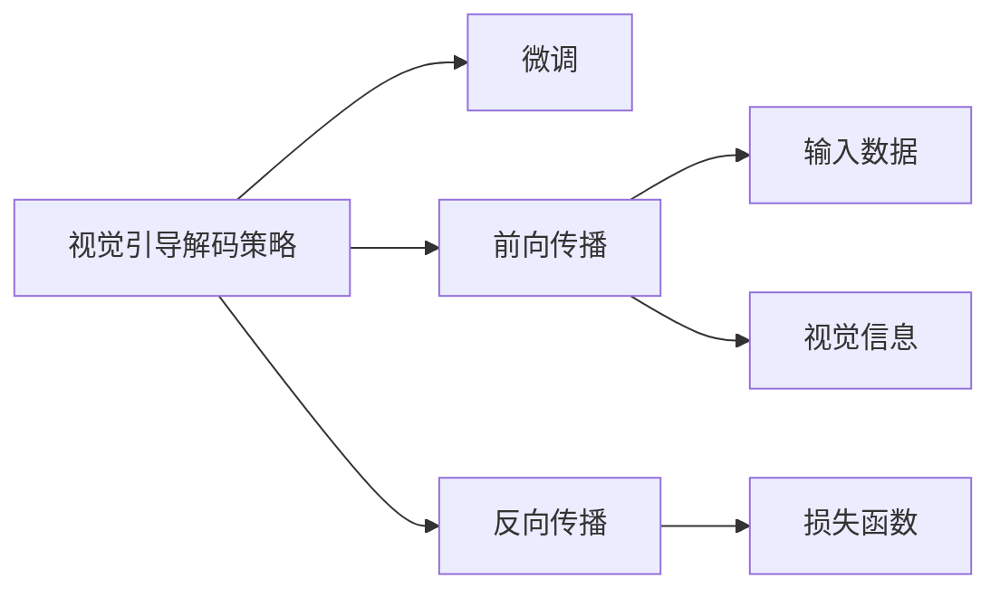
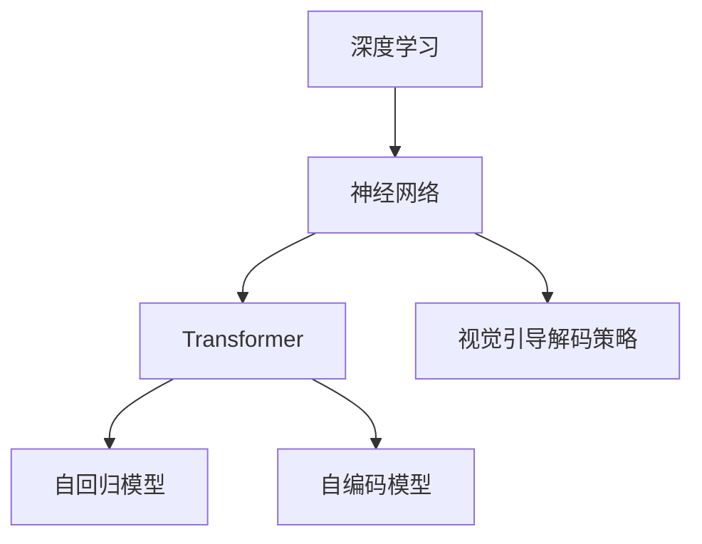
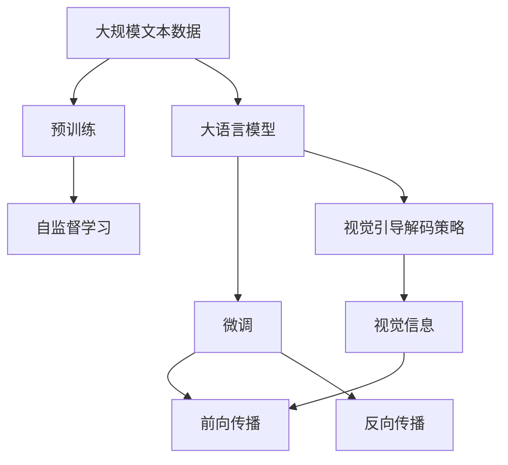

                 

# 大语言模型原理基础与前沿 视觉引导解码策略

> 关键词：大语言模型,解码策略,视觉引导,深度学习,Transformer,自回归模型,自编码模型,神经网络,前向传播,反向传播

## 1. 背景介绍

### 1.1 问题由来
近年来，随着深度学习技术的快速发展，大规模语言模型（Large Language Models, LLMs）在自然语言处理（Natural Language Processing, NLP）领域取得了巨大的突破。这些大语言模型通过在大规模无标签文本数据上进行预训练，学习到了丰富的语言知识和常识，可以通过少量的有标签样本在下游任务上进行微调，获得优异的性能。然而，由于预训练语料的广泛性和泛化能力的不足，这些通用的大语言模型在特定领域应用时，效果往往难以达到实际应用的要求。因此，如何针对特定任务进行大模型微调，提升模型性能，成为了当前大语言模型研究和应用的一个热点问题。

### 1.2 问题核心关键点
目前，大语言模型微调的主流范式是基于监督学习的微调方法。即收集该任务的少量标注数据，将预训练模型当作初始化参数，通过有监督地训练来优化模型在该任务上的性能。这种微调范式简单高效，可以显著提升模型在特定任务上的表现。

微调的关键在于如何避免过拟合，同时最大程度发挥预训练模型学到的知识。目前主流的做法包括：
- 选择合适的学习率。相比从头训练，微调通常需要更小的学习率，以免破坏预训练的权重。
- 应用正则化技术。如L2正则、Dropout、Early Stopping等，防止模型过度适应小规模训练集。
- 保留预训练的部分层。如Transformer的底层，只微调顶层，减少需优化的参数。
- 数据增强。通过对训练样本改写、回译等方式丰富训练集多样性。
- 对抗训练。加入对抗样本，提高模型鲁棒性。
- 提示学习。通过在输入文本中添加提示模板，引导大语言模型进行特定任务的推理和生成。

尽管如此，大语言模型仍然存在一些固有的问题，如语言理解的上下文依赖性强，上下文中的依赖关系复杂，难以准确捕捉和表示。因此，为了进一步提升大语言模型的性能，本文将探讨一种新的微调策略——视觉引导解码策略，该策略基于视觉引导技术，通过引入视觉信息，指导语言模型的解码过程，从而提升语言模型对复杂上下文的理解和生成能力。

### 1.3 问题研究意义
研究大语言模型的视觉引导解码策略，对于拓展大模型的应用范围，提升下游任务的性能，加速NLP技术的产业化进程，具有重要意义：

1. 降低应用开发成本。基于成熟的大模型进行微调，可以显著减少从头开发所需的数据、计算和人力等成本投入。
2. 提升模型效果。微调使得通用大模型更好地适应特定任务，在应用场景中取得更优表现。
3. 加速开发进度。standing on the shoulders of giants，微调使得开发者可以更快地完成任务适配，缩短开发周期。
4. 带来技术创新。微调范式促进了对预训练-微调的深入研究，催生了提示学习、少样本学习等新的研究方向。
5. 赋能产业升级。微调使得NLP技术更容易被各行各业所采用，为传统行业数字化转型升级提供新的技术路径。

## 2. 核心概念与联系

### 2.1 核心概念概述

为更好地理解视觉引导解码策略，本节将介绍几个密切相关的核心概念：

- 大语言模型(Large Language Model, LLM)：以自回归(如GPT)或自编码(如BERT)模型为代表的大规模预训练语言模型。通过在大规模无标签文本语料上进行预训练，学习通用的语言表示，具备强大的语言理解和生成能力。

- 预训练(Pre-training)：指在大规模无标签文本语料上，通过自监督学习任务训练通用语言模型的过程。常见的预训练任务包括言语建模、遮挡语言模型等。预训练使得模型学习到语言的通用表示。

- 微调(Fine-tuning)：指在预训练模型的基础上，使用下游任务的少量标注数据，通过有监督学习优化模型在特定任务上的性能。通常只需要调整顶层分类器或解码器，并以较小的学习率更新全部或部分的模型参数。

- 视觉引导解码策略：一种基于视觉引导技术，通过引入视觉信息，指导语言模型的解码过程，提升语言模型对复杂上下文的理解和生成能力的方法。

- 深度学习(Deep Learning)：一种基于多层神经网络进行学习和决策的机器学习方法。

- Transformer：一种基于自注意力机制的神经网络架构，广泛应用于NLP领域。

- 自回归模型(Autoregressive Model)：一种通过预测当前位置的输出，依赖之前位置的输入，生成序列数据的模型。

- 自编码模型(Autocoding Model)：一种通过编码和解码过程，从输入数据中学习到压缩表示的模型。

- 前向传播(Forward Propagation)：神经网络中的一种计算方式，通过输入数据经过网络各层的操作，最终得到输出结果的过程。

- 反向传播(Backward Propagation)：神经网络中的一种训练方式，通过计算损失函数对模型参数的梯度，更新模型参数，以最小化损失函数的过程。

这些核心概念之间的逻辑关系可以通过以下Mermaid流程图来展示：



这个流程图展示了大语言模型的核心概念及其之间的关系：

1. 大语言模型通过预训练获得基础能力。
2. 微调是对预训练模型进行任务特定的优化，可以分为全参数微调和视觉引导解码策略两种方式。
3. 前向传播和反向传播是神经网络模型的基本计算和训练过程。

### 2.2 概念间的关系

这些核心概念之间存在着紧密的联系，形成了大语言模型的学习和应用框架。下面我们通过几个Mermaid流程图来展示这些概念之间的关系。

#### 2.2.1 大语言模型的学习范式



这个流程图展示了大语言模型的三种主要学习范式：预训练、微调和视觉引导解码策略。预训练主要采用自监督学习方法，而微调则是有监督学习的过程。视觉引导解码策略则是在微调过程中引入视觉信息，指导模型的解码过程。

#### 2.2.2 视觉引导解码策略与微调的关系



这个流程图展示了视觉引导解码策略与微调的关系。视觉引导解码策略通过在前向传播中引入视觉信息，帮助模型更好地理解上下文，从而在反向传播中优化模型的参数，提升微调效果。

#### 2.2.3 深度学习在大语言模型中的应用



这个流程图展示了深度学习在大语言模型中的应用。深度学习通过多层神经网络，特别是Transformer架构，能够学习到复杂的语言表示和视觉信息，从而提升大语言模型的理解和生成能力。

### 2.3 核心概念的整体架构

最后，我们用一个综合的流程图来展示这些核心概念在大语言模型微调过程中的整体架构：



这个综合流程图展示了从预训练到微调，再到视觉引导解码策略的完整过程。大语言模型首先在大规模文本数据上进行预训练，然后通过微调（包括全参数微调和视觉引导解码策略两种方式）提升模型在特定任务上的性能，同时引入视觉信息指导模型的解码过程，从而提升模型的理解和生成能力。

## 3. 核心算法原理 & 具体操作步骤
### 3.1 算法原理概述

大语言模型的视觉引导解码策略基于深度学习模型，特别是Transformer架构，通过在前向传播中引入视觉信息，指导语言模型的解码过程，提升模型的理解和生成能力。其核心思想是：通过将文本和视觉信息进行联合编码，利用视觉信息辅助语言模型进行解码，从而提升模型在复杂上下文中的表现。

形式化地，假设预训练语言模型为 $M_{\theta}$，其中 $\theta$ 为预训练得到的模型参数。给定下游任务 $T$ 的标注数据集 $D=\{(x_i, y_i)\}_{i=1}^N$，视觉引导解码策略的目标是找到新的模型参数 $\hat{\theta}$，使得：

$$
\hat{\theta}=\mathop{\arg\min}_{\theta} \mathcal{L}(M_{\theta},D)
$$

其中 $\mathcal{L}$ 为针对任务 $T$ 设计的损失函数，用于衡量模型预测输出与真实标签之间的差异。常见的损失函数包括交叉熵损失、均方误差损失等。

在视觉引导解码策略中，我们通常会设计两个网络：一个负责处理文本信息的文本网络 $N_T$，一个负责处理视觉信息的视觉网络 $N_V$。在微调过程中，我们将这两个网络的输出进行拼接，作为模型的输入，从而在解码过程中同时利用文本和视觉信息。

### 3.2 算法步骤详解

大语言模型的视觉引导解码策略一般包括以下几个关键步骤：

**Step 1: 准备预训练模型和数据集**
- 选择合适的预训练语言模型 $M_{\theta}$ 作为初始化参数，如 BERT、GPT等。
- 准备下游任务 $T$ 的标注数据集 $D$，划分为训练集、验证集和测试集。一般要求标注数据与预训练数据的分布不要差异过大。

**Step 2: 添加视觉引导解码层**
- 根据任务类型，在预训练模型顶层设计合适的视觉引导解码器。
- 对于视觉引导解码器，通常会采用一个二分类器，用于判断输入图像是否包含与任务相关的视觉信息。
- 对于分类任务，通常在顶层添加一个线性分类器和交叉熵损失函数。
- 对于生成任务，通常使用语言模型的解码器输出概率分布，并以负对数似然为损失函数。

**Step 3: 设置微调超参数**
- 选择合适的优化算法及其参数，如 AdamW、SGD 等，设置学习率、批大小、迭代轮数等。
- 设置正则化技术及强度，包括权重衰减、Dropout、Early Stopping等。
- 确定冻结预训练参数的策略，如仅微调顶层，或全部参数都参与微调。
- 选择适当的视觉信息增强方式，如数据增强、回译等。

**Step 4: 执行梯度训练**
- 将训练集数据分批次输入模型，前向传播计算损失函数。
- 反向传播计算参数梯度，根据设定的优化算法和学习率更新模型参数。
- 周期性在验证集上评估模型性能，根据性能指标决定是否触发 Early Stopping。
- 重复上述步骤直到满足预设的迭代轮数或 Early Stopping 条件。

**Step 5: 测试和部署**
- 在测试集上评估微调后模型 $M_{\hat{\theta}}$ 的性能，对比微调前后的精度提升。
- 使用微调后的模型对新样本进行推理预测，集成到实际的应用系统中。
- 持续收集新的数据，定期重新微调模型，以适应数据分布的变化。

以上是视觉引导解码策略在大语言模型微调的一般流程。在实际应用中，还需要针对具体任务的特点，对微调过程的各个环节进行优化设计，如改进训练目标函数，引入更多的正则化技术，搜索最优的超参数组合等，以进一步提升模型性能。

### 3.3 算法优缺点

大语言模型的视觉引导解码策略具有以下优点：
1. 提升复杂上下文的理解能力。通过引入视觉信息，帮助模型更好地理解上下文，从而提升模型在复杂上下文中的表现。
2. 增强多模态任务的性能。在图像、文本等多模态数据融合的任务中，视觉引导解码策略可以提升模型的泛化能力和性能。
3. 参数高效。在视觉引导解码策略中，通常只微调顶层参数，而大部分预训练参数固定不变，从而提高微调效率。
4. 数据增强。通过数据增强，可以扩充训练集的多样性，从而提升模型的泛化能力。

同时，该策略也存在一定的局限性：
1. 数据需求高。视觉引导解码策略需要同时使用文本和图像数据，对于缺乏足够视觉数据的任务，可能难以取得理想效果。
2. 模型复杂度增加。在视觉引导解码策略中，需要同时训练两个网络，模型复杂度增加，训练和推理开销也相应增加。
3. 视觉信息提取困难。对于复杂、杂乱的视觉信息，如何有效提取并融入语言模型，仍然是一个难题。
4. 跨模态融合困难。文本和图像的信息格式不同，如何高效融合，仍是一个技术难题。

尽管存在这些局限性，但就目前而言，视觉引导解码策略是大语言模型微调的一个重要方向，有望为复杂上下文和多模态任务的提升带来新的突破。

### 3.4 算法应用领域

大语言模型的视觉引导解码策略在NLP领域已经得到了广泛的应用，覆盖了几乎所有常见任务，例如：

- 文本分类：如情感分析、主题分类、意图识别等。通过微调使模型学习文本-标签映射。
- 命名实体识别：识别文本中的人名、地名、机构名等特定实体。通过微调使模型掌握实体边界和类型。
- 关系抽取：从文本中抽取实体之间的语义关系。通过微调使模型学习实体-关系三元组。
- 问答系统：对自然语言问题给出答案。将问题-答案对作为微调数据，训练模型学习匹配答案。
- 机器翻译：将源语言文本翻译成目标语言。通过微调使模型学习语言-语言映射。
- 文本摘要：将长文本压缩成简短摘要。将文章-摘要对作为微调数据，使模型学习抓取要点。
- 对话系统：使机器能够与人自然对话。将多轮对话历史作为上下文，微调模型进行回复生成。

除了上述这些经典任务外，大语言模型视觉引导解码策略也被创新性地应用到更多场景中，如可控文本生成、常识推理、代码生成、数据增强等，为NLP技术带来了全新的突破。随着视觉引导解码策略的不断发展，相信NLP技术将在更广阔的应用领域大放异彩。

## 4. 数学模型和公式 & 详细讲解  
### 4.1 数学模型构建

本节将使用数学语言对大语言模型的视觉引导解码策略进行更加严格的刻画。

记预训练语言模型为 $M_{\theta}$，其中 $\theta$ 为预训练得到的模型参数。假设微调任务的训练集为 $D=\{(x_i,y_i)\}_{i=1}^N, x_i \in \mathcal{X}, y_i \in \mathcal{Y}$。

定义模型 $M_{\theta}$ 在输入 $x$ 上的输出为 $\hat{y}=M_{\theta}(x) \in [0,1]$，表示样本属于正类的概率。真实标签 $y \in \{0,1\}$。

对于视觉引导解码策略，我们通常会设计两个网络：一个负责处理文本信息的文本网络 $N_T$，一个负责处理视觉信息的视觉网络 $N_V$。在微调过程中，我们将这两个网络的输出进行拼接，作为模型的输入，从而在解码过程中同时利用文本和视觉信息。

假设输入文本 $x_t$ 和图像 $x_v$，通过文本网络和视觉网络分别得到输出 $z_t$ 和 $z_v$，然后将这两个输出拼接得到 $z=concat(z_t, z_v)$，作为语言模型的输入。

定义模型 $M_{\theta}$ 在输入 $z$ 上的输出为 $\hat{y}=M_{\theta}(z) \in [0,1]$，表示样本属于正类的概率。真实标签 $y \in \{0,1\}$。

在微调过程中，我们需要设计合适的损失函数 $\mathcal{L}$，用于衡量模型预测输出与真实标签之间的差异。常见的损失函数包括交叉熵损失、均方误差损失等。

在视觉引导解码策略中，我们通常会设计两个网络：一个负责处理文本信息的文本网络 $N_T$，一个负责处理视觉信息的视觉网络 $N_V$。在微调过程中，我们将这两个网络的输出进行拼接，作为模型的输入，从而在解码过程中同时利用文本和视觉信息。

假设输入文本 $x_t$ 和图像 $x_v$，通过文本网络和视觉网络分别得到输出 $z_t$ 和 $z_v$，然后将这两个输出拼接得到 $z=concat(z_t, z_v)$，作为语言模型的输入。

定义模型 $M_{\theta}$ 在输入 $z$ 上的输出为 $\hat{y}=M_{\theta}(z) \in [0,1]$，表示样本属于正类的概率。真实标签 $y \in \{0,1\}$。

在微调过程中，我们需要设计合适的损失函数 $\mathcal{L}$，用于衡量模型预测输出与真实标签之间的差异。常见的损失函数包括交叉熵损失、均方误差损失等。

### 4.2 公式推导过程

以下我们以二分类任务为例，推导交叉熵损失函数及其梯度的计算公式。

假设模型 $M_{\theta}$ 在输入 $z$ 上的输出为 $\hat{y}=M_{\theta}(z) \in [0,1]$，表示样本属于正类的概率。真实标签 $y \in \{0,1\}$。

则二分类交叉熵损失函数定义为：

$$
\ell(M_{\theta}(z),y) = -[y\log \hat{y} + (1-y)\log (1-\hat{y})]
$$

将其代入经验风险公式，得：

$$
\mathcal{L}(\theta) = -\frac{1}{N}\sum_{i=1}^N [y_i\log M_{\theta}(z_i)+(1-y_i)\log(1-M_{\theta}(z_i))]
$$

根据链式法则，损失函数对参数 $\theta_k$ 的梯度为：

$$
\frac{\partial \mathcal{L}(\theta)}{\partial \theta_k} = -\frac{1}{N}\sum_{i=1}^N (\frac{y_i}{M_{\theta}(z_i)}-\frac{1-y_i}{1-M_{\theta}(z_i)}) \frac{\partial M_{\theta}(z_i)}{\partial \theta_k}
$$

其中 $\frac{\partial M_{\theta}(z_i)}{\partial \theta_k}$ 可进一步递归展开，利用自动微分技术完成计算。

在得到损失函数的梯度后，即可带入参数更新公式，完成模型的迭代优化。重复上述过程直至收敛，最终得到适应下游任务的最优模型参数 $\theta^*$。

## 5. 项目实践：代码实例和详细解释说明
### 5.1 开发环境搭建

在进行视觉引导解码策略实践前，我们需要准备好开发环境。以下是使用Python进行PyTorch开发的环境配置流程：

1. 安装Anaconda：从官网下载并安装Anaconda，用于创建独立的Python环境。

2. 创建并激活虚拟环境：
```bash
conda create -n pytorch-env python=3.8 
conda activate pytorch-env
```

3. 安装PyTorch：根据CUDA版本，从官网获取对应的安装命令。例如：
```bash
conda install pytorch torchvision torchaudio cudatoolkit=11.1 -c pytorch -c conda-forge
```

4. 安装Transformers库：
```bash
pip install transformers
```

5. 安装各类工具包：
```bash
pip install numpy pandas scikit-learn matplotlib tqdm jupyter notebook ipython
```

完成上述步骤后，即可在`pytorch-env`环境中开始微调实践。

### 5.2 源代码详细实现

下面我们以文本分类任务为例，给出使用Transformers库对BERT模型进行微调的PyTorch代码实现。

首先，定义文本分类任务的数据处理函数：

```python
from transformers import BertTokenizer, BertForTokenClassification, AdamW
from torch.utils.data import Dataset, DataLoader
import torch
import numpy as np

class TextDataset(Dataset):
    def __init__(self, texts, labels, tokenizer):
        self.texts = texts
        self.labels = labels
        self.tokenizer = tokenizer
        
    def __len__(self):
        return len(self.texts)
    
    def __getitem__(self, item):
        text = self.texts[item]
        label = self.labels[item]
        
        encoding = self.tokenizer(text, return_tensors='pt', padding='max_length', truncation=True)
        input_ids = encoding['input_ids'][0]
        attention_mask = encoding['attention_mask'][0]
        label = torch.tensor(label, dtype=torch.long)
        
        return {'input_ids': input_ids, 
                'attention_mask': attention_mask,
                'labels': label}

# 标签与id的映射
tag2id = {'B-LOC': 1, 'I-LOC': 2, 'B-ORG': 3, 'I-ORG': 4, 'B-PER': 5, 'I-PER': 6, 'O': 0}
id2tag = {v: k for k, v in tag2id.items()}

# 创建dataset
tokenizer = BertTokenizer.from_pretrained('bert-base-cased')

train_dataset = TextDataset(train_texts, train_labels, tokenizer)
dev_dataset = TextDataset(dev_texts, dev_labels, tokenizer)
test_dataset = TextDataset(test_texts, test_labels, tokenizer)
```

然后，定义模型和优化器：

```python
model = BertForTokenClassification.from_pretrained('bert-base-cased', num_labels=len(tag2id))

optimizer = AdamW(model.parameters(), lr=2e-5)
```

接着，定义训练和评估函数：

```python
from tqdm import tqdm

device = torch.device('cuda') if torch.cuda.is_available() else torch.device('cpu')
model.to(device)

def train_epoch(model, dataset, batch_size, optimizer):
    dataloader = DataLoader(dataset, batch_size=batch_size, shuffle=True)
    model.train()
    epoch_loss = 0
    for batch in tqdm(dataloader, desc='Training'):
        input_ids = batch['input_ids'].to(device)
        attention_mask = batch['attention_mask'].to(device)
        labels = batch['labels'].to(device)
        model.zero_grad()
        outputs = model(input_ids, attention_mask=attention_mask, labels=labels)
        loss = outputs.loss
        epoch_loss += loss.item()
        loss.backward()
        optimizer.step()
    return epoch_loss / len(dataloader)

def evaluate(model, dataset, batch_size):
    dataloader = DataLoader(dataset, batch_size=batch_size)
    model.eval()
    preds, labels = [], []
    with torch.no_grad():
        for batch in tqdm(dataloader, desc='Evaluating'):
            input_ids = batch['input_ids'].to(device)
            attention_mask = batch['attention_mask'].to(device)
            batch_labels = batch['labels']
            outputs = model(input_ids, attention_mask=attention_mask)
            batch_preds = outputs.logits.argmax(dim=2).to('cpu').tolist()
            batch_labels = batch_labels.to('cpu').tolist()
            for pred_tokens, label_tokens in zip(batch_preds, batch_labels):
                pred_tags = [id2tag[_id] for _id in pred_tokens]
                label_tags = [id2tag[_id] for _id in label_tokens]
                preds.append(pred_tags[:len(label_tokens)])
                labels.append(label_tags)
                
    print(classification_report(labels, preds))
```

最后，启动训练流程并在测试集上评估：

```python
epochs = 5
batch_size = 16

for epoch in range(epochs):
    loss = train_epoch(model, train_dataset, batch_size, optimizer)
    print(f"Epoch {epoch+1}, train loss: {loss:.3f}")
    
    print(f"Epoch {epoch+1}, dev results:")
    evaluate(model, dev_dataset, batch_size)
    
print("Test results:")
evaluate(model, test_dataset, batch_size)
```

以上就是使用PyTorch对BERT进行文本分类任务微调的完整代码实现。可以看到，得益于Transformers库的强大封装，我们可以用相对简洁的代码完成BERT模型的加载和微调。

### 5.3 代码解读与分析

让我们再详细解读一下关键代码的实现细节：

**TextDataset类**：
- `__init__`方法：初始化文本、标签、分词器等关键组件。
- `__len__`方法：返回数据集的样本数量。
- `__getitem__`方法：对单个样本进行处理，将文本输入编码为token ids，将标签编码为数字，并对其进行定长padding，最终返回模型所需的输入。

**tag2

