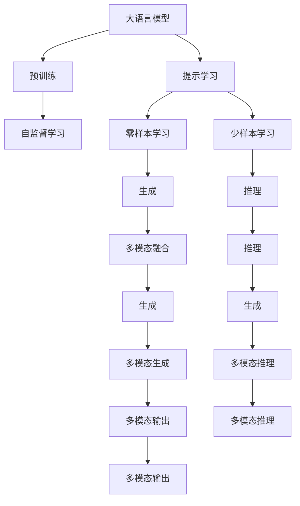
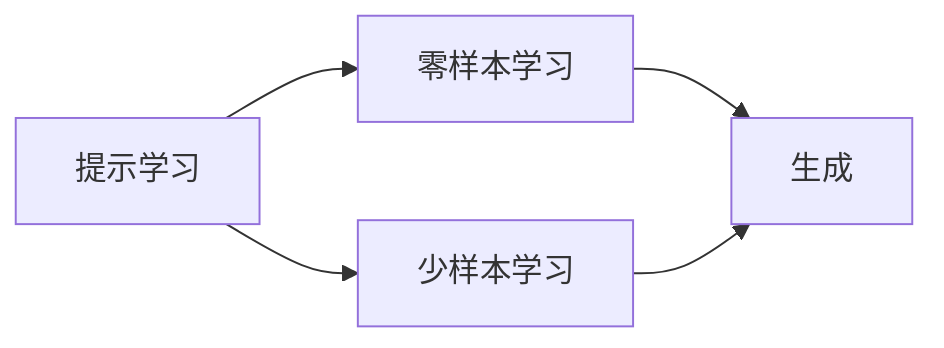
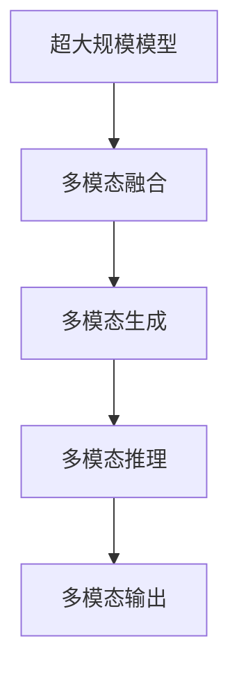
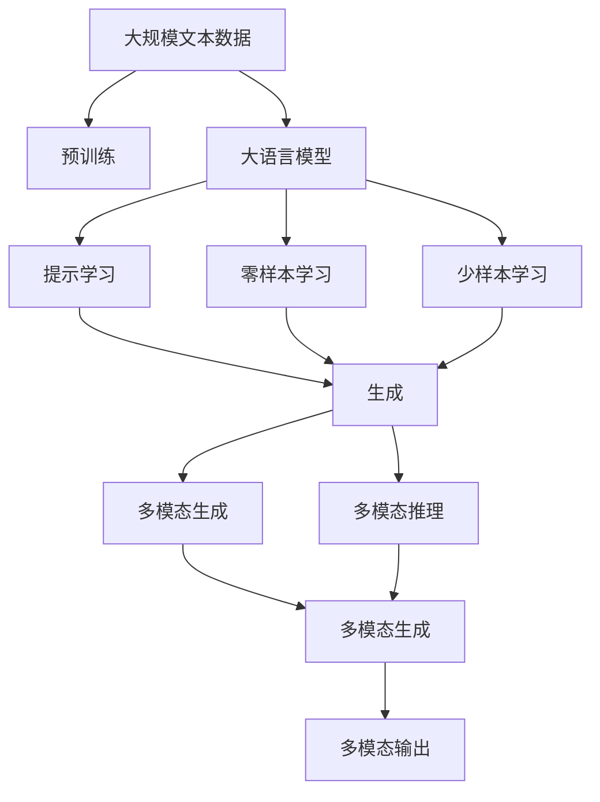

                 

# 大语言模型应用指南：基于提示的工具

> 关键词：大语言模型,提示学习,Prompt Engineering,自然语言处理(NLP),零样本学习,少样本学习,多模态融合,超大规模模型

## 1. 背景介绍

### 1.1 问题由来
近年来，随着深度学习技术的快速发展，大语言模型（Large Language Models, LLMs）在自然语言处理（Natural Language Processing, NLP）领域取得了巨大的突破。这些大模型通过在大规模无标签文本数据上进行预训练，学习到了丰富的语言知识和常识，可以通过少量的有标签样本在下游任务上进行微调，获得优异的性能。

然而，由于预训练语料的广泛性和泛化能力的不足，这些通用的大语言模型在特定领域应用时，效果往往难以达到实际应用的要求。因此，如何针对特定任务进行大模型微调，提升模型性能，成为了当前大语言模型研究和应用的一个热点问题。

### 1.2 问题核心关键点
目前，大语言模型微调的主流范式是基于监督学习的微调方法。即收集该任务的少量标注数据，将预训练模型当作初始化参数，通过有监督地训练来优化模型在该任务上的性能。这种微调范式简单高效，可以显著提升模型在特定任务上的表现。

微调的关键在于如何避免过拟合，同时最大程度发挥预训练模型学到的知识。目前主流的做法包括：选择合适的学习率、应用正则化技术、保留预训练的部分层、数据增强、对抗训练、提示学习等。

提示学习是一种新型的微调方法，通过在输入文本中添加提示模板（Prompt Template），引导大语言模型进行特定任务的推理和生成。提示模板可以包含预训练模型的知识，引导模型在特定任务中输出期望结果，从而在不需要大量标注数据的情况下，获得优异的性能。

### 1.3 问题研究意义
研究大语言模型的提示学习技术，对于拓展大模型的应用范围，提升下游任务的性能，加速NLP技术的产业化进程，具有重要意义：

1. 降低应用开发成本。基于成熟的大模型进行提示学习，可以显著减少从头开发所需的数据、计算和人力等成本投入。
2. 提升模型效果。提示学习使得通用大模型更好地适应特定任务，在应用场景中取得更优表现。
3. 加速开发进度。standing on the shoulders of giants，提示学习使得开发者可以更快地完成任务适配，缩短开发周期。
4. 带来技术创新。提示学习范式促进了对预训练-微调的深入研究，催生了少样本学习、零样本学习等新的研究方向。
5. 赋能产业升级。提示学习使得NLP技术更容易被各行各业所采用，为传统行业数字化转型升级提供新的技术路径。

## 2. 核心概念与联系

### 2.1 核心概念概述

为更好地理解基于提示学习的大语言模型应用方法，本节将介绍几个密切相关的核心概念：

- 大语言模型(Large Language Model, LLM)：以自回归(如GPT)或自编码(如BERT)模型为代表的大规模预训练语言模型。通过在大规模无标签文本语料上进行预训练，学习通用的语言表示，具备强大的语言理解和生成能力。

- 预训练(Pre-training)：指在大规模无标签文本语料上，通过自监督学习任务训练通用语言模型的过程。常见的预训练任务包括言语建模、遮挡语言模型等。

- 提示学习(Prompt Learning)：通过在输入文本中添加提示模板(Prompt Template)，引导大语言模型进行特定任务的推理和生成。可以在不更新模型参数的情况下，实现零样本或少样本学习。

- 少样本学习(Few-shot Learning)：指在只有少量标注样本的情况下，模型能够快速适应新任务的学习方法。在大语言模型中，通常通过在输入中提供少量示例来实现，无需更新模型参数。

- 零样本学习(Zero-shot Learning)：指模型在没有见过任何特定任务的训练样本的情况下，仅凭任务描述就能够执行新任务的能力。大语言模型通过预训练获得的广泛知识，使其能够理解任务指令并生成相应输出。

- 多模态融合(Multimodal Fusion)：指将文本、图像、音频等多种模态信息进行融合，增强模型的理解和生成能力。在大语言模型中，可以引入图像、音频等多模态数据，提升模型在多模态任务中的表现。

- 超大规模模型(Giga-Scale Models)：指参数规模在百亿级以上的大语言模型。这些模型通过海量数据预训练，能够捕捉到更加丰富的语言特征，提升模型性能。

这些核心概念之间的逻辑关系可以通过以下Mermaid流程图来展示：



这个流程图展示了大语言模型的核心概念及其之间的关系：

1. 大语言模型通过预训练获得基础能力。
2. 提示学习可以用于零样本和少样本学习，实现特定任务的推理和生成。
3. 少样本学习和零样本学习可以用于生成和推理任务。
4. 多模态融合可以在多模态任务中增强模型的理解能力和生成能力。
5. 超大规模模型能够捕捉更加丰富的语言特征，提升模型性能。

这些核心概念共同构成了大语言模型的应用框架，使其能够在各种场景下发挥强大的语言理解和生成能力。通过理解这些核心概念，我们可以更好地把握大语言模型的工作原理和优化方向。

### 2.2 概念间的关系

这些核心概念之间存在着紧密的联系，形成了大语言模型的应用生态系统。下面我通过几个Mermaid流程图来展示这些概念之间的关系。

#### 2.2.1 大语言模型的学习范式


这个流程图展示了大语言模型的三种主要学习范式：预训练、提示学习和多模态融合。预训练主要采用自监督学习方法，而提示学习和多模态融合则是针对特定任务和数据类型的设计。

#### 2.2.2 提示学习与微调的关系



这个流程图展示了提示学习与零样本学习和少样本学习的关系。提示学习可以实现零样本和少样本学习，无需更新模型参数，而是通过精心设计的提示模板，引导模型在特定任务中输出期望结果。

#### 2.2.3 超大规模模型的应用



这个流程图展示了超大规模模型在多模态任务中的应用。超大规模模型通过融合文本、图像、音频等多种模态信息，增强模型的理解和生成能力，广泛应用于自然语言处理、计算机视觉、音频识别等领域。

### 2.3 核心概念的整体架构

最后，我们用一个综合的流程图来展示这些核心概念在大语言模型应用过程中的整体架构：



这个综合流程图展示了从预训练到提示学习的完整过程。大语言模型首先在大规模文本数据上进行预训练，然后通过提示学习、零样本学习和少样本学习，适应特定任务和数据类型，实现零样本和少样本学习。最后，通过多模态融合，模型可以在多模态任务中增强理解和生成能力。 通过这些流程图，我们可以更清晰地理解大语言模型提示学习技术的应用过程及其各个环节的关系和作用。

## 3. 核心算法原理 & 具体操作步骤
### 3.1 算法原理概述

基于提示学习的大语言模型应用，本质上是一个零样本或少样本的推理生成过程。其核心思想是：将预训练的大语言模型视作一个强大的"特征提取器"，通过精心设计的提示模板，引导模型在特定任务中进行推理和生成，从而在不更新模型参数的情况下，实现高效的推理和生成。

形式化地，假设预训练语言模型为 $M_{\theta}$，其中 $\theta$ 为预训练得到的模型参数。给定下游任务 $T$ 的输入 $x$，定义提示模板为 $\mathcal{P}$，模型在输入 $x$ 和提示模板 $\mathcal{P}$ 的组合 $(x, \mathcal{P})$ 上生成的输出为 $y$。提示学习的目标是最大化模型在特定任务上的推理生成效果，即：

$$
\hat{y} = \mathop{\arg\max}_{y} P(y|M_{\theta}(x, \mathcal{P}))
$$

其中 $P(y|M_{\theta}(x, \mathcal{P}))$ 表示模型在输入 $(x, \mathcal{P})$ 下生成输出 $y$ 的概率分布。在实际应用中，通常通过交叉熵损失函数 $\ell(M_{\theta}(x, \mathcal{P}), y)$ 进行训练，最小化模型输出与真实标签之间的差异。

### 3.2 算法步骤详解

基于提示学习的大语言模型应用一般包括以下几个关键步骤：

**Step 1: 准备预训练模型和数据集**
- 选择合适的预训练语言模型 $M_{\theta}$ 作为初始化参数，如 BERT、GPT 等。
- 准备下游任务 $T$ 的输入数据集，将数据集划分为训练集、验证集和测试集。

**Step 2: 设计提示模板**
- 根据任务类型，设计符合任务需求的提示模板 $\mathcal{P}$。提示模板可以包含任务的指令、上下文、示例等，引导模型在特定任务中进行推理和生成。
- 提示模板的优化可以通过任务特定的微调（微调顶层分类器）、参数高效微调（如 Adapter、LoRA）等技术进行。

**Step 3: 设置微调超参数**
- 选择合适的优化算法及其参数，如 AdamW、SGD 等，设置学习率、批大小、迭代轮数等。
- 设置正则化技术及强度，包括权重衰减、Dropout、Early Stopping 等。

**Step 4: 执行梯度训练**
- 将训练集数据分批次输入模型，前向传播计算损失函数。
- 反向传播计算参数梯度，根据设定的优化算法和学习率更新模型参数。
- 周期性在验证集上评估模型性能，根据性能指标决定是否触发 Early Stopping。
- 重复上述步骤直到满足预设的迭代轮数或 Early Stopping 条件。

**Step 5: 测试和部署**
- 在测试集上评估提示学习后模型 $M_{\hat{\theta}}$ 的性能，对比提示学习前后的推理生成效果。
- 使用提示学习后的模型对新样本进行推理预测，集成到实际的应用系统中。
- 持续收集新的数据，定期重新训练模型，以适应数据分布的变化。

以上是基于提示学习的大语言模型应用的一般流程。在实际应用中，还需要针对具体任务的特点，对提示模板的生成、微调过程的各个环节进行优化设计，如改进训练目标函数，引入更多的正则化技术，搜索最优的超参数组合等，以进一步提升模型性能。

### 3.3 算法优缺点

基于提示学习的大语言模型应用方法具有以下优点：

1. 简单高效。无需大量标注数据，只需精心设计提示模板，即可实现高效的推理和生成。
2. 通用适用。适用于各种NLP下游任务，包括分类、匹配、生成等，提示模板的设计具有高度的灵活性。
3. 参数高效。利用参数高效微调技术，在固定大部分预训练参数的情况下，仍可取得不错的推理生成效果。
4. 效果显著。在学术界和工业界的诸多任务上，基于提示学习的方法已经刷新了最先进的性能指标。

同时，该方法也存在一定的局限性：

1. 提示模板的设计难度较高。提示模板的精心设计是提示学习成功与否的关键，但提示模板的设计通常需要一定的经验和迭代优化。
2. 依赖预训练模型的质量。预训练模型的性能直接影响提示学习的效果，特别是在零样本学习中，预训练模型的泛化能力尤为重要。
3. 模型鲁棒性有限。提示学习模型在面对不同类型的数据时，可能产生不一致的输出。
4. 可解释性不足。提示学习模型通常缺乏可解释性，难以对其推理生成逻辑进行分析和调试。

尽管存在这些局限性，但就目前而言，基于提示学习的语言模型应用方法仍是大语言模型应用的主流范式。未来相关研究的重点在于如何进一步降低提示模板的设计难度，提高模型的少样本学习和跨领域迁移能力，同时兼顾可解释性和伦理安全性等因素。

### 3.4 算法应用领域

基于大语言模型提示学习的应用方法，在NLP领域已经得到了广泛的应用，覆盖了几乎所有常见任务，例如：

- 文本分类：如情感分析、主题分类、意图识别等。通过设计合适的提示模板，引导模型在特定任务中进行推理和生成。
- 命名实体识别：识别文本中的人名、地名、机构名等特定实体。设计包含实体类型的提示模板，引导模型识别实体边界和类型。
- 关系抽取：从文本中抽取实体之间的语义关系。设计包含关系类型的提示模板，引导模型抽取实体关系三元组。
- 问答系统：对自然语言问题给出答案。设计包含问题-答案对提示模板，引导模型匹配答案。
- 机器翻译：将源语言文本翻译成目标语言。设计包含翻译类型的提示模板，引导模型生成翻译结果。
- 文本摘要：将长文本压缩成简短摘要。设计包含摘要类型的提示模板，引导模型生成摘要。
- 对话系统：使机器能够与人自然对话。设计包含对话历史提示模板，引导模型生成回复。

除了上述这些经典任务外，提示学习也被创新性地应用到更多场景中，如可控文本生成、常识推理、代码生成、数据增强等，为NLP技术带来了全新的突破。随着预训练模型和提示学习方法的不断进步，相信NLP技术将在更广阔的应用领域大放异彩。

## 4. 数学模型和公式 & 详细讲解  
### 4.1 数学模型构建

本节将使用数学语言对基于提示学习的大语言模型应用过程进行更加严格的刻画。

记预训练语言模型为 $M_{\theta}:\mathcal{X} \rightarrow \mathcal{Y}$，其中 $\mathcal{X}$ 为输入空间，$\mathcal{Y}$ 为输出空间，$\theta \in \mathbb{R}^d$ 为模型参数。假设提示学习任务的输入为 $x$，提示模板为 $\mathcal{P}$，模型在输入 $(x, \mathcal{P})$ 上生成的输出为 $y$。

定义模型 $M_{\theta}$ 在输入 $(x, \mathcal{P})$ 上的损失函数为 $\ell(M_{\theta}(x, \mathcal{P}), y)$，则在数据集 $D$ 上的经验风险为：

$$
\mathcal{L}(\theta) = \frac{1}{N} \sum_{i=1}^N \ell(M_{\theta}(x_i, \mathcal{P}_i), y_i)
$$

提示学习的优化目标是最小化经验风险，即找到最优参数：

$$
\theta^* = \mathop{\arg\min}_{\theta} \mathcal{L}(\theta)
$$

在实践中，我们通常使用基于梯度的优化算法（如SGD、Adam等）来近似求解上述最优化问题。设 $\eta$ 为学习率，$\lambda$ 为正则化系数，则参数的更新公式为：

$$
\theta \leftarrow \theta - \eta \nabla_{\theta}\mathcal{L}(\theta) - \eta\lambda\theta
$$

其中 $\nabla_{\theta}\mathcal{L}(\theta)$ 为损失函数对参数 $\theta$ 的梯度，可通过反向传播算法高效计算。

### 4.2 公式推导过程

以下我们以文本分类任务为例，推导交叉熵损失函数及其梯度的计算公式。

假设模型 $M_{\theta}$ 在输入 $x$ 上的输出为 $\hat{y}=M_{\theta}(x) \in [0,1]$，表示样本属于正类的概率。真实标签 $y \in \{0,1\}$。设计提示模板 $\mathcal{P}$，引导模型进行分类。则提示学习任务的目标是最大化模型在特定任务上的分类效果，即：

$$
\hat{y} = \mathop{\arg\max}_{y} P(y|M_{\theta}(x, \mathcal{P}))
$$

我们通常使用交叉熵损失函数来衡量模型输出与真实标签之间的差异，其定义为：

$$
\ell(M_{\theta}(x, \mathcal{P}), y) = -[y\log M_{\theta}(x, \mathcal{P}) + (1-y)\log (1-M_{\theta}(x, \mathcal{P}))]
$$

将其代入经验风险公式，得：

$$
\mathcal{L}(\theta) = -\frac{1}{N}\sum_{i=1}^N [y_i\log M_{\theta}(x_i, \mathcal{P}_i)+(1-y_i)\log(1-M_{\theta}(x_i, \mathcal{P}_i))]
$$

根据链式法则，损失函数对参数 $\theta_k$ 的梯度为：

$$
\frac{\partial \mathcal{L}(\theta)}{\partial \theta_k} = -\frac{1}{N}\sum_{i=1}^N (\frac{y_i}{M_{\theta}(x_i, \mathcal{P}_i)}-\frac{1-y_i}{1-M_{\theta}(x_i, \mathcal{P}_i)}) \frac{\partial M_{\theta}(x_i, \mathcal{P}_i)}{\partial \theta_k}
$$

其中 $\frac{\partial M_{\theta}(x_i, \mathcal{P}_i)}{\partial \theta_k}$ 可进一步递归展开，利用自动微分技术完成计算。

在得到损失函数的梯度后，即可带入参数更新公式，完成模型的迭代优化。重复上述过程直至收敛，最终得到适应下游任务的最优模型参数 $\theta^*$。

## 5. 项目实践：代码实例和详细解释说明
### 5.1 开发环境搭建

在进行提示学习实践前，我们需要准备好开发环境。以下是使用Python进行PyTorch开发的环境配置流程：

1. 安装Anaconda：从官网下载并安装Anaconda，用于创建独立的Python环境。

2. 创建并激活虚拟环境：
```bash
conda create -n pytorch-env python=3.8 
conda activate pytorch-env
```

3. 安装PyTorch：根据CUDA版本，从官网获取对应的安装命令。例如：
```bash
conda install pytorch torchvision torchaudio cudatoolkit=11.1 -c pytorch -c conda-forge
```

4. 安装Transformers库：
```bash
pip install transformers
```

5. 安装各类工具包：
```bash
pip install numpy pandas scikit-learn matplotlib tqdm jupyter notebook ipython
```

完成上述步骤后，即可在`pytorch-env`环境中开始提示学习实践。

### 5.2 源代码详细实现

这里我们以命名实体识别(NER)任务为例，给出使用Transformers库对BERT模型进行提示学习的PyTorch代码实现。

首先，定义NER任务的数据处理函数：

```python
from transformers import BertTokenizer
from torch.utils.data import Dataset
import torch

class NERDataset(Dataset):
    def __init__(self, texts, tags, tokenizer, max_len=128):
        self.texts = texts
        self.tags = tags
        self.tokenizer = tokenizer
        self.max_len = max_len
        
    def __len__(self):
        return len(self.texts)
    
    def __getitem__(self, item):
        text = self.texts[item]
        tags = self.tags[item]
        
        encoding = self.tokenizer(text, return_tensors='pt', max_length=self.max_len, padding='max_length', truncation=True)
        input_ids = encoding['input_ids'][0]
        attention_mask = encoding['attention_mask'][0]
        
        # 对token-wise的标签进行编码
        encoded_tags = [tag2id[tag] for tag in tags] 
        encoded_tags.extend([tag2id['O']] * (self.max_len - len(encoded_tags)))
        labels = torch.tensor(encoded_tags, dtype=torch.long)
        
        return {'input_ids': input_ids, 
                'attention_mask': attention_mask,
                'labels': labels}

# 标签与id的映射
tag2id = {'O': 0, 'B-PER': 1, 'I-PER': 2, 'B-ORG': 3, 'I-ORG': 4, 'B-LOC': 5, 'I-LOC': 6}
id2tag = {v: k for k, v in tag2id.items()}

# 创建dataset
tokenizer = BertTokenizer.from_pretrained('bert-base-cased')

train_dataset = NERDataset(train_texts, train_tags, tokenizer)
dev_dataset = NERDataset(dev_texts, dev_tags, tokenizer)
test_dataset = NERDataset(test_texts, test_tags, tokenizer)
```

然后，定义模型和提示模板：

```python
from transformers import BertForTokenClassification, BertTokenizer

model = BertForTokenClassification.from_pretrained('bert-base-cased', num_labels=len(tag2id))
prompt_template = "Perform named entity recognition on the following text: "
```

接着，定义训练和评估函数：

```python
from torch.utils.data import DataLoader
from tqdm import tqdm
from sklearn.metrics import classification_report

device = torch.device('cuda') if torch.cuda.is_available() else torch.device('cpu')
model.to(device)

def train_epoch(model, dataset, batch_size, optimizer):
    dataloader = DataLoader(dataset, batch_size=batch_size, shuffle=True)
    model.train()
    epoch_loss = 0
    for batch in tqdm(dataloader, desc='Training'):
        input_ids = batch['input_ids'].to(device)
        attention_mask = batch['attention_mask'].to(device)
        labels = batch['labels'].to(device)
        model.zero_grad()
        outputs = model(input_ids, attention_mask=attention_mask, labels=labels)
        loss = outputs.loss
        epoch_loss += loss.item()
        loss.backward()
        optimizer.step()
    return epoch_loss / len(dataloader)

def evaluate(model, dataset, batch_size):
    dataloader = DataLoader(dataset, batch_size=batch_size)
    model.eval()
    preds, labels = [], []
    with torch.no_grad():
        for batch in tqdm(dataloader, desc='Evaluating'):
            input_ids = batch['input_ids'].to(device)
            attention_mask = batch['attention_mask'].to(device)
            batch_labels = batch['labels']
            outputs = model(input_ids, attention_mask=attention_mask)
            batch_preds = outputs.logits.argmax(dim=2).to('cpu').tolist()
            batch_labels = batch_labels.to('cpu').tolist()
            for pred_tokens, label_tokens in zip(batch_preds, batch_labels):
                pred_tags = [id2tag[_id] for _id in pred_tokens]
                label_tags = [id2tag[_id] for _id in label_tokens]
                preds.append(pred_tags[:len(label_tags)])
                labels.append(label_tags)
                
    print(classification_report(labels, preds))
```

最后，启动提示学习流程并在测试集上评估：

```python
epochs = 5
batch_size = 16

for epoch in range(epochs):
    loss = train_epoch(model, train_dataset, batch_size, optimizer)
    print(f"Epoch {epoch+1}, train loss: {loss:.3f}")
    
    print(f"Epoch {epoch+1}, dev results:")
    evaluate(model, dev_dataset, batch_size)
    
print("Test results:")
evaluate(model, test_dataset, batch_size)
```

以上就是使用PyTorch对BERT进行命名实体识别任务提示学习的完整代码实现。可以看到，得益于Transformers库的强大封装，我们可以用相对简洁的代码完成BERT模型的加载和提示学习。

### 5.3 代码解读与分析

让我们再详细解读一下关键代码的实现细节：

**NERDataset类**：
- `__

