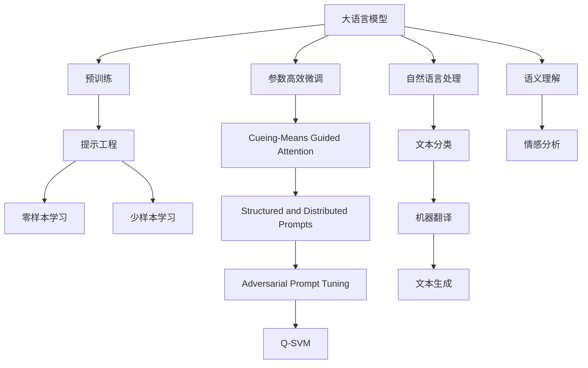
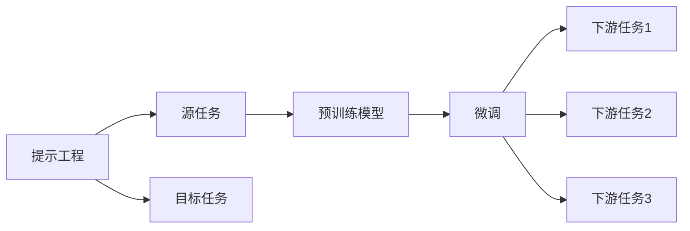
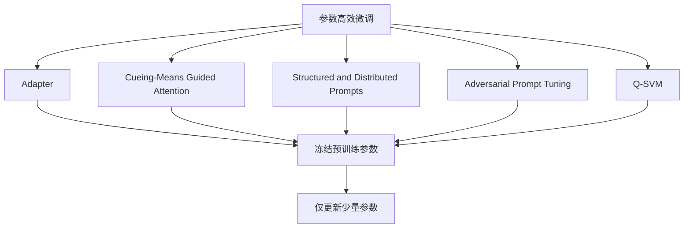
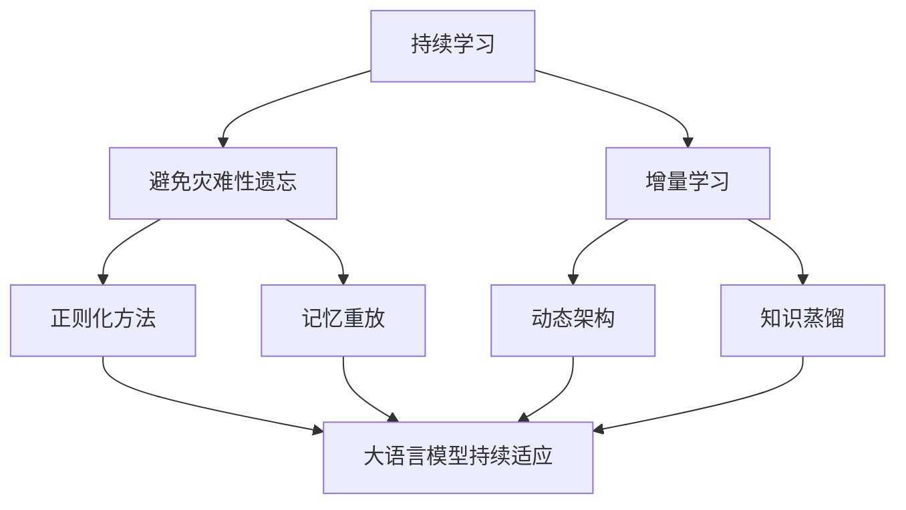
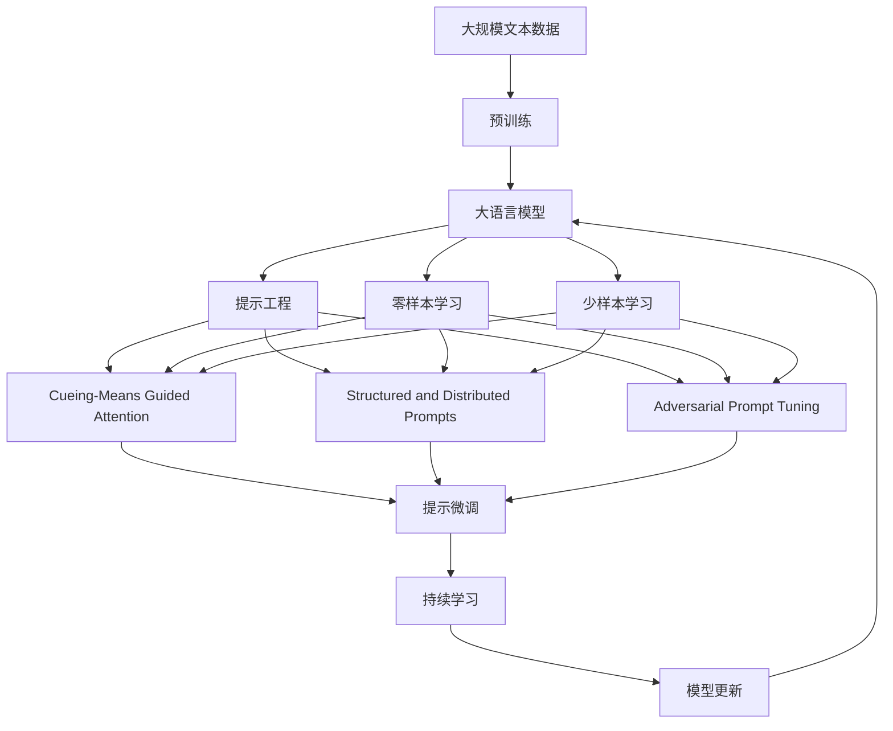

                 

# 大语言模型应用指南：提示工程

> 关键词：大语言模型,提示工程,零样本学习,少样本学习,提示模板,生成模型,参数高效微调,自然语言处理(NLP)

## 1. 背景介绍

### 1.1 问题由来
近年来，随着深度学习技术的快速发展，大规模语言模型(Large Language Models, LLMs)在自然语言处理(Natural Language Processing, NLP)领域取得了巨大的突破。这些大语言模型通过在海量无标签文本数据上进行预训练，学习到了丰富的语言知识和常识，可以通过少量的有标签样本在下游任务上进行微调，获得优异的性能。然而，预训练模型通常需要大规模的数据和计算资源，这在现实世界中往往难以获得。因此，如何利用预训练模型在低数据量场景下取得较好的性能，成为当前研究的重要课题。

### 1.2 问题核心关键点
提示工程(Prompt Engineering)是一种基于预训练语言模型的零样本或少样本学习范式，其核心思想是：通过设计精巧的输入文本格式(即提示模板)，使得预训练模型能够高效地理解和生成目标任务的结果，而无需进行微调或修改模型参数。该方法特别适用于数据量较少或无法获得足够标注样本的任务，如问答、文本生成、对话等。提示工程的本质是对预训练模型进行高效的利用，避免不必要的计算和参数更新，从而在资源有限的情况下，快速获取较好的模型性能。

### 1.3 问题研究意义
提示工程技术在降低数据需求、提高模型泛化能力、提升开发效率等方面具有重要意义：

1. 降低数据需求。提示工程能够利用预训练模型在低数据量场景下取得较好的性能，从而减少了对标注数据的需求。
2. 提高模型泛化能力。通过精心设计的提示模板，提示工程可以使得模型在更广泛的输入范围内保持较好的表现，增强了模型的泛化能力。
3. 提升开发效率。提示工程可以大幅缩短任务开发周期，通过简单的提示模板，快速迭代和优化模型性能。
4. 促进技术创新。提示工程催生了新的研究方向，如提示学习的优化、生成模型的改进等。
5. 赋能产业升级。提示工程使得NLP技术更容易被各行各业所采用，为传统行业数字化转型升级提供新的技术路径。

## 2. 核心概念与联系

### 2.1 核心概念概述

为更好地理解提示工程的原理和应用，本节将介绍几个密切相关的核心概念：

- 大语言模型(Large Language Model, LLM)：以自回归(如GPT)或自编码(如BERT)模型为代表的大规模预训练语言模型。通过在大规模无标签文本语料上进行预训练，学习通用的语言表示，具备强大的语言理解和生成能力。

- 预训练(Pre-training)：指在大规模无标签文本语料上，通过自监督学习任务训练通用语言模型的过程。常见的预训练任务包括言语建模、遮挡语言模型等。预训练使得模型学习到语言的通用表示。

- 提示工程(Prompt Engineering)：通过设计精巧的输入文本格式(即提示模板)，使得预训练模型能够高效地理解和生成目标任务的结果，而无需进行微调或修改模型参数。

- 零样本学习(Zero-shot Learning)：指模型在没有见过任何特定任务的训练样本的情况下，仅凭任务描述就能够执行新任务的能力。提示工程可以实现零样本学习，即不更新模型参数。

- 少样本学习(Few-shot Learning)：指在只有少量标注样本的情况下，模型能够快速适应新任务的学习方法。提示工程可以通过在输入中提供少量示例来实现，无需更新模型参数。

- 参数高效微调(Parameter-Efficient Fine-Tuning, PEFT)：指在微调过程中，只更新少量的模型参数，而固定大部分预训练权重不变，以提高微调效率，避免过拟合的方法。

- 自然语言处理(Natural Language Processing, NLP)：涉及计算机处理自然语言的技术和应用，包括文本分类、机器翻译、文本生成等。提示工程是NLP中重要的技术手段。

这些核心概念之间的逻辑关系可以通过以下Mermaid流程图来展示：



这个流程图展示了大语言模型的核心概念及其之间的关系：

1. 大语言模型通过预训练获得基础能力。
2. 提示工程是一种不更新模型参数的方法，实现零样本和少样本学习。
3. 参数高效微调可以优化模型性能，同时保持预训练权重不变。
4. 自然语言处理涉及多个任务，提示工程在其中扮演重要角色。
5. 提示工程具体方法包括 cueing、structured prompts、adversarial prompting 等。

这些概念共同构成了提示工程的学习框架，使其能够在各种场景下发挥强大的语言理解和生成能力。通过理解这些核心概念，我们可以更好地把握提示工程的工作原理和优化方向。

### 2.2 概念间的关系

这些核心概念之间存在着紧密的联系，形成了提示工程的完整生态系统。下面我通过几个Mermaid流程图来展示这些概念之间的关系。

#### 2.2.1 大语言模型的学习范式


这个流程图展示了大语言模型的三种主要学习范式：预训练、提示工程、参数高效微调。提示工程作为一种不更新模型参数的范式，实现零样本和少样本学习。参数高效微调则可以在保持预训练权重不变的情况下，通过更新少量参数，优化模型性能。

#### 2.2.2 提示工程与微调的关系



这个流程图展示了提示工程的基本原理，以及它与微调的关系。提示工程涉及源任务和目标任务，预训练模型在源任务上学习，然后通过提示工程实现对目标任务的零样本和少样本学习，而无需进行微调。

#### 2.2.3 参数高效微调方法



这个流程图展示了几种常见的参数高效微调方法，包括 Adapter、cueing、structured prompts、adversarial prompting 等。这些方法的共同特点是冻结大部分预训练参数，只更新少量参数，从而提高微调效率。

#### 2.2.4 持续学习在大语言模型中的应用



这个流程图展示了持续学习在大语言模型中的应用。持续学习的主要目标是避免灾难性遗忘和实现增量学习。通过正则化方法、记忆重放、动态架构和知识蒸馏等技术，可以使大语言模型持续适应新的任务和数据。

### 2.3 核心概念的整体架构

最后，我们用一个综合的流程图来展示这些核心概念在大语言模型微调过程中的整体架构：



这个综合流程图展示了从预训练到提示工程的完整过程。大语言模型首先在大规模文本数据上进行预训练，然后通过提示工程实现零样本和少样本学习，最终通过持续学习技术，模型可以不断更新和适应新的任务和数据。 通过这些流程图，我们可以更清晰地理解提示工程的工作原理和优化方向。

## 3. 核心算法原理 & 具体操作步骤
### 3.1 算法原理概述

提示工程的本质是利用预训练模型的语言表示能力，通过输入格式的设计，引导模型进行特定的推理和生成。其核心思想是：通过精心设计的提示模板，使得预训练模型能够高效地理解和生成目标任务的结果，而无需进行微调或修改模型参数。

形式化地，假设预训练语言模型为 $M_{\theta}$，其中 $\theta$ 为预训练得到的模型参数。给定目标任务 $T$ 的任务描述 $P$，提示工程的目标是找到最优的提示模板 $P_{opt}$，使得模型在 $P_{opt}$ 的引导下，能够生成最优的输出结果。

通过梯度下降等优化算法，提示工程过程不断更新提示模板 $P_{opt}$，最小化模型在 $P_{opt}$ 的引导下与目标结果的差异。由于 $\theta$ 已经通过预训练获得了较好的初始化，因此即便在非常少的标注样本下，也能较快收敛到理想的结果。

### 3.2 算法步骤详解

提示工程通常包括以下几个关键步骤：

**Step 1: 准备预训练模型和数据集**
- 选择合适的预训练语言模型 $M_{\theta}$ 作为初始化参数，如 BERT、GPT等。
- 准备目标任务的描述 $P$，可以是自然语言文本，也可以是由符号或数字表示的提示模板。

**Step 2: 设计提示模板**
- 根据任务类型，设计合适的提示模板 $P_{opt}$。提示模板通常由输入文本格式、示例和任务描述组成，以引导模型进行推理或生成。
- 对于分类任务，可以设计成类似“给定一段文本，预测其属于哪个类别”的格式。
- 对于生成任务，可以设计成类似“给定一个问题，请生成一段回答”的格式。
- 对于序列标注任务，可以设计成类似“给定一段文本，标注其中所有实体”的格式。

**Step 3: 执行提示训练**
- 将提示模板 $P_{opt}$ 和少量标注数据输入模型，前向传播计算输出。
- 计算输出与真实结果之间的差异，使用梯度下降等优化算法更新提示模板。
- 重复上述步骤直至收敛。

**Step 4: 测试和部署**
- 在测试集上评估提示工程后的模型性能。
- 使用提示工程后的模型对新样本进行推理或生成，集成到实际的应用系统中。
- 持续收集新的数据，定期重新提示工程，以适应数据分布的变化。

以上是提示工程的一般流程。在实际应用中，还需要针对具体任务的特点，对提示工程过程的各个环节进行优化设计，如改进提示模板的设计，引入更多的正则化技术，搜索最优的提示组合等，以进一步提升模型性能。

### 3.3 算法优缺点

提示工程具有以下优点：

1. 简单高效。提示模板的设计通常比较简单，无需进行微调或修改模型参数，快速实现模型适配。
2. 通用适用。提示工程适用于各种NLP任务，包括分类、匹配、生成等，设计精巧的提示模板即可实现。
3. 参数高效。利用参数高效提示工程技术，在固定大部分预训练参数的情况下，仍可取得不错的效果。
4. 效果显著。在学术界和工业界的诸多任务上，提示工程已经刷新了最先进的性能指标。

同时，该方法也存在一定的局限性：

1. 依赖提示模板。提示工程的效果很大程度上取决于提示模板的质量和设计，设计不当可能导致模型性能不佳。
2. 泛化能力有限。当提示模板与预训练模型的知识分布差异较大时，提示工程的效果可能较差。
3. 无法更新模型参数。由于不修改模型参数，无法通过微调获得新任务上的适应能力。
4. 可解释性不足。提示工程生成的模型往往缺乏可解释性，难以对其推理逻辑进行分析和调试。

尽管存在这些局限性，但就目前而言，提示工程仍是大语言模型应用的重要范式。未来相关研究的重点在于如何进一步降低提示模板的设计难度，提高提示工程方法的泛化能力，同时兼顾可解释性和伦理安全性等因素。

### 3.4 算法应用领域

提示工程技术在NLP领域已经得到了广泛的应用，覆盖了几乎所有常见任务，例如：

- 文本分类：如情感分析、主题分类、意图识别等。通过设计合适的提示模板，使得模型学习文本-标签映射。
- 命名实体识别：识别文本中的人名、地名、机构名等特定实体。通过设计带有示例的提示模板，引导模型学习实体边界和类型。
- 关系抽取：从文本中抽取实体之间的语义关系。通过设计多轮对话的提示模板，逐步引导模型学习关系抽取。
- 问答系统：对自然语言问题给出答案。设计合适的问答提示模板，使模型理解问题并生成回答。
- 机器翻译：将源语言文本翻译成目标语言。设计多轮对话的提示模板，逐步引导模型学习语言-语言映射。
- 文本摘要：将长文本压缩成简短摘要。设计简洁的摘要提示模板，使模型学习抓取要点。
- 对话系统：使机器能够与人自然对话。设计多轮对话的提示模板，逐步引导模型生成回复。

除了上述这些经典任务外，提示工程也被创新性地应用到更多场景中，如可控文本生成、常识推理、代码生成、数据增强等，为NLP技术带来了全新的突破。随着提示工程方法的不断进步，相信NLP技术将在更广阔的应用领域大放异彩。

## 4. 数学模型和公式 & 详细讲解
### 4.1 数学模型构建

本节将使用数学语言对提示工程的原理进行更加严格的刻画。

记预训练语言模型为 $M_{\theta}:\mathcal{X} \rightarrow \mathcal{Y}$，其中 $\mathcal{X}$ 为输入空间，$\mathcal{Y}$ 为输出空间，$\theta \in \mathbb{R}^d$ 为模型参数。假设目标任务 $T$ 的任务描述为 $P$，提示工程的目标是找到最优的提示模板 $P_{opt}$，使得模型在 $P_{opt}$ 的引导下，能够生成最优的输出结果。

定义提示模板 $P_{opt}$ 在输入 $x$ 上的损失函数为 $\ell(M_{\theta}(x),y)$，则在数据集 $D$ 上的经验风险为：

$$
\mathcal{L}(\theta) = \frac{1}{N} \sum_{i=1}^N \ell(M_{\theta}(x_i),y_i)
$$

其中 $\mathcal{L}$ 为针对任务 $T$ 设计的损失函数，用于衡量模型预测输出与真实标签之间的差异。常见的损失函数包括交叉熵损失、均方误差损失等。

提示工程的目标是最小化经验风险，即找到最优的提示模板 $P_{opt}$：

$$
P_{opt} = \mathop{\arg\min}_{P} \mathcal{L}(\theta|P)
$$

在实践中，我们通常使用基于梯度的优化算法（如SGD、Adam等）来近似求解上述最优化问题。设 $\eta$ 为学习率，$\lambda$ 为正则化系数，则参数的更新公式为：

$$
P \leftarrow P - \eta \nabla_{P}\mathcal{L}(\theta|P) - \eta\lambda P
$$

其中 $\nabla_{P}\mathcal{L}(\theta|P)$ 为损失函数对提示模板 $P$ 的梯度，可通过反向传播算法高效计算。

### 4.2 公式推导过程

以下我们以二分类任务为例，推导提示模板的梯度计算公式。

假设提示模板为 $P$，输入文本 $x$，真实标签 $y \in \{0,1\}$。模型在 $P$ 的引导下，对输入 $x$ 进行推理，输出为 $\hat{y}=M_{\theta}(x|P)$，表示模型预测样本属于正类的概率。

则二分类交叉熵损失函数定义为：

$$
\ell(M_{\theta}(x|P),y) = -[y\log \hat{y} + (1-y)\log (1-\hat{y})]
$$

将其代入经验风险公式，得：

$$
\mathcal{L}(P|P) = -\frac{1}{N}\sum_{i=1}^N [y_i\log M_{\theta}(x_i|P)+(1-y_i)\log(1-M_{\theta}(x_i|P))]
$$

根据链式法则，损失函数对提示模板 $P$ 的梯度为：

$$
\frac{\partial \mathcal{L}(P|P)}{\partial P} = -\frac{1}{N}\sum_{i=1}^N (\frac{y_i}{M_{\theta}(x_i|P)}-\frac{1-y_i}{1-M_{\theta}(x_i|P)}) \frac{\partial M_{\theta}(x_i|P)}{\partial P}
$$

其中 $\frac{\partial M_{\theta}(x_i|P)}{\partial P}$ 可进一步递归展开，利用自动微分技术完成计算。

在得到损失函数的梯度后，即可带入参数更新公式，完成模型的迭代优化。重复上述过程直至收敛，最终得到适应目标任务的提示模板 $P_{opt}$。

## 5. 项目实践：代码实例和详细解释说明
### 5.1 开发环境搭建

在进行提示工程实践前，我们需要准备好开发环境。以下是使用Python进行PyTorch开发的环境配置流程：

1. 安装Anaconda：从官网下载并安装Anaconda，用于创建独立的Python环境。

2. 创建并激活虚拟环境：
```bash
conda create -n pytorch-env python=3.8 
conda activate pytorch-env
```

3. 安装PyTorch：根据CUDA版本，从官网获取对应的安装命令。例如：
```bash
conda install pytorch torchvision torchaudio cudatoolkit=11.1 -c pytorch -c conda-forge
```

4. 安装Transformers库：
```bash
pip install transformers
```

5. 安装各类工具包：
```bash
pip install numpy pandas scikit-learn matplotlib tqdm jupyter notebook ipython
```

完成上述步骤后，即可在`pytorch-env`环境中开始提示工程实践。

### 5.2 源代码详细实现

这里我们以文本分类任务为例，给出使用Transformers库对BERT模型进行提示工程的PyTorch代码实现。

首先，定义文本分类任务的数据处理函数：

```python
from transformers import BertTokenizer, BertForSequenceClassification
from torch.utils.data import Dataset
import torch

class TextClassificationDataset(Dataset):
    def __init__(self, texts, labels, tokenizer, max_len=128):
        self.texts = texts
        self.labels = labels
        self.tokenizer = tokenizer
        self.max_len = max_len
        
    def __len__(self):
        return len(self.texts)
    
    def __getitem__(self, item):
        text = self.texts[item]
        label = self.labels[item]
        
        encoding = self.tokenizer(text, return_tensors='pt', max_length=self.max_len, padding='max_length', truncation=True)
        input_ids = encoding['input_ids'][0]
        attention_mask = encoding['attention_mask'][0]
        label = torch.tensor(label, dtype=torch.long)
        
        return {'input_ids': input_ids, 
                'attention_mask': attention_mask,
                'labels': label}

# 标签与id的映射
label2id = {'positive': 1, 'negative': 0}
id2label = {v: k for k, v in label2id.items()}

# 创建dataset
tokenizer = BertTokenizer.from_pretrained('bert-base-cased')

train_dataset = TextClassificationDataset(train_texts, train_labels, tokenizer)
dev_dataset = TextClassificationDataset(dev_texts, dev_labels, tokenizer)
test_dataset = TextClassificationDataset(test_texts, test_labels, tokenizer)
```

然后，定义模型和优化器：

```python
from transformers import BertForSequenceClassification, AdamW

model = BertForSequenceClassification.from_pretrained('bert-base-cased', num_labels=len(label2id))

optimizer = AdamW(model.parameters(), lr=2e-5)
```

接着，定义训练和评估函数：

```python
from torch.utils.data import DataLoader
from tqdm import tqdm
from sklearn.metrics import classification_report

device = torch.device('cuda') if torch.cuda.is_available() else torch.device('cpu')
model.to(device)

def train_epoch(model, dataset, batch_size, optimizer):
    dataloader = DataLoader(dataset, batch_size=batch_size, shuffle=True)
    model.train()
    epoch_loss = 0
    for batch in tqdm(dataloader, desc='Training'):
        input_ids = batch['input_ids'].to(device)
        attention_mask = batch['attention_mask'].to(device)
        labels = batch['labels'].to(device)
        model.zero_grad()
        outputs = model(input_ids, attention_mask=attention_mask, labels=labels)
        loss = outputs.loss
        epoch_loss += loss.item()
        loss.backward()
        optimizer.step()
    return epoch_loss / len(dataloader)

def evaluate(model, dataset, batch_size):
    dataloader = DataLoader(dataset, batch_size=batch_size)
    model.eval()
    preds, labels = [], []
    with torch.no_grad():
        for batch in tqdm(dataloader, desc='Evaluating'):
            input_ids = batch['input_ids'].to(device)
            attention_mask = batch['attention_mask'].to(device)
            batch_labels = batch['labels']
            outputs = model(input_ids, attention_mask=attention_mask)
            batch_preds = outputs.logits.argmax(dim=2).to('cpu').tolist()
            batch_labels = batch_labels.to('cpu').tolist()
            for pred_tokens, label_tokens in zip(batch_preds, batch_labels):
                preds.append(pred_tokens[:len(label_tokens)])
                labels.append(label_tokens)
                
    print(classification_report(labels, preds))
```

最后，启动训练流程并在测试集上评估：

```python
epochs = 5
batch_size = 16

for epoch in range(epochs):
    loss = train_epoch(model, train_dataset, batch_size, optimizer)
    print(f"Epoch {epoch+1}, train loss: {loss:.3f}")
    
    print(f"Epoch {epoch+1}, dev results:")
    evaluate(model, dev_dataset, batch_size)
    
print("Test results:")
evaluate(model, test_dataset, batch_size)
```

以上就是使用PyTorch对BERT进行文本分类任务提示工程的完整代码实现。可以看到，得益于Transformers库的强大封装，我们可以用相对简洁的代码完成BERT模型的加载和提示工程。

### 5.3 代码解读与分析

让我们再详细解读一下关键代码的实现细节：

**TextClassificationDataset类**：
- `__init__`方法：初始化文本、标签、分词器等关键组件。
- `__len__`方法：返回数据集的样本数量。
- `__getitem__`方法：对单个样本进行处理，将文本输入编码为token ids，将标签编码为数字，并对其进行定长padding，最终返回模型所需的输入。

**label2id和id2label字典**：
- 定义了标签与数字id之间的映射关系，用于将预测结果解码回真实的标签。

**训练和评估函数**：
- 使用PyTorch的DataLoader对数据集进行批次化加载，供模型训练和推理使用。
- 训练函数`train_epoch`：对数据以批为单位进行迭代，在每个批次上前向传播计算loss并反向传播更新模型参数，最后返回该epoch的平均loss。
- 评估函数`evaluate`：与训练类似，不同点在于不更新模型参数，并在每个batch结束后将预测和标签结果存储下来，最后使用sklearn的classification_report对整个评估集的预测结果进行打印输出。

**训练流程**：
- 定义总的epoch数和batch size，开始循环迭代
- 每个epoch内，先在训练

