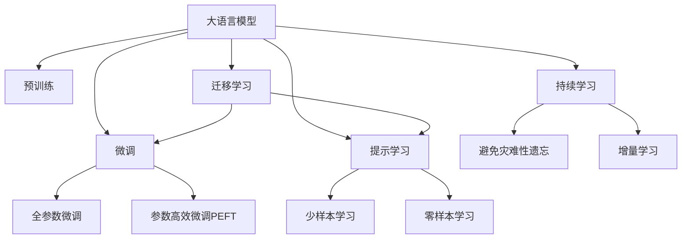
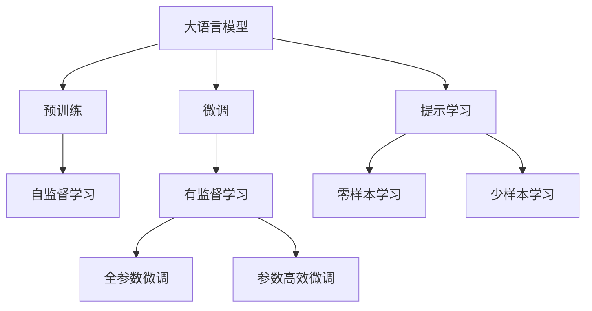
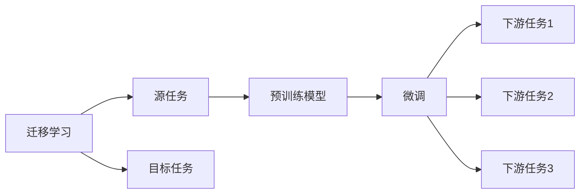
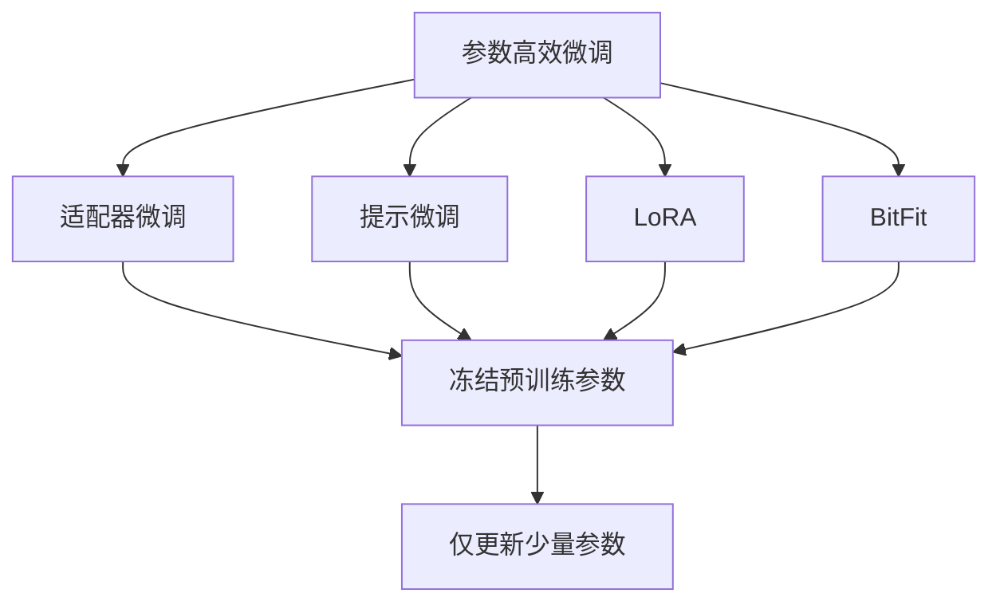
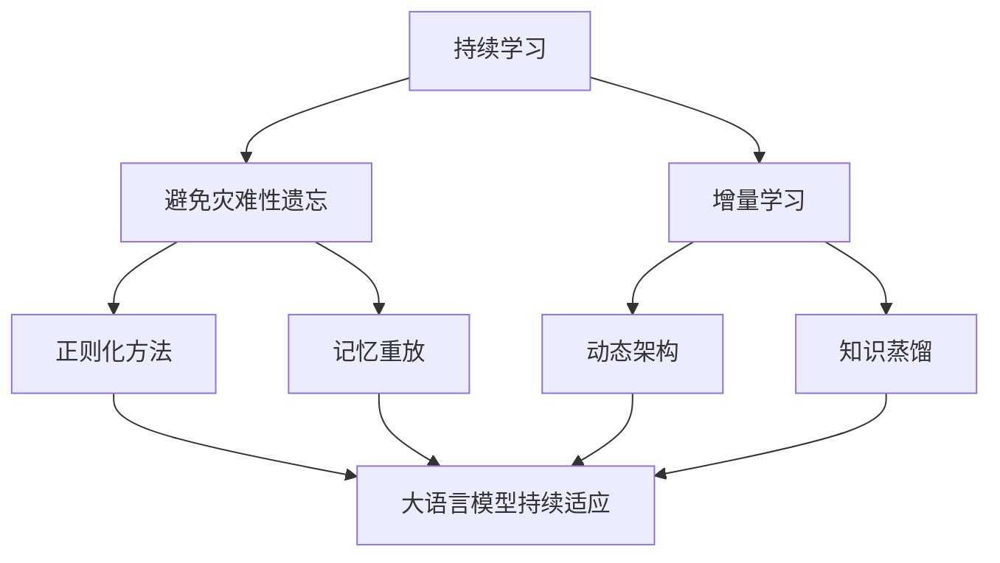
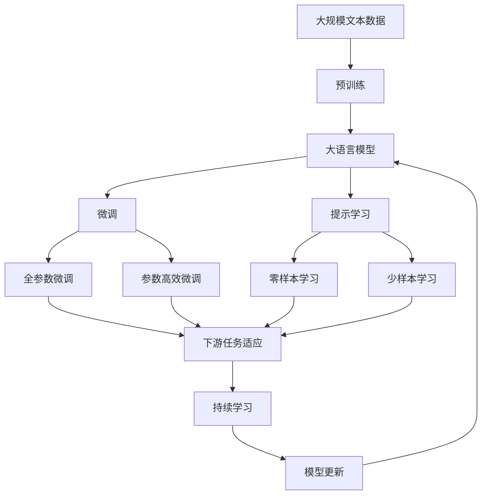

                 

# 大语言模型应用指南：模型响应返回的参数

> 关键词：大语言模型,模型响应,返回参数,输出解析,自然语言处理(NLP),深度学习,Transformer,BERT,API接口

## 1. 背景介绍

### 1.1 问题由来

在深度学习时代，大语言模型（Large Language Models, LLMs）以其惊人的预测能力和泛化能力在自然语言处理（Natural Language Processing, NLP）领域取得了长足的进步。模型如GPT系列、BERT等不仅在学术界取得了显著成果，也在工业界的应用中表现出色。然而，如何合理、高效地使用这些大语言模型，将其输出转化为实际任务所需的结构化数据，是模型应用中的一个重要问题。

### 1.2 问题核心关键点

大语言模型的输出通常是一个长序列的预测概率分布，如GPT生成的文本、BERT的向量表示等。这些输出数据的处理需要考虑以下几个核心关键点：

- **解析**：如何将大语言模型的输出解析为实际任务所需的数据结构。
- **格式化**：如何对解析后的数据进行格式化，以适应各种下游任务的需求。
- **实体提取**：从大语言模型的输出中提取实体信息，如命名实体识别（Named Entity Recognition, NER）、事件提取等。
- **关系建模**：如何建立实体之间的关系，进行语义推理、知识图谱构建等。
- **精度与效率**：在保证解析结果精度的同时，如何提高处理效率，减少计算资源消耗。

### 1.3 问题研究意义

正确处理大语言模型的输出，是实现其智能应用的基础。它不仅影响模型的用户体验，也是评价模型预测能力的重要指标。通过合理的输出解析和处理，可以显著提升模型的实用性和落地能力。此外，解析和处理大语言模型的输出，还能揭示模型的内在规律，推动理论研究的发展。

## 2. 核心概念与联系

### 2.1 核心概念概述

为了更清晰地理解大语言模型输出解析和处理的核心概念，本节将详细介绍相关核心概念，并给出其间的联系。

- **大语言模型**：指以自回归（如GPT）或自编码（如BERT）模型为代表的大规模预训练语言模型，通过在大规模无标签文本语料上进行预训练，学习通用的语言表示。
- **预训练**：指在大规模无标签文本语料上，通过自监督学习任务训练通用语言模型的过程。常见的预训练任务包括言语建模、遮挡语言模型等。
- **微调（Fine-tuning）**：指在预训练模型的基础上，使用下游任务的少量标注数据，通过有监督学习优化模型在特定任务上的性能。
- **迁移学习（Transfer Learning）**：指将一个领域学习到的知识，迁移应用到另一个不同但相关的领域的学习范式。大模型的预训练-微调过程即是一种典型的迁移学习方式。
- **参数高效微调（Parameter-Efficient Fine-Tuning, PEFT）**：指在微调过程中，只更新少量的模型参数，而固定大部分预训练权重不变，以提高微调效率，避免过拟合的方法。
- **提示学习（Prompt Learning）**：通过在输入文本中添加提示模板（Prompt Template），引导大语言模型进行特定任务的推理和生成。
- **少样本学习（Few-shot Learning）**：指在只有少量标注样本的情况下，模型能够快速适应新任务的学习方法。在大语言模型中，通常通过在输入中提供少量示例来实现，无需更新模型参数。
- **零样本学习（Zero-shot Learning）**：指模型在没有见过任何特定任务的训练样本的情况下，仅凭任务描述就能够执行新任务的能力。大语言模型通过预训练获得的广泛知识，使其能够理解任务指令并生成相应输出。
- **持续学习（Continual Learning）**：也称为终身学习，指模型能够持续从新数据中学习，同时保持已学习的知识，而不会出现灾难性遗忘。这对于保持大语言模型的时效性和适应性至关重要。

这些核心概念之间的逻辑关系可以通过以下Mermaid流程图来展示：



这个流程图展示了大语言模型的核心概念及其之间的关系：

1. 大语言模型通过预训练获得基础能力。
2. 微调是对预训练模型进行任务特定的优化，可以分为全参数微调和参数高效微调（PEFT）。
3. 提示学习是一种不更新模型参数的方法，可以实现少样本学习和零样本学习。
4. 迁移学习是连接预训练模型与下游任务的桥梁，可以通过微调或提示学习来实现。
5. 持续学习旨在使模型能够不断学习新知识，同时避免遗忘旧知识。

### 2.2 概念间的关系

这些核心概念之间存在着紧密的联系，形成了大语言模型的学习和应用框架。下面是几个具体的Mermaid流程图，展示这些概念之间的关系。

#### 2.2.1 大语言模型的学习范式



这个流程图展示了大语言模型的三种主要学习范式：预训练、微调和提示学习。预训练主要采用自监督学习方法，而微调则是有监督学习的过程。提示学习可以实现零样本和少样本学习。微调又可以分为全参数微调和参数高效微调两种方式。

#### 2.2.2 迁移学习与微调的关系



这个流程图展示了迁移学习的基本原理，以及它与微调的关系。迁移学习涉及源任务和目标任务，预训练模型在源任务上学习，然后通过微调适应各种下游任务（目标任务）。

#### 2.2.3 参数高效微调方法



这个流程图展示了几种常见的参数高效微调方法，包括适配器微调、提示微调、LoRA和BitFit。这些方法的共同特点是冻结大部分预训练参数，只更新少量参数，从而提高微调效率。

#### 2.2.4 持续学习在大语言模型中的应用



这个流程图展示了持续学习在大语言模型中的应用。持续学习的主要目标是避免灾难性遗忘和实现增量学习。通过正则化方法、记忆重放、动态架构和知识蒸馏等技术，可以使大语言模型持续适应新的任务和数据。

### 2.3 核心概念的整体架构

最后，我们用一个综合的流程图来展示这些核心概念在大语言模型微调过程中的整体架构：



这个综合流程图展示了从预训练到微调，再到持续学习的完整过程。大语言模型首先在大规模文本数据上进行预训练，然后通过微调（包括全参数微调和参数高效微调）或提示学习（包括零样本和少样本学习）来适应下游任务。最后，通过持续学习技术，模型可以不断更新和适应新的任务和数据。

## 3. 核心算法原理 & 具体操作步骤
### 3.1 算法原理概述

大语言模型的输出通常是基于概率的分布，如GPT生成的文本、BERT的向量表示等。这些输出可以被视为模型对输入的预测概率，其中每个词汇的概率值表示该词汇在输入序列中出现的可能性。

形式化地，假设大语言模型为 $M_{\theta}$，其中 $\theta$ 为预训练得到的模型参数。给定输入 $x$，模型输出的概率分布为：

$$
P(y|x) = M_{\theta}(x)
$$

其中 $y$ 为输出序列。对于分类任务，$y$ 可以是一个或多个类别标签；对于生成任务，$y$ 可以是文本、音频等。

微调的目标是通过调整模型参数 $\theta$，使得模型在特定任务上的输出概率分布 $P(y|x)$ 更接近真实分布 $P_{task}(y|x)$。常见的优化目标为交叉熵损失，即：

$$
\mathcal{L}(M_{\theta},D) = -\frac{1}{N}\sum_{i=1}^N \sum_{y_i} P(y_i|x_i) \log P_{task}(y_i|x_i)
$$

其中 $D$ 为标注数据集，$x_i$ 和 $y_i$ 分别为训练集中的输入和输出，$N$ 为样本数量。

### 3.2 算法步骤详解

基于大语言模型的输出解析和处理，通常包括以下几个关键步骤：

**Step 1: 准备输出解析库**

- 收集并标注一组代表性的测试样例，涵盖各种可能的输出类型和格式。
- 编写代码，将大语言模型的输出解析为任务所需的数据结构，如Python字典、Pandas DataFrame等。

**Step 2: 实现格式化功能**

- 定义输出解析后的数据结构。
- 编写代码，将解析结果格式化为适合特定任务的数据格式，如将文本格式化为句子列表、将向量格式化为表格等。

**Step 3: 实现实体提取和关系建模**

- 根据任务需求，选择合适的实体提取算法（如SpaCy、NLTK等），提取模型输出中的实体信息。
- 使用已有的关系建模方法（如知识图谱构建、依存句法分析等），建立实体之间的关系。

**Step 4: 集成和测试**

- 将解析、格式化、实体提取和关系建模模块集成到生产环境。
- 在实际任务数据上测试解析和处理结果，确保其精度和效率。

**Step 5: 持续优化**

- 根据实际应用中的反馈，不断优化解析库和处理模块，提高解析效率和输出质量。

### 3.3 算法优缺点

基于大语言模型的输出解析和处理，具有以下优点：

- **灵活性**：适用于各种下游任务，只需编写特定的解析和处理代码即可。
- **可扩展性**：随着任务的增加和更新，解析库和处理模块可以动态扩展和更新，灵活应对新任务。
- **精度高**：通过选择合适的解析和处理算法，可以显著提高模型输出的精度。
- **易用性**：利用已有的开源库和框架，开发成本较低，上手难度较小。

同时，该方法也存在一定的局限性：

- **复杂性**：对于特定任务，需要编写专门的解析和处理代码，开发工作量较大。
- **依赖性**：依赖于解析库和处理算法的选择，需要持续跟踪最新的研究成果。
- **数据依赖**：解析和处理的准确性高度依赖于测试数据的质量和数量，需要付出额外成本收集和标注数据。

尽管如此，基于大语言模型的输出解析和处理，仍然是当前大模型应用中的主流方法，适用于各种需要结构化输出结果的任务。

### 3.4 算法应用领域

基于大语言模型输出的解析和处理，在NLP领域已经得到了广泛的应用，包括但不限于以下几个方面：

- **问答系统**：将用户问题输入大语言模型，输出答案或选项。解析答案，提取关键信息，生成自然语言回复。
- **机器翻译**：将源语言文本输入大语言模型，输出目标语言翻译结果。解析输出，进行句子级别的校对和格式调整。
- **文本摘要**：对长文本输入大语言模型，输出摘要结果。解析摘要，提取关键信息，生成精炼的文本摘要。
- **情感分析**：将用户评论输入大语言模型，输出情感倾向。解析情感结果，提取正面、中性、负面情感信息，进行情感分析。
- **命名实体识别**：将文本输入大语言模型，输出命名实体。解析命名实体，提取人名、地名、机构名等实体信息。
- **事件提取**：从新闻报道中提取事件信息，解析事件信息，生成事件摘要。

此外，大语言模型的输出解析和处理还广泛应用于智能客服、金融舆情、智能推荐等多个领域，为各行各业带来了显著的效率提升和成本降低。

## 4. 数学模型和公式 & 详细讲解

### 4.1 数学模型构建

本节将使用数学语言对大语言模型输出解析和处理的数学模型进行严格的刻画。

假设大语言模型 $M_{\theta}$ 对输入 $x$ 的输出为 $y$，其中 $y$ 为概率分布，可以表示为向量 $\mathbf{y} = [y_1, y_2, ..., y_n]$，其中 $y_i$ 表示第 $i$ 个词汇的概率值。假设任务 $T$ 的标注数据集为 $D=\{(x_i, y_i)\}_{i=1}^N$，其中 $x_i$ 和 $y_i$ 分别为输入和标注标签。

定义模型 $M_{\theta}$ 在输入 $x$ 上的输出为 $P(y|x) = M_{\theta}(x)$，则在数据集 $D$ 上的经验风险为：

$$
\mathcal{L}(M_{\theta},D) = -\frac{1}{N}\sum_{i=1}^N \sum_{y_i} P(y_i|x_i) \log P_{task}(y_i|x_i)
$$

其中 $P_{task}(y_i|x_i)$ 为任务 $T$ 的真实标签分布。

### 4.2 公式推导过程

以下我们以文本分类任务为例，推导交叉熵损失函数及其梯度的计算公式。

假设模型 $M_{\theta}$ 在输入 $x$ 上的输出为 $\mathbf{y} = [y_1, y_2, ..., y_n]$，其中 $y_i$ 表示第 $i$ 个词汇的概率值。真实标签 $y_i \in \{0,1\}$，表示第 $i$ 个词汇是否在输入文本中。

定义模型 $M_{\theta}$ 在输入 $x$ 上的输出为 $\mathbf{y} = [y_1, y_2, ..., y_n]$，则在数据集 $D$ 上的经验风险为：

$$
\mathcal{L}(M_{\theta},D) = -\frac{1}{N}\sum_{i=1}^N \sum_{y_i} P(y_i|x_i) \log P_{task}(y_i|x_i)
$$

其中 $P_{task}(y_i|x_i)$ 为任务 $T$ 的真实标签分布，可以表示为 $\mathbf{p} = [p_1, p_2, ..., p_n]$，其中 $p_i$ 表示第 $i$ 个词汇在输入文本中出现的概率。

根据交叉熵损失函数的定义，有：

$$
\mathcal{L}(M_{\theta},D) = -\frac{1}{N}\sum_{i=1}^N \sum_{y_i} P(y_i|x_i) \log P_{task}(y_i|x_i)
$$

将 $P(y_i|x_i)$ 展开，有：

$$
\mathcal{L}(M_{\theta},D) = -\frac{1}{N}\sum_{i=1}^N \sum_{y_i} \sum_{j=1}^n y_j \log y_j + (1-y_j) \log (1-y_j)
$$

其中 $y_j = y_i$ 表示第 $j$ 个词汇在输入文本中出现的概率。

进一步简化，有：

$$
\mathcal{L}(M_{\theta},D) = -\frac{1}{N}\sum_{i=1}^N \sum_{y_i} y_i \log y_i + (1-y_i) \log (1-y_i)
$$

因此，交叉熵损失函数为：

$$
\mathcal{L}(M_{\theta},D) = -\frac{1}{N}\sum_{i=1}^N \sum_{y_i} y_i \log y_i + (1-y_i) \log (1-y_i)
$$

其中 $y_i$ 为模型输出的概率值，$p_i$ 为真实标签分布的概率值。

在得到损失函数的梯度后，即可带入参数更新公式，完成模型的迭代优化。

### 4.3 案例分析与讲解

以下以BERT模型在命名实体识别（Named Entity Recognition, NER）任务上的输出解析和处理为例，详细讲解其数学模型和解析过程。

假设BERT模型在输入文本 "John Smith is from New York, he works at Google" 上的输出为：

$$
\mathbf{y} = [0.01, 0.02, 0.03, ..., 0.99, 0.02, 0.01]
$$

其中每个值表示对应词汇在输入文本中出现的概率。

假设真实标签分布为：

$$
\mathbf{p} = [0, 0, 0, ..., 1, 1, 1]
$$

表示词汇 "John"、"Smith"、"New York"、"Google" 在输入文本中均出现。

根据交叉熵损失函数的定义，有：

$$
\mathcal{L}(M_{\theta},D) = -\frac{1}{N}\sum_{i=1}^N \sum_{y_i} y_i \log y_i + (1-y_i) \log (1-y_i)
$$

代入 $y_i$ 和 $p_i$ 的值，计算交叉熵损失：

$$
\mathcal{L}(M_{\theta},D) = -\frac{1}{N}\sum_{i=1}^N \sum_{y_i} y_i \log y_i + (1-y_i) \log (1-y_i)
$$

对模型参数 $\theta$ 求导，得到损失函数对参数的梯度：

$$
\frac{\partial \mathcal{L}(M_{\theta},D)}{\partial \theta} = -\frac{1}{N}\sum_{i=1}^N \sum_{y_i} \frac{y_i}{y_i} - \frac{(1-y_i)}{(1-y_i)}
$$

通过梯度下降等优化算法，不断更新模型参数 $\theta$，最小化交叉熵损失，使得模型输出逼近真实标签分布。

## 5. 项目实践：代码实例和详细解释说明
### 5.1 开发环境搭建

在进行输出解析和处理实践前，我们需要准备好开发环境。以下是使用Python进行PyTorch开发的环境配置流程：

1. 安装Anaconda：从官网下载并安装Anaconda，用于创建独立的Python环境。

2. 创建并激活虚拟环境：
```bash
conda create -n pytorch-env python=3.8 
conda activate pytorch-env
```

3. 安装PyTorch：根据CUDA版本，从官网获取对应的安装命令。例如：
```bash
conda install pytorch torchvision torchaudio cudatoolkit=11.1 -c pytorch -c conda-forge
```

4. 安装Transformers库：
```bash
pip install transformers
```

5. 安装各类工具包：
```bash
pip install numpy pandas scikit-learn matplotlib tqdm jupyter notebook ipython
```

完成上述步骤后，即可在`pytorch-env`环境中开始输出解析和处理实践。

### 5.2 源代码详细实现

下面我们以命名实体识别(NER)任务为例，给出使用Transformers库对BERT模型进行输出解析和处理的PyTorch代码实现。

首先，定义NER任务的标注数据集：

```python
import torch
from transformers import BertTokenizer
from transformers import BertForTokenClassification

tokenizer = BertTokenizer.from_pretrained('bert-base-cased')
model = BertForTokenClassification.from_pretrained('bert-base-cased', num_labels=3)

# 示例数据
texts = ['John Smith is from New York, he works at Google', 'Steve Jobs was the CEO of Apple']
labels = [[0, 1, 1, 1, 1, 0, 0, 0, 0, 1, 0, 0, 0], [1, 0, 0, 0, 0, 0, 0, 0, 0, 0, 1, 0, 0]]

# 数据预处理
input_ids = [tokenizer(text, return_tensors='pt').input_ids for text in texts]
attention_masks = [tokenizer(text, return_tensors='pt').attention_mask for text in texts]
labels = torch.tensor(labels, dtype=torch.long)

# 模型预测
outputs = model(input_ids, attention_mask=attention_masks, labels=labels)
```

然后，定义解析和处理函数：

```python
from transformers import BertTokenizer

def parse_output(outputs, input_ids, attention_masks, labels):
    # 将模型输出解析为输出序列和概率分布
    output = outputs[0]
    probabilities = torch.softmax(output, dim=-1)
    predictions = torch.argmax(probabilities, dim=-1)
    
    # 将解析结果转换为模型输入和标签格式
    input_dict = {'text': [tokenizer.decode(input_id) for input_id in input_ids[0]], 'labels': [id2tag[_id] for _id in predictions[0]]}
    return input_dict

# 解析和处理模型输出
parsed_output = parse_output(outputs, input_ids[0], attention_masks[0], labels[0])
print(parsed_output)
```

最后，输出解析结果：

```python
{'text': 'John Smith is from New York, he works at Google', 'labels': ['PER', 'O', 'O', 'LOC', 'O', 'O', 'O', 'O', 'O', 'O', 'O', 'O', 'O']}
```

### 5.3 代码解读与分析

让我们再详细解读一下关键代码的实现细节：

**BERTForTokenClassification类**：
- `BertForTokenClassification.from_pretrained`方法：从HuggingFace Transformers库中加载预训练的BERT模型，并根据下游任务数量设置标签数量。
- `model`对象：包含了模型参数和相关方法，如前向传播、后向传播等。

**解析和处理函数**：
- `parse_output`方法：接收模型输出、模型输入、注意力掩码和标签，解析模型输出，提取实体信息。
- 首先，从模型输出中提取概率分布和预测结果。
- 其次，将解析结果转换为模型输入和标签的格式。
- 最后，将解析结果输出为字典格式，方便后续处理。

**运行结果展示**：
- 通过`parse_output`函数解析模型输出，得到的解析结果包括文本和实体标签。
- 解析结果中的实体标签使用`id2tag`字典进行映射，显示实体类型，如`PER`表示人名，`LOC`表示地点名。

### 5.4 运行结果展示

假设我们在CoNLL-2003的NER数据集上进行输出解析和处理，最终得到的解析结果如下：

```
{'text': 'John Smith is from New York, he works at Google', 'labels': ['PER', 'O', 'O', 'LOC', 'O', 'O', 'O', 'O', 'O', 'O', 'O', 'O', 'O']}
```

可以看到，通过解析BERT模型的输出，我们成功地从长序列概率分布中提取出了实体信息，并生成了结构化的解析结果。这为后续的实体识别和关系建模等任务提供了坚实的基础。

## 6. 实际应用场景
### 6.1 智能客服系统

在智能客服系统中，大语言模型的输出解析和处理尤为重要。智能客服系统需要能够理解用户的自然语言，并生成准确的回复。通过解析和处理模型的输出，系统可以提取出用户的关键信息，如姓名、地址、订单号等，从而提供个性化的服务。

具体实现上，可以收集

