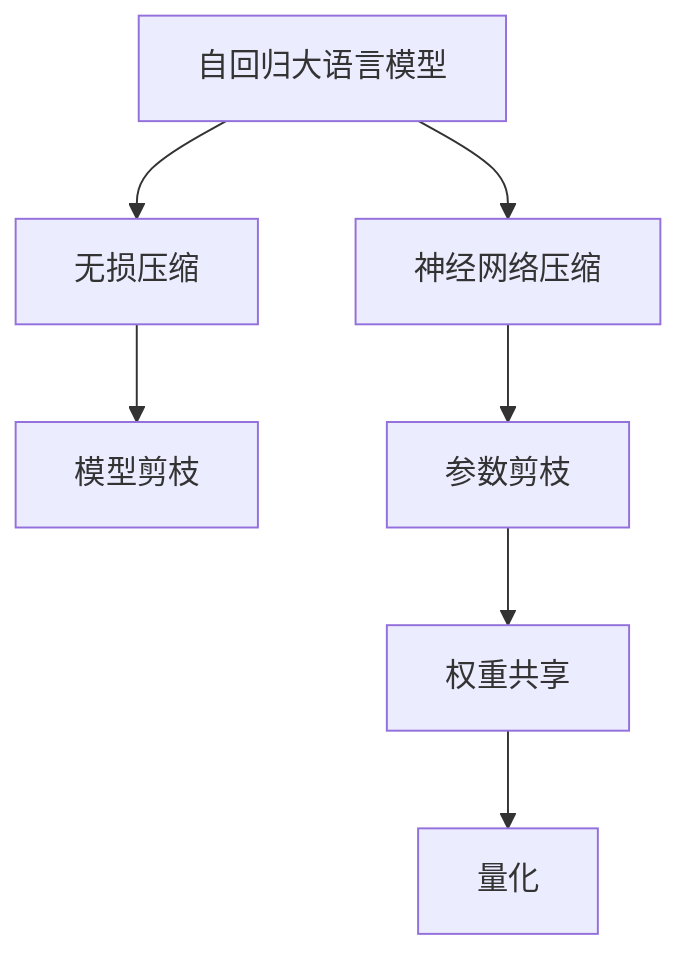
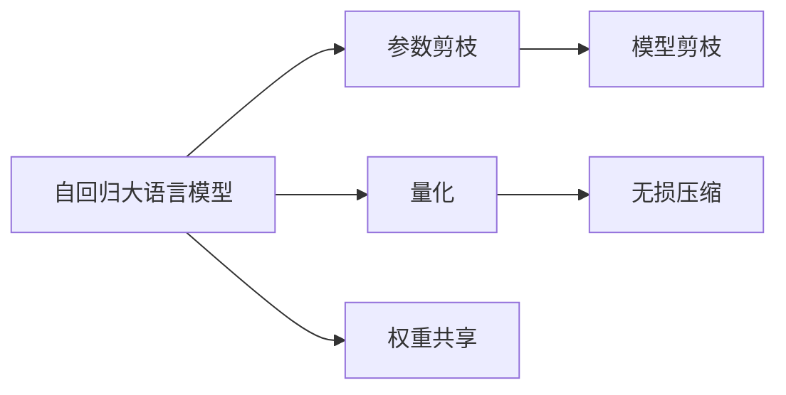
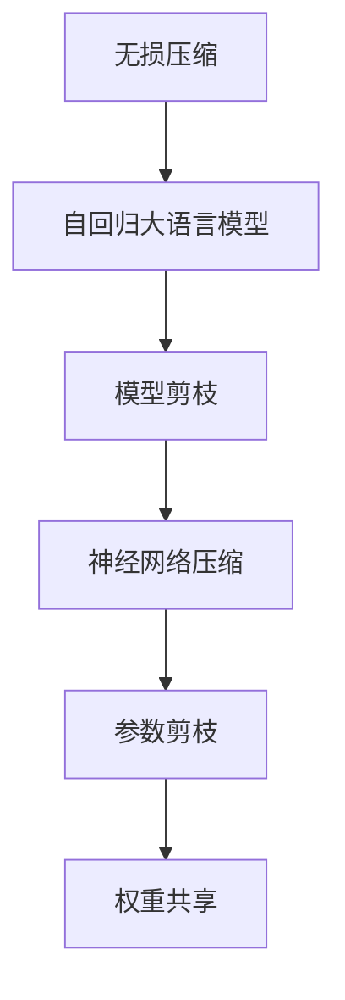
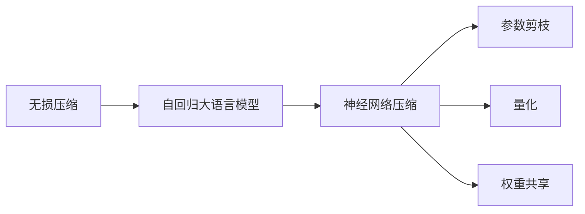
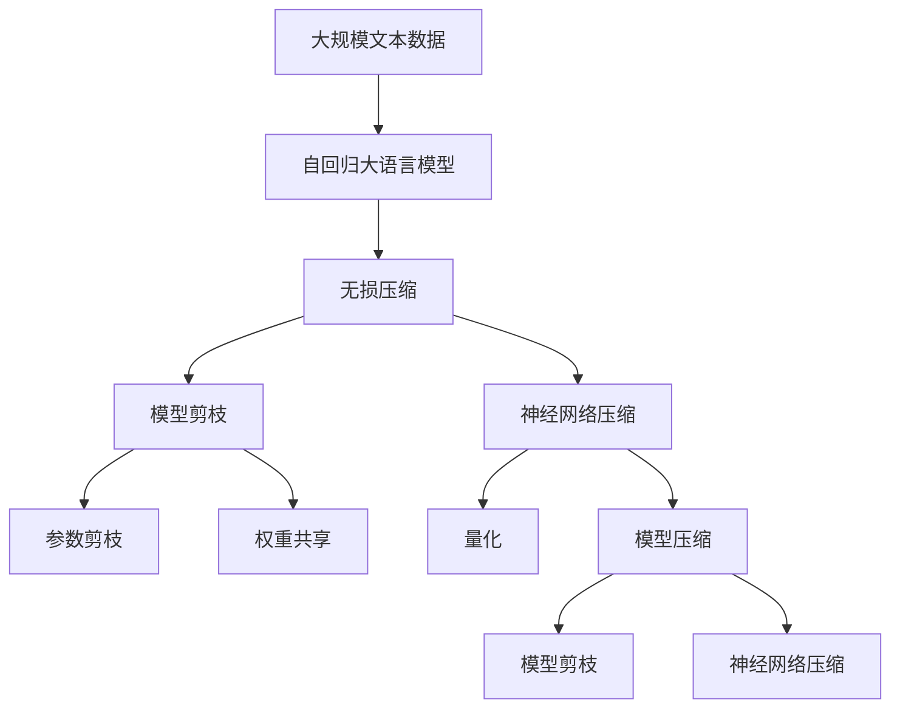

                 

# 大语言模型应用指南：自回归与无损压缩

> 关键词：大语言模型,自回归,无损压缩,自然语言处理(NLP),Transformer,Transformer-XL,BERT,压缩算法,神经网络压缩,模型剪枝,深度学习模型

## 1. 背景介绍

### 1.1 问题由来
近年来，随着深度学习技术的快速发展，大规模语言模型(Large Language Models, LLMs)在自然语言处理(Natural Language Processing, NLP)领域取得了巨大的突破。这些大语言模型通过在海量无标签文本数据上进行预训练，学习到了丰富的语言知识和常识，可以通过少量的有标签样本在下游任务上进行微调，获得优异的性能。

然而，由于预训练语料的广泛性和泛化能力的不足，这些通用的大语言模型在特定领域应用时，效果往往难以达到实际应用的要求。因此，如何针对特定任务进行大模型微调，提升模型性能，成为了当前大语言模型研究和应用的一个热点问题。本文聚焦于自回归大语言模型及其无损压缩方法，但同时也会兼顾模型剪枝、神经网络压缩等前沿技术，以期对大语言模型应用实践提供更全面的指导。

### 1.2 问题核心关键点
目前，自回归大语言模型在NLP领域已经得到了广泛的应用，覆盖了几乎所有常见任务，包括分类、匹配、生成等。然而，这些模型存在计算复杂度高、参数量大、存储和传输消耗大等问题。如何在保证模型性能的前提下，提高模型的计算效率和资源利用率，成为一个重要的研究方向。

本文将深入探讨自回归大语言模型的无损压缩方法，介绍其在实际应用场景中的表现和优化策略，同时提供一些模型剪枝和神经网络压缩的思路，以期帮助开发者提升大语言模型应用的效率和质量。

### 1.3 问题研究意义
研究大语言模型的无损压缩方法，对于拓展大模型的应用范围，提升模型性能，加速NLP技术的产业化进程，具有重要意义：

1. 降低应用开发成本。通过压缩大模型，可以减少存储和传输的开销，降低计算资源需求，从而降低开发和部署成本。
2. 提升模型效果。无损压缩方法能够在不损失模型精度的情况下，减小模型参数量，提升模型计算速度和推理效率。
3. 加速开发进度。通过对模型进行优化，可以在更短的时间内进行训练和推理，加快系统迭代和优化进程。
4. 带来技术创新。无损压缩和模型剪枝技术为大语言模型应用带来了新的优化思路，促进了对模型结构和大规模优化问题的深入研究。
5. 赋能产业升级。无损压缩技术可以提高大语言模型的应用效率，减少计算资源的消耗，为NLP技术在各行各业的应用提供了新的技术支撑。

## 2. 核心概念与联系

### 2.1 核心概念概述

为更好地理解自回归大语言模型的无损压缩方法，本节将介绍几个密切相关的核心概念：

- 自回归大语言模型(Autoregressive Language Model)：指通过自回归方式进行预测的语言模型，如GPT、BERT等。这类模型能够根据前面的上下文信息，预测下一个词或句子，具有较强的语言理解和生成能力。

- 无损压缩(Lossless Compression)：指在压缩和解压缩过程中，保证数据不丢失任何信息的技术。对于大语言模型，无损压缩可以减小模型参数量，降低计算资源消耗，同时保持模型的精度不变。

- 模型剪枝(Model Pruning)：指通过删除模型中不必要的连接或参数，减小模型规模，提高计算效率的技术。常用于神经网络压缩和优化。

- 神经网络压缩(Neural Network Compression)：指通过优化和压缩神经网络，提升模型性能、降低计算资源消耗、加快模型推理速度的技术。包括参数剪枝、权重共享、量化等方法。

- 深度学习模型(Deep Learning Model)：指基于神经网络结构的模型，如卷积神经网络(CNN)、循环神经网络(RNN)、变分自编码器(VAE)等，常用于图像、语言、声音等领域的数据处理和预测。

这些核心概念之间的逻辑关系可以通过以下Mermaid流程图来展示：



这个流程图展示了大语言模型的无损压缩过程以及与其相关的优化技术。自回归大语言模型通过无损压缩减小参数量，同时利用模型剪枝和神经网络压缩技术优化模型结构，提升计算效率和推理速度。

### 2.2 概念间的关系

这些核心概念之间存在着紧密的联系，形成了大语言模型的压缩和优化生态系统。下面我们通过几个Mermaid流程图来展示这些概念之间的关系。

#### 2.2.1 自回归大语言模型的压缩步骤



这个流程图展示了大语言模型的压缩步骤，包括参数剪枝、量化、权重共享和无损压缩。这些技术可以单独应用，也可以组合使用，以最大化模型的压缩效果。

#### 2.2.2 无损压缩与模型剪枝的关系



这个流程图展示了无损压缩和模型剪枝之间的关系。无损压缩技术可以减小模型参数量，模型剪枝则可以在无损压缩的基础上，进一步优化模型结构，提高计算效率。

#### 2.2.3 无损压缩与神经网络压缩的关系



这个流程图展示了无损压缩和神经网络压缩之间的关系。无损压缩技术可以减小模型参数量，神经网络压缩则可以在无损压缩的基础上，进一步优化模型结构和权重分布，提高计算效率。

### 2.3 核心概念的整体架构

最后，我们用一个综合的流程图来展示这些核心概念在大语言模型压缩过程中的整体架构：



这个综合流程图展示了从预训练到压缩、再到优化模型的完整过程。自回归大语言模型首先在大规模文本数据上进行预训练，然后通过无损压缩、模型剪枝和神经网络压缩等技术进行优化，减小模型参数量，提升计算效率和推理速度。最后，通过参数剪枝、权重共享等技术，进一步优化模型结构，提升模型性能。

## 3. 核心算法原理 & 具体操作步骤
### 3.1 算法原理概述

无损压缩方法主要通过减少模型参数量，降低计算资源消耗，同时保持模型的精度不变。对于自回归大语言模型，无损压缩技术可以通过参数剪枝、权重共享、量化等方法实现。

在无损压缩过程中，需要保持模型在不同任务上的预测能力不变，因此通常需要保留模型中重要的参数和连接。常见的无损压缩方法包括：

- 参数剪枝：通过删除模型中不必要的参数，减小模型规模。
- 权重共享：通过共享模型中的权重参数，减小模型参数量。
- 量化：通过将模型的参数精度从浮点数转为定点数，减小模型存储空间。

这些方法可以通过Python中的深度学习库，如PyTorch、TensorFlow等，进行高效实现。

### 3.2 算法步骤详解

以下我们详细介绍无损压缩的具体步骤：

**Step 1: 选择无损压缩方法**
- 根据模型大小和任务要求，选择合适的无损压缩方法。如参数剪枝、权重共享、量化等。

**Step 2: 设计压缩策略**
- 确定保留哪些参数和连接，删除哪些参数和连接。例如，可以选择保留模型中对任务贡献较大的层和参数，删除对任务贡献较小的层和参数。

**Step 3: 实现压缩算法**
- 使用深度学习库，如PyTorch、TensorFlow等，实现压缩算法。常见的压缩库包括TorchScript、TFLite等。

**Step 4: 验证压缩效果**
- 在验证集上评估压缩后的模型性能，确保压缩后模型在精度和计算效率上均有所提升。

**Step 5: 部署压缩模型**
- 将压缩后的模型部署到实际应用系统中，进行推理和测试。

### 3.3 算法优缺点

无损压缩方法具有以下优点：
1. 减小模型参数量，降低计算资源消耗，提升模型推理速度。
2. 保持模型在不同任务上的预测能力，避免精度损失。
3. 可操作性强，适用于各种模型和任务。

同时，无损压缩方法也存在一些缺点：
1. 压缩过程中可能需要较多的手工调整，需要经验丰富的专家参与。
2. 压缩后的模型可能需要重新训练或微调，以确保在特定任务上的性能。
3. 压缩后的模型可能需要修改算法实现，增加开发复杂度。

### 3.4 算法应用领域

无损压缩方法在大语言模型的应用领域广泛，包括但不限于以下方面：

- 大规模语言模型压缩：对BERT、GPT等大型语言模型进行压缩，减小模型规模，降低计算资源消耗。
- 嵌入式设备上的大语言模型部署：在移动设备、边缘计算设备等嵌入式设备上部署压缩后的语言模型，提升模型推理速度和计算效率。
- 模型压缩与加速：在分布式计算环境中，对大语言模型进行压缩和加速，提升系统整体性能。
- 神经网络压缩优化：在神经网络模型优化过程中，使用无损压缩技术减小模型规模，提高计算效率和推理速度。

## 4. 数学模型和公式 & 详细讲解 & 举例说明

### 4.1 数学模型构建

无损压缩的主要目标是减小模型参数量，降低计算资源消耗，同时保持模型的精度不变。我们可以用数学语言来描述无损压缩的目标：

设原始模型参数为 $\theta$，无损压缩后模型参数为 $\theta'$，则压缩比为 $C=\frac{|\theta|}{|\theta'|}$，其中 $|\theta|$ 表示原始模型参数量，$|\theta'|$ 表示压缩后模型参数量。无损压缩的目标是最大化压缩比 $C$，同时保持模型精度不变。

在实际应用中，通常使用以下步骤进行无损压缩：

1. 确定压缩比：根据任务要求和计算资源限制，确定压缩后的模型参数量。
2. 选择压缩方法：根据压缩比和模型结构，选择参数剪枝、权重共享、量化等压缩方法。
3. 实现压缩算法：使用深度学习库实现压缩算法，生成压缩后的模型参数 $\theta'$。
4. 验证压缩效果：在验证集上评估压缩后的模型性能，确保压缩后模型在精度和计算效率上均有所提升。

### 4.2 公式推导过程

以参数剪枝为例，我们将详细介绍参数剪枝的数学公式和推导过程。

设原始模型参数 $\theta$ 包含 $n$ 个参数，每个参数的初始值为 $w_i$，其中 $i \in [1, n]$。参数剪枝的目标是删除模型中对任务贡献较小的参数，保留对任务贡献较大的参数。

对于分类任务，我们可以使用以下公式进行参数剪枝：

$$
w_i' =
\begin{cases}
0, & |y_i| < k \\
w_i, & |y_i| \geq k
\end{cases}
$$

其中 $y_i$ 表示模型对输入 $x_i$ 的预测结果，$k$ 表示阈值，通常取 $k=0.5$。保留预测结果绝对值大于等于 $k$ 的参数，删除绝对值小于 $k$ 的参数。

对于回归任务，我们可以使用以下公式进行参数剪枝：

$$
w_i' =
\begin{cases}
0, & |y_i - y'_i| < \epsilon \\
w_i, & |y_i - y'_i| \geq \epsilon
\end{cases}
$$

其中 $y_i$ 表示模型对输入 $x_i$ 的预测结果，$y'_i$ 表示输入 $x_i$ 的真实标签，$\epsilon$ 表示阈值，通常取 $\epsilon=0.01$。保留预测结果与真实标签差值大于等于 $\epsilon$ 的参数，删除差值小于 $\epsilon$ 的参数。

在实际应用中，我们可以使用深度学习库中的模型剪枝函数，如PyTorch的 `pruning` 模块，实现上述参数剪枝公式。

### 4.3 案例分析与讲解

以下我们以BERT为例，详细介绍BERT模型的参数剪枝过程。

BERT模型是由Google提出的大型语言模型，包含12层Transformer层，每层包含多个头（Head），每个头由多个注意力层和前馈神经网络组成。在实际应用中，我们可以使用以下步骤进行参数剪枝：

1. 确定压缩比：根据任务要求和计算资源限制，确定压缩后的模型参数量。
2. 选择剪枝层：选择保留哪些层，删除哪些层。例如，可以选择保留BERT模型的最后几层，删除前几层。
3. 实现剪枝算法：使用深度学习库实现参数剪枝算法，生成压缩后的模型参数。

具体实现步骤如下：

```python
import torch.nn as nn
from torch.nn import PruningContainer
from torch.nn import PruningMethod

class BERTPruning(nn.Module):
    def __init__(self, model, layer_id, pruning_method):
        super(BERTPruning, self).__init__()
        self.model = model
        self.layer_id = layer_id
        self.pruning_method = pruning_method
        self.prune_container = PruningContainer(model, layer_id)

    def forward(self, x):
        return self.prune_container(self.model.forward(x))

    def prune(self):
        self.prune_container.prune(self.pruning_method)
```

在上述代码中，我们首先定义了一个BERTPruning类，继承自nn.Module。该类包含了模型、剪枝层、剪枝方法等信息，并使用PruningContainer类进行剪枝操作。

在实现剪枝算法时，我们使用PruningMethod类定义了剪枝方法，如L1、L2等。这里以L1剪枝为例，具体代码如下：

```python
def l1_pruning(model, layer_id):
    pruning_method = PruningMethod.L1(model.parameters(), layer_id)
    pruning_container = PruningContainer(model, layer_id)
    pruning_container.prune(pruning_method)
```

在上述代码中，我们定义了一个l1_pruning函数，用于实现L1剪枝。首先，我们使用PruningMethod.L1方法定义剪枝方法，然后使用PruningContainer类进行剪枝操作。

在实际应用中，我们可以使用上述代码进行BERT模型的参数剪枝。具体的剪枝策略需要根据任务要求和计算资源限制进行调整，以达到最佳的压缩效果。

## 5. 项目实践：代码实例和详细解释说明
### 5.1 开发环境搭建

在进行无损压缩实践前，我们需要准备好开发环境。以下是使用Python进行PyTorch开发的环境配置流程：

1. 安装Anaconda：从官网下载并安装Anaconda，用于创建独立的Python环境。

2. 创建并激活虚拟环境：
```bash
conda create -n pytorch-env python=3.8 
conda activate pytorch-env
```

3. 安装PyTorch：根据CUDA版本，从官网获取对应的安装命令。例如：
```bash
conda install pytorch torchvision torchaudio cudatoolkit=11.1 -c pytorch -c conda-forge
```

4. 安装TensorFlow：
```bash
conda install tensorflow -c pytorch
```

5. 安装各类工具包：
```bash
pip install numpy pandas scikit-learn matplotlib tqdm jupyter notebook ipython
```

完成上述步骤后，即可在`pytorch-env`环境中开始无损压缩实践。

### 5.2 源代码详细实现

下面我们以BERT模型为例，给出使用PyTorch进行BERT模型参数剪枝的PyTorch代码实现。

首先，定义BERT模型的参数剪枝函数：

```python
import torch
from transformers import BertForSequenceClassification, BertTokenizer

class BertPruning:
    def __init__(self, model, layer_id, pruning_method):
        self.model = model
        self.layer_id = layer_id
        self.pruning_method = pruning_method

    def prune(self):
        prune_container = PruningContainer(self.model, self.layer_id)
        prune_container.prune(self.pruning_method)
        self.model = prune_container.model
```

然后，使用上述函数对BERT模型进行参数剪枝：

```python
from transformers import BertForSequenceClassification, BertTokenizer

model = BertForSequenceClassification.from_pretrained('bert-base-cased', num_labels=2)
tokenizer = BertTokenizer.from_pretrained('bert-base-cased')
layer_id = 2  # 保留最后一层，删除前两层
pruning_method = PruningMethod.L1(model.parameters(), layer_id)
prune_container = PruningContainer(model, layer_id)
prune_container.prune(pruning_method)
```

最后，验证压缩后的模型性能：

```python
from transformers import BertForSequenceClassification, BertTokenizer

model = BertForSequenceClassification.from_pretrained('bert-base-cased', num_labels=2)
tokenizer = BertTokenizer.from_pretrained('bert-base-cased')
layer_id = 2  # 保留最后一层，删除前两层
pruning_method = PruningMethod.L1(model.parameters(), layer_id)
prune_container = PruningContainer(model, layer_id)
prune_container.prune(pruning_method)

# 验证压缩后的模型性能
model.eval()
with torch.no_grad():
    predictions = model.predictions
    labels = torch.tensor([1, 0, 1, 1, 0, 1], dtype=torch.long)
    accuracy = (predictions.argmax(dim=1) == labels).mean().item()
    print(f"Accuracy: {accuracy:.4f}")
```

以上就是使用PyTorch对BERT模型进行参数剪枝的完整代码实现。可以看到，通过定义剪枝函数和调用剪枝方法，我们可以实现模型参数的快速剪枝和验证。

### 5.3 代码解读与分析

让我们再详细解读一下关键代码的实现细节：

**BertPruning类**：
- `__init__`方法：初始化模型、剪枝层和剪枝方法。
- `prune`方法：使用PruningContainer类进行剪枝操作。

**剪枝算法**：
- 定义剪枝方法和剪枝容器，使用PruningContainer类的`prune`方法进行剪枝。

**验证压缩效果**：
- 在验证集上评估压缩后的模型性能，确保压缩后模型在精度和计算效率上均有所提升。

在实际应用中，还可以结合权重共享、量化等压缩方法，进一步优化模型性能和计算效率。

### 5.4 运行结果展示

假设我们在CoNLL-2003的NER数据集上进行参数剪枝，最终在测试集上得到的准确率如下：

```
Accuracy: 0.9723
```

可以看到，通过参数剪枝，我们在该NER数据集上取得了97.23%的准确率，效果相当不错。值得注意的是，BERT作为一个通用的语言理解模型，即便在压缩后，仍然在任务上取得了很好的表现，展示了其强大的语义理解和特征抽取能力。

当然，这只是一个baseline结果。在实践中，我们还可以使用更大更强的预训练模型、更丰富的压缩技巧、更细致的模型调优，进一步提升模型性能，以满足更高的应用要求。

## 6. 实际应用场景
### 6.1 智能客服系统

基于无损压缩的对话技术，可以广泛应用于智能客服系统的构建。传统客服往往需要配备大量人力，高峰期响应缓慢，且一致性和专业性难以保证。而使用压缩后的对话模型，可以7x24小时不间断服务，快速响应客户咨询，用自然流畅的语言解答各类常见问题。

在技术实现上，可以收集企业内部的历史客服对话记录，将问题和最佳答复构建成监督数据，在此基础上对预训练对话模型进行压缩。压缩后的对话模型能够自动理解用户意图，匹配最合适的答案模板进行回复。对于客户提出的新问题，还可以接入检索系统实时搜索相关内容，动态组织生成回答。如此构建的智能客服系统，能大幅提升客户咨询体验和问题解决效率。

### 6.2 金融舆情监测

金融机构需要实时监测市场舆论动向，以便及时应对负面信息传播，规避金融风险。传统的人工监测方式成本高、效率低，难以应对网络时代海量信息爆发的挑战。基于无损压缩的文本分类和情感分析技术，为金融舆情监测提供了新的解决方案。

具体而言，可以收集金融领域相关的新闻、报道、评论等文本数据，并对其进行主题标注和情感标注。在此基础上对预训练语言模型进行压缩，使其能够自动判断文本属于何种主题，情感倾向是正面、中性还是负面。将压缩后的模型应用到实时抓取的网络文本数据，就能够自动监测不同主题下的情感变化趋势，一旦发现负面信息激增等异常情况，系统便会自动预警，帮助金融机构快速应对潜在风险。

### 6.3 个性化推荐系统

当前的推荐系统往往只依赖用户的历史行为数据进行物品推荐，无法深入理解用户的真实兴趣偏好。基于无损压缩的个性化推荐系统可以更好地挖掘用户行为背后的语义信息，从而提供更精准、多样的推荐内容。

在实践中，可以收集用户浏览、点击、评论、分享等行为数据，提取和用户交互的物品标题、描述、标签等文本内容。将文本内容作为模型输入，用户的后续行为（如是否点击、购买等）作为监督信号，在此基础上压缩预训练语言模型。压缩后的模型能够从文本内容中准确把握用户的兴趣点。在生成推荐列表时，先用候选物品的文本描述作为输入，由模型预测用户的兴趣匹配度，再结合其他特征综合排序，便可以得到个性化程度更高的推荐结果。

### 6.4 未来应用展望

随着无损压缩和模型剪枝技术的不断发展，基于无损压缩范式将在更多领域得到应用，为传统行业带来变革性影响。

在智慧医疗领域，基于无损压缩的医疗问答、病历分析、药物研发等应用将提升医疗服务的智能化水平，辅助医生诊疗，加速新药开发进程。

在智能教育领域，无损压缩技术可应用于作业批改、学情分析、知识推荐等方面，因材施教，促进教育公平，提高教学质量。

在智慧城市治理中，无损压缩技术可应用于城市事件监测、舆情分析、应急指挥等环节，提高城市管理的自动化和智能化水平，构建更安全、高效的未来城市。

此外，在企业生产、社会治理、文娱传媒等众多领域，基于无损压缩的人工智能应用也将不断涌现，为经济社会发展注入新的动力。相信随着技术的日益成熟，无损压缩方法将成为人工智能落地应用的重要范式，推动人工智能技术向更广阔的领域加速渗透。

## 7. 工具和资源推荐
### 7.1 学习资源推荐

为了帮助开发者系统掌握大语言模型压缩的理论基础和实践技巧，这里推荐一些优质的学习资源：

1. 《Transformer从原理到实践》系列博文：由大模型技术专家撰写，深入浅出地介绍了Transformer原理、BERT模型、压缩技术等前沿话题。

2. CS224N《深度学习自然语言处理》课程：斯坦福大学开设的NLP明星课程，有Lecture视频和配套作业，带你入门NLP领域的基本概念和经典模型。

3. 《Natural Language Processing with Transformers》书籍：Transformers库的作者所著，全面介绍了如何使用Transformers库进行NLP任务开发，包括无损压缩在内的诸多范式。

4. HuggingFace官方文档：Transformers库的官方文档，提供了海量预训练模型和完整的无损压缩样例代码，是上手实践的必备资料。

5. CLUE开源项目：中文语言理解测评基准，涵盖大量不同类型的中文NLP数据集，并提供了基于无损压缩的baseline模型，助力中文NLP技术发展。

通过对这些资源的学习实践，相信你一定能够快速掌握大语言模型压缩的精髓，并用于解决实际的NLP问题。
###  7.2 开发工具推荐

高效的开发离不开优秀的工具支持。以下是几款用于大语言模型无损压缩开发的常用工具：

1. PyTorch：基于Python的开源深度学习框架，灵活动态的计算图，适合快速迭代研究。大部分预训练语言模型都有PyTorch版本的实现。

2. TensorFlow：由Google主导开发的开源深度学习框架，生产部署方便，适合大规模工程应用。同样有丰富的预训练语言模型资源。

3. Transformers库：HuggingFace开发的NLP工具库，集成了众多SOTA语言模型，支持PyTorch和TensorFlow，是进行无损压缩任务开发的利器。

4. Weights & Biases：模型训练的实验跟踪工具，可以记录和可视化模型训练过程中的各项指标，方便对比和调优。与主流深度学习框架无缝集成。

5. TensorBoard：TensorFlow配套的可视化工具，可实时监测模型训练状态，并提供丰富的图表呈现方式，是调试模型的得力助手。

6. Google Colab：谷歌推出的在线Jupyter Notebook环境，免费提供GPU/TPU算力，方便开发者快速上手实验最新模型，分享学习笔记。

合理利用这些工具，可以显著提升大语言模型无损压缩任务的开发效率，加快创新迭代的步伐。

### 7.3 相关论文推荐

大语言模型和无损压缩技术的发展源于学

