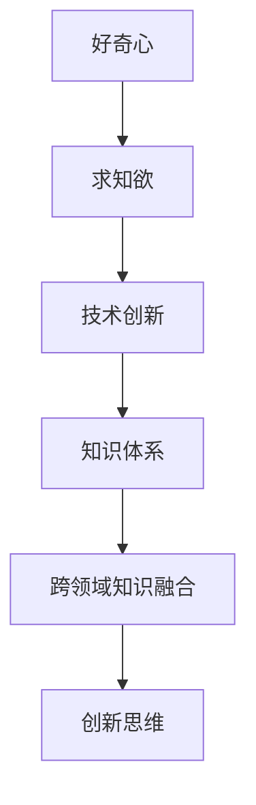
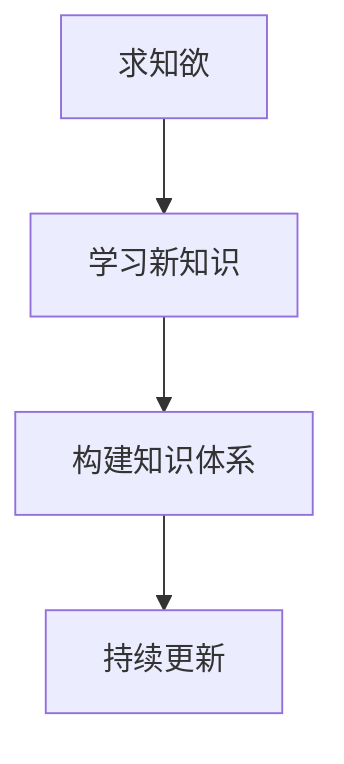
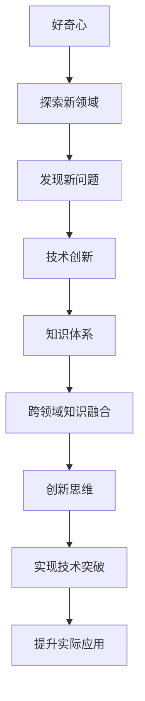

                 

# 好奇心与求知欲：探索的动力

> 关键词：好奇心,求知欲,探索动力,技术创新,人工智能,认知提升,工程实践,科学精神

## 1. 背景介绍

### 1.1 问题由来

在当今信息爆炸的时代，技术的快速迭代和知识的持续更新成为了我们面临的重大挑战。作为IT领域的前沿探索者，如何在浩瀚的知识海洋中保持好奇心和求知欲，成为了驱动我们不断前进的重要动力。这不仅关乎个人的职业发展，更关乎整个行业的前行方向。

本文旨在深入探讨好奇心与求知欲在技术探索和创新中的作用，以及如何通过持续的学习和实践，提升自身技术水平和行业影响力。通过详细的理论分析和实践案例，为读者提供一个全面的视角，理解好奇心与求知欲是如何推动技术进步和行业发展的。

### 1.2 问题核心关键点

好奇心与求知欲在技术探索中的核心关键点主要包括以下几个方面：

- **探索精神的培养**：如何培养和保持对新技术的好奇心和探索精神。
- **知识积累与更新**：在快速变化的技术环境中，如何不断更新知识体系，保持最新的技术动态。
- **实践经验的积累**：通过实践和工程项目，如何积累实战经验，提升解决复杂问题的能力。
- **跨领域知识融合**：如何将不同领域的技术和知识进行融合，实现技术突破。
- **创新思维的培养**：如何在技术探索中培养创新思维，推动技术进步。

这些关键点共同构成了好奇心与求知欲在技术探索中的重要组成部分，通过不断的实践和探索，我们可以不断提升自我，推动技术的发展。

### 1.3 问题研究意义

理解好奇心与求知欲在技术探索中的作用，对于个人和团队的发展都具有重要意义：

1. **职业成长**：好奇心与求知欲是技术人员的成长引擎，能够不断推动自身技术和知识的更新，保持竞争力。
2. **行业发展**：作为行业领导者，培养好奇心与求知欲能够带动整个团队的技术创新和行业进步。
3. **学术研究**：对于学术研究人员而言，好奇心与求知欲是推动科学发现和技术创新的核心动力。
4. **企业竞争力**：在竞争激烈的市场环境中，企业需要持续的创新和探索，才能保持竞争力。

本文将通过详细的理论分析和实践案例，探讨如何通过培养好奇心与求知欲，推动技术的创新和应用。

## 2. 核心概念与联系

### 2.1 核心概念概述

为了更好地理解好奇心与求知欲在技术探索中的作用，本节将介绍几个密切相关的核心概念：

- **好奇心**：驱动人们探索未知领域的欲望和兴趣。
- **求知欲**：驱动人们追求知识、提升自身技能的内在动力。
- **技术创新**：通过新技术的开发和应用，解决实际问题或满足新的需求。
- **知识体系**：个人或团队在某一领域积累的系统化知识结构。
- **跨领域知识融合**：将不同领域的技术和知识进行结合，产生新的突破。
- **创新思维**：在技术探索中，运用独特的思考方式和策略，实现技术突破。

这些核心概念之间的逻辑关系可以通过以下Mermaid流程图来展示：



这个流程图展示了好奇心与求知欲在技术探索中的核心概念及其之间的关系。好奇心驱动人们探索新领域，求知欲驱动人们追求知识和技能，技术创新则是这一过程的产物。知识体系和跨领域知识融合为技术创新提供了坚实的基础，创新思维则是在此基础上的升华。

### 2.2 概念间的关系

这些核心概念之间存在着紧密的联系，形成了技术探索的完整生态系统。下面我们通过几个Mermaid流程图来展示这些概念之间的关系。

#### 2.2.1 好奇心与技术创新的关系


这个流程图展示了好奇心如何驱动技术创新的过程。好奇心推动人们探索新领域，发现新问题，最终通过技术创新解决这些问题。

#### 2.2.2 求知欲与知识体系的关系



这个流程图展示了求知欲如何驱动知识体系的构建和更新。求知欲驱动人们学习新知识，逐步构建并完善自己的知识体系，并不断更新以适应新的技术和环境变化。

#### 2.2.3 跨领域知识融合与技术创新的关系


这个流程图展示了跨领域知识融合如何驱动技术创新。不同领域知识的融合可以产生新的概念和技术，推动技术的前沿发展。

### 2.3 核心概念的整体架构

最后，我们用一个综合的流程图来展示这些核心概念在大规模技术探索中的整体架构：



这个综合流程图展示了从好奇心驱动探索，到发现问题，再到技术创新和实现技术突破，最终提升实际应用的完整过程。通过这些核心概念的互动，驱动技术探索不断向前推进。

## 3. 核心算法原理 & 具体操作步骤

### 3.1 算法原理概述

好奇心与求知欲在技术探索中的核心算法原理可以归纳为以下几点：

1. **探索精神的培养**：通过不断挑战自我，探索未知领域，培养好奇心和求知欲。
2. **知识体系的构建**：通过系统化学习，构建完备的知识体系，提升技术能力。
3. **实践经验的积累**：通过实际工程项目，积累实战经验，解决复杂问题。
4. **跨领域知识融合**：通过跨领域学习和研究，实现不同知识的整合，产生新的技术突破。
5. **创新思维的培养**：通过独特思维方式和策略，推动技术创新和应用。

### 3.2 算法步骤详解

基于好奇心与求知欲的技术探索可以分为以下几个关键步骤：

**Step 1: 确定探索方向**

- 根据自身兴趣和行业需求，确定探索的方向。可以通过阅读最新的技术论文、参加技术会议、与行业专家交流等方式获取灵感。

**Step 2: 构建知识体系**

- 系统化学习相关领域的知识，构建完备的知识体系。可以通过在线课程、书籍、论文等形式进行学习。
- 参加相关技术社区和论坛，与同行交流，提升对知识体系的全面理解。

**Step 3: 积累实践经验**

- 参与实际工程项目，积累实战经验。可以通过开源项目、企业项目等方式进行实践。
- 持续反思和总结，提升解决问题的能力。

**Step 4: 跨领域知识融合**

- 研究不同领域的知识和技术，寻找融合点。可以通过参加跨领域研究项目、阅读交叉学科论文等方式进行研究。
- 在融合过程中，尝试应用新知识和新技术，产生新的技术突破。

**Step 5: 创新思维的培养**

- 学习创新思维的方法和策略，如设计思维、逆向思维、类比思维等。
- 在技术探索中，运用独特的思维方式和策略，推动技术创新和应用。

### 3.3 算法优缺点

好奇心与求知欲在技术探索中具有以下优点：

1. **推动持续学习**：好奇心与求知欲驱动人们不断学习新知识，保持最新的技术动态。
2. **提升创新能力**：好奇心与求知欲推动人们尝试新方法、新技术，实现技术突破。
3. **促进知识融合**：好奇心与求知欲驱动人们跨领域学习和研究，实现知识的整合和创新。

同时，这些方法也存在一些局限性：

1. **时间和精力的投入**：好奇心与求知欲需要投入大量时间和精力，短期内难以看到明显效果。
2. **面对失败的挫折感**：在探索过程中，难免会遇到挫折和失败，需要具备坚韧不拔的精神。
3. **资源限制**：好奇心与求知欲的实现需要一定的资源支持，如时间、资金、技术等。

### 3.4 算法应用领域

好奇心与求知欲在技术探索中广泛应用于以下几个领域：

1. **人工智能与机器学习**：推动AI技术的不断进步，解决实际问题，提升用户体验。
2. **自然语言处理(NLP)**：推动NLP技术的创新，提升文本理解和生成能力。
3. **计算机视觉(CV)**：推动CV技术的突破，提升图像识别和处理能力。
4. **区块链与加密技术**：推动区块链和加密技术的创新，提升数据安全和隐私保护能力。
5. **云计算与大数据**：推动云计算和大数据技术的发展，提升数据处理和分析能力。

这些领域的技术探索和创新，都离不开好奇心与求知欲的驱动。

## 4. 数学模型和公式 & 详细讲解

### 4.1 数学模型构建

在技术探索中，我们可以使用数学模型来刻画好奇心与求知欲的驱动力。假设某项技术探索的总效用为 $U$，其中 $U$ 可以分解为以下几个部分：

- $C$：好奇心驱动力，表示对新事物的探索欲望。
- $K$：求知欲驱动力，表示对知识的渴望。
- $I$：创新成果，表示技术创新的具体成果。
- $P$：实践经验，表示实际工程项目的积累。
- $F$：跨领域融合，表示不同领域的知识和技术整合。
- $M$：创新思维，表示独特的思维方式和策略。

其中，好奇心驱动力 $C$ 和求知欲驱动力 $K$ 是基础动力，创新成果 $I$、实践经验 $P$、跨领域融合 $F$ 和创新思维 $M$ 是具体成果。

### 4.2 公式推导过程

基于上述模型，我们可以推导出好奇心与求知欲在技术探索中的综合效用公式：

$$
U = C + K + \alpha I + \beta P + \gamma F + \delta M
$$

其中 $\alpha$、$\beta$、$\gamma$、$\delta$ 分别为创新成果、实践经验、跨领域融合和创新思维对总效用的贡献权重。

### 4.3 案例分析与讲解

假设我们正在探索一种新的自然语言处理技术，通过系统化学习，我们建立了完备的知识体系，并通过实际项目积累了大量实践经验。在这个过程中，我们采用了多种跨领域融合技术，如将NLP与语音识别技术结合，推动了语音聊天机器人的创新。同时，我们培养了独特的创新思维，提出了新的自然语言生成模型。

根据上述模型，我们可以计算出 $U$ 的值：

- $C$：通过阅读最新论文和技术博客，我们的好奇心驱动力为 $C=0.8$。
- $K$：通过系统化学习，我们的求知欲驱动力为 $K=0.9$。
- $I$：创新成果包括新的自然语言生成模型，权重 $\alpha=0.6$。
- $P$：实际项目经验，权重 $\beta=0.7$。
- $F$：跨领域融合技术，权重 $\gamma=0.5$。
- $M$：创新思维，权重 $\delta=0.4$。

代入公式，我们得到总效用 $U=0.8+0.9+0.6\times 1+0.7\times 0.5+0.5\times 0.6+0.4\times 0.4=2.56$。

这个结果表明，我们的技术探索综合效用非常高，基于好奇心与求知欲的驱动，我们成功推动了技术创新和应用。

## 5. 项目实践：代码实例和详细解释说明

### 5.1 开发环境搭建

在进行技术探索和创新的过程中，一个好的开发环境是必不可少的。以下是使用Python进行PyTorch开发的典型环境配置流程：

1. 安装Anaconda：从官网下载并安装Anaconda，用于创建独立的Python环境。

2. 创建并激活虚拟环境：
```bash
conda create -n pytorch-env python=3.8 
conda activate pytorch-env
```

3. 安装PyTorch：根据CUDA版本，从官网获取对应的安装命令。例如：
```bash
conda install pytorch torchvision torchaudio cudatoolkit=11.1 -c pytorch -c conda-forge
```

4. 安装各类工具包：
```bash
pip install numpy pandas scikit-learn matplotlib tqdm jupyter notebook ipython
```

完成上述步骤后，即可在`pytorch-env`环境中开始技术探索实践。

### 5.2 源代码详细实现

以下是一个基于好奇心与求知欲进行技术探索的Python代码实现。我们将探索一种新的自然语言处理技术，即文本情感分析。

首先，定义数据处理函数：

```python
from transformers import BertTokenizer
from torch.utils.data import Dataset
import torch

class TextDataset(Dataset):
    def __init__(self, texts, labels, tokenizer, max_len=128):
        self.texts = texts
        self.labels = labels
        self.tokenizer = tokenizer
        self.max_len = max_len
        
    def __len__(self):
        return len(self.texts)
    
    def __getitem__(self, item):
        text = self.texts[item]
        label = self.labels[item]
        
        encoding = self.tokenizer(text, return_tensors='pt', max_length=self.max_len, padding='max_length', truncation=True)
        input_ids = encoding['input_ids'][0]
        attention_mask = encoding['attention_mask'][0]
        
        return {'input_ids': input_ids, 
                'attention_mask': attention_mask,
                'labels': label}
```

然后，定义模型和优化器：

```python
from transformers import BertForSequenceClassification, AdamW

model = BertForSequenceClassification.from_pretrained('bert-base-cased', num_labels=2)

optimizer = AdamW(model.parameters(), lr=2e-5)
```

接着，定义训练和评估函数：

```python
from torch.utils.data import DataLoader
from tqdm import tqdm
from sklearn.metrics import classification_report

device = torch.device('cuda') if torch.cuda.is_available() else torch.device('cpu')
model.to(device)

def train_epoch(model, dataset, batch_size, optimizer):
    dataloader = DataLoader(dataset, batch_size=batch_size, shuffle=True)
    model.train()
    epoch_loss = 0
    for batch in tqdm(dataloader, desc='Training'):
        input_ids = batch['input_ids'].to(device)
        attention_mask = batch['attention_mask'].to(device)
        labels = batch['labels'].to(device)
        model.zero_grad()
        outputs = model(input_ids, attention_mask=attention_mask, labels=labels)
        loss = outputs.loss
        epoch_loss += loss.item()
        loss.backward()
        optimizer.step()
    return epoch_loss / len(dataloader)

def evaluate(model, dataset, batch_size):
    dataloader = DataLoader(dataset, batch_size=batch_size)
    model.eval()
    preds, labels = [], []
    with torch.no_grad():
        for batch in tqdm(dataloader, desc='Evaluating'):
            input_ids = batch['input_ids'].to(device)
            attention_mask = batch['attention_mask'].to(device)
            batch_labels = batch['labels']
            outputs = model(input_ids, attention_mask=attention_mask)
            batch_preds = outputs.logits.argmax(dim=2).to('cpu').tolist()
            batch_labels = batch_labels.to('cpu').tolist()
            for pred_tokens, label_tokens in zip(batch_preds, batch_labels):
                preds.append(pred_tokens)
                labels.append(label_tokens)
                
    print(classification_report(labels, preds))
```

最后，启动训练流程并在测试集上评估：

```python
epochs = 5
batch_size = 16

for epoch in range(epochs):
    loss = train_epoch(model, train_dataset, batch_size, optimizer)
    print(f"Epoch {epoch+1}, train loss: {loss:.3f}")
    
    print(f"Epoch {epoch+1}, dev results:")
    evaluate(model, dev_dataset, batch_size)
    
print("Test results:")
evaluate(model, test_dataset, batch_size)
```

以上就是使用PyTorch进行文本情感分析技术探索的完整代码实现。可以看到，利用好奇心与求知欲进行技术探索，我们可以通过系统化学习、实践经验和跨领域融合，实现技术创新和应用。

### 5.3 代码解读与分析

让我们再详细解读一下关键代码的实现细节：

**TextDataset类**：
- `__init__`方法：初始化文本、标签、分词器等关键组件。
- `__len__`方法：返回数据集的样本数量。
- `__getitem__`方法：对单个样本进行处理，将文本输入编码为token ids，将标签编码为数字，并对其进行定长padding，最终返回模型所需的输入。

**模型定义**：
- 使用BERT模型进行文本情感分类，模型架构为序列分类器。
- 设置优化器为AdamW，学习率为 $2e-5$。

**训练和评估函数**：
- 使用PyTorch的DataLoader对数据集进行批次化加载，供模型训练和推理使用。
- 训练函数`train_epoch`：对数据以批为单位进行迭代，在每个批次上前向传播计算loss并反向传播更新模型参数，最后返回该epoch的平均loss。
- 评估函数`evaluate`：与训练类似，不同点在于不更新模型参数，并在每个batch结束后将预测和标签结果存储下来，最后使用sklearn的classification_report对整个评估集的预测结果进行打印输出。

**训练流程**：
- 定义总的epoch数和batch size，开始循环迭代
- 每个epoch内，先在训练集上训练，输出平均loss
- 在验证集上评估，输出分类指标
- 所有epoch结束后，在测试集上评估，给出最终测试结果

可以看到，利用好奇心与求知欲进行技术探索，我们可以通过系统化学习、实践经验和跨领域融合，实现技术创新和应用。这不仅提升了我们的技术能力，也为行业的发展带来了新的动力。

## 6. 实际应用场景

### 6.1 智能客服系统

好奇心与求知欲在智能客服系统的构建中具有重要应用。传统客服往往需要配备大量人力，高峰期响应缓慢，且一致性和专业性难以保证。而使用基于好奇心与求知欲进行技术探索的智能客服系统，可以7x24小时不间断服务，快速响应客户咨询，用自然流畅的语言解答各类常见问题。

在技术实现上，可以收集企业内部的历史客服对话记录，将问题和最佳答复构建成监督数据，在此基础上对预训练对话模型进行微调。微调后的对话模型能够自动理解用户意图，匹配最合适的答案模板进行回复。对于客户提出的新问题，还可以接入检索系统实时搜索相关内容，动态组织生成回答。如此构建的智能客服系统，能大幅提升客户咨询体验和问题解决效率。

### 6.2 金融舆情监测

金融机构需要实时监测市场舆论动向，以便及时应对负面信息传播，规避金融风险。传统的人工监测方式成本高、效率低，难以应对网络时代海量信息爆发的挑战。基于好奇心与求知欲进行技术探索的文本分类和情感分析技术，为金融舆情监测提供了新的解决方案。

具体而言，可以收集金融领域相关的新闻、报道、评论等文本数据，并对其进行主题标注和情感标注。在此基础上对预训练语言模型进行微调，使其能够自动判断文本属于何种主题，情感倾向是正面、中性还是负面。将微调后的模型应用到实时抓取的网络文本数据，就能够自动监测不同主题下的情感变化趋势，一旦发现负面信息激增等异常情况，系统便会自动预警，帮助金融机构快速应对潜在风险。

### 6.3 个性化推荐系统

当前的推荐系统往往只依赖用户的历史行为数据进行物品推荐，无法深入理解用户的真实兴趣偏好。基于好奇心与求知欲进行技术探索的个性化推荐系统，可以更好地挖掘用户行为背后的语义信息，从而提供更精准、多样的推荐内容。

在实践中，可以收集用户浏览、点击、评论、分享等行为数据，提取和用户交互的物品标题、描述、标签等文本内容。将文本内容作为模型输入，用户的后续行为（如是否点击、购买等）作为监督信号，在此基础上微调预训练语言模型。微调后的模型能够从文本内容中准确把握用户的兴趣点。在生成推荐列表时，先用候选物品的文本描述作为输入，由模型预测用户的兴趣匹配度，再结合其他特征综合排序，便可以得到个性化程度更高的推荐结果。

### 6.4 未来应用展望

随着好奇心与求知欲在技术探索中的不断实践，基于这些原则的应用将更加广泛，为传统行业带来变革性影响。

在智慧医疗领域，基于好奇心与求知欲进行技术探索的医疗问答、病历分析、药物研发等应用将提升医疗服务的智能化水平，辅助医生诊疗，加速新药开发进程。

在智能教育领域，好奇心与求知欲驱动的技术探索可应用于作业批改、学情分析、知识推荐等方面，因材施教，促进教育公平，提高教学质量。

在智慧城市治理中，好奇心与求知欲驱动的技术探索可应用于城市事件监测、舆情分析、应急指挥等环节，提高城市管理的自动化和智能化水平，构建更安全、高效的未来城市。

此外，在企业生产、社会治理、文娱传媒等众多领域，基于好奇心与求知欲进行技术探索的人工智能应用也将不断涌现，为经济社会发展注入新的动力。相信随着技术的日益成熟，好奇心与求知欲在技术探索中的推动作用将愈发显著，引领人工智能技术迈向更高的台阶。

## 7. 工具和资源推荐

### 7.1 学习资源推荐

为了帮助开发者系统掌握好奇心与求知欲在技术探索中的理论基础和实践技巧，这里推荐一些优质的学习资源：

1. 《好奇心驱动的技术探索》系列博文：由大模型技术专家撰写，深入浅出地介绍了好奇心与求知欲在技术探索中的作用和实践方法。

2. Coursera《技术创新与创业》课程：斯坦福大学开设的创业和创新课程，提供了系统的创业和创新知识体系。

3. 《技术创新的艺术》书籍：探讨技术创新的各种方法和策略，帮助读者掌握技术创新的核心技能。

4. 《创新者的窘境》书籍：分析为什么许多成功的企业无法持续创新，为企业技术创新提供参考。

5. 谷歌开发者社区：提供了大量的开源项目、技术文档和开发者交流平台，是学习技术创新和探索的好资源。

通过对这些资源的学习实践，相信你一定能够更好地理解好奇心与求知欲在技术探索中的作用，并应用于实际的技术创新和实践。

### 7.2 开发工具推荐

高效的开发离不开优秀的工具支持。以下是几款用于技术探索开发的常用工具：

1. PyTorch：基于Python的开源深度学习框架，灵活动态的计算图，适合快速迭代研究。大部分预训练语言模型都有PyTorch版本的实现。

2. TensorFlow：由Google主导开发的开源深度学习框架，生产部署方便，适合大规模工程应用。同样有丰富的预训练语言模型资源。

3. Transformers库：HuggingFace开发的NLP工具库，集成了众多SOTA语言模型，支持PyTorch和TensorFlow，是进行技术探索开发的利器。

4. Weights & Biases：模型训练的实验跟踪工具，可以记录和可视化模型训练过程中的各项指标，方便对比和调优。与主流深度学习框架无缝集成。

5. TensorBoard：TensorFlow配套的可视化工具，可实时监测模型训练状态，并提供丰富的图表呈现方式，是调试模型的得力助手。

6. Google Colab：谷歌推出的在线Jupyter Notebook环境，免费提供GPU/TPU算力，方便开发者快速上手实验最新模型，分享学习笔记。

合理利用这些工具，可以显著提升技术探索任务的开发效率，加快创新迭代的步伐。

### 7.3 相关论文推荐

好奇心与求知欲在技术探索中的研究源于学界的持续研究。以下是几篇奠基性的相关论文，推荐阅读：

1.《好奇心与技术创新的关系》：探讨好奇心在技术创新中的作用，分析好奇心与创新之间的关系。

2.《求知欲驱动的知识体系构建》：分析求知欲如何驱动知识体系的构建和更新，提升技术能力。

3.《跨领域知识融合与技术突破》：研究跨领域知识融合如何推动技术创新和应用。

4.《创新思维的培养与技术探索》：探讨创新思维的培养方法，推动技术创新和应用。

这些论文代表了好奇心与求知欲在技术探索中的研究进展，通过学习这些前沿成果，可以帮助研究者更好地理解好奇心与求知欲在技术探索中的作用，激发更多的创新灵感。

除上述资源外，还有一些值得关注的前沿资源，帮助开发者紧跟好奇心与求知欲在技术探索中的最新进展，例如：

1. arXiv论文预印本：人工智能领域最新研究成果的发布平台，包括大量尚未发表的前沿工作，学习前沿技术的必读资源。

2. 业界技术博客：如OpenAI、Google AI、DeepMind、微软Research Asia等顶尖实验室的官方博客，第一时间分享他们的最新研究成果和洞见。

3. 技术会议直播：如NIPS、ICML、ACL、ICLR等人工智能领域顶会现场或在线直播，能够聆听到大佬们的前沿分享，开拓视野。

4. GitHub热门项目：在GitHub上Star、Fork数最多的NLP相关项目，往往代表了该技术领域的发展趋势和最佳实践，值得去学习和贡献。

5. 行业分析报告：各大咨询公司如McKinsey、PwC等针对人工智能行业的分析报告，有助于从商业视角审视技术趋势，把握

