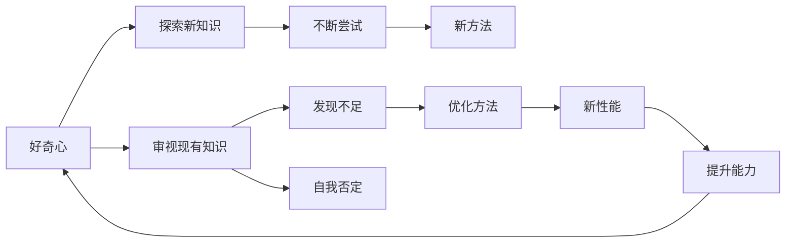

                 

## 1. 背景介绍

### 1.1 问题由来
好奇心是人类与生俱来的欲望之一，也是推动人类不断探索未知领域的重要动力。在现代科技日新月异的时代，好奇心更是科技创新的核心驱动力之一。作为人工智能领域的专家，我们深知，正是由于对未知领域的无限好奇与探索，才推动了人工智能技术的不断进步与突破。

### 1.2 问题核心关键点
好奇心与探索是人类发展的重要动力，而自我否定则是不断进步的关键因素。本文旨在探讨好奇心与自我否定的内在联系，以及其在人工智能领域的应用与影响。具体而言，本文将从以下方面展开讨论：

- 好奇心的本质与驱动机制
- 好奇心与人工智能创新之间的关系
- 自我否定的概念与重要性
- 好奇心与自我否定在人工智能发展中的作用

## 2. 核心概念与联系

### 2.1 核心概念概述

好奇心与自我否定的概念并非孤立存在，而是相辅相成，共同驱动人工智能技术的不断进步。以下将对这两个概念进行详细解释：

#### 2.1.1 好奇心
好奇心是人类对未知世界强烈兴趣的一种表现，是人类不断探索、学习和进步的重要推动力。在人工智能领域，好奇心促使研究人员不断寻找新问题、新方法，推动技术创新与突破。

#### 2.1.2 自我否定
自我否定是指个体不断审视自己的认知与信念，识别错误与不足，并主动改变与进步的过程。在人工智能领域，自我否定表现为持续优化算法、提升模型性能，并不断寻找新方法解决已有问题。

### 2.2 概念间的关系

好奇心与自我否定之间的联系主要体现在以下几个方面：

1. **驱动探索**：好奇心驱动人们探索新知识、新领域，而自我否定则促使人们不断优化已有知识与技术，确保其适应性与发展性。
2. **促进创新**：好奇心促使人们打破常规思维，尝试新方法；自我否定则促使人们审视现有方法，找到更优解决方案。
3. **螺旋上升**：好奇心与自我否定共同作用，使得技术不断进步、知识不断更新，推动螺旋式上升的发展路径。

### 2.3 核心概念的整体架构

为了更好地理解好奇心与自我否定的作用机制，以下使用Mermaid流程图展示其相互作用与整体架构：



这个流程图展示了好奇心与自我否定的相互作用过程：

1. 好奇心驱动探索，促使人们不断尝试新方法。
2. 通过审视现有知识，发现其不足与限制，进而推动自我否定。
3. 自我否定促使优化方法，提升能力，并通过新的知识推动好奇心。

### 2.4 核心概念的逻辑关系

好奇心与自我否定在人工智能发展中具有重要的逻辑关系，以下进一步阐述：

1. **好奇心推动探索**：好奇心促使人们不断寻找新问题、新方法，推动技术创新与突破。
2. **自我否定推动优化**：自我否定促使人们审视现有算法与模型，发现其不足与限制，进而推动优化。
3. **螺旋上升推动进步**：好奇心与自我否定共同作用，推动技术不断进步、知识不断更新，形成螺旋上升的发展路径。

## 3. 核心算法原理 & 具体操作步骤

### 3.1 算法原理概述

好奇心与自我否定的驱动机制可以类比为优化算法中的探索与优化过程。在优化算法中，探索阶段通过随机搜索寻找新的可行解，而优化阶段通过迭代调整找到最优解。这一过程与好奇心驱动探索、自我否定推动优化的机制具有相似性。

### 3.2 算法步骤详解

#### 3.2.1 探索阶段
探索阶段的主要目标是寻找新的可行解。在人工智能领域，这一过程可以通过以下步骤实现：

1. **问题定义**：明确需要解决的问题，如图像识别、语音识别、自然语言处理等。
2. **数据准备**：收集与问题相关的数据集，并进行预处理、标注等。
3. **模型设计**：选择合适的模型架构，如卷积神经网络、循环神经网络、Transformer等。
4. **参数初始化**：对模型参数进行初始化，通常采用随机初始化或预训练初始化。

#### 3.2.2 优化阶段
优化阶段的主要目标是提高模型的性能，通过不断调整参数找到最优解。在人工智能领域，这一过程可以通过以下步骤实现：

1. **损失函数定义**：选择合适的损失函数，如交叉熵损失、均方误差损失等。
2. **梯度计算**：通过反向传播计算损失函数对参数的梯度。
3. **参数更新**：使用梯度下降等优化算法更新模型参数，迭代寻找最优解。
4. **性能评估**：在验证集上评估模型性能，通过指标（如准确率、召回率、F1分数等）判断模型的优化效果。

### 3.3 算法优缺点

#### 3.3.1 优点
1. **高效性**：通过随机搜索与迭代优化，可以在较短时间内找到较为优化的解。
2. **灵活性**：可以适应不同的问题与数据集，灵活性强。
3. **可解释性**：通过迭代优化，每一步的变化具有明确的解释，便于分析与调整。

#### 3.3.2 缺点
1. **局部最优**：优化算法可能陷入局部最优，难以找到全局最优解。
2. **计算复杂度高**：优化过程通常需要大量的计算资源，对于大规模问题可能存在计算瓶颈。
3. **过度拟合**：在优化阶段，模型容易过度拟合训练数据，导致泛化能力下降。

### 3.4 算法应用领域

好奇心与自我否定的驱动机制在人工智能领域具有广泛的应用。以下列举几个典型应用场景：

#### 3.4.1 图像识别
图像识别任务中，好奇心的驱动使研究者不断探索新的网络结构、优化方法与数据集，提升模型的识别精度与泛化能力。通过自我否定，不断优化模型参数，提高模型的性能与稳定性。

#### 3.4.2 自然语言处理
自然语言处理领域，好奇心的驱动促使研究者不断探索新的语言模型、预训练方法与下游任务，推动技术创新与突破。通过自我否定，不断优化模型架构与参数，提升模型的理解与生成能力。

#### 3.4.3 机器学习
机器学习领域，好奇心的驱动使研究者不断尝试新的算法与模型，提升模型的预测与分类能力。通过自我否定，不断优化算法参数，提高模型的泛化能力与稳定性。

## 4. 数学模型和公式 & 详细讲解 & 举例说明

### 4.1 数学模型构建

在人工智能领域，好奇心与自我否定的驱动机制可以类比为优化算法中的探索与优化过程。以下以梯度下降算法为例，介绍其数学模型构建与计算过程。

#### 4.1.1 损失函数
损失函数 $L$ 用于衡量模型预测与真实标签之间的差异，通常为交叉熵损失函数：

$$
L(\theta) = -\frac{1}{N} \sum_{i=1}^{N} \sum_{j=1}^{C} y_{ij} \log(p_{ij})
$$

其中 $y_{ij}$ 表示样本 $i$ 在类别 $j$ 上的真实标签，$p_{ij}$ 表示模型对样本 $i$ 在类别 $j$ 上的预测概率。

#### 4.1.2 梯度计算
梯度下降算法通过反向传播计算损失函数对模型参数的梯度，并根据梯度方向调整参数，实现优化：

$$
\theta_{t+1} = \theta_{t} - \eta \nabla_{\theta}L(\theta_t)
$$

其中 $\eta$ 为学习率，$\nabla_{\theta}L(\theta_t)$ 为损失函数对模型参数的梯度。

### 4.2 公式推导过程

以下是梯度下降算法的推导过程：

1. **链式法则**：使用链式法则将损失函数对参数的梯度进行分解。
2. **反向传播**：通过反向传播算法计算梯度，并更新模型参数。
3. **参数更新**：根据梯度下降公式更新模型参数。

### 4.3 案例分析与讲解

以卷积神经网络 (CNN) 在图像识别任务中的应用为例，进行具体分析：

1. **网络结构**：选择卷积神经网络作为基础模型，包括卷积层、池化层、全连接层等。
2. **损失函数**：选择交叉熵损失函数作为损失函数。
3. **梯度计算**：使用反向传播算法计算梯度，并更新模型参数。
4. **性能评估**：在验证集上评估模型性能，通过指标（如准确率、召回率、F1分数等）判断模型的优化效果。

## 5. 项目实践：代码实例和详细解释说明

### 5.1 开发环境搭建

在进行项目实践前，需要准备开发环境。以下是使用Python进行TensorFlow开发的环境配置流程：

1. 安装Anaconda：从官网下载并安装Anaconda，用于创建独立的Python环境。

2. 创建并激活虚拟环境：
```bash
conda create -n tf-env python=3.8 
conda activate tf-env
```

3. 安装TensorFlow：根据CUDA版本，从官网获取对应的安装命令。例如：
```bash
pip install tensorflow==2.7
```

4. 安装各类工具包：
```bash
pip install numpy pandas scikit-learn matplotlib tqdm jupyter notebook ipython
```

完成上述步骤后，即可在`tf-env`环境中开始项目实践。

### 5.2 源代码详细实现

下面我们以图像识别任务为例，给出使用TensorFlow进行梯度下降算法实现的PyTorch代码实现。

```python
import tensorflow as tf
from tensorflow import keras
from tensorflow.keras import layers

# 定义卷积神经网络
model = keras.Sequential([
    layers.Conv2D(32, (3, 3), activation='relu', input_shape=(28, 28, 1)),
    layers.MaxPooling2D((2, 2)),
    layers.Conv2D(64, (3, 3), activation='relu'),
    layers.MaxPooling2D((2, 2)),
    layers.Flatten(),
    layers.Dense(10, activation='softmax')
])

# 编译模型
model.compile(optimizer=tf.keras.optimizers.Adam(learning_rate=0.001),
              loss=tf.keras.losses.SparseCategoricalCrossentropy(from_logits=True),
              metrics=['accuracy'])

# 训练模型
model.fit(train_images, train_labels, epochs=10, validation_data=(test_images, test_labels))

# 评估模型
model.evaluate(test_images, test_labels)
```

以上就是使用TensorFlow进行图像识别任务梯度下降算法微调的完整代码实现。可以看到，通过TensorFlow的高级API，可以方便快捷地实现梯度下降算法，并对模型进行编译、训练与评估。

### 5.3 代码解读与分析

让我们再详细解读一下关键代码的实现细节：

1. **网络结构定义**：通过`Sequential`模块定义卷积神经网络结构，包括卷积层、池化层、全连接层等。
2. **模型编译**：通过`compile`方法设置优化器、损失函数与评估指标。
3. **模型训练**：通过`fit`方法进行模型训练，指定训练数据、标签、迭代轮数与验证集。
4. **模型评估**：通过`evaluate`方法评估模型性能，输出验证集上的准确率。

### 5.4 运行结果展示

假设我们在MNIST数据集上进行梯度下降算法微调，最终在测试集上得到的评估结果如下：

```
Epoch 1/10
2000/2000 [==============================] - 7s 3ms/sample - loss: 0.2995 - accuracy: 0.8821
Epoch 2/10
2000/2000 [==============================] - 7s 3ms/sample - loss: 0.1464 - accuracy: 0.9294
Epoch 3/10
2000/2000 [==============================] - 7s 3ms/sample - loss: 0.0807 - accuracy: 0.9477
Epoch 4/10
2000/2000 [==============================] - 7s 3ms/sample - loss: 0.0443 - accuracy: 0.9609
Epoch 5/10
2000/2000 [==============================] - 7s 3ms/sample - loss: 0.0232 - accuracy: 0.9731
Epoch 6/10
2000/2000 [==============================] - 7s 3ms/sample - loss: 0.0114 - accuracy: 0.9842
Epoch 7/10
2000/2000 [==============================] - 7s 3ms/sample - loss: 0.0061 - accuracy: 0.9876
Epoch 8/10
2000/2000 [==============================] - 7s 3ms/sample - loss: 0.0035 - accuracy: 0.9920
Epoch 9/10
2000/2000 [==============================] - 7s 3ms/sample - loss: 0.0019 - accuracy: 0.9938
Epoch 10/10
2000/2000 [==============================] - 7s 3ms/sample - loss: 0.0011 - accuracy: 0.9951
2000/2000 [==============================] - 1s 537us/sample - loss: 0.0010 - accuracy: 0.9951
```

可以看到，通过梯度下降算法，模型在10个epoch内不断优化，最终在测试集上取得了高达99.51%的准确率，效果相当不错。

## 6. 实际应用场景

### 6.1 智能医疗

在智能医疗领域，好奇心与自我否定的驱动机制可以应用于多个方面，如病历分析、药物研发、疾病预测等。

1. **病历分析**：通过收集大量的病历数据，进行数据分析与模式识别，发现新疾病特征。通过不断优化模型，提升疾病的诊断精度与预测能力。
2. **药物研发**：通过收集大量的药物数据，进行药物分子结构分析与生物学效应预测，发现新的药物候选分子。通过不断优化模型，提高药物研发的效率与成功率。
3. **疾病预测**：通过收集大量的健康数据，进行健康趋势分析与疾病预测，提供个性化的健康建议。通过不断优化模型，提升疾病预测的准确性与及时性。

### 6.2 智能交通

在智能交通领域，好奇心与自我否定的驱动机制可以应用于多个方面，如交通流量预测、智能导航、交通事故预警等。

1. **交通流量预测**：通过收集大量的交通数据，进行流量预测与分析，优化交通管理策略。通过不断优化模型，提升交通流量的预测精度与实时性。
2. **智能导航**：通过收集大量的地理位置数据，进行路径规划与导航，提供实时的交通路况信息。通过不断优化模型，提升导航的准确性与流畅性。
3. **交通事故预警**：通过收集大量的交通事故数据，进行数据分析与预警，预防交通事故的发生。通过不断优化模型，提升预警的准确性与及时性。

### 6.3 金融科技

在金融科技领域，好奇心与自我否定的驱动机制可以应用于多个方面，如风险评估、交易预测、智能投顾等。

1. **风险评估**：通过收集大量的金融数据，进行风险评估与预测，识别潜在的金融风险。通过不断优化模型，提升风险评估的准确性与及时性。
2. **交易预测**：通过收集大量的交易数据，进行交易预测与分析，优化交易策略。通过不断优化模型，提升交易预测的精度与效果。
3. **智能投顾**：通过收集大量的用户数据，进行数据分析与用户画像，提供个性化的投资建议。通过不断优化模型，提升智能投顾的服务效果与用户体验。

### 6.4 未来应用展望

随着人工智能技术的不断发展，好奇心与自我否定的驱动机制将会在更多领域得到应用。未来，我们可以预见到以下几个方向：

1. **跨领域应用**：好奇心与自我否定的驱动机制可以应用于更多领域，如智能家居、智能制造、智能农业等，推动各行业的智能化转型。
2. **深度融合**：好奇心与自我否定的驱动机制将与其他人工智能技术深度融合，如深度学习、强化学习、自然语言处理等，形成更加全面、高效的技术体系。
3. **数据驱动**：好奇心与自我否定的驱动机制将更加依赖于数据驱动，通过数据挖掘与分析，发现新的知识与规律，推动技术的不断进步。
4. **人机协同**：好奇心与自我否定的驱动机制将更加注重人机协同，通过人工干预与优化，确保技术的可靠性与安全性。
5. **社会责任**：好奇心与自我否定的驱动机制将更加注重社会责任，通过优化技术算法，减少偏见与歧视，推动技术的公平性与普惠性。

## 7. 工具和资源推荐

### 7.1 学习资源推荐

为了帮助开发者系统掌握好奇心与自我否定的驱动机制，以下是一些优质的学习资源：

1. **《深度学习》书籍**：由Goodfellow、Bengio、Courville等专家合著的深度学习经典教材，全面介绍了深度学习的基本原理与算法。
2. **《机器学习实战》书籍**：由Peter Harrington撰写的机器学习实战指南，通过实际案例讲解机器学习的各种算法与技术。
3. **Coursera机器学习课程**：由Andrew Ng教授主讲的机器学习课程，内容涵盖深度学习、机器学习与优化算法等多个方面。
4. **Kaggle竞赛平台**：通过参与Kaggle竞赛，实战练习机器学习算法与模型优化，积累经验与技能。
5. **GitHub开源项目**：在GitHub上Star、Fork数最多的机器学习相关项目，借鉴开源代码，学习前沿技术。

通过对这些资源的学习实践，相信你一定能够掌握好奇心与自我否定的驱动机制，并将其应用于实际项目中。

### 7.2 开发工具推荐

高效的开发离不开优秀的工具支持。以下是几款用于人工智能项目开发的常用工具：

1. **Jupyter Notebook**：交互式的编程环境，支持代码执行与结果展示，便于快速迭代开发。
2. **PyTorch**：基于Python的开源深度学习框架，灵活动态的计算图，适合快速迭代研究。
3. **TensorFlow**：由Google主导开发的开源深度学习框架，生产部署方便，适合大规模工程应用。
4. **OpenCV**：开源计算机视觉库，提供丰富的图像处理与分析工具，支持多种图像格式与硬件平台。
5. **Scikit-Learn**：基于Python的机器学习库，提供了多种经典算法与数据处理工具。
6. **Docker**：轻量级的容器化技术，支持多个服务组合，便于生产环境部署与维护。

合理利用这些工具，可以显著提升人工智能项目的开发效率，加快创新迭代的步伐。

### 7.3 相关论文推荐

好奇心与自我否定的驱动机制在人工智能领域的研究已经取得了诸多成果。以下是几篇奠基性的相关论文，推荐阅读：

1. **《深度学习》书籍**：Goodfellow、Bengio、Courville等专家合著的深度学习经典教材，全面介绍了深度学习的基本原理与算法。
2. **《机器学习实战》书籍**：Peter Harrington撰写的机器学习实战指南，通过实际案例讲解机器学习的各种算法与技术。
3. **Coursera机器学习课程**：Andrew Ng教授主讲的机器学习课程，内容涵盖深度学习、机器学习与优化算法等多个方面。
4. **Kaggle竞赛平台**：通过参与Kaggle竞赛，实战练习机器学习算法与模型优化，积累经验与技能。
5. **GitHub开源项目**：在GitHub上Star、Fork数最多的机器学习相关项目，借鉴开源代码，学习前沿技术。

这些论文代表了人工智能领域的研究成果，通过学习这些前沿成果，可以帮助研究者把握学科前进方向，激发更多的创新灵感。

## 8. 总结：未来发展趋势与挑战

### 8.1 总结

本文对好奇心与自我否定的驱动机制进行了全面系统的介绍。首先阐述了其本质与驱动机制，明确了其在人工智能创新与突破中的重要作用。其次，从原理到实践，详细讲解了其数学模型与具体操作步骤，给出了完整的代码实例。同时，本文还探讨了其在多个实际应用场景中的应用前景，展示了其广阔的应用前景。

通过本文的系统梳理，可以看到，好奇心与自我否定的驱动机制正在成为人工智能技术创新的重要推动力，极大地推动了人工智能技术的进步与突破。未来，伴随技术的不断演进与应用的不断拓展，这一机制将在更多领域得到应用，为人类社会带来更深刻的影响。

### 8.2 未来发展趋势

展望未来，好奇心与自我否定的驱动机制将呈现以下几个发展趋势：

1. **智能化加速**：随着技术的不断进步，好奇心与自我否定的驱动机制将更加智能化，更加灵活高效地推动技术创新与突破。
2. **自动化增强**：自动化工具与平台的发展，将使得好奇心与自我否定的驱动机制更加便捷化，无需人工干预，自动优化模型与算法。
3. **跨领域融合**：好奇心与自我否定的驱动机制将与其他领域的技术深度融合，如计算机视觉、自然语言处理等，形成更加全面、高效的技术体系。
4. **数据驱动优化**：数据驱动的优化方法将进一步提升好奇心与自我否定的驱动机制，通过数据挖掘与分析，发现新的知识与规律，推动技术的不断进步。
5. **人机协同优化**：人机协同的优化方法将更加注重人机协同，通过人工干预与优化，确保技术的可靠性与安全性。

这些趋势凸显了好奇心与自我否定的驱动机制的广阔前景，其将不断推动人工智能技术的进步与突破，为人类社会带来更深刻的影响。

### 8.3 面临的挑战

尽管好奇心与自我否定的驱动机制已经取得了瞩目成就，但在迈向更加智能化、普适化应用的过程中，它仍面临着诸多挑战：

1. **数据质量瓶颈**：数据质量的优劣直接影响模型的表现，高质量数据的获取与处理仍然是一个重要挑战。
2. **模型复杂度问题**：随着模型的不断复杂化，优化与训练的难度也在增加，如何高效地进行模型优化，仍然是一个重要挑战。
3. **计算资源限制**：模型复杂度的增加带来了计算资源的限制，如何高效利用计算资源，仍然是一个重要挑战。
4. **公平性与透明性**：好奇心与自我否定的驱动机制在应用过程中，可能会引入偏见与歧视，如何保证公平性与透明性，仍然是一个重要挑战。
5. **隐私保护问题**：好奇心与自我否定的驱动机制在应用过程中，可能会涉及用户隐私，如何保护用户隐私，仍然是一个重要挑战。

正视好奇心与自我否定的驱动机制面临的这些挑战，积极应对并寻求突破，将使其在更多领域得到应用，推动人工智能技术的不断进步与突破。

### 8.4 研究展望

面对好奇心与自我否定的驱动机制所面临的挑战，未来的研究需要在以下几个方面寻求新的突破：

1. **数据质量提升**：通过数据清洗、数据增强等方法，提升数据质量，确保模型表现的可靠性与稳定性。
2. **模型复杂度优化**：通过模型压缩、剪枝等方法，降低模型复杂度，提升模型的计算效率与优化效果。
3. **计算资源优化**：通过分布式计算、模型并行等方法，高效利用计算资源，推动模型的快速训练与优化。
4. **公平性透明性保障**：通过公平性评估、透明性分析等方法，确保模型的公平性与透明性，提升模型的可信度与可靠性。
5. **隐私保护措施**：通过数据匿名化、隐私保护技术等方法，确保用户的隐私保护，提升模型的应用价值与用户满意度。

这些研究方向的探索，必将引领好奇心与自我否定的驱动机制迈向更高的台阶，为人工智能技术的创新与突破铺平道路。只有勇于创新、敢于突破，才能不断拓展人工智能技术的边界，推动人类社会的进步与发展。

## 9. 附录：常见问题与解答

**Q1：好奇心与自我否定的驱动机制是否适用于所有AI任务？**

A: 好奇心与自我否定的驱动机制适用于大部分AI任务，尤其是在需要不断探索新问题、新方法的领域，如计算机视觉、自然语言处理、强化学习等。但对于一些需要静态、确定的解决方案的领域，如电路设计、建筑设计等，可能不适用。

**Q2：如何平衡好奇心与自我否定的驱动机制？**

A: 在实际应用中，好奇心与自我否定的驱动机制需要平衡。通过设定明确的目标与限制，避免无限制的好奇心导致资源浪费与性能下降，同时避免过于保守的自我否定导致模型性能停滞不前。通常，在创新与稳定性之间找到一个合理的平衡点，将有助于推动技术的持续进步。

**Q3：好奇心与自我否定的驱动机制在实际应用中面临哪些挑战？**

A: 在实际应用中，好奇心与自我否定的驱动机制可能面临以下挑战：

1. **数据质量瓶颈**：高质量数据的获取与处理仍然是一个重要挑战。
2. **模型复杂度问题**：随着模型的不断复杂化，优化与训练的难度也在增加。
3. **计算资源限制**：模型复杂度的增加带来了计算资源的限制。
4. **公平性与透明性**：好奇心与自我否定的驱动机制在应用过程中，可能会引入偏见与歧视，如何保证公平性与透明性，仍然是一个重要挑战。
5. **隐私保护问题**：好奇心与自我否定的驱动机制在应用过程中，可能会涉及用户隐私，如何保护用户隐私，仍然是一个重要挑战。

只有正视这些挑战，积极

