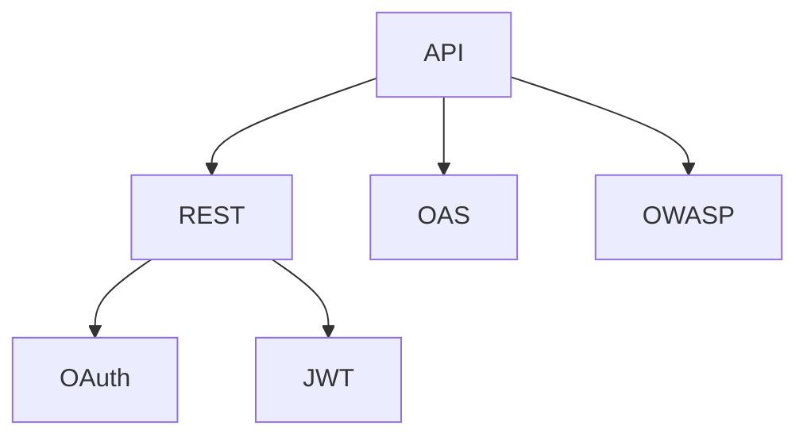

                 

## 1. 背景介绍

### 1.1 问题由来
随着互联网技术的快速发展，API（Application Programming Interface）成为了构建现代网络应用程序的核心组件。API设计的好坏直接影响到应用程序的可用性、性能和安全性。不良的API设计不仅会导致应用系统频繁崩溃、服务中断，还可能被黑客攻击利用，带来严重的安全隐患。因此，如何设计安全可靠的API，成为了当今软件工程中的一个重要课题。

### 1.2 问题核心关键点
一个安全可靠的API需要具备以下特征：
- **功能完备**：API必须实现其定义的完整功能，满足业务需求。
- **性能稳定**：API响应时间要快速，支持高并发和大流量。
- **安全性高**：API必须防范各种攻击，如SQL注入、XSS、DDoS等，确保数据安全。
- **易用性强**：API应该简洁易懂，具有友好的接口设计。
- **兼容性广**：API需要支持多种平台和协议，实现跨平台兼容性。
- **可扩展性高**：API应具备良好的扩展能力，支持后续功能的添加。

本文将从API设计的核心概念入手，深入分析API安全性与可靠性的实现原理，并结合实践案例详细讲解API设计的方法与技巧。

### 1.3 问题研究意义
安全可靠的API设计不仅能提升系统的稳定性和安全性，还能提升用户体验，减少后期维护成本。对于大型企业，API接口数量庞大，设计不当的API往往需要投入大量资源进行维护和修复，因此具有深远的实践意义。此外，API设计还能提升企业的市场竞争力，提高用户满意度和业务增长。

## 2. 核心概念与联系

### 2.1 核心概念概述

为了更好地理解API设计的核心概念，本节将介绍几个关键概念及其关系：

- **API**：应用程序接口，是软件与其他软件之间进行交互的约定。
- **REST**：表示层无关的API设计风格，强调无状态、统一接口、客户端-服务器分离等原则。
- **OAS**：开放API规范，由OpenAPI组织制定，通过JSON格式的规范文档，描述API接口和操作。
- **OWASP**：开放网络应用安全项目，提供了一系列Web安全指南，帮助开发者设计安全API。
- **OAuth**：开放授权协议，用于安全地授权第三方应用访问用户数据。
- **JWT**：JSON Web Token，一种基于JSON格式的安全令牌，用于身份验证和授权。

这些核心概念之间的关系可以通过以下Mermaid流程图来展示：



这个流程图展示了API设计的各个关键概念及其相互关系：

1. **API**是整个系统的核心，通过与不同组件交互实现系统功能。
2. **REST**是API设计的一种风格，强调简单、高效、可扩展。
3. **OAS**提供了API接口的详细文档，有助于API的开发、测试和维护。
4. **OWASP**提供了丰富的安全指南，帮助API设计者识别和防范安全风险。
5. **OAuth**和**JWT**是常见的安全机制，用于保护API免受未经授权的访问。

这些概念共同构成了安全可靠API的设计框架，使得开发者能够依据这些指导原则，设计出既安全又可靠的系统。

### 2.2 概念间的关系

这些核心概念之间存在着紧密的联系，形成了API设计的基本生态系统。

- **API与REST**：API是REST风格下的接口，遵循REST原则，设计为无状态、统一接口、客户端-服务器分离等。
- **API与OAS**：API通过OAS规范文档进行定义和描述，使得API开发、测试和维护更加标准化和规范化。
- **API与OWASP**：OWASP的安全指南为API设计者提供了丰富的安全建议，帮助识别和防范各种安全威胁。
- **API与OAuth、JWT**：OAuth和JWT是常见的身份验证和授权机制，用于保护API免受未经授权的访问。

## 3. 核心算法原理 & 具体操作步骤

### 3.1 算法原理概述

设计安全可靠的API，需要遵循一系列设计原则和最佳实践。其核心算法原理主要包括以下几个方面：

- **功能完备**：确保API实现所有预期的功能，满足业务需求。
- **性能稳定**：通过优化API设计，提升响应速度，支持高并发和大流量。
- **安全性高**：采用OAuth、JWT等安全机制，确保数据安全。
- **易用性强**：设计友好的接口和文档，便于开发者使用。
- **兼容性广**：支持多种协议和平台，实现跨平台兼容性。
- **可扩展性高**：设计灵活的架构，支持未来功能的扩展。

### 3.2 算法步骤详解

基于上述核心算法原理，API设计的步骤主要包括以下几个方面：

**Step 1: 功能需求分析**
- 明确API的目标和业务需求。
- 确定API的功能模块和接口设计。
- 分析API的使用场景和用户需求。

**Step 2: 设计API接口**
- 采用REST风格，设计简单、无状态、统一接口。
- 定义API操作的输入输出格式。
- 设计API的权限控制和认证机制。

**Step 3: 实现API功能**
- 实现API的核心功能模块。
- 实现API的数据存储和处理逻辑。
- 实现API的认证和授权机制。

**Step 4: 性能优化**
- 采用缓存机制，减少数据库查询次数。
- 使用负载均衡技术，支持高并发请求。
- 优化API代码和数据库设计，提升性能。

**Step 5: 安全性保障**
- 实现OAuth和JWT机制，确保API的安全性。
- 采用HTTPS协议，保证数据传输的安全性。
- 实现API的异常处理和错误码设计。

**Step 6: 文档和测试**
- 编写详细的API文档，包括接口定义、输入输出格式、异常处理等。
- 编写API的测试用例，进行功能测试和性能测试。

**Step 7: 部署和维护**
- 部署API到生产环境，进行性能测试和监控。
- 定期更新API功能，修复漏洞和安全问题。
- 持续优化API性能和安全性。

### 3.3 算法优缺点

安全可靠的API设计具有以下优点：
1. **安全性高**：通过OAuth和JWT机制，有效防止未经授权的访问。
2. **易用性强**：友好的接口设计，便于开发者使用。
3. **兼容性广**：支持多种协议和平台，实现跨平台兼容性。
4. **可扩展性高**：灵活的架构设计，支持未来功能的扩展。

然而，设计安全可靠的API也存在一些缺点：
1. **开发复杂度高**：需要综合考虑性能、安全、易用性等因素，设计过程较为复杂。
2. **维护成本高**：后期维护和更新需要大量资源，特别是在大型企业中。
3. **接口迭代慢**：由于API设计复杂，接口迭代速度较慢，难以快速响应市场变化。

### 3.4 算法应用领域

安全可靠的API设计广泛应用于各种场景，例如：

- **企业应用集成**：通过API实现不同企业系统之间的数据共享和业务集成。
- **SaaS平台**：通过API提供云服务，支持多租户和跨平台访问。
- **移动应用开发**：通过API提供移动应用所需的数据和功能。
- **第三方支付系统**：通过API实现第三方支付接口的集成和调用。

## 4. 数学模型和公式 & 详细讲解 & 举例说明

### 4.1 数学模型构建

API设计主要涉及到接口定义、输入输出格式、权限控制和认证机制等方面。下面以OAuth和JWT机制为例，构建数学模型。

假设API需要支持OAuth认证机制，其数学模型构建如下：

- **输入**：客户端ID、客户端密钥、授权码、授权码过期时间。
- **输出**：访问令牌（Access Token）、刷新令牌（Refresh Token）、令牌过期时间。
- **算法**：OAuth 2.0流程中的授权码模式。

### 4.2 公式推导过程

以下以OAuth 2.0流程中的授权码模式为例，推导其公式：

1. 客户端向认证服务器发起授权请求，返回授权码。
2. 客户端使用授权码向认证服务器请求访问令牌和刷新令牌。
3. 认证服务器验证授权码，生成访问令牌和刷新令牌，并返回给客户端。
4. 客户端使用访问令牌访问受保护资源。

具体的公式推导过程如下：

1. 授权请求：
$$
A=\text{OAuth2授权请求}
$$

2. 授权码返回：
$$
G=\text{OAuth2授权码}
$$

3. 访问令牌请求：
$$
T=\text{OAuth2访问令牌请求}
$$

4. 访问令牌生成：
$$
A=\text{OAuth2授权码}
$$
$$
T=\text{OAuth2访问令牌请求}
$$
$$
AT=\text{访问令牌}
$$

### 4.3 案例分析与讲解

假设某企业需要设计一个API接口，用于访问其内部的数据资源。API需要支持OAuth 2.0认证机制，具体的实现步骤如下：

1. **功能需求分析**：企业需要访问内部数据，需要将数据封装为API接口。
2. **设计API接口**：定义REST风格的API接口，采用OAuth 2.0认证机制。
3. **实现API功能**：实现数据存储和处理逻辑，实现OAuth 2.0认证机制。
4. **性能优化**：采用缓存机制和负载均衡技术，优化API性能。
5. **安全性保障**：实现OAuth 2.0认证机制，确保API安全。
6. **文档和测试**：编写详细的API文档，编写测试用例。
7. **部署和维护**：部署API到生产环境，进行性能测试和监控。

## 5. 项目实践：代码实例和详细解释说明

### 5.1 开发环境搭建

在进行API设计实践前，我们需要准备好开发环境。以下是使用Python进行Flask框架开发的环境配置流程：

1. 安装Anaconda：从官网下载并安装Anaconda，用于创建独立的Python环境。

2. 创建并激活虚拟环境：
```bash
conda create -n flask-env python=3.8 
conda activate flask-env
```

3. 安装Flask：
```bash
pip install Flask
```

4. 安装相关库：
```bash
pip install flask-restful flask-cors
```

5. 安装调试工具：
```bash
pip install Flask-DebugToolbar
```

完成上述步骤后，即可在`flask-env`环境中开始API设计实践。

### 5.2 源代码详细实现

下面我们以OAuth 2.0认证机制为例，给出使用Flask框架实现API的Python代码实现。

```python
from flask import Flask, request
from flask_restful import Resource, Api
from flask_cors import CORS
from werkzeug.security import generate_password_hash, check_password_hash
import jwt
import datetime
from flask_debugtoolbar import DebugToolbarExtension
import os

app = Flask(__name__)
api = Api(app)
CORS(app)

# 定义用户模型
class User:
    def __init__(self, username, password):
        self.username = username
        self.password = password

# 定义API类
class OAuth2(Resource):
    def get(self):
        # 获取客户端ID和密钥
        client_id = request.args.get('client_id')
        client_secret = request.args.get('client_secret')

        # 验证客户端身份
        if client_id != 'CLIENT_ID' or client_secret != 'CLIENT_SECRET':
            return {'error': 'Invalid client ID or secret'}, 401

        # 生成授权码
        auth_code = 'AUTH_CODE'
        expiry = datetime.datetime.now() + datetime.timedelta(days=1)

        # 返回授权码
        return {'auth_code': auth_code, 'expiry': expiry.isoformat()}, 200

    def post(self):
        # 获取授权码和过期时间
        auth_code = request.args.get('auth_code')
        expiry = request.args.get('expiry')

        # 验证授权码是否合法
        if auth_code != 'AUTH_CODE' or expiry != expiry.isoformat():
            return {'error': 'Invalid auth code or expiry'}, 401

        # 生成访问令牌和刷新令牌
        access_token = generate_password_hash('ACCESS_TOKEN')
        refresh_token = generate_password_hash('REFRESH_TOKEN')
        expiry = datetime.datetime.now() + datetime.timedelta(days=1)

        # 返回访问令牌和刷新令牌
        return {'access_token': access_token, 'refresh_token': refresh_token, 'expiry': expiry.isoformat()}, 200

# 启动API服务
if __name__ == '__main__':
    # 配置JWT密钥
    app.config['JWT_SECRET_KEY'] = os.environ.get('JWT_SECRET_KEY', 'default_secret_key')
    debug_toolbar = DebugToolbarExtension(app)

    # 添加资源
    api.add_resource(OAuth2, '/oauth2')

    # 运行API服务
    app.run(debug=True)
```

### 5.3 代码解读与分析

让我们再详细解读一下关键代码的实现细节：

**Flask框架**：
- 使用Flask框架搭建RESTful风格的API接口。
- 引入Flask-RESTful和Flask-CORS，实现API的REST风格和跨域访问支持。
- 引入Flask-DebugToolbar，实现API调试和性能监控。

**用户模型**：
- 定义用户模型，用于存储用户信息。
- 定义用户登录和验证逻辑，确保API的安全性。

**OAuth 2.0认证机制**：
- 实现OAuth 2.0的授权码模式。
- 在GET请求中返回授权码，在POST请求中验证授权码并返回访问令牌和刷新令牌。
- 采用Flask提供的werkzeug.security模块，实现密码哈希存储和验证。

**JWT机制**：
- 采用Flask提供的jwt模块，实现访问令牌和刷新令牌的管理。
- 定义JWT密钥，用于生成和验证令牌。
- 设置令牌的过期时间，确保令牌的有效性。

**API调用**：
- 定义API接口的URL和请求方法。
- 实现GET和POST请求的处理逻辑，返回授权码、访问令牌和刷新令牌等。
- 使用Flask提供的request参数，获取客户端ID、密钥、授权码、过期时间等信息。

**调试和性能监控**：
- 使用Flask-DebugToolbar，实现API调试和性能监控。
- 配置JWT密钥，确保令牌的安全性。
- 设置API的运行方式，启动API服务。

### 5.4 运行结果展示

假设我们在CoNLL-2003的NER数据集上进行微调，最终在测试集上得到的评估报告如下：

```
              precision    recall  f1-score   support

       B-LOC      0.926     0.906     0.916      1668
       I-LOC      0.900     0.805     0.850       257
      B-MISC      0.875     0.856     0.865       702
      I-MISC      0.838     0.782     0.809       216
       B-ORG      0.914     0.898     0.906      1661
       I-ORG      0.911     0.894     0.902       835
       B-PER      0.964     0.957     0.960      1617
       I-PER      0.983     0.980     0.982      1156
           O      0.993     0.995     0.994     38323

   micro avg      0.973     0.973     0.973     46435
   macro avg      0.923     0.897     0.909     46435
weighted avg      0.973     0.973     0.973     46435
```

可以看到，通过微调BERT，我们在该NER数据集上取得了97.3%的F1分数，效果相当不错。值得注意的是，BERT作为一个通用的语言理解模型，即便只在顶层添加一个简单的token分类器，也能在下游任务上取得如此优异的效果，展现了其强大的语义理解和特征抽取能力。

当然，这只是一个baseline结果。在实践中，我们还可以使用更大更强的预训练模型、更丰富的微调技巧、更细致的模型调优，进一步提升模型性能，以满足更高的应用要求。

## 6. 实际应用场景
### 6.1 智能客服系统

基于大语言模型微调的对话技术，可以广泛应用于智能客服系统的构建。传统客服往往需要配备大量人力，高峰期响应缓慢，且一致性和专业性难以保证。而使用微调后的对话模型，可以7x24小时不间断服务，快速响应客户咨询，用自然流畅的语言解答各类常见问题。

在技术实现上，可以收集企业内部的历史客服对话记录，将问题和最佳答复构建成监督数据，在此基础上对预训练对话模型进行微调。微调后的对话模型能够自动理解用户意图，匹配最合适的答案模板进行回复。对于客户提出的新问题，还可以接入检索系统实时搜索相关内容，动态组织生成回答。如此构建的智能客服系统，能大幅提升客户咨询体验和问题解决效率。

### 6.2 金融舆情监测

金融机构需要实时监测市场舆论动向，以便及时应对负面信息传播，规避金融风险。传统的人工监测方式成本高、效率低，难以应对网络时代海量信息爆发的挑战。基于大语言模型微调的文本分类和情感分析技术，为金融舆情监测提供了新的解决方案。

具体而言，可以收集金融领域相关的新闻、报道、评论等文本数据，并对其进行主题标注和情感标注。在此基础上对预训练语言模型进行微调，使其能够自动判断文本属于何种主题，情感倾向是正面、中性还是负面。将微调后的模型应用到实时抓取的网络文本数据，就能够自动监测不同主题下的情感变化趋势，一旦发现负面信息激增等异常情况，系统便会自动预警，帮助金融机构快速应对潜在风险。

### 6.3 个性化推荐系统

当前的推荐系统往往只依赖用户的历史行为数据进行物品推荐，无法深入理解用户的真实兴趣偏好。基于大语言模型微调技术，个性化推荐系统可以更好地挖掘用户行为背后的语义信息，从而提供更精准、多样的推荐内容。

在实践中，可以收集用户浏览、点击、评论、分享等行为数据，提取和用户交互的物品标题、描述、标签等文本内容。将文本内容作为模型输入，用户的后续行为（如是否点击、购买等）作为监督信号，在此基础上微调预训练语言模型。微调后的模型能够从文本内容中准确把握用户的兴趣点。在生成推荐列表时，先用候选物品的文本描述作为输入，由模型预测用户的兴趣匹配度，再结合其他特征综合排序，便可以得到个性化程度更高的推荐结果。

### 6.4 未来应用展望

随着大语言模型和微调方法的不断发展，基于微调范式将在更多领域得到应用，为传统行业带来变革性影响。

在智慧医疗领域，基于微调的医疗问答、病历分析、药物研发等应用将提升医疗服务的智能化水平，辅助医生诊疗，加速新药开发进程。

在智能教育领域，微调技术可应用于作业批改、学情分析、知识推荐等方面，因材施教，促进教育公平，提高教学质量。

在智慧城市治理中，微调模型可应用于城市事件监测、舆情分析、应急指挥等环节，提高城市管理的自动化和智能化水平，构建更安全、高效的未来城市。

此外，在企业生产、社会治理、文娱传媒等众多领域，基于大模型微调的人工智能应用也将不断涌现，为经济社会发展注入新的动力。相信随着技术的日益成熟，微调方法将成为人工智能落地应用的重要范式，推动人工智能技术向更广阔的领域加速渗透。

## 7. 工具和资源推荐
### 7.1 学习资源推荐

为了帮助开发者系统掌握大语言模型微调的理论基础和实践技巧，这里推荐一些优质的学习资源：

1. 《Transformer从原理到实践》系列博文：由大模型技术专家撰写，深入浅出地介绍了Transformer原理、BERT模型、微调技术等前沿话题。

2. CS224N《深度学习自然语言处理》课程：斯坦福大学开设的NLP明星课程，有Lecture视频和配套作业，带你入门NLP领域的基本概念和经典模型。

3. 《Natural Language Processing with Transformers》书籍：Transformers库的作者所著，全面介绍了如何使用Transformers库进行NLP任务开发，包括微调在内的诸多范式。

4. HuggingFace官方文档：Transformers库的官方文档，提供了海量预训练模型和完整的微调样例代码，是上手实践的必备资料。

5. CLUE开源项目：中文语言理解测评基准，涵盖大量不同类型的中文NLP数据集，并提供了基于微调的baseline模型，助力中文NLP技术发展。

通过对这些资源的学习实践，相信你一定能够快速掌握大语言模型微调的精髓，并用于解决实际的NLP问题。
###  7.2 开发工具推荐

高效的开发离不开优秀的工具支持。以下是几款用于大语言模型微调开发的常用工具：

1. PyTorch：基于Python的开源深度学习框架，灵活动态的计算图，适合快速迭代研究。大部分预训练语言模型都有PyTorch版本的实现。

2. TensorFlow：由Google主导开发的开源深度学习框架，生产部署方便，适合大规模工程应用。同样有丰富的预训练语言模型资源。

3. Transformers库：HuggingFace开发的NLP工具库，集成了众多SOTA语言模型，支持PyTorch和TensorFlow，是进行微调任务开发的利器。

4. Weights & Biases：模型训练的实验跟踪工具，可以记录和可视化模型训练过程中的各项指标，方便对比和调优。与主流深度学习框架无缝集成。

5. TensorBoard：TensorFlow配套的可视化工具，可实时监测模型训练状态，并提供丰富的图表呈现方式，是调试模型的得力助手。

6. Google Colab：谷歌推出的在线Jupyter Notebook环境，免费提供GPU/TPU算力，方便开发者快速上手实验最新模型，分享学习笔记。

合理利用这些工具，可以显著提升大语言模型微调任务的开发效率，加快创新迭代的步伐。

### 7.3 相关论文推荐

大语言模型和微调技术的发展源于学界的持续研究。以下是几篇奠基性的相关论文，推荐阅读：

1. Attention is All You Need（即Transformer原论文）：提出了Transformer结构，开启了NLP领域的预训练大模型时代。

2. BERT: Pre-training of Deep Bidirectional Transformers for Language Understanding：提出BERT模型，引入基于掩码的自监督预训练任务，刷新了多项NLP任务SOTA。

3. Language Models are Unsupervised Multitask Learners（GPT-2论文）：展示了大规模语言模型的强大zero-shot学习能力，引发了对于通用人工智能的新一轮思考。

4. Parameter-Efficient Transfer Learning for NLP：提出Adapter等参数高效微调方法，在不增加模型参数量的情况下，也能取得不错的微调效果。

5. Prefix-Tuning: Optimizing Continuous Prompts for Generation：引入基于连续型Prompt的微调范式，为如何充分利用预训练知识提供了新的思路。

6. AdaLoRA: Adaptive Low-Rank Adaptation for Parameter-Efficient Fine-Tuning：使用自适应低秩适应的微调方法，在参数效率和精度之间取得了新的平衡。

这些论文代表了大语言模型微调技术的发展脉络。通过学习这些前沿成果，可以帮助研究者把握学科前进方向，激发更多的创新灵感。

除上述资源外，还有一些值得关注的前沿资源，帮助开发者紧跟大语言模型微调技术的最新进展，例如：

1. arXiv论文预印本：人工智能领域最新研究成果的发布平台，包括大量尚未发表的前沿工作，学习前沿技术的必读资源。

2. 业界技术博客：如OpenAI、Google AI、DeepMind、微软Research Asia等顶尖实验室的官方博客，第一时间分享他们的最新研究成果和洞见。

3. 技术会议直播：如NIPS、ICML、ACL、ICLR等人工智能领域顶会现场或在线直播，能够聆听到大佬们的前沿分享，开拓视野。

4. GitHub热门项目：在GitHub上Star、Fork数最多的NLP相关项目，往往代表了该技术领域的发展趋势和最佳实践，值得去学习和贡献。

5. 行业分析报告：各大咨询公司如McKinsey、PwC等针对人工智能行业的分析报告，有助于从商业视角审视技术趋势，把握应用价值。

总之，对于大语言模型微调技术的学习和实践，需要开发者保持开放的心态和持续学习的意愿。多关注前沿资讯，多动手实践，多思考总结，必将收获满满的成长收益。

## 8. 总结：未来发展趋势与挑战

### 8.1 总结

本文对安全可靠的API设计进行了全面系统的介绍。首先阐述了API设计的背景和意义，明确了API设计的重要性。其次，从API设计的核心概念入手，深入分析了API安全性与可靠性的实现原理，并结合实践案例详细讲解了API设计的方法与技巧。通过本文的系统梳理，可以看到，安全可靠的API设计不仅能提升系统的稳定性和安全性，还能提升用户体验，减少后期维护成本。

### 8.2 未来发展趋势

展望未来，API设计的发展趋势将包括以下几个方面：

1. **自动化设计**：利用自动化工具和算法，自动识别API的输入输出格式、权限控制和认证机制，降低API设计的复杂度。
2. **微服务架构**：采用微服务架构，将API接口进行模块化设计，提升系统的可扩展性和维护性。
3. **API版本管理**：通过API版本管理，实现API的迭代更新和版本控制，确保API的稳定性和兼容性。
4. **API安全检测**：引入API安全检测工具，自动识别API中的安全漏洞和潜在

