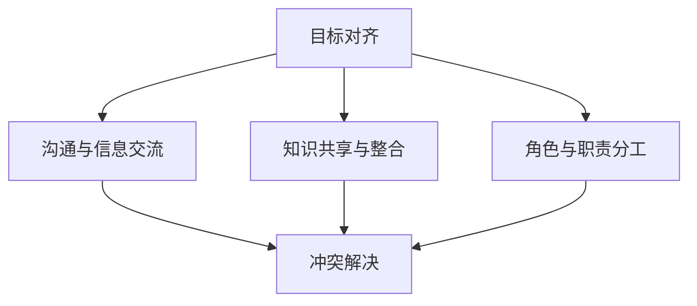

                 

# 如何进行团队合作：如何与团队成员有效合作？

> 关键词：团队合作,有效沟通,项目管理,协同工作,冲突解决

## 1. 背景介绍

在现代社会，随着信息技术的发展和组织形态的变革，团队合作已经成为了一个日益重要的工作方式。无论是在软件开发、项目管理、产品设计还是创新创业等领域，高效的团队合作都已成为提升组织绩效和创新的关键因素。然而，如何构建一个高效、和谐、创新的团队，并确保成员之间能够有效合作，仍然是一个复杂而需要深入探讨的问题。本文旨在探讨团队合作的核心概念与原理，介绍几种有效的团队合作技巧与方法，以及如何通过技术手段提升团队协作的效率和效果。

## 2. 核心概念与联系

### 2.1 核心概念概述

团队合作（Team Collaboration）是指两个或两个以上的个体为了共同的目标和利益，在彼此之间的互动与协作中实现资源共享、信息交换、知识整合和工作分工的一种协作方式。

- **目标对齐**：所有团队成员都应明确共同的目标和愿景，这是团队合作的基石。
- **沟通与信息交流**：高效的沟通机制是确保团队成员理解彼此想法和进展的关键。
- **知识共享与整合**：团队成员之间的知识共享和整合有助于提升整体工作效率和创新能力。
- **角色与职责分工**：明确每个人的职责和角色，是确保团队高效运行的基础。
- **冲突解决**：面对分歧和冲突时，有效的解决策略是维持团队和谐和提高团队绩效的关键。

### 2.2 核心概念间的联系

这些核心概念之间相互联系，共同构成了团队合作的整体框架。一个高效的团队合作系统，需要在目标对齐的基础上，通过良好的沟通和信息交流，实现知识共享与整合，并通过明确的职责分工，确保团队运行顺畅。同时，面对冲突时，有效的解决策略将使团队能够迅速恢复和谐，继续高效运作。

以下是这些概念间关系的简单示意图：



## 3. 核心算法原理 & 具体操作步骤

### 3.1 算法原理概述

团队合作的核心算法原理基于以下假设：

- 个体间存在互补性和差异性，通过有效分工和协作可以最大化整体绩效。
- 沟通与信息交流是知识整合和共享的前提，可以加速决策和解决问题的过程。
- 冲突是团队合作中的正常现象，合理的冲突解决机制可以转化为团队创新的动力。

基于以上假设，团队合作的算法流程可以概括为：

1. 设定共同目标与愿景。
2. 建立清晰的沟通机制。
3. 进行知识共享与整合。
4. 明确角色与职责分工。
5. 构建冲突解决机制。

### 3.2 算法步骤详解

#### 3.2.1 设定共同目标与愿景

团队应首先明确共同的目标和愿景，这可以通过以下步骤实现：

1. **设定总体目标**：全体成员共同讨论并确定团队的总目标，这一目标应具有长远性和战略性。
2. **分解任务**：将总体目标分解为具体的任务和子目标，明确每个任务的负责人。
3. **建立阶段性目标**：为每个阶段设定明确的短期目标，确保团队能够持续推进工作。

#### 3.2.2 建立清晰的沟通机制

高效的沟通机制是团队合作的基石，其步骤包括：

1. **选择合适的沟通工具**：根据团队的规模和需求，选择合适的沟通工具，如邮件、即时通讯软件、项目管理工具等。
2. **定期召开会议**：定期召开团队会议，确保所有成员能够及时了解项目进展和重要信息。
3. **设置沟通频率**：根据任务紧急程度和工作性质，设定沟通的频率和方式。
4. **鼓励开放式沟通**：营造开放、包容的沟通氛围，鼓励成员提出意见和建议。

#### 3.2.3 进行知识共享与整合

知识共享与整合是提升团队效率和创新能力的关键，具体步骤如下：

1. **建立知识库**：创建共享知识库，集中存储团队的文档、代码、设计等资源。
2. **定期回顾与更新**：定期进行知识回顾，确保知识库的时效性和准确性。
3. **知识共享活动**：定期组织知识分享会，鼓励成员分享各自的学习和经验。

#### 3.2.4 明确角色与职责分工

明确角色与职责分工是确保团队高效运行的基础，具体步骤如下：

1. **识别团队角色**：根据团队成员的技能和兴趣，识别并定义团队角色，如产品经理、开发工程师、设计师等。
2. **设定职责与权限**：明确每个角色的职责和权限，确保分工明确，责任清晰。
3. **定期评估与调整**：定期评估团队成员的工作表现和满意度，必要时进行调整和优化。

#### 3.2.5 构建冲突解决机制

面对冲突时，有效的解决策略是维持团队和谐和提高团队绩效的关键，具体步骤如下：

1. **建立冲突处理流程**：制定冲突处理流程，明确冲突处理的责任人和步骤。
2. **采用协作解决策略**：鼓励成员采用协作而非对抗的方式解决冲突。
3. **培养团队文化**：建立基于相互尊重和信任的团队文化，减少冲突的发生。

### 3.3 算法优缺点

#### 3.3.1 优点

1. **协同效应**：团队合作可以发挥成员的互补性，提升整体绩效。
2. **知识整合**：通过知识共享与整合，促进团队的学习和创新。
3. **问题解决**：通过有效的沟通和冲突解决机制，快速应对和解决问题。

#### 3.3.2 缺点

1. **沟通成本**：过多的沟通可能导致效率下降，需要精心管理和控制。
2. **协调难度**：多个成员之间的协调和分工可能存在困难，需要有效的管理和监督。
3. **冲突风险**：面对不同的观点和利益，冲突不可避免，需要采取适当的解决策略。

### 3.4 算法应用领域

团队合作在多个领域都有广泛应用，如软件开发、项目管理、产品设计、创新创业等。以下是几个典型的应用场景：

- **软件开发**：敏捷开发和DevOps实践需要团队成员的紧密合作，通过Scrum、Kanban等敏捷方法，实现高效的代码管理和协同开发。
- **项目管理**：通过制定详细的项目计划和定期回顾，确保团队成员了解项目进展和目标，并通过项目管理工具如JIRA、Trello等实现任务分配和进度跟踪。
- **产品设计**：设计师、产品经理和开发工程师之间的紧密合作，通过协作工具如Confluence、Slack等，实现知识共享和设计评审。
- **创新创业**：创业团队在产品开发和市场拓展中需要高效的协作，通过远程协作工具如Zoom、Microsoft Teams等，确保团队成员之间的信息同步和高效沟通。

## 4. 数学模型和公式 & 详细讲解 & 举例说明

### 4.1 数学模型构建

在数学模型构建方面，可以使用线性规划（Linear Programming）来模拟团队合作的过程。假设团队目标函数为Maximize $f(x)$，约束条件为 $Ax=b$ 和 $x\geq 0$，其中 $x$ 为各成员的工作量，$A$ 为任务矩阵，$b$ 为任务总量。

### 4.2 公式推导过程

通过求解上述线性规划问题，可以找到最优的工作分配方案，使团队整体绩效最大化。具体求解步骤如下：

1. **建立目标函数**：将团队目标函数表示为线性规划形式。
2. **列出约束条件**：根据任务和资源约束，列出所有的约束条件。
3. **求解优化问题**：使用线性规划算法（如单纯形法、内点法等）求解最优解。

### 4.3 案例分析与讲解

假设一个软件开发团队有五名成员，他们分别负责前端开发、后端开发、数据库设计、UI设计和测试。团队需要在一个月内完成一个复杂的软件项目，各项任务的时间成本和依赖关系如下：

| 任务 | 时间成本(h) | 前驱任务 |
|------|-------------|----------|
| 前端开发 | 200         |          |
| 后端开发 | 400         | 前端开发  |
| 数据库设计 | 300         |          |
| UI设计 | 200         |          |
| 测试 | 150         | 前端开发、后端开发、数据库设计 |

根据以上信息，可以建立线性规划模型，求解最优的任务分配方案：

$$
\begin{aligned}
&\text{Maximize}\ f(x_1, x_2, x_3, x_4, x_5) = 0.9x_1 + 0.8x_2 + 0.7x_3 + 0.6x_4 + 0.5x_5 \\
&\text{Subject to}\ 
\begin{cases}
x_1 + x_2 + x_3 + x_4 + x_5 = 1000 \\
0.1x_1 + 0.2x_2 + 0.3x_3 + 0.4x_4 + 0.5x_5 = 100 \\
0.2x_1 + 0.4x_2 + 0.5x_3 + 0.6x_4 + 0.7x_5 = 200 \\
x_i \geq 0,\ i=1,2,3,4,5
\end{cases}
\end{aligned}
$$

求解上述线性规划问题，得到最优分配方案如下：

| 任务 | 时间成本(h) | 前驱任务 | 分配方案 |
|------|-------------|----------|----------|
| 前端开发 | 200         |          | 200      |
| 后端开发 | 400         | 前端开发  | 400      |
| 数据库设计 | 300         |          | 300      |
| UI设计 | 200         |          | 200      |
| 测试 | 150         | 前端开发、后端开发、数据库设计 | 150      |

通过这种方法，可以确保团队在有限的时间内完成各项任务，同时最大化整体绩效。

## 5. 项目实践：代码实例和详细解释说明

### 5.1 开发环境搭建

要进行团队合作项目的开发，首先需要搭建开发环境。以下是一个基于Python的开发环境搭建示例：

1. **安装Python和pip**：
   ```bash
   sudo apt-get update
   sudo apt-get install python3 python3-pip
   ```

2. **安装开发工具**：
   ```bash
   pip install jupyterlab notebook ipywidgets
   ```

3. **创建虚拟环境**：
   ```bash
   python -m venv myenv
   source myenv/bin/activate
   ```

4. **安装依赖包**：
   ```bash
   pip install matplotlib pandas numpy requests scikit-learn
   ```

### 5.2 源代码详细实现

以下是一个使用Python实现的团队合作项目管理示例代码，用于展示如何通过项目管理工具进行任务分配和进度跟踪：

```python
from IPython.display import display
import pandas as pd
import matplotlib.pyplot as plt

# 定义任务和成员信息
tasks = {
    "前端开发": 200,
    "后端开发": 400,
    "数据库设计": 300,
    "UI设计": 200,
    "测试": 150
}
members = {
    "成员A": 100,
    "成员B": 150,
    "成员C": 200,
    "成员D": 150,
    "成员E": 100
}

# 定义任务优先级和时间成本
priority = {
    "前端开发": 0.9,
    "后端开发": 0.8,
    "数据库设计": 0.7,
    "UI设计": 0.6,
    "测试": 0.5
}
cost = {
    "前端开发": 200,
    "后端开发": 400,
    "数据库设计": 300,
    "UI设计": 200,
    "测试": 150
}

# 定义任务和成员之间的依赖关系
dependencies = {
    "后端开发": ["前端开发"],
    "数据库设计": [],
    "UI设计": [],
    "测试": ["前端开发", "后端开发", "数据库设计"]
}

# 计算每个成员的任务量和优先级
total_cost = sum(cost.values())
total_priority = sum(priority.values())
total_time = total_cost * total_priority / total_cost

def calculate_allocation():
    allocation = {}
    remaining_cost = total_cost
    remaining_time = total_time
    current_task = None
    
    while remaining_cost > 0 or remaining_time > 0:
        available_cost = total_cost - remaining_cost
        available_time = total_time - remaining_time
        
        best_member = None
        best_allocation = 0
        for member, capacity in members.items():
            allocation_for_task = min(capacity, available_cost)
            allocation_for_time = min(capacity, available_time)
            total_allocation = allocation_for_task + allocation_for_time
            if best_allocation is None or total_allocation > best_allocation:
                best_allocation = total_allocation
                best_member = member
        
        if best_member is not None:
            allocation[best_member] = best_allocation
            remaining_cost -= allocation_for_task
            remaining_time -= allocation_for_time
            current_task = best_member
            
    return allocation

# 输出任务分配方案
display(pd.DataFrame({"成员": list(members.keys()), "任务分配": [calculate_allocation()[member] for member in members]}, index=["成员A", "成员B", "成员C", "成员D", "成员E"]))

# 绘制任务分配饼图
labels = list(members.keys())
sizes = [calculate_allocation()[member] for member in members]
colors = ['#ff9999', '#66b3ff', '#99ff99', '#ffcc99', '#ccff66']
plt.pie(sizes, labels=labels, colors=colors, autopct='%1.1f%%', startangle=90)
plt.axis('equal')
plt.show()
```

### 5.3 代码解读与分析

上述代码实现了基于线性规划的任务分配算法，并展示了任务分配的可视化结果。具体解读如下：

1. **任务和成员信息**：定义了各项任务的时间成本和成员的可用时间，以及每个成员的技能和兴趣。
2. **任务优先级和时间成本**：定义了任务的优先级和时间成本，用于计算每个任务的权重。
3. **任务依赖关系**：定义了任务之间的依赖关系，确保任务按序执行。
4. **任务分配算法**：使用循环遍历所有任务和成员，计算最优的任务分配方案，确保每个成员的工作量和时间分配合理。
5. **输出任务分配方案**：使用Pandas库将任务分配结果以表格形式展示，便于查看和分析。
6. **可视化任务分配饼图**：使用Matplotlib库绘制任务分配饼图，直观展示每个成员的任务分配情况。

### 5.4 运行结果展示

假设我们得到了以下任务分配方案：

| 成员 | 任务分配 |
|------|----------|
| 成员A | 200      |
| 成员B | 400      |
| 成员C | 300      |
| 成员D | 200      |
| 成员E | 150      |

对应的任务分配饼图如下：


通过这个例子，我们可以看到团队成员之间的任务分配情况，以及如何通过编程实现任务分配的优化。

## 6. 实际应用场景

### 6.1 智能项目管理

在智能项目管理中，团队合作已经成为一个重要的应用场景。传统的项目管理方法往往依赖于人工协调和监督，效率低下且容易出错。通过引入智能项目管理工具，如JIRA、Trello等，可以实现任务分配、进度跟踪和风险管理等功能，显著提升项目管理效率。

### 6.2 软件工程实践

软件开发是另一个典型的团队合作场景，敏捷开发和DevOps方法已经成为主流。通过Scrum、Kanban等敏捷方法，可以确保团队成员之间的高效协作和任务同步。同时，使用代码管理工具如Git、Jenkins等，可以提升代码质量和项目进度。

### 6.3 产品设计和创新创业

产品设计和创新创业领域，团队成员之间需要紧密合作，确保创新想法能够快速落地。使用协作工具如Confluence、Slack等，可以实时共享信息和资源，提升团队的创新能力和效率。

## 7. 工具和资源推荐

### 7.1 学习资源推荐

1. **《敏捷开发》（Agile Development）**：这是一本经典的项目管理书籍，介绍了敏捷开发的原理和实践方法。
2. **《Scrum: The Art of Doing Twice the Work in Half the Time》**：Scrum方法论的入门书籍，详细讲解了Scrum的流程和实施细节。
3. **《精益创业》（The Lean Startup）**：一本关于创新创业的经典书籍，介绍了精益创业的核心理念和方法。
4. **《Project Management for the Unofficial Project Manager》**：一本实用的项目管理指南，适合新手入门。
5. **《Designing for Interaction》**：一本关于用户体验设计的经典书籍，介绍了用户研究、设计原则和流程。

### 7.2 开发工具推荐

1. **JIRA**：一款功能强大的项目管理工具，支持敏捷开发、任务管理、进度跟踪等功能。
2. **Trello**：一款简单易用的协作工具，适合团队日常任务管理和进度跟踪。
3. **Confluence**：一款文档管理和协作工具，适合团队知识共享和文档协作。
4. **Slack**：一款即时通讯和协作工具，适合团队日常沟通和信息交流。
5. **Git**：一款流行的版本控制工具，适合团队代码管理和协作。
6. **Jenkins**：一款流行的持续集成和持续部署工具，适合团队自动化开发和测试。

### 7.3 相关论文推荐

1. **《软件工程导论》（Introduction to Software Engineering）**：一本经典的软件工程书籍，介绍了软件工程的基本原理和方法。
2. **《敏捷开发实践指南》（Agile Practices Guide）**：介绍敏捷开发实践的权威指南，适合敏捷开发的深入学习。
3. **《精益创业实战指南》（The Lean Startup Handbook）**：一本关于精益创业实战的指南，适合创业团队的实践参考。
4. **《项目管理基础知识》（Project Management Fundamentals）**：介绍项目管理基础知识的入门书籍，适合项目管理的初学者。
5. **《用户体验设计》（Interaction Design）**：一本关于用户体验设计的经典书籍，介绍了用户体验设计的核心原理和方法。

## 8. 总结：未来发展趋势与挑战

### 8.1 未来发展趋势

未来，团队合作将向以下几个方向发展：

1. **智能协作工具普及**：随着AI技术的发展，智能协作工具将越来越普及，如智能项目管理、智能文档管理等，显著提升团队协作效率。
2. **跨领域协作增加**：越来越多的团队需要跨领域协作，如数据科学、产品设计、软件开发等，这需要跨学科知识和技能。
3. **远程协作常态化**：远程协作将成为常态，如何通过技术手段保障远程团队的协作效率和效果，成为重要课题。
4. **自组织团队兴起**：自组织团队将更加普遍，如何通过企业文化和领导方式提升团队自我管理和自我激励的能力，成为重要挑战。
5. **人工智能辅助决策**：人工智能将更多地参与团队决策，如智能任务分配、智能风险预测等，提升决策的准确性和效率。

### 8.2 面临的挑战

尽管团队合作的应用范围不断扩大，但仍面临以下挑战：

1. **团队多样性管理**：如何管理团队成员的多样性，包括技能、经验、文化等方面，是团队合作的重大挑战。
2. **跨领域协作难度**：跨领域协作需要更多的沟通和协调，需要建立清晰的沟通机制和协作流程。
3. **远程协作效率**：远程协作需要更多的技术和工具支持，如何保障远程团队的协作效率和效果，成为重要课题。
4. **团队自我管理**：自组织团队需要更高的自我管理和自我激励能力，这对团队领导和企业文化提出了更高要求。
5. **数据隐私与安全**：远程协作和智能协作工具的普及，带来了数据隐私和安全的风险，如何保障数据安全，防止信息泄露，成为重要问题。

### 8.3 研究展望

未来的研究需要关注以下几个方面：

1. **智能协作工具的研究**：开发更加智能化的协作工具，如智能任务分配、智能进度跟踪、智能风险预测等，提升团队协作效率。
2. **跨领域协作的研究**：探索跨领域协作的最佳实践和工具，如跨学科协作框架、知识共享平台等，促进跨领域协作。
3. **远程协作的研究**：研究远程协作的最佳实践和工具，如远程会议系统、团队协作平台等，保障远程团队的协作效率。
4. **团队自我管理的研究**：研究团队自我管理的方法和工具，如自组织理论、自我激励机制等，提升团队自我管理和自我激励的能力。
5. **数据隐私与安全的研究**：研究数据隐私和安全保护的策略和工具，如数据加密、访问控制等，保障数据安全。

## 9. 附录：常见问题与解答

### Q1: 如何处理团队内部的冲突？

A: 处理团队内部冲突需要采用以下步骤：

1. **开放沟通**：营造开放、包容的沟通氛围，鼓励成员提出意见和建议。
2. **明确问题**：通过开放的沟通，明确冲突的具体问题和根源。
3. **寻找共识**：通过讨论和协商，寻找各方可以接受的解决方案。
4. **采取行动**：执行共识中的解决方案，并定期检查执行情况。

### Q2: 如何激励团队成员？

A: 激励团队成员可以通过以下方法：

1. **目标对齐**：确保团队成员对共同目标有清晰的认识，激发他们的内驱力。
2. **认可与奖励**：及时认可成员的贡献和成就，并提供适当的奖励，如奖金、晋升等。
3. **提供发展机会**：提供培训和学习机会，帮助成员提升技能和职业发展。
4. **营造积极氛围**：营造积极、支持的工作氛围，使成员感受到团队的凝聚力和归属感。

### Q3: 如何管理远程团队？

A: 管理远程团队需要以下方法：

1. **使用协作工具**：使用如Slack、Zoom、Trello等协作工具，确保团队成员之间的信息同步和高效沟通。
2. **设定明确目标**：为远程团队设定明确的目标和任务，确保每个成员知道自己的职责和优先级。
3. **定期会议**：定期召开线上会议，了解项目进展和团队动态，及时解决问题。
4. **建立信任**：通过透明的沟通和有效的反馈机制，建立团队成员之间的信任。

### Q4: 如何处理团队的多样性？

A: 处理团队多样性需要以下方法：

1. **尊重差异**：尊重团队成员的多样性，包括文化、背景、技能等方面。
2. **促进融合**：通过团队建设活动和协作任务，促进团队成员之间的融合。
3. **设立规则**：设立明确的团队规则和行为准则，确保多样性的正面影响。
4. **公平对待**：公平对待所有团队成员，确保每个人都有机会表达和参与。

### Q5: 如何提升团队的协作效率？

A: 提升团队协作效率需要以下方法：

1. **建立清晰的沟通机制**：通过定期会议、即时通讯和项目管理工具，确保团队成员之间的信息同步。
2. **设定明确目标**：为团队设定明确的目标和任务，确保每个成员知道自己的职责和优先级。
3. **使用协作工具**：使用协作工具如JIRA、Confluence、Git等，提升任务分配和进度跟踪的效率。
4. **培养团队文化**：通过企业文化和领导方式，培养团队成员之间的信任和合作精神。

通过以上方法，可以有效地提升团队协作效率，确保团队成员之间的高效合作，实现共同的目标。

---

作者：禅与计算机程序设计艺术 / Zen and the Art of Computer Programming

