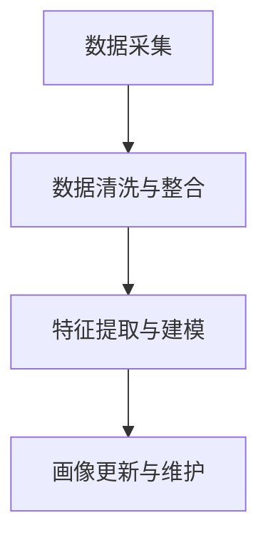

                 

## 1. 背景介绍

在数字化转型的大潮下，企业纷纷通过在线平台向用户提供各种商品和服务。然而，用户满意度却成为制约企业发展的瓶颈。一项调查显示，企业每损失一个回头客，将面临高达280美元的经济损失。因此，如何通过有效手段提升用户满意度，就成为企业运营的关键。

用户画像(User Persona)是一种基于用户数据，描绘用户特征、行为和需求的工具，能够帮助企业精准定位用户，制定个性化营销策略。通过科学构建用户画像，结合实际业务场景，可以有效提升用户满意度。

本博文将从背景介绍、核心概念、算法原理、操作步骤、数学模型、项目实践、实际应用场景、工具和资源推荐、总结及未来展望等多个角度，系统阐述如何通过用户画像提升用户满意度，为读者提供全面的技术指导。

## 2. 核心概念与联系

### 2.1 核心概念概述

用户画像(User Persona)是一种用户建模方法，通过对用户数据进行分析和整合，构建出具体、详尽的用户特征描述。常见用户画像要素包括：

- **基本信息**：如性别、年龄、职业等。
- **行为特征**：如访问时间、购买频率、消费金额等。
- **兴趣偏好**：如兴趣爱好、消费习惯等。
- **心理特征**：如价值观、满意度、忠诚度等。

用户画像的构建涉及多个数据源，包括网站/APP日志、社交媒体、交易记录、问卷调查等。数据类型包括结构化数据、半结构化数据和非结构化数据。

### 2.2 核心概念原理和架构

**数据采集**：通过API、爬虫等方式，获取用户行为数据，如页面访问路径、点击记录等。

**数据清洗与整合**：对原始数据进行清洗、去重、填充缺失值等处理，将不同来源的数据进行整合。

**特征提取与建模**：使用特征选择和降维技术，提取用户关键特征，构建用户画像。

**画像更新与维护**：定期更新用户画像，保持数据的时效性和准确性。

整个用户画像构建流程可以用以下Mermaid流程图表示：



通过用户画像的构建，可以明确用户需求和行为特征，制定个性化推荐策略，提升用户满意度。

## 3. 核心算法原理 & 具体操作步骤

### 3.1 算法原理概述

用户画像的构建主要依赖机器学习算法，通过对用户数据的建模与分析，得到用户特征描述。常见算法包括：

- **聚类算法**：如K-means、层次聚类等，用于将相似用户分组，构建群体画像。
- **分类算法**：如朴素贝叶斯、逻辑回归等，用于预测用户行为和需求。
- **关联规则算法**：如Apriori、FP-growth等，用于发现用户行为间的关联关系。

### 3.2 算法步骤详解

1. **数据收集**：通过API、爬虫等方式，获取用户行为数据，如页面访问路径、点击记录等。

2. **数据清洗**：对原始数据进行清洗、去重、填充缺失值等处理。

3. **特征提取**：使用特征选择和降维技术，提取用户关键特征，如兴趣标签、消费金额、访问时长等。

4. **建模分析**：选择合适算法，对用户数据进行建模与分析，得到用户画像。

5. **画像应用**：将用户画像应用于个性化推荐、营销策略制定等业务场景，提升用户满意度。

### 3.3 算法优缺点

**优点**：
- **精准定位**：通过用户画像，能够更精准地了解用户需求和行为特征，制定个性化策略。
- **提升效率**：自动化数据分析和建模过程，节省人力和时间成本。
- **可扩展性**：适应大规模用户数据，构建复杂的用户画像。

**缺点**：
- **数据隐私**：数据采集和存储过程中存在隐私泄露风险。
- **数据偏差**：数据样本存在偏差，可能导致画像结果不准确。
- **模型复杂**：复杂的用户画像可能需要多个算法联合使用，增加模型复杂度。

### 3.4 算法应用领域

用户画像技术广泛应用于电子商务、社交网络、在线教育、医疗健康等多个领域，如：

- **电子商务**：通过用户画像，推荐个性化商品，提升用户购买率。
- **社交网络**：根据用户画像，推送个性化内容，提高用户粘性。
- **在线教育**：通过用户画像，制定个性化学习计划，提升用户学习效果。
- **医疗健康**：根据用户画像，提供个性化健康建议，提升用户健康管理水平。

## 4. 数学模型和公式 & 详细讲解

### 4.1 数学模型构建

用户画像的数学模型可以表示为：

$$
\text{User Persona} = f(\text{Data}, \text{Model})
$$

其中，$\text{Data}$为原始用户数据，$\text{Model}$为建模算法。

假设用户数据为$X = (x_1, x_2, ..., x_n)$，用户画像模型为$Y = (y_1, y_2, ..., y_m)$，其中$x_i$表示用户第$i$个特征，$y_j$表示用户第$j$个画像特征。

### 4.2 公式推导过程

以K-means聚类算法为例，其基本公式为：

$$
\min_{K, C} \sum_{i=1}^N \sum_{k=1}^K ||x_i - \mu_k||^2
$$

其中，$K$表示聚类簇数，$C$表示每个簇的中心点。

$x_i$为样本数据，$\mu_k$为簇中心。该公式表示，通过最小化样本点到簇中心的距离，将样本数据分为$K$个簇，每个簇的中心点为$\mu_k$。

### 4.3 案例分析与讲解

假设有一家电商平台，有大量用户访问数据。通过K-means算法，将用户分为不同群体，得到以下画像：

- **高消费群体**：访问时长较长，消费金额较高。
- **高频访问群体**：访问次数频繁，但消费金额较低。
- **新用户群体**：访问次数较少，消费金额较低。

根据不同群体画像，制定针对性营销策略：

- 针对高消费群体，推出高端商品和专属优惠。
- 针对高频访问群体，推荐高频商品和限时促销。
- 针对新用户群体，提供引导注册和优惠券。

## 5. 项目实践：代码实例和详细解释说明

### 5.1 开发环境搭建

1. **安装Python环境**：
   ```bash
   conda create -n user_profile python=3.8
   conda activate user_profile
   ```

2. **安装相关库**：
   ```bash
   pip install pandas numpy sklearn scikit-learn
   ```

3. **获取用户数据**：通过API或爬虫获取用户访问日志，保存到CSV文件。

### 5.2 源代码详细实现

以下是一个使用Pandas库进行用户画像构建的Python代码示例：

```python
import pandas as pd
from sklearn.cluster import KMeans
from sklearn.preprocessing import StandardScaler

# 读取用户数据
df = pd.read_csv('user_data.csv')

# 数据清洗与处理
df = df.drop_duplicates()
df = df.dropna()

# 特征选择
features = ['visit_time', 'purchase_amount', 'click_count']
df = df[features]

# 标准化处理
scaler = StandardScaler()
df[features] = scaler.fit_transform(df[features])

# 聚类建模
kmeans = KMeans(n_clusters=3, random_state=42)
kmeans.fit(df)
df['cluster'] = kmeans.labels_

# 输出聚类结果
print(df.groupby('cluster').describe())
```

**代码解读**：
- 使用Pandas库读取用户数据，并进行数据清洗和处理。
- 使用`StandardScaler`对特征进行标准化处理，确保数据的一致性。
- 使用`KMeans`进行聚类建模，将用户分为3个群体。
- 输出各群体的统计描述，分析不同群体的特征。

### 5.3 代码解读与分析

代码示例展示了如何使用Pandas和scikit-learn库进行用户画像的构建。

- 数据清洗与处理：通过`drop_duplicates`和`dropna`方法，去除重复和缺失数据。
- 特征选择：选择`visit_time`、`purchase_amount`和`click_count`作为关键特征，排除次要特征。
- 标准化处理：使用`StandardScaler`对特征进行标准化处理，避免数据量级差异影响聚类结果。
- 聚类建模：使用`KMeans`进行聚类建模，将用户分为3个群体。
- 输出分析：使用`groupby`方法，分析各群体的统计描述。

## 6. 实际应用场景

### 6.1 电子商务

在电子商务领域，通过用户画像，可以构建个性化推荐系统，提升用户购买率。

1. **用户画像构建**：通过数据分析和聚类算法，构建用户画像。
2. **推荐算法选择**：选择合适推荐算法，如协同过滤、基于内容的推荐等。
3. **推荐策略实施**：根据用户画像，推荐个性化商品，提升用户购买率。

### 6.2 社交网络

在社交网络领域，通过用户画像，可以优化广告投放和内容推送策略。

1. **用户画像构建**：通过数据分析和分类算法，构建用户画像。
2. **广告投放优化**：根据用户画像，优化广告投放策略，提高点击率。
3. **内容推送优化**：根据用户画像，推送个性化内容，提高用户粘性。

### 6.3 在线教育

在在线教育领域，通过用户画像，可以制定个性化学习计划，提升用户学习效果。

1. **用户画像构建**：通过数据分析和聚类算法，构建用户画像。
2. **个性化推荐**：根据用户画像，推荐个性化学习资源，如视频、文章等。
3. **学习计划制定**：根据用户画像，制定个性化学习计划，提升学习效果。

## 7. 工具和资源推荐

### 7.1 学习资源推荐

1. **《用户画像构建与分析》**：全面介绍用户画像构建方法，涵盖数据采集、清洗、建模等各个环节。
2. **Coursera《数据分析与统计》课程**：通过数据分析和统计方法，提升数据处理和建模能力。
3. **Kaggle数据竞赛**：通过实际竞赛，提升数据分析和机器学习技能。

### 7.2 开发工具推荐

1. **Pandas**：数据处理和分析的Python库，适用于用户数据处理和特征提取。
2. **scikit-learn**：机器学习库，适用于用户画像建模。
3. **TensorFlow**：深度学习框架，适用于复杂用户画像建模。

### 7.3 相关论文推荐

1. **《用户画像在电子商务中的应用》**：介绍用户画像在电子商务中的应用实例，详细分析用户画像构建和推荐算法。
2. **《社交网络中的用户画像研究》**：分析社交网络中的用户行为数据，构建用户画像，优化广告投放和内容推送策略。
3. **《个性化推荐系统的用户画像构建》**：介绍个性化推荐系统的用户画像构建方法，提升推荐系统效果。

## 8. 总结：未来发展趋势与挑战

### 8.1 研究成果总结

用户画像技术通过科学构建用户特征描述，能够有效提升用户满意度。当前，用户画像在电子商务、社交网络、在线教育等多个领域得到广泛应用。

### 8.2 未来发展趋势

未来，用户画像技术将呈现以下几个发展趋势：

1. **智能化**：结合AI技术，实现用户画像的自动化构建和动态更新。
2. **多模态**：结合文本、图像、语音等多种数据源，构建更加全面的用户画像。
3. **实时化**：实时采集用户数据，动态更新用户画像，提升用户体验。
4. **可解释性**：引入可解释性技术，提升用户画像的可理解性和可信度。

### 8.3 面临的挑战

用户画像技术虽然有诸多优势，但也面临以下挑战：

1. **数据隐私**：用户数据的采集和存储过程中，存在隐私泄露风险。
2. **数据偏差**：数据样本存在偏差，可能导致画像结果不准确。
3. **算法复杂**：复杂的用户画像可能需要多个算法联合使用，增加模型复杂度。

### 8.4 研究展望

未来的研究可以从以下几个方面进行探索：

1. **数据隐私保护**：研究隐私保护技术，确保用户数据的安全性和隐私性。
2. **数据集成与融合**：研究多模态数据融合技术，提升用户画像的全面性和准确性。
3. **可解释性提升**：引入可解释性技术，提升用户画像的可理解性和可信度。

总之，通过用户画像技术，可以有效提升用户满意度，推动企业数字化转型。未来，需要在数据隐私、算法复杂性、可解释性等方面不断探索和突破，才能更好地发挥用户画像的潜力，为用户创造更多价值。

## 9. 附录：常见问题与解答

**Q1：如何获取高质量的用户数据？**

A: 高质量的用户数据是用户画像构建的前提。可以通过API、爬虫等方式获取用户行为数据，如页面访问路径、点击记录等。同时，需要注意数据隐私和合法性，确保用户数据的安全性和合法性。

**Q2：用户画像的准确性如何保障？**

A: 用户画像的准确性依赖于数据质量和建模算法。可以通过数据清洗和特征选择提升数据质量，选择合适算法进行建模。此外，定期更新用户画像，保持数据的时效性和准确性，也能有效提升画像结果的准确性。

**Q3：用户画像的构建过程中，如何解决数据偏差问题？**

A: 数据偏差是用户画像构建中常见的问题。可以通过数据采样和加权处理，消除数据偏差。同时，引入公平性约束，确保用户画像的公平性。

**Q4：用户画像的实时更新有哪些技术手段？**

A: 实时更新用户画像，需要结合实时数据采集和处理技术，如流式数据处理、增量学习等。同时，使用分布式存储和计算技术，提升数据处理效率。

**Q5：如何提升用户画像的可解释性？**

A: 用户画像的可解释性是提升用户信任度的关键。可以通过引入可解释性技术，如特征重要性分析、模型可视化等，提升用户画像的可理解性和可信度。

---

作者：禅与计算机程序设计艺术 / Zen and the Art of Computer Programming

