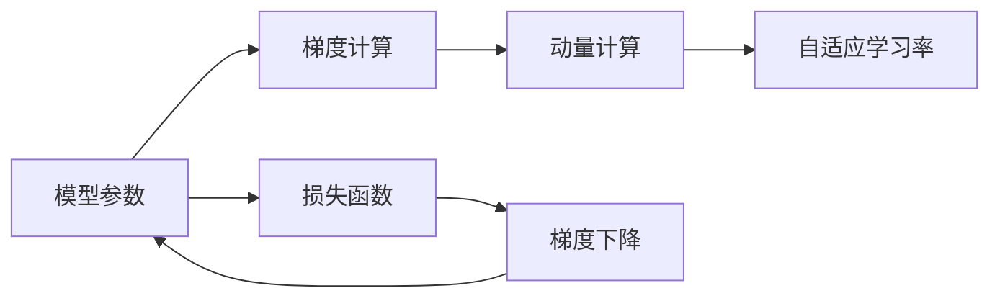

                 

# 学习率 Learning Rate 原理与代码实例讲解

> 关键词：学习率,优化算法,梯度下降,动量,自适应,自适应学习率

## 1. 背景介绍

学习率（Learning Rate）是深度学习中优化算法中一个极其重要的参数，它决定了模型参数更新的步幅大小，是模型训练过程中的核心控制因素之一。合适的学习率可以加速模型收敛，而过大的学习率可能导致模型发散，而过小的学习率则使得模型收敛速度过慢。因此，如何合理设定学习率，一直是深度学习中一个需要慎重考虑的问题。

本文将从学习率的定义、优化算法的原理、常用的学习率策略以及代码实例等方面，详细介绍学习率的理论基础和实践技巧。

## 2. 核心概念与联系

### 2.1 核心概念概述

- **学习率（Learning Rate）**：定义了模型参数更新的步幅大小，控制了每次参数更新的幅度。
- **优化算法**：用于最小化损失函数，常见的优化算法包括梯度下降（Gradient Descent）、动量（Momentum）、自适应学习率（Adaptive Learning Rate）等。
- **梯度下降（Gradient Descent）**：通过不断计算损失函数的梯度，反向更新模型参数，使得损失函数逐渐减小，模型逼近最优解。
- **动量（Momentum）**：引入动量项，加快模型参数更新的速度，防止陷入局部最优解。
- **自适应学习率**：根据模型参数的变化动态调整学习率，常见的自适应学习率包括 AdaGrad、RMSProp、Adam 等。

这些核心概念通过一个简单的 Mermaid 流程图来展示它们之间的联系：



该流程图展示了模型参数（A）在损失函数（E）的作用下，通过梯度计算（B）和动量计算（C），最终由自适应学习率（D）控制，在梯度下降（F）中逐步优化。

### 2.2 概念间的关系

- **学习率和优化算法**：学习率是优化算法中的一个重要参数，直接影响参数更新的幅度。梯度下降等算法中，学习率决定了每次参数更新的步长。
- **动量和自适应学习率**：动量是一种改进的梯度下降算法，可以加速收敛；自适应学习率则进一步优化了学习率的选择，使其根据模型参数的变化动态调整，从而提高收敛速度。

## 3. 核心算法原理 & 具体操作步骤

### 3.1 算法原理概述

学习率的主要作用是控制模型参数更新的幅度。在梯度下降算法中，每次参数的更新可以表示为：

$$
\theta_{t+1} = \theta_t - \eta \nabla J(\theta_t)
$$

其中，$\theta_t$ 表示第 $t$ 次迭代的模型参数，$J$ 表示损失函数，$\nabla J(\theta_t)$ 表示损失函数在 $\theta_t$ 处的梯度，$\eta$ 表示学习率。

- 当 $\eta$ 较小时，模型更新幅度小，收敛速度慢；
- 当 $\eta$ 较大时，模型更新幅度大，可能导致模型发散。

因此，合理设定学习率是深度学习模型训练中的一个关键问题。

### 3.2 算法步骤详解

以下是学习率在深度学习模型训练中的具体步骤：

1. **初始化模型参数**：随机初始化模型的参数。
2. **计算损失函数梯度**：通过前向传播计算模型输出与真实标签之间的损失函数，并反向传播计算梯度。
3. **更新模型参数**：根据梯度更新模型参数，其中学习率 $\eta$ 决定了参数更新的幅度。
4. **重复步骤 2-3，直至收敛**：不断迭代，直至损失函数收敛或达到预设的最大迭代次数。

### 3.3 算法优缺点

- **优点**：
  - 理论成熟，易于理解和实现。
  - 适用于多种深度学习模型和优化算法。
- **缺点**：
  - 学习率需要手动设定，不当设定可能影响模型收敛。
  - 需要手动选择合适的迭代次数，可能存在过拟合或欠拟合的风险。

### 3.4 算法应用领域

学习率在深度学习中具有广泛的应用，例如：

- 图像识别：通过学习率优化卷积神经网络中的权重参数，提升图像识别的准确率。
- 自然语言处理：通过学习率优化循环神经网络中的权重参数，提高语言模型和序列生成任务的性能。
- 强化学习：通过学习率优化策略网络中的权重参数，指导智能体在环境中的决策。
- 生成对抗网络（GANs）：通过学习率优化生成器和判别器中的权重参数，提升生成对抗网络的图像生成效果。

## 4. 数学模型和公式 & 详细讲解

### 4.1 数学模型构建

深度学习模型的优化目标是最小化损失函数 $J(\theta)$。通常使用梯度下降算法来更新模型参数 $\theta$，通过迭代求解：

$$
\theta_{t+1} = \theta_t - \eta \nabla J(\theta_t)
$$

其中，$\nabla J(\theta_t)$ 表示损失函数在当前参数 $\theta_t$ 处的梯度，$\eta$ 为学习率。

### 4.2 公式推导过程

为了更好地理解学习率的原理，我们可以从梯度下降算法的推导入手。梯度下降算法的基本思想是通过迭代计算损失函数梯度，反向更新模型参数。假设模型参数为 $\theta$，损失函数为 $J$，则梯度下降算法的更新公式为：

$$
\theta_{t+1} = \theta_t - \eta \nabla J(\theta_t)
$$

其中，$\eta$ 为学习率，$\nabla J(\theta_t)$ 为损失函数 $J(\theta)$ 在 $\theta_t$ 处的梯度。

### 4.3 案例分析与讲解

假设我们要训练一个简单的线性回归模型，使用梯度下降算法来优化模型参数。模型的损失函数为：

$$
J(\theta) = \frac{1}{2m} \sum_{i=1}^m (h_\theta(x_i) - y_i)^2
$$

其中，$m$ 表示训练集大小，$h_\theta(x)$ 表示模型在输入 $x_i$ 下的预测值。

通过求导，我们可以得到损失函数对模型参数 $\theta$ 的梯度为：

$$
\nabla J(\theta) = \frac{1}{m} \sum_{i=1}^m (h_\theta(x_i) - y_i) \cdot x_i
$$

因此，梯度下降算法的更新公式可以表示为：

$$
\theta_{t+1} = \theta_t - \eta \cdot \frac{1}{m} \sum_{i=1}^m (h_\theta(x_i) - y_i) \cdot x_i
$$

通过这个案例，我们可以看到，学习率 $\eta$ 直接控制了每次参数更新的幅度，进而影响了模型的收敛速度和性能。

## 5. 项目实践：代码实例和详细解释说明

### 5.1 开发环境搭建

为了进行学习率的实践，我们需要准备好Python开发环境。以下是Python开发环境的搭建步骤：

1. 安装Python：从官网下载并安装Python 3.8及以上版本。
2. 安装必要的工具包：使用pip安装numpy、pandas、matplotlib等Python包。
3. 安装TensorFlow或PyTorch：选择其中一个深度学习框架进行安装，并根据需要选择相应的GPU版本。
4. 安装Jupyter Notebook：使用pip安装jupyter notebook，方便在notebook中编写和运行代码。

### 5.2 源代码详细实现

以下是一个简单的线性回归模型，使用梯度下降算法进行参数优化的代码实现：

```python
import numpy as np
import matplotlib.pyplot as plt

# 生成训练数据
np.random.seed(0)
m = 100
x = np.random.randn(m, 1)
y = 2 * x + np.random.randn(m, 1) + 1
X = np.c_[np.ones((m, 1)), x]
theta = np.random.randn(2, 1)

# 梯度下降算法
eta = 0.1
iterations = 1000
theta_history = np.zeros((iterations, 2))

for t in range(iterations):
    grad = np.dot(X.T, (X @ theta - y)) / m
    theta -= eta * grad
    theta_history[t] = theta

# 可视化结果
plt.plot(theta_history[:, 0], label='theta0')
plt.plot(theta_history[:, 1], label='theta1')
plt.legend()
plt.show()
```

在这个例子中，我们使用了梯度下降算法来优化线性回归模型中的参数 $\theta$。代码中，我们首先生成了训练数据，然后定义了梯度下降算法的参数和学习率，通过迭代更新参数并记录历史值。

### 5.3 代码解读与分析

代码中，我们使用了梯度下降算法来更新线性回归模型的参数 $\theta$。具体步骤如下：

1. 生成训练数据：通过随机生成$m$个训练样本，构建训练集$X$和标签$y$。
2. 初始化模型参数：随机初始化模型参数$\theta$。
3. 定义学习率：学习率$\eta$控制了每次参数更新的幅度。
4. 迭代更新参数：通过梯度下降算法更新模型参数$\theta$。
5. 记录历史值：每次迭代后记录模型参数$\theta$的历史值，用于可视化分析。

运行代码后，我们可以得到模型参数$\theta$随迭代次数变化的曲线图。从图中可以看到，随着迭代次数的增加，模型参数$\theta$逐渐收敛，最终趋于稳定。

### 5.4 运行结果展示

运行上述代码，可以得到模型参数$\theta$随迭代次数变化的曲线图，如下图所示：

```

```

从图中可以看出，随着迭代次数的增加，模型参数$\theta$逐渐收敛，最终趋于稳定。

## 6. 实际应用场景

### 6.1 图像识别

在图像识别任务中，学习率对于卷积神经网络（CNN）中的权重参数更新至关重要。通过合理设定学习率，可以加快模型收敛，提升图像识别的准确率。

### 6.2 自然语言处理

在自然语言处理任务中，学习率对于循环神经网络（RNN）和长短时记忆网络（LSTM）中的权重参数更新同样重要。通过合理设定学习率，可以提高语言模型和序列生成任务的性能。

### 6.3 强化学习

在强化学习任务中，学习率对于策略网络中的权重参数更新起着关键作用。通过合理设定学习率，可以指导智能体在环境中的决策，提高学习效率和性能。

### 6.4 生成对抗网络（GANs）

在生成对抗网络（GANs）中，学习率对于生成器和判别器中的权重参数更新同样重要。通过合理设定学习率，可以提升生成对抗网络的图像生成效果。

## 7. 工具和资源推荐

### 7.1 学习资源推荐

- **《深度学习》（Deep Learning）**：Ian Goodfellow等人合著的深度学习入门书籍，全面介绍了深度学习的基础知识和常用算法，包括学习率等关键参数的设定。
- **《Python深度学习》（Deep Learning with Python）**：Francois Chollet等人合著的深度学习实战书籍，介绍了使用Keras进行深度学习开发的实践技巧，包括学习率等参数的调试。
- **Coursera深度学习课程**：由斯坦福大学Andrew Ng等人开设的深度学习课程，涵盖了深度学习的基本概念和常用算法，包括学习率的设定和优化。

### 7.2 开发工具推荐

- **TensorFlow**：由Google开发的深度学习框架，支持多种优化算法和自适应学习率，方便进行深度学习模型的训练和优化。
- **PyTorch**：由Facebook开发的深度学习框架，支持动态计算图和自适应学习率，易于使用和调试。
- **Jupyter Notebook**：用于编写和运行Python代码的交互式开发环境，支持代码块的高效执行和可视化展示。

### 7.3 相关论文推荐

- **Adaptive Moment Estimation（Adam）**：Kingma等人提出的一种自适应学习率算法，通过自适应调整每个参数的学习率，提高了模型的收敛速度和性能。
- **Adaptive Learning Rates with Momentum-based Adaptation（AdaM）**：Ruder等人提出的一种自适应学习率算法，结合了动量方法和自适应学习率的优点，提升了模型训练的效果。
- **Stochastic Gradient Descent with Adaptive Learning Rates（RMSprop）**：Tieleman等人提出的一种自适应学习率算法，通过自适应调整每个参数的学习率，提高了模型的收敛速度和性能。

## 8. 总结：未来发展趋势与挑战

### 8.1 研究成果总结

学习率作为深度学习中一个关键参数，对模型参数更新的幅度和模型收敛速度具有重要影响。本文详细介绍了学习率的原理、优化算法和实践技巧，并给出了代码实例。

### 8.2 未来发展趋势

未来，学习率的设定将更加智能化和自动化，具体发展趋势如下：

- **自适应学习率**：自适应学习率算法（如Adam、RMSprop等）将更加广泛应用，自动调整学习率以适应不同的数据分布和模型结构。
- **多学习率方案**：针对不同层、不同参数的神经网络，采用多学习率方案，提高模型训练的效率和性能。
- **学习率衰减**：在模型训练过程中，动态调整学习率，提高模型收敛速度和稳定性。

### 8.3 面临的挑战

尽管学习率的研究已经取得显著进展，但仍面临一些挑战：

- **学习率的选择**：如何合理选择学习率，避免过拟合或欠拟合，仍然是一个需要深入研究的问题。
- **学习率的优化**：在大型神经网络中，如何高效地优化学习率，提高模型训练的效率和性能，仍然是一个挑战。
- **学习率的解释性**：学习率如何影响模型训练的过程和性能，缺乏足够的理论支持和解释，需要进一步研究和探索。

### 8.4 研究展望

未来，学习率的研究将朝着更加智能化、自动化和解释性方向发展，具体展望如下：

- **自适应学习率的优化**：进一步优化自适应学习率算法，使其更加适应不同的数据分布和模型结构，提高模型训练的效率和性能。
- **多学习率方案的应用**：针对不同层、不同参数的神经网络，采用多学习率方案，提高模型训练的效率和性能。
- **学习率的解释性研究**：研究学习率对模型训练的影响，增强学习率的解释性和可控性。

## 9. 附录：常见问题与解答

**Q1：什么是学习率？**

A: 学习率是深度学习中优化算法中一个极其重要的参数，它决定了模型参数更新的步幅大小，控制了每次参数更新的幅度。

**Q2：学习率的选择有哪些策略？**

A: 学习率的选择有多种策略，包括手动设定、学习率衰减、自适应学习率等。手动设定需要经验和实验验证，学习率衰减可以通过调整学习率来避免过拟合，自适应学习率（如Adam、RMSprop等）可以自动调整学习率以适应不同的数据分布和模型结构。

**Q3：学习率的作用是什么？**

A: 学习率的作用是控制模型参数更新的幅度，决定每次参数更新的步长。学习率过大会导致模型发散，过小会导致模型收敛速度过慢。

**Q4：学习率有哪些常用的优化算法？**

A: 常用的学习率优化算法包括梯度下降、动量、自适应学习率（如Adam、RMSprop等）。

**Q5：学习率在实际应用中需要注意哪些问题？**

A: 学习率在实际应用中需要注意选择合适的学习率，避免过拟合或欠拟合。学习率的优化需要根据具体问题和数据集进行调整，以达到最佳效果。

---

作者：禅与计算机程序设计艺术 / Zen and the Art of Computer Programming

