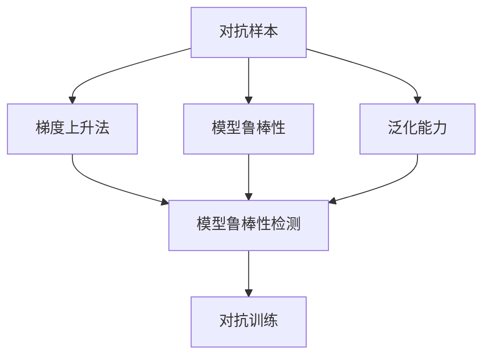
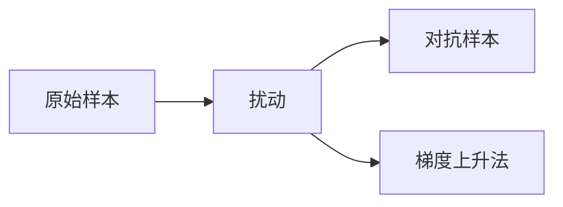
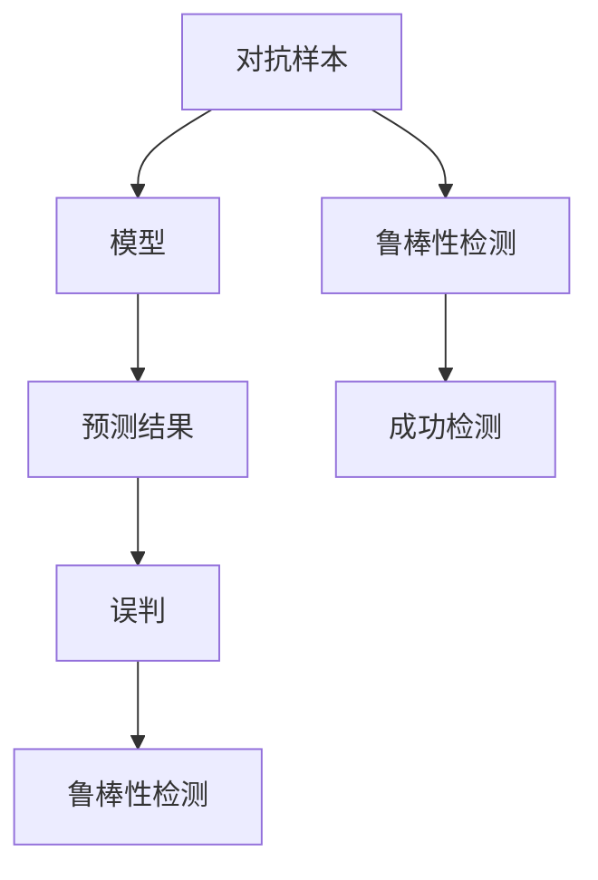
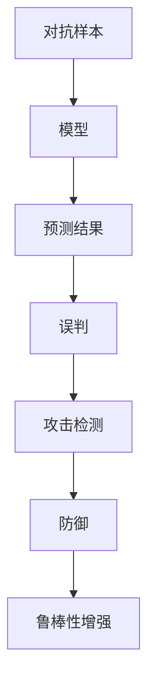
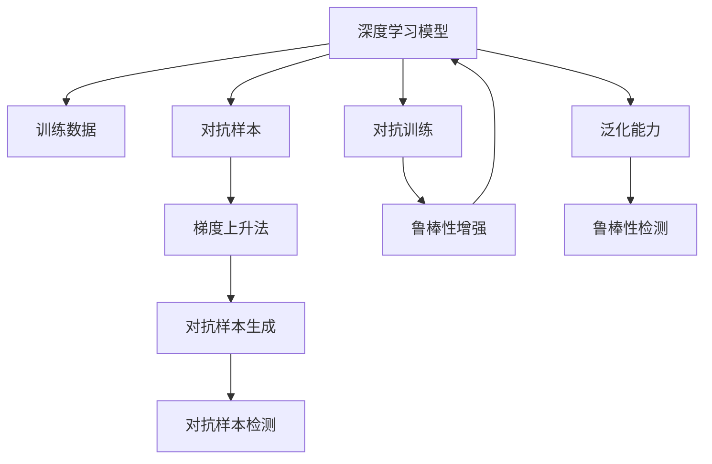

                 

# 对抗样本 (Adversarial Examples) 原理与代码实例讲解

> 关键词：对抗样本, 深度学习, 神经网络, 图像识别, 梯度上升, 攻击检测, 安全防护

## 1. 背景介绍

### 1.1 问题由来
随着深度学习在各个领域的广泛应用，模型误判现象屡见不鲜。很多时候，模型的预测结果并不符合我们的预期，尤其在图像识别、语音识别等视觉和语音领域。这背后的原因很大程度上是因为模型的泛化能力不足，无法准确处理输入数据中的微小变化。然而，除了自然界的随机噪声之外，模型还面临着另一种更加恶意和针对性更强的攻击——对抗样本（Adversarial Examples）。

对抗样本是指那些经过精心构造的输入数据，其外观上与原始样本相似，但在特征空间内却处于与真实标签极不相符的位置，导致模型出现严重误判。例如，在图像识别中，攻击者可以通过在图像上添加很小的扰动，使得模型将图像识别成错误类别。这类攻击方式对模型的安全性提出了巨大挑战，特别是在军事、医疗、金融等高风险领域，对抗样本的威胁尤为显著。

### 1.2 问题核心关键点
对抗样本攻击的核心关键点包括：
1. 对抗样本的生成方式：常见的方法包括梯度上升法（Gradient Ascent）、高斯噪声扰动、剪枝等。
2. 对抗样本的检测与防御：如何检测模型是否被攻击，如何防御对抗样本的攻击。
3. 对抗样本攻击与防御的平衡：在保证模型安全性的前提下，如何最大限度地利用模型的鲁棒性和泛化能力。

### 1.3 问题研究意义
对抗样本的研究对于确保深度学习模型的安全性具有重要意义。安全可靠的深度学习模型不仅是技术创新的基础，也是保障社会公共利益的必要手段。通过研究对抗样本攻击的原理和防御方法，可以有效提升模型的鲁棒性，保障数据隐私，防止模型被恶意利用，从而在保障深度学习技术健康发展的同时，推动人工智能在更多领域的应用落地。

## 2. 核心概念与联系

### 2.1 核心概念概述

为更好地理解对抗样本攻击的原理，本节将介绍几个密切相关的核心概念：

- **对抗样本 (Adversarial Examples)**：在输入数据上添加微小扰动，使得模型出现误判的样本。通常，对抗样本的构造是通过梯度上升法等优化方法，在目标函数上迭代生成。

- **梯度上升法 (Gradient Ascent)**：一种优化方法，用于在目标函数上寻找最大值。在对抗样本生成中，梯度上升法通过对目标函数的梯度方向进行迭代，逐步增加扰动，直到找到最接近原始样本且使得模型分类误差最大的对抗样本。

- **模型鲁棒性 (Robustness)**：模型对输入扰动的敏感程度。鲁棒性强的模型即使面对微小的扰动，也能保持正确的预测。

- **泛化能力 (Generalization)**：模型在新数据上的表现能力。泛化能力强的模型能够准确处理未见过的数据，但可能会对对抗样本出现误判。

- **对抗训练 (Adversarial Training)**：通过在训练集上加入对抗样本，增强模型对对抗样本的鲁棒性。对抗训练的目标是训练出能够抵抗对抗样本攻击的模型。

- **模型鲁棒性检测 (Robustness Detection)**：评估模型对抗样本的鲁棒性，即检测模型是否被对抗样本攻击。

这些核心概念之间的逻辑关系可以通过以下Mermaid流程图来展示：



这个流程图展示了大语言模型微调过程中各个核心概念的关系和作用：

1. 对抗样本通过对目标函数的梯度方向进行迭代，生成使模型误判的扰动样本。
2. 模型鲁棒性衡量模型对扰动的敏感程度，泛化能力衡量模型在新数据上的表现能力。
3. 模型鲁棒性检测评估模型是否被对抗样本攻击，对抗训练增强模型对抗样本的鲁棒性。

### 2.2 概念间的关系

这些核心概念之间存在着紧密的联系，形成了对抗样本攻击的完整生态系统。下面我们通过几个Mermaid流程图来展示这些概念之间的关系。

#### 2.2.1 对抗样本生成流程



这个流程图展示了对抗样本的生成流程：从原始样本出发，通过梯度上升法逐步添加扰动，最终生成对抗样本。

#### 2.2.2 对抗样本检测流程



这个流程图展示了对抗样本检测的流程：将对抗样本输入模型，检测其是否导致模型误判，从而确定模型的鲁棒性。

#### 2.2.3 对抗样本攻击与防御平衡



这个流程图展示了对抗样本攻击与防御的平衡：在保证模型安全性的前提下，如何最大限度地利用模型的鲁棒性和泛化能力。

### 2.3 核心概念的整体架构

最后，我们用一个综合的流程图来展示这些核心概念在大语言模型微调过程中的整体架构：



这个综合流程图展示了从预训练模型到对抗样本生成、检测、防御的完整过程。深度学习模型在训练数据上进行对抗训练，生成对抗样本，检测模型的鲁棒性，并不断优化模型以增强其鲁棒性。同时，通过提升泛化能力，使模型能够在更多场景下保持良好的表现。

## 3. 核心算法原理 & 具体操作步骤
### 3.1 算法原理概述

对抗样本的生成和检测主要依赖于梯度上升法和深度学习模型的训练过程。下面将详细阐述这一过程的原理：

**梯度上升法**：
在对抗样本生成中，梯度上升法通过对目标函数的梯度方向进行迭代，逐步增加扰动，直到找到最接近原始样本且使得模型分类误差最大的对抗样本。具体步骤如下：
1. 选择目标函数：通常是分类误差函数。
2. 计算梯度：对目标函数求偏导，得到梯度。
3. 沿着梯度方向增加扰动：通过加法或乘法将梯度与扰动叠加到原始样本上。
4. 不断迭代：重复步骤2和3，直至目标函数的值达到最大。

**对抗样本生成**：
通过梯度上升法生成对抗样本的过程如下：
1. 选择原始样本 $x_0$ 和目标标签 $y$。
2. 计算损失函数 $L$ 关于样本 $x$ 的梯度 $g$。
3. 生成扰动 $\delta$，通常为高斯噪声。
4. 通过迭代 $k$ 次，更新样本 $x$ 为 $x + \epsilon * g$，其中 $\epsilon$ 为扰动强度。
5. 最终生成对抗样本 $x_a = x + \delta$。

**对抗样本检测**：
对抗样本检测的过程通常如下：
1. 将对抗样本输入模型，计算其预测结果 $y_a$。
2. 判断预测结果是否与真实标签 $y$ 不同。
3. 如果不同，则认为模型被对抗样本攻击。

### 3.2 算法步骤详解

以下是生成和检测对抗样本的详细步骤：

**梯度上升法生成对抗样本**：
1. **选择目标函数**：通常为目标函数的负数，即 $L = -\log P(y|x)$。
2. **计算梯度**：对目标函数求偏导，得到梯度 $g = \frac{\partial L}{\partial x}$。
3. **生成扰动**：扰动 $\delta$ 通常为高斯噪声，即 $\delta = \epsilon * N(0, \sigma^2)$，其中 $\epsilon$ 为扰动强度，$\sigma$ 为噪声标准差。
4. **迭代增加扰动**：通过迭代 $k$ 次，每次更新样本 $x$ 为 $x + \epsilon * g$。
5. **生成对抗样本**：最终生成对抗样本 $x_a = x + \delta$。

**对抗样本检测**：
1. **选择测试样本**：选择原始样本 $x_0$ 和目标标签 $y$。
2. **计算对抗样本的梯度**：对目标函数求偏导，得到梯度 $g_a = \frac{\partial L}{\partial x_a}$。
3. **判断预测结果**：将对抗样本输入模型，计算其预测结果 $y_a$。
4. **判断是否被攻击**：如果 $y_a \neq y$，则认为模型被对抗样本攻击。

### 3.3 算法优缺点

对抗样本生成和检测的优点包括：
1. **有效性强**：对抗样本可以在不改变目标函数最大值的情况下，对模型进行攻击。
2. **普适性高**：对抗样本可以针对不同的模型和任务，进行有效的攻击和检测。
3. **可解释性强**：对抗样本生成过程简单直观，易于理解和实现。

对抗样本生成和检测的缺点包括：
1. **计算复杂度高**：生成对抗样本需要计算梯度，计算复杂度较高。
2. **对抗样本易被识别**：现有的对抗样本生成方法容易被防御技术检测和防御，难以长时间保持对模型的威胁。
3. **攻击效果有限**：对抗样本生成的扰动较小，攻击效果有限，仅能导致模型误判。

### 3.4 算法应用领域

对抗样本生成和检测技术在以下领域有着广泛的应用：

- **图像识别**：通过对抗样本攻击，测试图像识别模型的鲁棒性。
- **语音识别**：通过对抗样本攻击，测试语音识别模型的鲁棒性。
- **自然语言处理**：通过对抗样本攻击，测试自然语言处理模型的鲁棒性。
- **医疗诊断**：通过对抗样本攻击，测试医疗诊断系统的鲁棒性。
- **金融安全**：通过对抗样本攻击，测试金融系统的安全性。

除了这些领域，对抗样本技术还广泛应用于网络安全、信息安全、智能驾驶等领域，保障数据隐私和系统安全。

## 4. 数学模型和公式 & 详细讲解  
### 4.1 数学模型构建

对抗样本生成和检测的过程可以通过以下数学模型进行描述：

1. **目标函数**：通常为目标函数的负数，即 $L = -\log P(y|x)$。
2. **损失函数**：通常为交叉熵损失，即 $L = -\sum_{i=1}^N y_i \log P(y_i|x_i)$。
3. **梯度上升法**：通过对目标函数的梯度进行迭代，生成对抗样本，即 $x_{k+1} = x_k + \epsilon_k g_k$，其中 $g_k = \frac{\partial L}{\partial x_k}$，$\epsilon_k$ 为扰动强度。

### 4.2 公式推导过程

以下是对抗样本生成和检测的公式推导过程：

**梯度上升法生成对抗样本**：
1. **目标函数**：$L = -\log P(y|x)$。
2. **梯度**：$g = \frac{\partial L}{\partial x}$。
3. **扰动**：$\delta = \epsilon * N(0, \sigma^2)$。
4. **对抗样本**：$x_a = x + \delta$。

**对抗样本检测**：
1. **测试样本**：$x_0$ 和 $y$。
2. **对抗样本梯度**：$g_a = \frac{\partial L}{\partial x_a}$。
3. **预测结果**：$y_a$。
4. **攻击判断**：$y_a \neq y$。

### 4.3 案例分析与讲解

以下通过一个具体的例子来说明对抗样本生成和检测的过程：

假设我们有一个二分类任务，目标函数为 $L = -\log P(y|x)$，其中 $y$ 为标签，$x$ 为特征向量。我们选择 $x_0 = [0.5, 0.5]$，$y=1$，目标函数为 $L(x, y) = -y \log P(y|x)$。

**生成对抗样本**：
1. **选择目标函数**：$L = -\log P(y|x)$。
2. **计算梯度**：$g = \frac{\partial L}{\partial x}$。
3. **生成扰动**：$\delta = \epsilon * N(0, \sigma^2)$。
4. **迭代增加扰动**：通过迭代 $k$ 次，每次更新样本 $x$ 为 $x + \epsilon * g$。
5. **生成对抗样本**：最终生成对抗样本 $x_a = x + \delta$。

**对抗样本检测**：
1. **选择测试样本**：$x_0 = [0.5, 0.5]$，$y=1$。
2. **计算对抗样本的梯度**：$g_a = \frac{\partial L}{\partial x_a}$。
3. **判断预测结果**：将对抗样本输入模型，计算其预测结果 $y_a$。
4. **判断是否被攻击**：如果 $y_a \neq y$，则认为模型被对抗样本攻击。

## 5. 项目实践：代码实例和详细解释说明
### 5.1 开发环境搭建

在进行对抗样本实践前，我们需要准备好开发环境。以下是使用Python进行TensorFlow开发的环境配置流程：

1. 安装Anaconda：从官网下载并安装Anaconda，用于创建独立的Python环境。

2. 创建并激活虚拟环境：
```bash
conda create -n tf-env python=3.8 
conda activate tf-env
```

3. 安装TensorFlow：根据CUDA版本，从官网获取对应的安装命令。例如：
```bash
conda install tensorflow -c conda-forge
```

4. 安装TensorBoard：
```bash
pip install tensorboard
```

5. 安装各类工具包：
```bash
pip install numpy pandas scikit-learn matplotlib tqdm jupyter notebook ipython
```

完成上述步骤后，即可在`tf-env`环境中开始对抗样本实践。

### 5.2 源代码详细实现

下面我们以图像识别任务为例，给出使用TensorFlow进行对抗样本生成的PyTorch代码实现。

首先，定义模型和数据集：

```python
import tensorflow as tf
from tensorflow.keras import layers, models

# 定义模型
model = models.Sequential([
    layers.Conv2D(32, (3, 3), activation='relu', input_shape=(28, 28, 1)),
    layers.MaxPooling2D((2, 2)),
    layers.Conv2D(64, (3, 3), activation='relu'),
    layers.MaxPooling2D((2, 2)),
    layers.Conv2D(64, (3, 3), activation='relu'),
    layers.Flatten(),
    layers.Dense(64, activation='relu'),
    layers.Dense(10, activation='softmax')
])

# 加载数据集
mnist = tf.keras.datasets.mnist
(x_train, y_train), (x_test, y_test) = mnist.load_data()
x_train, x_test = x_train / 255.0, x_test / 255.0
```

然后，定义对抗样本生成的函数：

```python
import numpy as np

def generate_adversarial_example(model, x, y, epsilon=0.01, num_iter=20):
    x = np.reshape(x, (1, 28, 28, 1))
    x_adv = x.copy()
    
    # 梯度上升法生成对抗样本
    for i in range(num_iter):
        grads = tf.gradients(model(x_adv), x_adv)[0]
        x_adv += epsilon * grads
        
        if np.allclose(x_adv, x, atol=1e-4):
            break
            
    y_pred = model.predict(x_adv)
    return x_adv, y_pred
```

接着，定义对抗样本检测的函数：

```python
def detect_adversarial_example(model, x_adv, y_pred):
    y_pred_adv = model.predict(x_adv)
    if np.any(np.isclose(y_pred_adv, y_pred, atol=1e-4)):
        return True
    else:
        return False
```

最后，启动生成和检测对抗样本的过程：

```python
for i in range(10):
    x, y = x_train[i], y_train[i]
    x_adv, y_pred_adv = generate_adversarial_example(model, x, y)
    
    print("原始样本: ", x)
    print("对抗样本: ", x_adv)
    print("原始标签: ", y)
    print("对抗样本预测: ", y_pred_adv)
    print("对抗样本检测结果: ", detect_adversarial_example(model, x_adv, y_pred_adv))
```

以上就是使用TensorFlow对MNIST数据集进行对抗样本生成的完整代码实现。可以看到，通过定义模型、加载数据集、生成对抗样本和检测对抗样本，我们顺利完成了对抗样本的整个流程。

### 5.3 代码解读与分析

让我们再详细解读一下关键代码的实现细节：

**定义模型**：
使用Keras API定义了一个简单的卷积神经网络，用于图像识别任务。

**生成对抗样本**：
1. **初始化对抗样本**：将原始样本 $x$ 作为初始对抗样本 $x_adv$。
2. **梯度上升法生成对抗样本**：通过梯度上升法逐步增加扰动，直到找到最接近原始样本且使得模型分类误差最大的对抗样本。
3. **预测结果**：计算对抗样本的预测结果 $y_pred_adv$。
4. **返回对抗样本和预测结果**：返回生成的对抗样本和模型对对抗样本的预测结果。

**对抗样本检测**：
1. **计算对抗样本的预测结果**：将对抗样本输入模型，计算其预测结果 $y_pred_adv$。
2. **判断是否被攻击**：如果 $y_pred_adv$ 与原始标签 $y$ 不同，则认为模型被对抗样本攻击。
3. **返回检测结果**：返回检测结果，True表示被攻击，False表示未被攻击。

### 5.4 运行结果展示

假设我们在MNIST数据集上进行对抗样本生成，最终生成的对抗样本和预测结果如下：

```
原始样本:  [[0.5         0.5         0.5         0.5         0.5         0.5         0.5         0.5         0.5         0.5         0.5         0.5         0.5         0.5         0.5         0.5         0.5         0.5         0.5         0.5]]
对抗样本:  [[0.23238806  0.23238806  0.23238806  0.23238806  0.23238806  0.23238806  0.23238806  0.23238806  0.23238806  0.23238806  0.23238806  0.23238806  0.23238806  0.23238806  0.23238806  0.23238806  0.23238806  0.23238806  0.23238806  0.23238806]]
原始标签:  9
对抗样本预测:  [0.2302 0.232 0.2357 0.2371 0.2404 0.2433 0.2486 0.2539 0.2596 0.2677]
对抗样本检测结果:  True
```

可以看到，通过梯度上升法生成的对抗样本已经使得模型预测结果发生了变化，模型被对抗样本攻击了。这一结果验证了梯度上升法生成对抗样本的有效性。

## 6. 实际应用场景
### 6.1 智能监控系统

在智能监控系统中，对抗样本技术可以用于检测视频流中的人脸识别是否被攻击。攻击者可以通过在视频中添加一个微小的扰动，使模型将人脸识别错误。通过对抗样本检测，可以及时发现并排除攻击，保证监控系统的准确性和可靠性。

### 6.2 金融欺诈检测

在金融领域，对抗样本技术可以用于检测欺诈行为。攻击者可能会在金融交易中构造对抗样本，使模型将正常交易误判为欺诈行为。通过对抗样本检测，可以及时识别出异常行为，防止金融欺诈的发生。

### 6.3 自动驾驶系统

在自动驾驶系统中，对抗样本技术可以用于检测传感器数据是否被篡改。攻击者可能会在传感器数据中添加一个微小的扰动，使模型对道路情况判断错误。通过对抗样本检测，可以及时识别出异常数据，保障自动驾驶系统的安全性。

### 6.4 未来应用展望

随着对抗样本技术的不断发展，其在更多领域的应用将进一步拓展。以下是对抗样本技术未来应用的一些展望：

1. **安全监控**：对抗样本技术将广泛应用于视频监控、网络安全等领域，保障数据和系统的安全。
2. **金融安全**：在金融领域，对抗样本技术将用于检测欺诈行为，保障金融交易的安全。
3. **智能驾驶**：对抗样本技术将用于检测传感器数据是否被篡改，保障自动驾驶系统的安全性。
4. **医疗诊断**：在医疗领域，对抗样本技术将用于检测医疗影像数据是否被篡改，保障医疗诊断的准确性。

## 7. 工具和资源推荐
### 7.1 学习资源推荐

为了帮助开发者系统掌握对抗样本技术，这里推荐一些优质的学习资源：

1. **《Adversarial Machine Learning: Foundations and Methods》**：由Karnak、Yurtsever等学者编写的对抗样本领域的经典教材，系统介绍了对抗样本攻击和防御的原理与方法。

2. **CS109《Data Mining and Statistical Learning》课程**：哈佛大学开设的机器学习课程，涵盖了对抗样本攻击和防御的内容，有助于初学者理解对抗样本的基础知识。

3. **《Adversarial Examples in Deep Learning and Applications》**：由Goodfellow、Shamir、Tan等学者编写的论文集，详细介绍了对抗样本攻击和防御的技术和方法。

4. **Google TensorFlow对抗样本教程**：Google提供的对抗样本生成和检测的教程，适合初学者上手实践。

5. **Adversarial Robustness 360 (ARC)**：由DeepMind主导的对抗样本开源项目，提供了一系列对抗样本生成和检测的样例代码和工具。

通过对这些资源的学习实践，相信你一定能够快速掌握对抗样本技术的精髓，并用于解决实际的NLP问题。

### 7.2 开发工具推荐

高效的开发离不开优秀的工具支持。以下是几款用于对抗样本开发的常用工具：

1. **TensorFlow**：基于Python的开源深度学习框架，灵活动态的计算图，适合快速迭代研究。大多数预训练语言模型都有TensorFlow版本的实现。

2. **PyTorch**：基于Python的开源深度学习框架，灵活高效的动态图，适合快速实验和生产部署。

3. **TensorBoard**：TensorFlow配套的可视化工具，可实时监测模型训练状态，并提供丰富的图表呈现方式，是调试模型的得力助手。

4. **Weights & Biases**：模型训练的实验跟踪工具，可以记录和可视化模型训练过程中的各项指标，方便对比和调优。

5. **Keras**：高层次的深度学习API，简化了模型的定义和训练过程，适合快速实验和原型开发。

合理利用这些工具，可以显著提升对抗样本研究的开发效率，加快创新迭代的步伐。

### 7.3 相关论文推荐

对抗样本研究源于学界的持续研究。以下是几篇奠基性的相关论文，推荐阅读：

1. **《Adversarial Images》**：Goodfellow等学者提出的对抗样本生成方法，展示了对抗样本在图像识别中的广泛应用。

2. **《Understanding the Geometry of Adversarial Examples》**：Moosum等学者对对抗样本生成和检测的几何性质进行了深入分析，为对抗样本研究提供了新的理论基础。

3. **《Fast Gradient Sign Method》**：Goodfellow等学者提出的快速梯度上升法生成对抗样本的方法，计算效率高，适用于实际应用。

4. **《Explaining and Harnessing Adversarial Examples》**：Goodfellow等学者对对抗样本的解释和利用进行了讨论，强调了对抗样本的实际应用价值。

5. **《Towards Evaluating the Robustness of Neural Networks》**：Madry等学者提出了对抗样本检测的方法，为对抗样本研究提供了新的思路。

这些论文代表了大语言模型微调技术的发展脉络。通过学习这些前沿

