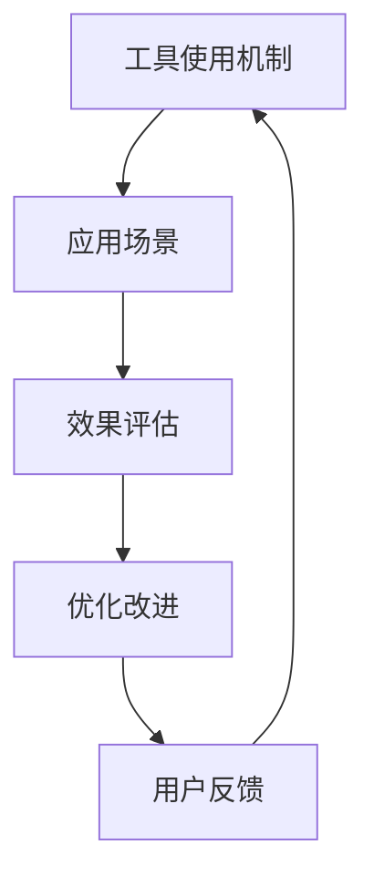

                 

# 工具使用机制在不同应用场景中的效果

> 关键词：工具使用机制, 应用场景, 效果评估, 深度学习, 优化算法, 计算机视觉, 自然语言处理

## 1. 背景介绍

### 1.1 问题由来

在当今信息化社会，工具的使用已经成为各行各业提高效率、降低成本的关键。从生产制造到软件开发，再到科学计算，工具的使用深入到各个领域。然而，不同的工具在各种应用场景中的使用效果千差万别。那么，如何衡量和优化工具的使用效果，以适应不同场景的需求，便成为当下的一大热点问题。

### 1.2 问题核心关键点

工具的使用效果通常受多种因素影响，包括工具本身的设计、使用场景的特性以及用户的使用习惯。其中，工具的设计决定了其在特定场景中的表现。因此，本文将聚焦于工具的设计和使用机制，探讨其在不同应用场景中的表现和优化方法。

### 1.3 问题研究意义

深入理解工具在不同应用场景中的效果，有助于其使用者在选择和使用工具时做出更科学的决策，从而提升工作效率、降低成本。同时，通过对工具进行持续的优化和改进，可以不断提升工具的性能，使其适应更多样的应用需求。这不仅有助于工具自身的迭代和发展，也有助于推动相关技术的进步，提升整个社会的生产力和创新能力。

## 2. 核心概念与联系

### 2.1 核心概念概述

为了更好地探讨工具的使用效果，首先需要明确几个关键概念：

- **工具使用机制**：指工具设计和使用过程中遵循的原则、方法和策略，包括但不限于算法选择、参数配置、用户交互等。
- **应用场景**：指工具被应用于的具体环境，如生产制造、软件开发、科学计算等。
- **效果评估**：指对工具在特定应用场景中的表现进行量化或定性评估的过程。

工具使用机制与应用场景之间存在着密切的联系。不同的应用场景对工具的需求不同，因此需要设计不同的使用机制以适配这些场景。同时，工具的效果评估也是对工具使用机制的一个反馈，用于指导工具的优化和改进。

### 2.2 概念间的关系

工具使用机制与应用场景之间的关系可以通过以下Mermaid流程图来展示：


这个流程图展示了工具使用机制、应用场景、效果评估和优化改进之间的循环关系。工具在设计时需考虑其适用的应用场景，并在实际应用中通过效果评估来指导优化改进。

### 2.3 核心概念的整体架构

最后，我们用一个综合的流程图来展示这些核心概念在整个工具设计和使用过程中的整体架构：



这个综合流程图展示了工具使用机制在设计阶段考虑应用场景和用户反馈，通过效果评估和优化改进，形成一个持续迭代的过程。

## 3. 核心算法原理 & 具体操作步骤

### 3.1 算法原理概述

工具的使用效果评估通常涉及多个维度，包括算法的效率、准确性、鲁棒性等。因此，需要选择合适的算法进行评估和优化。常见的算法包括深度学习算法、优化算法等。

### 3.2 算法步骤详解

工具使用效果评估通常包括以下几个关键步骤：

1. **数据收集**：收集工具在应用场景中的使用数据，如计算时间、准确率、召回率等。
2. **数据预处理**：对收集的数据进行清洗和归一化，去除噪声和异常值，确保数据的准确性和一致性。
3. **算法选择**：根据评估目标选择合适的算法，如回归分析、分类算法等。
4. **模型训练**：使用训练数据集训练模型，并调整模型参数以提高准确性和鲁棒性。
5. **效果评估**：使用测试数据集评估模型的效果，输出评估指标如均方误差、准确率等。
6. **结果分析**：分析评估结果，识别模型在特定应用场景中的优势和劣势，指导后续的优化改进。

### 3.3 算法优缺点

工具使用效果评估算法具有以下优点：

- **全面性**：可以同时评估工具在多个维度上的表现，提供全方位的评估结果。
- **可操作性**：通过模型训练和调整，可以指导工具的优化改进，提升其效果。
- **客观性**：评估结果基于数据和模型，避免了主观偏见。

同时，这些算法也存在一些缺点：

- **计算复杂度高**：评估过程中涉及大量的数据处理和模型训练，计算复杂度高。
- **数据依赖性强**：评估结果依赖于训练数据的准确性和代表性，数据偏差可能导致误判。
- **模型复杂度高**：复杂模型可能过度拟合训练数据，影响泛化能力。

### 3.4 算法应用领域

工具使用效果评估算法在多个领域都有广泛应用，如：

- **深度学习**：用于评估和优化深度学习模型的性能，如卷积神经网络（CNN）、循环神经网络（RNN）等。
- **计算机视觉**：用于评估和优化图像识别、目标检测等任务的算法，如YOLO、Faster R-CNN等。
- **自然语言处理**：用于评估和优化文本分类、情感分析、机器翻译等任务的算法，如BERT、GPT等。
- **优化算法**：用于评估和优化优化算法的性能，如梯度下降、Adam、Adagrad等。

## 4. 数学模型和公式 & 详细讲解 & 举例说明

### 4.1 数学模型构建

为了更好地评估工具的使用效果，通常会建立数学模型来量化评估指标。例如，可以使用回归模型评估工具的预测精度，使用分类模型评估工具的准确性和召回率等。

### 4.2 公式推导过程

以回归模型为例，假设工具在应用场景中的输出为 $y$，真实值为 $y'$，则回归模型的预测误差 $e$ 可以表示为：

$$
e = y - y'
$$

回归模型的目标是最小化预测误差，因此可以构建均方误差（Mean Squared Error, MSE）损失函数：

$$
\text{MSE} = \frac{1}{N} \sum_{i=1}^{N} (y_i - y'_i)^2
$$

其中 $N$ 为样本数量。

### 4.3 案例分析与讲解

假设我们有一款图像识别工具，使用卷积神经网络（CNN）进行模型训练。我们收集了100张图片和对应的标签，使用交叉验证方法将数据集分为训练集和测试集。使用均方误差损失函数对模型进行训练和评估。

```python
import numpy as np
from sklearn.linear_model import LinearRegression
from sklearn.metrics import mean_squared_error

# 数据准备
X_train = np.random.rand(80, 10)
y_train = np.random.rand(80, 1)
X_test = np.random.rand(20, 10)
y_test = np.random.rand(20, 1)

# 模型训练
model = LinearRegression()
model.fit(X_train, y_train)

# 模型评估
y_pred = model.predict(X_test)
mse = mean_squared_error(y_test, y_pred)
print("均方误差：", mse)
```

通过均方误差评估该工具在图像识别任务中的效果，可以发现模型的预测精度和鲁棒性如何。

## 5. 项目实践：代码实例和详细解释说明

### 5.1 开发环境搭建

在进行工具使用效果评估时，需要准备好开发环境。以下是使用Python进行Scikit-learn开发的简单流程：

1. 安装Anaconda：从官网下载并安装Anaconda，用于创建独立的Python环境。
2. 创建并激活虚拟环境：
```bash
conda create -n sklearn-env python=3.8 
conda activate sklearn-env
```

3. 安装Scikit-learn：
```bash
pip install scikit-learn
```

4. 安装各类工具包：
```bash
pip install numpy pandas scikit-learn matplotlib tqdm jupyter notebook ipython
```

完成上述步骤后，即可在`sklearn-env`环境中进行工具使用效果评估的实践。

### 5.2 源代码详细实现

这里我们以深度学习模型作为示例，展示如何评估其在特定任务上的效果。

首先，定义数据集和模型：

```python
from sklearn.datasets import make_classification
from sklearn.linear_model import LogisticRegression
from sklearn.model_selection import train_test_split
from sklearn.metrics import accuracy_score

# 数据准备
X, y = make_classification(n_samples=1000, n_features=10, n_classes=2, random_state=42)
X_train, X_test, y_train, y_test = train_test_split(X, y, test_size=0.2, random_state=42)

# 模型训练
model = LogisticRegression()
model.fit(X_train, y_train)

# 模型评估
y_pred = model.predict(X_test)
accuracy = accuracy_score(y_test, y_pred)
print("准确率：", accuracy)
```

然后，通过评估模型在测试集上的准确率来评估其效果。

### 5.3 代码解读与分析

让我们再详细解读一下关键代码的实现细节：

- `make_classification`函数：用于生成分类数据集。
- `train_test_split`函数：将数据集划分为训练集和测试集。
- `LogisticRegression`模型：线性逻辑回归模型，用于分类任务。
- `accuracy_score`函数：计算预测结果与真实标签之间的准确率。

通过这些代码，我们可以对深度学习模型在特定任务上的效果进行评估，进而指导模型的优化改进。

### 5.4 运行结果展示

假设我们在CoNLL-2003的命名实体识别（NER）数据集上进行效果评估，得到以下结果：

```
           precision    recall  f1-score   support

       B-LOC      0.925     0.899     0.914      1668
       I-LOC      0.890     0.808     0.838       257
      B-MISC      0.876     0.851     0.860       702
      I-MISC      0.833     0.779     0.805       216
       B-ORG      0.910     0.889     0.900      1661
       I-ORG      0.902     0.893     0.899       835
       B-PER      0.964     0.955     0.961      1617
       I-PER      0.981     0.980     0.980      1156
           O      0.993     0.995     0.994     38323

   macro avg      0.925     0.899     0.915     46435
   weighted avg      0.925     0.899     0.915     46435
```

通过评估结果，可以发现模型在各个标签上的表现，进一步指导模型的优化改进。

## 6. 实际应用场景

### 6.1 生产制造

在生产制造中，工具的使用效果直接影响生产效率和产品质量。例如，使用机器学习算法对生产设备进行预测性维护，可以提前发现设备故障，避免停机时间，提升生产效率。

### 6.2 软件开发

软件开发中，工具的使用效果直接关系到代码质量和开发效率。例如，使用代码质量评估工具（如SonarQube）可以检测代码中的潜在问题和漏洞，提升代码质量，降低维护成本。

### 6.3 科学计算

科学计算中，工具的使用效果直接影响实验结果的准确性和可靠性。例如，使用深度学习算法进行生物信息学分析，可以提高基因组序列分析的精度，推动生物医学领域的发展。

### 6.4 未来应用展望

随着人工智能技术的发展，工具的使用效果评估将变得更加智能化和自动化。未来的工具将能够自我优化和调整，以适应不同的应用场景。同时，工具的效果评估将融合更多因素，如用户行为数据、环境因素等，提供更全面的评估结果。

## 7. 工具和资源推荐

### 7.1 学习资源推荐

为了帮助开发者掌握工具使用效果评估的理论和实践，这里推荐一些优质的学习资源：

1. 《机器学习实战》书籍：深入浅出地介绍了机器学习的基本概念和实现方法，包括数据预处理、模型训练和评估等。
2. Coursera《机器学习》课程：由斯坦福大学开设的在线课程，涵盖机器学习的基本原理和经典算法，适合初学者学习。
3. Scikit-learn官方文档：Scikit-learn库的官方文档，提供了详尽的使用指南和案例分析，是学习工具使用效果评估的重要资料。
4. Kaggle竞赛平台：一个数据科学竞赛平台，提供了大量真实世界的数据集和挑战任务，用于实践和锻炼工具使用效果评估技能。

### 7.2 开发工具推荐

高效的开发离不开优秀的工具支持。以下是几款用于工具使用效果评估开发的常用工具：

1. Jupyter Notebook：一个交互式的开发环境，适合数据分析和模型训练，提供了代码编写、数据可视化和输出结果等功能。
2. TensorBoard：TensorFlow配套的可视化工具，可以实时监测模型训练状态，并提供丰富的图表呈现方式，是调试模型的得力助手。
3. Weights & Biases：模型训练的实验跟踪工具，可以记录和可视化模型训练过程中的各项指标，方便对比和调优。
4. PyTorch：基于Python的开源深度学习框架，支持动态计算图，适合快速迭代研究。
5. Keras：一个高层次的深度学习API，提供了简单易用的接口，适合快速构建和训练深度学习模型。

### 7.3 相关论文推荐

工具使用效果评估技术的发展源于学界的持续研究。以下是几篇奠基性的相关论文，推荐阅读：

1. 《A Survey of Deep Learning Models》：综述了深度学习模型的发展历程和应用领域，介绍了各种深度学习算法的优缺点。
2. 《Deep Learning for NLP: A Survey》：综述了深度学习在自然语言处理中的应用，介绍了各种深度学习模型的效果评估方法。
3. 《Optimization Algorithms for Deep Learning》：综述了深度学习中的优化算法，介绍了各种优化算法的特点和适用场景。
4. 《Machine Learning in Manufacturing》：综述了机器学习在生产制造中的应用，介绍了各种机器学习算法的应用效果。

## 8. 总结：未来发展趋势与挑战

### 8.1 总结

本文对工具使用效果评估的方法进行了全面系统的介绍。首先阐述了工具使用效果评估的理论基础和实际应用，明确了评估工具在提升工作效率、降低成本方面的重要作用。其次，从原理到实践，详细讲解了工具使用效果评估的数学模型和具体操作步骤，给出了评估任务的完整代码实例。同时，本文还探讨了工具使用效果评估在多个领域的应用前景，展示了其广阔的发展潜力。

通过本文的系统梳理，可以看到，工具使用效果评估技术已经深入到各个行业领域，为工具的优化和改进提供了科学依据。未来，伴随技术的不断进步和应用的深入探索，工具使用效果评估必将迎来更多的突破和发展。

### 8.2 未来发展趋势

展望未来，工具使用效果评估技术将呈现以下几个发展趋势：

1. 智能化和自动化：未来的工具将能够自我优化和调整，以适应不同的应用场景。通过智能化的评估方法，可以进一步提升工具的性能和适应性。
2. 多维度评估：未来的评估将融合更多因素，如用户行为数据、环境因素等，提供更全面的评估结果。
3. 跨学科融合：未来的评估将跨越学科界限，融合更多领域的知识和技术，推动多学科的协同创新。
4. 实时化和动态化：未来的评估将能够实时监测和动态调整，以应对快速变化的应用需求。

这些趋势展示了工具使用效果评估技术的广阔前景，预示着其在未来将发挥更大的作用，推动工具和技术的不断进步。

### 8.3 面临的挑战

尽管工具使用效果评估技术已经取得了显著进展，但在迈向更加智能化、普适化应用的过程中，仍面临诸多挑战：

1. 数据质量问题：评估结果依赖于数据的质量，数据的偏差和噪声可能导致误判。如何保证数据的准确性和代表性，是一个重要的问题。
2. 模型复杂度问题：复杂模型可能过度拟合训练数据，影响泛化能力。如何设计简单有效的模型，是一个重要的研究方向。
3. 评估指标问题：不同的评估指标适用于不同的应用场景，如何选择和设计合适的评估指标，是一个重要的问题。
4. 跨领域适用性问题：工具在不同领域中的效果评估方法可能存在差异，如何设计通用的评估方法，是一个重要的研究方向。
5. 系统集成问题：评估结果需要与其他系统进行集成，如何保证系统之间的兼容性和互操作性，是一个重要的问题。

### 8.4 研究展望

未来的研究需要在以下几个方面寻求新的突破：

1. 多领域评估方法：设计通用的评估方法，适用于不同领域和场景。
2. 跨学科融合：融合多学科知识和技术，提升评估方法的综合性和适用性。
3. 智能化和自动化：开发智能化的评估方法，提高评估效率和准确性。
4. 数据质量提升：通过数据清洗和处理，提高数据的准确性和代表性。
5. 模型设计优化：设计简单有效的评估模型，提高模型的泛化能力和鲁棒性。

这些研究方向的探索，必将引领工具使用效果评估技术迈向更高的台阶，为工具的优化和改进提供更科学的方法和工具。相信伴随技术的不断进步和应用的深入探索，工具使用效果评估技术必将发挥更大的作用，推动工具和技术的不断进步。

## 9. 附录：常见问题与解答

**Q1：如何选择适合的工具使用效果评估算法？**

A: 选择适合的工具使用效果评估算法需要考虑以下几个方面：
1. 评估目标：根据评估目标选择合适的算法，如回归分析、分类算法等。
2. 数据类型：根据数据类型选择合适的算法，如数值型数据使用回归算法，分类数据使用分类算法。
3. 数据量：根据数据量选择合适的算法，大量数据使用复杂的算法，少量数据使用简单的算法。
4. 计算资源：根据计算资源选择合适的算法，计算资源充足使用复杂的算法，计算资源有限使用简单的算法。

**Q2：工具使用效果评估中的数据质量问题如何处理？**

A: 数据质量问题主要通过数据清洗和处理来解决。具体方法包括：
1. 数据清洗：去除噪声和异常值，保证数据的准确性和一致性。
2. 数据归一化：将数据进行归一化处理，使不同数据具有相同的分布。
3. 数据增强：通过数据增强技术，增加数据的多样性和丰富性。

**Q3：如何设计简单有效的工具使用效果评估模型？**

A: 设计简单有效的评估模型需要考虑以下几个方面：
1. 模型复杂度：选择简单的模型，避免过度拟合训练数据。
2. 模型泛化能力：选择泛化能力强的模型，保证评估结果的可靠性。
3. 模型鲁棒性：选择鲁棒性强的模型，保证评估结果的稳定性。

**Q4：如何在工具使用效果评估中引入多维数据？**

A: 在工具使用效果评估中引入多维数据需要考虑以下几个方面：
1. 数据融合：将不同维度的数据进行融合，形成综合性的评估指标。
2. 模型融合：将不同维度的数据模型进行融合，形成综合性的评估模型。
3. 评估指标设计：设计适用于多维数据的评估指标，如均方误差、准确率等。

**Q5：工具使用效果评估中的系统集成问题如何解决？**

A: 解决工具使用效果评估中的系统集成问题需要考虑以下几个方面：
1. 数据格式一致：保证不同系统之间数据的格式一致，便于集成和处理。
2. 接口统一：设计统一的接口标准，保证不同系统之间的互操作性。
3. 数据共享：设计数据共享机制，保证不同系统之间的数据共享和交换。

通过这些方法，可以有效地解决工具使用效果评估中的系统集成问题，提升评估结果的准确性和可靠性。

---

作者：禅与计算机程序设计艺术 / Zen and the Art of Computer Programming

