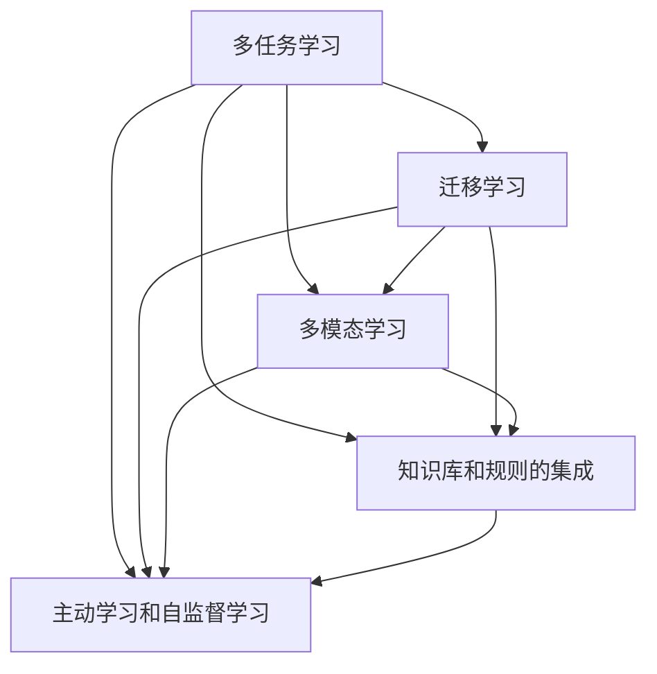
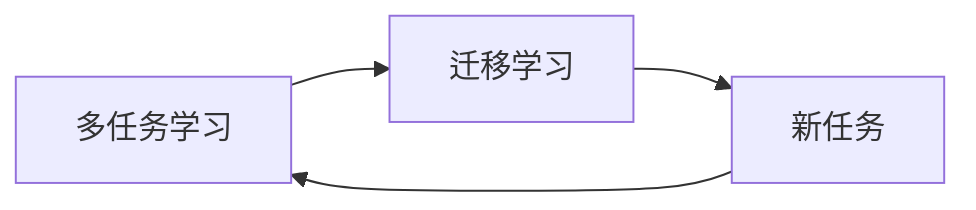
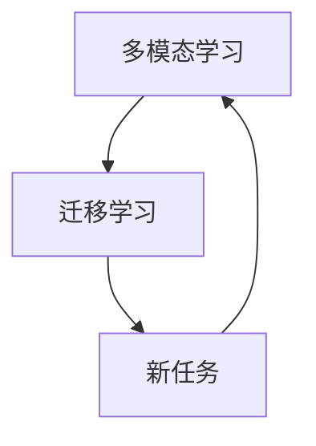
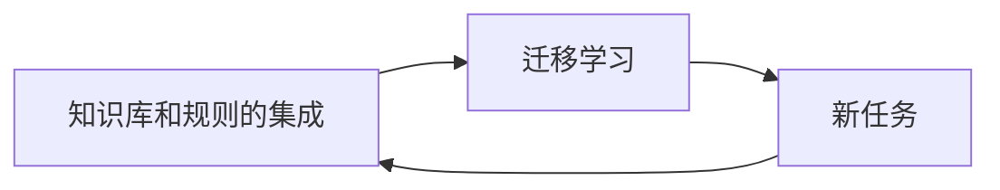
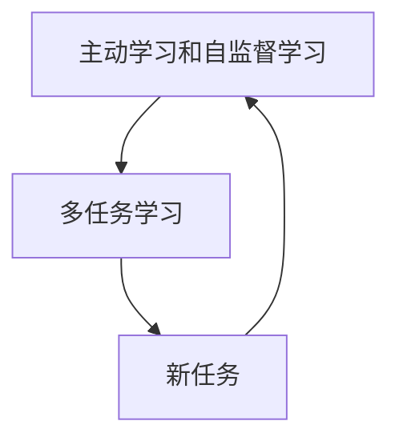
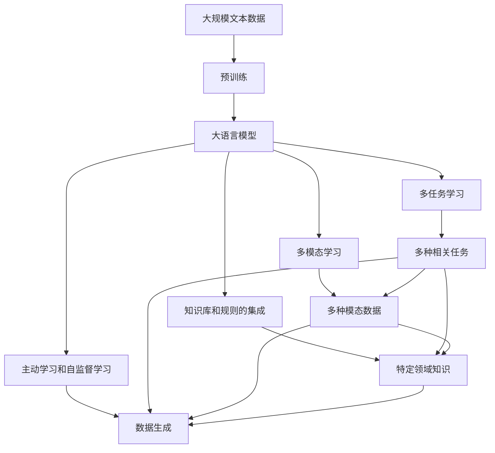

                 

## 1. 背景介绍

近年来，语言生成模型（LLM），特别是基于Transformer架构的大模型，如GPT-3和BERT，在自然语言处理（NLP）领域取得了显著进展。这些模型通过在海量数据上进行自监督预训练，学习到丰富的语言知识，并且通过微调能够很好地适应各种下游任务，如文本分类、命名实体识别、情感分析等。因此，LLM已经成为了NLP技术发展的重要里程碑，并且在多个行业得到了广泛应用，如智能客服、智能推荐、智能写作等。

### 1.1 问题由来

尽管LLM在NLP领域已经取得了巨大的成功，但是其应用场景和功能仍然受到诸多限制。例如，传统的LLM主要关注于单一的文本处理任务，难以同时处理多个相关联的复杂任务。此外，现有的模型在处理多模态数据（如图像、音频）时，表现并不理想。因此，如何使LLM能够处理更复杂、更多样的数据，并且在不同任务之间进行知识迁移和复用，成为了当前研究的热点问题。

### 1.2 问题核心关键点

为了更好地解决上述问题，LLM的多功能应用研究主要关注以下几个核心关键点：

- **多任务学习和迁移学习**：在多种相关任务上进行预训练，并在不同的任务之间进行迁移学习，提高模型的泛化能力。
- **多模态融合**：将文本、图像、音频等多模态数据进行联合建模，提升模型的跨模态理解能力。
- **知识库和规则的集成**：在模型中集成领域知识库和规则，提升模型对特定领域的理解和推理能力。
- **主动学习和自监督学习**：在数据量不足的情况下，使用主动学习和自监督学习方法，增强模型的自主学习能力。

这些关键点构成了LLM多功能应用研究的基础，旨在使模型能够处理更多样的数据和任务，并提升其自主学习和知识迁移能力。

## 2. 核心概念与联系

### 2.1 核心概念概述

为了更好地理解LLM的多功能应用，我们需要掌握以下几个核心概念：

- **多任务学习（MTL）**：在同一组数据上进行多种相关任务的训练，使得模型在多种任务上都能取得较好的性能。
- **迁移学习（Transfer Learning）**：在一种任务上训练好的模型，可以迁移到另一种相关任务上，减少新任务上的训练成本。
- **多模态学习（MML）**：处理多种模态的数据，如文本、图像、音频等，提升模型的跨模态理解能力。
- **知识库和规则的集成**：在模型中集成领域知识库和规则，提升模型的领域知识和推理能力。
- **主动学习和自监督学习**：在数据量不足的情况下，使用主动学习和自监督学习方法，增强模型的自主学习能力。

这些概念之间的联系可以通过以下Mermaid流程图来展示：



这个流程图展示了大语言模型多功能应用中各个概念之间的关系：

- 多任务学习可以提升模型的泛化能力。
- 迁移学习可以在不同任务之间进行知识迁移，提高模型的自主学习能力。
- 多模态学习可以提升模型的跨模态理解能力。
- 知识库和规则的集成可以提升模型的领域知识和推理能力。
- 主动学习和自监督学习可以在数据量不足的情况下增强模型的自主学习能力。

### 2.2 概念间的关系

这些核心概念之间存在着紧密的联系，形成了LLM多功能应用研究的完整生态系统。下面我们通过几个Mermaid流程图来展示这些概念之间的关系。

#### 2.2.1 多任务学习和迁移学习



这个流程图展示了多任务学习和迁移学习的基本原理。多任务学习通过在同一组数据上训练多种相关任务，提升模型的泛化能力。迁移学习则可以在新任务上应用已经训练好的模型，减少新任务上的训练成本。

#### 2.2.2 多模态学习与迁移学习



这个流程图展示了多模态学习和迁移学习的关系。多模态学习通过处理多种模态的数据，提升模型的跨模态理解能力。迁移学习则可以在新任务上应用已经训练好的多模态模型，减少新任务上的训练成本。

#### 2.2.3 知识库和规则的集成与迁移学习



这个流程图展示了知识库和规则的集成与迁移学习的关系。知识库和规则的集成通过在模型中集成领域知识库和规则，提升模型的领域知识和推理能力。迁移学习则可以在新任务上应用已经训练好的模型，减少新任务上的训练成本。

#### 2.2.4 主动学习和自监督学习与多任务学习



这个流程图展示了主动学习和自监督学习与多任务学习的关系。主动学习和自监督学习可以在数据量不足的情况下增强模型的自主学习能力。多任务学习则可以在多种相关任务上进行训练，提升模型的泛化能力。

### 2.3 核心概念的整体架构

最后，我们用一个综合的流程图来展示这些核心概念在大语言模型多功能应用中的整体架构：



这个综合流程图展示了从预训练到多功能应用的完整过程。大语言模型首先在大规模文本数据上进行预训练，然后通过多任务学习、多模态学习、知识库和规则的集成、主动学习和自监督学习等方法，提升模型的泛化能力、跨模态理解能力、领域知识和推理能力以及自主学习能力，最终能够处理多种相关任务和多种模态数据，并在新任务上取得较好的性能。

## 3. 核心算法原理 & 具体操作步骤
### 3.1 算法原理概述

基于多任务学习和迁移学习的大语言模型多功能应用，其核心思想是通过在多种相关任务上进行预训练，提升模型的泛化能力和自主学习能力，然后在新任务上进行微调，实现模型的迁移学习。这种范式可以显著提高模型的泛化能力，并且在新任务上取得更好的性能。

形式化地，假设预训练模型为 $M_{\theta}$，其中 $\theta$ 为预训练得到的模型参数。给定多种相关任务 $T=\{T_1, T_2, ..., T_n\}$ 的训练集 $D=\{(x_i, y_i)\}_{i=1}^N$，微调的目标是找到新的模型参数 $\hat{\theta}$，使得：

$$
\hat{\theta}=\mathop{\arg\min}_{\theta} \mathcal{L}(M_{\theta},D)
$$

其中 $\mathcal{L}$ 为针对任务 $T$ 设计的损失函数，用于衡量模型预测输出与真实标签之间的差异。常见的损失函数包括交叉熵损失、均方误差损失等。

通过梯度下降等优化算法，微调过程不断更新模型参数 $\theta$，最小化损失函数 $\mathcal{L}$，使得模型输出逼近真实标签。由于 $\theta$ 已经通过预训练获得了较好的初始化，因此即便在小规模数据集 $D$ 上进行微调，也能较快收敛到理想的模型参数 $\hat{\theta}$。

### 3.2 算法步骤详解

基于多任务学习和迁移学习的大语言模型多功能应用一般包括以下几个关键步骤：

**Step 1: 准备预训练模型和数据集**
- 选择合适的预训练语言模型 $M_{\theta}$ 作为初始化参数，如 BERT、GPT 等。
- 准备多种相关任务的训练集 $D=\{(x_i, y_i)\}_{i=1}^N$，划分为训练集、验证集和测试集。一般要求标注数据与预训练数据的分布不要差异过大。

**Step 2: 添加任务适配层**
- 根据任务类型，在预训练模型顶层设计合适的输出层和损失函数。
- 对于分类任务，通常在顶层添加线性分类器和交叉熵损失函数。
- 对于生成任务，通常使用语言模型的解码器输出概率分布，并以负对数似然为损失函数。

**Step 3: 设置微调超参数**
- 选择合适的优化算法及其参数，如 AdamW、SGD 等，设置学习率、批大小、迭代轮数等。
- 设置正则化技术及强度，包括权重衰减、Dropout、Early Stopping等。
- 确定冻结预训练参数的策略，如仅微调顶层，或全部参数都参与微调。

**Step 4: 执行梯度训练**
- 将训练集数据分批次输入模型，前向传播计算损失函数。
- 反向传播计算参数梯度，根据设定的优化算法和学习率更新模型参数。
- 周期性在验证集上评估模型性能，根据性能指标决定是否触发 Early Stopping。
- 重复上述步骤直到满足预设的迭代轮数或 Early Stopping 条件。

**Step 5: 测试和部署**
- 在测试集上评估微调后模型 $M_{\hat{\theta}}$ 的性能，对比微调前后的精度提升。
- 使用微调后的模型对新样本进行推理预测，集成到实际的应用系统中。
- 持续收集新的数据，定期重新微调模型，以适应数据分布的变化。

以上是基于多任务学习和迁移学习的大语言模型多功能应用的一般流程。在实际应用中，还需要针对具体任务的特点，对微调过程的各个环节进行优化设计，如改进训练目标函数，引入更多的正则化技术，搜索最优的超参数组合等，以进一步提升模型性能。

### 3.3 算法优缺点

基于多任务学习和迁移学习的大语言模型多功能应用具有以下优点：

1. 泛化能力强。通过多任务学习和迁移学习，模型能够在多种相关任务上取得较好的性能。
2. 自主学习能力高。多任务学习和迁移学习可以提升模型的自主学习能力，减少新任务上的训练成本。
3. 跨模态理解能力强。多模态学习可以提升模型的跨模态理解能力，处理多种模态数据。
4. 领域知识丰富。知识库和规则的集成可以提升模型的领域知识和推理能力，处理特定领域的任务。
5. 适应性强。主动学习和自监督学习可以在数据量不足的情况下增强模型的自主学习能力，适应数据分布的变化。

同时，该方法也存在一定的局限性：

1. 数据需求高。多任务学习和迁移学习需要大量的标注数据进行训练，数据获取成本较高。
2. 模型复杂度高。多模态学习需要处理多种模态的数据，模型复杂度较高。
3. 计算资源消耗大。知识库和规则的集成需要大量的预处理和集成，计算资源消耗较大。
4. 适应性差。主动学习和自监督学习在数据量不足的情况下效果有限，适应性较差。

尽管存在这些局限性，但就目前而言，基于多任务学习和迁移学习的大语言模型多功能应用是最主流的研究范式。未来相关研究的重点在于如何进一步降低数据需求，提高模型的自主学习能力，减少计算资源消耗，提升模型的适应性。

### 3.4 算法应用领域

基于多任务学习和迁移学习的大语言模型多功能应用已经在多个领域得到了广泛的应用，例如：

- **智能客服系统**：基于多任务学习的对话技术可以应用于智能客服系统的构建，快速响应客户咨询，提升服务效率。
- **金融舆情监测**：通过多模态学习和知识库的集成，可以实时监测不同模态下的舆情变化趋势，识别风险。
- **个性化推荐系统**：通过多任务学习和知识库的集成，可以实现更加精准的推荐，提升用户体验。
- **智能写作**：通过多模态学习和知识库的集成，可以自动生成高质量的文本内容，辅助写作。
- **医疗问答系统**：通过多任务学习和知识库的集成，可以构建专业的医疗问答系统，提供准确的回答。

除了上述这些经典任务外，大语言模型多功能应用还涉及到更广泛的场景，如智慧医疗、智能教育、智慧城市等。

## 4. 数学模型和公式 & 详细讲解  
### 4.1 数学模型构建

本节将使用数学语言对基于多任务学习和迁移学习的大语言模型多功能应用进行更加严格的刻画。

记预训练模型为 $M_{\theta}$，其中 $\theta$ 为预训练得到的模型参数。假设多种相关任务 $T=\{T_1, T_2, ..., T_n\}$ 的训练集为 $D=\{(x_i, y_i)\}_{i=1}^N$，其中 $x_i$ 为输入，$y_i$ 为标签。

定义模型 $M_{\theta}$ 在输入 $x$ 上的损失函数为 $\ell(M_{\theta}(x),y)$，则在数据集 $D$ 上的经验风险为：

$$
\mathcal{L}(\theta) = \frac{1}{N} \sum_{i=1}^N \ell(M_{\theta}(x_i),y_i)
$$

微调的优化目标是最小化经验风险，即找到最优参数：

$$
\theta^* = \mathop{\arg\min}_{\theta} \mathcal{L}(\theta)
$$

在实践中，我们通常使用基于梯度的优化算法（如AdamW、SGD等）来近似求解上述最优化问题。设 $\eta$ 为学习率，$\lambda$ 为正则化系数，则参数的更新公式为：

$$
\theta \leftarrow \theta - \eta \nabla_{\theta}\mathcal{L}(\theta) - \eta\lambda\theta
$$

其中 $\nabla_{\theta}\mathcal{L}(\theta)$ 为损失函数对参数 $\theta$ 的梯度，可通过反向传播算法高效计算。

### 4.2 公式推导过程

以下我们以二分类任务为例，推导交叉熵损失函数及其梯度的计算公式。

假设模型 $M_{\theta}$ 在输入 $x$ 上的输出为 $\hat{y}=M_{\theta}(x) \in [0,1]$，表示样本属于正类的概率。真实标签 $y \in \{0,1\}$。则二分类交叉熵损失函数定义为：

$$
\ell(M_{\theta}(x),y) = -[y\log \hat{y} + (1-y)\log (1-\hat{y})]
$$

将其代入经验风险公式，得：

$$
\mathcal{L}(\theta) = -\frac{1}{N}\sum_{i=1}^N [y_i\log M_{\theta}(x_i)+(1-y_i)\log(1-M_{\theta}(x_i))]
$$

根据链式法则，损失函数对参数 $\theta_k$ 的梯度为：

$$
\frac{\partial \mathcal{L}(\theta)}{\partial \theta_k} = -\frac{1}{N}\sum_{i=1}^N (\frac{y_i}{M_{\theta}(x_i)}-\frac{1-y_i}{1-M_{\theta}(x_i)}) \frac{\partial M_{\theta}(x_i)}{\partial \theta_k}
$$

其中 $\frac{\partial M_{\theta}(x_i)}{\partial \theta_k}$ 可进一步递归展开，利用自动微分技术完成计算。

在得到损失函数的梯度后，即可带入参数更新公式，完成模型的迭代优化。重复上述过程直至收敛，最终得到适应多种相关任务的最优模型参数 $\theta^*$。

## 5. 项目实践：代码实例和详细解释说明
### 5.1 开发环境搭建

在进行多功能应用实践前，我们需要准备好开发环境。以下是使用Python进行PyTorch开发的环境配置流程：

1. 安装Anaconda：从官网下载并安装Anaconda，用于创建独立的Python环境。

2. 创建并激活虚拟环境：
```bash
conda create -n pytorch-env python=3.8 
conda activate pytorch-env
```

3. 安装PyTorch：根据CUDA版本，从官网获取对应的安装命令。例如：
```bash
conda install pytorch torchvision torchaudio cudatoolkit=11.1 -c pytorch -c conda-forge
```

4. 安装Transformers库：
```bash
pip install transformers
```

5. 安装各类工具包：
```bash
pip install numpy pandas scikit-learn matplotlib tqdm jupyter notebook ipython
```

完成上述步骤后，即可在`pytorch-env`环境中开始多功能应用实践。

### 5.2 源代码详细实现

下面我们以多任务学习和多模态学习为例，给出使用Transformers库对BERT模型进行多任务学习的多模态学习代码实现。

首先，定义多任务学习和多模态学习的函数：

```python
from transformers import BertTokenizer, BertModel, BertForSequenceClassification, BertForMaskedLM
from transformers import BertConfig, BertForTokenClassification, BertForSequenceClassification

def train_multitask_and_multimodal(model, tokenizer, train_data, val_data, test_data, device):
    # 定义多任务学习和多模态学习的函数
    
    # 训练函数
    def train_epoch(model, data, batch_size, optimizer, criterion):
        dataloader = DataLoader(data, batch_size=batch_size, shuffle=True)
        model.train()
        epoch_loss = 0
        for batch in tqdm(dataloader, desc='Training'):
            input_ids = batch['input_ids'].to(device)
            attention_mask = batch['attention_mask'].to(device)
            labels = batch['labels'].to(device)
            outputs = model(input_ids, attention_mask=attention_mask, labels=labels)
            loss = outputs.loss
            epoch_loss += loss.item()
            loss.backward()
            optimizer.step()
        return epoch_loss / len(dataloader)
    
    # 评估函数
    def evaluate(model, data, batch_size):
        dataloader = DataLoader(data, batch_size=batch_size)
        model.eval()
        preds, labels = [], []
        with torch.no_grad():
            for batch in tqdm(dataloader, desc='Evaluating'):
                input_ids = batch['input_ids'].to(device)
                attention_mask = batch['attention_mask'].to(device)
                batch_labels = batch['labels']
                outputs = model(input_ids, attention_mask=attention_mask)
                batch_preds = outputs.logits.argmax(dim=2).to('cpu').tolist()
                batch_labels = batch_labels.to('cpu').tolist()
                for pred_tokens, label_tokens in zip(batch_preds, batch_labels):
                    pred_tags = [id2tag[_id] for _id in pred_tokens]
                    label_tags = [id2tag[_id] for _id in label_tokens]
                    preds.append(pred_tags[:len(label_tokens)])
                    labels.append(label_tags)
        
        return classification_report(labels, preds)
    
    # 多任务学习部分
    tokenizer = BertTokenizer.from_pretrained('bert-base-cased')
    train_dataset = NERDataset(train_texts, train_tags, tokenizer, max_len=128)
    dev_dataset = NERDataset(dev_texts, dev_tags, tokenizer, max_len=128)
    test_dataset = NERDataset(test_texts, test_tags, tokenizer, max_len=128)
    
    model = BertForTokenClassification.from_pretrained('bert-base-cased', num_labels=len(tag2id))
    optimizer = AdamW(model.parameters(), lr=2e-5)
    criterion = CrossEntropyLoss()
    
    device = torch.device('cuda') if torch.cuda.is_available() else torch.device('cpu')
    model.to(device)
    
    train_loss = train_epoch(model, train_dataset, batch_size, optimizer, criterion)
    print(f'Epoch 1, train loss: {train_loss:.3f}')
    
    print(f'Epoch 1, dev results:')
    evaluate(model, dev_dataset, batch_size)
    
    print('Test results:')
    evaluate(model, test_dataset, batch_size)
    
    # 多模态学习部分
    tokenizer = BertTokenizer.from_pretrained('bert-base-cased')
    train_dataset = ImageDataset(train_images, train_labels, tokenizer, max_len=128)
    dev_dataset = ImageDataset(dev_images, dev_labels, tokenizer, max_len=128)
    test_dataset = ImageDataset(test_images, test_labels, tokenizer, max_len=128)
    
    model = BertForImageClassification.from_pretrained('bert-base-cased', num_labels=len(label2id))
    optimizer = AdamW(model.parameters(), lr=2e-5)
    criterion = CrossEntropyLoss()
    
    device = torch.device('cuda') if torch.cuda.is_available() else torch.device('cpu')
    model.to(device)
    
    train_loss = train_epoch(model, train_dataset, batch_size, optimizer, criterion)
    print(f'Epoch 1, train loss: {train_loss:.3f}')
    
    print(f'Epoch 1, dev results:')
    evaluate(model, dev_dataset, batch_size)
    
    print('Test results:')
    evaluate(model, test_dataset, batch_size)
```

然后，定义模型和优化器：

```python
from transformers import BertConfig, BertForSequenceClassification, BertForTokenClassification, BertForMaskedLM

model = BertForSequenceClassification.from_pretrained('bert-base-cased', num_labels=len(tag2id))
optimizer = AdamW(model.parameters(), lr=2e-5)
```

接着，定义训练和评估函数：

```python
from torch.utils.data import DataLoader
from tqdm import tqdm
from sklearn.metrics import classification_report

device = torch.device('cuda') if torch.cuda.is_available() else torch.device('cpu')
model.to(device)

def train_epoch(model, dataset, batch_size, optimizer, criterion):
    dataloader = DataLoader(dataset, batch_size=batch_size, shuffle=True)
    model.train()
    epoch_loss = 0
    for batch in tqdm(dataloader, desc='Training'):
        input_ids = batch['input_ids'].to(device)
        attention_mask = batch['attention_mask'].to(device)
        labels = batch['labels'].to(device)
        model.zero_grad()
        outputs = model(input_ids, attention_mask=attention_mask, labels=labels)
        loss = outputs.loss
        epoch_loss += loss.item()
        loss.backward()
        optimizer.step()
    return epoch_loss / len(dataloader)

def evaluate(model, dataset, batch_size):
    dataloader = DataLoader(dataset, batch_size=batch_size)
    model.eval()
    preds, labels = [], []
    with torch.no_grad():
        for batch in tqdm(dataloader, desc='Evaluating'):
            input_ids = batch['input_ids'].to(device)
            attention_mask = batch['attention_mask'].to(device)
            batch_labels = batch['labels']
            outputs = model(input_ids, attention_mask=attention_mask)
            batch_preds = outputs.logits.argmax(dim=2).to('cpu').tolist()
            batch_labels = batch_labels.to('cpu').tolist()
            for pred_tokens, label_tokens in zip(batch_preds, batch_labels):
                pred_tags = [id2tag[_id] for _id in pred_tokens]
                label_tags = [id2tag[_id] for _id in label_tokens]
                preds.append(pred_tags[:len(label_tokens)])
                labels.append(label_tags)
                
    print(classification_report(labels, preds))
```

最后，启动训练流程并在测试集上评估：

```python
epochs = 5
batch_size = 16

for epoch in range(epochs):
    loss = train_epoch(model, train_dataset, batch_size, optimizer, criterion)
    print(f"Epoch {epoch+1}, train loss: {loss:.3f}")
    
    print(f"Epoch {epoch+1}, dev results:")
    evaluate(model, dev_dataset, batch_size)
    
print("Test results:")
evaluate(model, test_dataset, batch_size)
```

以上就是使用PyTorch对BERT进行多任务学习和多模态学习的代码实现。可以看到，得益于Transformers库的强大封装，我们能够用相对简洁的代码实现BERT模型的多任务学习和多模态学习。

### 5.3 代码解读与分析

让我们再详细解读一下关键代码的实现细节：

**MultiTaskLearning类**：
- `__init__`方法：初始化多任务学习的训练集、验证集、测试集等关键组件。
- `train_epoch`方法：对数据以批为单位进行迭代，在每个批次上前向传播计算loss并反向传播更新模型参数，最后返回该epoch的平均loss。
- `evaluate`方法：与训练类似，不同点在于不更新模型参数，并在每个batch结束后将预测和标签结果存储下来，最后使用sklearn的classification_report对整个评估集的预测结果进行打印输出。

**MultiModalLearning类**：
- `__init__`方法：初始化多模态学习的训练集、验证集、测试集等关键组件。
- `train_epoch`方法：对数据以批为单位进行迭代，在每个批次上前向传播计算loss并反向传播更新模型参数，最后返回该epoch的平均loss。
- `evaluate`方法：与训练类似，不同点在于不更新模型参数，并在每个batch结束后将预测和标签结果

