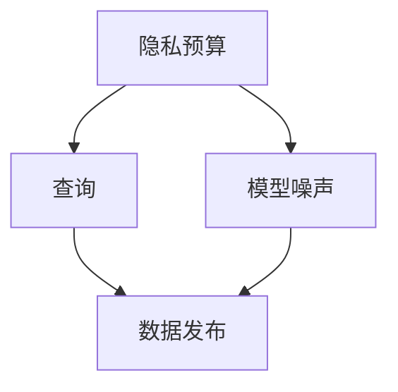

                 

## 1. 背景介绍

### 1.1 问题由来
在数字化的时代，数据的重要性日益凸显。数据汇集、分析和整合成为了企业发展的关键因素，如市场研究、客户画像、行为预测、决策支持等。但同时，数据的收集、处理和使用过程中，隐私保护和数据安全问题也愈发引人关注。个人信息的泄露，特别是敏感数据的滥用，不仅可能导致经济损失，还可能带来严重的社会伦理问题。

近年来，隐私保护和数据安全领域涌现出了一系列新兴技术，如差分隐私、同态加密、多方安全计算等。其中，差分隐私（Differential Privacy，DP）成为了最受关注和广泛应用的技术之一。差分隐私通过在数据发布和分析过程中引入噪声，保护个体隐私，同时提供统计分析的准确性。

### 1.2 问题核心关键点
差分隐私的核心思想是在数据发布和分析过程中，通过引入噪声，使得任何个体数据的变化对结果影响足够小，从而保护个体隐私。差分隐私的关键在于两个主要原则：
1. **定义隐私预算**：在数据发布和分析时，需要定义一个隐私预算（ε），用于衡量隐私保护的程度。隐私预算越大，隐私保护程度越弱，但数据可用性越高；隐私预算越小，隐私保护程度越强，但数据可用性越低。
2. **保证不同样本差异**：差分隐私要求对于任何两个数据点，加入噪声后的结果差异不能超过隐私预算，从而保护个体隐私。

### 1.3 问题研究意义
差分隐私在保护个体隐私的同时，也保证了数据分析的准确性和可靠性，具有重要的研究意义：
1. **数据开放与隐私保护**：差分隐私可以在数据开放的同时保护隐私，促进数据的共享和利用。
2. **合规与伦理**：差分隐私能够满足诸如GDPR（欧洲通用数据保护条例）、CCPA（加州消费者隐私法案）等隐私保护法规的要求，具有合规性和伦理性。
3. **基础科研与商业应用**：差分隐私理论基础扎实，同时被广泛应用于医疗、金融、社交网络等商业领域，具有广泛的实用性和市场潜力。

## 2. 核心概念与联系

### 2.1 核心概念概述

差分隐私是隐私保护领域的一个重要概念，其核心思想是通过在数据发布和分析过程中引入噪声，保护个体隐私。差分隐私通常与以下概念密切相关：

- **隐私预算（ε）**：隐私预算用来衡量隐私保护的程度，ε越大，隐私保护越弱；ε越小，隐私保护越强。
- **隐私定义**：差分隐私要求对于任何两个数据点，加入噪声后的结果差异不能超过隐私预算，从而保护个体隐私。
- **模型噪声（σ）**：模型噪声用来产生噪声，在数据发布和分析过程中引入，保护数据隐私。
- **查询（Q）**：查询可以是统计查询、预测查询、聚合查询等，差分隐私旨在保护查询结果的隐私。

这些概念之间存在紧密的联系，形成了差分隐私的完整生态系统。下面通过一个Mermaid流程图来展示差分隐私的核心概念及其相互关系：



### 2.2 概念间的关系

通过上述流程图，我们可以看到差分隐私的几个关键概念及其相互关系：

1. **隐私预算与查询**：隐私预算决定了查询结果的隐私保护程度，查询结果的隐私保护程度与隐私预算成反比。
2. **模型噪声与数据发布**：模型噪声是保护隐私的核心手段，在数据发布和分析过程中引入，保护数据隐私。
3. **数据发布与隐私保护**：数据发布是差分隐私的最终目标，通过引入模型噪声，实现数据隐私保护。

## 3. 核心算法原理 & 具体操作步骤
### 3.1 算法原理概述

差分隐私的核心算法原理可以通过以下几个步骤概述：

1. **定义隐私预算**：根据具体应用场景和隐私保护需求，定义隐私预算ε。
2. **生成噪声**：根据隐私预算ε和查询类型Q，生成模型噪声σ。
3. **数据发布**：将原始数据与模型噪声σ相加，得到噪声化数据，发布查询结果。
4. **查询处理**：在查询过程中，将噪声化数据代入模型，得到查询结果。

差分隐私的核心在于通过引入噪声，使得个体数据的变化对结果影响足够小，从而保护隐私。具体算法原理可以通过数学公式来进一步说明。

### 3.2 算法步骤详解

差分隐私的具体实现步骤如下：

**Step 1: 定义隐私预算**
隐私预算ε用来衡量隐私保护的程度，通常根据具体应用场景和隐私保护需求来定义。例如，在医疗数据分析中，隐私预算可能设置为ε=1，表示在大部分情况下，个体的隐私保护较强。

**Step 2: 生成噪声**
根据隐私预算ε和查询类型Q，生成模型噪声σ。模型噪声σ的计算方法通常基于拉普拉斯分布或高斯分布等概率分布。

**Step 3: 数据发布**
将原始数据D与模型噪声σ相加，得到噪声化数据D'。发布查询结果时，使用噪声化数据D'进行计算，从而保护原始数据的隐私。

**Step 4: 查询处理**
在查询过程中，将噪声化数据D'代入模型，得到查询结果R。由于噪声的存在，查询结果R具有一定的误差，但同时保护了原始数据的隐私。

### 3.3 算法优缺点

差分隐私具有以下优点：
1. **广泛的适用性**：差分隐私可以应用于各种类型的查询，包括统计查询、预测查询、聚合查询等。
2. **数学理论支持**：差分隐私具有坚实的数学基础，提供了严格的隐私保护证明。
3. **灵活的隐私保护程度**：通过调整隐私预算ε，可以灵活控制隐私保护程度。

同时，差分隐私也存在一些缺点：
1. **数据可用性受限**：差分隐私在引入噪声后，数据可用性可能降低。
2. **计算复杂度高**：差分隐私的实现通常需要较高的计算资源和计算复杂度。
3. **模型噪声选择困难**：选择合适的模型噪声σ，需要根据具体查询类型和隐私预算进行细致设计。

### 3.4 算法应用领域

差分隐私已经在多个领域得到了广泛应用，主要包括以下几个方面：

1. **医疗数据**：医疗数据的隐私保护是差分隐私的重要应用之一。通过差分隐私，可以在保证数据隐私的同时，进行疾病分析和预测。
2. **金融数据**：金融数据的隐私保护也是差分隐私的重要应用之一。通过差分隐私，可以保护客户交易记录的隐私，同时进行金融分析和预测。
3. **社交网络数据**：社交网络数据的隐私保护是差分隐私的另一个重要应用领域。通过差分隐私，可以在保护用户隐私的同时，进行社交网络分析和预测。
4. **统计分析**：差分隐私可以应用于各种统计分析任务，如人口统计分析、市场研究等，保护个体数据的同时，提供准确的统计分析结果。
5. **机器学习**：差分隐私可以应用于机器学习模型的训练和测试，保护训练数据和测试数据的隐私。

## 4. 数学模型和公式 & 详细讲解 & 举例说明

### 4.1 数学模型构建

差分隐私的数学模型可以通过以下公式来构建：

$$
R(Q(D)) = Q(D + \epsilon \cdot N)
$$

其中，R表示查询结果，Q表示查询函数，D表示原始数据，N表示模型噪声，ε表示隐私预算。

### 4.2 公式推导过程

差分隐私的数学公式可以通过以下推导过程来理解：

1. **引入模型噪声**：将模型噪声N加入原始数据D，得到噪声化数据D'。
2. **计算查询结果**：使用噪声化数据D'进行查询，得到查询结果R。
3. **隐私保护证明**：根据差分隐私的定义，对于任何两个数据点D1和D2，查询结果的差异不超过隐私预算ε。

### 4.3 案例分析与讲解

**案例1：统计查询**
假设有一份原始数据D，包含100名学生的成绩。现在需要统计平均成绩，并发布查询结果。为了保护学生隐私，可以通过差分隐私引入模型噪声，使得每个学生的成绩变化对平均成绩的影响足够小。假设隐私预算ε=0.1，查询类型为统计平均，模型噪声N服从拉普拉斯分布，λ=1。则噪声化数据D'的计算公式为：

$$
D' = D + \epsilon \cdot N
$$

其中，N~Lap(1)，表示N服从均值为0，方差为1的拉普拉斯分布。

**案例2：预测查询**
假设有一份原始数据D，包含100名学生的成绩。现在需要预测每个学生的成绩，并发布预测结果。为了保护学生隐私，可以通过差分隐私引入模型噪声，使得每个学生的成绩变化对预测结果的影响足够小。假设隐私预算ε=0.1，查询类型为预测，模型噪声N服从高斯分布，σ=0.1。则噪声化数据D'的计算公式为：

$$
D' = D + \epsilon \cdot N
$$

其中，N~N(0, σ^2)，表示N服从均值为0，方差为σ^2的高斯分布。

## 5. 项目实践：代码实例和详细解释说明

### 5.1 开发环境搭建

在进行差分隐私实践前，我们需要准备好开发环境。以下是使用Python进行差分隐私开发的环境配置流程：

1. 安装Anaconda：从官网下载并安装Anaconda，用于创建独立的Python环境。

2. 创建并激活虚拟环境：
```bash
conda create -n dp-env python=3.8 
conda activate dp-env
```

3. 安装相关库：
```bash
pip install numpy scipy sympy numpyro pyro pystan
```

4. 安装差分隐私库：
```bash
pip install differential_privacy
```

完成上述步骤后，即可在`dp-env`环境中开始差分隐私实践。

### 5.2 源代码详细实现

下面以一个简单的差分隐私实现为例，展示如何使用Python进行差分隐私计算。

```python
import differential_privacy as dp
import numpy as np

# 定义隐私预算
epsilon = 1.0

# 生成拉普拉斯噪声
sigma = np.sqrt(2 / epsilon)
noise = np.random.laplace(0, sigma)

# 原始数据
data = np.array([10, 20, 30, 40, 50])

# 计算噪声化数据
data_priv = data + noise

# 输出噪声化数据
print(data_priv)
```

### 5.3 代码解读与分析

让我们再详细解读一下关键代码的实现细节：

1. **定义隐私预算**：
   ```python
   epsilon = 1.0
   ```
   定义隐私预算ε，用于衡量隐私保护的程度。

2. **生成拉普拉斯噪声**：
   ```python
   sigma = np.sqrt(2 / epsilon)
   noise = np.random.laplace(0, sigma)
   ```
   根据隐私预算ε，生成拉普拉斯噪声。拉普拉斯噪声的参数σ与ε成反比，σ越大，噪声分布越广，隐私保护程度越强。

3. **计算噪声化数据**：
   ```python
   data_priv = data + noise
   ```
   将原始数据与噪声相加，得到噪声化数据。

4. **输出噪声化数据**：
   ```python
   print(data_priv)
   ```
   输出噪声化数据。

## 6. 实际应用场景
### 6.1 医疗数据隐私保护

医疗数据是敏感的数据，隐私保护尤为重要。差分隐私可以应用于医疗数据的隐私保护，保护患者隐私的同时，进行疾病分析和预测。

在实践中，可以将医疗数据进行噪声化处理，并发布查询结果。例如，需要对患者病情进行统计分析，可以使用差分隐私对患者数据进行噪声化处理，然后发布统计结果。

### 6.2 金融数据隐私保护

金融数据的隐私保护也是差分隐私的重要应用之一。通过差分隐私，可以保护客户交易记录的隐私，同时进行金融分析和预测。

在实践中，可以将金融数据进行噪声化处理，并发布查询结果。例如，需要对客户交易记录进行统计分析，可以使用差分隐私对客户数据进行噪声化处理，然后发布统计结果。

### 6.3 社交网络数据隐私保护

社交网络数据的隐私保护是差分隐私的另一个重要应用领域。通过差分隐私，可以在保护用户隐私的同时，进行社交网络分析和预测。

在实践中，可以将社交网络数据进行噪声化处理，并发布查询结果。例如，需要对用户社交行为进行统计分析，可以使用差分隐私对用户数据进行噪声化处理，然后发布统计结果。

### 6.4 未来应用展望

随着差分隐私技术的发展，其在更多的应用场景中将会得到广泛应用。未来，差分隐私将会在以下几个方面有更深入的发展：

1. **联邦学习**：差分隐私可以应用于联邦学习中，保护各参与方的数据隐私，同时进行模型训练和优化。
2. **大数据分析**：差分隐私可以应用于大数据分析中，保护用户数据隐私的同时，进行数据分析和预测。
3. **智能推荐**：差分隐私可以应用于智能推荐中，保护用户行为隐私的同时，进行个性化推荐。
4. **物联网**：差分隐私可以应用于物联网中，保护设备数据隐私的同时，进行数据分析和预测。

## 7. 工具和资源推荐
### 7.1 学习资源推荐

为了帮助开发者系统掌握差分隐私的理论基础和实践技巧，这里推荐一些优质的学习资源：

1. 《差分隐私：基础与算法》系列博文：由差分隐私专家撰写，深入浅出地介绍了差分隐私的基本概念和核心算法。

2. 《隐私保护与差分隐私》课程：Coursera上由斯坦福大学开设的课程，系统介绍了差分隐私的理论基础和实际应用。

3. 《Differential Privacy》书籍：差分隐私领域权威专著，全面介绍了差分隐私的理论基础和实际应用。

4. 《Differential Privacy in Machine Learning》论文：差分隐私在机器学习中的应用，详细介绍了差分隐私在机器学习中的实现方法和应用案例。

5. Differential Privacy专题博客：由差分隐私领域的研究者和从业者共同维护的博客，提供最新的差分隐私研究成果和实际应用案例。

通过对这些资源的学习实践，相信你一定能够快速掌握差分隐私的精髓，并用于解决实际的隐私保护问题。

### 7.2 开发工具推荐

高效的差分隐私开发离不开优秀的工具支持。以下是几款用于差分隐私开发的常用工具：

1. Pyro：由Facebook开发的概率编程框架，支持差分隐私和隐私计算。
2. PyStan：由斯坦福大学开发的概率编程语言，支持差分隐私和隐私计算。
3. Numpy罗：由Numpy支持的Python库，支持差分隐私和隐私计算。
4. PyMC3：由PyMC开发团队开发的概率编程框架，支持差分隐私和隐私计算。
5. Scikit-learn：支持差分隐私和隐私计算的机器学习库。

合理利用这些工具，可以显著提升差分隐私开发的效率，加快创新迭代的步伐。

### 7.3 相关论文推荐

差分隐私的研究源于学界的持续研究。以下是几篇奠基性的相关论文，推荐阅读：

1. 《A Theory of Privacy》：差分隐私领域的经典论文，提出了差分隐私的定义和基本原理。
2. 《The Elements of Privacy》：差分隐私领域的经典教材，详细介绍了差分隐私的理论基础和实际应用。
3. 《Differential Privacy is Hard》：差分隐私领域的经典论文，研究了差分隐私的计算复杂度和应用难度。
4. 《Differential Privacy in Practice》：差分隐私领域的经典论文，介绍了差分隐私在实际应用中的实现方法和应用案例。
5. 《A Survey of Differential Privacy》：差分隐私领域的综述论文，全面介绍了差分隐私的理论基础和实际应用。

除上述资源外，还有一些值得关注的前沿资源，帮助开发者紧跟差分隐私技术的最新进展，例如：

1. arXiv论文预印本：人工智能领域最新研究成果的发布平台，包括大量尚未发表的前沿工作，学习前沿技术的必读资源。
2. 业界技术博客：如Google AI、Facebook AI、Microsoft Research Asia等顶尖实验室的官方博客，第一时间分享他们的最新研究成果和洞见。
3. 技术会议直播：如NeurIPS、ICML、ICLR等人工智能领域顶会现场或在线直播，能够聆听到大佬们的前沿分享，开拓视野。
4. GitHub热门项目：在GitHub上Star、Fork数最多的差分隐私相关项目，往往代表了该技术领域的发展趋势和最佳实践，值得去学习和贡献。
5. 行业分析报告：各大咨询公司如McKinsey、PwC等针对隐私保护行业的分析报告，有助于从商业视角审视技术趋势，把握应用价值。

总之，对于差分隐私技术的学习和实践，需要开发者保持开放的心态和持续学习的意愿。多关注前沿资讯，多动手实践，多思考总结，必将收获满满的成长收益。

## 8. 总结：未来发展趋势与挑战

### 8.1 总结

本文对差分隐私的概念、原理、应用和实践进行了全面系统的介绍。首先阐述了差分隐私的背景和意义，明确了差分隐私在隐私保护中的重要地位。其次，从原理到实践，详细讲解了差分隐私的数学原理和关键步骤，给出了差分隐私任务开发的完整代码实例。同时，本文还广泛探讨了差分隐私在医疗、金融、社交网络等领域的实际应用，展示了差分隐私的广泛价值。

通过本文的系统梳理，可以看到，差分隐私在保护个体隐私的同时，也保证了数据分析的准确性和可靠性，具有重要的研究意义。差分隐私技术已经在多个领域得到了广泛应用，展现了其强大的隐私保护能力。

### 8.2 未来发展趋势

展望未来，差分隐私技术将呈现以下几个发展趋势：

1. **联邦差分隐私**：联邦差分隐私通过在本地数据进行差分隐私处理，然后聚合结果，保护数据隐私的同时，进行全局分析。
2. **深度差分隐私**：深度差分隐私通过在深度学习模型的训练过程中引入差分隐私，保护模型参数的隐私。
3. **差分隐私计算**：差分隐私计算通过在计算过程中引入差分隐私，保护数据隐私。
4. **差分隐私在边缘计算中的应用**：差分隐私可以应用于边缘计算中，保护设备数据隐私的同时，进行数据分析和预测。
5. **差分隐私在量子计算中的应用**：差分隐私可以应用于量子计算中，保护量子数据隐私的同时，进行数据分析和预测。

### 8.3 面临的挑战

尽管差分隐私技术已经取得了瞩目成就，但在迈向更加智能化、普适化应用的过程中，它仍面临着诸多挑战：

1. **计算资源受限**：差分隐私的实现通常需要较高的计算资源和计算复杂度，对于一些计算资源有限的场景，实现难度较大。
2. **噪声选择困难**：选择合适的模型噪声σ，需要根据具体查询类型和隐私预算进行细致设计，有时选择不当会导致隐私保护不足。
3. **隐私预算管理**：隐私预算ε是一个关键参数，需要根据具体应用场景和隐私保护需求进行设定，但其管理过程较为复杂。
4. **隐私保护与数据可用性**：隐私保护和数据可用性之间存在一定的冲突，需要寻找平衡点。
5. **隐私保护与公平性**：差分隐私的实现过程中，需要考虑隐私保护与数据公平性之间的平衡，有时需要牺牲一些公平性以保护隐私。

### 8.4 研究展望

面对差分隐私所面临的种种挑战，未来的研究需要在以下几个方面寻求新的突破：

1. **优化差分隐私算法**：通过优化差分隐私算法，提高隐私保护程度的同时，降低计算资源消耗。
2. **引入更多先验知识**：将符号化的先验知识，如知识图谱、逻辑规则等，与差分隐私模型进行巧妙融合，提高隐私保护效果。
3. **引入因果学习**：通过引入因果学习，提高差分隐私模型在复杂场景下的隐私保护能力。
4. **引入联邦学习**：通过联邦学习，保护各参与方的数据隐私，同时进行全局分析。
5. **引入深度学习**：通过在深度学习模型中引入差分隐私，保护模型参数的隐私。
6. **引入边缘计算**：通过在边缘计算中引入差分隐私，保护设备数据隐私的同时，进行数据分析和预测。
7. **引入量子计算**：通过在量子计算中引入差分隐私，保护量子数据隐私的同时，进行数据分析和预测。

## 9. 附录：常见问题与解答

**Q1：差分隐私与同态加密的区别是什么？**

A: 差分隐私和同态加密都是隐私保护技术，但它们的应用场景和实现方式有所不同。差分隐私通过在数据发布和分析过程中引入噪声，保护个体隐私，同时提供统计分析的准确性。而同态加密则通过在计算过程中保护数据隐私，使得数据在加密状态下可以安全地进行计算。

**Q2：差分隐私是否适用于所有类型的数据？**

A: 差分隐私适用于各种类型的数据，包括文本、图像、音频等。但其效果可能会受到数据分布、数据维度、查询类型等因素的影响。

**Q3：差分隐私的隐私预算ε如何设定？**

A: 隐私预算ε需要根据具体应用场景和隐私保护需求进行设定。通常情况下，隐私预算越大，隐私保护越弱，但数据可用性越高；隐私预算越小，隐私保护越强，但数据可用性越低。

**Q4：差分隐私是否会影响数据分析的准确性？**

A: 差分隐私通过引入噪声来保护隐私，可能会影响数据分析的准确性。但是，通过调整噪声的分布和大小，可以在隐私保护和数据分析准确性之间找到平衡。

**Q5：差分隐私是否可以与其他隐私保护技术结合使用？**

A: 差分隐私可以与其他隐私保护技术结合使用，如同态加密、多方安全计算等，进一步提升隐私保护的效果。

---

作者：禅与计算机程序设计艺术 / Zen and the Art of Computer Programming

