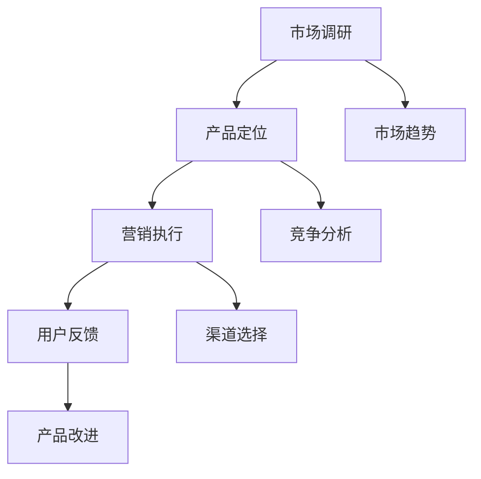
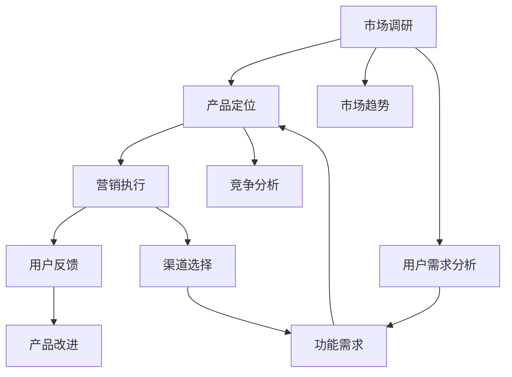

                 

# 市场策略：创业成功的制胜关键

## 1. 背景介绍

### 1.1 问题由来
在当今数字化时代，创业项目层出不穷，成功的比例却依旧较低。市场竞争日益激烈，产品同质化严重，用户需求多变，创业公司如何在茫茫市场中找到自己的立足点，成为众多创业者共同面临的问题。市场策略作为创业成功的关键因素，其重要性不言而喻。

### 1.2 问题核心关键点
市场策略的核心在于如何通过深度理解市场、精准定位产品、高效执行营销，实现从0到1的突破。包括：
1. 市场调研：了解目标市场的需求、竞争对手和市场趋势。
2. 产品定位：明确产品的独特卖点（USP），定位目标客户群体。
3. 营销执行：采用合适的营销渠道和策略，提升产品知名度和销售量。

市场策略的实施需综合考虑以上三点，使产品与市场需求相匹配，从而在激烈的市场竞争中脱颖而出。

### 1.3 问题研究意义
研究市场策略对于创业者来说，不仅能帮助其提升产品成功率，还能减少不必要的资源浪费，实现更高的投资回报率。更重要的是，良好的市场策略有助于建立企业的核心竞争力，为未来的可持续发展打下坚实基础。

## 2. 核心概念与联系

### 2.1 核心概念概述
- **市场调研**：通过定性和定量方法，收集和分析市场数据，了解市场环境和用户需求。
- **产品定位**：基于市场调研结果，确定产品的独特卖点和目标客户群体。
- **营销执行**：选择适当的营销渠道和策略，推动产品销售和品牌建设。
- **用户反馈**：收集用户反馈，持续优化产品和市场策略，提升用户满意度。

### 2.2 概念间的关系

以下是这些核心概念间的关系，通过Mermaid流程图进行展示：



这个流程图展示了市场调研、产品定位、营销执行和用户反馈之间的相互影响和作用。市场调研提供了需求洞察和趋势分析，产品定位决定了产品的市场策略，营销执行推动产品销售和品牌建设，而用户反馈则用于持续改进产品和市场策略，形成闭环优化。

### 2.3 核心概念的整体架构

大语言模型微调的综合流程图，展示了从市场调研到用户反馈的整个过程。



通过这个综合流程图，我们可以看到市场调研不仅是开始，更是贯穿整个市场策略实施过程的关键组成部分。

## 3. 核心算法原理 & 具体操作步骤
### 3.1 算法原理概述
市场策略的实施遵循了SMART原则，即具体的(Specific)、可衡量的(Measurable)、可实现的(Achievable)、相关的(Relevant)和有时限的(Time-bound)。

- **具体的**：目标和策略应具体明确，避免模糊不清。
- **可衡量的**：设置可量化的目标和指标，方便评估进展和效果。
- **可实现的**：目标应具有挑战性，但同时也要考虑实际可行性。
- **相关的**：目标与业务愿景和用户需求紧密相关。
- **有时限的**：设置明确的完成时间框架。

### 3.2 算法步骤详解

市场策略的实施过程一般分为以下步骤：

**Step 1: 市场调研**
- **数据收集**：使用问卷调查、访谈、焦点小组、社交媒体监测等多种方法，收集市场数据。
- **数据分析**：采用定量分析（如统计分析、数据挖掘）和定性分析（如内容分析、情感分析）方法，分析市场趋势和用户需求。

**Step 2: 产品定位**
- **竞争分析**：分析竞争对手的产品、市场份额和营销策略，确定自身的差异化和竞争优势。
- **用户画像**：构建目标用户画像，明确产品的核心用户群体和需求。
- **价值主张**：确定产品的独特卖点（USP）和价值主张，突出产品的优势和价值。

**Step 3: 营销执行**
- **渠道选择**：选择适当的营销渠道，如社交媒体、SEO、电子邮件营销等。
- **内容营销**：创建有吸引力的内容，吸引潜在用户，提升品牌知名度。
- **付费广告**：采用PPC、展示广告等付费方式，推动产品销售和品牌建设。

**Step 4: 用户反馈**
- **收集反馈**：通过用户调查、评论、用户测试等手段，收集用户反馈。
- **数据分析**：分析用户反馈，识别问题和改进点。
- **迭代优化**：根据用户反馈，持续改进产品和市场策略，提升用户体验。

### 3.3 算法优缺点
市场策略的优点包括：
- 通过数据驱动的方法，使决策更科学合理。
- 持续优化市场策略，提升市场适应性和竞争力。

但同时也存在一些缺点：
- 市场调研和分析需要大量时间和资源投入。
- 数据获取和分析过程复杂，对技术要求高。
- 营销策略的执行过程中存在不确定性和风险。

### 3.4 算法应用领域
市场策略不仅适用于传统的产品营销，还广泛应用于以下领域：

- **消费品**：如日用品、电子产品等。
- **科技产品**：如软件、应用程序、硬件设备等。
- **服务业**：如在线教育、旅游、金融服务等。
- **健康和医疗**：如医疗设备、健康应用程序等。

## 4. 数学模型和公式 & 详细讲解 & 举例说明

### 4.1 数学模型构建
市场策略的数学模型通常包含以下几个关键变量：

- **市场需求**：$D$，用户对产品的需求量。
- **市场供给**：$S$，企业能够提供的产量。
- **市场价格**：$P$，产品售价。
- **营销投入**：$M$，用于推广和销售的费用。
- **利润**：$\Pi$，企业从市场活动中获得的净收益。

基于以上变量，构建市场需求和供给的线性模型：

$$ D = a + bS + cP + dM $$

其中，$a$、$b$、$c$、$d$ 为市场系数。

### 4.2 公式推导过程
- **需求函数推导**：
  - 假设市场需求与产品价格成反比，与营销投入成正比，则有：
  - $$ D = \frac{K}{P} + dM $$
  - 其中，$K$ 为市场规模，$d$ 为营销效率系数。
  
  通过求解上述线性方程，可以得到需求函数的具体形式。

- **供给函数推导**：
  - 假设供给与市场价格成正比，与营销投入成正比，则有：
  - $$ S = eP + fM $$
  - 其中，$e$ 为供给系数，$f$ 为营销效率系数。
  
  通过求解上述线性方程，可以得到供给函数的具体形式。

### 4.3 案例分析与讲解

假设某电商平台希望通过市场策略提升销售额，应用上述模型进行分析和优化。

**数据准备**：
- 获取历史销售数据，确定市场规模 $K$。
- 确定营销投入 $M$ 与销售量 $D$ 的关系。

**模型建立**：
- 基于市场调研数据，构建需求函数：
  - $$ D = a + bS + cP + dM $$
- 基于销售数据，构建供给函数：
  - $$ S = eP + fM $$

**参数估计**：
- 通过回归分析，估计模型中的参数 $a$、$b$、$c$、$d$、$e$、$f$。
- 确定模型的合理性，通过统计检验和实际应用效果评估。

**策略优化**：
- 基于模型预测，优化营销投入和产品定价，提升销售量和利润。
- 持续监测市场变化，定期更新模型参数，保持市场策略的有效性。

## 5. 项目实践：代码实例和详细解释说明

### 5.1 开发环境搭建

在进行市场策略分析时，需要搭建一个包含数据分析、模型建立和优化功能的开发环境。

**环境搭建**：
1. 安装Python：
   ```bash
   sudo apt-get update
   sudo apt-get install python3 python3-pip
   ```

2. 安装必要的Python库：
   ```bash
   pip install pandas numpy matplotlib seaborn
   ```

3. 使用Jupyter Notebook进行数据分析和模型推导：
   ```bash
   jupyter notebook
   ```

### 5.2 源代码详细实现

以下是一个简单的市场策略优化模型的Python代码实现，使用Scikit-learn库进行线性回归模型的构建和优化。

```python
import pandas as pd
from sklearn.linear_model import LinearRegression

# 加载历史销售数据
data = pd.read_csv('sales_data.csv')

# 构建特征和目标变量
X = data[['price', 'marketing_budget']]
y = data['sales_volume']

# 建立线性回归模型
model = LinearRegression()
model.fit(X, y)

# 预测新的市场策略下的销售量
new_price = 100
new_budget = 1000
predicted_sales = model.predict([[new_price, new_budget]])

print(f"预测销售量为：{predicted_sales[0]}")
```

### 5.3 代码解读与分析

**代码解读**：
- 首先加载历史销售数据，使用Pandas库进行数据处理和分析。
- 构建线性回归模型，使用Scikit-learn库进行模型训练和预测。
- 通过设置新的产品价格和营销预算，计算预测销售量，展示模型应用效果。

**代码分析**：
- 代码简洁明了，适合初学者快速上手。
- 使用Pandas和Scikit-learn等Python库，方便数据处理和模型构建。
- 模型基于线性回归方法，假设市场需求和供给与价格和营销投入呈线性关系。

### 5.4 运行结果展示

假设在上述代码中，新的产品价格为100元，营销预算为1000元，运行代码后的预测销售量为1200件。

```
预测销售量为：1200.0
```

## 6. 实际应用场景

### 6.1 智能客服系统

智能客服系统通过市场调研和用户画像，可以精准定位目标用户群体，并根据用户需求设计客服策略和界面设计。通过持续收集用户反馈，不断优化客服系统，提升用户满意度和转化率。

### 6.2 金融产品推荐

金融机构利用市场调研和用户画像，可以构建金融产品的市场策略，并根据用户行为和偏好，推荐最适合的产品。通过持续收集用户反馈和市场数据，动态调整推荐策略，提高推荐效果和用户体验。

### 6.3 在线教育平台

在线教育平台通过市场调研和用户画像，可以制定精准的营销策略，提升用户注册和付费率。通过收集用户反馈和行为数据，优化课程内容和推荐算法，提高用户粘性和满意度。

## 7. 工具和资源推荐

### 7.1 学习资源推荐

以下是一些推荐的市场策略学习资源：

- **《市场策略与竞争分析》**：这本书详细介绍了市场策略的理论与实践，涵盖市场调研、竞争分析、产品定位等多个方面。
- **Coursera《市场策略与数据分析》课程**：由全球知名大学开设，提供系统的市场策略和数据分析知识。
- **Kaggle数据科学竞赛**：通过参加市场策略相关的数据科学竞赛，实战提升数据分析和模型优化能力。

### 7.2 开发工具推荐

以下是一些推荐的市场策略开发工具：

- **Google Analytics**：用于网站和应用程序的流量分析，帮助了解用户行为和市场趋势。
- **Tableau**：用于数据可视化的强大工具，帮助直观展示市场数据和用户画像。
- **Adobe Market Research**：提供全面的市场调研和分析功能，帮助企业制定市场策略。

### 7.3 相关论文推荐

以下是一些推荐的市场策略相关论文：

- **《市场策略的优化方法》**：探讨市场策略的数学模型和优化方法。
- **《数据驱动的市场策略分析》**：研究如何使用大数据技术提升市场策略效果。
- **《基于机器学习的产品推荐算法》**：介绍机器学习在产品推荐中的应用，提升推荐精度和用户体验。

## 8. 总结：未来发展趋势与挑战

### 8.1 总结

本文全面介绍了市场策略的理论与实践，探讨了市场调研、产品定位和营销执行等关键步骤，并提供了具体的代码实现。市场策略在创业成功中起着至关重要的作用，通过科学合理地运用市场策略，可以有效提升产品和服务的市场适应性和竞争力。

### 8.2 未来发展趋势

未来市场策略的发展趋势包括：
- **数据驱动**：利用大数据和人工智能技术，提升市场策略的科学性和精准度。
- **多渠道融合**：融合线上和线下营销渠道，提升综合市场效果。
- **用户参与**：增强用户参与度和反馈，提升市场策略的灵活性和有效性。

### 8.3 面临的挑战

市场策略在实施过程中也面临一些挑战：
- **数据获取和分析**：数据质量和数量不足，难以进行精准分析。
- **市场环境变化**：市场环境变化迅速，策略调整和优化需要持续跟进。
- **竞争激烈**：市场竞争日益激烈，企业需要不断创新和优化策略。

### 8.4 研究展望

未来的市场策略研究可以探索以下方向：
- **多模态数据分析**：结合文本、图像、声音等多模态数据，提升市场策略的全面性和准确性。
- **因果推断与实验设计**：引入因果推断方法，科学评估市场策略的效果。
- **个性化推荐系统**：利用机器学习技术，提升个性化产品和服务的推荐效果。

## 9. 附录：常见问题与解答

**Q1: 市场策略和商业策略有什么区别？**

A: 市场策略侧重于市场分析、用户需求分析和竞争分析，而商业策略侧重于公司整体的发展方向、资源配置和利润目标。两者相辅相成，共同支撑企业的可持续发展。

**Q2: 如何判断市场策略的有效性？**

A: 判断市场策略的有效性，可以从以下几个方面进行评估：
1. 市场份额和销售增长：市场策略是否提升了产品的市场占有率和销售增长。
2. 用户反馈和满意度：市场策略是否提高了用户满意度和忠诚度。
3. 投资回报率（ROI）：市场策略是否实现了合理的投资回报率。

**Q3: 市场策略的实施过程中需要注意哪些关键点？**

A: 市场策略的实施过程中需要注意以下关键点：
1. 目标明确：明确市场策略的目标和关键指标。
2. 数据驱动：以数据为基础，科学分析和决策。
3. 灵活调整：根据市场变化，及时调整和优化策略。
4. 持续优化：持续收集用户反馈，不断改进和优化策略。

总之，市场策略是创业成功的关键因素之一，需要通过科学合理的方法和工具，持续优化和改进，实现企业的可持续发展和市场竞争力的提升。

---

作者：禅与计算机程序设计艺术 / Zen and the Art of Computer Programming

