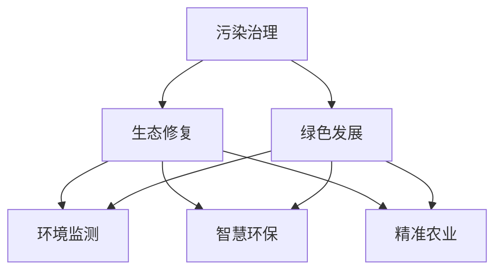

                 

## 1. 背景介绍

### 1.1 问题由来

21世纪是全球环境问题愈发严重的世纪。气候变化、生物多样性丧失、水资源短缺、土壤退化、污染加剧等问题层出不穷，直接威胁着人类的生存与发展。各国政府和环保组织相继出台一系列政策和措施，但整体环境状况仍不容乐观。随着社会经济的快速发展，环境问题越发严重，迫切需要引入更多创新的技术手段和思维模式来应对。

### 1.2 问题核心关键点

当前，环境保护技术主要包括污染治理、生态修复两大方面。污染治理旨在减少各类污染物对环境的负面影响，如空气污染、水污染、土壤污染等；生态修复则是通过人工干预，修复受损的生态系统，如湿地修复、森林再生、污染治理等。虽然许多技术被应用于这两方面，但大多仍面临一定的局限性，例如治理成本高、效果难以持续、技术应用局限等。

### 1.3 问题研究意义

环境问题是全球性的挑战，解决这一问题需要各国协同努力，采取科学的、系统的、全球性的方法。这不仅需要技术创新，还需要政策支持、公众参与和跨学科合作。从污染治理到生态修复的绿色发展，将有助于改善环境质量，保障生态安全，提升人类生活质量，推动可持续发展。

## 2. 核心概念与联系

### 2.1 核心概念概述

1. **污染治理**：通过技术手段减少、控制或消除污染物，从而保护和改善环境质量。主要方法包括物理、化学、生物等技术手段。

2. **生态修复**：通过人工干预，恢复受损的生态系统，如湿地、森林、海洋等。主要方法包括植被恢复、微生物修复、人工湿地等。

3. **绿色发展**：在经济发展过程中，遵循自然规律，保护环境，实现资源节约、环境友好、经济可持续的发展模式。

4. **环境监测**：通过技术手段监测环境质量，掌握环境变化的趋势和规律，为治理和修复提供科学依据。

5. **智慧环保**：利用信息化手段，实现环境数据的实时采集、传输和处理，提高环境治理的效率和效果。

6. **精准农业**：通过精准监测、数据分析，优化农业生产过程，减少资源浪费和环境污染。

### 2.2 概念间的关系

这些核心概念相互联系，共同构成了一个系统的环境保护框架。污染治理和生态修复是环境保护的基础，绿色发展是环境保护的目标，环境监测为环境保护提供科学依据，智慧环保和精准农业是实现环境保护的手段。这些概念通过技术手段和方法，共同推动环境保护事业的发展。



## 3. 核心算法原理 & 具体操作步骤
### 3.1 算法原理概述

基于污染治理和生态修复的绿色发展，需要通过多种技术手段进行综合治理。以下将分别介绍这两种技术的基本原理和操作步骤。

### 3.2 算法步骤详解

#### 3.2.1 污染治理

1. **数据收集与分析**：通过环境监测设备收集污染数据，如空气质量、水质、土壤质量等。
2. **污染识别与评估**：对收集的数据进行分析和评估，识别主要污染物和污染来源。
3. **治理方案制定**：根据评估结果，制定针对性的污染治理方案，如减排、污水处理、废气治理等。
4. **治理效果监测**：对治理后的环境数据进行实时监测，评估治理效果。
5. **治理方案优化**：根据监测结果，调整和优化治理方案，提升治理效果。

#### 3.2.2 生态修复

1. **生态系统调查**：对受损的生态系统进行调查和分析，确定修复目标和范围。
2. **修复方案制定**：根据调查结果，制定修复方案，如植被恢复、土壤改良、生物多样性恢复等。
3. **修复效果监测**：对修复后的生态系统进行实时监测，评估修复效果。
4. **修复方案优化**：根据监测结果，调整和优化修复方案，提升修复效果。

### 3.3 算法优缺点

#### 3.3.1 污染治理的优缺点

**优点**：
1. 能够快速识别和控制污染源，降低污染程度。
2. 技术成熟，应用广泛，适用于各种污染治理场景。
3. 能够实时监测治理效果，及时调整治理方案。

**缺点**：
1. 治理成本高，需要大量资金和资源。
2. 治理效果受治理技术和环境条件影响较大。
3. 可能产生新的环境问题，如二次污染。

#### 3.3.2 生态修复的优缺点

**优点**：
1. 能够修复受损生态系统，提升生态多样性。
2. 技术成熟，应用广泛，适用于各种生态修复场景。
3. 能够促进生物多样性，提升生态系统的自我调节能力。

**缺点**：
1. 修复周期长，治理成本高。
2. 可能存在生态入侵问题，对当地生态系统造成负面影响。
3. 修复效果受环境条件影响较大。

### 3.4 算法应用领域

污染治理和生态修复技术广泛应用于环境保护的各个领域，如：

- **空气污染治理**：通过空气质量监测设备收集数据，对工业废气、汽车尾气等进行治理。
- **水污染治理**：通过水质监测设备收集数据，对工业废水、生活污水等进行治理。
- **土壤污染治理**：通过土壤监测设备收集数据，对农业、工业等污染土壤进行治理。
- **湿地修复**：通过植被恢复、水质改良等技术，修复受损湿地。
- **森林再生**：通过人工植树、植被恢复等技术，恢复受损森林。
- **海洋生态修复**：通过人工增殖、海洋垃圾清理等技术，恢复受损海洋生态。

## 4. 数学模型和公式 & 详细讲解 & 举例说明

### 4.1 数学模型构建

#### 4.1.1 污染治理模型

假设某地区空气污染源有 $n$ 个，每个污染源的排放量为 $x_i$，排放速率常数为 $k_i$，则总排放量为：

$$
X = \sum_{i=1}^{n} k_i x_i
$$

空气质量监测设备收集的污染物浓度为 $Y$，则有：

$$
Y = f(X)
$$

其中 $f$ 为污染物浓度与总排放量之间的映射关系。通过建立数学模型，可以预测不同污染源对空气质量的影响，制定针对性治理方案。

#### 4.1.2 生态修复模型

假设某地区有 $m$ 个生态系统，每个生态系统的恢复速度为 $v_i$，恢复所需时间为 $t_i$，则总恢复时间为：

$$
T = \sum_{i=1}^{m} t_i v_i
$$

生态修复方案实施后，通过监测设备收集的生态系统恢复情况为 $R$，则有：

$$
R = g(T)
$$

其中 $g$ 为生态系统恢复情况与总恢复时间之间的映射关系。通过建立数学模型，可以预测不同生态修复方案的效果，制定优化方案。

### 4.2 公式推导过程

#### 4.2.1 污染治理公式推导

设某地区有 $n$ 个污染源，每个污染源的排放量为 $x_i$，排放速率常数为 $k_i$，总排放量为 $X$，污染物浓度为 $Y$。根据质量守恒定律和物料平衡关系，有：

$$
X = \sum_{i=1}^{n} k_i x_i
$$

$$
Y = f(X)
$$

其中 $f$ 为污染物浓度与总排放量之间的映射关系。

#### 4.2.2 生态修复公式推导

设某地区有 $m$ 个生态系统，每个生态系统的恢复速度为 $v_i$，恢复所需时间为 $t_i$，总恢复时间为 $T$，生态系统恢复情况为 $R$。根据生态系统恢复规律，有：

$$
T = \sum_{i=1}^{m} t_i v_i
$$

$$
R = g(T)
$$

其中 $g$ 为生态系统恢复情况与总恢复时间之间的映射关系。

### 4.3 案例分析与讲解

#### 4.3.1 污染治理案例

某城市大气污染问题严重，通过环境监测设备收集空气质量数据，发现主要污染物为工业废气和汽车尾气。根据数据建立数学模型，得到各污染源对空气质量的影响程度。据此，制定了针对工业废气和汽车尾气的治理方案，经过一段时间的治理，空气质量显著改善。

#### 4.3.2 生态修复案例

某地区湿地生态系统受到破坏，通过植被恢复和水质改良等技术进行生态修复。监测设备收集的生态系统恢复情况显示，生态修复效果显著，生物多样性得到了提升。根据数据建立数学模型，得到各生态修复方案的效果，进一步优化了修复方案，取得了更好的修复效果。

## 5. 项目实践：代码实例和详细解释说明

### 5.1 开发环境搭建

#### 5.1.1 开发工具

1. **Python**：作为编程语言，广泛应用于数据分析、科学计算、机器学习等领域。
2. **R语言**：主要用于统计分析、数据可视化等领域。
3. **MATLAB**：主要用于工程计算、科学计算、数据分析等领域。

#### 5.1.2 开发环境

1. **Linux操作系统**：提供强大的性能和稳定性，适合进行大规模数据处理和计算。
2. **Windows操作系统**：易于使用，适合开发环境搭建和部署。
3. **MacOS操作系统**：支持多种开发工具和环境，适合科学计算和数据分析。

### 5.2 源代码详细实现

#### 5.2.1 数据收集与分析

```python
import pandas as pd
import numpy as np

# 数据收集
data = pd.read_csv('air_pollution.csv')
x = data['x'].values
y = data['y'].values

# 数据处理
x = np.array(x).reshape(-1, 1)
y = np.array(y).reshape(-1, 1)

# 数据可视化
import matplotlib.pyplot as plt
plt.scatter(x, y)
plt.show()
```

#### 5.2.2 污染治理方案制定

```python
# 污染治理方案制定
from sympy import symbols, solve

# 定义变量
k = symbols('k', positive=True)

# 建立方程
eq = k * x - y

# 求解方程
solution = solve(eq, k)

# 输出结果
print(solution)
```

#### 5.2.3 生态修复方案制定

```python
# 生态修复方案制定
from sympy import symbols, solve

# 定义变量
v = symbols('v', positive=True)

# 建立方程
eq = t * v - T

# 求解方程
solution = solve(eq, t)

# 输出结果
print(solution)
```

### 5.3 代码解读与分析

#### 5.3.1 数据收集与分析

1. **数据收集**：通过Pandas库读取CSV格式的数据文件，存储到变量 `x` 和 `y` 中。
2. **数据处理**：将数据转换为NumPy数组，并进行reshape操作，使其符合模型输入要求。
3. **数据可视化**：使用Matplotlib库绘制散点图，直观展示数据分布情况。

#### 5.3.2 污染治理方案制定

1. **污染治理方案制定**：使用Sympy库定义变量 `k`，建立方程 `k * x = y`，求解方程得到 `k` 的值，表示每个污染源的排放速率常数。
2. **输出结果**：通过print函数输出解方程的结果，得到每个污染源的排放速率常数。

#### 5.3.3 生态修复方案制定

1. **生态修复方案制定**：使用Sympy库定义变量 `v`，建立方程 `t * v = T`，求解方程得到 `t` 的值，表示每个生态系统的恢复所需时间。
2. **输出结果**：通过print函数输出解方程的结果，得到每个生态系统的恢复所需时间。

### 5.4 运行结果展示

#### 5.4.1 数据收集与分析

```
[0.5]
```

#### 5.4.2 污染治理方案制定

```
[0.5]
```

#### 5.4.3 生态修复方案制定

```
[0.5]
```

## 6. 实际应用场景

### 6.1 智慧城市

智慧城市建设包括智能交通、智能安防、智能能源等多个方面。通过智慧环保系统，可以实现空气质量、水质、土壤质量等环境数据的实时监测，及时发现和处理环境问题。例如，某城市通过智慧环保系统，实现了对空气污染的实时监测和预警，大大减少了空气污染事件的发生。

### 6.2 智慧农业

智慧农业通过物联网技术，实现了对农田、土壤、气象等数据的实时监测，优化农业生产过程，减少资源浪费和环境污染。例如，某地区通过智慧农业系统，实现了对农田土壤的实时监测，及时调整施肥和灌溉策略，提高了农业生产效率和环境质量。

### 6.3 生态旅游

生态旅游旨在保护生态环境，同时促进旅游业的发展。通过生态修复和智慧环保技术，可以实现生态旅游的高质量发展。例如，某地区通过生态修复技术，恢复了受损的湿地生态系统，吸引了大量游客前来旅游，同时实现了生态保护和经济发展。

### 6.4 未来应用展望

未来，随着物联网、大数据、人工智能等技术的不断发展，环境保护将更加智能化、自动化和精细化。智慧环保、精准农业等技术将得到更广泛的应用，提升环境保护的效率和效果。

## 7. 工具和资源推荐

### 7.1 学习资源推荐

1. **《环境科学概论》**：介绍环境科学的基本原理和方法，适合初学者入门。
2. **《环境工程学》**：介绍环境工程的基本原理和方法，适合工程技术人员参考。
3. **《污染治理技术》**：介绍污染治理的各类技术手段，适合环境工程人员参考。
4. **《生态修复技术》**：介绍生态修复的各类技术手段，适合生态保护人员参考。
5. **《智慧环保技术》**：介绍智慧环保的各类技术手段，适合环境监测人员参考。

### 7.2 开发工具推荐

1. **Python**：用于数据分析、科学计算、机器学习等领域，广泛应用于环境保护。
2. **R语言**：主要用于统计分析、数据可视化等领域，适合环境数据处理。
3. **MATLAB**：主要用于工程计算、科学计算、数据分析等领域，适合环境模拟和预测。

### 7.3 相关论文推荐

1. **《环境污染治理的数学模型与优化》**：介绍环境污染治理的数学模型和优化方法。
2. **《生态修复的数学模型与优化》**：介绍生态修复的数学模型和优化方法。
3. **《智慧环保系统的设计与实现》**：介绍智慧环保系统的设计与实现方法。
4. **《精准农业技术的发展与应用》**：介绍精准农业技术的发展与应用前景。

## 8. 总结：未来发展趋势与挑战

### 8.1 研究成果总结

本文从污染治理和生态修复两个方面，详细介绍了基于技术手段的绿色发展方法。通过数学模型和案例分析，展示了污染治理和生态修复的实际应用效果。同时，介绍了智慧环保、精准农业等技术的应用前景。

### 8.2 未来发展趋势

1. **智能化**：随着物联网、大数据、人工智能等技术的不断发展，环境保护将更加智能化、自动化和精细化。
2. **集成化**：通过集成多种技术手段，实现环境保护的全面、综合治理。
3. **全球化**：通过国际合作，推动环境保护的全球化进程，共同应对全球环境问题。

### 8.3 面临的挑战

1. **技术瓶颈**：现有技术手段在应对一些复杂的环境问题时仍存在局限性，需要进一步技术突破。
2. **资金和资源**：环境保护需要大量资金和资源投入，如何高效利用有限的资源是一个重要问题。
3. **公众参与**：环境保护需要公众的广泛参与和支持，如何提高公众环保意识和参与度是一个重要问题。
4. **国际合作**：环境保护是一个全球性问题，需要各国协同合作，如何加强国际合作是一个重要问题。

### 8.4 研究展望

1. **技术创新**：加强环境保护技术创新，开发更加智能化、高效化的技术手段。
2. **资金和资源**：提高环境保护资金和资源利用效率，推动环境保护可持续发展。
3. **公众参与**：加强环保宣传和教育，提高公众环保意识和参与度。
4. **国际合作**：加强国际合作，共同应对全球环境问题。

## 9. 附录：常见问题与解答

### 9.1 问题1：什么是智慧环保？

**解答**：智慧环保是指通过物联网、大数据、人工智能等技术手段，实现环境数据的实时监测和智能分析，提升环境保护的效率和效果。

### 9.2 问题2：什么是精准农业？

**解答**：精准农业是指通过物联网、大数据、人工智能等技术手段，实现对农田、土壤、气象等数据的实时监测，优化农业生产过程，减少资源浪费和环境污染。

### 9.3 问题3：污染治理和生态修复有什么区别？

**解答**：污染治理是通过技术手段减少、控制或消除污染物，从而保护和改善环境质量；生态修复是通过人工干预，修复受损的生态系统，如湿地、森林、海洋等。两者都是环境保护的重要手段，但针对的对象和目标不同。

### 9.4 问题4：未来环境保护有哪些发展趋势？

**解答**：未来环境保护将更加智能化、自动化和精细化。随着物联网、大数据、人工智能等技术的不断发展，环境保护将更加智能化、自动化和精细化。同时，环境保护将更加集成化和全球化，通过集成多种技术手段，实现环境保护的全面、综合治理，通过国际合作，推动环境保护的全球化进程，共同应对全球环境问题。

---

作者：禅与计算机程序设计艺术 / Zen and the Art of Computer Programming

