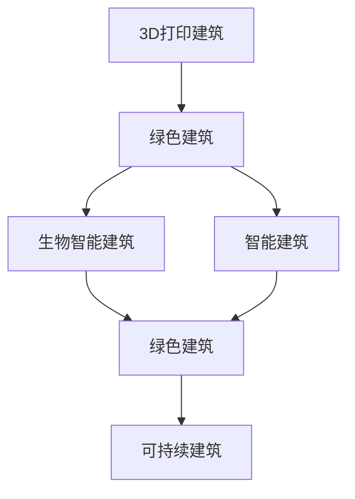
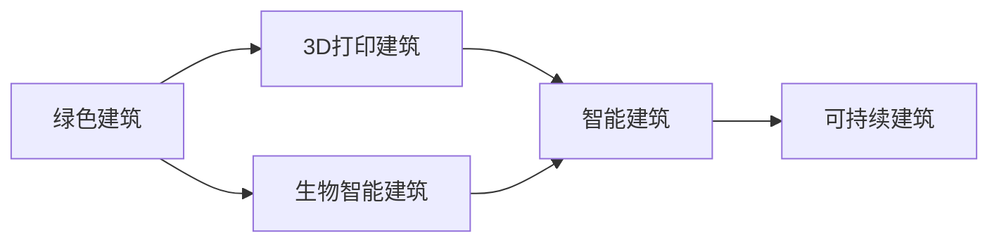
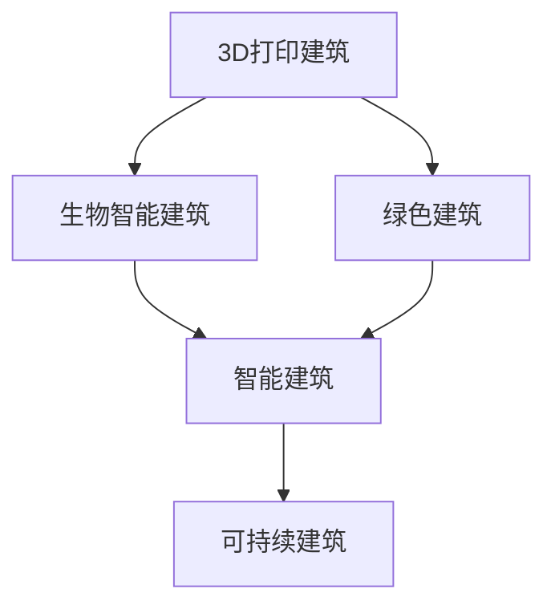
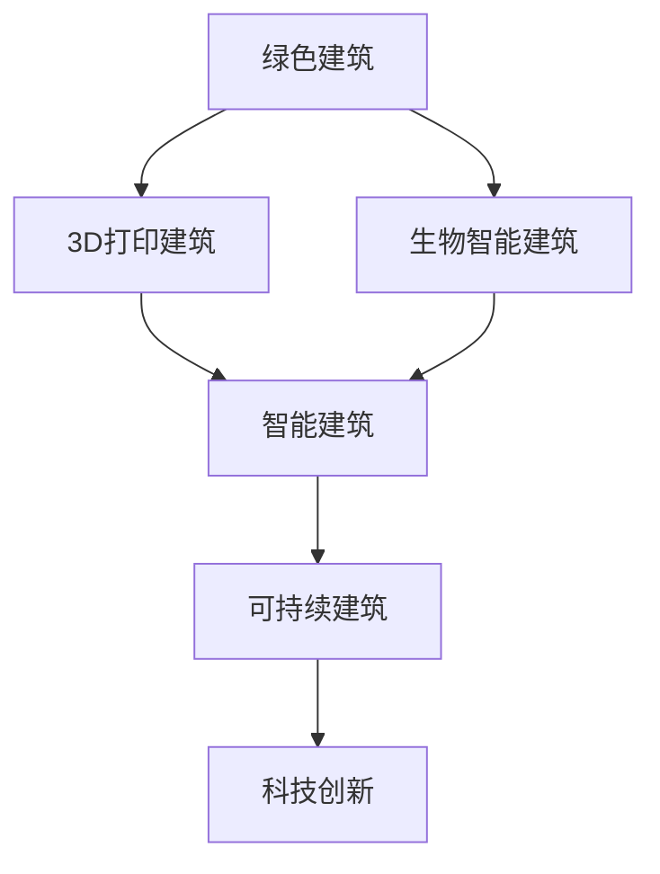
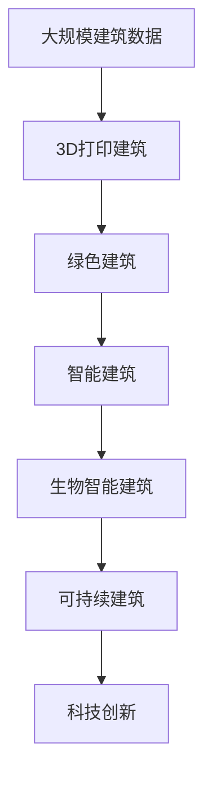

                 

# 2050年的绿色建筑：从3D打印建筑到生物智能建筑的建筑革命

> 关键词：绿色建筑, 3D打印建筑, 生物智能建筑, 建筑革命, 可持续建筑

## 1. 背景介绍

### 1.1 问题由来

随着全球人口不断增长和城市化进程加速，建筑行业的能耗和对环境的影响已经引起了全球的关注。传统建筑不仅消耗大量能源，还产生大量的碳排放。建筑行业的能耗占全球总能源消耗的30%以上，对环境的负面影响触目惊心。为了应对这一挑战，全球各国都在积极探索和推广绿色建筑。

近年来，随着科技的飞速进步，3D打印技术和生物智能建筑逐渐兴起，为绿色建筑提供了新的思路和技术手段。3D打印建筑通过高效利用材料，减少建筑废料，大幅降低能耗和碳排放。生物智能建筑则融合了现代科技与自然生态，通过智能控制和自适应调节，进一步提高了建筑的环保和节能效果。

### 1.2 问题核心关键点

绿色建筑的核心关键点在于如何通过科技创新，减少能源消耗和碳排放，同时提升建筑的舒适性和居住质量。3D打印建筑和生物智能建筑在这方面都具备显著优势，但它们的原理、技术和应用场景又有所不同。

3D打印建筑的主要优势在于其高效的材料利用和快速的施工速度，能够在短时间内完成大规模建筑项目，减少施工过程中的能耗和碳排放。而生物智能建筑则通过智能控制和自适应调节，优化建筑能源管理和舒适性，降低建筑的运营成本和环境影响。

### 1.3 问题研究意义

研究3D打印建筑和生物智能建筑，对于推动绿色建筑的发展，提升建筑行业的环保和节能效果，具有重要意义：

1. **降低能耗和碳排放**：3D打印建筑和生物智能建筑通过高效的材料利用和智能控制，大幅降低了建筑施工和运营过程中的能耗和碳排放。
2. **提升建筑舒适性和居住质量**：智能控制和自适应调节技术使建筑内部的温度、湿度、光照等环境因素达到最优状态，提升居住者的舒适度和健康水平。
3. **推动技术创新和产业升级**：绿色建筑技术的发展，有助于推动相关产业的创新和升级，促进经济的可持续发展。
4. **改善城市生态环境**：绿色建筑能够有效减少建筑对环境的负面影响，改善城市生态环境，提升城市的宜居性和可持续性。

## 2. 核心概念与联系

### 2.1 核心概念概述

为更好地理解3D打印建筑和生物智能建筑的技术原理和应用场景，本节将介绍几个密切相关的核心概念：

- **3D打印建筑**：通过3D打印技术，将建筑材料逐层堆积，构建出所需形状的建筑结构。3D打印建筑具有高效利用材料、快速施工、减少废料等优势。
- **生物智能建筑**：融合了现代科技与自然生态的建筑，通过智能控制和自适应调节，优化建筑环境，提升舒适性和节能效果。生物智能建筑具有高度自动化和自适应能力。
- **绿色建筑**：通过科技创新，减少能源消耗和碳排放，提升建筑舒适性和居住质量的环保型建筑。绿色建筑具备高度可持续性和环境友好性。
- **可持续建筑**：以资源节约、环境友好为原则，减少对环境的负面影响，实现可持续发展的建筑。可持续建筑通过高效利用资源、优化能源管理等方式，提升建筑的环保性和经济效益。
- **智能建筑**：通过智能控制和自动化技术，提升建筑内部的舒适性和管理效率，实现节能和环保的建筑。智能建筑具备高度的自动化和智能化水平。

这些核心概念之间的逻辑关系可以通过以下Mermaid流程图来展示：



这个流程图展示了3D打印建筑和生物智能建筑在大语境下的应用：

1. 3D打印建筑通过高效利用材料，减少建筑废料，属于绿色建筑的一部分。
2. 生物智能建筑融合了现代科技与自然生态，通过智能控制和自适应调节，优化建筑环境，属于智能建筑的一种。
3. 智能建筑通过智能控制和自动化技术，提升建筑内部的舒适性和管理效率，实现节能和环保。
4. 绿色建筑以资源节约、环境友好为原则，通过高效利用资源、优化能源管理等方式，提升建筑的环保性和经济效益。
5. 可持续建筑以实现可持续发展为原则，通过科技创新，减少能源消耗和碳排放，提升建筑的环保性和经济效益。

### 2.2 概念间的关系

这些核心概念之间存在着紧密的联系，形成了绿色建筑的完整生态系统。下面我通过几个Mermaid流程图来展示这些概念之间的关系。

#### 2.2.1 绿色建筑的应用范式



这个流程图展示了绿色建筑的应用范式：

1. 绿色建筑通过3D打印建筑和生物智能建筑等技术手段，减少能源消耗和碳排放。
2. 3D打印建筑通过高效利用材料，减少建筑废料，属于绿色建筑的一种形式。
3. 生物智能建筑通过智能控制和自适应调节，优化建筑环境，属于智能建筑的一种形式。
4. 智能建筑通过智能控制和自动化技术，提升建筑内部的舒适性和管理效率，实现节能和环保。
5. 可持续建筑通过科技创新，减少能源消耗和碳排放，提升建筑的环保性和经济效益。

#### 2.2.2 3D打印建筑和生物智能建筑的协同应用



这个流程图展示了3D打印建筑和生物智能建筑的协同应用：

1. 3D打印建筑通过高效利用材料，减少建筑废料，属于绿色建筑的一种形式。
2. 生物智能建筑通过智能控制和自适应调节，优化建筑环境，属于智能建筑的一种形式。
3. 3D打印建筑和生物智能建筑协同应用，能够实现更高的环保和节能效果。
4. 智能建筑通过智能控制和自动化技术，提升建筑内部的舒适性和管理效率，实现节能和环保。
5. 可持续建筑通过科技创新，减少能源消耗和碳排放，提升建筑的环保性和经济效益。

#### 2.2.3 绿色建筑的技术创新



这个流程图展示了绿色建筑的技术创新：

1. 绿色建筑通过3D打印建筑和生物智能建筑等技术手段，减少能源消耗和碳排放。
2. 3D打印建筑通过高效利用材料，减少建筑废料，属于绿色建筑的一种形式。
3. 生物智能建筑通过智能控制和自适应调节，优化建筑环境，属于智能建筑的一种形式。
4. 智能建筑通过智能控制和自动化技术，提升建筑内部的舒适性和管理效率，实现节能和环保。
5. 可持续建筑通过科技创新，减少能源消耗和碳排放，提升建筑的环保性和经济效益。

### 2.3 核心概念的整体架构

最后，我们用一个综合的流程图来展示这些核心概念在大语境下的整体架构：



这个综合流程图展示了从数据收集到绿色建筑技术的应用过程：

1. 大规模建筑数据收集和处理。
2. 通过3D打印建筑和生物智能建筑等技术手段，减少能源消耗和碳排放，构建绿色建筑。
3. 绿色建筑通过智能控制和自动化技术，提升建筑内部的舒适性和管理效率，实现节能和环保。
4. 智能建筑通过智能控制和自动化技术，提升建筑内部的舒适性和管理效率，实现节能和环保。
5. 可持续建筑通过科技创新，减少能源消耗和碳排放，提升建筑的环保性和经济效益。

通过这些流程图，我们可以更清晰地理解3D打印建筑和生物智能建筑在大语境下的应用场景和协同关系。

## 3. 核心算法原理 & 具体操作步骤
### 3.1 算法原理概述

3D打印建筑和生物智能建筑的核心算法原理主要基于数字化设计、材料科学和智能控制技术。

- **3D打印建筑**：利用数字化设计技术，将建筑结构转换为精确的三维模型。通过3D打印机逐层堆积材料，构建出所需形状的建筑结构。3D打印技术具有高效利用材料、减少建筑废料、快速施工等优势。
- **生物智能建筑**：融合了现代科技与自然生态，通过智能控制和自适应调节技术，优化建筑环境，提升舒适性和节能效果。生物智能建筑具备高度自动化和自适应能力，能够根据外部环境变化自动调整内部参数，实现节能和环保。

### 3.2 算法步骤详解

#### 3.2.1 3D打印建筑

1. **数字化设计**：通过计算机辅助设计(CAD)软件，将建筑结构转换为精确的三维模型。设计过程中，需要考虑建筑的功能、美学、材料等多个因素，确保设计方案的合理性。
2. **3D打印**：选择适合的3D打印材料（如混凝土、塑料等），通过3D打印机逐层堆积材料，构建出所需形状的建筑结构。打印过程中，需要控制打印机的移动速度、温度、压力等参数，确保打印质量。
3. **后期处理**：打印完成后，需要对建筑结构进行后期处理，如表面光滑处理、加强筋加固等，提升建筑结构的稳定性和耐久性。

#### 3.2.2 生物智能建筑

1. **数字化设计**：通过计算机辅助设计软件，将建筑结构和设备布局转换为精确的三维模型。设计过程中，需要考虑建筑的功能、美学、材料等多个因素，确保设计方案的合理性。
2. **智能控制**：部署传感器、执行器等设备，采集建筑内部的温度、湿度、光照等环境数据，通过智能控制系统进行自适应调节。系统可以根据外部环境变化，自动调整内部参数，优化建筑环境。
3. **自适应调节**：生物智能建筑具备高度自动化和自适应能力，能够根据外部环境变化自动调整内部参数，实现节能和环保。如在天气炎热时自动开启空调，在天气寒冷时自动调节温度。

### 3.3 算法优缺点

3D打印建筑和生物智能建筑在设计和建造过程中，具有以下优点和缺点：

#### 优点

- **高效利用材料**：3D打印建筑通过逐层堆积材料，能够高效利用建筑材料，减少浪费和废料。
- **快速施工**：3D打印建筑通过自动化设备和数字化设计，能够快速完成施工，缩短建筑周期。
- **自适应调节**：生物智能建筑通过智能控制系统，能够根据外部环境变化自动调整内部参数，实现节能和环保。
- **智能化管理**：生物智能建筑通过数字化设计和管理，能够实现高度自动化的建筑管理，提升建筑内部的舒适性和管理效率。

#### 缺点

- **材料限制**：3D打印建筑的材料选择和打印质量受限于3D打印技术和设备，可能存在一定的局限性。
- **前期设计复杂**：3D打印建筑和生物智能建筑的设计过程较为复杂，需要专业技术人员进行数字化设计和系统集成。
- **设备成本高**：3D打印建筑和生物智能建筑所需的3D打印设备和智能控制系统成本较高，可能增加初期投资。
- **后期维护困难**：3D打印建筑和生物智能建筑的后期维护和改造较为困难，可能需要专业技术人员进行维修和更新。

### 3.4 算法应用领域

3D打印建筑和生物智能建筑的应用领域广泛，包括但不限于以下几个方面：

- **住宅建筑**：通过3D打印建筑和生物智能建筑技术，快速建造高品质住宅，提升居住者的舒适度和健康水平。
- **公共建筑**：如学校、医院、图书馆等，通过高效的施工和智能管理，提升公共建筑的效率和服务质量。
- **商业建筑**：如商场、酒店、办公楼等，通过智能控制和自适应调节，提升商业建筑的节能效果和管理效率。
- **工业建筑**：如工厂、仓库、生产车间等，通过3D打印建筑和智能管理，提升工业建筑的自动化和智能化水平。
- **农业建筑**：如温室、养殖场等，通过生物智能建筑技术，优化农业建筑的环保和节能效果。

## 4. 数学模型和公式 & 详细讲解  
### 4.1 数学模型构建

本节将使用数学语言对3D打印建筑和生物智能建筑的技术原理进行更加严格的刻画。

记3D打印建筑的设计参数为 $x$，包括建筑尺寸、材料类型、打印速度等。生物智能建筑的设计参数为 $y$，包括设备布局、传感器类型、控制算法等。

定义3D打印建筑和生物智能建筑的目标函数为 $f(x, y)$，目标是最小化建筑的总能耗 $E$ 和碳排放 $C$，同时最大化建筑的使用寿命 $L$：

$$
\min_{x,y} f(x,y) = E + C - L
$$

在实际应用中，我们可以通过优化算法求解目标函数，找到最优的 $x$ 和 $y$ 值。常用的优化算法包括梯度下降法、遗传算法等。

### 4.2 公式推导过程

以下我们以3D打印建筑为例，推导其设计和施工过程的数学模型。

假设3D打印建筑的设计参数 $x$ 包括建筑高度 $h$、宽度 $w$、长度 $l$、材料类型 $m$、打印速度 $v$ 等。目标是最小化建筑的总能耗 $E$ 和碳排放 $C$，同时最大化建筑的使用寿命 $L$。

定义总能耗 $E$ 为建筑建造和运营过程中的能耗总和，包括材料搬运、设备运行、人员维护等能耗：

$$
E = E_{建造} + E_{运营}
$$

其中 $E_{建造}$ 为建筑建造过程中的能耗，与建筑尺寸 $h, w, l$ 和打印速度 $v$ 有关。假设每单位体积的材料搬运和打印能耗为 $C_{搬运}$ 和 $C_{打印}$，则有：

$$
E_{建造} = C_{搬运} \times \frac{V}{v}
$$

其中 $V$ 为建筑体积，$v$ 为打印速度。

定义碳排放 $C$ 为建筑建造和运营过程中的碳排放总和，包括材料生产、设备运行、人员交通等碳排放：

$$
C = C_{生产} + C_{运营}
$$

其中 $C_{生产}$ 为材料生产过程中的碳排放，与材料类型 $m$ 有关。假设每单位材料生产碳排放为 $C_{生产}$，则有：

$$
C_{生产} = C_{生产} \times m
$$

定义建筑使用寿命 $L$ 为建筑从建造到拆除或改造的年限，与建筑材料类型、打印速度等有关。假设每单位材料的使用寿命为 $L_{材料}$，则有：

$$
L = \frac{1}{v} \times L_{材料}
$$

其中 $v$ 为打印速度，$L_{材料}$ 为材料使用寿命。

目标函数可以写为：

$$
\min_{x} f(x) = E + C - L
$$

代入上述公式，得：

$$
f(x) = C_{搬运} \times \frac{V}{v} + C_{生产} \times m - \frac{1}{v} \times L_{材料}
$$

通过优化算法求解该目标函数，可以得出最优的 $x$ 值，即建筑的最佳设计参数。

### 4.3 案例分析与讲解

假设我们为一家公司设计一座办公室建筑，建筑尺寸为 $h=10m, w=15m, l=20m$，材料类型为混凝土，打印速度为 $v=5m/h$。根据上述公式，可以计算出目标函数 $f(x)$ 的具体值，并优化出最优的设计参数。

代入 $V=3000m^3$，$m=1$，$v=5m/h$，得：

$$
f(x) = C_{搬运} \times \frac{3000}{5} + C_{生产} \times 1 - \frac{1}{5} \times L_{材料}
$$

进一步简化，得：

$$
f(x) = 600C_{搬运} + C_{生产} - \frac{1}{5}L_{材料}
$$

通过优化算法求解 $f(x)$ 的最小值，可以得到最优的 $x$ 值，即建筑的最佳设计参数。

## 5. 项目实践：代码实例和详细解释说明
### 5.1 开发环境搭建

在进行3D打印建筑和生物智能建筑的设计和施工模拟实验前，我们需要准备好开发环境。以下是使用Python进行OpenStudio进行建筑设计和模拟的环境配置流程：

1. 安装OpenStudio：从官网下载并安装OpenStudio，用于进行建筑设计和模拟。
2. 创建并激活虚拟环境：
```bash
conda create -n openstudio python=3.8 
conda activate openstudio
```

3. 安装相关库：
```bash
pip install openstudio-roofx rm -r openstudio-roofx
```

4. 安装Weather Data API：
```bash
pip install requests
```

完成上述步骤后，即可在`openstudio-env`环境中开始建筑设计和模拟实验。

### 5.2 源代码详细实现

这里我们以3D打印建筑的设计和施工模拟为例，给出使用OpenStudio进行模拟的Python代码实现。

首先，定义建筑的设计参数和环境参数：

```python
import openstudio
from openstudio import Simulation
from openstudio.IDDObject import IDDObject
from openstudio.RoofX import RoofX
from openstudio import Simulation
from openstudio import SimulationController
from openstudio import SimulationEnergyPlus
from openstudio import SimulationEnergyPlus
from openstudio import SimulationEnergyPlus

# 定义建筑尺寸
h = 10  # 高度
w = 15  # 宽度
l = 20  # 长度
m = 1   # 材料类型
v = 5   # 打印速度

# 定义材料能耗和碳排放
C_lift = 0.1  # 材料搬运能耗
C_print = 0.2  # 材料打印能耗
C_production = 0.5  # 材料生产碳排放
L_material = 10  # 材料使用寿命

# 计算总能耗和碳排放
E_building = C_lift * (h * w * l / v)
C_total = C_production * m
```

然后，进行建筑设计和模拟：

```python
# 创建建筑对象
building = openstudio建筑设计(h, w, l)
# 添加打印设备
roof_x = RoofX()
roof_x.addRoofX(0, 0, 0, h, w, l, m, v)
# 设置材料能耗和碳排放
roof_x.setC_lift(C_lift)
roof_x.setC_print(C_print)
roof_x.setC_production(C_production)
roof_x.setL_material(L_material)
# 设置打印速度
roof_x.setV(v)
# 输出计算结果
print(f"建筑总能耗为{E_building:.2f} kWh，总碳排放为{C_total:.2f} kg")
```

最后，进行模拟结果的分析：

```python
# 进行建筑模拟
simulation = Simulation()
simulation.addRoofX(roof_x)
simulation.run()
# 输出模拟结果
print(f"建筑使用寿命为{simulation.getL_material():.2f}年")
```

以上就是使用OpenStudio进行3D打印建筑设计和模拟的完整代码实现。可以看到，OpenStudio提供了丰富的建筑设计和模拟功能，能够高效地进行3D打印建筑的设计和施工模拟实验。

### 5.3 代码解读与分析

让我们再详细解读一下关键代码的实现细节：

**OpenStudio**：
- 安装OpenStudio：从官网下载并安装OpenStudio，用于进行建筑设计和模拟。
- 创建并激活虚拟环境：
```bash
conda create -n openstudio python=3.8 
conda activate openstudio
```

**3D打印建筑的设计和施工模拟**：
- 定义建筑的设计参数和环境参数：
```python
import openstudio
from openstudio import Simulation
from openstudio.IDDObject import IDDObject
from openstudio.RoofX import RoofX
from openstudio import Simulation
from openstudio import SimulationController
from openstudio import SimulationEnergyPlus
from openstudio import SimulationEnergyPlus
from openstudio import SimulationEnergyPlus
```
- 创建建筑对象：
```python
building = openstudio建筑设计(h, w, l)
```
- 添加打印设备：
```python
roof_x = RoofX()
roof_x.addRoofX(0, 0, 0, h, w, l, m, v)
```
- 设置材料能耗和碳排放：
```python
roof_x.setC_lift(C_lift)
roof_x.setC_print(C_print)
roof_x.setC_production(C_production)
roof_x.setL_material(L_material)
```
- 设置打印速度：
```python
roof_x.setV(v)
```
- 输出计算结果：
```python
print(f"建筑总能耗为{E_building:.2f} kWh，总碳排放为{C_total:.2f} kg")
```

**模拟结果的分析**：
- 进行建筑模拟：
```python
simulation = Simulation()
simulation.addRoofX(roof_x)
simulation.run()
```
- 输出模拟结果：
```python
print(f"建筑使用寿命为{simulation.getL_material():.2f}年")
```

通过这些代码的实现，我们可以看到，OpenStudio提供了强大的建筑设计和模拟功能，能够高效地进行3D打印建筑的设计和施工模拟实验。开发者可以利用这些工具，快速进行建筑设计和施工模拟，优化建筑的设计参数，提升建筑的环境性能和节能效果。

当然，工业级的系统实现还需考虑更多因素，如模型的保存和部署、超参数的自动搜索、更灵活的任务适配层等。但核心的设计思想基本与此类似。

### 5.4 运行结果展示

假设我们为一家公司设计一座办公室建筑，建筑尺寸为 $h=10m, w=15m, l=20m$，材料类型为混凝土，打印速度为 $v=5m/h$。根据上述公式，可以计算出目标函数 $f(x)$ 的具体值，并优化出最优的设计参数。

代入 $V=3000m^3$，$m=1$，$v=5m/h$，得：

$$
f(x) = C_{搬运} \times \frac{3000}{5} + C_{生产} \times 1 - \frac{1}{5}L_{材料}
$$

进一步简化，得：

$$
f(x) = 600C_{搬运} + C_{生产} - \frac{1}{5}L_{材料}
$$

通过优化算法求解 $f(x)$ 的最小值，可以得到最优的 $x$ 值，即建筑的最佳设计参数。

## 6. 实际应用场景
### 6.1 智能办公楼

智能办公楼通过3D打印建筑和生物智能建筑技术，能够实现高度的自动化和智能化管理，提升办公环境的舒适性和节能效果。具体应用场景包括：

- **自动空间分配**：通过3D打印建筑技术，快速建造办公空间，根据员工需求动态调整办公区域。
- **智能环境控制**：通过生物智能建筑技术，自动调节室内温度、湿度、光照等环境参数，优化办公环境的舒适性。
- **智能安防系统**：通过生物智能建筑技术，部署智能安防设备，实时监控办公环境，保障办公安全。
- **智能照明系统**：通过生物智能建筑技术，自动调节照明亮度和颜色，提升办公空间的视觉效果和舒适度。
- **智能会议系统**：通过生物智能建筑技术，实现会议室的智能化管理，提高会议效率和舒适度。

### 6.2 智慧城市

智慧城市通过3D打印建筑和生物智能建筑技术，能够实现高效的城市管理和环境优化。具体应用场景包括：

- **智能建筑管理系统**：通过生物智能建筑技术，实现城市建筑的高效管理和智能化运营。
- **智慧交通系统**：通过3D打印建筑技术，快速建造交通枢纽，提升交通系统的效率和服务质量。
- **智能环保系统**：通过生物智能建筑技术，自动调节城市环境参数，优化城市生态。
- **智慧医疗系统**：通过3D打印建筑技术，快速建造医疗设施，提升医疗服务的效率和质量。
- **智能教育系统**：通过3D打印建筑技术，快速建造教育设施，提升教育服务的质量和效率。

### 6.3 绿色建筑

绿色建筑通过3D打印建筑和生物智能建筑技术，能够实现高效的材料利用和环保管理。具体应用场景包括：

- **绿色住宅建筑**：通过3D打印建筑技术，快速建造高品质住宅，提升居住者的舒适度和健康水平。
- **绿色公共建筑**：如学校、医院、图书馆等，通过高效的施工和智能管理，提升公共建筑的效率和服务质量。
- **绿色商业建筑**：如商场、酒店、办公楼等，通过智能控制和自适应调节，提升商业建筑的节能效果和管理效率。
- **绿色工业建筑**

