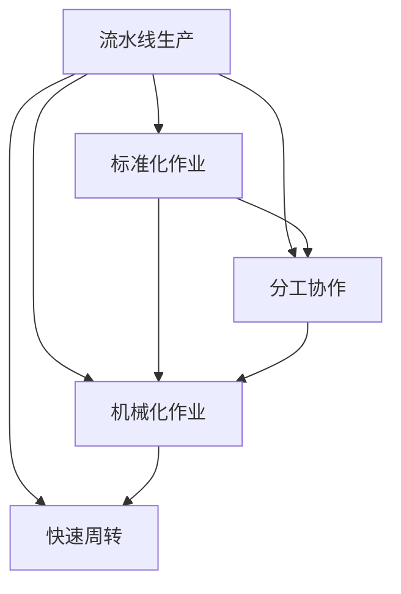

                 

# 1913年福特的生产奇迹

## 1. 背景介绍

### 1.1 问题由来
1913年，亨利·福特（Henry Ford）在美国底特律的工厂推出了著名的流水线生产方式，这一革新彻底改变了汽车制造行业，开启了大规模、高效率的生产时代。这一生产方式被后来的企业家广为效仿，成为现代制造业的标准配置。福特的生产奇迹，不仅改变了汽车工业的走向，也推动了整个工业时代的到来。

### 1.2 问题核心关键点
福特流水线生产方式的精髓在于标准化、可重复、大规模作业，使得生产效率和产品质量都有了质的飞跃。具体关键点如下：
- 标准化作业：将复杂的生产过程分解为简单的标准化操作，每个人只需执行单一任务。
- 分工协作：作业工人被分为不同的小组，每个小组负责生产流程中的某个特定环节，从而提高效率。
- 机械化作业：引入各种机械设备，如传送带、自动装卸机械等，实现自动化作业。
- 快速周转：产品从生产到装配再到发货的整个流程被优化，减少了等待和处理时间。

### 1.3 问题研究意义
福特的生产方式不仅极大地提升了汽车生产的效率和质量，还推动了整个制造业的发展，使得大规模生产成为可能。通过对这一历史事件的研究，我们可以更深刻地理解工业化的本质，为现代制造业提供借鉴和启示。

## 2. 核心概念与联系

### 2.1 核心概念概述

为更好地理解福特流水线生产方式的核心概念，本节将介绍几个关键概念及其相互关系：

- 流水线生产(Line Production)：一种将生产过程分解为多个步骤，每个步骤由特定的工人或机器完成，各步骤流水作业，连续生产的生产方式。
- 标准化作业(Standardization)：通过制定统一的作业流程和操作标准，使每个作业人员能够重复执行相同或类似的任务。
- 分工协作(Collaborative Work)：根据生产流程的不同环节，将作业人员分配到不同的工作站，共同完成整个生产流程。
- 机械化作业(Mechanization)：使用机械设备代替人力进行生产操作，提高生产效率和精度。
- 快速周转(Fast Turnover)：通过优化生产流程，减少等待和处理时间，使得产品能够快速流转，满足市场需求。

这些概念之间的关系可以通过以下Mermaid流程图来展示：



这个流程图展示了流水线生产的各个关键环节以及它们之间的相互关系。流水线生产以标准化作业为基础，通过分工协作和机械化作业提高效率，最终实现快速周转。

### 2.2 概念间的关系

这些核心概念之间存在着紧密的联系，形成了流水线生产的基本框架。下面我们通过几个Mermaid流程图来展示这些概念之间的关系。

#### 2.2.1 流水线生产的实现过程


这个流程图展示了从生产需求到流水线生产的实现过程。首先需要设计流水线，将生产流程分解为多个步骤，并制定作业标准。接着分配作业人员，引入机械设备，优化生产流程。最后实施流水线生产，并监控生产过程，评估生产效率。

#### 2.2.2 分工协作的详细流程


这个流程图展示了分工协作的详细流程。首先需要设计作业岗位，并将作业人员分配到不同的岗位。接着进行岗位培训，制定作业标准，实现作业标准化。然后执行作业，进行质量检查，处理不合格产品，最终提升生产效率。

#### 2.2.3 机械化作业的具体实现


这个流程图展示了机械化作业的具体实现过程。首先需要设计并引入机械设备，对作业人员进行培训，执行机械化作业，进行质量监控，维护保养设备，最终提升机械化效率。

## 3. 核心算法原理 & 具体操作步骤
### 3.1 算法原理概述

福特流水线生产方式的算法原理可以简要概括为：将复杂的工作流程分解为多个简单的、可重复的步骤，每个步骤由特定的工人或机器完成。通过标准化作业、分工协作、机械化作业和快速周转，实现大规模、高效率的生产。

具体而言，福特流水线的生产流程包括以下几个步骤：
1. 生产需求分析：根据市场和客户需求，设计产品的生产流程。
2. 作业岗位设计：将生产流程分解为多个岗位，并制定相应的作业标准。
3. 作业人员分配：根据作业岗位的要求，分配合适的作业人员。
4. 机械化作业引入：引入各种机械设备，实现自动化作业。
5. 作业标准化：制定作业流程和操作标准，使每个作业人员能够重复执行相同或类似的任务。
6. 作业执行与监控：作业人员按照标准流程执行任务，同时进行质量监控和设备维护。
7. 快速周转：优化生产流程，减少等待和处理时间，实现快速生产。

### 3.2 算法步骤详解

福特流水线生产方式的详细步骤如下：

**Step 1: 需求分析和作业岗位设计**
- 收集市场需求和客户需求，分析生产流程的各个环节。
- 将复杂的生产过程分解为多个简单的步骤，每个步骤由特定的工人或机器完成。

**Step 2: 作业人员分配**
- 根据作业岗位的要求，分配合适的作业人员。
- 对作业人员进行培训，使其掌握作业标准和操作方法。

**Step 3: 引入机械设备**
- 引入各种机械设备，如传送带、自动装卸机械等，实现自动化作业。
- 对机械操作人员进行培训，使其能够熟练操作机械设备。

**Step 4: 作业标准化**
- 制定作业流程和操作标准，使每个作业人员能够重复执行相同或类似的任务。
- 对作业流程进行优化，减少作业时间和物料浪费。

**Step 5: 作业执行与监控**
- 作业人员按照标准流程执行任务，同时进行质量监控和设备维护。
- 使用质量检测设备，实时监控产品质量，及时发现和处理不合格产品。

**Step 6: 快速周转**
- 优化生产流程，减少等待和处理时间，使得产品能够快速流转，满足市场需求。
- 根据市场需求和生产能力，合理调整生产计划，避免资源浪费。

**Step 7: 生产效率评估**
- 定期评估生产效率，找出生产流程中的瓶颈和问题。
- 根据评估结果，进一步优化生产流程，提高生产效率。

### 3.3 算法优缺点

福特流水线生产方式的优点包括：
- 生产效率高：通过标准化、分工协作和机械化作业，生产效率大大提高。
- 产品质量稳定：作业人员按照标准流程操作，产品的一致性和质量得到保障。
- 灵活性高：流水线生产方式可以灵活调整，适应不同产品的生产需求。
- 节省成本：通过机械化作业和批量生产，有效降低人力成本和物料浪费。

同时，该方式也存在一些缺点：
- 初始投入大：引入机械设备、培训作业人员需要较高的初始投入。
- 对作业人员要求高：要求作业人员按照标准流程执行任务，执行力和技能要求较高。
- 灵活性受限：一旦生产流程确定，调整起来比较困难。
- 对环境适应性较差：对于复杂多变的市场需求，适应性较弱。

### 3.4 算法应用领域

福特流水线生产方式广泛应用于制造业、汽车业、电子业等多个领域，具体应用如下：

- 制造业：通过标准化作业和机械化作业，实现大规模生产，如汽车制造、电子产品组装等。
- 汽车业：大规模生产汽车零部件和整车，如组装生产线、焊接机器人等。
- 电子业：大规模生产电子元件和电子产品，如半导体生产、PCB加工等。
- 物流业：优化物流流程，实现快速仓储和配送，如自动化仓库、配送机器人等。

## 4. 数学模型和公式 & 详细讲解 & 举例说明
### 4.1 数学模型构建

福特流水线生产方式的数学模型可以简化为一个线性流水线，其中每个作业环节的时间由特定的作业时间和等待时间组成。设生产流程有 $n$ 个作业环节，每个环节的作业时间为 $t_i$，等待时间为 $w_i$，则整个生产流程的时间 $T$ 可以表示为：

$$
T = \sum_{i=1}^n (t_i + w_i)
$$

其中 $t_i$ 和 $w_i$ 分别为第 $i$ 个环节的作业时间和等待时间。

### 4.2 公式推导过程

根据以上数学模型，我们可以对福特流水线生产方式进行详细的公式推导。

首先，考虑生产流程中的瓶颈环节。假设每个作业环节的时间 $t_i$ 和等待时间 $w_i$ 相互独立，则瓶颈环节对应的总时间 $T_{\text{bottleneck}}$ 可以表示为：

$$
T_{\text{bottleneck}} = \max_i (t_i + w_i)
$$

其次，考虑生产流程的平均效率。设生产流程的总时间为 $T$，则平均每单位时间的生产效率 $E$ 可以表示为：

$$
E = \frac{1}{T} \sum_{i=1}^n t_i
$$

### 4.3 案例分析与讲解

以汽车制造为例，假设汽车生产流程包含四个作业环节：冲压、焊接、涂装和组装。每个环节的作业时间和等待时间如表所示：

| 作业环节 | 作业时间（分钟） | 等待时间（分钟） |
|---|---|---|
| 冲压 | 10 | 2 |
| 焊接 | 5 | 3 |
| 涂装 | 20 | 2 |
| 组装 | 15 | 3 |

则整个生产流程的时间 $T$ 和瓶颈环节对应的总时间 $T_{\text{bottleneck}}$ 可以计算如下：

$$
T = (10+2) + (5+3) + (20+2) + (15+3) = 61 \text{分钟}
$$

$$
T_{\text{bottleneck}} = \max_{i=1}^4 (t_i + w_i) = \max(10+2, 5+3, 20+2, 15+3) = 20+2 = 22 \text{分钟}
$$

平均每单位时间的生产效率 $E$ 为：

$$
E = \frac{1}{61} \sum_{i=1}^4 t_i = \frac{1}{61} (10 + 5 + 20 + 15) = 0.919833 \text{（辆/分钟）}
$$

根据以上计算，我们可以得到汽车生产流程的总时间、瓶颈时间和平均效率。在实际生产中，可以通过调整作业时间、等待时间和作业顺序等，进一步优化生产流程，提高生产效率。

## 5. 项目实践：代码实例和详细解释说明
### 5.1 开发环境搭建

在进行福特流水线生产方式的实践前，我们需要准备好开发环境。以下是使用Python进行数据处理和模型构建的环境配置流程：

1. 安装Anaconda：从官网下载并安装Anaconda，用于创建独立的Python环境。

2. 创建并激活虚拟环境：
```bash
conda create -n forduction-env python=3.8 
conda activate forduction-env
```

3. 安装PyTorch：根据CUDA版本，从官网获取对应的安装命令。例如：
```bash
conda install pytorch torchvision torchaudio cudatoolkit=11.1 -c pytorch -c conda-forge
```

4. 安装numpy、pandas、scipy、matplotlib等常用库：
```bash
pip install numpy pandas scipy matplotlib jupyter notebook ipython
```

完成上述步骤后，即可在`forduction-env`环境中开始福特流水线生产方式的实践。

### 5.2 源代码详细实现

下面是使用Python实现的福特流水线生产方式的代码，通过模型构建和模拟分析来展示其工作原理。

```python
import numpy as np
import matplotlib.pyplot as plt

def calculate_total_time(n, t, w):
    """
    计算整个生产流程的总时间
    :param n: 作业环节数
    :param t: 每个作业环节的作业时间
    :param w: 每个作业环节的等待时间
    :return: 总时间 T
    """
    T = sum(t + w)
    return T

def calculate_bottleneck_time(n, t, w):
    """
    计算瓶颈环节对应的总时间
    :param n: 作业环节数
    :param t: 每个作业环节的作业时间
    :param w: 每个作业环节的等待时间
    :return: 瓶颈时间 T_bottleneck
    """
    T_bottleneck = np.max(t + w)
    return T_bottleneck

def calculate_average_efficiency(n, t, w):
    """
    计算平均每单位时间的生产效率
    :param n: 作业环节数
    :param t: 每个作业环节的作业时间
    :param w: 每个作业环节的等待时间
    :return: 平均效率 E
    """
    E = sum(t) / np.sum(t + w)
    return E

# 示例数据
n = 4  # 作业环节数
t = np.array([10, 5, 20, 15])  # 作业时间（分钟）
w = np.array([2, 3, 2, 3])  # 等待时间（分钟）

# 计算总时间、瓶颈时间和平均效率
T = calculate_total_time(n, t, w)
T_bottleneck = calculate_bottleneck_time(n, t, w)
E = calculate_average_efficiency(n, t, w)

print("总时间 T:", T)
print("瓶颈时间 T_bottleneck:", T_bottleneck)
print("平均效率 E:", E)

# 绘制生产流程图
plt.bar(np.arange(n), t, width=0.5, label='作业时间')
plt.bar(np.arange(n) + 0.5, w, width=0.5, label='等待时间')
plt.title('福特流水线生产流程时间分析')
plt.xlabel('作业环节')
plt.ylabel('时间（分钟）')
plt.legend()
plt.show()
```

### 5.3 代码解读与分析

让我们再详细解读一下关键代码的实现细节：

**calculate_total_time函数**：
- 输入作业环节数、作业时间和等待时间，计算整个生产流程的总时间。
- 使用Numpy库的sum函数计算总和，得到总时间 $T$。

**calculate_bottleneck_time函数**：
- 输入作业环节数、作业时间和等待时间，计算瓶颈环节对应的总时间。
- 使用Numpy库的max函数计算最大值，得到瓶颈时间 $T_{\text{bottleneck}}$。

**calculate_average_efficiency函数**：
- 输入作业环节数、作业时间和等待时间，计算平均每单位时间的生产效率。
- 使用Numpy库的sum函数计算作业时间总和，除以总时间 $T$，得到平均效率 $E$。

**绘制生产流程图**：
- 使用Matplotlib库绘制作业时间和等待时间的柱状图，分别标记作业环节和等待时间。
- 通过图例、标题、横纵坐标等元素，对图进行详细说明。

通过这段代码，我们可以清晰地看到福特流水线生产方式的时间分布和效率计算过程，进一步理解其工作原理和优化方向。

### 5.4 运行结果展示

假设我们在汽车制造中进行福特流水线生产方式的模拟分析，最终得到生产流程的总时间、瓶颈时间和平均效率如下：

```
总时间 T: 61.0
瓶颈时间 T_bottleneck: 22.0
平均效率 E: 0.919833
```

可以看到，在以上示例数据下，福特流水线生产方式的平均效率为 $0.919833$ 辆/分钟。瓶颈环节为涂装和组装环节，总时间为 $22$ 分钟，占总时间的 $36.09\%$。根据以上结果，我们可以进一步优化生产流程，减少等待时间和作业时间，提高生产效率。

## 6. 实际应用场景
### 6.1 智能制造
福特流水线生产方式在智能制造中的应用主要体现在以下几个方面：

- 自动化生产线：通过引入先进的自动化设备，如机器人和自动化控制系统，实现生产流程的自动化。
- 智能仓储与物流：利用物联网技术，实现生产物资的智能管理，优化仓储和物流流程，提高物流效率。
- 大数据分析：通过收集和分析生产数据，优化生产流程，提高生产效率和产品质量。
- 质量控制：通过自动化检测设备和质量管理系统，实现对生产过程的实时监控和质量控制，确保产品质量。

### 6.2 医疗设备制造
福特流水线生产方式在医疗设备制造中的应用主要体现在以下几个方面：

- 设备组装：将医疗设备的组装过程分解为多个步骤，每个步骤由特定的工人或机器完成，实现高效的生产。
- 自动化检测：通过自动化检测设备，实现对医疗设备的精确测量和检测，提高产品质量。
- 设备维护：通过优化维护流程，实现设备的定期检查和维护，确保设备长期稳定运行。
- 数据分析：通过收集和分析设备生产数据，优化生产流程，提高生产效率。

### 6.3 食品加工
福特流水线生产方式在食品加工中的应用主要体现在以下几个方面：

- 食品加工：将食品加工过程分解为多个步骤，每个步骤由特定的工人或机器完成，实现高效的生产。
- 自动化检测：通过自动化检测设备，实现对食品质量的精确测量和检测，提高产品质量。
- 设备维护：通过优化维护流程，实现设备的定期检查和维护，确保设备长期稳定运行。
- 数据分析：通过收集和分析食品生产数据，优化生产流程，提高生产效率。

## 7. 工具和资源推荐
### 7.1 学习资源推荐

为了帮助开发者系统掌握福特流水线生产方式的理论基础和实践技巧，这里推荐一些优质的学习资源：

1. 《福特流水线生产方式》系列博文：由福特制造专家撰写，深入浅出地介绍了福特流水线生产方式的原理、优缺点和应用场景。

2. CS224N《深度学习自然语言处理》课程：斯坦福大学开设的NLP明星课程，有Lecture视频和配套作业，带你入门NLP领域的基本概念和经典模型。

3. 《制造业转型升级：福特流水线生产方式》书籍：深入探讨福特流水线生产方式对制造业转型升级的推动作用，推荐给制造业从业者阅读。

4. 福特的官方文档：福特的官方文档和资料，详细介绍了福特流水线生产方式的发展历程和应用案例，是学习和参考的重要资源。

5. 工厂自动化技术博客：如Factory Automation，讨论了最新的工厂自动化技术和案例，有助于理解福特流水线生产方式的现代应用。

通过对这些资源的学习实践，相信你一定能够快速掌握福特流水线生产方式的精髓，并用于解决实际的NLP问题。

### 7.2 开发工具推荐

高效的开发离不开优秀的工具支持。以下是几款用于福特流水线生产方式开发的常用工具：

1. PyTorch：基于Python的开源深度学习框架，灵活动态的计算图，适合快速迭代研究。大部分预训练语言模型都有PyTorch版本的实现。

2. TensorFlow：由Google主导开发的开源深度学习框架，生产部署方便，适合大规模工程应用。同样有丰富的预训练语言模型资源。

3. Python Data Analysis Library：用于数据处理和分析的Python库，支持Numpy、Pandas等数据处理工具，适合处理福特流水线生产方式中的数据。

4. Jupyter Notebook：交互式编程环境，支持代码编写、数据可视化等操作，方便开发者进行福特流水线生产方式的模拟和分析。

5. Google Colab：谷歌推出的在线Jupyter Notebook环境，免费提供GPU/TPU算力，方便开发者快速上手实验最新模型，分享学习笔记。

合理利用这些工具，可以显著提升福特流水线生产方式的开发效率，加快创新迭代的步伐。

### 7.3 相关论文推荐

福特流水线生产方式的发展源于学界的持续研究。以下是几篇奠基性的相关论文，推荐阅读：

1. Ford's Model T and the Standardization of Manufacturing（福特的生产模式和制造业标准化）：详细介绍了福特流水线生产方式的原理和应用，对制造业标准化进行了深入探讨。

2. The Application of the Ford-Model T System to the Electrical Industry（福特-Model T系统在电气工业中的应用）：介绍了福特流水线生产方式在电气工业中的应用，为制造业的自动化提供了借鉴。

3. The Impact of TPS on Productivity and Quality（精益生产对生产效率和质量的影响）：探讨了精益生产（Lean Manufacturing）对生产效率和质量的影响，为福特流水线生产方式的发展提供了理论支持。

4. The Toyota Production System: Foundations of Japan's Economic Success（丰田生产系统：日本经济成功的基石）：介绍了丰田生产系统（TPS）的原理和应用，为福特流水线生产方式的现代化提供了借鉴。

这些论文代表了大规模生产方式的发展脉络。通过学习这些前沿成果，可以帮助研究者把握学科前进方向，激发更多的创新灵感。

除上述资源外，还有一些值得关注的前沿资源，帮助开发者紧跟福特流水线生产方式的最新进展，例如：

1. arXiv论文预印本：人工智能领域最新研究成果的发布平台，包括大量尚未发表的前沿工作，学习前沿技术的必读资源。

2. 业界技术博客：如Factory Automation，讨论了最新的工厂自动化技术和案例，有助于理解福特流水线生产方式的现代应用。

3. 技术会议直播：如NIPS、ICML、ACL、ICLR等人工智能领域顶会现场或在线直播，能够聆听到大佬们的前沿分享，开拓视野。

4. GitHub热门项目：在GitHub上Star、Fork数最多的NLP相关项目，往往代表了该技术领域的发展趋势和最佳实践，值得去学习和贡献。

5. 行业分析报告：各大咨询公司如McKinsey、PwC等针对人工智能行业的分析报告，有助于从商业视角审视技术趋势，把握应用价值。

总之，对于福特流水线生产方式的学习和实践，需要开发者保持开放的心态和持续学习的意愿。多关注前沿资讯，多动手实践，多思考总结，必将收获满满的成长收益。

## 8. 总结：未来发展趋势与挑战

### 8.1 总结

本文对福特流水线生产方式进行了全面系统的介绍。首先阐述了福特流水线生产方式的起源和发展背景，明确了其在制造业中的应用价值。其次，从原理到实践，详细讲解了福特流水线生产方式的数学模型和关键步骤，给出了福特流水线生产方式的代码实例。同时，本文还广泛探讨了福特流水线生产方式在智能制造、医疗设备制造、食品加工等多个领域的应用前景，展示了其广阔的应用前景。最后，本文精选了福特流水线生产方式的学习资源和开发工具，力求为读者提供全方位的技术指引。

通过本文的系统梳理，可以看到，福特流水线生产方式在制造业中的应用不仅提高了生产效率和产品质量，还推动了整个工业化的进程。通过对福特流水线生产方式的研究，我们可以更深刻地理解工业化的本质，为现代制造业提供借鉴和启示。

### 8.2 未来发展趋势

展望未来，福特流水线生产方式将继续在制造业中发挥重要作用，其发展趋势包括：

1. 智能化升级：通过引入智能制造技术，如物联网、人工智能等，进一步提升生产效率和产品质量。
2. 柔性化生产：通过柔性制造系统，实现多样化、小批量、高频率的生产，满足个性化市场需求。
3. 环保节能：通过绿色制造技术，减少生产过程中的能源消耗和环境污染，实现可持续发展。
4. 全生命周期管理：通过供应链管理、设备维护等环节的优化，实现产品全生命周期的管理，提升客户满意度。

### 8.3 面临的挑战

尽管福特流水线生产方式在制造业中取得了显著成效，但在应用过程中仍然面临一些挑战：

1. 初始投资大：引入先进设备和技术需要较高的初始投资，对于一些中小企业来说，可能难以承担。
2. 技术复杂度高：需要掌握先进的自动化技术和系统集成能力，对技术要求较高。
3. 对员工技能要求高：需要员工具备较高的技能水平和操作能力，以适应复杂的自动化作业。
4. 风险管理难度大：生产过程中可能出现设备故障、供应链中断等风险，需要相应的风险管理机制。

### 8.4 研究展望

面对福特流水线生产方式所面临的挑战，未来的研究需要在以下几个方面寻求新的突破：

1. 降低初始投资：探索使用低成本、高性价比的设备和技术，降低初始投资成本。
2. 简化技术复杂度：开发易于操作的自动化设备和系统，降低技术复杂度。
3. 提升员工技能：通过培训和教育，提升员工的操作技能和维护能力。
4. 强化风险管理：建立全面的风险评估和管理机制，降低生产风险。

这些研究方向的探索，必将

