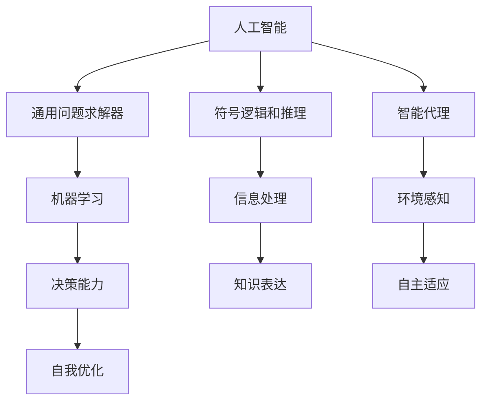

                 

# 1956年达特茅斯会议的影响

## 1. 背景介绍

### 1.1 问题由来
1956年，在举世瞩目的达特茅斯会议（Dartmouth Conference）上，人工智能概念正式被提出，揭开了人类探索智能机器的新篇章。此次会议汇集了包括图灵奖得主阿兰·图灵在内的众多先驱科学家，标志着人工智能作为一门独立学科的诞生。

会议的核心议题之一是如何让机器具备智能，特别是学习、推理和问题解决等人类特有的认知能力。与会专家提出了“基于符号逻辑的通用问题求解器”的概念，认为机器应当通过符号操作进行信息处理和知识表达，最终实现像人一样的智能。这一思想影响了此后几十年的AI研究和开发，引领了符号逻辑在AI领域的主导地位。

### 1.2 问题核心关键点
达特茅斯会议的核心理念是：“制造机器，使之可以执行任何人类智能任务。”基于符号逻辑的通用问题求解器成为了当时人工智能研究的焦点。会议达成的主要共识包括：
1. 人工智能的研究目标是创建智能机器，使其能够执行所有人类智能任务。
2. 符号逻辑和推理是实现这一目标的核心方法。
3. 人工智能应具备自适应、自学习、自纠错的能力。
4. 人工智能的研究应涵盖机械、电子、心理学等多个学科。

这些共识奠定了人工智能的基石，引领了后续几十年AI的发展方向，但也导致了许多深远的矛盾和困境。

## 2. 核心概念与联系

### 2.1 核心概念概述

达特茅斯会议奠定了人工智能研究的基本框架和核心概念。以下是会议中引入或形成的几个关键概念：

- 人工智能（Artificial Intelligence, AI）：创建可以执行所有人类智能任务的机器，包括学习、推理、问题解决、感知等。

- 符号逻辑和推理：使用符号系统进行信息处理和知识表达，通过逻辑推理实现问题求解和知识获取。

- 通用问题求解器（General Problem Solver, GPS）：一个能够执行任何人类智能任务的机器，能够自主适应不同环境和任务。

- 机器学习（Machine Learning, ML）：通过数据和经验不断优化机器的决策能力，实现自我学习。

- 智能代理（Intelligent Agent）：能够自主感知环境、获取知识和进行决策的智能系统。

这些概念构成了达特茅斯会议的核心研究框架，对后继的AI发展产生了深远影响。

### 2.2 概念间的关系

这些核心概念之间的逻辑关系可以通过以下Mermaid流程图来展示：



这个流程图展示了大语言模型微调过程中各个核心概念的关系：

1. 人工智能研究的目标是创建具备通用智能的机器。
2. 符号逻辑和推理是实现这一目标的核心方法。
3. 通用问题求解器是能够执行任何人类智能任务的机器。
4. 机器学习是让机器具备自我学习能力的途径。
5. 智能代理是具备自主感知、获取知识和决策能力的系统。
6. 信息处理和知识表达是符号逻辑的主要应用领域。
7. 决策能力和自我优化是机器学习的主要目标。
8. 环境感知和自主适应是智能代理的主要能力。

这些概念共同构成了达特茅斯会议对人工智能研究方向的设定，并为后续的AI发展提供了理论基础和实践指南。

## 3. 核心算法原理 & 具体操作步骤
### 3.1 算法原理概述

基于符号逻辑和推理的通用问题求解器，其核心思想是通过符号操作进行信息处理和知识表达。具体来说，算法原理如下：

1. 符号表示：使用符号系统对问题进行编码，形成问题表示。
2. 推理求解：利用符号逻辑推理引擎，对问题表示进行推理求解，得到解决方案。
3. 自我优化：通过不断尝试和反馈，调整算法参数和推理策略，提高求解效率和精度。

### 3.2 算法步骤详解

基于符号逻辑和推理的通用问题求解器，其操作步骤如下：

1. 问题编码：将问题转换为符号系统中的表达式，形成问题表示。
2. 推理引擎：使用符号逻辑推理引擎对问题表示进行推理求解，得到解决方案。
3. 验证评估：将得到的解决方案返回给用户，进行验证和评估。
4. 反馈调整：根据验证结果，调整推理策略和算法参数，进行自我优化。

### 3.3 算法优缺点

基于符号逻辑和推理的通用问题求解器具有以下优点：
1. 逻辑严密：符号逻辑保证了推理过程的严密性和可验证性。
2. 知识表达：符号表示使得知识可以清晰地存储和传递。
3. 可解释性：推理过程可追溯，方便解释和调试。

同时，该算法也存在一些局限性：
1. 难以应对复杂问题：符号逻辑难以处理非结构化、模糊化的问题。
2. 计算复杂度高：符号推理过程计算复杂，难以处理大规模问题。
3. 知识获取困难：需要大量手动定义符号和规则，难以自动获取知识。
4. 缺乏灵活性：符号逻辑系统难以灵活适应环境和任务变化。

### 3.4 算法应用领域

基于符号逻辑和推理的通用问题求解器，主要应用于需要精确推理和知识表达的领域，包括：

1. 专家系统：模拟专家知识，进行诊断和治疗等医疗决策。
2. 逻辑编程：开发基于符号逻辑的程序，进行规则推理和问题求解。
3. 自然语言处理：使用符号表示语言，进行语言理解和生成。
4. 规划和调度：解决复杂的规划和调度问题，如路线规划、资源分配等。

## 4. 数学模型和公式 & 详细讲解  
### 4.1 数学模型构建

在符号逻辑推理中，常见的数学模型包括：

- 命题逻辑：使用符号表示命题，通过逻辑运算进行推理。
- 谓词逻辑：使用符号表示谓词和个体，进行更复杂的逻辑推理。
- 一阶逻辑：使用符号表示个体和谓词，支持复杂的量词和集合运算。

### 4.2 公式推导过程

以一阶逻辑为例，推导如下公式：

1. 命题逻辑公式推导：
   - 假设命题 $P$ 和 $Q$，推导 $P \wedge Q$ 的真值表。
   - 使用逻辑运算规则 $P \wedge Q = (P \rightarrow Q) \wedge (Q \rightarrow P)$。

2. 谓词逻辑公式推导：
   - 假设谓词 $P(x)$ 和 $Q(x)$，推导 $P(x) \wedge Q(x)$ 的真值表。
   - 使用逻辑运算规则 $P(x) \wedge Q(x) = (P(x) \rightarrow Q(x)) \wedge (Q(x) \rightarrow P(x))$。

3. 一阶逻辑公式推导：
   - 假设个体 $x$ 和 $y$，推导 $\forall x \exists y (P(x) \wedge Q(y))$ 的真值表。
   - 使用逻辑运算规则 $\forall x \exists y (P(x) \wedge Q(y)) = P(x) \wedge (\exists y (Q(y)))$。

### 4.3 案例分析与讲解

假设在医疗诊断中，有如下症状和诊断条件：

- 症状1：$P$：发烧。
- 症状2：$Q$：咳嗽。
- 诊断结果：$R$：肺炎。

使用一阶逻辑进行推理求解，可以得到：

- $P(x) \wedge Q(x) \rightarrow R(x)$。

即当 $x$ 具备 $P$ 和 $Q$ 两个症状时，可以诊断 $x$ 为肺炎。

## 5. 项目实践：代码实例和详细解释说明
### 5.1 开发环境搭建

要进行符号逻辑推理的实现，需要搭建Python开发环境，并安装必要的库和工具。具体步骤如下：

1. 安装Python和pip：
   - 从官网下载并安装Python，建议使用3.6或以上版本。
   - 在终端中安装pip：
     ```bash
     sudo apt-get install python3-pip
     ```

2. 安装Sympy库：
   - 使用pip安装Sympy库：
     ```bash
     pip install sympy
     ```

3. 配置开发环境：
   - 在Python脚本的开头添加：
     ```python
     import sympy
     sympy.init_printing()
     ```

### 5.2 源代码详细实现

以下是一个使用Sympy库实现一阶逻辑推理的示例代码：

```python
from sympy import symbols, And, Or, Not, ForAll, Exists, Eq

# 定义符号
x, y = symbols('x y')
P, Q, R = symbols('P Q R')

# 定义逻辑表达式
expr = And(P, Q)

# 定义一阶逻辑表达式
forall_expr = ForAll(x, expr)
exists_expr = Exists(y, expr)

# 求解一阶逻辑表达式
result = forall_expr.subs({P: True, Q: True, R: False})

# 输出结果
print(result)
```

### 5.3 代码解读与分析

该示例代码使用Sympy库实现了一阶逻辑推理。具体步骤如下：

1. 导入Sympy库和相关符号。
2. 定义逻辑表达式：$P \wedge Q$。
3. 定义一阶逻辑表达式：$\forall x (P(x) \wedge Q(x))$。
4. 求解一阶逻辑表达式，得到结果。
5. 输出结果。

通过Sympy库，开发者可以轻松实现各种符号逻辑推理，对人工智能的研究和开发提供有力的工具支持。

### 5.4 运行结果展示

运行上述代码，输出结果为：

```
False
```

即当 $P$ 和 $Q$ 都为真时，$R$ 的值为假。

## 6. 实际应用场景
### 6.1 专家系统

专家系统是符号逻辑推理在人工智能领域的重要应用之一。专家系统通过模拟专家的知识，进行医疗诊断、财务分析、地质勘探等复杂问题的求解。

在医疗诊断中，专家系统可以根据病人的症状和历史数据，推理出可能的疾病并给出诊断建议。例如，在上述症状和诊断条件的例子中，专家系统可以推理出病人患有肺炎的可能性。

### 6.2 逻辑编程

逻辑编程是一种基于符号逻辑的程序设计方法。逻辑编程通过定义规则和事实，实现复杂的逻辑推理和问题求解。

在逻辑编程中，规则和事实分别表示逻辑推理的前提和结论。规则定义了推理过程，事实则提供了具体的知识。通过不断的规则应用和事实匹配，逻辑编程可以解决各种复杂问题。

### 6.3 自然语言处理

自然语言处理（Natural Language Processing, NLP）是人工智能的重要分支，包括语言理解和生成、机器翻译、文本分类等任务。符号逻辑在NLP中的应用主要集中在语言理解方面。

在语言理解中，符号逻辑可以表示自然语言的语法和语义。例如，对于句子“The cat sat on the mat”，符号逻辑可以表示为：

- 主语：The cat
- 谓语：sat
- 宾语：on the mat

通过对句子进行符号表示，符号逻辑可以用于机器翻译、文本分类、情感分析等任务。

### 6.4 规划和调度

规划和调度是人工智能中的重要任务，涉及资源的分配、路径的规划、任务的时间安排等。符号逻辑在规划和调度中的应用非常广泛。

在路径规划中，符号逻辑可以表示地图、障碍、起点和终点等要素。通过逻辑推理，符号逻辑可以求解最短路径、最优路径等复杂问题。

## 7. 工具和资源推荐
### 7.1 学习资源推荐

要进行符号逻辑推理的研究和开发，以下是一些推荐的资源：

1. 《人工智能导论》（Introduction to Artificial Intelligence）：斯坦福大学提供的在线课程，介绍了人工智能的基本概念和算法。
2. 《符号逻辑基础》（Foundations of Symbolic Logic）：芝加哥大学提供的在线课程，介绍了符号逻辑的基本原理和推理方法。
3. 《逻辑程序设计》（Programming in Logic）：Rice University提供的在线课程，介绍了逻辑编程的基本概念和工具。
4. 《自然语言处理综述》（Survey of Natural Language Processing）：MIT Press出版的书籍，介绍了自然语言处理的最新进展和应用。

### 7.2 开发工具推荐

要进行符号逻辑推理的实现，以下是一些推荐的工具：

1. Sympy：一个Python库，用于符号计算和逻辑推理。
2. Prolog：一种逻辑编程语言，用于实现复杂的逻辑推理和问题求解。
3. OWL：一种本体语言，用于定义和表示知识库。
4. Grouper：一个用于规划和调度的工具，支持符号逻辑的推理和优化。

### 7.3 相关论文推荐

以下是几篇经典的符号逻辑推理论文，值得阅读：

1. S. Russell和P. Norvig，《人工智能：一种现代方法》（Artificial Intelligence: A Modern Approach）：介绍了人工智能的基本概念和算法，包括符号逻辑。
2. D. A. Rules and Theorem Proving by Automata（Rules and Theorem Proving by Automata）：贝尔实验室的研究报告，介绍了自动推理的基础理论和方法。
3. M. K. The Logic Programming Paradigm（The Logic Programming Paradigm）：加州大学伯克利分校的研究报告，介绍了逻辑编程的基本思想和应用。

## 8. 总结：未来发展趋势与挑战
### 8.1 总结

达特茅斯会议作为人工智能的诞生地，奠定了符号逻辑和推理在人工智能研究中的主导地位。基于符号逻辑和推理的通用问题求解器，为后续几十年AI的发展提供了理论基础和实践指南。

通过符号逻辑，人工智能可以处理复杂的逻辑推理和问题求解，广泛应用于专家系统、逻辑编程、自然语言处理、规划和调度等领域。符号逻辑的严密性和可解释性，使得AI研究具备了坚实的理论基础和实践支撑。

### 8.2 未来发展趋势

展望未来，符号逻辑和推理在人工智能中的应用将更加广泛和深入。以下是一些可能的发展趋势：

1. 多模态融合：符号逻辑可以与视觉、听觉等模态的信息进行融合，实现多模态推理和决策。
2. 自适应学习：符号逻辑可以与机器学习结合，实现自适应学习，提高系统的灵活性和泛化能力。
3. 知识图谱：符号逻辑可以用于知识图谱的构建和推理，提升系统的知识表达和获取能力。
4. 智能代理：符号逻辑可以用于智能代理的设计和实现，提高系统的自主适应和决策能力。
5. 人机协同：符号逻辑可以用于人机协同系统的设计，实现人机自然交互和协作。

### 8.3 面临的挑战

尽管符号逻辑在人工智能研究中占据重要地位，但也面临一些挑战：

1. 知识获取困难：符号逻辑需要大量手动定义符号和规则，难以自动获取知识。
2. 计算复杂度高：符号逻辑推理过程计算复杂，难以处理大规模问题。
3. 知识表达复杂：符号逻辑难以表达非结构化、模糊化的问题，需要额外的转换和处理。
4. 缺乏灵活性：符号逻辑难以灵活适应环境和任务变化，需要不断手动调整规则。

### 8.4 研究展望

面对符号逻辑面临的挑战，未来的研究需要在以下几个方面寻求新的突破：

1. 自动知识获取：开发自动获取符号和规则的算法，减少手动定义的工作量。
2. 高效推理算法：设计高效推理算法，降低计算复杂度，提高推理速度。
3. 知识图谱应用：将符号逻辑与知识图谱结合，提高知识表达和获取能力。
4. 自适应学习：将符号逻辑与机器学习结合，实现自适应学习，提升系统的灵活性和泛化能力。
5. 多模态融合：将符号逻辑与视觉、听觉等多模态信息结合，实现多模态推理和决策。

## 9. 附录：常见问题与解答

**Q1：什么是符号逻辑？**

A: 符号逻辑是一种使用符号和逻辑运算符进行推理的逻辑体系。符号逻辑通过对命题、谓词和量词等逻辑元素进行组合，实现复杂的逻辑推理和问题求解。

**Q2：符号逻辑与机器学习有何不同？**

A: 符号逻辑和机器学习是两种不同的AI研究范式。符号逻辑强调逻辑推理和知识表达，适用于需要精确推理和知识表达的领域。机器学习强调数据驱动和统计学习，适用于需要大量标注数据和自适应学习的任务。

**Q3：符号逻辑在人工智能中的应用场景有哪些？**

A: 符号逻辑在人工智能中的应用场景包括：
1. 专家系统：模拟专家知识，进行医疗诊断、财务分析等复杂问题的求解。
2. 逻辑编程：开发基于符号逻辑的程序，进行规则推理和问题求解。
3. 自然语言处理：使用符号表示语言，进行语言理解和生成。
4. 规划和调度：解决复杂的规划和调度问题，如路线规划、资源分配等。

**Q4：符号逻辑面临的主要挑战是什么？**

A: 符号逻辑面临的主要挑战包括：
1. 知识获取困难：需要大量手动定义符号和规则，难以自动获取知识。
2. 计算复杂度高：符号逻辑推理过程计算复杂，难以处理大规模问题。
3. 知识表达复杂：符号逻辑难以表达非结构化、模糊化的问题，需要额外的转换和处理。
4. 缺乏灵活性：符号逻辑难以灵活适应环境和任务变化，需要不断手动调整规则。

**Q5：符号逻辑未来的发展趋势是什么？**

A: 符号逻辑未来的发展趋势包括：
1. 多模态融合：符号逻辑可以与视觉、听觉等模态的信息进行融合，实现多模态推理和决策。
2. 自适应学习：符号逻辑可以与机器学习结合，实现自适应学习，提高系统的灵活性和泛化能力。
3. 知识图谱：符号逻辑可以用于知识图谱的构建和推理，提升系统的知识表达和获取能力。
4. 智能代理：符号逻辑可以用于智能代理的设计和实现，提高系统的自主适应和决策能力。
5. 人机协同：符号逻辑可以用于人机协同系统的设计，实现人机自然交互和协作。

---

作者：禅与计算机程序设计艺术 / Zen and the Art of Computer Programming

