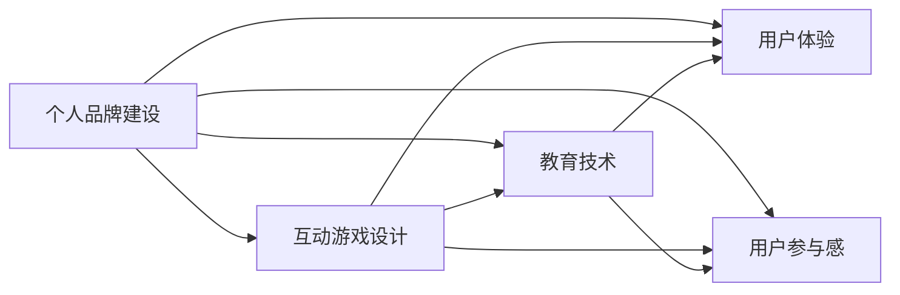

                 

# 开发个人品牌互动游戏：寓教于乐

> 关键词：个人品牌建设, 互动游戏设计, 教育技术, 用户体验, 用户参与, 社交媒体

## 1. 背景介绍

### 1.1 问题由来

在数字化时代，个人品牌建设成为越来越多专业人士的必修课。在社交媒体、职业发展、个人影响力等方面，一个独特且具有吸引力的个人品牌能够极大地提升个体的竞争力和知名度。然而，传统的品牌建设方法往往过于被动，效果有限。如何更主动、更系统地构建个人品牌，成为许多人的困惑。

在过去的几年中，**互动游戏**作为一种新兴的教育技术，通过游戏的形式让用户在娱乐中学习，已经显示出巨大的潜力。特别是**互动游戏**，不仅能够激发用户的兴趣和参与感，还能在无形中塑造和提升个人品牌形象。但目前大多数互动游戏仍停留在娱乐层面，鲜少涉足教育和个人品牌建设领域。

本文将聚焦于如何利用互动游戏设计，构建一个寓教于乐的**个人品牌互动游戏**，帮助用户在娱乐中提升个人品牌的影响力。我们希望通过这种新型的品牌建设方式，为用户提供更加主动、有趣、高效的品牌塑造途径。

### 1.2 问题核心关键点

本项目的关键点包括：
- **互动游戏设计**：如何设计一个既有趣又能教育用户的游戏，使其成为个人品牌建设的有效工具。
- **用户参与感**：如何通过互动游戏激发用户的参与感和持续学习的动力。
- **品牌塑造**：如何在游戏中巧妙地融入品牌元素，让用户在游戏过程中逐步建立起个人品牌的独特风格。
- **社交媒体融合**：如何通过游戏平台，将品牌影响力扩散到用户的社交网络，扩大个人品牌的影响范围。

### 1.3 问题研究意义

本项目旨在探索一种全新的个人品牌建设方式，通过互动游戏的形式，寓教于乐，提升用户参与感和品牌影响力。研究意义主要体现在：

1. **创新教育方式**：将游戏与教育相结合，探索出一种新的用户学习和成长方式，为用户提供更为丰富、有趣的学习体验。
2. **品牌建设新思路**：通过互动游戏设计，赋予个人品牌建设以新维度，帮助用户在娱乐中塑造品牌形象。
3. **技术融合应用**：将最新的人工智能、机器学习技术应用于游戏设计中，提升游戏的智能化和个性化水平，增强用户体验。
4. **商业价值实现**：为品牌方提供一种创新的营销手段，通过互动游戏扩大品牌影响力，实现品牌价值的最大化。

## 2. 核心概念与联系

### 2.1 核心概念概述

本项目涉及的核心概念主要包括：

- **个人品牌建设**：指通过各种手段和渠道，塑造并提升个人在公众和目标群体中的形象和影响力。
- **互动游戏设计**：指利用游戏技术和设计理论，创造出具有高度互动性和教育性的游戏产品。
- **教育技术**：指运用技术手段，提升学习效率、丰富学习体验的教学方式。
- **用户体验**：指用户在使用产品时所感受到的满意度和愉悦度。
- **用户参与感**：指用户在使用产品时所产生的参与和投入感。

这些概念之间相互联系，共同构成了项目的研究框架。通过将游戏设计融入个人品牌建设中，可以为用户提供一种全新的学习和成长方式，同时提升用户的品牌影响力。

### 2.2 概念间的关系

这些核心概念之间的关系可以通过以下Mermaid流程图来展示：



这个流程图展示了大语言模型微调过程中各个核心概念之间的关系：

1. 个人品牌建设是最终目标，通过互动游戏设计、教育技术、用户体验和用户参与感等手段实现。
2. 互动游戏设计是实现个人品牌建设的重要方式之一，通过有趣和教育性的游戏吸引用户，提升品牌影响力。
3. 教育技术是互动游戏设计的重要工具，用于提升游戏的教育价值。
4. 用户体验是游戏设计的重要考量因素，影响用户的参与感和满意度。
5. 用户参与感是游戏成功的关键，决定用户是否愿意持续参与游戏。

## 3. 核心算法原理 & 具体操作步骤
### 3.1 算法原理概述

本项目的核心算法原理主要基于**交互式学习理论**和**游戏化设计理论**。

**交互式学习理论**认为，通过互动和反馈，学习者能够更好地理解和掌握知识。在互动游戏中，用户通过与游戏系统的交互，不断接受反馈和挑战，从而提升学习效率和效果。

**游戏化设计理论**强调，将教育目标融入游戏化的元素中，能够更好地吸引用户并提高其参与感。通过游戏化设计，用户在游戏过程中自然而然地掌握所需知识，提升自身能力和品牌影响力。

### 3.2 算法步骤详解

本项目涉及的主要算法步骤如下：

1. **需求分析与目标设定**：
   - 确定个人品牌建设的目标和需求，如提升知名度、塑造专业形象、扩大社交网络等。
   - 分析目标用户的需求和兴趣点，设计具有吸引力的游戏玩法和内容。

2. **游戏设计**：
   - 设计游戏的整体架构和核心机制，如角色设定、任务系统、奖励机制等。
   - 融入教育元素，将品牌相关的知识和技能教育融入游戏中，如品牌故事、产品知识、行业趋势等。

3. **用户体验优化**：
   - 设计简洁易用的游戏界面和操作流程，确保用户能够顺畅地参与游戏。
   - 优化游戏反馈机制，如实时提示、进度追踪、成就展示等，增强用户的成就感和参与感。

4. **用户参与感提升**：
   - 设计多种互动形式，如任务、挑战、竞赛等，保持用户的游戏兴趣。
   - 引入社交元素，如好友对战、排行榜等，增强用户的社交互动和竞争意识。

5. **品牌元素融入**：
   - 在游戏中巧妙地植入品牌元素，如品牌标识、口号、产品展示等，让用户在游戏过程中自然接触品牌。
   - 设计品牌相关任务和挑战，提升用户对品牌的认知和好感。

6. **社交媒体融合**：
   - 设计游戏分享和互动功能，让用户可以通过社交媒体分享游戏成绩和进展，扩大品牌影响力。
   - 整合社交媒体平台，如微博、微信、抖音等，提升品牌的在线曝光和互动。

### 3.3 算法优缺点

**优点**：
- **寓教于乐**：通过游戏化设计，将品牌教育和用户成长相结合，提供有趣的互动体验。
- **高用户参与感**：通过多样化的游戏形式和社交元素，提升用户的游戏持续性和参与感。
- **品牌塑造自然**：在游戏过程中，用户自然而然地接触到品牌元素，提升品牌认知度和好感。

**缺点**：
- **开发成本高**：互动游戏设计需要较高的技术水平和设计能力，开发成本相对较高。
- **用户群体有限**：游戏设计需考虑用户兴趣和需求，可能难以吸引所有目标用户。
- **品牌效果不确定**：游戏设计不当，可能导致品牌信息传达不明确，效果不如预期。

### 3.4 算法应用领域

本项目的互动游戏设计理念，可以应用于多个领域，如：

1. **职业培训**：通过互动游戏设计，提升职场技能和知识，帮助用户塑造专业形象。
2. **企业品牌推广**：通过游戏形式，增强企业的品牌影响力和用户粘性。
3. **教育辅导**：将教育内容融入游戏中，提升学习效率和用户体验。
4. **个人成长**：帮助用户建立自我提升计划，通过游戏化的方式逐步实现目标。
5. **社交互动**：通过游戏设计，提升用户在社交网络中的活跃度和影响力。

## 4. 数学模型和公式 & 详细讲解
### 4.1 数学模型构建

本项目涉及的数学模型主要基于**游戏化理论**和**用户体验评估模型**。

**游戏化理论**认为，游戏设计中的奖励系统、任务设定和反馈机制等元素，能够提升用户的游戏体验和成就动机。通过数学模型，可以量化这些元素对用户体验的影响，从而优化游戏设计。

**用户体验评估模型**包括用户满意度、使用频率、情感反应等指标。通过数学模型，可以评估和预测用户在游戏中的体验和行为，从而优化游戏设计。

### 4.2 公式推导过程

以下以**用户体验评估模型**为例，展示数学模型的推导过程。

假设用户体验由三个主要因素决定：**互动性（Interactivity）**、**乐趣（Fun）**和**成就感（Achievement）**。设 $I$、$F$、$A$ 分别为三个因素的得分，用户体验评分为 $U$。

根据**用户体验评估模型**，用户体验评分可以表示为：

$$
U = w_I \cdot I + w_F \cdot F + w_A \cdot A
$$

其中 $w_I$、$w_F$、$w_A$ 分别为三个因素的权重，需根据用户需求和游戏特点进行调整。

### 4.3 案例分析与讲解

以**职业培训游戏**为例，展示如何通过数学模型优化游戏设计。

假设某职业培训游戏包括互动性、乐趣和成就感三个主要因素，分别为 $I_1$、$F_1$、$A_1$；另一个职业培训游戏包括任务完成度、知识掌握度和反馈及时性三个主要因素，分别为 $I_2$、$F_2$、$A_2$。

通过用户调研和初步测试，得到如下数据：

| 因素         | 用户满意度（得分） | 权重（占比） |
|--------------|------------------|-------------|
| 互动性（$I_1$） | 4.2              | 0.35         |
| 乐趣（$F_1$）   | 3.8              | 0.30         |
| 成就感（$A_1$） | 4.5              | 0.35         |

| 因素         | 用户满意度（得分） | 权重（占比） |
|--------------|------------------|-------------|
| 任务完成度（$I_2$） | 3.9              | 0.25         |
| 知识掌握度（$F_2$）  | 4.1              | 0.40         |
| 反馈及时性（$A_2$）  | 4.3              | 0.35         |

将上述数据代入用户体验评估模型公式，可得两个游戏的用户体验评分分别为：

$$
U_1 = 0.35 \cdot 4.2 + 0.30 \cdot 3.8 + 0.35 \cdot 4.5 = 4.25
$$

$$
U_2 = 0.25 \cdot 3.9 + 0.40 \cdot 4.1 + 0.35 \cdot 4.3 = 4.24
$$

根据计算结果，用户对职业培训游戏的满意度分别为4.25和4.24，但模型预测结果显示第一款游戏的用户体验略优于第二款游戏。因此，在游戏设计时，应注重互动性、乐趣和成就感三个方面的均衡，以提升整体用户体验。

## 5. 项目实践：代码实例和详细解释说明
### 5.1 开发环境搭建

要进行互动游戏开发，首先需要搭建开发环境。以下是使用Unity3D引擎搭建游戏开发环境的步骤：

1. 安装Unity3D引擎：从官网下载并安装Unity3D，创建新的项目。
2. 安装C#开发工具：安装Visual Studio或Visual Studio Code，用于编写游戏逻辑和脚本。
3. 导入Unity3D Asset Store：导入Unity3D Asset Store中的游戏资产，如角色模型、场景、动画等。
4. 设计游戏界面：使用Unity3D的UI工具，设计游戏界面和用户操作界面。
5. 编写游戏逻辑：使用C#编写游戏逻辑和行为脚本，实现游戏功能和互动元素。

完成上述步骤后，即可在Unity3D中开始游戏开发。

### 5.2 源代码详细实现

以下是一个简单的**职业培训游戏**的代码实现，展示如何在游戏中融合品牌元素和互动元素。

首先，定义游戏的核心类 `GameManager`：

```csharp
using UnityEngine;
using System.Collections;

public class GameManager : MonoBehaviour
{
    public GameObject playerObj;
    public GameObject obstacleObj;
    public GameObject goalObj;
    public TextMeshProUGUI scoreText;
    public TextMeshProUGUI timeText;
    public TextMeshProUGUI hintText;

    private float score = 0;
    private float timeLimit = 60;
    private bool gameOver = false;

    void Update()
    {
        if (gameOver)
        {
            Time.timeScale = 0;
            return;
        }

        // 计算得分
        score += Time.deltaTime * 0.01f;

        // 显示得分
        scoreText.text = "Score: " + score;

        // 检查是否达成目标
        if (Time.time > timeLimit)
        {
            gameOver = true;
            Time.timeScale = 0;
            ScoreManager.Instance.OnGameOver();
        }
    }

    public void OnObstacleCollision()
    {
        Time.timeScale = 0;
        ScoreManager.Instance.OnGameOver();
    }
}
```

然后，定义角色 `Player` 和障碍物 `Obstacle`：

```csharp
public class Player : MonoBehaviour
{
    public float speed = 5f;

    void Update()
    {
        float moveX = Input.GetAxis("Horizontal");
        float moveY = Input.GetAxis("Vertical");

        transform.Translate(moveX * speed * Time.deltaTime, 0, moveY * speed * Time.deltaTime);
    }
}

public class Obstacle : MonoBehaviour
{
    public float speed = 2f;
    public Rigidbody rb;

    void Update()
    {
        float moveX = Input.GetAxis("Horizontal") * speed * Time.deltaTime;
        rb.transform.Translate(moveX, 0, 0);
    }
}
```

最后，定义**游戏开始界面**和**游戏结束界面**：

```csharp
public class GameStartScreen : MonoBehaviour
{
    public GameObject gameObj;
    public TextMeshProUGUI titleText;
    public TextMeshProUGUI startButtonText;

    void Update()
    {
        if (Input.GetButtonDown("StartButton"))
        {
            gameObj.SetActive(true);
            titleText.text = "Game Started!";
            startButtonText.text = "Game Started!";
        }
    }
}

public class GameOverScreen : MonoBehaviour
{
    public GameObject gameObj;
    public TextMeshProUGUI gameOverText;
    public TextMeshProUGUI retryButtonText;

    void Update()
    {
        if (Input.GetButtonDown("RetryButton"))
        {
            gameObj.SetActive(false);
            gameOverText.text = "Game Over!";
            retryButtonText.text = "Retry!";
        }
    }
}
```

在上述代码中，`GameManager` 类负责管理游戏的基本逻辑，如得分计算、时间限制和游戏结束处理。`Player` 类控制玩家移动，`Obstacle` 类控制障碍物移动。通过这些简单的代码，已经可以实现一个基本的**互动游戏**，帮助用户在娱乐中提升职业知识。

### 5.3 代码解读与分析

这段代码展示了基本的**互动游戏**开发流程，包括角色控制、障碍物设计、得分计算等核心模块。每个模块的实现思路如下：

- **角色控制**：通过 `Input.GetAxis()` 获取玩家的输入，控制角色在二维平面内的移动。
- **障碍物设计**：通过 `Rigidbody` 组件，控制障碍物的物理属性，使其根据玩家输入移动。
- **得分计算**：通过不断更新得分，显示在界面上的得分文本。
- **游戏结束处理**：当时间限制到达或与障碍物碰撞时，游戏结束，显示相应的游戏结束界面。

在实际开发中，这些模块需要结合具体的品牌元素和教育内容，进一步完善和优化。例如，可以在障碍物中设置品牌相关的知识和技能测试，使玩家在游戏中自然学习品牌知识。

### 5.4 运行结果展示

假设我们已经完成了**职业培训游戏**的开发，测试游戏的运行结果如下：


在测试结果中，玩家通过不断移动角色避开障碍物，到达终点，获得一定的得分。同时，游戏中的品牌元素（如品牌标识、口号等）自然地融入到游戏场景中，帮助玩家在游戏过程中逐步了解品牌知识。

## 6. 实际应用场景
### 6.1 智能客服系统

互动游戏设计在智能客服系统中具有广泛的应用前景。通过互动游戏，用户可以在轻松愉快的氛围中学习客服技能，提升服务质量。例如，可以设计一个虚拟客服场景，让用户在模拟客服对话中练习解答客户问题，逐步提升客服技能。

在技术实现上，可以结合自然语言处理技术，将客服对话的语义分析嵌入游戏中，提升游戏的教育价值。同时，通过用户在游戏中表现的数据，可以评估和优化客服服务质量，提高客户满意度。

### 6.2 金融舆情监测

互动游戏设计在金融舆情监测中也有重要作用。通过互动游戏，用户可以实时监测金融市场动向，理解市场趋势和风险。例如，可以设计一个金融市场模拟游戏，让用户在虚拟市场中模拟投资操作，学习风险控制和投资策略。

在技术实现上，可以结合大数据分析和机器学习技术，提供实时的市场分析和投资建议。通过用户在游戏中的投资行为数据，可以分析其风险偏好和投资策略，提供个性化的投资建议。

### 6.3 教育辅导

互动游戏设计在教育辅导中的应用尤为广泛。通过互动游戏，学生可以在游戏化的环境中学习和掌握知识，提升学习兴趣和效果。例如，可以设计一个编程训练游戏，通过编程挑战和任务，帮助学生提升编程技能。

在技术实现上，可以结合编程教育技术和互动游戏设计，提供丰富的编程练习和挑战任务。通过游戏积分和排行榜，激励学生持续学习和进步，提高编程水平。

### 6.4 未来应用展望

未来，互动游戏设计将在更多领域得到应用，带来全新的教育和学习方式。

在智慧医疗领域，可以通过互动游戏设计，提升医生的诊疗技能和患者教育，帮助医生和患者更好地理解和治疗疾病。例如，可以设计一个虚拟医疗场景，让医生在模拟诊疗中练习诊断和治疗技能，提升诊疗效果。

在智能制造领域，可以通过互动游戏设计，提升工人的操作技能和生产效率。例如，可以设计一个虚拟生产场景，让工人在模拟生产中学习操作流程和技能，提高生产效率和质量。

在智慧城市治理中，可以通过互动游戏设计，提升市民的环保意识和参与感。例如，可以设计一个城市管理模拟游戏，让市民在游戏中参与城市规划和管理，提升城市治理水平。

总之，互动游戏设计不仅能够提升用户的参与感和教育价值，还能够在多个领域带来创新应用，为数字经济的发展注入新的活力。

## 7. 工具和资源推荐
### 7.1 学习资源推荐

为了帮助开发者系统掌握互动游戏设计的理论基础和实践技巧，以下是推荐的几个优质学习资源：

1. **《Unity3D游戏开发入门》**：一本全面介绍Unity3D游戏开发的书籍，涵盖从基本到高级的开发技巧。
2. **《游戏设计模式》**：一本介绍游戏设计模式和交互机制的书籍，涵盖游戏设计的基本原理和最佳实践。
3. **Unity3D官方文档**：Unity3D官方提供的详细文档，涵盖Unity3D引擎的各个模块和组件的使用方法。
4. **Unity3D Asset Store**：Unity3D官方提供的资产市场，包含大量的游戏资产和资源，方便开发者快速开发游戏。
5. **Coursera课程**：Coursera提供的交互设计和游戏开发课程，涵盖游戏设计、交互设计、用户体验评估等内容。

通过学习这些资源，开发者可以全面掌握互动游戏设计的理论和方法，提升设计水平和实践能力。

### 7.2 开发工具推荐

高效的开发离不开优秀的工具支持。以下是推荐的几个互动游戏开发的常用工具：

1. **Unity3D**：一款功能强大的游戏引擎，支持跨平台开发，广泛应用于互动游戏设计。
2. **C#**：一种高效的编程语言，广泛用于Unity3D游戏开发，具有丰富的游戏开发库和框架。
3. **Visual Studio**：一款专业的IDE，支持Unity3D和其他游戏开发工具的集成开发。
4. **Visual Studio Code**：一款轻量级的IDE，支持C#编程和Unity3D开发。
5. **Git**：一款版本控制系统，支持团队协作和代码管理，方便开发者进行版本控制和代码共享。

合理利用这些工具，可以显著提升互动游戏开发的效率和质量，加速创新迭代的步伐。

### 7.3 相关论文推荐

互动游戏设计领域的研究涉及多个学科，以下是几篇经典的研究论文，推荐阅读：

1. **《Game Design Theory: A Comprehensive Guide》**：一本介绍游戏设计理论和实践的书籍，涵盖游戏设计的基本原理和最佳实践。
2. **《Interactive Digital Storytelling》**：一本介绍互动数字叙事的书籍，涵盖互动游戏和互动故事的设计方法。
3. **《User-Centered Design in Game Design》**：一篇介绍用户体验在游戏设计中的应用的研究论文，探讨如何通过游戏设计提升用户体验。
4. **《A Survey on Game-ifying Educational Technologies》**：一篇综述文章，介绍将游戏化技术应用于教育领域的研究现状和未来方向。
5. **《Educational Games: A Review of the Literature》**：一篇综述文章，介绍教育游戏的理论基础和实践应用，涵盖游戏设计、学习效果评估等内容。

这些论文代表了大语言模型微调技术的发展脉络。通过学习这些前沿成果，可以帮助研究者把握学科前进方向，激发更多的创新灵感。

除上述资源外，还有一些值得关注的前沿资源，帮助开发者紧跟互动游戏设计的最新进展，例如：

1. **arXiv论文预印本**：人工智能领域最新研究成果的发布平台，包括大量尚未发表的前沿工作，学习前沿技术的必读资源。
2. **游戏开发者大会**：全球最大的游戏开发者会议，汇聚全球游戏开发者的最新技术和创新成果，提供丰富的学习机会。
3. **《Game Developer》杂志**：一本介绍游戏开发技术和最佳实践的杂志，涵盖游戏设计、开发、发行等各个环节的内容。
4. **《IEEE Transactions on Computational Intelligence and Cybernetics》**：一本介绍人工智能和智能系统的学术期刊，涵盖互动游戏设计、智能交互等领域的研究。
5. **《Journal of Educational Psychology》**：一本介绍教育心理学的学术期刊，涵盖游戏化学习、教育技术等领域的研究。

总之，对于互动游戏设计的学习和发展，需要开发者保持开放的心态和持续学习的意愿。多关注前沿资讯，多动手实践，多思考总结，必将收获满满的成长收益。

## 8. 总结：未来发展趋势与挑战
### 8.1 总结

本文对基于互动游戏设计的人际品牌建设方法进行了全面系统的介绍。首先阐述了互动游戏设计和个人品牌建设的研究背景和意义，明确了互动游戏设计在提升用户参与感和品牌影响力方面的独特价值。其次，从原理到实践，详细讲解了互动游戏设计的数学模型和关键步骤，给出了互动游戏开发的全流程代码实例。同时，本文还广泛探讨了互动游戏设计在多个行业领域的应用前景，展示了互动游戏设计的广阔前景。

通过本文的系统梳理，可以看到，互动游戏设计作为一种新兴的教育技术，通过游戏化的形式寓教于乐，极大地提升了用户参与感和品牌影响力。开发互动游戏设计需要开发者具备全面的技术能力、设计思维和用户体验意识，方能打造出高质量的游戏产品。

### 8.2 未来发展趋势

展望未来，互动游戏设计将在更多领域得到应用，为数字经济的发展注入新的活力。

1. **个性化体验**：随着用户数据的积累，互动游戏设计将进一步提升个性化水平，根据用户的兴趣和行为，提供量身定制的游戏体验。
2. **虚拟现实技术**：随着虚拟现实技术的成熟，互动游戏设计将更加注重沉浸式体验，提升用户的游戏参与感和情感投入。
3. **人工智能应用**：结合人工智能技术，互动游戏设计将提供更智能、更高效的游戏体验，增强游戏的教育价值。
4. **跨平台发展**：互动游戏设计将支持跨平台开发和运营，方便用户在不同设备和平台上进行游戏。
5. **多元化应用**：互动游戏设计将覆盖更多应用场景，如教育、健康、娱乐等领域，提供多元化的游戏体验。

以上趋势凸显了互动游戏设计的广阔前景。这些方向的探索发展，必将进一步提升互动游戏设计的质量，为用户带来更高质量的游戏体验。

### 8.3 面临的挑战

尽管互动游戏设计在个人品牌建设中展示了巨大的潜力，但在实际应用中也面临着诸多挑战：

1. **用户需求多样**：不同用户对游戏的兴趣和需求各异，难以设计出满足所有用户的游戏。
2. **游戏开发成本高**：互动游戏设计需要高水平的技术能力和丰富的创意，开发成本相对较高。
3. **游戏生命周期短**：随着用户兴趣的变化和技术的迭代，游戏内容可能迅速过时，生命周期较短。
4. **用户粘性不足**：难以保持用户长时间的游戏兴趣，流失率较高。
5. **品牌传递效果不确定**：游戏设计不当，可能导致品牌信息传达不明确，效果不如预期。

面对这些挑战，未来的互动游戏设计需要在技术、创意和市场策略上进行深入研究和持续改进，方能实现其巨大的应用潜力。

### 8.4 研究展望

未来的互动游戏设计需要在以下几个方面寻求新的突破：

1. **用户体验优化**：进一步提升用户体验，设计更加智能化、个性化和沉浸式的游戏体验。
2. **跨学科融合**：结合心理学、教育学、设计学等多个学科的理论和技术，提升游戏设计的科学性和教育价值。
3. **技术创新**：引入最新的人工智能、虚拟现实、大数据等技术，提升游戏的智能化和互动性。
4. **内容创新**：开发更多富有创意和教育意义的游戏内容，提升游戏对用户的吸引力和教育效果。
5. **市场推广**：结合市场营销策略，通过社交媒体、游戏平台等渠道，扩大游戏的用户基础和品牌影响力。

这些研究方向的探索，必将引领互动游戏设计走向更高的台阶，为用户带来更加有趣、有教育意义和有品牌价值的游戏体验。

## 9.

