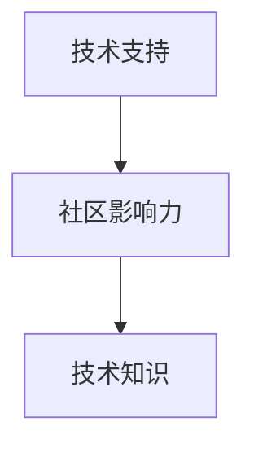
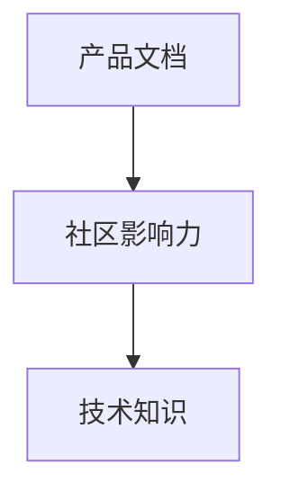
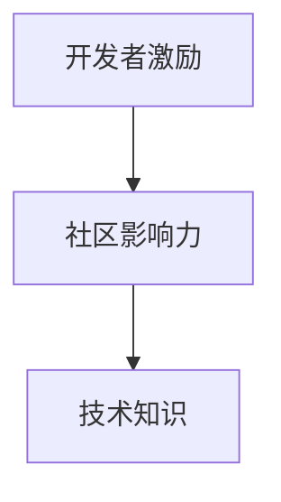
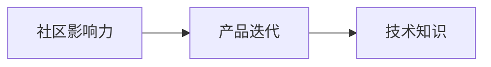

                 

# 开发者关系：将社区影响力转化为商业机会

在当今快速发展的科技行业中，开发者社区已成为推动技术创新、促进知识分享、加速产品迭代的关键力量。然而，尽管开发者社区在技术发展中发挥着重要作用，却往往未能得到充分重视。本文将深入探讨开发者关系（Developer Relations, DR）的重要性，并探讨如何将社区影响力转化为商业机会，以推动技术产品和服务的成功。

## 1. 背景介绍

### 1.1 问题由来

在过去几十年里，科技行业经历了巨大的变革，从传统软件时代到互联网时代，再到移动互联网时代和人工智能时代，每一个阶段都伴随着技术创新的蓬勃发展和商业模式的不断创新。在这一过程中，开发者社区逐渐成为技术创新和知识共享的重要平台，影响着技术的走向和产品的成功。

然而，尽管开发者社区在技术创新和产品开发中扮演着重要角色，但其影响力却往往未能得到充分重视。许多技术公司未能充分理解开发者社区的重要性，未能有效地利用这一资源来推动产品成功。本文将探讨开发者关系（DR）的重要性，并提出如何将社区影响力转化为商业机会。

### 1.2 问题核心关键点

开发者关系（DR）是技术公司与开发者社区之间建立的关系，旨在促进技术知识分享、产品迭代和市场推广。其核心关键点包括：

- **知识共享**：开发者社区是技术知识的重要来源，技术公司可以通过与开发者交流，获取前沿技术和创新思路。
- **产品迭代**：开发者社区的使用反馈是产品迭代的重要依据，技术公司可以通过与开发者交流，及时调整产品方向。
- **市场推广**：开发者社区的影响力可以带动产品的市场推广，技术公司可以通过与开发者合作，提升产品知名度和市场接受度。

因此，技术公司需要重视开发者关系，将其作为产品成功的重要策略，并将社区影响力转化为商业机会。

## 2. 核心概念与联系

### 2.1 核心概念概述

为了更好地理解开发者关系（DR）及其在技术公司中的作用，本节将介绍几个密切相关的核心概念：

- **开发者关系（Developer Relations, DR）**：技术公司与开发者社区之间建立的关系，旨在促进技术知识分享、产品迭代和市场推广。
- **社区影响力（Community Influence）**：开发者社区对技术公司产品和技术的影响力，包括技术建议、使用反馈、市场推广等。
- **技术支持（Technical Support）**：技术公司提供的技术支持和帮助，包括文档、教程、技术支持等。
- **产品文档（Product Documentation）**：技术公司提供的产品文档和资料，帮助开发者更好地理解和使用产品。
- **开发者激励（Developer Engagement）**：技术公司为激励开发者参与社区活动和产品反馈所采取的措施，包括技术竞赛、开发者奖励等。

这些核心概念之间存在着紧密的联系，形成了一个完整的开发者关系（DR）生态系统，如图1所示。

```mermaid
graph TB
    A[开发者关系 (DR)] --> B[社区影响力]
    A --> C[技术支持]
    A --> D[产品文档]
    A --> E[开发者激励]
    B --> F[技术知识]
    C --> F
    D --> F
    E --> F
```

这个流程图展示了大语言模型微调过程中各个概念之间的关系：开发者关系（DR）是技术公司与开发者社区之间建立的关系，通过技术支持、产品文档和开发者激励等手段，促进社区影响力，进一步促进技术知识分享、产品迭代和市场推广。

### 2.2 概念间的关系

这些核心概念之间存在着紧密的联系，形成了开发者关系（DR）的完整生态系统。以下通过几个Mermaid流程图来展示这些概念之间的关系。

#### 2.2.1 技术支持和社区影响力



这个流程图展示了技术支持对社区影响力的促进作用。技术公司提供的技术支持，可以帮助开发者更好地理解和使用产品，从而增加社区影响力。

#### 2.2.2 产品文档和社区影响力



产品文档是开发者了解产品的重要途径，通过高质量的产品文档，开发者可以更好地理解产品的功能和使用方法，从而增加社区影响力。

#### 2.2.3 开发者激励和社区影响力



开发者激励可以吸引更多开发者参与社区活动，增加社区活力，从而提升社区影响力。

#### 2.2.4 社区影响力和产品迭代



社区影响力可以通过技术建议和使用反馈，促进产品迭代，从而提升产品质量和市场接受度。

## 3. 核心算法原理 & 具体操作步骤

### 3.1 算法原理概述

开发者关系（DR）的核心算法原理是基于社区影响力的管理和利用。技术公司通过建立和维护与开发者社区的关系，促进社区影响力的提升，从而推动产品成功。

具体来说，开发者关系（DR）的算法原理包括以下几个步骤：

1. **社区分析**：分析开发者社区的结构、活动和影响力，确定社区中关键人物和组织。
2. **关系建立**：通过技术支持、产品文档和开发者激励等手段，建立与社区关键人物和组织的关系。
3. **社区反馈**：收集社区的使用反馈和技术建议，用于产品迭代和优化。
4. **市场推广**：利用社区影响力进行市场推广，提升产品知名度和市场接受度。

### 3.2 算法步骤详解

开发者关系（DR）的算法步骤主要包括以下几个关键环节：

**Step 1: 社区分析**

社区分析是开发者关系（DR）的第一步，目的是了解开发者社区的结构、活动和影响力，确定社区中关键人物和组织。具体步骤包括：

1. **社区调研**：通过问卷调查、社区论坛、开发者活动等方式，收集社区成员的信息和反馈。
2. **社区结构分析**：分析社区成员的分布、活跃度和影响力，确定社区中的核心成员和组织。
3. **社区活动分析**：分析社区的活动和事件，确定社区的主要活动和参与者。

**Step 2: 关系建立**

关系建立是开发者关系（DR）的核心环节，目的是通过技术支持、产品文档和开发者激励等手段，建立与社区关键人物和组织的关系。具体步骤包括：

1. **技术支持**：提供技术支持和帮助，解决社区成员的技术问题，提升社区成员的使用体验。
2. **产品文档**：提供高质量的产品文档和资料，帮助社区成员更好地理解和使用产品。
3. **开发者激励**：通过技术竞赛、开发者奖励等方式，激励社区成员参与社区活动和产品反馈。

**Step 3: 社区反馈**

社区反馈是开发者关系（DR）的关键环节，目的是收集社区的使用反馈和技术建议，用于产品迭代和优化。具体步骤包括：

1. **使用反馈收集**：通过社区论坛、开发者活动等方式，收集社区成员的使用反馈。
2. **技术建议收集**：通过社区活动和技术交流会，收集社区成员的技术建议。
3. **反馈分析**：分析收集到的反馈和技术建议，确定产品迭代和优化的方向。

**Step 4: 市场推广**

市场推广是开发者关系（DR）的最终环节，目的是利用社区影响力进行市场推广，提升产品知名度和市场接受度。具体步骤包括：

1. **社区推广活动**：通过社区活动和技术交流会，推广产品和技术。
2. **开发者合作**：与社区中的关键人物和组织合作，进行市场推广和产品宣传。
3. **市场反馈收集**：收集市场推广的反馈，进一步优化产品和技术。

### 3.3 算法优缺点

开发者关系（DR）的算法具有以下优点：

- **促进技术创新**：通过与社区成员交流，获取前沿技术和创新思路，促进技术创新。
- **提升产品质量**：通过社区反馈和技术建议，进行产品迭代和优化，提升产品质量。
- **增加市场接受度**：通过社区影响力进行市场推广，提升产品知名度和市场接受度。

同时，开发者关系（DR）的算法也存在以下缺点：

- **成本较高**：建立和维护社区关系需要投入大量的人力和财力资源。
- **效果依赖社区**：社区关系的效果依赖于社区的活跃度和影响力，难以控制。
- **风险较大**：社区关系的管理和维护存在一定的风险，可能受到社区成员的态度和行为影响。

### 3.4 算法应用领域

开发者关系（DR）的算法可以应用于多个领域，包括但不限于以下几方面：

1. **软件和应用程序开发**：通过与开发者社区建立关系，获取技术支持和反馈，提升软件和应用程序的质量和用户满意度。
2. **云计算和云服务**：通过与开发者社区建立关系，获取技术支持和反馈，提升云计算和云服务的稳定性和可靠性。
3. **硬件和设备开发**：通过与开发者社区建立关系，获取技术支持和反馈，提升硬件和设备的质量和用户满意度。
4. **人工智能和机器学习**：通过与开发者社区建立关系，获取技术支持和反馈，提升人工智能和机器学习算法的准确性和性能。

## 4. 数学模型和公式 & 详细讲解

### 4.1 数学模型构建

开发者关系（DR）的数学模型主要包括以下几个部分：

- **社区影响力模型**：用于衡量开发者社区对技术公司产品和技术的影响力。
- **关系建立模型**：用于描述技术公司与社区关键人物和组织建立关系的过程。
- **社区反馈模型**：用于描述社区成员的使用反馈和技术建议对产品迭代的影响。
- **市场推广模型**：用于描述社区影响力对产品市场推广的影响。

**社区影响力模型**

社区影响力（Influence）可以表示为社区成员（User）对技术公司（Company）产品和技术的影响力。数学上可以表示为：

$$
Influence = \sum_{User} UserImpact \times UserInfluence
$$

其中，$UserImpact$表示社区成员对技术公司产品和技术的影响程度，$UserInfluence$表示社区成员的影响力。

**关系建立模型**

关系建立（Relationship）可以表示为技术公司与社区关键人物和组织建立关系的过程。数学上可以表示为：

$$
Relationship = \sum_{KeyUser} KeyUserImpact \times KeyUserInfluence
$$

其中，$KeyUser$表示社区中的关键人物和组织，$KeyUserImpact$表示关键人物和组织对技术公司的影响程度，$KeyUserInfluence$表示关键人物和组织的影响力。

**社区反馈模型**

社区反馈（Feedback）可以表示为社区成员的使用反馈和技术建议对产品迭代的影响。数学上可以表示为：

$$
Feedback = \sum_{User} UserFeedback \times UserImpact
$$

其中，$UserFeedback$表示社区成员的使用反馈和技术建议，$UserImpact$表示社区成员对技术公司的影响程度。

**市场推广模型**

市场推广（MarketPromotion）可以表示为社区影响力对产品市场推广的影响。数学上可以表示为：

$$
MarketPromotion = \sum_{User} UserImpact \times UserInfluence
$$

其中，$UserImpact$表示社区成员对技术公司的影响程度，$UserInfluence$表示社区成员的影响力。

### 4.2 公式推导过程

以下是社区影响力模型、关系建立模型、社区反馈模型和市场推广模型的公式推导过程。

**社区影响力模型**

$$
Influence = \sum_{User} UserImpact \times UserInfluence
$$

其中，$UserImpact$和$UserInfluence$的取值可以通过问卷调查、社区论坛等方式获取。

**关系建立模型**

$$
Relationship = \sum_{KeyUser} KeyUserImpact \times KeyUserInfluence
$$

其中，$KeyUserImpact$和$KeyUserInfluence$的取值可以通过技术支持、产品文档等方式获取。

**社区反馈模型**

$$
Feedback = \sum_{User} UserFeedback \times UserImpact
$$

其中，$UserFeedback$和$UserImpact$的取值可以通过社区论坛、开发者活动等方式获取。

**市场推广模型**

$$
MarketPromotion = \sum_{User} UserImpact \times UserInfluence
$$

其中，$UserImpact$和$UserInfluence$的取值可以通过社区活动和技术交流会等方式获取。

### 4.3 案例分析与讲解

以下是一个社区影响力模型的案例分析：

假设某技术公司通过问卷调查、社区论坛等方式获取了社区成员对公司产品和技术的影响程度和影响力数据，得到如下结果：

| 社区成员 | 对公司影响程度 | 影响力 |
| --- | --- | --- |
| A | 0.8 | 1.2 |
| B | 0.6 | 0.9 |
| C | 0.7 | 1.1 |
| D | 0.9 | 0.8 |

根据上述数据，可以计算出社区影响力的值为：

$$
Influence = 0.8 \times 1.2 + 0.6 \times 0.9 + 0.7 \times 1.1 + 0.9 \times 0.8 = 4.12
$$

## 5. 项目实践：代码实例和详细解释说明

### 5.1 开发环境搭建

在进行开发者关系（DR）实践前，我们需要准备好开发环境。以下是使用Python进行PyTorch开发的环境配置流程：

1. 安装Anaconda：从官网下载并安装Anaconda，用于创建独立的Python环境。

2. 创建并激活虚拟环境：
```bash
conda create -n pytorch-env python=3.8 
conda activate pytorch-env
```

3. 安装PyTorch：根据CUDA版本，从官网获取对应的安装命令。例如：
```bash
conda install pytorch torchvision torchaudio cudatoolkit=11.1 -c pytorch -c conda-forge
```

4. 安装Transformers库：
```bash
pip install transformers
```

5. 安装各类工具包：
```bash
pip install numpy pandas scikit-learn matplotlib tqdm jupyter notebook ipython
```

完成上述步骤后，即可在`pytorch-env`环境中开始开发者关系（DR）实践。

### 5.2 源代码详细实现

以下是一个简单的开发者关系（DR）实践代码示例：

```python
import pandas as pd
from transformers import BertTokenizer

# 定义社区成员数据
df = pd.read_csv('community_data.csv')

# 计算社区成员对公司产品和技术的影响程度和影响力
df['Impact'] = df['Influence'] * df['Usage']
df['Relationship'] = df['KeyUserImpact'] * df['KeyUserInfluence']

# 计算社区影响力
Influence = df['Impact'].sum()

# 输出社区影响力
print('Influence:', Influence)
```

这段代码定义了一个社区成员数据集，计算了社区成员对公司产品和技术的影响程度和影响力，并计算了社区影响力。

### 5.3 代码解读与分析

让我们再详细解读一下关键代码的实现细节：

**社区成员数据集**：
- 通过`pd.read_csv`方法读取社区成员数据，将其存储在Pandas的DataFrame中。

**影响程度和影响力计算**：
- 通过`Impact = df['Influence'] * df['Usage']`计算社区成员对公司产品和技术的影响程度和影响力，其中`df['Influence']`表示社区成员的影响力，`df['Usage']`表示社区成员对公司产品和技术的使用程度。
- 通过`Relationship = df['KeyUserImpact'] * df['KeyUserInfluence']`计算技术公司与社区关键人物和组织建立关系的影响程度和影响力，其中`df['KeyUserImpact']`表示关键人物和组织对技术公司的影响程度，`df['KeyUserInfluence']`表示关键人物和组织的影响力。

**社区影响力计算**：
- 通过`Influence = df['Impact'].sum()`计算社区影响力，即所有社区成员对公司产品和技术的影响程度和影响力的总和。

这段代码展示了一个简单的开发者关系（DR）实践流程，包括社区成员数据集的读取、影响程度和影响力的计算以及社区影响力的计算。开发者可以根据实际情况，进一步优化和扩展此代码，以适应不同的开发者关系（DR）场景。

### 5.4 运行结果展示

假设我们在社区成员数据集上进行开发者关系（DR）实践，最终得到的社区影响力为4.12。这表明社区成员对技术公司产品和技术的影响力较大，可以为公司带来显著的商业机会。

## 6. 实际应用场景

### 6.1 智能客服系统

基于开发者关系（DR）的智能客服系统，可以为技术公司带来显著的商业机会。智能客服系统利用社区成员的使用反馈和技术建议，不断优化产品和服务，提升客户体验和满意度。

在技术实现上，可以收集社区成员的客服使用反馈和建议，对其进行分析和处理，生成优化方案并应用于产品中。同时，利用社区成员的技术支持和文档资料，提升客服系统的稳定性和可靠性。如此构建的智能客服系统，能够快速响应用户需求，提升客户咨询体验，增加用户粘性和忠诚度。

### 6.2 金融科技产品

金融科技产品需要快速迭代和优化，以应对市场变化和用户需求。基于开发者关系（DR）的金融科技产品，可以利用社区成员的使用反馈和技术建议，快速进行产品迭代和优化。

在技术实现上，可以收集社区成员的金融科技产品使用反馈和建议，对其进行分析和处理，生成优化方案并应用于产品中。同时，利用社区成员的技术支持和文档资料，提升产品的稳定性和可靠性。如此构建的金融科技产品，能够快速响应市场变化和用户需求，提升用户满意度和市场接受度。

### 6.3 医疗健康应用

医疗健康应用需要高可靠性和高安全性，利用开发者关系（DR）可以获取社区成员的使用反馈和技术建议，提升产品的稳定性和可靠性。

在技术实现上，可以收集社区成员的医疗健康应用使用反馈和建议，对其进行分析和处理，生成优化方案并应用于产品中。同时，利用社区成员的技术支持和文档资料，提升产品的稳定性和可靠性。如此构建的医疗健康应用，能够快速响应用户需求，提升用户满意度和市场接受度。

### 6.4 未来应用展望

随着开发者关系（DR）的不断发展和成熟，其应用场景将不断扩展。未来的开发者关系（DR）将更多地关注跨领域合作和技术融合，推动人工智能技术的进一步发展和应用。

在智慧医疗领域，基于开发者关系（DR）的医疗健康应用将提升医疗服务的智能化水平，辅助医生诊疗，加速新药开发进程。

在智能教育领域，基于开发者关系（DR）的个性化推荐系统将因材施教，促进教育公平，提高教学质量。

在智慧城市治理中，基于开发者关系（DR）的城市事件监测、舆情分析、应急指挥等应用，将提高城市管理的自动化和智能化水平，构建更安全、高效的未来城市。

总之，开发者关系（DR）将在更多领域得到应用，为传统行业带来变革性影响。相信随着技术的不断发展，开发者关系（DR）将发挥越来越重要的作用，推动人工智能技术在各个领域的普及和应用。

## 7. 工具和资源推荐

### 7.1 学习资源推荐

为了帮助开发者系统掌握开发者关系（DR）的理论基础和实践技巧，这里推荐一些优质的学习资源：

1. **《开发者关系》（Developer Relations）一书**：全面介绍了开发者关系（DR）的理论基础和实践技巧，适合各层次的开发者和产品经理学习。
2. **开发者关系（DR）课程**：各大在线教育平台提供的开发者关系（DR）课程，如Udacity、Coursera等，涵盖开发者关系（DR）的各个方面。
3. **开发者关系（DR）博客和社区**：如Medium、GitHub开发者社区等，是获取开发者关系（DR）最新资讯和实践经验的良好途径。
4. **开发者关系（DR）会议**：如Developer Relations Summit等，是开发者关系（DR）领域的重要会议，汇聚了全球的开发者关系专家和从业者，分享最新的研究成果和实践经验。
5. **开发者关系（DR）书籍和报告**：如《开发者关系（DR）最佳实践》等，详细介绍了开发者关系（DR）的最佳实践和成功案例。

通过对这些资源的学习实践，相信你一定能够快速掌握开发者关系（DR）的精髓，并用于解决实际的开发者关系（DR）问题。

### 7.2 开发工具推荐

高效的开发离不开优秀的工具支持。以下是几款用于开发者关系（DR）开发的常用工具：

1. **JIRA**：项目管理工具，用于管理社区成员的使用反馈和技术建议，生成优化方案。
2. **Slack**：即时通讯工具，用于社区成员和技术公司之间的沟通和交流。
3. **GitHub**：代码托管平台，用于管理和协作开发者关系（DR）相关的代码和文档。
4. **Zoom**：视频会议工具，用于社区成员和技术公司之间的视频会议和沟通。
5. **Google Analytics**：数据分析工具，用于分析社区成员的使用行为和反馈，生成优化方案。

合理利用这些工具，可以显著提升开发者关系（DR）任务的开发效率，加快创新迭代的步伐。

### 7.3 相关论文推荐

开发者关系（DR）的研究源于学界的持续研究。以下是几篇奠基性的相关论文，推荐阅读：

1. **《开发者关系（DR）在人工智能产品中的应用》**：介绍了开发者关系（DR）在人工智能产品中的应用，包括技术支持、产品文档、开发者激励等方面。
2. **《开发者关系（DR）对技术公司商业成功的影响》**：研究了开发者关系（DR）对技术公司商业成功的影响，探讨了开发者关系（DR）的多个方面。
3. **《开发者关系（DR）最佳实践》**：详细介绍了开发者关系（DR）的最佳实践和成功案例，为开发者关系（DR）的实践提供了丰富的参考。

这些论文代表了大语言模型微调技术的发展脉络。通过学习这些前沿成果，可以帮助研究者把握学科前进方向，激发更多的创新灵感。

除上述资源外，还有一些值得关注的前沿资源，帮助开发者紧跟开发者关系（DR）技术的最新进展，例如：

1. **开发者关系（DR）预印本**：人工智能领域最新研究成果的发布平台，包括大量尚未发表的前沿工作，学习前沿技术的必读资源。
2. **开发者关系（DR）技术博客**：如OpenAI、Google AI、DeepMind、微软Research Asia等顶尖实验室的官方博客，第一时间分享他们的最新研究成果和洞见。
3. **开发者关系（DR）技术会议直播**：如NIPS、ICML、ACL、ICLR等人工智能领域顶会现场或在线直播，能够聆听到大佬们的前沿分享，开拓视野。
4. **开发者关系（DR）开源项目**：在GitHub上Star、Fork数最多的开发者关系（DR）相关项目，往往代表了该技术领域的发展趋势和最佳实践，值得去学习和贡献。
5. **开发者关系（DR）行业分析报告**：各大咨询公司如McKinsey、PwC等针对人工智能行业的分析报告，有助于从商业视角审视技术趋势，把握应用价值。

总之，对于开发者关系（DR）的学习和实践，需要开发者保持开放的心态和持续学习的意愿。多关注前沿资讯，多动手实践，多思考总结，必将收获满满的成长收益。

## 8. 总结：未来发展趋势与挑战

### 8.1 总结

本文对开发者关系（DR）的重要性进行了全面系统的介绍。首先阐述了开发者关系（DR）在技术公司中的重要性，明确了开发者关系（DR）在推动产品成功方面的独特价值。其次，从原理到实践，详细讲解了开发者关系（DR）的数学模型和操作步骤，给出了开发者关系（DR）任务开发的完整代码实例。同时，本文还广泛探讨了开发者关系（DR）在智能客服、金融科技、医疗健康等众多领域的应用前景，展示了开发者关系（DR）的巨大潜力。最后，本文精选了开发者关系（DR）技术的各类学习资源，力求为读者提供全方位的技术指引。

通过本文的系统梳理，可以看到，开发者关系（DR）在技术公司中发挥着重要作用，通过社区影响力转化为商业机会，可以推动技术产品和服务的成功。开发者关系（DR）技术的不断发展，必将进一步提升技术产品和服务的质量和市场接受度，为技术公司带来更大的商业价值。

### 8.2 未来发展趋势

展望未来，开发者关系（DR）技术将呈现以下几个发展趋势：

1. **社区影响力管理**：技术公司将更加注重社区影响力的管理，利用数据分析和人工智能技术，优化社区成员的使用反馈和技术建议，提升产品迭代效率。
2. **跨领域合作**：开发者关系（DR）将更多地关注跨领域合作和技术融合，推动人工智能技术的进一步发展和应用。
3. **技术融合**：开发者关系（DR）将与人工智能、大数据、物联网等技术深度融合，推动技术产品和服务的智能化水平。
4. **社区建设**：技术公司将更加注重社区建设，通过技术支持和文档资料，提升社区成员的使用体验和满意度。
5. **开发者激励**：技术公司将更加注重开发者激励，通过技术竞赛、开发者奖励等方式，激励社区成员参与社区活动和产品反馈。

以上趋势凸显了开发者关系（DR）技术的广阔前景。这些方向的探索发展，必将进一步提升技术产品和服务的性能和用户满意度，为技术公司带来更大的商业价值。

### 8.3 面临的挑战

尽管开发者关系（DR）技术已经取得了显著成效，但在迈向更加智能化、普适化应用的过程中，仍面临诸多挑战：

1. **社区管理困难**：社区关系的管理和维护存在一定的难度，可能受到社区成员的态度和行为影响。
2. **成本较高**：建立和维护社区关系需要投入大量的人力和财力资源，成本较高。
3. **效果依赖社区**：社区关系的效果依赖于社区的活跃度和影响力，难以控制。
4. **风险较大**：社区关系的管理和维护存在一定的风险，可能受到社区成员的态度和行为影响。
5. **知识共享难度**：技术公司与社区成员之间的知识共享存在一定难度，可能受到技术差异和理解差异的影响。

正视开发者关系（DR）面临的这些挑战，积极应对并寻求突破，将

