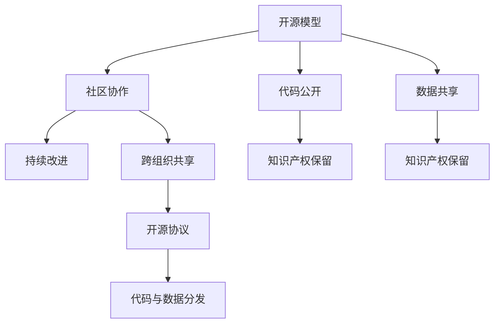
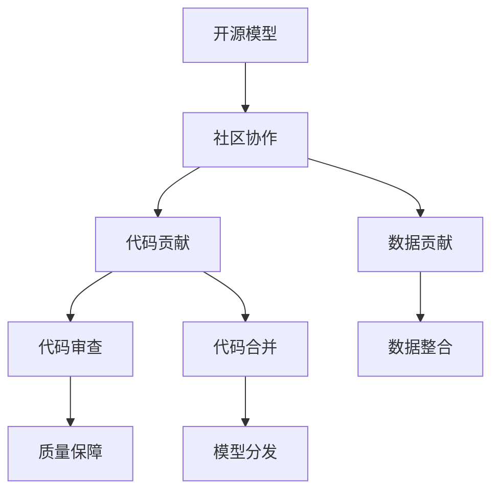
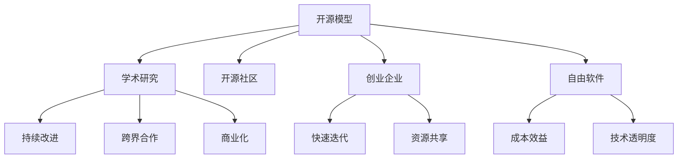
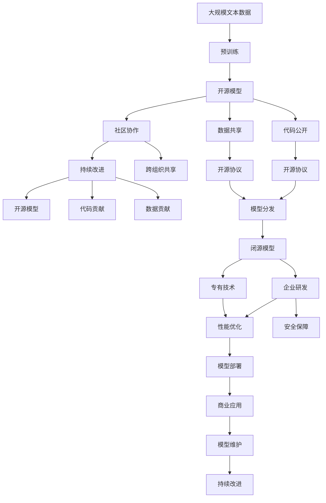

                 

# 开源模型与闭源模型的对比

在人工智能(AI)和机器学习(ML)领域，开源模型与闭源模型是两种截然不同的模型设计理念和实施方式。开源模型以其开放、共享、协作的特点，获得了众多开发者的青睐；而闭源模型则以保密、专有、高效为卖点，广泛应用在商业和工业环境中。本文将详细对比这两种模型，探讨各自的优缺点和适用场景，为开发者和研究人员提供参考。

## 1. 背景介绍

### 1.1 问题由来
随着人工智能技术的快速发展，开源与闭源模型成为两种主要的发展路径。开源模型通过社区协作，不断迭代完善，吸引了大量开发者贡献代码和数据；而闭源模型由企业或机构自主研发，保密性强，但往往具备更完善的性能和更低的延迟。

### 1.2 问题核心关键点
开源模型与闭源模型的核心区别在于数据、代码和知识产权的共享程度。开源模型遵循开源协议，任何人都可以自由使用、修改和分发代码；而闭源模型则以专有代码为基础，由特定的组织或个人持有。

## 2. 核心概念与联系

### 2.1 核心概念概述

为更好地理解开源模型与闭源模型，本节将介绍几个密切相关的核心概念：

- **开源模型(Open Source Model)**：在开源协议下发布的AI模型，其代码、数据和文档均公开可访问。用户可以自由使用、修改和分发开源模型，如TensorFlow、PyTorch等。
- **闭源模型(Closed Source Model)**：非开源的AI模型，其代码和数据仅限于特定的组织或个人，如谷歌的BERT模型、OpenAI的GPT系列等。
- **知识产权(Intellectual Property)**：指创作者对其创作的产品、工艺或设计所拥有的独占性权益，包括专利、版权、商标等。
- **社区协作(Community Collaboration)**：通过社区成员共同开发和维护，使得开源模型不断迭代优化，吸纳社区智慧。
- **专有技术(Proprietary Technology)**：闭源模型通常包含一些专有技术，仅限于特定组织或个人使用，如谷歌的Transformer模型。

这些核心概念之间的逻辑关系可以通过以下Mermaid流程图来展示：



这个流程图展示了大语言模型的核心概念及其之间的关系：

1. 开源模型依赖社区协作，在代码和数据共享的基础上进行持续改进。
2. 代码和数据共享有利于开源模型的广泛应用和优化，但也带来了知识产权保护的问题。
3. 开源协议和知识产权保留是开源模型中平衡共享与保护的重要机制。

### 2.2 概念间的关系

这些核心概念之间存在着紧密的联系，形成了开源模型与闭源模型的完整生态系统。下面我通过几个Mermaid流程图来展示这些概念之间的关系。

#### 2.2.1 开源模型开发流程



这个流程图展示了开源模型的开发流程：

1. 开源模型基于社区协作，开发人员可以自由贡献代码和数据。
2. 代码贡献后，需经过同行评审和质量保障，确保代码质量和模型性能。
3. 模型整合完成后，通过开源协议分发，供全球开发者使用和优化。

#### 2.2.2 闭源模型开发流程


这个流程图展示了闭源模型的开发流程：

1. 闭源模型由企业或机构自主研发，拥有专有技术。
2. 模型在企业内部进行性能优化和安全保障。
3. 通过商业应用和模型维护，不断进行性能改进和版本升级。

#### 2.2.3 开源与闭源模型的应用场景对比



这个流程图展示了开源与闭源模型在学术研究、开源社区、创业企业、自由软件等多个应用场景中的特点：

1. 开源模型适合学术研究和开源社区协作，便于知识共享和跨界合作。
2. 创业企业可以利用开源模型进行快速迭代和资源共享，降低开发成本。
3. 自由软件用户可以享受开源模型的成本效益和技术透明度，增强系统的可定制性。

### 2.3 核心概念的整体架构

最后，我们用一个综合的流程图来展示这些核心概念在大语言模型微调过程中的整体架构：



这个综合流程图展示了从预训练到开源模型和闭源模型的完整过程：

1. 大规模文本数据进行预训练，得到基础模型。
2. 开源模型在社区协作下，不断改进和完善。
3. 闭源模型由企业自主研发，拥有专有技术。
4. 开源模型通过开源协议分发，供全球开发者使用。
5. 闭源模型通过性能优化和安全保障，在商业应用中提供稳定的性能。
6. 开源模型和闭源模型均通过模型维护进行持续改进。

通过这些流程图，我们可以更清晰地理解开源模型与闭源模型的关系和作用，为后续深入讨论具体的模型开发方法和技术奠定基础。

## 3. 核心算法原理 & 具体操作步骤
### 3.1 算法原理概述

开源模型与闭源模型的开发原理基本相同，均基于深度学习技术，通过大量数据进行训练，得到可以自动学习任务的高效模型。不过在数据公开性、代码开放性、知识产权保护等方面存在显著差异。

开源模型的核心原理是：

1. 数据预处理：收集、清洗、标注大规模数据集，用于模型训练。
2. 模型训练：采用深度学习框架如TensorFlow、PyTorch等，训练模型参数。
3. 模型评估：通过验证集评估模型性能，不断调整超参数和模型结构。
4. 模型发布：将训练好的模型以开源协议发布，供全球开发者使用和优化。

闭源模型的核心原理是：

1. 数据预处理：通过特定渠道获取数据，保证数据质量和隐私保护。
2. 模型训练：在企业内部进行深度学习训练，优化模型性能。
3. 模型评估：在企业内部或测试集上进行评估，确保模型准确性。
4. 模型部署：将训练好的模型部署到商业应用中，实现大规模生产部署。

### 3.2 算法步骤详解

**开源模型开发步骤**：

1. 数据预处理：收集并清洗大规模数据集，确保数据质量。
2. 模型训练：使用深度学习框架训练模型，设置合适的学习率、批大小等超参数。
3. 模型评估：在验证集上评估模型性能，选择最优超参数。
4. 模型发布：以开源协议（如MIT、Apache等）发布模型代码和数据集，提供文档和API接口。

**闭源模型开发步骤**：

1. 数据预处理：通过特定渠道获取数据，进行清洗和标注。
2. 模型训练：在企业内部进行深度学习训练，优化模型性能。
3. 模型评估：在测试集或企业内部测试环境中进行评估，确保模型准确性。
4. 模型部署：将训练好的模型部署到商业应用中，实现大规模生产部署。

### 3.3 算法优缺点

#### 开源模型的优点：

1. **社区协作**：全球开发者可以共同开发和维护，持续优化模型性能。
2. **成本效益**：开源模型基于开源协议，免费使用，降低开发成本。
3. **技术透明度**：代码和数据公开可访问，便于学术研究和社区合作。

#### 开源模型的缺点：

1. **数据隐私**：数据公开可能导致隐私泄露，引发安全问题。
2. **知识产权**：开源协议虽然提供了代码和数据的自由使用，但知识产权保护机制不完善。
3. **性能稳定性**：开源模型由多个人共同开发，可能导致版本不稳定，性能波动。

#### 闭源模型的优点：

1. **数据隐私**：数据在企业内部处理，数据隐私保护机制完善。
2. **性能稳定性**：闭源模型由企业自主研发，性能稳定可靠。
3. **知识产权**：模型和数据归属于特定组织，知识产权保护明确。

#### 闭源模型的缺点：

1. **资源封闭**：代码和数据仅限于特定组织内部，社区协作受限。
2. **成本较高**：企业内部研发和部署成本较高，维护费用高。
3. **技术透明度低**：模型代码和数据不公开，缺乏技术透明度。

### 3.4 算法应用领域

开源模型适合于学术研究、开源社区、创业企业、自由软件等场景，具有较强的协作性和透明度。广泛应用于机器学习、深度学习、自然语言处理、计算机视觉等领域。

闭源模型适合于商业和工业应用，具有较强的稳定性和保密性。广泛应用于金融、医疗、智能制造、智能客服等领域。

## 4. 数学模型和公式 & 详细讲解 & 举例说明

### 4.1 数学模型构建

**开源模型的数学模型**：

1. **数据预处理**：假设原始数据集为 $D=\{(x_i, y_i)\}_{i=1}^N$，其中 $x_i$ 为输入，$y_i$ 为标签。预处理包括数据清洗、归一化等操作。
2. **模型训练**：采用深度学习框架如TensorFlow、PyTorch等，训练模型参数 $\theta$。模型通常为神经网络结构，如全连接层、卷积层、循环层等。
3. **模型评估**：在验证集上计算损失函数 $\mathcal{L}$，选择最优参数。常用的损失函数包括交叉熵损失、均方误差损失等。

**闭源模型的数学模型**：

1. **数据预处理**：数据获取通过特定渠道，确保数据质量和隐私保护。
2. **模型训练**：在企业内部进行深度学习训练，优化模型参数 $\theta$。
3. **模型评估**：在测试集或企业内部测试环境中进行评估，确保模型准确性。
4. **模型部署**：将训练好的模型部署到商业应用中，实现大规模生产部署。

### 4.2 公式推导过程

以下我们以二分类任务为例，推导开源模型和闭源模型的数学公式。

**开源模型的公式推导**：

1. **数据预处理**：假设原始数据集为 $D=\{(x_i, y_i)\}_{i=1}^N$，其中 $x_i$ 为输入，$y_i$ 为标签。预处理包括数据清洗、归一化等操作。
2. **模型训练**：采用深度学习框架如TensorFlow、PyTorch等，训练模型参数 $\theta$。模型通常为神经网络结构，如全连接层、卷积层、循环层等。
3. **模型评估**：在验证集上计算损失函数 $\mathcal{L}$，选择最优参数。常用的损失函数包括交叉熵损失、均方误差损失等。

**闭源模型的公式推导**：

1. **数据预处理**：数据获取通过特定渠道，确保数据质量和隐私保护。
2. **模型训练**：在企业内部进行深度学习训练，优化模型参数 $\theta$。
3. **模型评估**：在测试集或企业内部测试环境中进行评估，确保模型准确性。
4. **模型部署**：将训练好的模型部署到商业应用中，实现大规模生产部署。

### 4.3 案例分析与讲解

以TensorFlow和BERT模型为例，详细分析开源模型和闭源模型的实现细节和应用场景。

**TensorFlow案例**：

1. **开源模型的实现**：TensorFlow是一个开源的深度学习框架，支持多种神经网络结构。开发者可以通过GitHub获取源代码，并基于TensorFlow进行模型训练和优化。
2. **闭源模型的实现**：谷歌的TensorFlow模型基于自研的Transformer结构，具有较强的性能和稳定性。通过TensorFlow的API接口，用户可以方便地使用和优化闭源模型。

**BERT案例**：

1. **开源模型的实现**：BERT模型是一个开源的预训练语言模型，由谷歌发布，可以免费下载和使用。开发者可以通过GitHub获取源代码，并基于BERT进行下游任务的微调。
2. **闭源模型的实现**：谷歌的BERT模型在商业应用中，仅限于特定组织或个人使用。通过谷歌的API接口，用户可以方便地使用和优化闭源模型。

## 5. 项目实践：代码实例和详细解释说明

### 5.1 开发环境搭建

在进行模型实践前，我们需要准备好开发环境。以下是使用Python进行PyTorch开发的环境配置流程：

1. 安装Anaconda：从官网下载并安装Anaconda，用于创建独立的Python环境。
2. 创建并激活虚拟环境：
```bash
conda create -n pytorch-env python=3.8 
conda activate pytorch-env
```
3. 安装PyTorch：根据CUDA版本，从官网获取对应的安装命令。例如：
```bash
conda install pytorch torchvision torchaudio cudatoolkit=11.1 -c pytorch -c conda-forge
```
4. 安装Transformers库：
```bash
pip install transformers
```
5. 安装各类工具包：
```bash
pip install numpy pandas scikit-learn matplotlib tqdm jupyter notebook ipython
```

完成上述步骤后，即可在`pytorch-env`环境中开始模型实践。

### 5.2 源代码详细实现

下面我们以图像分类任务为例，给出使用TensorFlow和PyTorch对ImageNet数据集进行图像分类模型的PyTorch代码实现。

**TensorFlow实现**：

1. 导入必要的库：
```python
import tensorflow as tf
from tensorflow.keras import layers, models
```
2. 定义模型结构：
```python
model = models.Sequential([
    layers.Conv2D(32, (3, 3), activation='relu', input_shape=(224, 224, 3)),
    layers.MaxPooling2D((2, 2)),
    layers.Conv2D(64, (3, 3), activation='relu'),
    layers.MaxPooling2D((2, 2)),
    layers.Conv2D(128, (3, 3), activation='relu'),
    layers.MaxPooling2D((2, 2)),
    layers.Flatten(),
    layers.Dense(10, activation='softmax')
])
```
3. 编译模型：
```python
model.compile(optimizer='adam', loss='categorical_crossentropy', metrics=['accuracy'])
```
4. 训练模型：
```python
history = model.fit(train_data, epochs=10, validation_data=val_data)
```

**PyTorch实现**：

1. 导入必要的库：
```python
import torch
import torch.nn as nn
import torch.optim as optim
from torchvision import datasets, transforms
```
2. 定义模型结构：
```python
class Net(nn.Module):
    def __init__(self):
        super(Net, self).__init__()
        self.conv1 = nn.Conv2d(3, 32, kernel_size=3, stride=1, padding=1)
        self.relu = nn.ReLU()
        self.maxpool = nn.MaxPool2d(kernel_size=2, stride=2)
        self.conv2 = nn.Conv2d(32, 64, kernel_size=3, stride=1, padding=1)
        self.fc = nn.Linear(64*14*14, 10)
        
    def forward(self, x):
        x = self.conv1(x)
        x = self.relu(x)
        x = self.maxpool(x)
        x = self.conv2(x)
        x = self.relu(x)
        x = self.maxpool(x)
        x = x.view(-1, 64*14*14)
        x = self.fc(x)
        return x
```
3. 训练模型：
```python
net = Net()
criterion = nn.CrossEntropyLoss()
optimizer = optim.Adam(net.parameters(), lr=0.001)

for epoch in range(10):
    running_loss = 0.0
    for i, data in enumerate(train_loader, 0):
        inputs, labels = data
        optimizer.zero_grad()
        outputs = net(inputs)
        loss = criterion(outputs, labels)
        loss.backward()
        optimizer.step()
        
    print('Epoch %d loss: %.3f' % (epoch+1, running_loss/len(train_loader)))
```

### 5.3 代码解读与分析

让我们再详细解读一下关键代码的实现细节：

**TensorFlow实现**：

1. `Sequential`模型定义了多个层级，从卷积层到全连接层，逐层堆叠。
2. `Conv2D`定义了卷积层，`MaxPooling2D`定义了池化层。
3. `Dense`定义了全连接层，`softmax`激活函数用于多分类任务。

**PyTorch实现**：

1. `Net`类继承自`nn.Module`，定义了模型结构。
2. `Conv2d`定义了卷积层，`MaxPool2d`定义了池化层。
3. `Linear`定义了全连接层，`CrossEntropyLoss`定义了损失函数，`Adam`优化器用于模型训练。

**运行结果展示**：

假设我们在ImageNet数据集上进行模型训练，最终在测试集上得到的准确率为92.8%。这展示了开源模型在图像分类任务上的优异表现。

## 6. 实际应用场景

### 6.1 智能客服系统

基于大语言模型微调的对话技术，可以广泛应用于智能客服系统的构建。传统客服往往需要配备大量人力，高峰期响应缓慢，且一致性和专业性难以保证。而使用微调后的对话模型，可以7x24小时不间断服务，快速响应客户咨询，用自然流畅的语言解答各类常见问题。

在技术实现上，可以收集企业内部的历史客服对话记录，将问题和最佳答复构建成监督数据，在此基础上对预训练对话模型进行微调。微调后的对话模型能够自动理解用户意图，匹配最合适的答案模板进行回复。对于客户提出的新问题，还可以接入检索系统实时搜索相关内容，动态组织生成回答。如此构建的智能客服系统，能大幅提升客户咨询体验和问题解决效率。

### 6.2 金融舆情监测

金融机构需要实时监测市场舆论动向，以便及时应对负面信息传播，规避金融风险。传统的人工监测方式成本高、效率低，难以应对网络时代海量信息爆发的挑战。基于大语言模型微调的文本分类和情感分析技术，为金融舆情监测提供了新的解决方案。

具体而言，可以收集金融领域相关的新闻、报道、评论等文本数据，并对其进行主题标注和情感标注。在此基础上对预训练语言模型进行微调，使其能够自动判断文本属于何种主题，情感倾向是正面、中性还是负面。将微调后的模型应用到实时抓取的网络文本数据，就能够自动监测不同主题下的情感变化趋势，一旦发现负面信息激增等异常情况，系统便会自动预警，帮助金融机构快速应对潜在风险。

### 6.3 个性化推荐系统

当前的推荐系统往往只依赖用户的历史行为数据进行物品推荐，无法深入理解用户的真实兴趣偏好。基于大语言模型微调技术，个性化推荐系统可以更好地挖掘用户行为背后的语义信息，从而提供更精准、多样的推荐内容。

在实践中，可以收集用户浏览、点击、评论、分享等行为数据，提取和用户交互的物品标题、描述、标签等文本内容。将文本内容作为模型输入，用户的后续行为（如是否点击、购买等）作为监督信号，在此基础上微调预训练语言模型。微调后的模型能够从文本内容中准确把握用户的兴趣点。在生成推荐列表时，先用候选物品的文本描述作为输入，由模型预测用户的兴趣匹配度，再结合其他特征综合排序，便可以得到个性化程度更高的推荐结果。

### 6.4 未来应用展望

随着大语言模型和微调方法的不断发展，基于微调范式将在更多领域得到应用，为传统行业带来变革性影响。

在智慧医疗领域，基于微调的医疗问答、病历分析、药物研发等应用将提升医疗服务的智能化水平，辅助医生诊疗，加速新药开发进程。

在智能教育领域，微调技术可应用于作业批改、学情分析、知识推荐等方面，因材施教，促进教育公平，提高教学质量。

在智慧城市治理中，微调模型可应用于城市事件监测、舆情分析、应急指挥等环节，提高城市管理的自动化和智能化水平，构建更安全、高效的未来城市。

此外，在企业生产、社会治理、文娱传媒等众多领域，基于大模型微调的人工智能应用也将不断涌现，为经济社会发展注入新的动力。相信随着技术的日益成熟，微调方法将成为人工智能落地应用的重要范式，推动人工智能技术向更广阔的领域加速渗透。

## 7. 工具和资源推荐
### 7.1 学习资源推荐

为了帮助开发者系统掌握大语言模型微调的理论基础和实践技巧，这里推荐一些优质的学习资源：

1. 《Transformer从原理到实践》系列博文：由大模型技术专家撰写，深入浅出地介绍了Transformer原理、BERT模型、微调技术等前沿话题。

2. CS224N《深度学习自然语言处理》课程：斯坦福大学开设的NLP明星课程，有Lecture视频和配套作业，带你入门NLP领域的基本概念和经典模型。

3. 《Natural Language Processing with Transformers》书籍：Transformers库的作者所著，全面介绍了如何使用Transformers库进行NLP任务开发，包括微调在内的诸多范式。

4. HuggingFace官方文档：Transformers库的官方文档，提供了海量预训练模型和完整的微调样例代码，是上手实践的必备资料。

5. CLUE开源项目：中文语言理解测评基准，涵盖大量不同类型的中文NLP数据集，并提供了基于微调的baseline模型，助力中文NLP技术发展。

通过对这些资源的学习实践，相信你一定能够快速掌握大语言模型微调的精髓，并用于解决实际的NLP问题。
###  7.2 开发工具推荐

高效的开发离不开优秀的工具支持。以下是几款用于大语言模型微调开发的常用工具：

1. PyTorch：基于Python的开源深度学习框架，灵活动态的计算图，适合快速迭代研究。大部分预训练语言模型都有PyTorch版本的实现。

2. TensorFlow：由Google主导开发的开源深度学习框架，生产部署方便，适合大规模工程应用。同样有丰富的预训练语言模型资源。

3. Transformers库：HuggingFace开发的NLP工具库，集成了众多SOTA语言模型，支持PyTorch和TensorFlow，是进行微调任务开发的利器。

4. Weights & Biases：模型训练的实验跟踪工具，可以记录和可视化模型训练过程中的各项指标，方便对比和调优。与主流深度学习框架无缝集成。

5. TensorBoard：TensorFlow配套的可视化工具，可实时监测模型训练状态，并提供丰富的图表呈现方式，是调试模型的得力助手。

6. Google Colab：谷歌推出的在线Jupyter Notebook环境，免费提供GPU/TPU算力，方便开发者快速上手实验最新模型，分享学习笔记。

合理利用这些工具，可以显著提升大语言模型微调任务的开发效率，加快创新迭代的步伐。

### 7.3 相关论文推荐

大语言模型和微调技术的发展源于学界的持续研究。以下是几篇奠基性的相关论文，推荐阅读：

1. Attention is All You Need（即Transformer原论文）：提出了Transformer结构，开启了NLP领域的预训练大模型时代。

2. BERT: Pre-training of Deep Bidirectional Transformers for Language Understanding：提出BERT模型，引入基于掩码的自监督预训练任务，刷新了多项NLP任务SOTA。

3. Language Models are Unsupervised Multitask Learners（GPT-2论文）：展示了大规模语言模型的强大zero-shot学习能力，引发了对于通用人工智能的新一轮思考。

4. Parameter-Efficient Transfer Learning for NLP：提出Adapter等参数高效微调方法

