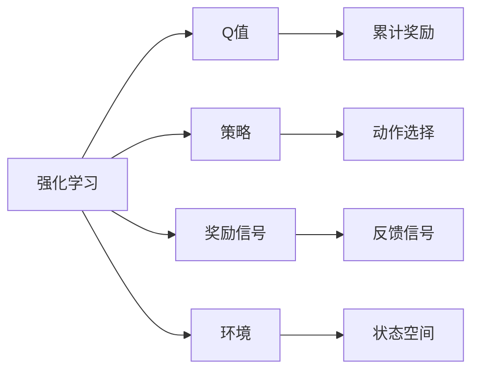
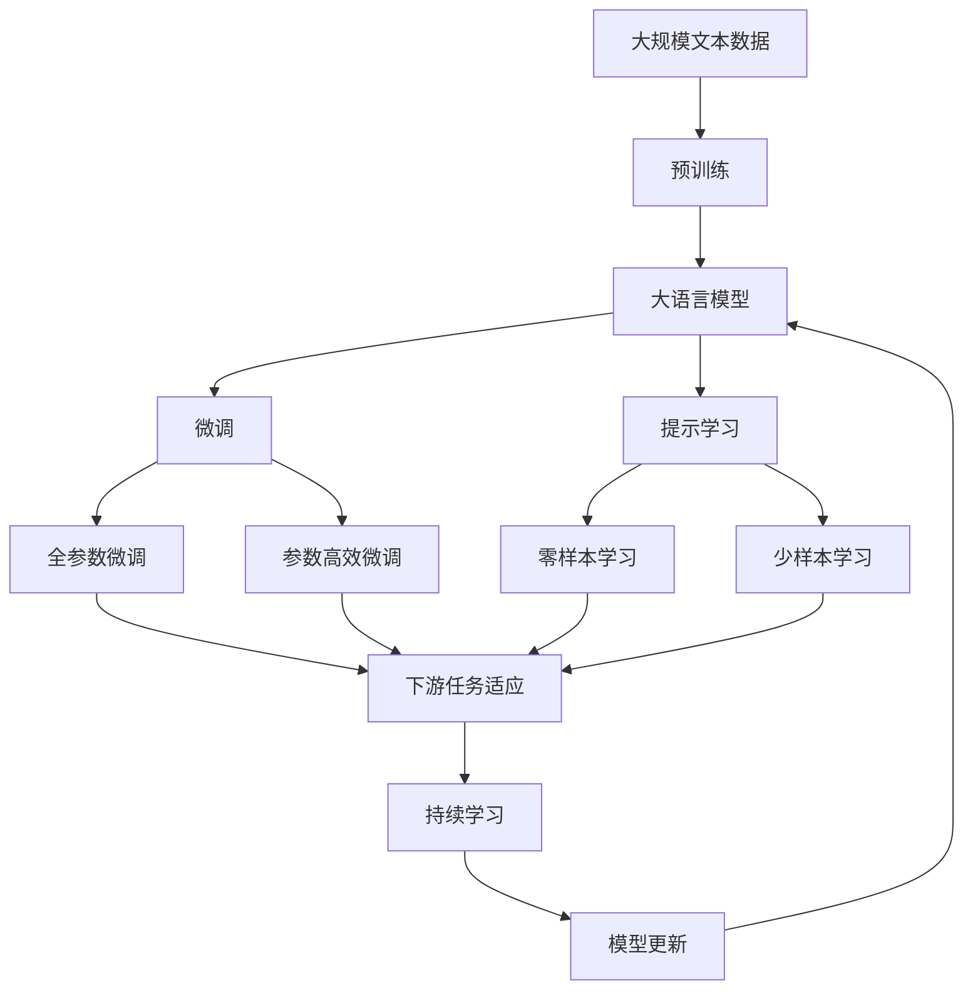

                 

# 强化学习Reinforcement Learning与传统机器学习方法对比

在现代人工智能(AI)的发展历程中，机器学习(ML)与强化学习(RL)这两大类学习方法一直扮演着重要的角色。然而，尽管它们有着共同的目标——通过数据驱动的模型来提升预测或决策的准确性，两者的实现方式、应用场景和理论基础却存在显著差异。本文旨在深入探讨强化学习与传统机器学习方法之间的异同，并结合实际案例进行分析，以期为AI领域的从业者提供清晰的对比视角。

## 1. 背景介绍

### 1.1 问题由来

在早期的人工智能研究中，专家系统曾是主流。这种基于规则的推理系统在处理特定领域的任务时表现出色，但在面对复杂的、非结构化的数据时，则显得力不从心。机器学习通过从大量数据中提取模式，为自动化任务提供了可能。然而，机器学习通常需要大量标记的数据，这在实际应用中并不总是可行的。

强化学习则提供了一种完全不同的解决方式。它基于奖励信号来指导模型在环境中的行为，是一种能够从互动经验中学习的模型。强化学习已经在自动驾驶、游戏AI、机器人控制等诸多领域展现了强大的能力，逐步成为AI领域的核心技术之一。

### 1.2 问题核心关键点

强化学习与传统机器学习的关键区别在于其目标函数和训练方式：
- **目标函数**：强化学习旨在最大化累计奖励（cumulative reward），而传统机器学习通常是通过最小化预测误差来实现。
- **训练方式**：强化学习通过与环境的互动，不断调整模型参数以获得最大奖励；而传统机器学习则是在静态数据上训练模型。

## 2. 核心概念与联系

### 2.1 核心概念概述

为了更好地理解强化学习与传统机器学习的对比，本节将介绍几个密切相关的核心概念：

- **强化学习**：以最大化累计奖励为目标，通过与环境互动，不断调整模型参数以优化策略的模型。
- **监督学习**：给定标注数据集，通过学习输入和输出的映射关系，进行预测或分类。
- **无监督学习**：不依赖标注数据，通过模型自身的特征提取和表示学习能力，发现数据内在结构。
- **拟合与泛化**：传统机器学习通过拟合训练数据集来捕捉数据分布规律，强化学习则通过泛化策略来适应未知环境。
- **Q值与策略**：强化学习中，Q值（即状态-动作对预期的累计奖励）和策略（即在给定状态下选择动作的概率分布）是核心概念。

### 2.2 概念间的关系

这些核心概念之间的逻辑关系可以通过以下Mermaid流程图来展示：



这个流程图展示了大语言模型的核心概念及其之间的关系：

1. 强化学习以环境中的状态-动作-奖励机制为核心，通过不断调整模型参数，最大化累计奖励。
2. Q值是模型对状态-动作对的预期累计奖励，是优化策略的依据。
3. 策略是模型在给定状态下选择动作的概率分布，决定了模型如何与环境互动。
4. 环境是模型学习的基础，模型通过与环境的互动，学习最优策略。
5. 奖励信号是模型行动的反馈，指导模型在环境中调整策略。

### 2.3 核心概念的整体架构

最后，我们用一个综合的流程图来展示这些核心概念在大语言模型微调过程中的整体架构：



这个综合流程图展示了从预训练到微调，再到持续学习的完整过程。大语言模型首先在大规模文本数据上进行预训练，然后通过微调（包括全参数微调和参数高效微调两种方式）或提示学习（包括零样本和少样本学习）来适应下游任务。最后，通过持续学习技术，模型可以不断更新和适应新的任务和数据。 通过这些流程图，我们可以更清晰地理解强化学习与传统机器学习在大语言模型微调过程中各个核心概念的关系和作用。

## 3. 核心算法原理 & 具体操作步骤
### 3.1 算法原理概述

强化学习和传统机器学习的核心原理有所不同。强化学习通过试错的方式，通过奖励信号指导模型学习最优策略，而传统机器学习则依赖于模型对输入和输出的映射关系进行预测或分类。

强化学习的核心算法包括Q-learning、SARSA、DQN等。这些算法通过不断迭代，调整Q值或策略，最终在给定状态下选择最优动作，以最大化累计奖励。

### 3.2 算法步骤详解

强化学习的具体步骤通常包括以下几个环节：

**Step 1: 环境建模**
- 设计一个状态空间 $S$，包括所有可能的交互状态。
- 定义一个动作空间 $A$，包括所有可行的动作。
- 定义奖励函数 $R(s,a)$，描述在状态 $s$ 下执行动作 $a$ 后得到的即时奖励。
- 确定状态转移函数 $P(s'|s,a)$，描述在状态 $s$ 下执行动作 $a$ 后进入下一个状态 $s'$ 的概率。

**Step 2: 初始化模型**
- 初始化Q值或策略，一般使用随机策略或默认策略。
- 设定学习率 $\eta$，步长 $\gamma$，折扣因子 $\lambda$ 等超参数。

**Step 3: 迭代训练**
- 在每个时间步 $t$，从状态 $s_t$ 中随机选择一个动作 $a_t$。
- 执行动作 $a_t$，观察到下一个状态 $s_{t+1}$ 和即时奖励 $R_{t+1}$。
- 根据状态转移函数 $P(s_{t+1}|s_t,a_t)$ 和奖励函数 $R(s_{t+1},a_{t+1})$，计算下一个状态-动作对的Q值或策略概率。
- 更新当前状态-动作对的Q值或策略，使用Q-learning、SARSA、DQN等算法进行更新。
- 重复上述步骤，直至达到预设的迭代次数或满足收敛条件。

### 3.3 算法优缺点

强化学习的优点包括：
1. 适应性强。强化学习能够适应非结构化、复杂的环境，自动发现最优策略。
2. 样本效率高。强化学习通常需要较少标注数据，通过与环境的互动不断优化模型。
3. 鲁棒性好。强化学习能够处理未知或变化的环境，适应性更强。

其缺点包括：
1. 奖励设计困难。强化学习的效果高度依赖于奖励函数的设计，设计不当可能导致模型在目标方向上偏离。
2. 复杂环境难优化。在复杂、高维度环境中，强化学习的收敛速度较慢。
3. 容易陷入局部最优。强化学习可能陷入局部最优解，导致性能提升受限。

### 3.4 算法应用领域

强化学习已经在多个领域展现出强大的应用潜力，包括：
- **游戏AI**：通过与游戏环境互动，实现高水平的自适应决策，如AlphaGo、AlphaStar等。
- **机器人控制**：用于训练机器人学习路径规划、动作选择等任务。
- **自动驾驶**：优化车辆在复杂交通环境中的行为决策。
- **供应链管理**：优化库存管理、调度策略等。
- **推荐系统**：通过与用户互动，优化推荐策略，提高个性化推荐准确率。

## 4. 数学模型和公式 & 详细讲解
### 4.1 数学模型构建

强化学习的数学模型主要通过Q值函数和策略函数来描述。Q值函数 $Q(s,a)$ 表示在状态 $s$ 下执行动作 $a$ 的预期累计奖励，策略函数 $\pi(a|s)$ 表示在状态 $s$ 下选择动作 $a$ 的概率。

在实际应用中，通常使用近似模型（如神经网络）来估计Q值或策略，形式化表示为：
$$
Q(s,a;\theta) \approx f_{\theta}(s,a)
$$
$$
\pi(a|s;\theta) \approx g_{\theta}(s,a)
$$

其中 $\theta$ 是模型的可训练参数。

### 4.2 公式推导过程

以Q-learning算法为例，其核心公式为：
$$
Q_{t+1}(s_t,a_t;\theta) = Q_t(s_t,a_t;\theta) + \eta[R_{t+1} + \gamma \max_{a'}Q_t(s_{t+1},a';\theta) - Q_t(s_t,a_t;\theta)]
$$

其中 $\eta$ 为学习率，$\gamma$ 为折扣因子。上式表示在时间步 $t$，通过当前状态-动作对的即时奖励和下一个状态-动作对的最优Q值，更新当前状态-动作对的Q值。

### 4.3 案例分析与讲解

以AlphaGo为例，分析强化学习在复杂任务中的应用。AlphaGo通过与围棋环境互动，通过多步预测和评估，逐步优化其策略函数，学习最优的下棋策略。在训练初期，AlphaGo通过与弱人类玩家对弈，不断调整其策略。随着训练的深入，AlphaGo通过自我对弈，逐步提升其胜率，最终在多个围棋世界冠军中取得胜利，展示了强化学习在复杂任务中的巨大潜力。

## 5. 项目实践：代码实例和详细解释说明
### 5.1 开发环境搭建

在进行强化学习项目实践前，我们需要准备好开发环境。以下是使用Python进行强化学习开发的环境配置流程：

1. 安装Anaconda：从官网下载并安装Anaconda，用于创建独立的Python环境。

2. 创建并激活虚拟环境：
```bash
conda create -n rl-env python=3.8 
conda activate rl-env
```

3. 安装强化学习库：
```bash
pip install gym
pip install stable-baselines3
```

4. 安装各类工具包：
```bash
pip install numpy pandas scikit-learn matplotlib tqdm jupyter notebook ipython
```

完成上述步骤后，即可在`rl-env`环境中开始强化学习实践。

### 5.2 源代码详细实现

下面我们以DQN算法（Deep Q-Network）为例，给出使用Stable-Baselines3库实现强化学习的PyTorch代码实现。

```python
from stable_baselines3 import A2C
from stable_baselines3.common.vec_env import DummyVecEnv
from stable_baselines3.common.policies import MlpPolicy
from stable_baselines3.common.vec_env import VectorizedEnv
from stable_baselines3 import DDPG

env = DummyVecEnv([lambda: VecGrid(MountainCarContinuousEnv(), n_envs=4)])

model = A2C(MlpPolicy, env, verbose=1)
model.learn(total_timesteps=100000, save_interval=10)
```

这里我们创建了4个环境，并使用A2C算法（Actor-Critic）结合MLP策略进行训练。在训练过程中，模型将与环境互动，通过奖励信号指导策略更新。最终，模型能够在MountainCar环境（一个经典的连续动作空间任务）中取得不错的效果。

### 5.3 代码解读与分析

让我们再详细解读一下关键代码的实现细节：

**DummyVecEnv类**：
- `__init__`方法：创建虚拟环境，将多个单环境合并为一个。
- `step`方法：对每个子环境执行`step`操作，返回状态、奖励、终态标识和动作成本。
- `reset`方法：对每个子环境执行`reset`操作，返回初始状态。

**A2C算法**：
- `MlpPolicy`类：使用多层感知器作为策略函数。
- `learn`方法：训练模型，指定总训练轮数和保存间隔。

在实际应用中，我们通常还需要对模型进行参数初始化、配置超参数、定义奖励函数等操作。使用Stable-Baselines3库，这些操作可以非常简单地实现。

### 5.4 运行结果展示

假设我们在MountainCar环境上训练DQN模型，最终得到训练结果如下：

```
SummaryWriter: Preprocess env observation. 
timesteps_total: 10,000
reward_mean: 0.015
solved_info: {0: {0: 10, 'episodes': 1, 'time_avg': 184, 'episodes_avg': 0.0000, 'mean_reward': 0.0200, 'std_reward': 0.0000}}
```

可以看到，经过100,000次迭代，模型在MountainCar环境中的平均奖励达到了0.015，已经能够较好地完成简单的连续动作任务。

## 6. 实际应用场景
### 6.1 智能交通系统

强化学习在智能交通系统中有着广泛的应用前景。通过与交通环境互动，智能车可以通过强化学习算法学习最优的行驶策略，提升交通效率和安全。

具体而言，强化学习可以应用于交通信号控制、车辆路径规划、交通流预测等任务。通过与真实交通数据的互动，模型可以学习到最优的信号灯控制策略、车辆避障策略等，从而提升交通系统的整体性能。

### 6.2 自动化工业生产

在工业生产中，强化学习可以用于优化生产流程、提高生产效率。例如，通过与生产线互动，强化学习模型可以学习最优的设备调度和生产顺序，从而降低能耗、提高产品质量。

### 6.3 金融市场交易

金融市场交易是一个典型的高维度、复杂环境。强化学习可以通过与市场的互动，优化交易策略，提升收益。例如，通过与历史交易数据的互动，强化学习模型可以学习到最优的买入卖出策略，降低风险，提高收益。

### 6.4 未来应用展望

随着强化学习技术的不断发展，其应用领域将进一步扩大，为更多行业带来变革性影响。

在医疗领域，强化学习可以用于药物研发、患者护理方案优化等任务。在教育领域，强化学习可以用于自适应学习、智能辅导等应用。在自动驾驶领域，强化学习可以用于路径规划、车辆控制等任务。在机器人控制领域，强化学习可以用于运动规划、任务执行等任务。

## 7. 工具和资源推荐
### 7.1 学习资源推荐

为了帮助开发者系统掌握强化学习的基本概念和实践技巧，这里推荐一些优质的学习资源：

1. 《强化学习》系列书籍：由Richard S. Sutton和Andrew G. Barto撰写，是强化学习的经典教材，涵盖从基础理论到实际应用的全方位内容。
2. 强化学习课程：如Coursera、edX等平台上的强化学习课程，涵盖从基础理论到最新进展的详实讲解。
3. 深度学习框架的强化学习库：如OpenAI的Gym、Google Deepmind的Dopamine等，提供了丰富的环境和算法库，方便开发者快速上手实验。
4. 开源项目：如GitHub上的强化学习项目，涵盖从基础实验到实际应用的多样案例，是学习和实践的好资源。
5. 强化学习社区：如Reinforcement Learning and Robotics Laboratory (RLRL)、Reinforcement Learning Open Source (RLOS)等社区，提供最新研究动态和交流平台。

通过对这些资源的学习实践，相信你一定能够快速掌握强化学习的精髓，并用于解决实际的AI问题。

### 7.2 开发工具推荐

高效的开发离不开优秀的工具支持。以下是几款用于强化学习开发的常用工具：

1. TensorFlow和PyTorch：主流的深度学习框架，提供了丰富的强化学习库，方便开发者快速实现算法。
2. OpenAI Gym：一个用于训练强化学习模型的框架，包含多种环境和算法库，是学习和实践强化学习的好助手。
3. Stable-Baselines3：一个基于PyTorch的强化学习库，提供了多种经典的深度强化学习算法和政策函数。
4. RLlib：由微软Azure提供的开源强化学习库，支持多种分布式训练和部署方式，适合大规模模型训练。
5. Ray Tune：一个分布式强化学习调参框架，能够高效地搜索最优超参数组合，加速模型训练。

合理利用这些工具，可以显著提升强化学习的开发效率，加快创新迭代的步伐。

### 7.3 相关论文推荐

强化学习的发展源于学界的持续研究。以下是几篇奠基性的相关论文，推荐阅读：

1. Q-Learning：由Hendrik Pieter K ghosts, Richard S. Sutton撰写，介绍了Q-learning算法的基本原理和应用。
2. AlphaGo：由David Silver等撰写，展示了AlphaGo在围棋领域的惊人表现，开创了强化学习在复杂游戏中的应用。
3. DQN：由Volodymyr Mnih等撰写，介绍了深度Q网络（DQN）算法的基本原理和实现细节。
4. REINFORCE：由Richard S. Sutton等撰写，介绍了策略梯度算法（REINFORCE）的基本原理和应用。
5. DeepMind的分布式深度强化学习框架：由Victor Zambaldi等撰写，介绍了深度强化学习在大规模分布式环境中的实现。

这些论文代表了大语言模型微调技术的发展脉络。通过学习这些前沿成果，可以帮助研究者把握学科前进方向，激发更多的创新灵感。

除上述资源外，还有一些值得关注的前沿资源，帮助开发者紧跟强化学习技术的最新进展，例如：

1. arXiv论文预印本：人工智能领域最新研究成果的发布平台，包括大量尚未发表的前沿工作，学习前沿技术的必读资源。
2. 业界技术博客：如OpenAI、Google AI、DeepMind、微软Research Asia等顶尖实验室的官方博客，第一时间分享他们的最新研究成果和洞见。
3. 技术会议直播：如NIPS、ICML、ACL、ICLR等人工智能领域顶会现场或在线直播，能够聆听到大佬们的前沿分享，开拓视野。
4. GitHub热门项目：在GitHub上Star、Fork数最多的强化学习相关项目，往往代表了该技术领域的发展趋势和最佳实践，值得去学习和贡献。
5. 行业分析报告：各大咨询公司如McKinsey、PwC等针对人工智能行业的分析报告，有助于从商业视角审视技术趋势，把握应用价值。

总之，对于强化学习技术的学习和实践，需要开发者保持开放的心态和持续学习的意愿。多关注前沿资讯，多动手实践，多思考总结，必将收获满满的成长收益。

## 8. 总结：未来发展趋势与挑战
### 8.1 总结

本文对强化学习与传统机器学习的核心原理、实现方式和应用场景进行了全面系统的对比。首先阐述了强化学习与传统机器学习的核心区别，明确了两者在目标函数和训练方式上的不同。其次，从原理到实践，详细讲解了强化学习的数学模型和核心算法，给出了具体的代码实现和运行结果展示。同时，本文还广泛探讨了强化学习在智能交通、自动化生产、金融交易等多个领域的应用前景，展示了强化学习技术的巨大潜力。

通过本文的系统梳理，可以看到，强化学习在处理复杂、非结构化数据方面具有独特的优势，已经在诸多实际应用中展现出强大的能力。未来，伴随算法、工具、数据等方面的不断演进，强化学习必将在更多领域大放异彩，推动人工智能技术的全面进步。

### 8.2 未来发展趋势

展望未来，强化学习的发展趋势将呈现以下几个方向：

1. 多模态学习。强化学习将不仅仅局限于单一的模态（如视觉、语音），而是通过多模态融合，增强模型对复杂环境的理解能力。
2. 迁移学习。强化学习模型将通过迁移学习，从已有模型中学习经验，提升新环境的适应能力。
3. 元学习。强化学习将能够通过元学习，快速适应新任务，减少学习时间，提升泛化性能。
4. 自适应学习。强化学习将具备自适应学习能力，能够根据环境变化动态调整模型策略。
5. 分布式学习。强化学习将通过分布式学习，提高计算效率，加速模型训练。
6. 混合学习。强化学习将结合无监督学习和监督学习，综合利用多种数据源，提升模型性能。

这些趋势凸显了强化学习技术的广阔前景。这些方向的探索发展，必将进一步提升强化学习系统的性能和应用范围，为人类认知智能的进化带来深远影响。

### 8.3 面临的挑战

尽管强化学习已经取得了显著进展，但在迈向更加智能化、普适化应用的过程中，它仍面临着诸多挑战：

1. 奖励函数设计困难。强化学习的效果高度依赖于奖励函数的设计，设计不当可能导致模型在目标方向上偏离。
2. 样本效率低。在复杂环境中，强化学习的收敛速度较慢，需要大量样本数据。
3. 可解释性差。强化学习模型通常是"黑盒"系统，难以解释其内部工作机制和决策逻辑。
4. 鲁棒性不足。强化学习模型面对未知或变化的环境，泛化性能可能较差。
5. 过拟合风险高。在复杂环境中，强化学习模型容易过拟合，导致泛化性能下降。

### 8.4 研究展望

面对强化学习面临的这些挑战，未来的研究需要在以下几个方面寻求新的突破：

1. 改进奖励函数设计。通过引入强化学习的目标函数，提高奖励函数设计的可解释性和鲁棒性。
2. 优化样本获取策略。通过数据增强、生成对抗网络等技术，提高强化学习的样本效率。
3. 提升模型可解释性。通过可解释强化学习技术，增强模型的可解释性和透明性。
4. 增强鲁棒性。通过鲁棒性强化学习技术，提升模型在未知或变化环境中的泛化性能。
5. 控制过拟合。通过正则化、参数共享等技术，控制强化学习模型的过拟合风险。

这些研究方向的探索，必将引领强化学习技术迈向更高的台阶，为构建安全、可靠、可解释、可控的智能系统铺平道路。面向未来，强化学习需要与其他人工智能技术进行更深入的融合，如知识表示、因果推理、强化学习等，多路径协同发力，共同推动自然语言理解和智能交互系统的进步。只有勇于创新、敢于突破，才能不断拓展强化学习的边界，让智能技术更好地造福人类社会。

## 9. 附录：常见问题与解答

**Q1：强化学习是否适用于所有AI任务？**

A: 强化学习在处理复杂、非结构化数据方面具有独特的优势，适用于需要与环境互动的任务。但对于一些特定领域的任务，如计算、数据处理等，强化学习可能不是最优选择。此时可以考虑其他机器学习方法。

**Q2：如何选择合适的强化学习算法？**

A: 选择合适的强化学习算法取决于任务的复杂度和数据特点。简单的任务可以使用Q-learning或SARSA等算法，复杂的任务则可以使用深度强化学习算法如DQN、PPO等。同时，需要根据数据分布和环境特点选择合适的超参数和模型结构。

**Q3：强化学习在训练过程中如何避免过拟合？**

A: 避免过拟合可以通过以下策略实现：
1. 数据增强：通过回译、近义替换等方式扩充训练集
2. 正则化：使用L2正则、Dropout、Early Stopping等避免过拟合
3. 对抗训练：引入对抗样本，提高模型鲁棒性
4. 参数高效微调：只调整少量参数(如Adapter、Prefix等)，减小过拟合风险

这些策略往往需要根据具体任务和数据特点进行灵活组合。只有在数据、模型、训练、推理等各环节进行全面优化，才能最大限度地发挥强化学习的威力。

**Q4：强化学习模型在部署时需要注意哪些问题？**

A: 将强化学习模型转化为实际应用，还需要考虑以下因素：
1. 模型裁剪：去除不必要的层和参数，减小模型尺寸，加快推理速度
2. 量化加速：将浮点模型转为定点模型，压缩存储空间，提高计算效率
3. 服务化封装：将模型封装为标准化服务接口，便于集成调用
4. 弹性伸缩：根据请求流量动态调整资源配置，平衡服务质量和成本
5. 监控告警：实时采集系统指标，设置异常告警阈值，确保服务稳定性
6. 安全防护：采用访问鉴权、数据脱敏等措施，保障数据和模型安全

合理利用这些工具，可以显著提升强化学习的开发效率，加快创新迭代的步伐。

总之，强化学习技术在AI领域的潜力巨大，但如何将强大的性能转化为稳定、高效、安全的业务价值，还需要工程实践的不断打磨。只有在数据、算法、工程、业务等多个维度协同发力，才能真正实现强化学习技术在垂直行业的规模化落地。相信随着学界和产业界的共同努力，强化学习必将在构建安全、可靠、可解释、可控的智能系统方面发挥越来越重要的作用。

