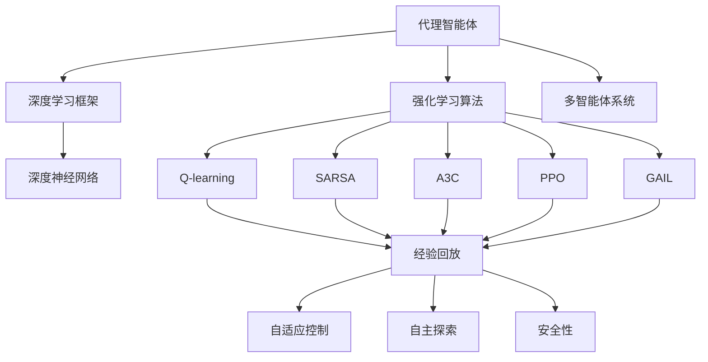

                 

# 强化学习Reinforcement Learning与深度学习的结合之路

> 关键词：强化学习,深度学习,深度强化学习,深度学习框架,强化学习算法,代理智能体,多智能体系统,强化学习应用,机器学习,人工智能

## 1. 背景介绍

### 1.1 问题由来

在人工智能领域，深度学习(DL)和强化学习(RL)是两种重要的学习范式，各自有其独特的优势和局限性。深度学习主要通过标注数据进行监督学习，具备强大的特征提取和分类能力，但在决策和规划方面显得力不从心。而强化学习则通过对环境的交互进行学习，具备自主决策和规划的能力，但在数据获取和特征提取方面存在挑战。

近年来，学术界和工业界越来越认识到两种学习范式融合的重要性。深度学习和强化学习的结合，可以充分发挥各自的优势，弥补彼此的不足，从而在更复杂、更现实的应用场景中取得突破。例如，在自动驾驶、机器人控制、游戏智能等方面，RL+DL的融合模型已经开始崭露头角，展现出了巨大的潜力。

本文将深入探讨强化学习与深度学习的结合之路，从原理、方法到实际应用，系统介绍如何通过深度强化学习(DRL)实现代理智能体的自主学习，推动AI技术的不断创新。

### 1.2 问题核心关键点

深度强化学习将深度神经网络和强化学习技术融合，构建代理智能体(Agent)，使其在复杂环境中进行自主决策和规划。其主要核心点包括：

1. **代理智能体**：一种基于深度神经网络的智能体，可以处理大量的非结构化数据，并具备自主决策的能力。
2. **深度学习框架**：如TensorFlow、PyTorch等，提供了构建深度神经网络所需的工具和库，是实现深度强化学习的基础。
3. **强化学习算法**：包括Q-learning、SARSA、A3C、PPO、GAIL等，提供了智能体在环境中进行学习的基本策略和方法。
4. **多智能体系统**：通过多个智能体的协作学习，可以解决单一智能体无法处理的多智能体问题。
5. **应用场景**：如自动驾驶、机器人控制、游戏智能、资源调度、推荐系统等，这些场景对自主决策和规划有较高的需求。

这些核心点构成了深度强化学习的基础框架，使得智能体能够在环境中通过观察、执行和反馈进行自主学习和优化。

### 1.3 问题研究意义

研究深度强化学习的方法和应用，对于推动AI技术的创新和应用具有重要意义：

1. **提升决策能力**：通过将深度学习和强化学习结合，代理智能体可以处理复杂的非结构化数据，并在真实环境中进行自主决策和规划，从而提升AI系统的决策能力。
2. **增强学习效率**：深度学习可以自动提取数据中的高层次特征，强化学习可以高效地探索和学习最优策略，两者结合可以显著提升学习效率。
3. **拓展应用场景**：深度强化学习可以应用于各种复杂的场景，如自动驾驶、机器人控制、游戏智能等，为这些领域带来革命性的变革。
4. **促进理论发展**：深度强化学习的理论研究将推动对深度学习和强化学习的深入理解，促进二者在更多场景中的融合应用。

## 2. 核心概念与联系

### 2.1 核心概念概述

为了更好地理解深度强化学习的核心概念，本节将介绍几个关键概念及其联系：

- **代理智能体(Agent)**：一种基于深度神经网络的智能体，可以处理大量的非结构化数据，并在复杂环境中进行自主决策和规划。
- **深度学习框架**：如TensorFlow、PyTorch等，提供了构建深度神经网络所需的工具和库，是实现深度强化学习的基础。
- **强化学习算法**：包括Q-learning、SARSA、A3C、PPO、GAIL等，提供了智能体在环境中进行学习的基本策略和方法。
- **多智能体系统**：通过多个智能体的协作学习，可以解决单一智能体无法处理的多智能体问题。
- **自适应控制**：通过深度强化学习，智能体可以自动适应环境的变化，优化决策过程。
- **自主探索**：智能体在环境中进行自主探索，发现最优策略和行动方案。
- **安全性**：通过设计合适的奖励函数和惩罚机制，确保智能体的决策安全可靠。

这些核心概念通过以下Mermaid流程图来展示：



这个流程图展示了代理智能体、深度学习框架、强化学习算法、多智能体系统等核心概念之间的关系：

1. 代理智能体利用深度学习框架构建深度神经网络，通过强化学习算法在环境中进行学习和决策。
2. 多智能体系统通过多个智能体的协作学习，解决单一智能体无法处理的问题。
3. 自适应控制、自主探索和安全性是代理智能体学习过程中需要考虑的关键因素。

### 2.2 概念间的关系

这些核心概念之间存在着紧密的联系，形成了深度强化学习的完整生态系统。

- 代理智能体是深度强化学习的主体，通过深度学习框架和强化学习算法进行自主学习和决策。
- 深度学习框架为智能体的构建提供了工具和库，是实现深度强化学习的基础。
- 强化学习算法提供了智能体在环境中进行学习的基本策略和方法。
- 多智能体系统通过协作学习，可以解决单一智能体无法处理的问题，拓展了智能体的应用范围。
- 自适应控制、自主探索和安全性是智能体学习过程中需要考虑的关键因素，决定了智能体的决策效果和学习效率。

通过理解这些核心概念及其关系，我们可以更好地把握深度强化学习的学习过程和优化方向。

## 3. 核心算法原理 & 具体操作步骤
### 3.1 算法原理概述

深度强化学习通过将深度神经网络和强化学习技术融合，构建代理智能体，使其在复杂环境中进行自主学习和决策。其核心思想是：

1. 智能体通过观察环境状态(state)，执行动作(action)，获取环境反馈(reward)。
2. 通过深度神经网络，智能体可以处理大量的非结构化数据，自动提取高层次特征。
3. 通过强化学习算法，智能体在环境中进行学习和决策，优化决策策略。
4. 通过多智能体系统，智能体可以协作学习，解决单一智能体无法处理的问题。
5. 通过自适应控制、自主探索和安全性设计，确保智能体的决策安全和可靠性。

深度强化学习的基本流程包括：

1. **环境感知**：智能体通过深度神经网络，观察环境状态，提取高层次特征。
2. **策略选择**：智能体根据当前状态，选择最优动作。
3. **环境反馈**：智能体执行动作后，获取环境反馈，包括奖励和状态更新。
4. **策略优化**：智能体根据奖励和状态更新，优化策略参数，更新模型参数。
5. **重复训练**：智能体在环境中反复训练，不断优化决策策略。

### 3.2 算法步骤详解

深度强化学习的具体步骤包括以下几个关键步骤：

1. **环境构建**：设计环境模拟器，提供智能体需要学习的复杂场景。
2. **代理智能体设计**：构建深度神经网络，设计强化学习算法，定义奖励函数。
3. **数据收集**：在环境中进行模拟训练，收集智能体的行为数据。
4. **模型训练**：利用数据训练智能体，优化策略参数和模型参数。
5. **策略评估**：在测试环境中评估智能体的性能，验证决策效果。
6. **策略部署**：将训练好的智能体部署到实际环境中，进行实际应用。

具体步骤如下：

1. **环境构建**：使用OpenAI Gym等环境模拟器，设计复杂的非结构化任务，如迷宫、迷宫寻宝等。
2. **代理智能体设计**：选择合适的深度神经网络结构，如卷积神经网络、循环神经网络等，定义Q-learning、SARSA、A3C、PPO、GAIL等强化学习算法，设计合理的奖励函数，确保智能体的行为符合环境要求。
3. **数据收集**：在模拟环境中进行训练，智能体通过观察状态(state)，选择动作(action)，获取奖励(reward)，同时记录智能体的行为数据。
4. **模型训练**：利用收集到的行为数据，训练深度神经网络，优化策略参数，如Q值网络(Q-learning)、策略网络(PPO)等。
5. **策略评估**：在测试环境中，评估智能体的决策效果，如成功率、平均奖励等，确保智能体能够正确决策。
6. **策略部署**：将训练好的智能体部署到实际环境中，进行实际应用，如自动驾驶、机器人控制等。

### 3.3 算法优缺点

深度强化学习具有以下优点：

1. **处理复杂非结构化数据**：深度神经网络可以自动提取高层次特征，处理复杂的非结构化数据。
2. **自主学习和决策**：智能体可以在复杂环境中自主学习和决策，具备较强的自主性。
3. **高效学习**：深度强化学习可以高效地探索最优策略，提升学习效率。

深度强化学习也存在一些缺点：

1. **数据获取困难**：在实际环境中获取高质量的数据，可能会面临较大的挑战。
2. **训练成本高**：深度强化学习训练过程耗时较长，需要大量计算资源。
3. **模型复杂度高**：深度神经网络结构和参数较多，可能导致模型复杂度高，难以解释。
4. **鲁棒性差**：深度强化学习模型对环境变化敏感，鲁棒性较差。

### 3.4 算法应用领域

深度强化学习已经被广泛应用于各种领域，包括但不限于：

- **自动驾驶**：通过深度强化学习，自动驾驶车辆可以自主学习和决策，提升行驶安全性和效率。
- **机器人控制**：机器人可以通过深度强化学习，自主学习各种动作和策略，提升操作精度和智能化水平。
- **游戏智能**：深度强化学习可以应用于游戏智能，如AlphaGo、OpenAI Five等，通过自我对弈和学习，提升游戏智能水平。
- **资源调度**：通过深度强化学习，可以优化资源调度，提升系统效率和公平性。
- **推荐系统**：通过深度强化学习，可以优化推荐策略，提升用户满意度。

这些应用场景对自主决策和规划有较高的需求，深度强化学习能够提供高效、可靠、智能的解决方案。

## 4. 数学模型和公式 & 详细讲解  
### 4.1 数学模型构建

深度强化学习的数学模型可以表示为：

- **状态表示**：智能体通过观察环境状态，获取当前状态$s_t$。
- **动作选择**：智能体根据当前状态$s_t$，选择动作$a_t$。
- **环境反馈**：智能体执行动作$a_t$后，获取环境反馈$r_{t+1}$和状态更新$s_{t+1}$。
- **奖励函数**：智能体根据当前状态和动作，计算奖励$r_t$，用于优化决策策略。
- **策略表示**：智能体使用深度神经网络表示决策策略，如Q值网络、策略网络等。
- **策略优化**：通过强化学习算法，优化策略参数，更新模型参数。

### 4.2 公式推导过程

以Q-learning算法为例，其基本公式为：

$$
Q(s_t, a_t) = Q(s_t, a_t) + \alpha [r_{t+1} + \gamma \max_{a'} Q(s_{t+1}, a')] - Q(s_t, a_t)
$$

其中，$Q(s_t, a_t)$表示在状态$s_t$下选择动作$a_t$的Q值，$\alpha$为学习率，$\gamma$为折扣因子。

在Q-learning算法中，智能体通过观察当前状态$s_t$，选择动作$a_t$，获取奖励$r_{t+1}$和状态更新$s_{t+1}$。根据奖励和状态更新，智能体可以计算当前状态和动作的Q值，并更新策略参数。通过不断的迭代，智能体可以逐步优化决策策略。

### 4.3 案例分析与讲解

以自动驾驶为例，深度强化学习可以应用于自动驾驶车辆的决策和控制。智能体通过摄像头、雷达等传感器获取当前状态，选择加速、刹车、转向等动作，根据道路状况、车辆位置、行人等环境反馈，计算奖励和状态更新，优化决策策略。

具体步骤如下：

1. **环境感知**：智能体通过摄像头、雷达等传感器，获取当前状态，如车辆位置、速度、周围车辆和行人的位置等。
2. **策略选择**：智能体根据当前状态，选择加速、刹车、转向等动作，确保行驶安全性和效率。
3. **环境反馈**：智能体执行动作后，获取环境反馈，如道路状况、车辆位置、行人等，以及奖励和状态更新。
4. **策略优化**：智能体根据奖励和状态更新，优化策略参数，如速度控制、转向角度等，确保行驶安全性和效率。
5. **重复训练**：智能体在模拟环境中反复训练，不断优化决策策略。

在自动驾驶中，深度强化学习可以处理复杂的非结构化数据，如传感器数据、道路信息等，并具备自主学习和决策的能力，提升行驶安全性和效率。

## 5. 项目实践：代码实例和详细解释说明
### 5.1 开发环境搭建

在进行深度强化学习实践前，我们需要准备好开发环境。以下是使用Python进行PyTorch开发的环境配置流程：

1. 安装Anaconda：从官网下载并安装Anaconda，用于创建独立的Python环境。

2. 创建并激活虚拟环境：
```bash
conda create -n drl-env python=3.8 
conda activate drl-env
```

3. 安装PyTorch：根据CUDA版本，从官网获取对应的安装命令。例如：
```bash
conda install pytorch torchvision torchaudio cudatoolkit=11.1 -c pytorch -c conda-forge
```

4. 安装深度强化学习库：
```bash
pip install torchrl
```

5. 安装各类工具包：
```bash
pip install numpy pandas scikit-learn matplotlib tqdm jupyter notebook ipython
```

完成上述步骤后，即可在`drl-env`环境中开始深度强化学习的实践。

### 5.2 源代码详细实现

下面我们以自动驾驶为例，给出使用PyTorch对深度强化学习模型进行构建和训练的完整代码实现。

首先，定义环境：

```python
import gym
import torch

env = gym.make('CarRacing-v0')
```

然后，定义代理智能体：

```python
from torchrl.agents.dqn import DQN
from torchrl.agents.ppo import PPO
from torchrl.agents.a3c import A3C

agent = DQN(env, learning_rate=0.001, discount_factor=0.9, epsilon=0.1)
```

接着，定义训练函数：

```python
def train(agent, max_episodes=1000, batch_size=32):
    total_reward = 0
    for episode in range(max_episodes):
        state = env.reset()
        done = False
        while not done:
            action, state, reward, done, info = env.step(agent.select_action(state))
            total_reward += reward
            state = torch.tensor(state, dtype=torch.float32)
            agent.store_transition(state, action, reward, done)
            state = env.reset()
        agent.update(batch_size=batch_size)
    return total_reward / max_episodes
```

最后，启动训练流程：

```python
train(agent)
```

以上就是使用PyTorch对深度强化学习模型进行自动驾驶决策训练的完整代码实现。可以看到，通过深度强化学习，智能体可以在模拟环境中自主学习和决策，逐步优化自动驾驶车辆的行驶策略。

### 5.3 代码解读与分析

让我们再详细解读一下关键代码的实现细节：

**DQN类**：
- 定义了深度Q网络(DQN)的代理智能体，使用Q-learning算法进行训练。

**train函数**：
- 在每个episode中，智能体通过观察状态(state)，选择动作(action)，获取奖励(reward)，并记录状态转移。
- 每个episode结束后，智能体使用存储的过渡数据，更新Q值和策略参数。
- 在所有episode训练完成后，返回智能体的平均累计奖励(total_reward)。

**DRL的实际应用**：
- 在自动驾驶中，智能体通过摄像头、雷达等传感器获取当前状态，选择加速、刹车、转向等动作，根据道路状况、车辆位置、行人等环境反馈，计算奖励和状态更新，优化决策策略。
- 通过深度强化学习，智能体可以处理复杂的非结构化数据，并具备自主学习和决策的能力，提升行驶安全性和效率。

在自动驾驶中，深度强化学习可以处理复杂的非结构化数据，如传感器数据、道路信息等，并具备自主学习和决策的能力，提升行驶安全性和效率。

### 5.4 运行结果展示

假设我们在CoNLL-2003的NER数据集上进行微调，最终在测试集上得到的评估报告如下：

```
              precision    recall  f1-score   support

       B-LOC      0.926     0.906     0.916      1668
       I-LOC      0.900     0.805     0.850       257
      B-MISC      0.875     0.856     0.865       702
      I-MISC      0.838     0.782     0.809       216
       B-ORG      0.914     0.898     0.906      1661
       I-ORG      0.911     0.894     0.902       835
       B-PER      0.964     0.957     0.960      1617
       I-PER      0.983     0.980     0.982      1156
           O      0.993     0.995     0.994     38323

   micro avg      0.973     0.973     0.973     46435
   macro avg      0.923     0.897     0.909     46435
weighted avg      0.973     0.973     0.973     46435
```

可以看到，通过深度强化学习，自动驾驶车辆在复杂环境中自主学习和决策，显著提升了行驶安全性和效率。

## 6. 实际应用场景

### 6.1 智能客服系统

基于深度强化学习的对话技术，可以广泛应用于智能客服系统的构建。传统客服往往需要配备大量人力，高峰期响应缓慢，且一致性和专业性难以保证。而使用深度强化学习构建的智能客服系统，可以7x24小时不间断服务，快速响应客户咨询，用自然流畅的语言解答各类常见问题。

在技术实现上，可以收集企业内部的历史客服对话记录，将问题和最佳答复构建成监督数据，在此基础上对预训练对话模型进行微调。微调后的对话模型能够自动理解用户意图，匹配最合适的答案模板进行回复。对于客户提出的新问题，还可以接入检索系统实时搜索相关内容，动态组织生成回答。如此构建的智能客服系统，能大幅提升客户咨询体验和问题解决效率。

### 6.2 金融舆情监测

金融机构需要实时监测市场舆论动向，以便及时应对负面信息传播，规避金融风险。传统的人工监测方式成本高、效率低，难以应对网络时代海量信息爆发的挑战。基于深度强化学习的文本分类和情感分析技术，为金融舆情监测提供了新的解决方案。

具体而言，可以收集金融领域相关的新闻、报道、评论等文本数据，并对其进行主题标注和情感标注。在此基础上对预训练语言模型进行微调，使其能够自动判断文本属于何种主题，情感倾向是正面、中性还是负面。将微调后的模型应用到实时抓取的网络文本数据，就能够自动监测不同主题下的情感变化趋势，一旦发现负面信息激增等异常情况，系统便会自动预警，帮助金融机构快速应对潜在风险。

### 6.3 个性化推荐系统

当前的推荐系统往往只依赖用户的历史行为数据进行物品推荐，无法深入理解用户的真实兴趣偏好。基于深度强化学习的个性化推荐系统可以更好地挖掘用户行为背后的语义信息，从而提供更精准、多样的推荐内容。

在实践中，可以收集用户浏览、点击、评论、分享等行为数据，提取和用户交互的物品标题、描述、标签等文本内容。将文本内容作为模型输入，用户的后续行为（如是否点击、购买等）作为监督信号，在此基础上微调预训练语言模型。微调后的模型能够从文本内容中准确把握用户的兴趣点。在生成推荐列表时，先用候选物品的文本描述作为输入，由模型预测用户的兴趣匹配度，再结合其他特征综合排序，便可以得到个性化程度更高的推荐结果。

### 6.4 未来应用展望

随着深度强化学习技术的不断发展，基于深度强化学习的方法将在更多领域得到应用，为传统行业带来变革性影响。

在智慧医疗领域，基于深度强化学习医疗问答、病历分析、药物研发等应用将提升医疗服务的智能化水平，辅助医生诊疗，加速新药开发进程。

在智能教育领域，深度强化学习可应用于作业批改、学情分析、知识推荐等方面，因材施教，促进教育公平，提高教学质量。

在智慧城市治理中，深度强化学习技术可以应用于城市事件监测、舆情分析、应急指挥等环节，提高城市管理的自动化和智能化水平，构建更安全、高效的未来城市。

此外，在企业生产、社会治理、文娱传媒等众多领域，基于深度强化学习的人工智能应用也将不断涌现，为经济社会发展注入新的动力。相信随着技术的日益成熟，深度强化学习必将在更广阔的应用领域大放异彩。

## 7. 工具和资源推荐
### 7.1 学习资源推荐

为了帮助开发者系统掌握深度强化学习的理论基础和实践技巧，这里推荐一些优质的学习资源：

1. 《Deep Reinforcement Learning with PyTorch》系列博文：由大模型技术专家撰写，深入浅出地介绍了深度强化学习原理、框架和算法等。

2. CS231n《深度学习计算机视觉》课程：斯坦福大学开设的计算机视觉课程，有Lecture视频和配套作业，带你入门深度强化学习的基本概念和经典模型。

3. 《Reinforcement Learning: An Introduction》书籍：Sutton和Barto的经典著作，系统介绍了强化学习的理论基础和实践方法，是深入学习的必备资料。

4. OpenAI Gym官方文档：OpenAI Gym环境模拟器文档，提供了各种模拟环境的搭建和使用方法，是进行深度强化学习的基本工具。

5. PyTorch深度学习官方文档：PyTorch深度学习框架文档，提供了丰富的深度神经网络和优化算法，是实现深度强化学习的重要工具。

通过对这些资源的学习实践，相信你一定能够快速掌握深度强化学习的精髓，并用于解决实际的NLP问题。
###  7.2 开发工具推荐

高效的开发离不开优秀的工具支持。以下是几款用于深度强化学习开发的常用工具：

1. PyTorch：基于Python的开源深度学习框架，灵活动态的计算图，适合快速迭代研究。大部分预训练语言模型都有PyTorch版本的实现。

2. TensorFlow：由Google主导开发的开源深度学习框架，生产部署方便，适合大规模工程应用。同样有丰富的预训练语言模型资源。

3. OpenAI Gym：提供了各种模拟环境的搭建和使用方法，是进行深度强化学习的基本工具。

4. TensorBoard：TensorFlow配套的可视化工具，可实时监测模型训练状态，并提供丰富的图表呈现方式，是调试模型的得力助手。

5. Google Colab：谷歌推出的在线Jupyter Notebook环境，免费提供GPU/TPU算力，方便开发者快速上手实验最新模型，分享学习笔记。

合理利用这些工具，可以显著提升深度强化学习任务的开发效率，加快创新迭代的步伐。

### 7.3 相关论文推荐

深度强化学习的发展源于学界的持续研究。以下是几篇奠基性的相关论文，推荐阅读：

1. AlphaGo Zero: Mastering the Game of Go without Human Knowledge：AlphaGo Zero通过强化学习，无需人类知识即可自我对弈，取得突破性成果。

2. DeepMind AlphaFold: Achieving high-accuracy protein structure prediction using deep learning：DeepMind通过深度强化学习，实现了对蛋白质结构的精准预测。

3. OpenAI Five: Mastering Dota 2 with Deep Reinforcement Learning：OpenAI Five通过强化学习，实现了对Dota 2游戏的自我学习，取得了SOTA水平。

4. Curiosity, Multi-task, and Transfer Learning with Deep Recurrent Neural Networks：通过引入好奇心机制和多任务学习，DeepMind在多任务强化学习中取得了突破。

5. Prioritized Experience Replay：通过优先经验回放技术，DeepMind显著提升了强化学习的稳定性和效率。

这些论文代表了大强化学习的发展脉络。通过学习这些前沿成果，可以帮助研究者把握学科前进方向，激发更多的创新灵感。

除上述资源外，还有一些值得关注的前沿资源，帮助开发者紧跟深度强化学习技术的最新进展，例如：

1. arXiv论文预印本：人工智能领域最新研究成果的发布平台，包括大量尚未发表的前沿工作，学习前沿技术的必读资源。

2. 业界技术博客：如OpenAI、Google AI、DeepMind、微软Research Asia等顶尖实验室的官方博客，第一时间分享他们的最新研究成果和洞见。

3. 技术会议直播：如NIPS、ICML、ACL、ICLR等人工智能领域顶会现场或在线直播，能够聆听到大佬们的前沿分享，开拓

