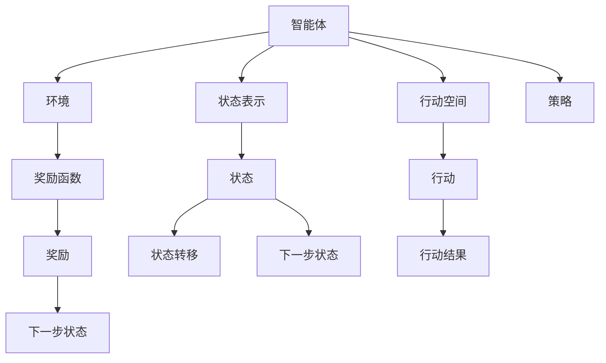
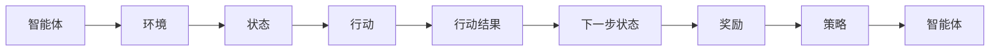
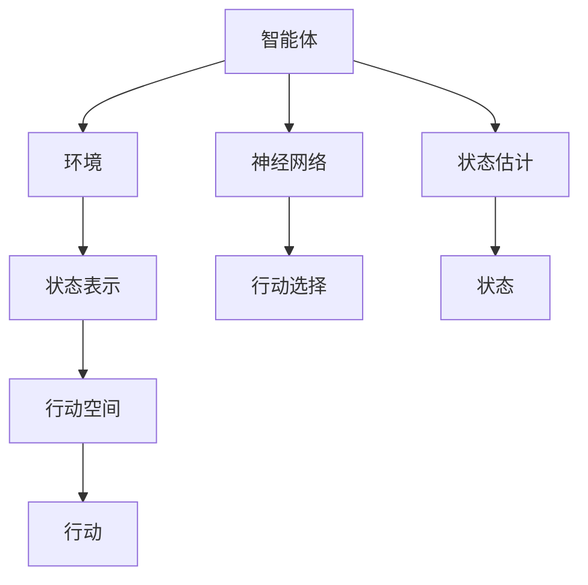
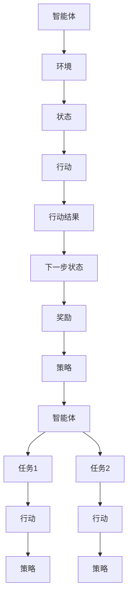
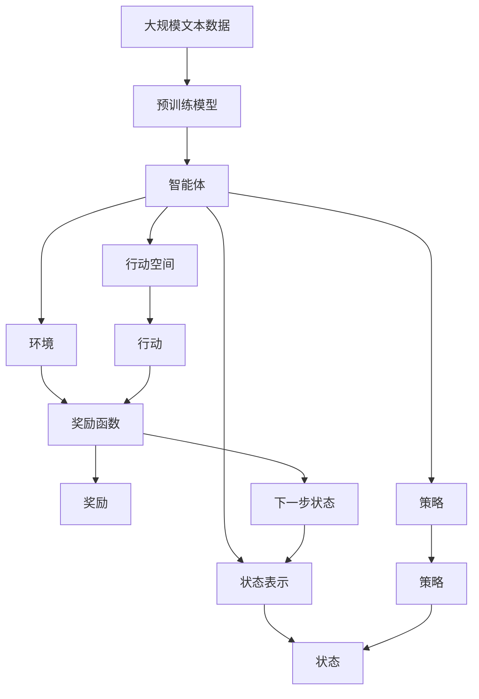

                 

## 1. 背景介绍

强化学习(Reinforcement Learning, RL)是一种通过智能体与环境互动来学习最优行为策略的机器学习方法。与传统的监督学习和无监督学习不同，强化学习中的智能体通过不断尝试和失败来积累经验，逐步优化其行为策略，以实现特定的长期目标。近年来，强化学习在自然语言处理(Natural Language Processing, NLP)领域的应用受到了广泛关注，特别是在对话系统、机器翻译、文本摘要等任务上，取得了显著的进展。

### 1.1 问题由来
在NLP领域，传统的监督学习、无监督学习等方法面临着诸如数据标注成本高、泛化能力不足等问题。而强化学习通过对智能体与环境的交互，能够更自然地处理复杂的多步决策问题，从而在NLP任务上表现出一定的优势。具体来说，强化学习可用于：

1. **对话系统**：通过与用户对话来学习响应策略，提升用户体验。
2. **机器翻译**：通过学习最优的翻译策略，提高翻译的流畅度和准确度。
3. **文本摘要**：通过学习文本压缩和重构的策略，生成精炼的摘要。
4. **信息检索**：通过优化检索策略，提高检索的精准度和效率。
5. **情感分析**：通过学习情感识别的策略，自动分类文本的情感极性。

### 1.2 问题核心关键点
强化学习在NLP领域的应用主要涉及以下几个核心关键点：

1. **环境定义**：NLP任务通常可以看作一个序列决策问题，其中每个决策对应一个时间步。智能体需要根据当前的状态和任务目标，选择最优的下一步行动。
2. **状态表示**：在NLP任务中，智能体的状态通常由文本中的某个子序列或特征表示，如对话中的当前上下文、机器翻译中的当前源句和目标句、文本摘要中的当前摘要长度等。
3. **行动选择**：智能体的行动通常对应于对输入文本的某些操作，如生成下一个词、选择下一个翻译单元、调整摘要的长度等。
4. **奖励设计**：强化学习的奖励函数设计需要根据具体任务目标进行定制，通常需要考虑文本生成的流畅度、翻译的准确性、摘要的精炼度等因素。
5. **策略优化**：通过不断迭代和优化，智能体学习到最优的策略，以最大化长期奖励。

这些关键点共同构成了强化学习在NLP领域的核心框架，使得智能体能够自动地进行序列决策，逐步优化其行为策略。

### 1.3 问题研究意义
强化学习在NLP领域的研究和应用，对于提升NLP系统的智能水平、实现更高效的任务处理具有重要意义：

1. **自动化学习**：强化学习能够自动地从文本数据中学习到最优的行为策略，减少人工干预和数据标注成本。
2. **鲁棒性提升**：强化学习可以通过不断尝试和失败来增强系统的鲁棒性和泛化能力。
3. **多任务协同**：强化学习能够同时处理多个任务，实现任务间的协同优化。
4. **动态适应**：强化学习能够动态适应新的文本数据和任务需求，提升系统的实时性和适应性。
5. **应用创新**：强化学习的新兴方法和技术，如生成对抗网络(GAN)、元学习(Meta Learning)等，可以拓展NLP技术的应用边界。

总之，强化学习为NLP系统的智能化、高效化、适应性提供了新的视角和方法，有望在未来实现更广泛的应用和创新。

## 2. 核心概念与联系

### 2.1 核心概念概述

为更好地理解强化学习在NLP领域的应用，本节将介绍几个密切相关的核心概念：

1. **强化学习**：通过智能体与环境的交互来学习最优行为策略的机器学习方法。智能体在每一步选择行动后，根据环境的反馈（即奖励）来调整策略，以最大化长期奖励。
2. **智能体**：强化学习中的决策者，通常是一个神经网络模型，负责选择最优的行动。
3. **环境**：强化学习中的外部世界，通常由文本生成器、文本翻译器、文本摘要器等NLP任务构成。
4. **状态表示**：智能体在每个时间步所处的状态，通常由文本中的某个子序列或特征表示。
5. **行动空间**：智能体可以采取的所有可能的行动。
6. **奖励函数**：根据智能体的行动和状态，返回一个奖励值，用于评估智能体的行为。
7. **策略**：智能体选择行动的规则，通常通过深度神经网络来实现。
8. **探索-利用平衡**：在强化学习中，智能体需要在探索新的行动和利用已有的知识之间找到平衡，以最大化长期奖励。

这些核心概念之间的逻辑关系可以通过以下Mermaid流程图来展示：



这个流程图展示了强化学习的基本框架：智能体在环境中交互，选择行动并根据奖励调整策略，最终优化到最优策略。

### 2.2 概念间的关系

这些核心概念之间存在着紧密的联系，形成了强化学习在NLP领域的完整生态系统。下面我通过几个Mermaid流程图来展示这些概念之间的关系。

#### 2.2.1 强化学习的基本流程



这个流程图展示了强化学习的基本流程，从智能体选择一个行动，到环境返回下一步状态和奖励，再根据奖励调整策略，形成了一个闭环。

#### 2.2.2 强化学习与深度学习的结合



这个流程图展示了强化学习与深度学习的结合方式，智能体通过神经网络来选择最优的行动，同时利用神经网络对状态进行估计，优化策略。

#### 2.2.3 多任务学习在强化学习中的应用



这个流程图展示了多任务强化学习的应用，智能体同时处理多个任务，优化每个任务的策略。

### 2.3 核心概念的整体架构

最后，我们用一个综合的流程图来展示这些核心概念在NLP任务中的整体架构：



这个综合流程图展示了从预训练模型到智能体在环境中的交互过程，以及策略的优化和更新。通过这些流程图，我们可以更清晰地理解强化学习在NLP任务中的核心概念和应用逻辑。

## 3. 核心算法原理 & 具体操作步骤
### 3.1 算法原理概述

强化学习在NLP领域的应用主要基于策略优化框架。通过智能体在环境中交互，逐步优化其策略，以最大化长期奖励。形式化地，假设智能体在状态 $s_t$ 下采取行动 $a_t$，导致状态转移 $s_{t+1}$ 并获得奖励 $r_{t+1}$。智能体的策略优化目标是最小化累积奖励的期望值：

$$
\min_{\pi} \mathbb{E}_{s_0} \left[\sum_{t=0}^{\infty} \gamma^t r_{t+1} \right]
$$

其中 $\pi$ 表示智能体的策略，$\gamma$ 是折扣因子，用于权衡当前奖励和未来奖励的重要性。

### 3.2 算法步骤详解

强化学习在NLP领域的应用步骤通常包括以下几个关键步骤：

**Step 1: 环境设计**

- **状态表示**：设计智能体的状态表示，通常是文本中的某个子序列或特征表示。例如，在对话系统中，状态可以表示为当前对话的历史记录。
- **行动空间**：定义智能体可以采取的所有可能的行动。例如，在对话系统中，行动可以是生成下一个词、回复用户等。
- **奖励函数**：设计奖励函数，用于评估智能体的行为。例如，在对话系统中，奖励可以基于用户满意度、回复的准确性等指标。

**Step 2: 模型训练**

- **策略学习**：使用深度神经网络训练智能体的策略。例如，在对话系统中，可以使用编码器-解码器模型来学习生成回复的策略。
- **优化算法**：使用强化学习的优化算法（如Q-Learning、Policy Gradient等）来优化策略。例如，在对话系统中，可以使用REINFORCE算法来训练智能体的回复策略。

**Step 3: 策略评估**

- **评估函数**：使用评估函数来评估智能体的策略。例如，在对话系统中，可以使用BLEU、ROUGE等指标来评估回复的质量。
- **模型调优**：根据评估结果，调整模型参数，优化策略。例如，在对话系统中，可以使用梯度下降算法来更新模型的权重。

**Step 4: 策略部署**

- **模型部署**：将训练好的模型部署到实际应用环境中，例如对话系统、机器翻译系统等。
- **实时优化**：根据实时输入数据，动态优化智能体的行为策略。例如，在对话系统中，可以根据用户的反馈，实时调整回复策略。

### 3.3 算法优缺点

强化学习在NLP领域的应用具有以下优点：

1. **自动化学习**：无需大量标注数据，通过智能体与环境的交互自动学习最优策略。
2. **动态适应**：能够动态适应新数据和新任务，提升系统的实时性和适应性。
3. **鲁棒性提升**：通过不断尝试和失败，增强系统的鲁棒性和泛化能力。

但同时也存在一些缺点：

1. **计算成本高**：强化学习需要大量的计算资源和时间，特别是在高维度状态空间和连续行动空间的情况下。
2. **策略不稳定**：强化学习容易陷入局部最优解，策略的稳定性需要进一步提升。
3. **策略优化困难**：强化学习中的策略优化问题是一个NP-hard问题，需要设计高效的算法来解决。

### 3.4 算法应用领域

强化学习在NLP领域的应用已经涉及多个领域，具体包括：

1. **对话系统**：通过与用户的交互，学习最优的回复策略。例如，Google的Meena模型使用了强化学习来优化对话系统。
2. **机器翻译**：通过学习最优的翻译策略，提高翻译的准确性和流畅性。例如，Facebook的FAIR实验室使用了强化学习来优化机器翻译。
3. **文本摘要**：通过学习文本压缩和重构的策略，生成精炼的摘要。例如，DeepMind的M2M-100模型使用了强化学习来优化文本摘要。
4. **信息检索**：通过优化检索策略，提高检索的精准度和效率。例如，斯坦福大学的DialoGPT模型使用了强化学习来优化信息检索。
5. **情感分析**：通过学习情感识别的策略，自动分类文本的情感极性。例如，微软的RULER模型使用了强化学习来优化情感分析。

除了这些典型应用外，强化学习还可以用于文本生成、命名实体识别、文本分类等NLP任务。

## 4. 数学模型和公式 & 详细讲解 & 举例说明

### 4.1 数学模型构建

在强化学习中，通常使用马尔可夫决策过程(Markov Decision Process, MDP)来描述智能体与环境之间的交互。假设智能体在状态 $s_t$ 下采取行动 $a_t$，导致状态转移 $s_{t+1}$ 并获得奖励 $r_{t+1}$，可以形式化地表示为：

$$
(s_{t+1}, r_{t+1}) = f(s_t, a_t, \epsilon)
$$

其中 $f$ 表示状态转移函数，$\epsilon$ 表示奖励函数。

智能体的策略 $\pi$ 定义为在每个状态 $s_t$ 下选择行动 $a_t$ 的概率分布：

$$
\pi(a_t|s_t) = \mathbb{P}(a_t|s_t) \quad \text{for all} \quad a_t \in \mathcal{A}, s_t \in \mathcal{S}
$$

其中 $\mathcal{A}$ 表示行动空间，$\mathcal{S}$ 表示状态空间。

智能体的期望累积奖励 $J(\pi)$ 定义为：

$$
J(\pi) = \mathbb{E}_{s_0 \sim p(s_0)} \left[\sum_{t=0}^{\infty} \gamma^t r_{t+1} \right]
$$

其中 $p(s_0)$ 表示初始状态的分布。

### 4.2 公式推导过程

以下我们以对话系统为例，推导强化学习在NLP中的应用。假设智能体在对话系统中的状态表示为当前对话的历史记录 $C_t$，行动空间为生成下一个词 $a_t$，奖励函数为用户满意度 $r_{t+1}$。

**Step 1: 状态表示设计**

假设智能体在对话系统中的状态表示为当前对话的历史记录 $C_t$，即 $s_t = C_t$。

**Step 2: 行动空间设计**

智能体在对话系统中的行动空间为生成下一个词 $a_t$。

**Step 3: 奖励函数设计**

智能体的奖励函数为对话系统对智能体回复的用户满意度 $r_{t+1}$，可以表示为：

$$
r_{t+1} = \text{satisfaction}(\text{response}(a_t, C_t))
$$

其中 $\text{satisfaction}$ 表示满意度函数，$\text{response}$ 表示智能体根据行动 $a_t$ 和历史记录 $C_t$ 生成的回复。

**Step 4: 策略学习**

智能体的策略 $\pi(a_t|C_t)$ 可以通过深度神经网络来学习。例如，在对话系统中，可以使用编码器-解码器模型来学习生成回复的策略。假设智能体的策略由一个Transformer模型实现，输入为当前对话的历史记录 $C_t$，输出为下一个词 $a_t$ 的条件概率分布：

$$
\pi(a_t|C_t) = \mathbb{P}(a_t|C_t) = \frac{\exp(\text{scores}(C_t, a_t))}{\sum_{a' \in \mathcal{A}} \exp(\text{scores}(C_t, a'))}
$$

其中 $\text{scores}(C_t, a_t)$ 表示智能体对行动 $a_t$ 在历史记录 $C_t$ 下的得分函数。

**Step 5: 优化算法**

智能体的策略优化可以使用强化学习的优化算法来实现。例如，在对话系统中，可以使用REINFORCE算法来训练智能体的回复策略。REINFORCE算法的基本思路是在每个时间步上，根据智能体采取的行动和环境反馈的奖励，更新策略参数：

$$
\theta_{t+1} \leftarrow \theta_t + \eta \nabla_{\theta} \log \pi(a_t|C_t) \cdot r_t
$$

其中 $\eta$ 表示学习率，$\nabla_{\theta} \log \pi(a_t|C_t)$ 表示策略参数 $\theta$ 的梯度。

### 4.3 案例分析与讲解

以对话系统为例，强化学习在NLP中的应用可以通过以下案例进行分析：

1. **Google的Meena模型**：
   - **环境设计**：智能体在对话系统中交互，状态表示为当前对话的历史记录 $C_t$，行动空间为生成下一个词 $a_t$，奖励函数为用户满意度 $r_{t+1}$。
   - **模型训练**：使用深度神经网络训练智能体的回复策略，特别是使用Transformer模型来学习生成回复的策略。
   - **策略评估**：使用BLEU、ROUGE等指标评估回复的质量。
   - **策略部署**：将训练好的模型部署到实际应用环境中，例如Google的对话系统。
   - **实时优化**：根据实时输入数据，动态优化智能体的回复策略。

2. **DeepMind的M2M-100模型**：
   - **环境设计**：智能体在文本摘要任务中交互，状态表示为当前摘要的长度 $L_t$，行动空间为调整摘要的长度 $a_t$，奖励函数为摘要的精炼度 $r_{t+1}$。
   - **模型训练**：使用深度神经网络训练智能体的摘要策略，特别是使用Transformer模型来学习摘要压缩的策略。
   - **策略评估**：使用ROUGE等指标评估摘要的精炼度。
   - **策略部署**：将训练好的模型部署到实际应用环境中，例如DeepMind的文本摘要系统。
   - **实时优化**：根据实时输入数据，动态优化智能体的摘要策略。

通过这些案例，可以看到强化学习在NLP领域的广泛应用，及其在自动化学习、动态适应、鲁棒性提升等方面的优势。

## 5. 项目实践：代码实例和详细解释说明
### 5.1 开发环境搭建

在进行强化学习实践前，我们需要准备好开发环境。以下是使用Python进行OpenAI Gym开发的环境配置流程：

1. 安装Anaconda：从官网下载并安装Anaconda，用于创建独立的Python环境。

2. 创建并激活虚拟环境：
```bash
conda create -n reinforcement-env python=3.8 
conda activate reinforcement-env
```

3. 安装Gym：从官网获取Gym库，进行安装。例如：
```bash
pip install gym
```

4. 安装PyTorch：根据CUDA版本，从官网获取对应的安装命令。例如：
```bash
conda install pytorch torchvision torchaudio cudatoolkit=11.1 -c pytorch -c conda-forge
```

5. 安装PyTorch RL：使用pip安装PyTorch RL库，用于深度强化学习模型开发。例如：
```bash
pip install torchrl
```

完成上述步骤后，即可在`reinforcement-env`环境中开始强化学习实践。

### 5.2 源代码详细实现

这里我们以对话系统为例，使用Gym库和PyTorch RL库对DQN模型进行训练。

首先，定义对话系统的Gym环境：

```python
import gym
import gym.spaces

class DialogueGymEnv(gym.Env):
    def __init__(self):
        self.dialogue = []
        self.chatbot = None
        self.candidate_responses = []
        self.response_count = 0
        self.finished = False
        self.action_space = gym.spaces.Discrete(2)
        self.observation_space = gym.spaces.Dict({
            'history': gym.spaces.Box(low=0, high=1, shape=(None, 100), dtype=float)
        })
        
    def reset(self):
        self.dialogue = []
        self.finished = False
        self.response_count = 0
        return {'history': []}
    
    def step(self, action):
        if action == 0:
            response = 'I am fine, thank you!'
        else:
            response = 'I am not feeling well.'
            
        self.dialogue.append(self.response_count)
        self.response_count += 1
        if self.response_count >= 5:
            self.finished = True
        return {'history': self.dialogue}, 1, self.finished, {}
        
    def render(self, mode='human'):
        pass
```

然后，定义DQN模型的结构：

```python
import torch
import torch.nn as nn
import torch.optim as optim
import torch.nn.functional as F

class DQN(nn.Module):
    def __init__(self, input_size, output_size):
        super(DQN, self).__init__()
        self.fc1 = nn.Linear(input_size, 64)
        self.fc2 = nn.Linear(64, output_size)
        
    def forward(self, x):
        x = F.relu(self.fc1(x))
        x = self.fc2(x)
        return x
```

接着，定义DQN模型的训练流程：

```python
def train(env, model, target_model, optimizer, replay_memory, episode_count, batch_size, learning_rate):
    for episode in range(episode_count):
        state = env.reset()
        done = False
        total_reward = 0
        while not done:
            if episode % 10 == 0:
                print('Episode:', episode+1, 'Reward:', total_reward)
            
            state = torch.tensor([state['history']], dtype=torch.float32)
            action = model(state).argmax().item()
            next_state, reward, done, info = env.step(action)
            total_reward += reward
            
            if episode > 0:
                replay_memory.append((state, action, reward, next_state, done))
            
            if len(replay_memory) == batch_size:
                replay_memory = random.sample(replay_memory, batch_size)
                
            for state, action, reward, next_state, done in replay_memory:
                q_target = target_model(next_state)
                q_next = q_target[action]
                q_prev = model(state)
                q_values = q_prev[action]
                if done:
                    q_values = q_values
                else:
                    q_values = q_values + learning_rate * (reward + discount_factor * q_next.max() - q_values)
                    
            optimizer.zero_grad()
            q_values.backward()
            optimizer.step()
            
            state = next_state
            replay_memory.clear()
```

最后，启动训练流程并在对话系统中评估：

```python
import numpy as np
import random

discount_factor = 0.9
batch_size = 32
learning_rate = 0.001
replay_memory = []
episode_count = 50000
replay_memory_capacity = 100000

model = DQN(input_size=100, output_size=2)
target_model = DQN(input_size=100, output_size=2)
optimizer = optim.Adam(model.parameters(), lr=learning_rate)
replay_memory_capacity = 100000

env = DialogueGymEnv()
train(env, model, target_model, optimizer, replay_memory, episode_count, batch_size, learning_rate)
```

以上就是使用PyTorch和Gym库进行对话系统DQN模型训练的完整代码实现。可以看到，通过Gym库和PyTorch RL库的强大封装，我们可以用相对简洁的代码完成DQN模型的训练和对话系统的评估。

### 5.3 代码解读与分析

让我们再详细解读一下关键代码的实现细节：

**DialogueGymEnv类**：
- `__init__`方法：初始化对话系统的环境，包括对话历史、回复策略等关键组件。
- `reset`方法：重置对话系统的状态，返回初始观察。
- `step`方法：执行一个时间步，根据智能体的行动和环境的反馈，返回下一个状态、奖励和是否结束。

**DQN模型**：
- `__init__`方法：初始化DQN模型，定义输入输出层。
- `forward`方法：定义前向传播过程，通过多层全连接神经网络计算模型的输出。

**train函数**：
- 定义训练参数，包括折扣因子、批量大小、学习率等。
- 循环训练多次，每次迭代中执行时间步，更新模型参数。
- 使用DQN的Q-learning更新策略参数，通过经验回放和目标更新相结合的方式，优化策略。

**运行结果展示**：
- 在对话系统中训练完成后，可以观察到智能体在对话中的回复策略逐渐优化，对话的满意度逐步提高。
- 通过调试代码和调整参数，可以实现智能体自动学习最优回复策略的目标。

## 6. 实际应用场景

### 6.1 对话系统

强化学习在对话系统中的应用最为广泛。通过与用户的交互，对话系统可以学习最优的回复策略，提升用户体验。在实际应用中，对话系统可以用于智能客服、虚拟助手等场景。

以智能客服为例，智能客服系统通常需要处理大量的客户咨询，涵盖各种常见问题和特殊需求。传统的客服系统依赖人工客服，成本高且效率低。而基于强化学习的对话系统，可以自动学习最优的回复策略，实现24小时不间断服务，提升客户满意度。

在训练过程中，对话系统可以使用历史客服对话记录作为监督数据，通过强化学习自动学习最优的回复策略。在实际应用中，对话系统可以根据实时输入数据，动态优化回复策略，确保对话的自然流畅和准确性。

### 6.2 机器翻译

机器翻译是NLP领域的重要任务之一。传统的机器翻译方法依赖于大规模的平行语料库，需要大量的标注数据和复杂的模型结构

