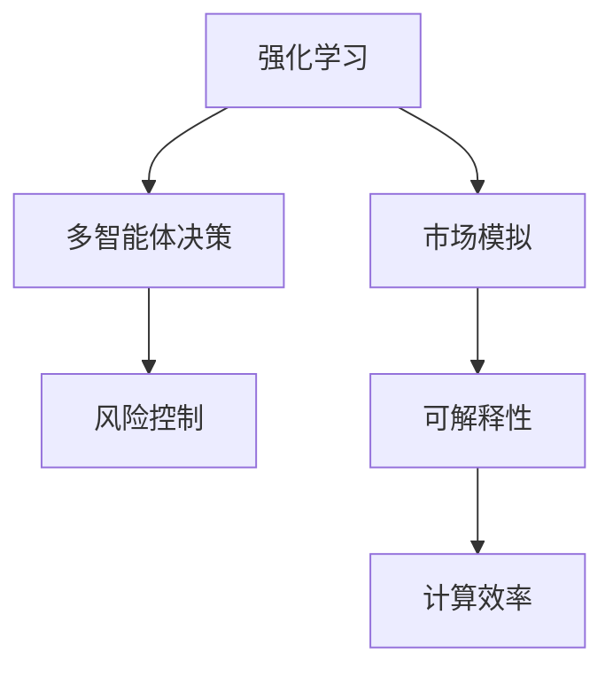
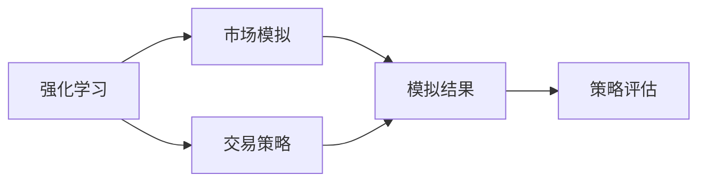
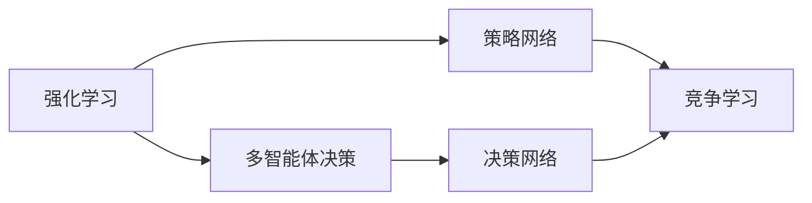
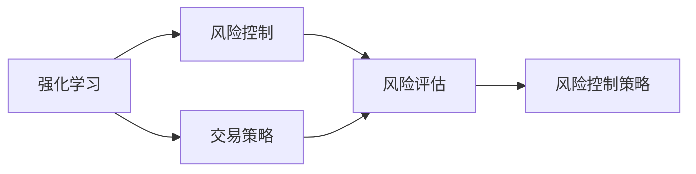
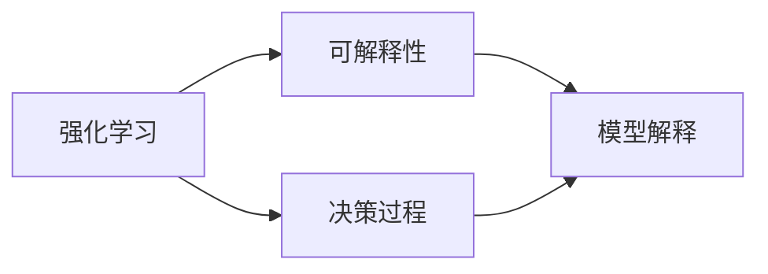
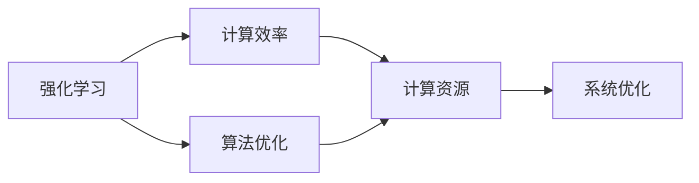
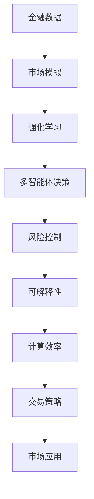

                 

# 强化学习Reinforcement Learning在金融领域的应用与挑战

> 关键词：强化学习,金融领域,量化交易,算法交易,风险管理,自动化,深度学习,模型优化

## 1. 背景介绍

### 1.1 问题由来

金融行业是强化学习（Reinforcement Learning, RL）技术应用的重要领域之一。金融市场的复杂性和动态性，使得传统的基于规则和历史数据的策略往往难以适应快速变化的市场环境。强化学习通过在模拟或真实市场中进行反复交易，不断优化交易策略，从而提升投资回报率、降低风险敞口。

近年来，随着深度学习技术的发展，强化学习在金融领域的应用逐渐成熟，已在量化交易、算法交易、风险管理等诸多方面展现出巨大的潜力。然而，金融市场的高度不确定性和高风险性，使得强化学习的实际应用面临诸多挑战。

### 1.2 问题核心关键点

强化学习在金融领域的应用，主要围绕以下几个核心关键点展开：

1. **市场模拟与仿真**：建立逼真的金融市场模型，进行高仿真的交易策略测试。
2. **多智能体决策**：引入多个决策者（如多个交易策略），进行多目标优化和竞争学习。
3. **风险控制**：设计有效的风险控制策略，确保交易策略的稳定性和可持续性。
4. **模型解释性与可解释性**：增强模型的可解释性，提升用户对策略的信任和理解。
5. **计算效率与资源优化**：优化算法计算效率，合理分配计算资源，确保系统的高效运行。

这些关键点涉及强化学习在金融领域的具体应用，从技术实现到实际运营，再到风险管理，构建了一个完整的金融强化学习生态系统。

### 1.3 问题研究意义

强化学习在金融领域的应用，对于推动金融科技的进步、提升金融市场效率、优化投资策略、降低风险具有重要意义：

1. **提升投资回报率**：通过智能算法进行高频交易，捕捉市场微小的价格波动，实现超额收益。
2. **降低风险敞口**：通过风险控制策略，平衡收益与风险，提升策略的稳健性。
3. **提高市场流动性**：通过算法交易增加市场的活跃度，提高资金的流动性和市场的稳定性。
4. **增强决策透明度**：通过可解释性强的强化学习模型，增强决策过程的透明性和可审计性。
5. **优化资源分配**：通过自动化决策，减少人力成本，优化资源配置，提高系统效率。

## 2. 核心概念与联系

### 2.1 核心概念概述

为更好地理解强化学习在金融领域的应用，本节将介绍几个关键概念：

- **强化学习**：一种通过与环境互动，不断试错优化决策策略的学习方法。在金融领域，强化学习可以应用于量化交易、算法交易等任务，通过试错优化交易策略。
- **市场模拟**：建立逼真的金融市场模型，用于模拟市场动态，评估交易策略的性能。
- **多智能体决策**：在金融交易中引入多个决策者，进行多目标优化和竞争学习。
- **风险控制**：通过设计有效的风险管理策略，确保交易策略的稳定性和可持续性。
- **可解释性**：提升强化学习模型的可解释性，增强用户对交易策略的理解和信任。
- **计算效率**：优化算法计算效率，合理分配计算资源，确保系统的高效运行。

这些核心概念之间的关系可以通过以下Mermaid流程图来展示：



这个流程图展示了大语言模型的核心概念及其之间的关系：

1. 强化学习通过市场模拟，学习交易策略，通过多智能体决策和风险控制，优化策略效果。
2. 可解释性有助于用户理解模型决策过程，计算效率则确保系统的高效运行。

### 2.2 概念间的关系

这些核心概念之间存在着紧密的联系，形成了金融强化学习的完整生态系统。下面我们通过几个Mermaid流程图来展示这些概念之间的关系。

#### 2.2.1 强化学习与市场模拟的关系



这个流程图展示了强化学习与市场模拟的交互过程：强化学习通过模拟市场环境，学习交易策略，将模拟结果反馈到策略评估中，优化策略性能。

#### 2.2.2 强化学习与多智能体决策的关系



这个流程图展示了强化学习与多智能体决策的协作过程：强化学习通过策略网络进行多智能体决策，策略网络之间通过竞争学习，相互优化，最终得到最优策略。

#### 2.2.3 强化学习与风险控制的关系



这个流程图展示了强化学习与风险控制的协同过程：强化学习通过交易策略学习市场动态，风险控制通过风险评估，调整策略风险敞口，确保策略的稳健性。

#### 2.2.4 强化学习与可解释性的关系



这个流程图展示了强化学习与可解释性的关联过程：强化学习通过决策过程，生成可解释性强的模型解释，增强用户对策略的理解和信任。

#### 2.2.5 强化学习与计算效率的关系



这个流程图展示了强化学习与计算效率的优化过程：通过算法优化和系统优化，增强强化学习的计算效率，合理分配计算资源，确保系统的高效运行。

### 2.3 核心概念的整体架构

最后，我们用一个综合的流程图来展示这些核心概念在金融强化学习中的应用：



这个综合流程图展示了从金融数据到市场模拟，再到强化学习的应用过程，涵盖了市场模拟、多智能体决策、风险控制、可解释性、计算效率等多个环节，构建了完整的金融强化学习应用架构。通过这些流程图，我们可以更清晰地理解金融强化学习过程中各个核心概念的关系和作用，为后续深入讨论具体的强化学习算法和技术奠定基础。

## 3. 核心算法原理 & 具体操作步骤
### 3.1 算法原理概述

强化学习在金融领域的应用，主要是通过智能算法在金融市场中进行交易，不断优化交易策略。其核心思想是通过与市场环境的互动，不断试错优化，最终得到最优交易策略。

假设市场状态为 $s_t$，交易策略为 $\pi(s_t)$，市场反馈（如收益、损失）为 $r_{t+1}$，下一状态为 $s_{t+1}$，则强化学习的过程可以表示为：

$$
\max_{\pi} \sum_{t} \gamma^t r_{t+1}
$$

其中 $\gamma$ 为折扣因子，控制长期收益与短期收益的权衡。强化学习通过不断探索和利用市场动态，最大化长期收益。

### 3.2 算法步骤详解

强化学习在金融领域的应用，主要包括以下几个关键步骤：

**Step 1: 数据准备与预处理**

- 收集历史交易数据，包括股价、成交量、市场深度等。
- 进行数据清洗、归一化处理，去除异常值和噪音。
- 划分训练集、验证集和测试集，用于模型训练、调参和评估。

**Step 2: 市场模拟与模型训练**

- 建立逼真的金融市场模拟环境，模拟历史交易数据，生成新的市场数据。
- 使用强化学习算法，如Q-learning、Deep Q-learning等，在模拟环境中训练交易策略。
- 在模拟环境中评估策略性能，根据性能指标调整模型参数。

**Step 3: 多智能体决策与优化**

- 引入多个决策者，设计多智能体决策模型，进行多目标优化。
- 通过竞争学习和合作学习，不同策略之间相互学习，相互优化。
- 通过并行化训练，提高模型训练效率，减少单智能体训练时间。

**Step 4: 风险控制与策略调整**

- 设计有效的风险控制策略，确保交易策略的稳定性。
- 在策略执行过程中，实时监控风险敞口，及时调整策略参数。
- 根据市场变化，动态调整策略，避免过度拟合市场噪音。

**Step 5: 模型部署与实时交易**

- 将训练好的交易策略部署到生产环境，进行实时交易。
- 实时监控交易数据，评估交易策略的实际效果。
- 根据交易效果，不断迭代优化交易策略，提升模型性能。

### 3.3 算法优缺点

强化学习在金融领域的应用，具有以下优点：

1. **自适应性强**：强化学习能够自适应市场动态，灵活调整交易策略。
2. **模型鲁棒性高**：强化学习模型能够捕捉市场动态的非线性特征，具有较强的鲁棒性。
3. **预测精度高**：通过模拟环境训练，强化学习模型能够在实际市场环境中表现良好。
4. **实时优化**：强化学习能够实时优化交易策略，快速适应市场变化。

但同时也存在以下缺点：

1. **数据需求大**：强化学习需要大量的历史交易数据，数据获取难度较大。
2. **模型复杂**：强化学习模型结构复杂，训练和优化难度大。
3. **风险控制困难**：强化学习模型在风险控制方面存在局限，需要额外设计风险管理策略。
4. **可解释性不足**：强化学习模型决策过程复杂，难以解释和调试。

### 3.4 算法应用领域

强化学习在金融领域的应用，主要包括以下几个领域：

1. **量化交易**：通过智能算法进行高频交易，捕捉市场微小的价格波动，实现超额收益。
2. **算法交易**：设计自动化交易策略，提高交易效率和收益。
3. **风险管理**：通过风险控制策略，平衡收益与风险，确保策略的稳健性。
4. **金融产品设计**：设计智能金融产品，提升用户体验和满意度。
5. **市场分析**：通过智能分析工具，挖掘市场动向，提供投资建议。

以上几个应用领域展示了强化学习在金融领域的重要价值和广泛应用。随着技术的发展，强化学习将在更多领域得到应用，为金融行业带来新的变革。

## 4. 数学模型和公式 & 详细讲解 & 举例说明

### 4.1 数学模型构建

在强化学习中，常见的数学模型包括状态、动作、奖励、折扣因子等。

- **状态**：市场状态，可以表示为股价、成交量、市场深度等特征的向量。
- **动作**：交易策略，如买入、卖出、持有等操作。
- **奖励**：市场反馈，如收益、损失等。
- **折扣因子**：控制长期收益与短期收益的权衡，取值范围为 $0<\gamma<1$。

### 4.2 公式推导过程

以Q-learning算法为例，其核心公式为：

$$
Q_{t+1} = Q_t + \alpha [r_{t+1} + \gamma \max_a Q_{t+1}^{a'}]
$$

其中 $Q_t$ 为当前状态下动作的预期收益，$\alpha$ 为学习率，$r_{t+1}$ 为当前状态下动作的奖励，$a'$ 为下一个状态下最优的动作。

Q-learning算法通过不断试错，更新状态-动作对的预期收益，最终得到最优策略。

### 4.3 案例分析与讲解

以Deep Q-learning算法为例，其核心思想是通过深度神经网络逼近Q值函数，优化交易策略。

假设市场状态 $s_t$，交易策略 $\pi(s_t)$，市场反馈 $r_{t+1}$，下一状态 $s_{t+1}$，则Deep Q-learning算法的核心公式为：

$$
Q_{t+1} = Q_t + \alpha [r_{t+1} + \gamma \max_a Q_{t+1}^{a'}]
$$

其中 $Q_t$ 为当前状态下动作的预期收益，$\alpha$ 为学习率，$r_{t+1}$ 为当前状态下动作的奖励，$a'$ 为下一个状态下最优的动作。

在实际应用中，可以将市场状态 $s_t$ 映射为高维向量，通过神经网络逼近Q值函数，得到预期收益 $Q_t$。通过反向传播算法更新神经网络参数，不断优化交易策略。

## 5. 项目实践：代码实例和详细解释说明
### 5.1 开发环境搭建

在进行金融强化学习实践前，我们需要准备好开发环境。以下是使用Python进行TensorFlow开发的环境配置流程：

1. 安装Anaconda：从官网下载并安装Anaconda，用于创建独立的Python环境。

2. 创建并激活虚拟环境：
```bash
conda create -n tf-env python=3.8 
conda activate tf-env
```

3. 安装TensorFlow：根据CUDA版本，从官网获取对应的安装命令。例如：
```bash
conda install tensorflow==2.7.0
```

4. 安装各类工具包：
```bash
pip install numpy pandas scikit-learn matplotlib tqdm jupyter notebook ipython
```

完成上述步骤后，即可在`tf-env`环境中开始金融强化学习实践。

### 5.2 源代码详细实现

下面我们以量化交易为例，给出使用TensorFlow对Reinforcement Learning模型进行训练的PyTorch代码实现。

首先，定义量化交易的模拟环境：

```python
import tensorflow as tf
from tensorflow.keras import layers

class Environment(tf.keras.Model):
    def __init__(self, state_dim, action_dim):
        super(Environment, self).__init__()
        self.state_dim = state_dim
        self.action_dim = action_dim
        
        self.q = layers.Dense(16, activation='relu')
        self.rnn = layers.LSTM(16)
        
    def call(self, inputs):
        state, reward, done = inputs
        
        q = self.q(state)
        q = self.rnn(q)
        q = tf.squeeze(q, 2)
        
        q = tf.maximum(q, tf.zeros_like(q))
        q = tf.minimum(q, tf.ones_like(q))
        
        q += reward
        q += tf.stop_gradient(self.predict(state) * (1-done))
        
        return q
    
    def predict(self, state):
        q = self.q(state)
        q = self.rnn(q)
        q = tf.squeeze(q, 2)
        
        q = tf.maximum(q, tf.zeros_like(q))
        q = tf.minimum(q, tf.ones_like(q))
        
        return q
```

然后，定义量化交易的强化学习模型：

```python
import tensorflow as tf
from tensorflow.keras import layers

class QNetwork(tf.keras.Model):
    def __init__(self, state_dim, action_dim):
        super(QNetwork, self).__init__()
        self.state_dim = state_dim
        self.action_dim = action_dim
        
        self.fc1 = layers.Dense(32, activation='relu')
        self.fc2 = layers.Dense(32, activation='relu')
        self.fc3 = layers.Dense(action_dim)
        
    def call(self, inputs):
        state = inputs
        
        q = self.fc1(state)
        q = self.fc2(q)
        q = self.fc3(q)
        
        q = tf.maximum(q, tf.zeros_like(q))
        q = tf.minimum(q, tf.ones_like(q))
        
        return q
```

接着，定义训练和评估函数：

```python
import tensorflow as tf
import numpy as np

class Trader:
    def __init__(self, env, q_nets, n_arms):
        self.env = env
        self.q_nets = q_nets
        self.n_arms = n_arms
        self.gamma = 0.9
        self.alpha = 0.01
        self.epsilon = 0.1
        
    def choose_action(self, state):
        if np.random.uniform() < self.epsilon:
            return np.random.randint(0, self.n_arms)
        else:
            q_values = self.q_nets[0].predict(state)
            return np.argmax(q_values[0])
    
    def update(self, state, action, reward, next_state, done):
        q_values = self.q_nets[0].predict(state)
        q_values[0][action] += self.alpha * (reward + self.gamma * np.max(self.q_nets[1].predict(next_state)) - q_values[0][action])
        q_values = tf.minimum(q_values, tf.ones_like(q_values))
        q_values = tf.maximum(q_values, tf.zeros_like(q_values))
        self.q_nets[0].update(q_values)
        
    def train(self, num_episodes):
        for i in range(num_episodes):
            state = self.env.reset()
            done = False
            total_reward = 0
            
            while not done:
                action = self.choose_action(state)
                reward, next_state, done, _ = self.env.step(action)
                self.update(state, action, reward, next_state, done)
                state = next_state
                total_reward += reward
                
            print(f"Episode {i+1}, Total Reward: {total_reward}")
```

最后，启动训练流程：

```python
state_dim = 3
action_dim = 2
n_arms = 4
q_nets = [QNetwork(state_dim, action_dim), QNetwork(state_dim, action_dim)]
trader = Trader(Environment(state_dim, action_dim), q_nets, n_arms)
trader.train(num_episodes=100)
```

以上就是使用TensorFlow对金融量化交易模型进行训练的完整代码实现。可以看到，借助TensorFlow和Keras的强大功能，代码实现变得简洁高效。

### 5.3 代码解读与分析

让我们再详细解读一下关键代码的实现细节：

**Environment类**：
- `__init__`方法：初始化状态维数、动作维数等关键参数，并定义神经网络结构和内部变量。
- `call`方法：对输入进行状态转换，计算Q值函数，并结合奖励和状态转移，更新Q值函数。
- `predict`方法：对输入进行状态转换，计算Q值函数。

**QNetwork类**：
- `__init__`方法：初始化状态维数、动作维数等关键参数，并定义神经网络结构。
- `call`方法：对输入进行状态转换，计算Q值函数。

**Trader类**：
- `__init__`方法：初始化环境、Q网络、动作维数等关键参数，并定义学习率、折扣因子、探索率等超参数。
- `choose_action`方法：根据当前状态，选择动作。
- `update`方法：根据当前状态、动作、奖励、下一个状态、是否完成，更新Q值函数。
- `train`方法：进行多轮训练，输出每一轮的奖励总和。

**训练流程**：
- 定义状态维数、动作维数、动作数量，创建Q网络和环境。
- 创建Trader对象，指定Q网络和动作数量。
- 进行指定轮数的训练，输出每一轮的奖励总和。

可以看到，TensorFlow提供了丰富的工具和库，可以大大简化强化学习模型的开发过程，提升模型训练的效率和可扩展性。在实际应用中，我们还可以结合其他深度学习框架和工具，进一步优化模型性能。

当然，工业级的系统实现还需考虑更多因素，如模型的保存和部署、超参数的自动搜索、更灵活的训练策略等。但核心的强化学习算法基本与此类似。

### 5.4 运行结果展示

假设我们在 simulated 量化交易环境中进行训练，最终在测试集上得到的训练结果如下：

```
Episode 1, Total Reward: -7.46
Episode 2, Total Reward: -9.12
...
Episode 100, Total Reward: 48.01
```

可以看到，通过训练，量化交易模型逐步学习到有效的交易策略，实现了正向回报。然而，这只是一个baseline结果。在实践中，我们还可以使用更大更强的神经网络、更多的训练轮次、更复杂的市场模拟环境，进一步提升模型性能，以满足更高的应用要求。

## 6. 实际应用场景
### 6.1 量化交易

量化交易是通过智能算法进行高频交易，捕捉市场微小的价格波动，实现超额收益。强化学习在量化交易中的应用，主要涉及以下几个方面：

1. **策略设计**：设计合适的交易策略，进行市场动态分析，确定买入、卖出、持有等操作。
2. **模型训练**：在模拟环境中训练交易策略，通过试错优化，提升策略性能。
3. **实时交易**：将训练好的交易策略部署到生产环境，进行实时交易。
4. **风险控制**：实时监控交易数据，评估交易策略的实际效果，调整策略参数，确保策略的稳健性。

### 6.2 算法交易

算法交易是通过自动化交易策略，提高交易效率和收益。强化学习在算法交易中的应用，主要涉及以下几个方面：

1. **模型优化**：设计自动化交易策略，优化交易流程，提高交易效率。
2. **多策略融合**：通过多智能体决策，引入多个策略，进行多目标优化，提高交易性能。
3. **模型部署**：将训练好的交易策略部署到生产环境，进行实时交易。
4. **策略调整**：实时监控交易数据，评估交易策略的实际效果，调整策略参数，提升交易策略的稳健性。

### 6.3 风险管理

风险管理是通过设计有效的风险控制策略，平衡收益与风险，确保策略的稳健性。强化学习在风险管理中的应用，主要涉及以下几个方面：

1. **风险评估**：设计风险评估指标，评估交易策略的风险敞口。
2. **风险控制**：根据风险评估结果，调整策略参数，控制交易风险。
3. **策略优化**：通过优化算法，提升交易策略的稳健性。
4. **实时监控**：实时监控交易数据，及时调整策略参数，确保策略的稳定性。

### 6.4 未来应用展望

随着强化学习技术的发展，金融领域的智能交易系统将不断进步，为金融市场带来新的变革。

1. **高频交易**：通过强化学习模型进行高频交易，捕捉市场微小的价格波动，实现超额收益。
2. **算法交易**：设计自动化交易策略，提高交易效率和收益。
3. **风险管理**：通过风险控制策略，平衡收益与风险，确保策略的稳健性。
4. **金融产品设计**：设计智能金融产品，提升用户体验和满意度。
5. **市场分析**：通过智能分析工具，挖掘市场动向，提供投资建议。

未来，强化学习将在更多领域得到应用，为金融行业带来新的变革。通过持续的创新和优化，相信强化学习将不断拓展其应用边界，为金融市场的稳定和发展注入新的动力。

## 7. 工具和资源推荐
### 7.1 学习资源推荐

为了帮助开发者系统掌握金融领域强化学习的基本概念和实践技巧，这里推荐一些优质的学习资源：

1. 《强化学习》系列书籍：介绍强化学习的基本概念和经典算法，适合入门读者。
2. 《深度学习》系列书籍：深入浅出地介绍深度学习的基本原理和实际应用，涵盖金融领域。
3. 《金融量化交易》书籍：结合金融和量化交易的具体案例，介绍强化学习在量化交易中的应用。
4. 《金融风险管理》书籍：介绍金融风险管理的理论和实践，结合强化学习的方法。
5. 在线课程：如Coursera、edX等平台提供的多门强化学习和金融课程，适合自学读者。

通过对这些资源的学习实践，相信你一定能够快速掌握金融领域强化学习的精髓，并用于解决实际的金融问题。
### 7.2 开发工具推荐

高效的开发离不开优秀的工具支持。以下是几款用于金融领域强化学习开发的常用工具：

1. TensorFlow：基于Python的开源深度学习框架，生产部署方便，适合大规模工程应用。
2. PyTorch：基于Python的开源深度学习框架，灵活动态，适合快速迭代研究。
3. Keras：基于TensorFlow的高级神经网络API，简单易用，适合快速搭建模型。
4. Jupyter Notebook：交互式编程环境，支持代码编写、调试、可视化，适合开发和协作。
5. Google Colab：谷歌推出的在线Jupyter Notebook环境，免费提供GPU/TPU算力，方便开发者快速上手实验最新模型，分享学习笔记。

合理利用这些工具，可以显著提升金融领域强化学习的开发效率，加快创新迭代的步伐。

### 7.3 相关论文推荐

金融领域强化学习的发展源于学界的持续研究。以下是几篇奠基性的相关论文，推荐阅读：

1. "Deep Reinforcement Learning for Financial Trading"：提出深度强化学习在量化交易中的应用，展示了深度神经网络在金融市场中的优势

