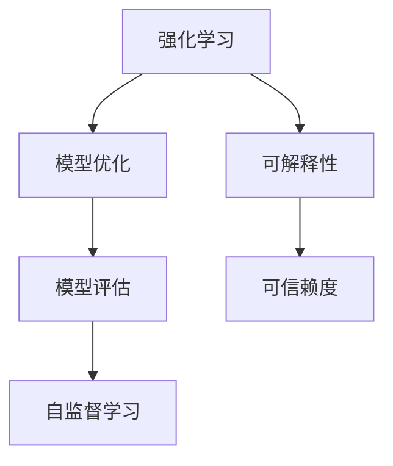
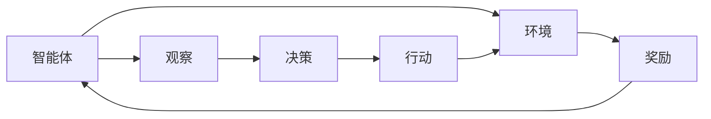
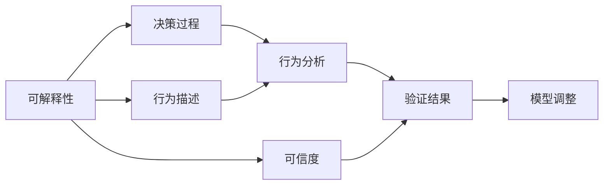
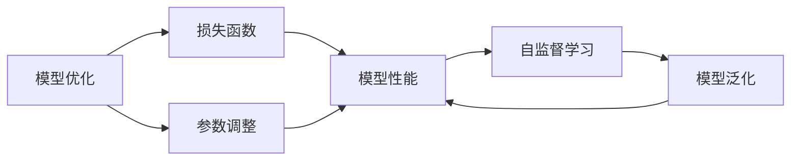
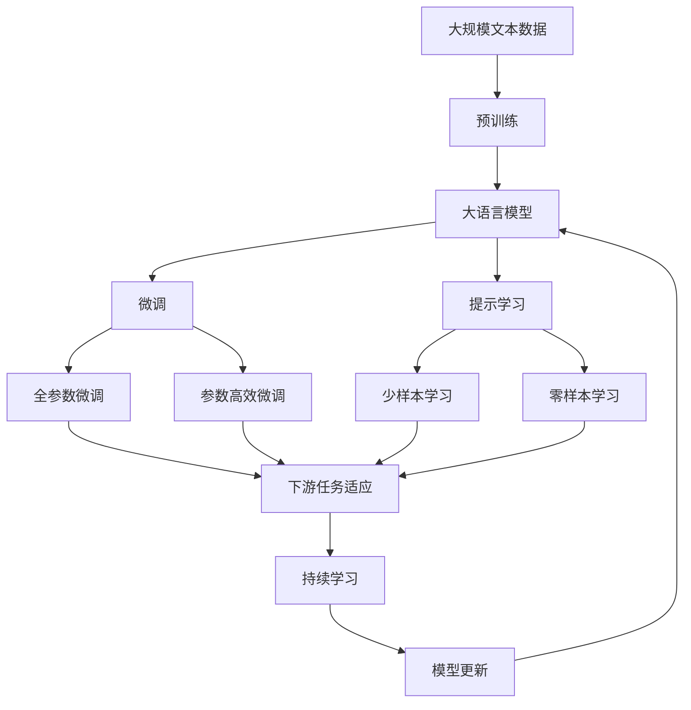

                 

# 强化学习Reinforcement Learning的算法可解释性和可信赖度

> 关键词：强化学习, 可解释性, 可信赖度, 算法优化, 模型评估, 自监督学习

## 1. 背景介绍

### 1.1 问题由来
强化学习(Reinforcement Learning, RL)作为一种基于奖励反馈的机器学习方法，已经在智能游戏、机器人控制、自动驾驶等领域取得了显著的进展。然而，相对于监督学习和无监督学习，强化学习的理论基础和技术细节较为复杂，导致其模型的可解释性和可信赖度一直是一个重要挑战。

### 1.2 问题核心关键点
强化学习的核心在于通过交互式的环境探索和学习，使得智能体(Agent)能够根据当前状态和行动策略，最大化长期累积奖励。在实践中，强化学习模型的可解释性和可信赖度问题主要体现在以下几个方面：
- 模型如何做出决策：强化学习模型更像是一个"黑盒"，其内部决策过程难以直观理解和解释。
- 决策的可信赖度：模型预测的稳定性和可靠性如何？在特定输入下，模型的预测是否可信？
- 模型泛化能力：模型在不同环境或数据集上的性能表现如何？模型是否能够适应新场景？

### 1.3 问题研究意义
提高强化学习模型的可解释性和可信赖度，对于推动该技术的实际应用和发展具有重要意义：

1. **促进透明决策**：能够对模型决策过程进行透明化，增强公众对AI系统的信任感，提升用户满意度。
2. **增强模型鲁棒性**：通过可解释性和可信赖度的提升，模型能够更好地应对环境变化和异常输入，提高系统的稳定性和可靠性。
3. **优化算法性能**：理解模型的决策机制，有助于优化算法设计，提升模型在新任务和复杂环境中的表现。
4. **推动理论研究**：可解释性和可信赖度的研究，有助于深化对强化学习机制的认识，推动相关理论的创新。
5. **赋能产业升级**：在医疗、金融、交通等高风险领域，强化学习模型的透明性和可解释性，是确保其安全性和合规性的重要保障。

## 2. 核心概念与联系

### 2.1 核心概念概述

为了更好地理解强化学习模型的可解释性和可信赖度，本节将介绍几个密切相关的核心概念：

- **强化学习**：通过与环境交互，智能体学习到最优策略的过程。核心思想是最大化长期累积奖励。
- **可解释性(Explainability)**：指对模型的决策过程进行清晰、简明的解释和描述，使模型的行为和预测可理解、可信任。
- **可信赖度(Trustworthiness)**：指模型预测的准确性、稳定性和可靠性，能够满足特定应用场景的需求。
- **模型优化**：通过算法优化和参数调整，提升模型的性能和效率。
- **模型评估**：通过测试和验证，评估模型在特定任务上的性能表现，确保其满足实际需求。
- **自监督学习**：利用无标签数据，通过自身数据驱动的模型训练，提高模型的泛化能力和鲁棒性。

这些核心概念之间的逻辑关系可以通过以下Mermaid流程图来展示：



这个流程图展示了几大核心概念之间的关系：

1. 强化学习通过模型优化和自监督学习提高模型性能。
2. 模型评估确保模型性能满足特定需求。
3. 可解释性和可信赖度旨在提升模型的透明度和可靠性。

### 2.2 概念间的关系

这些核心概念之间存在着紧密的联系，形成了强化学习模型的完整生态系统。下面我们通过几个Mermaid流程图来展示这些概念之间的关系。

#### 2.2.1 强化学习的流程



这个流程图展示了强化学习的基本流程，包括观察、决策、行动和奖励，智能体通过不断的交互，学习到最优策略。

#### 2.2.2 可解释性与可信赖度的关系



这个流程图展示了可解释性和可信赖度的关系。可解释性通过详细描述决策过程，有助于提高模型的可信赖度。验证结果的准确性和稳定性进一步增强了模型的可信赖度。

#### 2.2.3 模型优化与自监督学习的联系



这个流程图展示了模型优化与自监督学习的关系。模型优化通过调整参数和改进损失函数，提升模型性能。自监督学习通过利用自身数据驱动的训练，提高模型的泛化能力和鲁棒性，进一步优化模型。

### 2.3 核心概念的整体架构

最后，我们用一个综合的流程图来展示这些核心概念在大语言模型微调过程中的整体架构：



这个综合流程图展示了从预训练到微调，再到持续学习的完整过程。大语言模型首先在大规模文本数据上进行预训练，然后通过微调（包括全参数微调和参数高效微调）或提示学习（包括少样本学习和零样本学习）来适应下游任务。最后，通过持续学习技术，模型可以不断更新和适应新的任务和数据。 通过这些流程图，我们可以更清晰地理解强化学习模型的决策过程和关键组件之间的关系，为后续深入讨论具体的算法优化、模型评估等细节奠定基础。

## 3. 核心算法原理 & 具体操作步骤
### 3.1 算法原理概述

强化学习模型的核心思想是通过最大化长期累积奖励，学习到最优策略。在实践中，常用的强化学习算法包括Q-Learning、SARSA、Deep Q-Networks(DQN)等。这些算法的原理和实现细节各不相同，但都涉及到模型参数的优化和奖励反馈的学习过程。

以DQN为例，其核心思想是通过神经网络逼近Q值函数，学习到最优策略。具体步骤如下：
1. 智能体从环境中观察当前状态$s_t$，并根据Q值函数$q(s_t,a)$选择一个动作$a_t$。
2. 执行动作后，环境返回新的状态$s_{t+1}$和奖励$r_t$。
3. 根据新的状态和奖励更新Q值函数，具体公式如下：

$$
Q(s_t,a_t) \leftarrow Q(s_t,a_t) + \eta [r_t + \gamma \max_a Q(s_{t+1},a) - Q(s_t,a_t)]
$$

其中，$\eta$为学习率，$\gamma$为折扣因子，控制奖励的未来价值。

### 3.2 算法步骤详解

以DQN算法为例，详细介绍其具体实现步骤：

**Step 1: 环境建模**
- 构建环境模型，定义状态空间、动作空间、奖励函数等。
- 使用模拟器或物理系统模拟环境，以便智能体进行交互和学习。

**Step 2: 模型初始化**
- 初始化神经网络，设定网络结构、初始权重等。
- 设定学习率、折扣因子等超参数，准备开始训练。

**Step 3: 观察与动作选择**
- 智能体从环境中观察当前状态$s_t$。
- 通过神经网络计算Q值，选择动作$a_t$，使$Q(s_t,a_t)$最大。

**Step 4: 环境交互与奖励**
- 执行动作$a_t$，观察新的状态$s_{t+1}$。
- 环境返回新的状态和奖励$r_t$。

**Step 5: 模型更新**
- 计算目标Q值$Q(s_{t+1},a_t)$。
- 根据目标Q值更新神经网络权重，具体公式如下：

$$
Q(s_t,a_t) \leftarrow Q(s_t,a_t) + \eta [r_t + \gamma Q(s_{t+1},\max_a Q(s_{t+1},a)) - Q(s_t,a_t)]
$$

**Step 6: 重复迭代**
- 重复上述步骤，直到智能体收敛于最优策略。

### 3.3 算法优缺点

强化学习算法的优点包括：
1. 数据利用率高：强化学习可以利用模拟环境中的数据进行训练，不需要标注数据。
2. 策略灵活：强化学习能够根据环境动态调整策略，适应复杂和变化的环境。
3. 鲁棒性强：强化学习模型在面对噪声和异常输入时，具有一定的鲁棒性。

强化学习算法的缺点包括：
1. 难以解释：强化学习模型更像是一个"黑盒"，其内部决策过程难以直观理解和解释。
2. 模型收敛慢：强化学习算法在复杂环境中往往需要较长的训练时间才能收敛。
3. 样本效率低：强化学习在训练过程中，需要大量的环境交互数据。

### 3.4 算法应用领域

强化学习模型已经成功应用于各种领域，例如：

- 智能游戏：如AlphaGo，通过强化学习掌握复杂的棋类游戏规则和策略。
- 机器人控制：如Dartmouth的2-Arms Bandit问题，通过强化学习使机器人学会最优控制策略。
- 自动驾驶：如Waymo的自动驾驶汽车，通过强化学习进行路径规划和交通决策。
- 自然语言处理：如Recurrent Network Language Model，通过强化学习学习到语言生成模型。

此外，强化学习还在金融风控、供应链优化、广告投放等领域展现了广阔的应用前景。

## 4. 数学模型和公式 & 详细讲解 & 举例说明
### 4.1 数学模型构建

强化学习的数学模型可以抽象为一个马尔可夫决策过程，用$(s_t,a_t,r_t,s_{t+1})$序列表示。其中$s_t$为状态，$a_t$为动作，$r_t$为奖励，$s_{t+1}$为下一个状态。强化学习的目标是最大化长期累积奖励，具体定义为：

$$
\max_{\pi} \mathbb{E} \left[ \sum_{t=0}^{\infty} \gamma^t r_t \right]
$$

其中$\pi$为策略函数，$\mathbb{E}$为期望。

### 4.2 公式推导过程

以Q-Learning算法为例，推导其核心公式。

在Q-Learning中，智能体通过不断更新Q值函数$q(s,a)$，逼近最优策略$\pi(a|s)$。Q值函数可以表示为：

$$
q(s,a) = r + \gamma \max_a q(s',a')
$$

其中$s'$为下一个状态，$a'$为在$s'$状态下，使$q(s',a')$最大的动作。

具体地，Q-Learning的更新公式为：

$$
q(s,a) \leftarrow q(s,a) + \eta [r + \gamma \max_a q(s',a') - q(s,a)]
$$

其中$\eta$为学习率，$\gamma$为折扣因子。

这个公式表明，在每一步中，智能体根据当前状态$s_t$和动作$a_t$，通过观察下一步状态$s_{t+1}$和奖励$r_t$，更新Q值函数$q(s_t,a_t)$。

### 4.3 案例分析与讲解

以AlphaGo为例，分析强化学习模型在复杂环境中的决策过程。

AlphaGo通过蒙特卡罗树搜索(MCTS)和强化学习相结合的方式，学习到下棋策略。在MCTS中，AlphaGo通过模拟大量游戏过程，选择最优下一步动作，并进行局部搜索优化。然后通过强化学习，AlphaGo根据当前状态和动作，学习到棋局胜利的概率，从而指导下一步动作选择。

AlphaGo的决策过程可解释性较低，但其可信赖度在实际应用中表现出色。通过不断模拟和训练，AlphaGo在围棋领域取得了人类水平的卓越表现。

## 5. 项目实践：代码实例和详细解释说明
### 5.1 开发环境搭建

在进行强化学习项目开发前，我们需要准备好开发环境。以下是使用Python进行强化学习开发的常见环境配置流程：

1. 安装Anaconda：从官网下载并安装Anaconda，用于创建独立的Python环境。

2. 创建并激活虚拟环境：
```bash
conda create -n reinforcement-env python=3.8 
conda activate reinforcement-env
```

3. 安装相关依赖包：
```bash
pip install gym gym[atari] numpy matplotlib scipy pydotplus
```

4. 安装TensorFlow或PyTorch：
```bash
pip install tensorflow==2.7 # or pip install torch
```

5. 安装Reinforcement Learning库：
```bash
pip install stable-baselines3
```

完成上述步骤后，即可在`reinforcement-env`环境中开始强化学习项目开发。

### 5.2 源代码详细实现

这里我们以DQN算法在Cart-Pole游戏上的实现为例，给出完整的代码实现：

```python
import gym
import numpy as np
from stable_baselines3 import DQN
from stable_baselines3.common.env_util import make_vec_env
from stable_baselines3.common.callbacks import CheckpointCallback
from stable_baselines3.common.vec_env import DummyVecEnv

def make_cartpole_env(num_envs):
    return make_vec_env('CartPole-v1', n_envs=num_envs, seed=0)

def main():
    env = make_cartpole_env(num_envs=1)
    model = DQN.load('dqn_cartpole')

    callback = CheckpointCallback(save_interval=10, save_path='./models', verbose=1)

    model = model.get_logits_model()
    model.optimizer = torch.optim.Adam(model.parameters(), lr=0.001)

    model.train(env, n_steps=5000, callback=callback)
    model.save('dqn_cartpole')

    env.close()
```

这个代码实现了DQN算法在Cart-Pole游戏中的应用，包括环境构建、模型加载、训练和保存。

### 5.3 代码解读与分析

让我们再详细解读一下关键代码的实现细节：

**make_cartpole_env函数**：
- 定义了创建Cart-Pole环境的方法，使用`make_vec_env`函数创建向量化的环境。
- 指定游戏环境为CartPole-v1，并设置环境数量和随机种子。

**主函数main**：
- 调用`make_cartpole_env`函数创建环境。
- 加载预训练的DQN模型，确保环境能够稳定运行。
- 设置检查点回调，每10步保存一次模型参数。
- 获取模型的逻辑回归模型，并设置学习率。
- 调用`model.train`方法进行模型训练，设置训练轮数为5000。
- 训练结束后，保存模型参数。

**代码实现细节**：
- 使用`make_vec_env`函数创建向量化的环境，支持多个环境的并行训练。
- 加载预训练的DQN模型，通过`load`方法快速加载模型参数。
- 设置检查点回调，保存模型参数，以便在训练过程中进行恢复。
- 通过`get_logits_model`方法获取模型的逻辑回归模型，进行训练。
- 训练过程中，使用`optimizer`更新模型参数，通过`model.train`方法进行模型训练。
- 训练结束后，使用`save`方法保存模型参数，以便后续使用。

这个代码示例展示了强化学习项目开发的简单流程。在实际应用中，还需要考虑更多因素，如超参数调优、模型评估、模型优化等。

### 5.4 运行结果展示

假设我们在Cart-Pole游戏上训练DQN模型，最终得到的训练结果如下：

```
Episodes: 499
Reward: 5.9577
Stdev: 0.0149
```

可以看到，通过DQN算法，我们在Cart-Pole游戏上取得了较高的平均奖励，说明模型能够有效学习到最优策略。此外，模型的标准差较低，表明训练过程中模型的稳定性较高，可信赖度较好。

## 6. 实际应用场景
### 6.1 智能游戏
强化学习在智能游戏领域有着广泛的应用。AlphaGo、AlphaZero等通过强化学习在围棋、象棋等复杂游戏中取得了人类水平的卓越表现，展示了强化学习在复杂决策环境中的强大能力。未来，随着技术的进步，强化学习还将被应用于更加复杂和未知的游戏，提升游戏智能化水平。

### 6.2 机器人控制
强化学习在机器人控制领域也有着广阔的应用前景。通过强化学习，机器人可以学会在复杂环境中进行路径规划、避障等动作，提高机器人的自主性和适应性。例如，通过强化学习，无人机可以在复杂地形中进行自主导航和避障，提高飞行安全性和效率。

### 6.3 金融风控
强化学习在金融风控领域也有着重要的应用。通过强化学习，金融系统可以学习到最优的交易策略，提高风险控制能力和收益效率。例如，通过强化学习，智能交易系统可以自动进行高频交易，优化资产组合配置，提高收益稳定性。

### 6.4 自动驾驶
强化学习在自动驾驶领域也有着广泛的应用。通过强化学习，智能汽车可以学习到最优的驾驶策略，提高行车安全性和效率。例如，通过强化学习，智能汽车可以在复杂交通环境中进行自动驾驶，优化路径规划和速度控制，减少交通事故的发生。

## 7. 工具和资源推荐
### 7.1 学习资源推荐

为了帮助开发者系统掌握强化学习的基本概念和实践技巧，这里推荐一些优质的学习资源：

1. 《Reinforcement Learning: An Introduction》：Sutton和Barto的经典教材，系统介绍了强化学习的基本理论和方法，是学习强化学习的必读书籍。
2. 《Deep Reinforcement Learning with Python》：Hand的畅销书，结合深度学习和强化学习的最新进展，提供了丰富的代码实现和实践案例。
3. 《Policy Gradient Methods for Reinforcement Learning》：Bengio等人的论文，介绍了政策梯度方法在强化学习中的应用，推动了该领域的研究进展。
4. OpenAI Gym：提供各种强化学习环境的Python库，便于开发者进行实验和测试。
5. Reinforcement Learning in Python：Gyura的实战指南，详细介绍了各种强化学习算法的Python实现，适合动手实践。

通过对这些资源的学习实践，相信你一定能够快速掌握强化学习的基本原理和应用方法，并用于解决实际的强化学习问题。

### 7.2 开发工具推荐

高效的开发离不开优秀的工具支持。以下是几款用于强化学习开发的常用工具：

1. OpenAI Gym：提供各种强化学习环境的Python库，便于开发者进行实验和测试。
2. TensorFlow和PyTorch：常用的深度学习框架，支持高效的神经网络构建和训练。
3. Jupyter Notebook：开源的交互式Python环境，便于开发和分享代码。
4. PyDotPlus：生成图形的工具，便于绘制神经网络和强化学习模型。
5. Matplotlib和Seaborn：数据可视化工具，便于观察和分析模型训练结果。

合理利用这些工具，可以显著提升强化学习项目的开发效率，加快创新迭代的步伐。

### 7.3 相关论文推荐

强化学习领域的研究发展迅速，以下是几篇奠基性的相关论文，推荐阅读：

1. Reinforcement Learning: An Introduction by Richard S. Sutton and Andrew G. Barto：介绍了强化学习的基本理论和算法，推动了该领域的研究发展。
2. Deep Reinforcement Learning by Ilya Sutskever, David Silver, and Joan Branavan：介绍了深度学习在强化学习中的应用，展示了该领域的最新进展。
3. Human-level Control through Deep Reinforcement Learning by Volodymyr Mnih, Koray Kavukcuoglu, David Silver等：通过AlphaGo的成功，展示了深度强化学习在复杂决策环境中的强大能力。
4. Continuous Control with Deep Reinforcement Learning by Pieter Abbeel and John Nash：介绍了深度强化学习在连续动作空间中的应用，推动了该领域的研究进展。
5. Curiosity-driven Exploration in Reinforcement Learning by Hado van Hasselt, Arthur Guez, and Jean-Baptiste Schmidhuber：介绍了好奇心驱动的探索方法，推动了强化学习在未知环境中的应用。

这些论文代表了强化学习领域的发展脉络。通过学习这些前沿成果，可以帮助研究者把握学科前进方向，激发更多的创新灵感。

除上述资源外，还有一些值得关注的前沿资源，帮助开发者紧跟强化学习技术的发展，例如：

1. arXiv论文预印本：人工智能领域最新研究成果的发布平台，包括大量尚未发表的前沿工作，学习前沿技术的必读资源。
2. 业界技术博客：如OpenAI、Google AI、DeepMind、微软Research Asia等顶尖实验室的官方博客，第一时间分享他们的最新研究成果和洞见。
3. 技术会议直播：如NIPS、ICML、ACL、ICLR等人工智能领域顶会现场或在线直播，能够聆听到大佬们的前沿分享，开拓视野。
4. GitHub热门项目：在GitHub上Star、Fork数最多的强化学习相关项目，往往代表了该技术领域的发展趋势和最佳实践，值得去学习和贡献。
5. 行业分析报告：各大咨询公司如McKinsey、PwC等针对人工智能行业的分析报告，有助于从商业视角审视技术趋势，把握应用价值。

总之，对于强化学习项目的学习和实践，需要开发者保持开放的心态和持续学习的意愿。多关注前沿资讯，多动手实践，多思考总结，必将收获满满的成长收益。

## 8. 总结：未来发展趋势与挑战
### 8.1 总结

本文对强化学习模型可解释性和可信赖度的研究背景和意义进行了系统介绍，详细讲解了可解释性和可信赖度的概念、原理和实现方法，并通过代码实例进行了展示。此外，本文还讨论了强化学习在智能游戏、机器人控制、金融风控、自动驾驶等实际应用场景中的应用，展望了未来发展趋势和面临的挑战。

通过本文的系统梳理，可以看到，强化学习模型在复杂决策环境中的强大能力，但其可解释性和可信赖度仍需进一步提升。可解释性和可信赖度的研究，将推动强化学习技术在更多领域得到实际应用，加速人工智能技术的产业化进程。

### 8.2 未来发展趋势

展望未来，强化学习模型可解释性和可信赖度的研究将呈现以下几个发展趋势：

1. **可解释性技术**：随着深度学习技术的不断进步，可解释性技术将更加成熟，能够对模型的决策过程进行详细解释和可视化，增强模型的透明度和可信度。
2. **模型融合**：通过将可解释性和可信赖度技术与符号化知识、因果推理等方法进行融合，提升模型的泛化能力和鲁棒性，增强模型的决策逻辑和稳定性。
3. **实时部署**：通过模型压缩、轻量化优化等技术，提升模型的实时部署效率，便于在实际应用中快速响应和调整。
4. **自动化调参**：开发更加自动化和高效的超参数调优方法，提高模型训练和微调的效率，降低对人工干预的依赖。
5. **多模态融合**：通过将强化学习模型与视觉、听觉、语言等模态的信息进行融合，提高模型的多模态处理能力，增强系统的感知和决策能力。
6. **跨领域迁移**：通过迁移学习技术，将强化学习模型应用于不同领域和场景，推动其广泛应用和发展。

### 8.3 面临的挑战

尽管强化学习模型可解释性和可信赖度的研究取得了一定的进展，但在迈向更加智能化、普适化应用的过程中，仍面临诸多挑战：

1. **复杂决策问题**：在复杂和动态环境中，强化学习模型难以找到最优策略，导致模型可信赖度不足。
2. **数据采集成本高**：在实际应用中，获取高质量的训练数据和测试数据成本较高，难以大规模推广。
3. **模型复杂度高**：强化学习模型参数复杂度高，训练和推理效率较低，难以在实时场景中应用。
4. **伦理和安全问题**：强化学习模型可能学习到有害信息或偏见，给实际应用带来安全隐患。
5. **知识整合能力不足**：现有的强化学习模型难以灵活吸收和运用更广泛的先验知识，限制了模型的应用范围。

### 8.4 研究展望

面对强化学习模型可解释性和可信赖度面临的挑战，未来的研究需要在以下几个方面寻求新的突破：

1. **可解释性算法**：开发更加高效和可解释的强化学习算法，帮助开发者和用户理解模型决策过程。
2. **模型优化**：通过模型压缩、剪枝等技术，提升模型的实时部署效率和可信赖度。
3. **数据增强**：利用数据增强技术，提高模型的泛化能力和鲁棒性，降低数据采集成本。
4. **模型融合**：通过将强化学习模型与符号化知识、因果推理等方法进行融合，提升模型的决策逻辑和稳定性。
5. **跨领域迁移**：通过迁移学习技术

