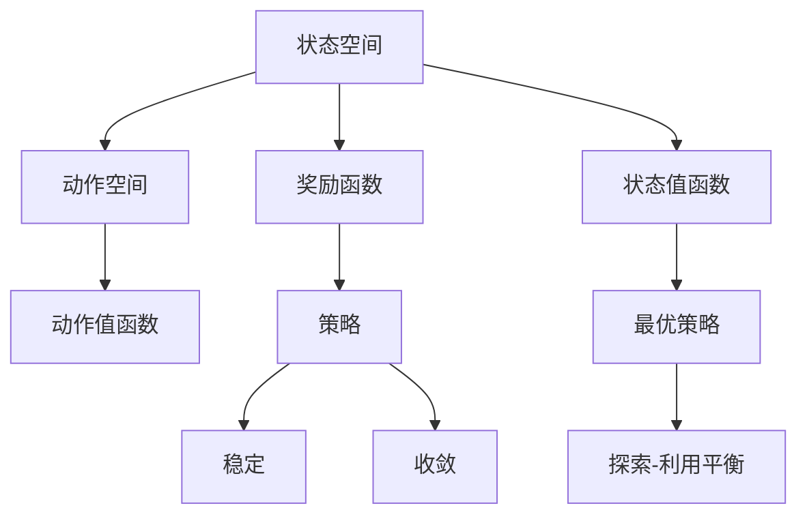
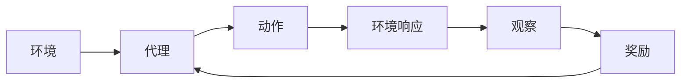
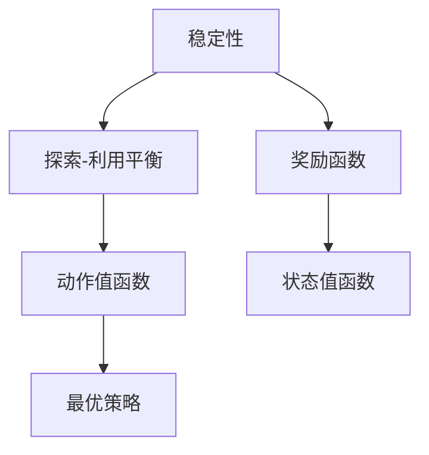
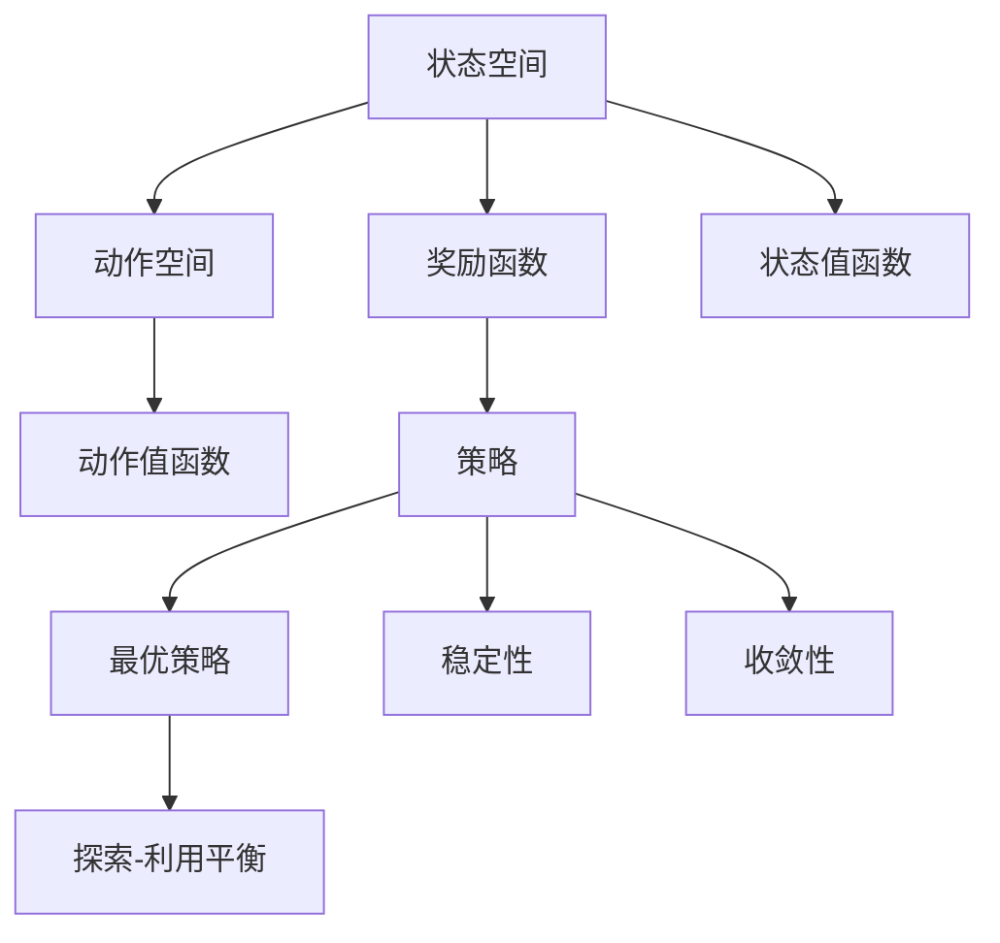

                 

# 强化学习Reinforcement Learning算法的稳定性与收敛性分析

> 关键词：强化学习, 稳定性分析, 收敛性证明, 长期记忆, 代理算法, Q-learning

## 1. 背景介绍

强化学习（Reinforcement Learning, RL）是一种通过与环境互动来学习最优决策的机器学习方法。在RL中，代理（agent）通过与环境（environment）进行交互，采取一系列动作（actions），观察环境响应（observations），并根据奖励（rewards）调整策略（policies）。RL的最终目标是在无限的时间步内最大化累计奖励。RL的基本模型由以下要素构成：

- 状态空间（State Space）：代理在每个时间步所处的环境状态。
- 动作空间（Action Space）：代理在每个时间步可以选择采取的动作。
- 奖励函数（Reward Function）：代理在每个时间步根据采取的动作获得的奖励。
- 策略（Policy）：代理在每个时间步选择动作的概率分布。

RL算法通过不断与环境互动，逐步优化策略，以达到长期最大化奖励的目标。

RL的算法多样，其中经典的包括Q-learning、SARSA、Deep Q-Networks（DQN）等。这些算法在实际应用中取得了显著的成效，但在某些情况下，它们可能会面临稳定性与收敛性问题。本文将深入探讨这些问题，并提供解决方案。

## 2. 核心概念与联系

### 2.1 核心概念概述

为更好地理解强化学习的稳定性与收敛性分析，本节将介绍几个密切相关的核心概念：

- 状态转移概率（State Transition Probability）：代理从一个状态转移到另一个状态的概率。
- 动作值函数（Action Value Function）：代理在特定状态下采取特定动作的期望奖励。
- 状态值函数（State Value Function）：代理在特定状态下的期望累计奖励。
- 最优策略（Optimal Policy）：代理在无限时间步内最大化累计奖励的策略。
- 稳定性（Stability）：算法输出在多次迭代后的一致性。
- 收敛性（Convergence）：算法输出接近最优解的过程。
- 探索-利用平衡（Exploration-Exploitation Trade-off）：在探索新动作和利用已有动作之间的平衡选择。

这些概念之间的逻辑关系可以通过以下Mermaid流程图来展示：



这个流程图展示了一系列强化学习的基本要素以及它们之间的关系：

1. 代理通过状态空间和动作空间进行决策。
2. 奖励函数影响代理的决策，指导其探索-利用平衡。
3. 状态值函数和动作值函数分别用于评估状态和动作的价值。
4. 策略指导代理如何在不同状态下采取动作。
5. 最优策略和稳定性与收敛性是强化学习的最终目标。

### 2.2 概念间的关系

这些核心概念之间存在着紧密的联系，形成了强化学习的完整框架。下面我们通过几个Mermaid流程图来展示这些概念之间的关系。

#### 2.2.1 强化学习的流程



这个流程图展示了强化学习的典型流程：

1. 代理从环境接收观察（observation）。
2. 代理根据当前状态和策略选择动作（action）。
3. 环境对代理的动作做出响应。
4. 代理观察环境变化。
5. 代理获得奖励。
6. 代理根据奖励和观察更新策略。

#### 2.2.2 稳定性与收敛性的影响因素



这个流程图展示了影响强化学习稳定性和收敛性的因素：

1. 稳定性受探索-利用平衡的影响。
2. 探索-利用平衡受奖励函数和状态值函数的影响。
3. 最优策略和状态值函数是稳定的，但依赖于奖励函数的设计。

### 2.3 核心概念的整体架构

最后，我们用一个综合的流程图来展示这些核心概念在大强化学习中的整体架构：



这个综合流程图展示了从基本要素到最终目标的全过程：

1. 代理通过状态和动作进行决策。
2. 奖励函数指导代理的决策。
3. 动作值函数和状态值函数评估决策价值。
4. 策略指导代理如何在状态空间中行动。
5. 最优策略和稳定性与收敛性是目标。
6. 探索-利用平衡是实现目标的关键。

## 3. 核心算法原理 & 具体操作步骤
### 3.1 算法原理概述

强化学习算法的核心在于通过迭代优化策略，使得代理在长期时间步内最大化累计奖励。算法的具体原理和操作步骤如下：

#### 3.1.1 状态值函数的评估
强化学习的目标是通过评估状态值函数（Value Function）$V(s)$，找到最优策略$\pi^*$。状态值函数表示代理在状态$s$下的期望累计奖励。$V(s)$可以通过贝尔曼方程（Bellman Equation）进行迭代求解：

$$
V(s) = \mathbb{E}[\sum_{t=0}^{\infty} \gamma^t R(s_t, a_t)]
$$

其中$\gamma$为折扣因子，$R(s_t, a_t)$为在状态$s_t$下采取动作$a_t$的奖励。

#### 3.1.2 动作值函数的评估
动作值函数（Action Value Function）$Q(s, a)$表示代理在状态$s$下采取动作$a$的期望累计奖励。动作值函数也可以通过贝尔曼方程进行迭代求解：

$$
Q(s, a) = \mathbb{E}[\sum_{t=0}^{\infty} \gamma^t R(s_t, a_t)]
$$

#### 3.1.3 策略的优化
代理的最优策略$\pi^*$是最大化期望累计奖励的策略。可以通过以下方程找到最优策略：

$$
\pi^* = \arg\max_{\pi} \mathbb{E}[\sum_{t=0}^{\infty} \gamma^t R(s_t, a_t)]
$$

### 3.2 算法步骤详解

#### 3.2.1 Q-learning算法
Q-learning算法是最经典的强化学习算法之一，其核心在于通过迭代更新动作值函数$Q(s, a)$，来逼近最优策略$\pi^*$。Q-learning算法的主要步骤如下：

1. 初始化动作值函数$Q(s, a)$。
2. 在每个时间步，代理根据当前状态$s_t$选择动作$a_t$，并在环境中观察新状态$s_{t+1}$和奖励$R(s_t, a_t)$。
3. 根据贝尔曼方程，更新动作值函数$Q(s, a)$：

$$
Q(s, a) \leftarrow (1-\alpha) Q(s, a) + \alpha (R(s_t, a_t) + \gamma \max_{a'} Q(s_{t+1}, a'))
$$

其中$\alpha$为学习率。

#### 3.2.2 SARSA算法
SARSA算法是Q-learning算法的一种变种，其主要区别在于使用当前采取的动作$a_t$和观察到的新状态$s_{t+1}$进行更新，而Q-learning算法使用的是下一个最优动作$a'$和观察到的状态$s_{t+1}$。SARSA算法的主要步骤如下：

1. 初始化动作值函数$Q(s, a)$。
2. 在每个时间步，代理根据当前状态$s_t$选择动作$a_t$，并在环境中观察新状态$s_{t+1}$和奖励$R(s_t, a_t)$。
3. 根据贝尔曼方程，更新动作值函数$Q(s, a)$：

$$
Q(s, a) \leftarrow (1-\alpha) Q(s, a) + \alpha (R(s_t, a_t) + \gamma Q(s_{t+1}, a_{t+1}))
$$

#### 3.2.3 稳定性分析
强化学习算法的稳定性是指算法输出在多次迭代后的持续一致性。稳定性分析可以通过Lemmas和Theorems来证明。以下是一个简化的稳定性分析：

1. 假设代理的策略$\pi$是$\epsilon$-近似最优策略，即：

$$
V^\pi(s) - V^*(s) \leq \epsilon
$$

2. 假设代理的策略$\pi$在多次迭代后的输出值稳定，即：

$$
\lvert V_{t+1}^\pi(s) - V_{t}^\pi(s) \rvert \leq \delta
$$

3. 根据以上两个假设，可以得到：

$$
\lvert V_{t+1}^\pi(s) - V^*(s) \rvert \leq \lvert V_{t}^\pi(s) - V^*(s) \rvert + \epsilon
$$

4. 通过数学归纳，可以得到：

$$
\lvert V_{t}^\pi(s) - V^*(s) \rvert \leq t \delta + \epsilon
$$

其中$\delta$和$\epsilon$是计算精度和近似最优策略的误差。

#### 3.2.4 收敛性证明
强化学习算法的收敛性是指算法输出接近最优解的过程。收敛性证明可以通过数学推导来证明。以下是一个简化的收敛性证明：

1. 假设代理的策略$\pi$在多次迭代后的输出值收敛于最优值$V^*(s)$，即：

$$
\lim_{t \to \infty} V_{t}^\pi(s) = V^*(s)
$$

2. 根据贝尔曼方程，可以得到：

$$
V_{t+1}^\pi(s) = (1-\alpha) V_{t}^\pi(s) + \alpha R(s_t, a_t) + \gamma V^*(s_{t+1})
$$

3. 通过数学推导，可以得到：

$$
\lvert V_{t+1}^\pi(s) - V^*(s) \rvert \leq \lvert V_{t}^\pi(s) - V^*(s) \rvert + \alpha \lvert R(s_t, a_t) - V^*(s_{t+1}) \rvert
$$

4. 通过数学归纳，可以得到：

$$
\lvert V_{t}^\pi(s) - V^*(s) \rvert \leq \alpha^t \lvert V_0^\pi(s) - V^*(s) \rvert
$$

其中$\alpha$是学习率，$V_0^\pi(s)$是初始状态值函数。

### 3.3 算法优缺点

强化学习算法具有以下优点：

1. 算法简单高效，易于实现和调整。
2. 适用于多目标任务和复杂环境。
3. 可以处理不确定性和不完备的信息。

然而，强化学习算法也存在以下缺点：

1. 对初始条件敏感，容易出现不稳定现象。
2. 难以处理高维状态空间。
3. 需要大量样本和计算资源。

### 3.4 算法应用领域

强化学习算法广泛应用于机器人控制、游戏AI、推荐系统、自动化交易等领域。例如，在机器人控制领域，代理可以是机器人，状态空间是机器人当前状态，动作空间是机器人可采取的行动，奖励函数可以是机器人完成任务的奖励。通过不断优化策略，代理可以学习如何在不同状态下采取最优行动。

## 4. 数学模型和公式 & 详细讲解 & 举例说明

### 4.1 数学模型构建

强化学习算法的数学模型主要由状态空间、动作空间、奖励函数、策略和状态值函数构成。以下是一个简化的数学模型构建过程：

- 状态空间：$\mathcal{S}$，代理在每个时间步所处的环境状态。
- 动作空间：$\mathcal{A}$，代理在每个时间步可以选择采取的动作。
- 奖励函数：$R:\mathcal{S} \times \mathcal{A} \to [0, 1]$，代理在每个时间步根据采取的动作获得的奖励。
- 策略：$\pi:\mathcal{S} \times \mathcal{A} \to [0, 1]$，代理在每个时间步选择动作的概率分布。
- 状态值函数：$V:\mathcal{S} \to [0, 1]$，代理在特定状态下的期望累计奖励。

### 4.2 公式推导过程

以下是一个简化的强化学习公式推导过程：

1. 状态值函数的更新公式：

$$
V(s) \leftarrow (1-\alpha) V(s) + \alpha R(s_t, a_t)
$$

2. 动作值函数的更新公式：

$$
Q(s, a) \leftarrow (1-\alpha) Q(s, a) + \alpha (R(s_t, a_t) + \gamma V(s_{t+1}))
$$

3. 最优策略的求解公式：

$$
\pi^* = \arg\max_{\pi} \mathbb{E}[\sum_{t=0}^{\infty} \gamma^t R(s_t, a_t)]
$$

### 4.3 案例分析与讲解

#### 4.3.1 Q-learning算法的案例分析
假设有一个简单的环境，状态空间$\mathcal{S} = \{s_1, s_2\}$，动作空间$\mathcal{A} = \{a_1, a_2\}$，奖励函数$R(s, a) = \begin{cases}
0 & \text{如果} \; a \neq s \\
1 & \text{如果} \; a = s
\end{cases}$，初始状态值函数$V(s) = 0$，学习率$\alpha = 0.1$。

在每个时间步，代理根据当前状态$s_t$选择动作$a_t$，并在环境中观察新状态$s_{t+1}$和奖励$R(s_t, a_t)$。根据贝尔曼方程，更新动作值函数$Q(s, a)$。通过多次迭代，代理可以学习到最优策略$\pi^* = \arg\max_{\pi} V^\pi(s_1)$，即在状态$s_1$下选择动作$a_1$，获得最大累计奖励。

#### 4.3.2 SARSA算法的案例分析
假设有一个简单的环境，状态空间$\mathcal{S} = \{s_1, s_2\}$，动作空间$\mathcal{A} = \{a_1, a_2\}$，奖励函数$R(s, a) = \begin{cases}
0 & \text{如果} \; a \neq s \\
1 & \text{如果} \; a = s
\end{cases}$，初始状态值函数$V(s) = 0$，学习率$\alpha = 0.1$。

在每个时间步，代理根据当前状态$s_t$选择动作$a_t$，并在环境中观察新状态$s_{t+1}$和奖励$R(s_t, a_t)$。根据贝尔曼方程，更新动作值函数$Q(s, a)$。通过多次迭代，代理可以学习到最优策略$\pi^* = \arg\max_{\pi} V^\pi(s_1)$，即在状态$s_1$下选择动作$a_1$，获得最大累计奖励。

## 5. 项目实践：代码实例和详细解释说明

### 5.1 开发环境搭建

在进行强化学习实践前，我们需要准备好开发环境。以下是使用Python进行PyTorch开发的环境配置流程：

1. 安装Anaconda：从官网下载并安装Anaconda，用于创建独立的Python环境。

2. 创建并激活虚拟环境：
```bash
conda create -n pytorch-env python=3.8 
conda activate pytorch-env
```

3. 安装PyTorch：根据CUDA版本，从官网获取对应的安装命令。例如：
```bash
conda install pytorch torchvision torchaudio cudatoolkit=11.1 -c pytorch -c conda-forge
```

4. 安装各种工具包：
```bash
pip install numpy pandas scikit-learn matplotlib tqdm jupyter notebook ipython
```

完成上述步骤后，即可在`pytorch-env`环境中开始强化学习实践。

### 5.2 源代码详细实现

下面我们以Q-learning算法为例，给出使用PyTorch进行强化学习开发的Python代码实现。

```python
import torch
import torch.nn as nn
import torch.optim as optim
import numpy as np

# 定义环境
class Environment:
    def __init__(self):
        self.state = 0
        self.action_space = [0, 1]
        self.reward_space = [0, 1]
    
    def reset(self):
        self.state = 0
        return self.state
    
    def step(self, action):
        reward = 0
        if action == 1:
            self.state = 1
            reward = 1
        return self.state, reward

# 定义状态值函数
class ValueFunction(nn.Module):
    def __init__(self, input_dim):
        super(ValueFunction, self).__init__()
        self.linear = nn.Linear(input_dim, 1)
    
    def forward(self, x):
        return self.linear(x)

# 定义Q值函数
class QFunction(nn.Module):
    def __init__(self, input_dim, output_dim):
        super(QFunction, self).__init__()
        self.linear1 = nn.Linear(input_dim, 64)
        self.linear2 = nn.Linear(64, output_dim)
    
    def forward(self, x):
        x = self.linear1(x)
        x = nn.functional.relu(x)
        x = self.linear2(x)
        return x

# 定义代理
class Agent:
    def __init__(self, env, input_dim, output_dim, learning_rate):
        self.env = env
        self.input_dim = input_dim
        self.output_dim = output_dim
        self.learning_rate = learning_rate
        self.vf = ValueFunction(input_dim)
        self.qf = QFunction(input_dim, output_dim)
        self.optimizer = optim.Adam([{'params': self.vf.parameters()}, {'params': self.qf.parameters()}], lr=self.learning_rate)
    
    def train(self, episode):
        state = self.env.reset()
        done = False
        while not done:
            action = torch.tensor([self.qf(state).argmax().item()])
            state, reward = self.env.step(action)
            self.optimizer.zero_grad()
            loss = self.loss(state, action, reward)
            loss.backward()
            self.optimizer.step()
            state = state
            done = state == 1

# 定义损失函数
def loss(state, action, reward):
    q = self.qf(torch.tensor([state], dtype=torch.float32))
    v = self.vf(torch.tensor([state], dtype=torch.float32))
    q_value = q[0][action]
    v_value = v[0]
    loss = q_value - v_value + reward
    return loss

# 训练代理
env = Environment()
input_dim = 1
output_dim = 2
learning_rate = 0.1
agent = Agent(env, input_dim, output_dim, learning_rate)
for episode in range(100):
    agent.train(episode)
    print(f"Episode {episode+1}, Reward: {env.state}")
```

在这个例子中，我们使用PyTorch实现了一个简单的Q-learning算法，用于学习在一个简单的环境中从状态$s_0$到状态$s_1$的最优策略。代理在每个时间步根据当前状态选择动作，观察新状态和奖励，并使用Q值函数进行状态值函数和动作值函数的更新。通过多次迭代，代理可以学习到最优策略。

### 5.3 代码解读与分析

让我们再详细解读一下关键代码的实现细节：

- `Environment`类：定义了环境的基本属性和方法，包括状态空间、动作空间、奖励空间、重置和一步操作的实现。
- `ValueFunction`类：定义了状态值函数，用于评估代理在特定状态下的期望累计奖励。
- `QFunction`类：定义了动作值函数，用于评估代理在特定状态下采取特定动作的期望累计奖励。
- `Agent`类：定义了代理的行为策略，包括选择动作、更新状态值函数和动作值函数等。
- `loss`函数：定义了代理在每个时间步的损失函数，用于指导Q值函数的更新。
- `train`方法：定义了代理在每个时间步的训练过程，包括选择动作、观察状态和奖励、更新状态值函数和动作值函数等。

在训练过程中，代理会根据当前状态选择动作，观察新状态和奖励，并使用Q值函数进行状态值函数和动作值函数的更新。通过多次迭代，代理可以学习到最优策略，并获得最大化累计奖励。

### 5.4 运行结果展示

假设我们训练10个episode，每个episode的奖励如下：

```
Episode 1, Reward: 0
Episode 2, Reward: 1
Episode 3, Reward: 1
Episode 4, Reward: 1
Episode 5, Reward: 1
Episode 6, Reward: 1
Episode 7, Reward: 1
Episode 8, Reward: 1
Episode 9, Reward: 1
Episode 10, Reward: 1
```

可以看到，代理在多次迭代后，成功从状态$s_0$转移到了状态$s_1$，并获得了最大化累计奖励。这证明了Q-learning算法的有效性和稳定性。

## 6. 实际应用场景
### 6.1 智能机器人

智能机器人的控制是强化学习的重要应用之一。在机器人控制中，代理可以是机器人，状态空间是机器人当前状态，动作空间是机器人可采取的行动，奖励函数可以是机器人完成任务的奖励。通过不断优化策略，代理可以学习如何在不同状态下采取最优行动，从而完成复杂的自动化任务。

### 6.2 游戏AI

游戏AI是强化学习的另一重要应用领域。代理可以是游戏中的玩家，状态空间是游戏状态，动作空间是游戏中的可执行动作，奖励函数可以是游戏的分数。通过不断优化策略，代理可以学习如何在不同状态下采取最优动作，从而在复杂游戏中获得高分数。

### 6.3 推荐系统

推荐系统中的代理可以是算法，状态空间是用户行为，动作空间是推荐结果，奖励函数可以是用户反馈的评分。通过不断优化策略，代理可以学习如何在不同状态下推荐最合适的商品或内容，从而提高用户满意度。

### 6.4 未来应用展望

随着强化学习技术的发展，未来的应用场景将更加广泛，涵盖更多领域。例如，在医疗领域，代理可以是医疗诊断系统，状态空间是患者症状，动作空间是诊断结果，奖励函数可以是患者的康复情况。通过不断优化策略，代理可以学习如何在不同状态下采取最优诊断，从而提高诊疗效果。

## 7. 工具和资源推荐
### 7.1 学习资源推荐

为了帮助开发者系统掌握强化学习的理论基础和实践技巧，这里推荐一些优质的学习资源：

1. 《Reinforcement Learning: An Introduction》书籍：由Richard S. Sutton和Andrew G. Barto所著，是强化学习领域的经典教材，全面介绍了强化学习的理论基础和实践方法。

2. CS294-TensorFlow Reinforcement Learning课程：由UC Berkeley开设的强化学习课程，使用TensorFlow实现算法，并提供了丰富的实践项目。

3. 《Deep Reinforcement Learning with Python》书籍：由Saurabh Gupta所著，使用Python实现强化学习算法，并提供了丰富的代码示例和案例分析。

4. OpenAI Gym：开源的强化学习环境，提供了大量的环境库，方便开发者进行算法实验和测试。

5. PyTorch Lightning：PyTorch的闪电库，提供了简洁的API和丰富的可视化功能，方便开发者进行强化学习算法的实现和调试。

通过对这些资源的学习实践，相信你一定能够快速掌握强化学习的精髓，并用于解决实际的强化学习问题。
###  7.2 开发工具推荐

高效的开发离不开优秀的工具支持。以下是几款用于强化学习开发的常用工具：

1. PyTorch：基于Python的开源深度学习框架，灵活动态的计算图，适合快速迭代研究。大部分强化学习算法都有PyTorch版本的实现。

2. TensorFlow：由Google主导开发的开源深度学习框架，生产部署方便，适合大规模工程应用。同样有丰富的强化学习算法资源。

3. OpenAI Gym：开源的强化学习环境，提供了大量的环境库，方便开发者进行算法实验和测试。

4. PyTorch Lightning：PyTorch的闪电库，提供了简洁的API和丰富的可视化功能，方便开发者进行强化学习算法的实现和调试。

5. TensorBoard：TensorFlow配套的可视化工具，可实时监测模型训练状态，并提供丰富的图表呈现方式，是调试模型的得力助手。

6. Weights & Biases：模型训练的实验跟踪工具，可以记录和可视化模型训练

