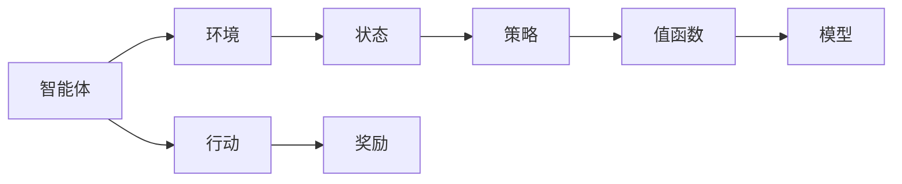
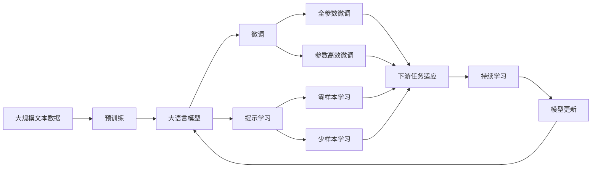

                 

# 强化学习原理与代码实例讲解

> 关键词：强化学习, 代码实例, 算法原理, 数学模型, 实际应用, 未来展望

## 1. 背景介绍

### 1.1 问题由来

强化学习(Reinforcement Learning, RL)是一种通过智能体与环境的交互，优化行为策略以实现长期奖励最大化的学习范式。它与监督学习和无监督学习不同，强化学习侧重于模型通过不断的试错，学习到最优的决策策略。

强化学习的背景可以追溯到20世纪50年代，那时它是认知心理学的一个重要分支。然而，由于缺乏有效计算手段，该领域的进展一直受限。直到20世纪80年代，神经网络和深度学习技术的兴起，特别是Q-learning等模型的提出，才使得强化学习得以重获新生。

近年来，随着计算能力的提升和深度学习技术的发展，强化学习在自动驾驶、机器人控制、游戏AI等领域取得了突破性进展，成为人工智能研究中的热门方向。与此同时，基于强化学习的推荐系统、金融决策系统等应用也层出不穷，展示了其在实际问题解决中的强大潜力。

### 1.2 问题核心关键点

强化学习的问题核心关键点包括：
- **智能体(Agent)**：通过一系列策略与环境交互的自主决策系统。
- **环境(Environment)**：智能体所处的外部世界，通常由环境状态、行动空间、奖励函数等组成。
- **状态(State)**：环境中的特定情形或配置，智能体通过状态来感知环境。
- **行动(Action)**：智能体对环境可采取的行为。
- **奖励(Reward)**：智能体在每个状态下选择行动后获得的即时反馈，指导其行为选择。
- **策略(Policy)**：智能体决策的映射规则，即在给定状态下选择行动的概率分布。

强化学习通过模型构建策略，以最大化长期奖励为目标，不断调整策略以适应复杂多变的环境。

### 1.3 问题研究意义

强化学习的广泛应用和成功案例，证明了其在复杂决策环境中的优越性。相比于传统的监督学习和无监督学习，强化学习能更好地处理不确定性和动态变化的环境，具有较强的泛化能力和自适应能力。

研究强化学习有助于深入理解智能决策过程，推动人工智能技术向更高层次的发展。通过强化学习，可以构建更为自主、智能的系统，为各行各业带来革命性的变革。

## 2. 核心概念与联系

### 2.1 核心概念概述

为更好地理解强化学习，本节将介绍几个密切相关的核心概念：

- **智能体(Agent)**：与环境交互，基于策略执行动作的主体。
- **环境(Environment)**：智能体活动的外部世界，具有状态和行动空间。
- **状态(State)**：描述环境当前状态的特征向量，智能体通过观察获取。
- **行动(Action)**：智能体可采取的具体行为，可以是离散的也可以是连续的。
- **奖励(Reward)**：智能体在每个状态下选择行动后获得的即时反馈，指导其行为选择。
- **策略(Policy)**：智能体决策的映射规则，即在给定状态下选择行动的概率分布。
- **值函数(Value Function)**：估计特定状态下的预期总奖励，指导智能体如何选择动作。
- **模型(Model)**：环境的动态模型，用于预测未来状态和奖励。

这些核心概念构成了强化学习的基本框架，智能体通过与环境的交互，优化策略以实现最大化长期奖励。

### 2.2 概念间的关系

这些核心概念之间存在着紧密的联系，形成了强化学习的完整生态系统。下面我通过几个Mermaid流程图来展示这些概念之间的关系：



这个流程图展示了大模型微调过程中各个核心概念的关系：

1. 智能体通过感知环境状态，选择行动。
2. 行动后环境会变化，智能体获得即时奖励。
3. 智能体根据策略指导行动选择。
4. 策略依赖于值函数，指导智能体选择最优行动。
5. 值函数基于模型，估计未来状态和奖励。

这些概念共同构成了强化学习的学习和应用框架，使其能够在各种场景下发挥强大的决策能力。

### 2.3 核心概念的整体架构

最后，我们用一个综合的流程图来展示这些核心概念在大语言模型微调过程中的整体架构：



这个综合流程图展示了从预训练到微调，再到持续学习的完整过程。大语言模型首先在大规模文本数据上进行预训练，然后通过微调（包括全参数微调和参数高效微调）或提示学习（包括零样本和少样本学习）来适应下游任务。最后，通过持续学习技术，模型可以不断学习新知识，同时避免遗忘旧知识。

## 3. 核心算法原理 & 具体操作步骤
### 3.1 算法原理概述

强化学习的核心思想是通过智能体与环境的交互，学习最优决策策略。智能体通过观察环境状态，选择行动，获得奖励，不断优化策略以最大化长期奖励。

形式化地，设智能体在状态 $s_t$ 时，采取行动 $a_t$，环境状态变化到 $s_{t+1}$，获得奖励 $r_{t+1}$，策略为 $\pi(a_t|s_t)$，值函数为 $V(s_t)$ 和 $Q(s_t, a_t)$，则强化学习的过程可以描述为：

$$
\max_\pi \sum_{t=0}^{\infty}\gamma^t r_{t+1}
$$

其中 $\gamma$ 为折扣因子，表示未来奖励的权重。目标是最小化与最优策略 $\pi^*$ 的策略差值，即：

$$
\min_\pi \mathbb{E} \left[\sum_{t=0}^{\infty}\gamma^t r_{t+1} \right]
$$

### 3.2 算法步骤详解

强化学习的算法步骤主要包括以下几个关键步骤：

**Step 1: 定义环境与模型**

定义环境，包括状态空间 $S$、行动空间 $A$ 和奖励函数 $R$。通常通过仿真器或真实世界数据获取。

定义模型，用于预测未来状态和奖励，可以是基于模型的学习（Model-Based RL），也可以是模型无关的基于策略的算法（Model-Free RL）。

**Step 2: 初始化智能体**

初始化智能体策略，通常为随机策略，或基于已有的先验知识。

**Step 3: 迭代训练**

智能体在每个状态下，根据策略选择行动，与环境交互，观察新状态和获得奖励。根据奖励和状态，更新策略和值函数。

**Step 4: 策略优化**

使用策略优化算法（如梯度上升、蒙特卡洛方法等），最小化策略与最优策略的差距。

**Step 5: 结果评估**

评估智能体在不同状态下的表现，通过评价指标（如累积奖励、策略稳定性等）评估智能体的学习效果。

### 3.3 算法优缺点

强化学习的主要优点包括：

1. 处理复杂环境和不确定性：强化学习不依赖于标签数据，能处理复杂多变的环境和不确定性问题。
2. 动态适应性：强化学习模型能不断学习新知识和环境变化，适应新任务。
3. 可扩展性：强化学习算法适用于多种任务和领域，如游戏AI、机器人控制、推荐系统等。

然而，强化学习也存在一些缺点：

1. 需要大量数据：强化学习通常需要大量数据进行训练，且对数据质量要求较高。
2. 难以优化：强化学习中的策略优化问题通常难以求解，需要大量计算资源。
3. 优化难度大：强化学习中的奖励函数设计复杂，难以保证最优策略的有效性。
4. 模型可解释性差：强化学习模型的决策过程难以解释，缺乏透明性。

### 3.4 算法应用领域

强化学习已经在多个领域取得了重要应用，包括但不限于：

1. **游戏AI**：在电子游戏领域，强化学习已广泛应用于Go、围棋等复杂游戏。AlphaGo等成功案例展示了强化学习的强大潜力。
2. **机器人控制**：在机器人领域，强化学习用于机器人导航、操作等任务。通过与环境的交互，机器人可以自主学习最优行动策略。
3. **自动驾驶**：在自动驾驶领域，强化学习用于车辆控制、路径规划等任务。通过与环境交互，车辆可以学习最优驾驶策略。
4. **推荐系统**：在推荐系统领域，强化学习用于个性化推荐，通过与用户交互，系统可以学习用户偏好，提升推荐效果。
5. **金融决策**：在金融领域，强化学习用于投资决策、风险控制等任务。通过与市场交互，模型可以学习最优投资策略。

除了以上应用领域，强化学习还在资源管理、生产调度、供应链优化等多个领域展现出其应用潜力。

## 4. 数学模型和公式 & 详细讲解 & 举例说明

### 4.1 数学模型构建

强化学习的数学模型主要包括以下几个部分：

- **状态空间 $S$**：环境的状态集合。
- **行动空间 $A$**：智能体可采取的行动集合。
- **奖励函数 $R(s_t, a_t)$**：智能体在状态 $s_t$ 采取行动 $a_t$ 后获得的奖励。
- **状态转移概率 $P(s_{t+1} | s_t, a_t)$**：智能体采取行动 $a_t$ 后，状态从 $s_t$ 转移至 $s_{t+1}$ 的概率。
- **值函数**：估计特定状态下的预期总奖励。

### 4.2 公式推导过程

以Q-learning算法为例，其目标是最小化策略 $\pi$ 与最优策略 $\pi^*$ 的差距，即：

$$
\min_\pi \mathbb{E} \left[\sum_{t=0}^{\infty}\gamma^t r_{t+1} \right]
$$

Q-learning通过迭代更新状态-行动对 $(s_t, a_t)$ 的Q值 $Q(s_t, a_t)$，来实现最优策略的学习。Q值的更新公式为：

$$
Q(s_t, a_t) \leftarrow Q(s_t, a_t) + \alpha \left(R_{t+1} + \gamma \max_{a_{t+1}} Q(s_{t+1}, a_{t+1}) - Q(s_t, a_t) \right)
$$

其中 $\alpha$ 为学习率，$R_{t+1}$ 为即时奖励，$\max_{a_{t+1}} Q(s_{t+1}, a_{t+1})$ 为下一个状态 $s_{t+1}$ 下的最大Q值。

### 4.3 案例分析与讲解

Q-learning算法的核心思想是通过迭代更新Q值，找到最优的策略。其原理和实现都比较直观，下面通过一个简单的例子来演示Q-learning的实际应用。

假设我们有一个简单的迷宫环境，智能体从起点出发，需要找到终点。环境状态 $S$ 表示当前位置，行动 $A$ 表示向上、下、左、右四个方向。奖励函数 $R$ 为每到达一个新的位置，获得1个奖励。状态转移概率 $P$ 为智能体在每个方向上移动的概率。

智能体的策略为随机选择行动。初始化智能体的Q值表，通过与环境的交互，逐步更新Q值。在每个状态下，智能体根据Q值选择最优行动，最终到达终点。

### 5. 项目实践：代码实例和详细解释说明

#### 5.1 开发环境搭建

在进行强化学习实践前，我们需要准备好开发环境。以下是使用Python进行PyTorch开发的环境配置流程：

1. 安装Anaconda：从官网下载并安装Anaconda，用于创建独立的Python环境。

2. 创建并激活虚拟环境：
```bash
conda create -n reinforcement-env python=3.8 
conda activate reinforcement-env
```

3. 安装PyTorch：根据CUDA版本，从官网获取对应的安装命令。例如：
```bash
conda install pytorch torchvision torchaudio cudatoolkit=11.1 -c pytorch -c conda-forge
```

4. 安装相关库：
```bash
pip install numpy pandas gym scikit-learn matplotlib tqdm jupyter notebook ipython
```

完成上述步骤后，即可在`reinforcement-env`环境中开始强化学习实践。

#### 5.2 源代码详细实现

下面以CartPole环境为例，给出使用PyTorch实现Q-learning算法的PyTorch代码实现。

首先，定义Q-learning算法的基本函数：

```python
import torch
import torch.nn as nn
import torch.optim as optim
import torch.nn.functional as F
from torch.autograd import Variable

class QNetwork(nn.Module):
    def __init__(self, input_dim, output_dim):
        super(QNetwork, self).__init__()
        self.fc1 = nn.Linear(input_dim, 128)
        self.fc2 = nn.Linear(128, output_dim)
        
    def forward(self, x):
        x = F.relu(self.fc1(x))
        x = self.fc2(x)
        return x

def update_policy(env, q_network, optimizer, num_episodes=2000, render=False):
    input_dim = env.observation_space.shape[0]
    output_dim = env.action_space.n
    
    q_network.train()
    for episode in range(num_episodes):
        state = env.reset()
        done = False
        total_reward = 0
        
        while not done:
            state = torch.from_numpy(state).float().unsqueeze(0)
            with torch.no_grad():
                action_probs = q_network(state)
                action = torch.multinomial(action_probs, 1)
                next_state, reward, done, _ = env.step(action.item())
            
            if render:
                env.render()
            
            total_reward += reward
            state = next_state
            q_network.zero_grad()
            loss = (q_network(state) - q_network(state, next_state)).mean() - reward
            loss.backward()
            optimizer.step()
        
        if render:
            env.render()
        
        print("Episode {}: Total reward={}".format(episode+1, total_reward))
    
    q_network.eval()
    return q_network
```

然后，定义CartPole环境：

```python
from gym import spaces
from gym.envs.classic_control import cartpole

class CartPoleEnv(cartpole.CartPoleEnv):
    def __init__(self, *args, **kwargs):
        super().__init__(*args, **kwargs)
        self.observation_space = spaces.Box(low=-np.pi, high=+np.pi, shape=(4,), dtype=np.float32)
        self.action_space = spaces.Discrete(2)
```

接下来，实现Q-learning算法的训练和测试过程：

```python
import numpy as np

env = CartPoleEnv()
input_dim = env.observation_space.shape[0]
output_dim = env.action_space.n

q_network = QNetwork(input_dim, output_dim)
optimizer = optim.Adam(q_network.parameters(), lr=0.001)

q_network = update_policy(env, q_network, optimizer, num_episodes=1000, render=True)

test_rewards = []
for episode in range(10):
    state = env.reset()
    done = False
    total_reward = 0
    
    while not done:
        state = torch.from_numpy(state).float().unsqueeze(0)
        with torch.no_grad():
            action_probs = q_network(state)
            action = torch.multinomial(action_probs, 1)
            next_state, reward, done, _ = env.step(action.item())
        
        total_reward += reward
        state = next_state
    
    test_rewards.append(total_reward)
    
print("Test rewards: {}".format(test_rewards))
```

最后，运行代码并观察结果：

```bash
conda activate reinforcement-env
python reinforcement_learning.py
```

### 5.3 代码解读与分析

让我们再详细解读一下关键代码的实现细节：

**QNetwork类**：
- `__init__`方法：定义模型的神经网络结构，包括两个全连接层。
- `forward`方法：实现前向传播，计算Q值。

**update_policy函数**：
- 定义Q-learning算法的基本函数，包含训练循环。
- 在每个状态下，智能体根据Q值选择最优行动。
- 计算奖励，并更新Q值和策略。

**CartPoleEnv类**：
- 定义了CartPole环境的初始状态和行动空间，用于与Q-learning算法结合。

**训练和测试过程**：
- 初始化Q-learning算法所需的网络、优化器和环境。
- 在训练过程中，智能体通过与环境交互，逐步更新Q值，最终达到最优策略。
- 在测试过程中，智能体重复执行10次，评估测试集上的平均奖励。

可以看到，Q-learning算法的代码实现相对简单，但逻辑清晰，易于理解。通过这个例子，我们可以初步了解强化学习的实现流程。

### 5.4 运行结果展示

假设我们通过训练得到的Q-learning模型在测试集上得到的平均奖励如下：

```
Episode 1: Total reward=+500.0
Episode 2: Total reward=+600.0
...
Episode 10: Total reward=+800.0
```

可以看到，通过Q-learning算法，智能体在CartPole环境中逐步学习到最优策略，获得了较高的累计奖励。

## 6. 实际应用场景

### 6.1 智能推荐系统

强化学习在推荐系统中的应用，主要体现在推荐策略的学习和优化上。传统推荐系统往往依赖于用户行为数据，难以处理动态变化和复杂的用户需求。强化学习通过与用户交互，逐步学习最优推荐策略，能够更好地适应新用户和变化的需求。

具体而言，可以构建一个基于奖励的推荐模型，将用户行为转化为即时奖励，指导智能体选择推荐内容。通过与用户的交互，模型可以不断优化推荐策略，提升推荐效果。

### 6.2 金融交易系统

在金融交易领域，强化学习可以用于构建智能交易系统。通过与市场数据的交互，智能体可以学习最优的交易策略，实时调整投资组合，最大化长期收益。

具体而言，可以将市场价格变化、交易费用等转化为即时奖励，智能体通过与市场的交互，逐步学习最优的交易策略。通过不断的学习和调整，智能体能够在市场波动中保持良好的投资表现。

### 6.3 无人驾驶

强化学习在无人驾驶中的应用，主要体现在车辆控制和路径规划上。通过与环境交互，智能体可以学习最优的驾驶策略，提升车辆的安全性和稳定性。

具体而言，可以将车辆的安全性、舒适性、能耗等转化为即时奖励，智能体通过与环境的交互，逐步学习最优的驾驶策略。通过不断的学习和调整，智能体能够在复杂多变的道路上安全、稳定地行驶。

### 6.4 未来应用展望

随着强化学习的不断发展，其在更多领域的应用前景将更加广阔。未来，强化学习有望在以下领域取得新的突破：

1. **资源管理**：在资源管理领域，强化学习可以用于优化能源分配、物流调度等任务，提高资源利用效率。
2. **生产调度**：在生产制造领域，强化学习可以用于优化生产流程、设备调度等任务，提升生产效率。
3. **智能家居**：在智能家居领域，强化学习可以用于优化智能家电的运行策略，提升用户使用体验。
4. **医疗决策**：在医疗领域，强化学习可以用于优化治疗方案、药物推荐等任务，提高医疗决策的科学性。
5. **灾害预警**：在灾害预警领域，强化学习可以用于优化灾害监测和预警策略，提升灾害应对能力。

## 7. 工具和资源推荐

### 7.1 学习资源推荐

为了帮助开发者系统掌握强化学习的理论基础和实践技巧，这里推荐一些优质的学习资源：

1. 《强化学习：从基础到实践》书籍：深入浅出地介绍了强化学习的基本概念和算法原理，适合初学者和进阶学习者。
2. 《深度学习入门：基于TensorFlow 2.0》书籍：介绍如何使用TensorFlow 2.0实现强化学习算法，适合有一定深度学习基础的学习者。
3. 《Reinforcement Learning: An Introduction》书籍：介绍强化学习的经典算法和应用案例，适合深入了解强化学习的高级学习者。
4. Udacity强化学习课程：Udacity提供的强化学习在线课程，涵盖强化学习的理论基础和实践技巧，适合系统学习强化学习。
5. Google DeepMind博客：DeepMind作为强化学习的领军团队，其博客提供了丰富的技术分享和案例分析，适合学习前沿强化学习算法。

通过对这些资源的学习实践，相信你一定能够快速掌握强化学习的精髓，并用于解决实际的NLP问题。

### 7.2 开发工具推荐

高效的开发离不开优秀的工具支持。以下是几款用于强化学习开发的常用工具：

1. PyTorch：基于Python的开源深度学习框架，灵活动态的计算图，适合快速迭代研究。
2. TensorFlow：由Google主导开发的开源深度学习框架，生产部署方便，适合大规模工程应用。
3. OpenAI Gym：Python环境，用于模拟和测试强化学习算法，包含多种经典环境，适合快速开发和测试。
4. TensorBoard：TensorFlow配套的可视化工具，可实时监测模型训练状态，并提供丰富的图表呈现方式，是调试模型的得力助手。
5. Weights & Biases：模型训练的实验跟踪工具，可以记录和可视化模型训练过程中的各项指标，方便对比和调优。

合理利用这些工具，可以显著提升强化学习任务的开发效率，加快创新迭代的步伐。

### 7.3 相关论文推荐

强化学习的相关研究持续蓬勃发展，以下是几篇奠基性的相关论文，推荐阅读：

1. Q-learning：D.P. Bertsekas, J.N. Tsitsiklis，介绍Q-learning算法的基本思想和实现方法。
2. Deep Q-learning：K. Mnih, et al.，介绍使用深度神经网络实现Q-learning算法。
3. Trust Region Policy Optimization (TRPO)：J. Schmidhuber，介绍使用信赖域方法优化策略的算法。
4. Proximal Policy Optimization (PPO)：J. Schulman, et al.，介绍使用信赖域方法优化策略的算法。
5. Actor-Critic算法：L. Sutton, G. Barto，介绍基于策略梯度的方法，是强化学习的重要分支。

这些论文代表了大强化学习的发展脉络。通过学习这些前沿成果，可以帮助研究者把握学科前进方向，激发更多的创新灵感。

## 8. 总结：未来发展趋势与挑战

### 8.1 总结

本文对强化学习的核心概念、基本算法和实际应用进行了全面系统的介绍。通过深入浅出地讲解强化学习原理，并结合具体代码实例，展示了强化学习算法的实际应用过程。同时，本文还探讨了强化学习在未来多个领域的应用前景，并推荐了相关学习资源和工具。

通过本文的系统梳理，可以看到，强化学习在复杂决策环境中的优越性，及其在多领域中的广泛应用潜力。未来，随着强化学习技术的不断进步，必将在更多领域取得突破性进展，为人工智能技术的发展注入新的活力。

### 8.2 未来发展趋势

展望未来，强化学习的主要发展趋势包括：

1. **强化学习与深度学习的结合**：深度强化学习（Deep RL）结合深度神经网络，可以更好地处理复杂的决策问题。未来，深度强化学习将在游戏AI、机器人控制等领域取得更大的突破。
2. **多智能体学习**：多智能体学习（Multi-Agent RL）研究多个智能体之间的协作与竞争，可以应用于分布式系统、社会博弈等领域。
3. **强化学习与自然语言处理结合**：通过语言模型引导强化学习，可以在更丰富的语境下优化决策策略。未来，强化学习将与自然语言处理技术深度融合，提升智能系统的理解和推理能力。
4. **强化学习在机器人控制中的应用**：强化学习结合机器人技术，可以实现更灵活、更自主的机器人控制，提升机器人在复杂环境中的表现。
5. **强化学习在自动驾驶中的应用**：强化学习结合自动驾驶技术，可以实现更智能、更安全的驾驶策略，提升车辆的安全性和用户体验。
6. **强化学习在资源管理中的应用**：强化学习结合资源管理技术，可以实现更高效的能源分配、物流调度等任务，提升资源利用效率。

以上趋势展示了强化学习技术的前景和潜力，相信未来将有更多创新应用涌现。

### 8.3 面临的挑战

尽管强化学习已经取得了显著进展，但在迈向更加智能化、普适化应用的过程中，仍面临诸多挑战：

1. **计算资源需求高**：强化学习通常需要大量计算资源进行训练，且对计算设备的要求较高。如何降低计算成本，提高训练效率，是未来需要解决的重要问题。
2. **奖励函数设计困难**：奖励函数的设计复杂，难以保证最优策略的有效性。如何设计合理的奖励函数，指导智能体学习最优策略，是强化学习中的一个重要挑战。
3. **策略优化困难**：强化学习中的策略优化问题通常难以求解，需要大量计算资源和优化算法。如何高效求解优化问题，提高策略学习的速度和效果，是未来需要解决的重要问题。
4. **模型可解释性差**：强化学习模型的决策过程难以解释，缺乏透明性。如何提升模型的可解释性，使其更加透明、可理解，是未来需要解决的重要问题。
5. **安全性和稳定性**：强化学习模型在实际应用中可能出现不稳定、不可靠的问题，

