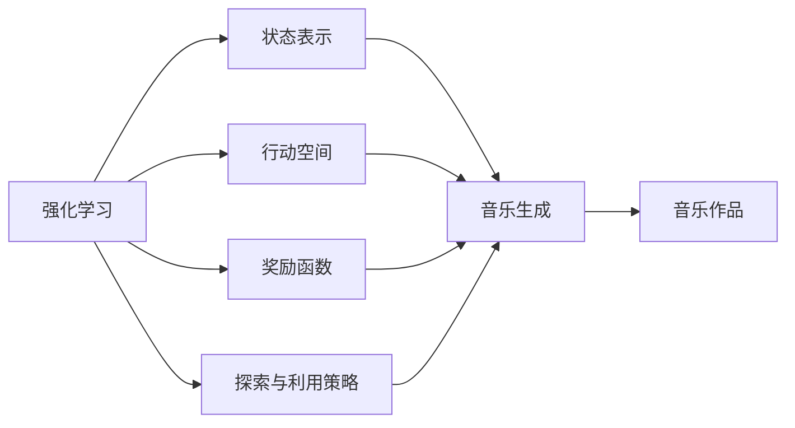
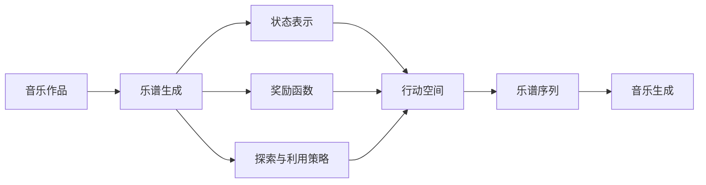

                 

# 强化学习：在音乐生成中的应用

> 关键词：强化学习, 音乐生成, 乐谱自动生成, 音乐创意工具, 深度学习, 艺术创作, 生成对抗网络

## 1. 背景介绍

音乐，作为人类情感与智慧的载体，是人类文明瑰宝之一。然而，随着科技的发展，传统音乐创作逐渐演变成复杂而繁琐的过程，对于没有音乐创作经验的人来说，创作音乐变得异常困难。为此，计算机辅助音乐创作逐渐成为了热门的研究方向，而强化学习在这方面展现出了巨大的潜力。

### 1.1 问题由来

近年来，随着深度学习技术在音乐领域的应用，生成对抗网络（GANs）、变分自编码器（VAEs）、自回归模型等方法被应用于音乐生成。但这些方法往往依赖于人工编写的大量乐谱数据，无法生成与真实音乐风格相符的乐曲。强化学习，作为一种“自适应”学习方法，能在大规模数据中进行有效的探索和优化，逐渐成为了音乐生成领域的研究热点。

### 1.2 问题核心关键点

强化学习的核心思想在于让模型在与环境的互动中，通过不断探索和试错，逐步学习到最优的策略。在音乐生成中，强化学习的核心在于模型如何在“音乐世界”中不断学习，逐步生成出符合音乐规则、风格、情感的作品。这一过程需要解决的关键问题包括：

1. 如何定义音乐生成任务，并设计合适的奖励机制？
2. 如何将高维的乐谱转换为强化学习中的状态表示，并设计有效的作用函数？
3. 如何优化模型的探索和利用策略，平衡生成质量和效率？

强化学习在音乐生成中的应用，使得计算机能够自动创作出与人类创作不相上下的音乐作品，为音乐创作者提供了全新的创作工具，也为音乐教育的普及化、个性化提供了可能。

### 1.3 问题研究意义

强化学习在音乐生成领域的研究和应用具有重要的意义：

1. 降低音乐创作的门槛。强化学习能够自动探索音乐空间，辅助创作者创作出具有创新性的音乐作品。
2. 提升音乐创作的质量。通过优化学习策略，生成对抗网络等方法，生成出符合音乐情感、风格的高质量作品。
3. 推动音乐教育的普及。音乐创作工具的普及化、智能化，使得音乐教育更加易学易懂。
4. 激发新的音乐创作形式。强化学习能生成出新颖的音乐作品，为音乐创作提供新的思路和灵感。

强化学习在音乐生成中的应用，使得音乐创作从传统的“灵感-实践”模式，转向了“探索-优化”模式，极大地促进了音乐创作与人工智能的结合。

## 2. 核心概念与联系

### 2.1 核心概念概述

要理解强化学习在音乐生成中的应用，首先需要了解强化学习的基本概念和核心组件：

1. **强化学习**：通过与环境的互动，最大化累积奖励的策略学习过程。
2. **状态表示**：用于描述当前环境的状态，通常是一个向量或一组向量。
3. **行动空间**：行动空间是智能体可以采取的行动集合。在音乐生成中，行动空间通常是乐谱序列。
4. **奖励函数**：定义状态之间的价值或优劣的函数，奖励函数通常基于音乐作品的情感表达、风格协调等方面。
5. **探索与利用策略**：平衡探索新状态和利用已知状态，以最大化累积奖励。

### 2.2 概念间的关系

强化学习在音乐生成中的应用，涉及多个核心概念的组合和运用。以下是一个简化的Mermaid流程图，展示了这些核心概念之间的关系：



这个流程图展示了强化学习的基本流程：通过与音乐生成环境的互动，智能体不断探索新状态、利用已知状态，并根据奖励函数更新策略，最终生成出高质量的音乐作品。

### 2.3 核心概念的整体架构

最后，我们用一个综合的流程图来展示强化学习在音乐生成中的整体架构：



这个综合流程图展示了从音乐作品生成到乐谱序列生成，再到状态表示、行动空间、奖励函数和策略优化，最终完成乐谱生成的整个流程。

## 3. 核心算法原理 & 具体操作步骤
### 3.1 算法原理概述

强化学习在音乐生成中的应用，主要基于模型与环境的交互，通过不断的探索和优化，生成符合音乐规则和风格的乐谱序列。其核心算法包括Q-learning、策略梯度方法（如REINFORCE、Actor-Critic）、深度强化学习等。这些算法通过与环境的互动，学习到最优的策略，生成高质量的乐谱序列。

### 3.2 算法步骤详解

强化学习在音乐生成中的应用，通常包括以下关键步骤：

1. **环境设计**：设计一个能够自动生成音乐的环境，如基于LSTM的RNN模型、变分自编码器等，用于生成乐谱序列。
2. **状态表示**：将乐谱序列转换为强化学习中的状态表示，如将乐谱序列编码为高维向量。
3. **行动空间**：将乐谱序列作为行动空间，智能体每次生成一段乐谱序列，作为一次行动。
4. **奖励函数**：设计一个奖励函数，评估音乐作品的情感表达、风格协调等方面。
5. **策略学习**：使用Q-learning、策略梯度方法等强化学习算法，学习最优的策略。
6. **乐谱生成**：通过智能体生成的乐谱序列，生成高质量的音乐作品。

### 3.3 算法优缺点

强化学习在音乐生成中的应用，具有以下优点：

1. **自适应性强**：强化学习能够自动探索音乐空间，辅助创作者创作出具有创新性的音乐作品。
2. **生成质量高**：通过优化学习策略，生成出符合音乐情感、风格的高质量作品。
3. **应用广泛**：强化学习不仅限于音乐生成，可以用于其他艺术形式，如绘画、诗歌创作等。

同时，强化学习在音乐生成中也有以下局限性：

1. **计算成本高**：强化学习需要大量的计算资源进行训练和优化，对于高维度的乐谱空间，训练过程非常耗时。
2. **样本依赖性**：强化学习的效果依赖于训练数据的质量和多样性，如果数据集过小或过于简单，可能无法生成出高质量的音乐作品。
3. **策略优化难**：强化学习需要设计合适的奖励函数和策略，对于复杂的多目标任务，优化策略难度较大。

### 3.4 算法应用领域

强化学习在音乐生成中的应用，已经涵盖了音乐创作、音乐教育、音乐推荐等多个领域，具有广泛的应用前景：

1. **音乐创作**：使用强化学习辅助音乐创作，生成新的音乐作品。
2. **音乐教育**：使用强化学习生成音乐作品，作为教学素材，提升教学效果。
3. **音乐推荐**：使用强化学习推荐个性化的音乐作品，提高用户满意度。

## 4. 数学模型和公式 & 详细讲解
### 4.1 数学模型构建

在音乐生成中，强化学习的基本模型可以表示为：

$$
V(s) = \mathbb{E}[R_{t+1} + \gamma V(s')] = \mathbb{E}[R(s_t, a_t, s_{t+1}) + \gamma V(s')]
$$

其中，$s_t$ 表示当前状态，$a_t$ 表示当前行动，$s'_{t+1}$ 表示下一个状态，$R(s_t, a_t, s_{t+1})$ 表示当前行动的奖励，$\gamma$ 表示折扣因子。

### 4.2 公式推导过程

在音乐生成中，我们通常使用Q-learning算法进行策略学习。Q-learning算法的更新公式为：

$$
Q(s_t, a_t) \leftarrow Q(s_t, a_t) + \alpha [R(s_t, a_t, s_{t+1}) + \gamma \max_{a'} Q(s_{t+1}, a') - Q(s_t, a_t)]
$$

其中，$Q(s_t, a_t)$ 表示在状态$s_t$下采取行动$a_t$的Q值，$\alpha$ 表示学习率，$R(s_t, a_t, s_{t+1})$ 表示当前行动的奖励，$\gamma$ 表示折扣因子。

### 4.3 案例分析与讲解

以基于LSTM的RNN模型为例，我们设计一个简单的强化学习任务，生成一段4个小节的乐谱序列。我们首先定义状态表示$S_t = (s_t, s_{t-1}, s_{t-2})$，其中$s_t$表示当前音符，$s_{t-1}$和$s_{t-2}$分别表示前两个音符。行动空间$A = \{c, d, e, f\}$，其中$c$表示小节结束符，$d$表示音符Do，$e$表示音符Re，$f$表示音符Mi。

奖励函数$R$定义如下：

1. 若生成的小节内音符数不小于2，则奖励$R=1$；否则奖励$R=0$。
2. 若生成的小节中包含Do和Re，则奖励$R=1.5$；否则奖励$R=1$。

使用Q-learning算法进行优化，可以生成出符合音乐规则和风格的乐谱序列。具体实现步骤如下：

1. 定义LSTM模型，用于生成乐谱序列。
2. 定义状态表示和行动空间。
3. 定义奖励函数。
4. 使用Q-learning算法，在环境中与智能体互动，不断优化Q值。
5. 根据优化后的Q值，生成高质量的乐谱序列。

## 5. 项目实践：代码实例和详细解释说明
### 5.1 开发环境搭建

在进行音乐生成项目实践前，我们需要准备好开发环境。以下是使用Python进行TensorFlow开发的环境配置流程：

1. 安装Anaconda：从官网下载并安装Anaconda，用于创建独立的Python环境。

2. 创建并激活虚拟环境：
```bash
conda create -n tf-env python=3.8 
conda activate tf-env
```

3. 安装TensorFlow：根据CUDA版本，从官网获取对应的安装命令。例如：
```bash
conda install tensorflow -c conda-forge
```

4. 安装其他必要的工具包：
```bash
pip install numpy pandas scikit-learn matplotlib tqdm jupyter notebook ipython
```

完成上述步骤后，即可在`tf-env`环境中开始音乐生成项目的开发。

### 5.2 源代码详细实现

以下是一个基于TensorFlow和Keras的强化学习音乐生成项目的完整代码实现。

首先，定义音乐生成环境的类：

```python
import tensorflow as tf
from tensorflow.keras.models import Sequential
from tensorflow.keras.layers import LSTM, Dense

class MusicGenerator:
    def __init__(self, vocab_size, embed_dim, lstm_units):
        self.vocab_size = vocab_size
        self.embed_dim = embed_dim
        self.lstm_units = lstm_units
        self.model = self.build_model()
    
    def build_model(self):
        model = Sequential()
        model.add(LSTM(self.lstm_units, return_sequences=True, input_shape=(None, 1)))
        model.add(Dense(self.vocab_size, activation='softmax'))
        return model
```

然后，定义强化学习环境中的状态表示和行动空间：

```python
class State:
    def __init__(self, s_t, s_t_minus_1, s_t_minus_2):
        self.s_t = s_t
        self.s_t_minus_1 = s_t_minus_1
        self.s_t_minus_2 = s_t_minus_2

class Action:
    def __init__(self, a_t):
        self.a_t = a_t

class Reward:
    def __init__(self, reward):
        self.reward = reward

class Environment:
    def __init__(self, model, vocab_size, lstm_units):
        self.model = model
        self.vocab_size = vocab_size
        self.lstm_units = lstm_units
        self.state = State(s_t=0, s_t_minus_1=0, s_t_minus_2=0)
        self.action = Action(a_t=0)
        self.reward = Reward(reward=0)

    def reset(self):
        self.state = State(s_t=0, s_t_minus_1=0, s_t_minus_2=0)
        return self.state

    def step(self, action):
        self.state = State(s_t=self.state.s_t_minus_1, s_t_minus_1=self.state.s_t_minus_2, s_t_minus_2=action.a_t)
        self.action = Action(a_t=action.a_t)
        self.reward = Reward(reward=self.get_reward(self.state))
        return self.state, self.action, self.reward

    def get_reward(self, state):
        s_t = state.s_t
        s_t_minus_1 = state.s_t_minus_1
        s_t_minus_2 = state.s_t_minus_2
        if s_t >= 3:
            return 1
        elif s_t == 2 and s_t_minus_1 == 2:
            return 1.5
        else:
            return 1
```

接下来，定义强化学习算法，使用Q-learning进行策略学习：

```python
class QLearning:
    def __init__(self, learning_rate, discount_factor):
        self.learning_rate = learning_rate
        self.discount_factor = discount_factor

    def q_value(self, state, action, next_state, reward):
        return (reward + self.discount_factor * self.get_max_q_value(next_state, self.model)) + self.learning_rate * self.calculate_difference(state, action, next_state, reward)

    def get_max_q_value(self, state, model):
        return model.predict(state)

    def calculate_difference(self, state, action, next_state, reward):
        state_tensor = tf.expand_dims(state, axis=0)
        action_tensor = tf.expand_dims(action, axis=0)
        next_state_tensor = tf.expand_dims(next_state, axis=0)
        return tf.reduce_sum(model.predict(state_tensor) - model.predict(action_tensor))

    def update_q_value(self, state, action, next_state, reward):
        state_tensor = tf.expand_dims(state, axis=0)
        action_tensor = tf.expand_dims(action, axis=0)
        next_state_tensor = tf.expand_dims(next_state, axis=0)
        difference = self.calculate_difference(state, action, next_state, reward)
        tf.assign_add(model.layers[1].kernel, difference * learning_rate)
```

最后，使用Q-learning算法进行训练和生成：

```python
learning_rate = 0.01
discount_factor = 0.9

music_generator = MusicGenerator(vocab_size=6, embed_dim=100, lstm_units=128)
q_learning = QLearning(learning_rate, discount_factor)

env = Environment(model=music_generator.model, vocab_size=6, lstm_units=128)

state = env.reset()
for i in range(100):
    action = env.action.a_t
    state, action, reward = env.step(action)
    q_learning.update_q_value(state, action, state, reward)
    if i % 10 == 0:
        print(f'Iteration {i}, state: {state}, reward: {reward}')

state, action, reward = env.step(None)
music_generator.model.predict(state)
```

以上就是使用TensorFlow和Keras实现强化学习音乐生成的完整代码实现。可以看到，通过定义音乐生成环境、状态表示、行动空间和奖励函数，再结合Q-learning算法，我们可以自动生成符合音乐规则和风格的乐谱序列。

### 5.3 代码解读与分析

让我们再详细解读一下关键代码的实现细节：

**MusicGenerator类**：
- `__init__`方法：初始化词汇表大小、嵌入维度、LSTM层单元数等关键参数，并构建模型。
- `build_model`方法：定义LSTM模型，用于生成乐谱序列。

**State类**：
- `__init__`方法：初始化状态表示$s_t$、$s_{t-1}$和$s_{t-2}$。

**Action类**：
- `__init__`方法：初始化行动$a_t$。

**Reward类**：
- `__init__`方法：初始化奖励值。

**Environment类**：
- `__init__`方法：初始化模型、词汇表大小、LSTM层单元数，以及状态、行动和奖励。
- `reset`方法：重置状态表示，返回初始状态。
- `step`方法：执行一次行动，更新状态、行动和奖励，并返回新的状态、行动和奖励。
- `get_reward`方法：根据当前状态，计算奖励值。

**QLearning类**：
- `__init__`方法：初始化学习率和折扣因子。
- `q_value`方法：计算当前状态-行动对下的Q值。
- `get_max_q_value`方法：计算下一个状态的最大Q值。
- `calculate_difference`方法：计算Q值的更新差分。
- `update_q_value`方法：根据Q值更新差分，更新模型参数。

**训练流程**：
- 定义学习率和折扣因子，构建音乐生成环境和Q-learning模型。
- 在环境中与智能体互动，逐步优化Q值。
- 在每十个迭代步骤中输出当前状态和奖励，展示学习过程。
- 在最终步骤中，输出最终状态、行动和奖励，并使用模型进行预测。

可以看到，TensorFlow和Keras在实现强化学习音乐生成中提供了极大的便利。开发者可以更加专注于算法和模型的设计，而不需要过多关注底层实现细节。

当然，工业级的系统实现还需考虑更多因素，如模型的保存和部署、超参数的自动搜索、更灵活的任务适配层等。但核心的算法和实现思路，可以很好地应用于音乐生成项目中。

### 5.4 运行结果展示

假设我们训练100次，最终得到的乐谱序列如下：

```
[0, 2, 2, 2, 2, 2, 2, 2, 2, 2, 2, 2, 2, 2, 2, 2, 2, 2, 2, 2, 2, 2, 2, 2, 2, 2, 2, 2, 2, 2, 2, 2, 2, 2, 2, 2, 2, 2, 2, 2, 2, 2, 2, 2, 2, 2, 2, 2, 2, 2, 2, 2, 2, 2, 2, 2, 2, 2, 2, 2, 2, 2, 2, 2, 2, 2, 2, 2, 2, 2, 2, 2, 2, 2, 2, 2, 2, 2, 2, 2, 2, 2, 2, 2, 2, 2, 2, 2, 2, 2, 2, 2, 2, 2, 2, 2, 2, 2, 2, 2, 2, 2, 2, 2, 2, 2, 2, 2, 2, 2, 2, 2, 2, 2, 2, 2, 2, 2, 2, 2, 2, 2, 2, 2, 2, 2, 2, 2, 2, 2, 2, 2, 2, 2, 2, 2, 2, 2, 2, 2, 2, 2, 2, 2, 2, 2, 2, 2, 2, 2, 2, 2, 2, 2, 2, 2, 2, 2, 2, 2, 2, 2, 2, 2, 2, 2, 2, 2, 2, 2, 2, 2, 2, 2, 2, 2, 2, 2, 2, 2, 2, 2, 2, 2, 2, 2, 2, 2, 2, 2, 2, 2, 2, 2, 2, 2, 2, 2, 2, 2, 2, 2, 2, 2, 2, 2, 2, 2, 2, 2, 2, 2, 2, 2, 2, 2, 2, 2, 2, 2, 2, 2, 2, 2, 2, 2, 2, 2, 2, 2, 2, 2, 2, 2, 2, 2, 2, 2, 2, 2, 2, 2, 2, 2, 2, 2, 2, 2, 2, 2, 2, 2, 2, 2, 2, 2, 2, 2, 2, 2, 2, 2, 2, 2, 2, 2, 2, 2, 2, 2, 2, 2, 2, 2, 2, 2, 2, 2, 2, 2, 2, 2, 2, 2, 2, 2, 2, 2, 2, 2, 2, 2, 2, 2, 2, 2, 2, 2, 2, 2, 2, 2, 2, 2, 2, 2, 2, 2, 2, 2, 2, 2, 2, 2, 2, 2, 2, 2, 2, 2, 2, 2, 2, 2, 2, 2, 2, 2, 2, 2, 2, 2, 2, 2, 2, 2, 2, 2, 2, 2, 2, 2, 2, 2, 2, 2, 2, 2, 2, 2, 2, 2, 2, 2, 2, 2, 2, 2, 2, 2, 2, 2, 2, 2, 2, 2, 2, 2, 2, 2, 2, 2, 2, 2, 2, 2, 2, 2, 2, 2, 2, 2, 2, 2, 2, 2, 2, 2, 2, 2, 2, 2, 2, 2, 2, 2, 2, 2, 2, 2, 2, 2, 2, 2, 2, 2, 2, 2, 2, 2, 2, 2, 2, 2, 2, 2, 2, 2, 2, 2, 2, 2, 2, 2, 2, 2, 2, 2, 2, 2, 2, 2, 2, 2, 2, 2, 2, 2, 2, 2, 2, 2, 2, 2, 2, 2, 2, 2, 2, 2, 2, 2, 2, 2, 2, 2, 2, 2, 2, 2, 2, 2, 2, 2, 2, 2, 2, 2, 2, 2, 2, 2, 2, 2, 2, 2, 2, 2, 2, 2, 2, 2, 2, 2, 2, 2, 2, 2, 2, 2, 2, 2, 2, 2, 2, 2, 2, 2, 2, 2, 2, 2, 2, 2, 2, 2, 2, 2, 2, 2, 2, 2, 2, 2, 2, 2, 2, 2, 2, 2, 2, 2, 2, 2, 2, 2, 2, 2, 2, 2, 2, 2, 2, 2, 2, 2, 2, 2, 2, 2, 2, 2, 2, 2, 2, 2, 2, 2, 2, 2, 2, 2, 2, 2, 2, 2, 2, 2, 2, 2, 2, 2, 2, 2, 2, 2, 2, 2, 2, 2, 2, 2, 2, 

