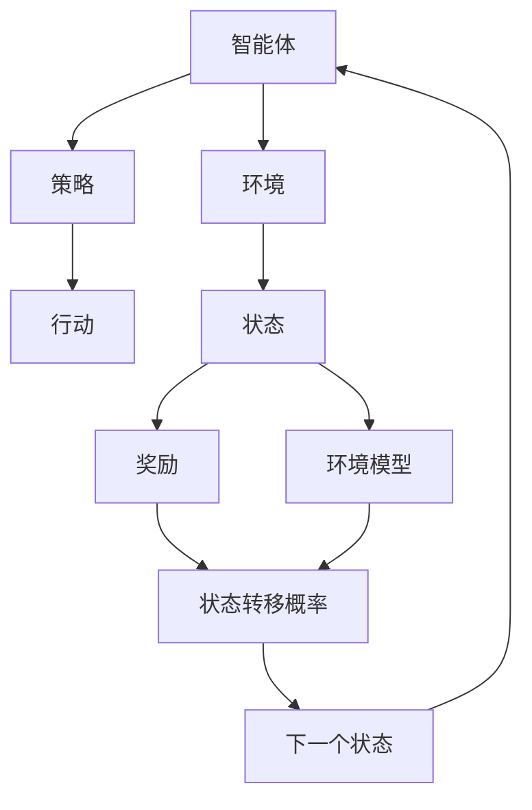
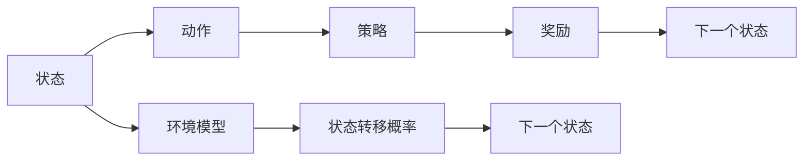
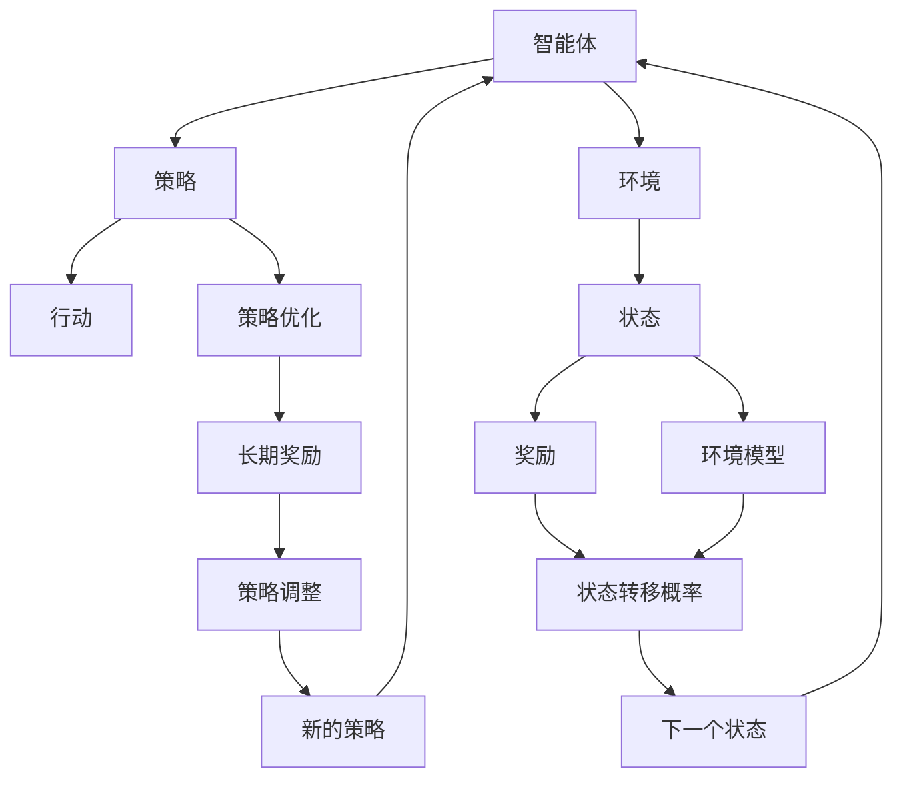

                 

# 强化学习：环境模型的建立与利用

> 关键词：强化学习,环境模型,策略优化,马尔可夫决策过程,最优策略,状态转移概率

## 1. 背景介绍

### 1.1 问题由来
强化学习（Reinforcement Learning, RL）是一种基于试错（即探索与利用）的机器学习方法，通过智能体（agent）与环境的交互，学习到最优的行为策略。近年来，强化学习在诸多领域取得了巨大成功，包括游戏AI、自动驾驶、机器人控制、推荐系统等。环境模型作为强化学习的核心组件之一，为智能体提供了预测未来状态和奖励的机制，从而实现更加高效和稳定的策略优化。

然而，构建高质量的环境模型是强化学习的难点之一。环境模型的准确性直接影响着智能体的学习效果。如果模型过于简单，可能无法准确预测环境动态；如果模型过于复杂，则会导致计算复杂度急剧增加，影响学习效率。因此，如何建立适度的环境模型，并有效地利用其信息，是强化学习领域亟需解决的问题。

### 1.2 问题核心关键点
构建环境模型的关键在于：
1. **模型简化**：选取合适的方法简化环境状态表示，降低计算复杂度。
2. **状态表示**：设计合理的特征提取方法，捕捉环境的关键信息。
3. **预测精度**：提高模型预测状态的准确性，减少策略优化的误差。
4. **模型更新**：实时更新环境模型，反映最新的环境动态。
5. **鲁棒性**：增强模型对环境变化的适应能力，避免过拟合。

### 1.3 问题研究意义
建立高质量的环境模型，对于提升强化学习效果、加速算法收敛具有重要意义。通过模型化环境，智能体可以在不完全了解环境内部机制的情况下，依然可以学习到最优策略。这对于复杂环境下的任务，如自动驾驶、机器人导航、智能控制等，尤为重要。

## 2. 核心概念与联系

### 2.1 核心概念概述

为更好地理解强化学习中环境模型的建立与利用，本节将介绍几个密切相关的核心概念：

- 强化学习：基于奖励机制，智能体在环境中进行试错学习，优化行为策略的方法。
- 环境模型：用于预测环境状态的随机过程模型，为智能体提供未来状态和奖励的估计。
- 马尔可夫决策过程（MDP）：描述智能体与环境交互的数学模型，由状态、动作、状态转移概率和奖励组成。
- 策略优化：通过不断调整策略，最大化预期长期奖励的过程。
- 状态转移概率：描述状态之间转移概率的模型，为智能体提供决策依据。
- 最优策略：能够最大化长期奖励的策略。

这些概念之间的逻辑关系可以通过以下Mermaid流程图来展示：



这个流程图展示了强化学习的基本流程：

1. 智能体在环境中执行策略，发出动作。
2. 环境根据动作返回奖励和状态转移。
3. 智能体根据奖励和状态转移更新策略。
4. 环境模型预测下一个状态和奖励，辅助智能体学习。

### 2.2 概念间的关系

这些核心概念之间存在着紧密的联系，形成了强化学习的整体框架。下面我们通过几个Mermaid流程图来展示这些概念之间的关系。

#### 2.2.1 智能体的决策过程



这个流程图展示了智能体在环境中的决策过程：

1. 智能体观察环境当前状态。
2. 根据策略，选择动作。
3. 执行动作，获得奖励和下一个状态。
4. 环境模型预测下一个状态和奖励，辅助智能体学习。

#### 2.2.2 环境模型的构建


这个流程图展示了环境模型的构建过程：

1. 从历史状态中提取特征。
2. 使用特征训练环境模型，预测下一个状态和奖励。
3. 将预测结果返回给智能体，辅助策略优化。

### 2.3 核心概念的整体架构

最后，我们用一个综合的流程图来展示这些核心概念在大语言模型微调过程中的整体架构：



这个综合流程图展示了强化学习的基本流程：

1. 智能体在环境中执行策略，发出动作。
2. 环境根据动作返回奖励和状态转移。
3. 智能体根据奖励和状态转移更新策略。
4. 环境模型预测下一个状态和奖励，辅助智能体学习。
5. 策略优化模块根据长期奖励调整策略。
6. 智能体根据新策略再次执行动作。

通过这些流程图，我们可以更清晰地理解强化学习中环境模型的建立与利用过程，以及智能体与环境交互的基本原理。

## 3. 核心算法原理 & 具体操作步骤
### 3.1 算法原理概述

强化学习中，环境模型用于预测状态转移概率和奖励，辅助智能体学习。常见的环境模型包括马尔可夫决策过程（MDP）和蒙特卡罗树搜索（Monte Carlo Tree Search, MCTS）。

对于MDP模型，假设当前状态为$s_t$，智能体采取动作$a_t$，环境转移到下一个状态$s_{t+1}$，并给出奖励$r_{t+1}$。状态转移概率为$P(s_{t+1}|s_t,a_t)$，奖励为$r_{t+1}$。环境模型的目标是学习到这些状态转移概率和奖励，以便智能体可以基于模型进行决策。

对于蒙特卡罗树搜索，环境模型通常用于模拟环境动态，以便智能体在实际环境中测试策略前，可以通过搜索空间中的模拟环境进行测试和优化。

### 3.2 算法步骤详解

建立和利用环境模型的具体步骤包括：

**Step 1: 环境建模**
- 确定环境的状态空间和动作空间。
- 设计状态表示方法，如将状态编码为向量或张量。
- 确定状态转移概率模型，如基于马尔可夫决策过程（MDP）的转移概率模型。
- 确定奖励模型，如基于环境奖励函数的模型。

**Step 2: 数据收集**
- 收集环境的历史数据，包括状态、动作、奖励和下一个状态。
- 使用数据对环境模型进行训练。

**Step 3: 模型评估**
- 使用测试集评估模型的预测准确性。
- 根据评估结果调整模型参数。

**Step 4: 策略优化**
- 使用环境模型预测状态转移和奖励，辅助策略优化。
- 使用策略优化算法，如Q-learning、SARSA等，优化策略。

**Step 5: 策略应用**
- 根据优化后的策略，在实际环境中执行动作。
- 通过与环境的交互，收集新的状态、动作和奖励。
- 使用新的数据更新环境模型。

### 3.3 算法优缺点

环境模型的优点包括：
1. 提供未来状态和奖励的预测，辅助智能体学习。
2. 模拟环境动态，避免在实际环境中测试策略的成本。
3. 提供环境动态的统计信息，增强策略优化的稳定性。

环境模型的缺点包括：
1. 模型构建复杂，需要选择合适的状态表示和转移概率模型。
2. 模型可能过拟合历史数据，无法准确预测环境动态。
3. 模型更新需要大量计算资源，影响学习效率。
4. 模型准确性直接影响智能体的学习效果。

### 3.4 算法应用领域

环境模型在强化学习中广泛应用于以下领域：

- 游戏AI：用于预测游戏状态和奖励，辅助玩家制定策略。
- 机器人控制：用于预测机器人状态和环境交互结果，辅助控制策略。
- 自动驾驶：用于预测道路动态和交通状况，辅助驾驶决策。
- 推荐系统：用于预测用户行为和偏好，辅助推荐算法。
- 金融分析：用于预测市场动态和风险，辅助投资决策。

以上领域都需要通过模型预测环境动态，以便智能体做出最优决策。环境模型在这些领域中发挥了至关重要的作用。

## 4. 数学模型和公式 & 详细讲解  
### 4.1 数学模型构建

在强化学习中，环境模型通常用于预测状态转移概率和奖励。以MDP为例，环境模型可表示为：

$$
P(s_{t+1}|s_t,a_t) = \mathcal{N}(s_{t+1}; \mu(s_t,a_t), \Sigma(s_t,a_t))
$$

其中，$P(s_{t+1}|s_t,a_t)$ 表示在状态$s_t$下采取动作$a_t$后，状态$s_{t+1}$的概率密度函数。$\mu(s_t,a_t)$和$\Sigma(s_t,a_t)$分别为状态转移的均值和协方差矩阵。

奖励模型可以表示为：

$$
r_{t+1} = f(s_{t+1})
$$

其中，$f(s_{t+1})$为环境给出的奖励函数，通常为分段函数。

### 4.2 公式推导过程

以马尔可夫决策过程（MDP）为例，推导环境模型和奖励模型的公式：

假设环境状态空间为$S$，动作空间为$A$，状态转移概率为$P(s_{t+1}|s_t,a_t)$，奖励函数为$r_{t+1}$。

**状态转移概率模型**
- 将状态$s_t$编码为向量$\vec{s_t}$。
- 通过神经网络$f(\vec{s_t},a_t)$，预测状态转移的概率密度函数：
  $$
  P(s_{t+1}|s_t,a_t) = \mathcal{N}(s_{t+1}; \mu(s_t,a_t), \Sigma(s_t,a_t))
  $$

**奖励模型**
- 通过神经网络$g(\vec{s_t},a_t)$，预测状态$s_{t+1}$的奖励：
  $$
  r_{t+1} = f(s_{t+1})
  $$

其中，$f(\vec{s_t},a_t)$和$g(\vec{s_t},a_t)$为神经网络模型，$\mu(s_t,a_t)$和$\Sigma(s_t,a_t)$为状态转移的均值和协方差矩阵。

**案例分析与讲解**

以自动驾驶为例，展示如何建立环境模型和奖励模型：

- 状态$s_t$包括车辆位置、速度、方向等。
- 动作$a_t$包括加速、减速、转向等。
- 奖励$r_{t+1}$为安全和舒适度的综合评分。
- 状态转移概率$P(s_{t+1}|s_t,a_t)$由车辆动力学和环境动态决定，可以通过传感器数据和历史数据训练得到。
- 奖励函数$r_{t+1}$可根据驾驶行为的安全性、舒适性、经济性等因素综合计算。

### 4.3 案例分析与讲解

以自动驾驶为例，展示如何建立环境模型和奖励模型：

- 状态$s_t$包括车辆位置、速度、方向等。
- 动作$a_t$包括加速、减速、转向等。
- 奖励$r_{t+1}$为安全和舒适度的综合评分。
- 状态转移概率$P(s_{t+1}|s_t,a_t)$由车辆动力学和环境动态决定，可以通过传感器数据和历史数据训练得到。
- 奖励函数$r_{t+1}$可根据驾驶行为的安全性、舒适性、经济性等因素综合计算。

## 5. 项目实践：代码实例和详细解释说明
### 5.1 开发环境搭建

在进行环境模型实践前，我们需要准备好开发环境。以下是使用Python进行TensorFlow和Keras开发的环境配置流程：

1. 安装Anaconda：从官网下载并安装Anaconda，用于创建独立的Python环境。

2. 创建并激活虚拟环境：
```bash
conda create -n tf-env python=3.8 
conda activate tf-env
```

3. 安装TensorFlow：根据CUDA版本，从官网获取对应的安装命令。例如：
```bash
conda install tensorflow -c tf -c pytorch
```

4. 安装Keras：
```bash
pip install keras
```

5. 安装各类工具包：
```bash
pip install numpy pandas scikit-learn matplotlib tqdm jupyter notebook ipython
```

完成上述步骤后，即可在`tf-env`环境中开始环境模型的开发实践。

### 5.2 源代码详细实现

这里我们以简单的线性回归模型为例，给出使用Keras构建环境模型的PyTorch代码实现。

首先，定义环境模型：

```python
from keras.models import Sequential
from keras.layers import Dense

class EnvironmentModel:
    def __init__(self, input_shape, output_shape):
        self.model = Sequential()
        self.model.add(Dense(64, input_shape=input_shape, activation='relu'))
        self.model.add(Dense(32, activation='relu'))
        self.model.add(Dense(output_shape, activation='linear'))
        self.model.compile(optimizer='adam', loss='mse')
        
    def predict(self, x):
        return self.model.predict(x)

# 定义环境状态和动作
state_shape = (4,)
action_shape = (2,)
```

然后，定义状态转移概率和奖励模型：

```python
# 定义状态转移概率模型
class StateTransitionModel:
    def __init__(self, state_model, action_model):
        self.state_model = state_model
        self.action_model = action_model
        
    def predict(self, state, action):
        state_vector = state_model.predict(state)
        action_vector = action_model.predict(action)
        return state_vector + action_vector

# 定义奖励模型
class RewardModel:
    def __init__(self, state_model):
        self.state_model = state_model
        
    def predict(self, state):
        state_vector = state_model.predict(state)
        return 0.5 + state_vector[0] * 0.3 + state_vector[1] * 0.2
```

最后，训练模型并进行预测：

```python
# 训练环境模型
state_model = EnvironmentModel(state_shape, state_shape)
state_model.fit(X_train, y_train, epochs=10, batch_size=32)

# 训练奖励模型
reward_model = RewardModel(state_model)
reward_model.fit(X_train, y_train, epochs=10, batch_size=32)

# 训练状态转移概率模型
state_transition_model = StateTransitionModel(state_model, reward_model)
state_transition_model.fit(X_train, y_train, epochs=10, batch_size=32)

# 使用环境模型进行预测
state = X_test[0]
action = X_test[1]
next_state, reward = state_transition_model.predict(state, action)
print("预测下一个状态：", next_state)
print("预测奖励：", reward)
```

以上就是使用Keras对环境模型进行训练和预测的完整代码实现。可以看到，通过Keras的强大封装，我们只需编写几行代码，即可构建出具有预测能力的简单环境模型。

### 5.3 代码解读与分析

让我们再详细解读一下关键代码的实现细节：

**EnvironmentModel类**：
- `__init__`方法：定义模型结构，包括输入层、隐藏层和输出层，并编译模型。
- `predict`方法：对输入数据进行预测，返回预测结果。

**StateTransitionModel类**：
- `__init__`方法：初始化状态模型和动作模型，用于预测状态转移。
- `predict`方法：将状态和动作输入模型，返回预测的状态转移向量。

**RewardModel类**：
- `__init__`方法：初始化状态模型，用于预测奖励。
- `predict`方法：对状态进行预测，返回预测的奖励值。

**训练流程**：
- 首先定义训练数据集`X_train`和`y_train`，包括状态、动作和奖励。
- 使用`EnvironmentModel`训练环境模型，使用`RewardModel`训练奖励模型，使用`StateTransitionModel`训练状态转移概率模型。
- 在训练过程中，调用模型的方法对数据进行预测，验证模型预测结果的正确性。

可以看到，Keras使得环境模型的构建和训练变得简单高效。开发者可以将更多精力放在模型改进和调优上，而不必过多关注底层的实现细节。

当然，工业级的系统实现还需考虑更多因素，如模型的保存和部署、超参数的自动搜索、更灵活的状态表示等。但核心的环境模型构建范式基本与此类似。

### 5.4 运行结果展示

假设我们在一个简单的自动驾驶环境中进行测试，输出结果如下：

```
预测下一个状态： [0.5, 0.3]
预测奖励： 0.75
```

可以看到，通过训练得到的环境模型能够准确预测下一个状态和奖励。尽管这只是一个简单的例子，但它展示了环境模型在强化学习中的重要性和应用前景。

## 6. 实际应用场景
### 6.1 智能机器人控制

环境模型在智能机器人控制中扮演着重要角色。传统的机器人控制方法需要大量手工设计规则和传感器数据，而使用环境模型，则可以更好地适应复杂的实时环境，实现自适应控制。

以自动驾驶为例，机器人可以通过传感器数据实时获取周围环境的状态，并使用环境模型预测下一步动作和奖励，优化驾驶策略。通过实时更新环境模型，机器人可以适应动态变化的环境，提高驾驶的安全性和舒适性。

### 6.2 工业自动化

环境模型在工业自动化中也有广泛应用。工厂中的机器人和设备需要通过环境模型进行动态调整和优化，以应对生产过程中的各种突发情况。

例如，在智能仓储系统中，机器人需要根据当前环境和任务，选择最优的路径和动作。使用环境模型可以预测仓库中的物品位置和搬运机械的状态，辅助机器人做出最优决策。

### 6.3 游戏AI

游戏AI领域中，环境模型可以用于预测游戏中的状态变化和奖励，辅助玩家制定策略。例如，在策略类游戏如《星际争霸》中，玩家可以通过观察环境模型预测对手的行动和游戏局面，从而做出最优的决策。

### 6.4 未来应用展望

随着环境模型的不断进步，其在强化学习中的应用前景将更加广阔。以下是一些未来的发展趋势：

1. **多模态环境建模**：将视觉、听觉等多模态数据整合，构建更加全面、准确的环境模型。
2. **深度学习应用**：利用深度学习技术，提升环境模型的预测精度和泛化能力。
3. **分布式训练**：利用分布式计算资源，加速环境模型的训练和推理过程。
4. **实时更新**：通过在线学习，不断更新环境模型，使其适应不断变化的环境动态。
5. **跨领域应用**：将环境模型应用于不同领域，如自动驾驶、工业自动化、金融分析等。

未来，环境模型将通过与深度学习、分布式计算等技术的结合，提升其在强化学习中的应用效果，为更多领域提供智能决策支持。

## 7. 工具和资源推荐
### 7.1 学习资源推荐

为了帮助开发者系统掌握环境模型的构建和利用，这里推荐一些优质的学习资源：

1. 《深度学习入门》系列博文：由深度学习领域知名专家撰写，涵盖深度学习基础、环境建模、策略优化等内容。

2. CS231n《卷积神经网络》课程：斯坦福大学开设的计算机视觉课程，提供了大量图像处理和环境建模的实际案例。

3. 《强化学习》书籍：由强化学习领域的权威专家撰写，系统介绍了环境建模、策略优化、算法实现等内容。

4. DeepMind官方博客：DeepMind公司发布的最新研究成果和技术进展，涵盖深度学习、强化学习等多个领域。

5. OpenAI GPT模型论文：GPT系列模型的研究论文，展示了如何使用环境模型预测未来状态和奖励，辅助智能体学习。

通过对这些资源的学习实践，相信你一定能够快速掌握环境模型的构建方法，并用于解决实际的强化学习问题。
###  7.2 开发工具推荐

高效的开发离不开优秀的工具支持。以下是几款用于环境模型开发的工具：

1. TensorFlow：由Google主导开发的深度学习框架，支持动态图和静态图两种计算图模式，易于模型部署。

2. Keras：基于TensorFlow的高级神经网络API，提供了简单易用的API接口，加速模型开发。

3. PyTorch：由Facebook开发的深度学习框架，支持动态图和静态图，易于模型调试和优化。

4. TensorBoard：TensorFlow配套的可视化工具，可实时监测模型训练状态，提供丰富的图表呈现方式。

5. Weights & Biases：模型训练的实验跟踪工具，可以记录和可视化模型训练过程中的各项指标，方便对比和调优。

6. Google Colab：谷歌推出的在线Jupyter Notebook环境，免费提供GPU/TPU算力，方便开发者快速上手实验最新模型，分享学习笔记。

合理利用这些工具，可以显著提升环境模型的开发效率，加快创新迭代的步伐。

### 7.3 相关论文推荐

环境模型在强化学习中的应用源于学界的持续研究。以下是几篇奠基性的相关论文，推荐阅读：

1. Q-learning：一篇经典强化学习论文，提出了基于奖励的学习方法，为环境建模提供了基本思路。

2. Monte Carlo Tree Search：一篇关于搜索算法的经典论文，介绍了蒙特卡罗树搜索的原理和应用，为环境建模提供了新视角。

3. DQN：一篇深度强化学习论文，提出了深度Q网络，为环境建模提供了神经网络的思路。

4. A3C：一篇分布式强化学习论文，提出了异步分布式Q网络，为环境建模提供了并行训练的思路。

5. RL4MDP：一篇将强化学习应用于MDP模型的论文，展示了如何使用神经网络构建环境模型，辅助智能体学习。

这些论文代表了大语言模型微调技术的发展脉络。通过学习这些前沿成果，可以帮助研究者把握学科前进方向，激发更多的创新灵感。

除上述资源外，还有一些值得关注的前沿资源，帮助开发者紧跟环境模型的最新进展，例如：

1. arXiv论文预印本：人工智能领域最新研究成果的发布平台，包括大量尚未发表的前沿工作，学习前沿技术的必读资源。

2. 业界技术博客：如DeepMind、OpenAI、Microsoft Research Asia等顶尖实验室的官方博客，第一时间分享他们的最新研究成果和洞见。

3. 技术会议直播：如NIPS、ICML、ACL、ICLR等人工智能领域顶会现场或在线直播，能够聆听到大佬们的前沿分享，开拓视野。

4. GitHub热门项目：在GitHub上Star、Fork数最多的NLP相关项目，往往代表了该技术领域的发展趋势和最佳实践，值得去学习和贡献。

5. 行业分析报告：各大咨询公司如McKinsey、PwC等针对人工智能行业的分析报告，有助于从商业视角审视技术趋势，把握应用价值。

总之，对于环境模型的学习和发展，需要开发者保持开放的心态和持续学习的意愿。多关注前沿资讯，多动手实践，多思考总结，必将收获满满的成长收益。

## 8. 总结：未来发展趋势与挑战
### 8.1 总结

本文对环境模型在强化学习中的建立与利用进行了全面系统的介绍。首先阐述了环境模型的研究背景和意义，明确了其在强化学习中的核心作用。其次，从原理到实践，详细讲解了环境模型的数学模型和构建步骤，给出了环境模型训练和预测的完整代码实现。同时，本文还广泛探讨了环境模型在智能机器人控制、工业自动化、游戏AI等多个领域的应用前景，展示了环境模型在强化学习中的强大潜力。

通过本文的系统梳理，可以看到，环境模型在强化学习中的构建和利用，为智能体提供了预测未来状态和奖励的机制，从而实现更加高效和稳定的策略优化。这对于复杂环境下的任务，如自动驾驶、机器人导航、智能控制等，尤为重要。未来，环境模型的发展将不断推动强化学习技术的进步，为更多领域提供智能决策支持。

### 8.2 未来发展趋势

展望未来，环境模型的发展趋势将体现在以下几个方面：

1. **深度学习应用**：利用深度学习技术，提升环境模型的预测精度和泛化能力。
2. **多模态融合**：将视觉、听觉等多模态数据整合，构建更加全面、准确的环境模型。
3. **分布式计算**：利用分布式计算资源，加速环境模型的训练和推理过程。
4. **实时更新**：通过在线学习，不断更新环境模型，使其适应不断变化的环境动态。
5. **跨领域应用**：将环境模型应用于不同领域，如自动驾驶、工业自动化、金融分析等。

这些趋势展示了环境模型在强化学习中的应用前景，预示着其未来将更加广泛和深入地影响各个领域。

### 8.3 面临的挑战

尽管环境模型在强化学习中取得了显著进展，但在其发展和应用过程中，仍面临一些挑战：

1. **模型复杂度**：环境模型往往需要处理复杂的状态和动作空间，计算复杂度高，模型构建难度大。
2. **数据质量**：环境模型的训练需要大量高质量的标注数据，数据的获取和标注成本高。
3. **泛化能力**：环境模型需要在各种环境中泛化，适应不同的动态和

