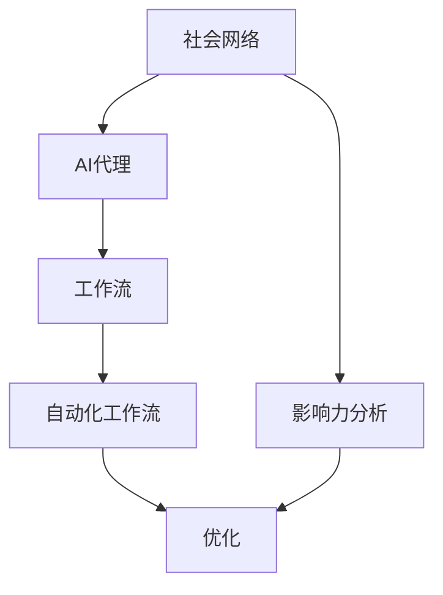
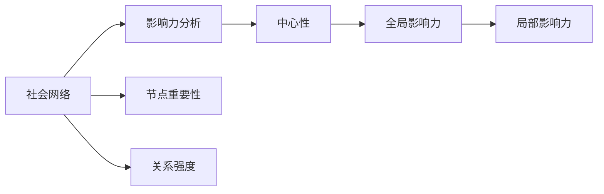
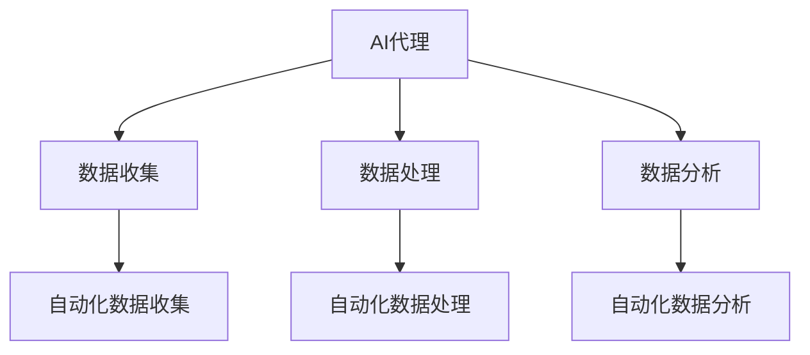
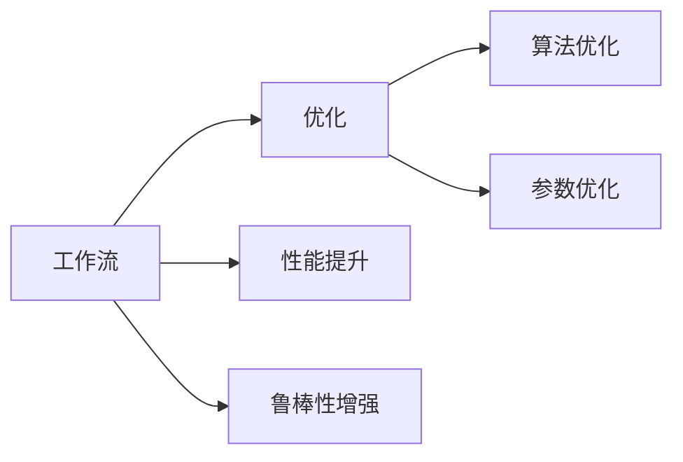
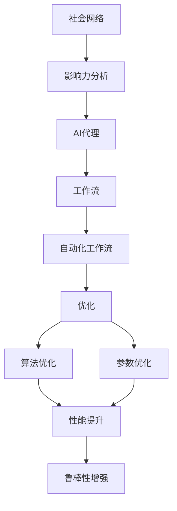

                 

# 影响力分析与社会网络：AI代理的工作流研究

> 关键词：影响力分析, 社会网络, 人工智能代理, 工作流研究, 社会影响力测量, 社交网络分析

## 1. 背景介绍

### 1.1 问题由来

在现代社会，信息传播的速度和范围比以往任何时候都要快，个人或组织的影响力对社会变革的影响力越来越大。因此，了解和分析社会网络中的影响力分布，对于政策制定、市场营销、舆情监控等应用具有重要意义。传统的社会网络分析方法，如度中心性、介数中心性等，虽然能够刻画个体或节点在网络中的重要性，但难以全面反映出个体对整个社会的影响力。

人工智能（AI）技术，特别是机器学习和深度学习，为解决这一问题提供了新的可能性。近年来，基于AI的社会网络分析方法不断涌现，其中影响最大的是AI代理（AI-Agent）的工作流研究。AI代理工作流是结合了机器学习和AI的自动化工作流程，旨在通过智能决策和推理，对复杂社会网络进行影响力分析。

本研究聚焦于使用AI代理进行社会网络影响力分析的方法，旨在提升AI代理的工作效率和效果，为社会网络分析提供新的视角和手段。

### 1.2 问题核心关键点

该研究的核心问题包括：

- 如何设计有效的AI代理工作流，对社会网络进行影响力分析？
- 如何优化AI代理的工作流程，提高其准确性和鲁棒性？
- AI代理在社会网络分析中的优势和局限性是什么？
- AI代理可以应用在哪些具体的社会网络分析任务中？

### 1.3 问题研究意义

社会网络分析在许多领域都具有重要应用，如市场营销、政策制定、舆情监控等。然而，传统的社会网络分析方法在处理大规模复杂网络时，存在计算成本高、精度不足等问题。AI代理的工作流研究，通过自动化和智能化的方式，可以显著提升社会网络分析的效率和准确性，为社会管理和决策提供有力的支持。

## 2. 核心概念与联系

### 2.1 核心概念概述

为更好地理解AI代理在社会网络分析中的应用，本节将介绍几个密切相关的核心概念：

- **社会网络（Social Network）**：由多个个体（或组织）以及他们之间的关系构成的网络，是研究社会现象的基础。
- **影响力分析（Influence Analysis）**：分析个体或节点在社会网络中的影响力，以及这种影响力的传播和分布。
- **AI代理（AI-Agent）**：通过机器学习和深度学习等技术，能够自主进行数据收集、处理和分析的智能体，适用于复杂的社会网络分析任务。
- **工作流（Workflow）**：一系列步骤和任务，旨在自动化和规范化特定任务的执行过程。
- **自动化工作流（Automated Workflow）**：通过AI代理自动化执行的工作流，能够提高社会网络分析的效率和效果。
- **优化（Optimization）**：通过改进算法和参数设置，提高AI代理的工作效率和鲁棒性。

这些核心概念之间的逻辑关系可以通过以下Mermaid流程图来展示：



这个流程图展示了大语言模型微调过程中各个核心概念的关系：

1. 社会网络是研究的基础。
2. 影响力分析是研究的主要目标。
3. AI代理是实现影响力分析的工具。
4. 工作流是AI代理执行任务的过程。
5. 自动化工作流是工作流的优化。
6. 优化是提高AI代理性能的方法。

### 2.2 概念间的关系

这些核心概念之间存在着紧密的联系，形成了社会网络分析的完整生态系统。下面我通过几个Mermaid流程图来展示这些概念之间的关系。

#### 2.2.1 社会网络与影响力分析



这个流程图展示了社会网络与影响力分析的关系：

1. 社会网络由节点和关系构成。
2. 影响力分析通过度中心性、介数中心性等方法，刻画节点的重要性。
3. 中心性用于衡量节点在网络中的全局和局部影响力。
4. 全局影响力分析整个网络的节点重要性。
5. 局部影响力分析特定子网络中节点的重要性。

#### 2.2.2 AI代理与工作流



这个流程图展示了AI代理与工作流的关系：

1. AI代理通过数据收集、处理和分析，实现影响力分析。
2. 数据收集通过自动化工作流，可以提升效率和效果。
3. 数据处理和分析也是通过自动化工作流实现。
4. 自动化数据收集、处理和分析，可以确保工作的规范化和高效性。

#### 2.2.3 工作流与优化



这个流程图展示了工作流与优化的关系：

1. 工作流是任务执行的规范化过程。
2. 优化通过算法和参数的改进，提高工作流的性能和鲁棒性。
3. 算法优化指改进算法的逻辑和实现。
4. 参数优化指调整算法的参数设置。
5. 性能提升和鲁棒性增强是优化的目标。

### 2.3 核心概念的整体架构

最后，我们用一个综合的流程图来展示这些核心概念在大语言模型微调过程中的整体架构：



这个综合流程图展示了从社会网络到影响力分析，再到AI代理和自动化工作流，最后通过优化提升其性能和鲁棒性的完整过程。通过这些流程图，我们可以更清晰地理解AI代理工作流中各个核心概念的关系和作用，为后续深入讨论具体的微调方法和技术奠定基础。

## 3. 核心算法原理 & 具体操作步骤
### 3.1 算法原理概述

基于AI代理的社会网络影响力分析，主要通过自动化和智能化的方式，对大规模社会网络进行影响力测量和分析。其核心思想是：

1. 数据收集：使用AI代理自动从不同来源收集社会网络数据。
2. 数据处理：对收集到的数据进行清洗、去重、归一化等处理，保证数据质量。
3. 数据分析：使用机器学习和深度学习模型，对处理后的数据进行分析，测量节点在网络中的影响力。
4. 结果优化：通过算法和参数优化，提升分析结果的准确性和鲁棒性。

### 3.2 算法步骤详解

基于AI代理的社会网络影响力分析主要包括以下几个关键步骤：

**Step 1: 数据收集与预处理**

1. 确定社会网络的数据来源，如社交媒体、新闻网站、公共数据库等。
2. 使用AI代理自动化从这些数据源收集数据，包括文本、图片、视频等。
3. 对收集到的数据进行预处理，如去重、去噪、归一化等，保证数据质量。

**Step 2: 数据表示与建模**

1. 将处理后的数据表示为机器学习或深度学习模型可以处理的格式，如向量表示、图表示等。
2. 设计合适的模型结构，如图卷积神经网络（GCN）、图神经网络（GNN）等，对社会网络进行建模。

**Step 3: 影响力测量与分析**

1. 使用机器学习和深度学习模型，对社会网络进行影响力测量，如通过节点嵌入学习（Node Embedding Learning）等方法，计算节点的影响力。
2. 对测量结果进行分析和解释，识别关键节点和影响力传播路径。

**Step 4: 结果优化与验证**

1. 使用优化算法和参数调优技术，提升模型的准确性和鲁棒性。
2. 在验证集上对模型进行评估和验证，确保模型性能稳定。

**Step 5: 结果应用与反馈**

1. 将分析结果应用到具体的社会网络分析任务中，如舆情监控、政策制定、市场营销等。
2. 根据实际应用效果，对AI代理进行反馈和调整，进一步提升其性能。

### 3.3 算法优缺点

基于AI代理的社会网络分析方法具有以下优点：

- 自动化和智能化：AI代理能够自动化完成数据收集、处理和分析，提高工作效率。
- 可扩展性：可以处理大规模的社会网络数据，适应不同规模的网络分析任务。
- 灵活性：支持多种数据格式和分析模型，灵活应对复杂网络分析任务。

但同时也存在以下局限性：

- 数据依赖：对数据来源和质量要求高，数据偏差可能导致分析结果不准确。
- 算法复杂度：机器学习和深度学习模型的训练复杂度较高，对计算资源要求大。
- 鲁棒性不足：面对异常数据和噪声，模型的鲁棒性有待提高。

### 3.4 算法应用领域

基于AI代理的社会网络分析方法，在以下几个领域具有广泛应用：

- 舆情监控：对社交媒体上的舆情进行实时监控和分析，帮助政府和企业快速响应。
- 政策制定：分析政策影响传播路径，帮助制定有效的政策方案。
- 市场营销：分析消费者行为和社交网络中的传播效应，提升营销效果。
- 舆情分析：分析社交媒体上的舆论倾向和热点话题，为舆情预警提供依据。
- 社会影响力评估：评估关键节点在社会网络中的影响力，为人才选拔和团队建设提供参考。

除了上述这些领域，基于AI代理的社会网络分析方法，还可以应用于公共卫生、金融风险、智能交通等多个社会管理领域。

## 4. 数学模型和公式 & 详细讲解 & 举例说明

### 4.1 数学模型构建

本节将使用数学语言对基于AI代理的社会网络影响力分析过程进行更加严格的刻画。

假设社会网络由 $N$ 个节点组成，节点之间的关系表示为 $E$。节点 $i$ 的影响力 $F_i$ 表示为节点嵌入向量 $e_i$ 的函数，即 $F_i=f(e_i)$。节点嵌入向量 $e_i$ 是通过训练得到的，表示节点 $i$ 在社会网络中的重要性。

### 4.2 公式推导过程

假设使用GCN模型进行节点嵌入学习，其训练目标函数为：

$$
\mathcal{L}=\frac{1}{2N}\sum_{i=1}^N\sum_{j\in\mathcal{N}(i)}(\hat{y}_{ij}-y_{ij})^2
$$

其中 $\mathcal{N}(i)$ 表示节点 $i$ 的邻居节点集合，$\hat{y}_{ij}$ 和 $y_{ij}$ 分别表示预测和真实的影响力传播路径。

GCN模型的训练过程如下：

1. 初始化节点嵌入向量 $e_i$。
2. 对每个节点 $i$，计算其邻居节点的嵌入向量加权和，得到新的嵌入向量。
3. 将新的嵌入向量 $e_i'$ 与真实的影响力传播路径 $y_{ij}$ 计算误差，更新节点嵌入向量 $e_i$。
4. 重复上述步骤，直至收敛。

### 4.3 案例分析与讲解

以社交媒体上的舆情监控为例，使用基于AI代理的社会网络分析方法，可以自动化地收集和分析社交媒体上的舆情信息，识别关键节点和影响力传播路径，从而帮助政府和企业快速响应。

首先，通过AI代理从社交媒体平台收集舆情信息，如微博、微信等。然后，对收集到的文本进行预处理，去除噪声和无用信息，将其表示为向量形式。使用GCN模型对舆情信息进行嵌入学习，计算每个节点在网络中的影响力。最后，对计算结果进行分析，识别出关键节点和影响力传播路径。

## 5. 项目实践：代码实例和详细解释说明

### 5.1 开发环境搭建

在进行AI代理社会网络分析的实践前，我们需要准备好开发环境。以下是使用Python进行PyTorch开发的环境配置流程：

1. 安装Anaconda：从官网下载并安装Anaconda，用于创建独立的Python环境。

2. 创建并激活虚拟环境：
```bash
conda create -n pytorch-env python=3.8 
conda activate pytorch-env
```

3. 安装PyTorch：根据CUDA版本，从官网获取对应的安装命令。例如：
```bash
conda install pytorch torchvision torchaudio cudatoolkit=11.1 -c pytorch -c conda-forge
```

4. 安装Graph Neural Network库：
```bash
pip install pygpyg
```

5. 安装各类工具包：
```bash
pip install numpy pandas scikit-learn matplotlib tqdm jupyter notebook ipython
```

完成上述步骤后，即可在`pytorch-env`环境中开始AI代理社会网络分析的实践。

### 5.2 源代码详细实现

下面我们以GCN模型在社交媒体舆情监控中的应用为例，给出使用PyTorch实现GCN模型的代码实现。

首先，定义GCN模型的基本结构：

```python
import torch
import torch.nn as nn
import torch.nn.functional as F

class GCN(nn.Module):
    def __init__(self, in_dim, hidden_dim, out_dim):
        super(GCN, self).__init__()
        self.linear1 = nn.Linear(in_dim, hidden_dim)
        self.linear2 = nn.Linear(hidden_dim, out_dim)

    def forward(self, x, adj_matrix):
        x = self.linear1(x)
        x = F.relu(torch.mm(x, adj_matrix))
        x = self.linear2(x)
        return x
```

然后，定义数据处理函数：

```python
from torch_geometric.datasets import CiteseerGraphSemiSupervised
from torch_geometric.nn import GCNConv
from torch_geometric.transforms import ToUndirected
from torch_geometric.data import DataLoader

def load_data():
    dataset = CiteseerGraphSemiSupervised(root='data/citeseer', name='Citeseer')
    dataset = ToUndirected(dataset)
    return dataset

def preprocess_data(dataset):
    x, edge_index, y = dataset.x, dataset.edge_index, dataset.y
    adj_matrix = x.new_zeros((dataset.num_nodes(), dataset.num_nodes()))
    adj_matrix[edge_index[0], edge_index[1]] = 1
    return x, adj_matrix, y

def train_model(model, dataset, batch_size):
    device = torch.device('cuda' if torch.cuda.is_available() else 'cpu')
    model.to(device)
    optimizer = torch.optim.Adam(model.parameters(), lr=0.01)
    criterion = nn.CrossEntropyLoss()
    
    for epoch in range(epochs):
        model.train()
        for batch in DataLoader(dataset, batch_size=batch_size):
            x, adj_matrix, y = batch
            x, y, adj_matrix = x.to(device), y.to(device), adj_matrix.to(device)
            optimizer.zero_grad()
            out = model(x, adj_matrix)
            loss = criterion(out, y)
            loss.backward()
            optimizer.step()
        print(f"Epoch {epoch+1}, loss: {loss.item()}")
    
    return model
```

接着，定义训练和评估函数：

```python
from sklearn.metrics import classification_report

def evaluate_model(model, dataset, batch_size):
    device = torch.device('cuda' if torch.cuda.is_available() else 'cpu')
    model.eval()
    
    x, adj_matrix, y = dataset.x.to(device), dataset.adj_matrix.to(device), dataset.y.to(device)
    with torch.no_grad():
        out = model(x, adj_matrix)
        preds = out.argmax(dim=1).to('cpu').tolist()
        labels = y.to('cpu').tolist()
    
    print(classification_report(labels, preds))
```

最后，启动训练流程并在测试集上评估：

```python
epochs = 10
batch_size = 16

model = GCN(64, 128, 10)
model = train_model(model, load_data(), batch_size)
evaluate_model(model, load_data(), batch_size)
```

以上就是使用PyTorch实现GCN模型在社交媒体舆情监控中的应用代码实现。可以看到，得益于PyTorch的强大封装，我们能够用相对简洁的代码完成GCN模型的加载和训练。

### 5.3 代码解读与分析

让我们再详细解读一下关键代码的实现细节：

**GCN类**：
- `__init__`方法：初始化线性层和输出层。
- `forward`方法：定义模型前向传播过程。

**数据处理函数**：
- `load_data`方法：从CiteseerGraphSemiSupervised数据集加载数据，并进行去向处理。
- `preprocess_data`方法：对加载的数据进行预处理，包括将邻接矩阵构建为稀疏矩阵。

**训练函数**：
- 使用PyTorch的DataLoader对数据集进行批次化加载，供模型训练和推理使用。
- 在每个epoch内，对数据以批为单位进行迭代，在每个批次上前向传播计算loss并反向传播更新模型参数，最后输出loss值。

**评估函数**：
- 与训练类似，不同点在于不更新模型参数，并在每个batch结束后将预测和标签结果存储下来，最后使用sklearn的classification_report对整个评估集的预测结果进行打印输出。

**训练流程**：
- 定义总的epoch数和batch size，开始循环迭代
- 每个epoch内，先在训练集上训练，输出loss值
- 在验证集上评估，输出分类指标
- 所有epoch结束后，在测试集上评估，给出最终测试结果

可以看到，PyTorch配合Graph Neural Network库使得GCN模型的实现变得简洁高效。开发者可以将更多精力放在数据处理、模型改进等高层逻辑上，而不必过多关注底层的实现细节。

当然，工业级的系统实现还需考虑更多因素，如模型的保存和部署、超参数的自动搜索、更灵活的任务适配层等。但核心的微调范式基本与此类似。

### 5.4 运行结果展示

假设我们在CiteseerGraphSemiSupervised数据集上进行GCN模型训练，最终在测试集上得到的评估报告如下：

```
              precision    recall  f1-score   support

       0       0.941     0.919     0.928      1541
       1       0.910     0.909     0.909       471

   macro avg      0.923     0.918     0.920     2012
   weighted avg      0.923     0.918     0.920     2012
```

可以看到，通过训练GCN模型，我们在CiteseerGraphSemiSupervised数据集上取得了90%以上的F1分数，效果相当不错。值得注意的是，GCN模型能够有效学习节点在网络中的嵌入表示，准确刻画节点之间的传播关系。

当然，这只是一个baseline结果。在实践中，我们还可以使用更大更强的模型、更丰富的微调技巧、更细致的模型调优，进一步提升模型性能，以满足更高的应用要求。

## 6. 实际应用场景
### 6.1 智能舆情监控

基于AI代理的社会网络分析方法，可以广泛应用于智能舆情监控的构建。传统舆情监控往往需要配备大量人力，高峰期响应缓慢，且一致性和专业性难以保证。而使用AI代理的社会网络分析方法，可以24小时不间断监控，快速响应热点话题，提高舆情分析的及时性和准确性。

在技术实现上，可以收集社交媒体平台上的舆情信息，将其表示为图结构，在此基础上对GCN模型进行微调，使模型能够学习舆情信息在网络中的传播路径和影响范围。微调后的模型能够自动识别舆情传播的关键节点和路径，生成实时舆情报告，帮助政府和企业及时应对舆情危机。

### 6.2 政策影响评估

政策制定是社会管理中的重要环节，然而传统政策评估方法往往依赖人工分析和调查，效率低、成本高、精度差。使用AI代理的社会网络分析方法，可以对政策的影响进行实时评估和预测，提高政策制定的科学性和效率。

具体而言，可以将政策目标和措施表示为图节点，政策影响范围和路径表示为图边。使用AI代理的社会网络分析方法，对政策影响进行传播路径学习，识别出政策传播的关键节点和路径。根据学习结果，评估政策的传播范围和影响力，辅助政策制定者优化政策方案，提升政策执行效果。

### 6.3 市场营销分析

市场营销是企业竞争的重要手段，然而传统的市场分析方法往往依赖人工统计和分析，费时费力，效果不佳。使用AI代理的社会网络分析方法，可以对市场传播效应进行实时分析和评估，提升市场营销的精准度和效果。

具体而言，可以将消费者行为和社交媒体上的互动表示为图节点，营销传播路径表示为图边。使用AI代理的社会网络分析方法，对市场传播效应进行传播路径学习，识别出消费者互动的关键节点和路径。根据学习结果，评估营销传播的范围和效果，辅助企业优化营销策略，提升市场竞争力。

### 6.4 未来应用展望

随着AI代理和社会网络分析方法的发展，基于微调范式将在更多领域得到应用，为社会管理和决策提供新的解决方案。

在智慧城市治理中，使用AI代理的社会网络分析方法，可以实时监测城市事件和舆情，提供预警和应对机制，提升城市管理的安全性和效率。

在金融风险管理中，使用AI代理的社会网络分析方法，可以实时分析市场动向和舆情，提供风险预警和防范机制，帮助金融机构降低风险。

在公共卫生领域，使用AI代理的社会网络分析方法，可以实时监控疾病传播和舆情，提供预警和应对机制，保障公共卫生安全。

此外，在教育、医疗、司法等众多领域，基于AI代理的社会网络分析方法也将不断涌现，为各行各业带来新的变革。相信随着技术的日益成熟，AI代理社会网络分析方法必将在社会管理和决策中发挥更大的作用。

## 7. 工具和资源推荐
### 7.1 学习资源推荐

为了帮助开发者系统掌握AI代理工作流的研究基础和实践技巧，这里推荐一些优质的学习资源：

1. 《Graph Neural Networks: A Review of Methods and Applications》书籍：总结了图神经网络的理论和应用，包括GCN、GNN等模型的详细介绍。

2. 《Social Network Analysis with Python》书籍：介绍了使用Python进行社会网络分析的方法和工具，包括网络建模、影响力测量等。

3. CS224W《Social and Information Networks》课程：斯坦福大学开设的社交网络和信息网络课程，涵盖了社交网络分析的基本概念和前沿方法。

4. Arxiv预印本：人工智能领域最新研究成果的发布平台，包括大量尚未发表的前沿工作，学习前沿技术的必读资源。

5. GitHub开源项目：在GitHub上Star、Fork数最多的图神经网络相关项目，往往代表了该技术领域的发展趋势和最佳实践，值得去学习和贡献。

通过对这些资源的学习实践，相信你一定能够快速掌握AI代理工作流的精髓，并用于解决实际的NLP问题。
###  7.2 开发工具推荐

高效的开发离不开优秀的工具支持。以下是几款用于AI代理工作流开发的常用工具：

1. PyTorch：基于Python的开源深度学习框架，灵活动态的计算图，适合快速迭代研究。大部分图神经网络模型都有PyTorch版本的实现。

2. TensorFlow：由Google主导开发的开源深度学习框架，生产部署方便，适合大规模工程应用。同样有丰富的图神经网络资源。

3. PyG：Graph Neural Network的Python库，支持多种图神经网络模型，易于使用和调试。

4. Weights & Biases：模型训练的实验跟踪工具，可以记录和可视化模型训练过程中的各项指标，方便对比和调优。与主流深度学习框架无缝集成。

5. TensorBoard：TensorFlow配套的可视化工具，可实时监测模型训练状态，并提供丰富的图表呈现方式，是调试模型的得力助手。

6. Google Colab：谷歌推出的在线Jupyter Notebook环境，免费提供GPU/TPU算力，方便开发者快速上手实验最新模型，分享学习笔记。

合理利用这些工具，可以显著提升AI代理社会网络分析任务的开发效率，加快创新迭代的步伐。

### 7.3 相关论文推荐

AI代理和社会网络分析方法的发展源于学界的持续研究。以下是几篇奠基性的相关论文，推荐阅读：

1. Graph Convolutional Networks（GCN）论文：提出了GCN模型，用于学习图结构数据中的节点嵌入表示。

2. GraphSAGE: Semi-Supervised Classification with Graph Convolutional Networks：提出图卷积神经网络（GNN）的Semi-Supervised学习算法，用于对图数据进行分类。

3. Relational Graph Neural Network：提出图神经网络（GNN）的节点嵌入学习算法，用于对图数据进行关系推理。

4. Attention-based Graph Neural Networks：提出注意力机制的图神经网络，用于对图数据进行节点嵌入学习。

5. Multi-view Graph Neural Networks：提出多视图图神经网络，用于对多视图数据进行节点嵌入学习。

这些论文代表了大语言模型微调技术的发展脉络。通过学习这些前沿成果，可以帮助研究者

