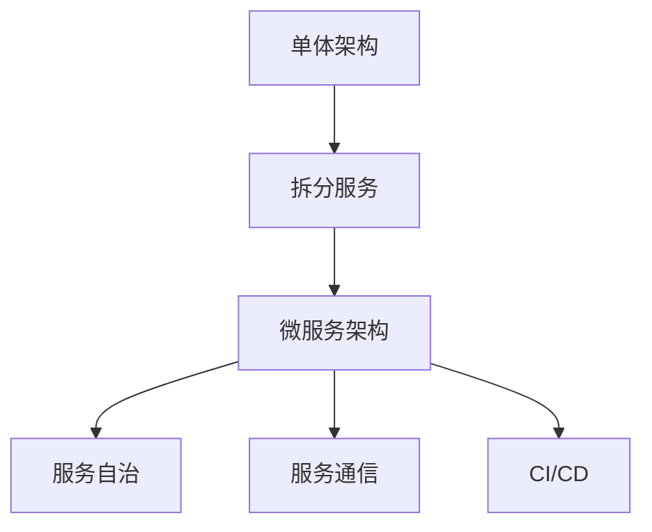

                 

## 1. 背景介绍

在当今的数字化时代，软件系统的复杂性不断增加，如何构建高效、可扩展、可维护的软件架构成为了一个巨大的挑战。微服务架构（Microservice Architecture）作为一种新兴的软件设计范式，逐渐成为解决这一问题的有力工具。本文将详细探讨微服务架构的设计理念、核心概念以及具体实现步骤，并通过实例展示其在实际系统设计中的应用。

## 2. 核心概念与联系

### 2.1 核心概念概述

微服务架构是一种将系统拆分为多个独立、自治的服务单元的设计模式。每个微服务独立运行，具有自己的数据库和配置，通过轻量级的通信机制进行交互。这种架构模式强调服务的自治性、可扩展性、弹性和独立部署等优点，适合复杂、动态和快速变化的软件系统。

核心概念包括：

- **服务拆分**：将系统划分为多个独立的服务单元，每个服务单元负责具体的业务逻辑和数据处理。
- **服务通信**：服务单元之间通过轻量级的通信机制（如RESTful API、消息队列等）进行交互，确保服务间的松耦合和高可靠性。
- **服务自治**：每个服务单元具有独立的数据库、配置和生命周期管理，可以独立部署、扩展和更新。
- **持续集成与部署（CI/CD）**：采用自动化工具和流程，确保代码快速、可靠地集成和部署到生产环境。

### 2.2 核心概念原理和架构的 Mermaid 流程图



这个图展示了单体架构向微服务架构的演进过程，每个服务单元（C）通过自治（D）和通信（E）构成微服务架构，并借助CI/CD（F）实现自动化部署和集成。

### 2.3 核心概念间的关系

微服务架构的设计依赖于以下核心概念：

1. **服务拆分**：基于业务功能的拆分是微服务架构的基础，通过将系统划分为多个独立的服务单元，使每个服务专注于自己的业务逻辑和数据处理。
2. **服务自治**：自治性是指每个服务单元具有独立的数据库、配置和生命周期管理，可以独立部署、扩展和更新，避免系统级故障影响单个服务。
3. **服务通信**：服务单元之间通过轻量级的通信机制进行交互，确保服务的松耦合和高可靠性。
4. **CI/CD**：采用自动化工具和流程，确保代码快速、可靠地集成和部署到生产环境，提高开发效率和系统稳定性。

这些核心概念共同构成了微服务架构的设计框架，使得系统能够更灵活、更高效地应对业务变化和扩展需求。

## 3. 核心算法原理 & 具体操作步骤

### 3.1 算法原理概述

微服务架构的设计原理基于“服务自治、松耦合、独立部署”三大核心思想。每个服务单元独立运行，通过轻量级的通信机制进行交互，具有自己的数据库和配置，可以独立部署、扩展和更新。这种设计模式能够有效提升系统的可扩展性、弹性和维护性。

### 3.2 算法步骤详解

微服务架构的设计和实施通常遵循以下步骤：

1. **服务拆分**：根据业务功能和数据模型，将系统划分为多个独立的服务单元。服务拆分应遵循“单一职责原则”，每个服务负责单一的业务功能。
2. **服务设计**：为每个服务单元设计独立的业务逻辑和数据处理机制，包括数据模型、业务规则和数据存储。
3. **服务自治**：为每个服务单元设计独立的数据库、配置和生命周期管理，确保服务可以独立部署、扩展和更新。
4. **服务通信**：设计轻量级的通信机制，确保服务间的松耦合和高可靠性。常见的通信机制包括RESTful API、消息队列、事件驱动架构等。
5. **持续集成与部署（CI/CD）**：采用自动化工具和流程，确保代码快速、可靠地集成和部署到生产环境，提高开发效率和系统稳定性。

### 3.3 算法优缺点

#### 优点：

1. **高可扩展性**：微服务架构能够轻松应对业务变化和扩展需求，每个服务单元可以独立扩展，不会影响其他服务。
2. **高可靠性**：服务单元通过自治和松耦合设计，即使部分服务故障，其他服务仍能正常运行，系统稳定性高。
3. **高可维护性**：微服务架构使得每个服务单元独立运行和维护，系统复杂度降低，便于开发和维护。

#### 缺点：

1. **复杂性高**：微服务架构的设计和实施相对复杂，需要大量时间和资源。
2. **通信开销大**：服务单元通过轻量级通信机制进行交互，可能导致通信开销增大，影响性能。
3. **故障诊断困难**：微服务架构增加了系统的复杂性，故障诊断和问题定位变得更加困难。

### 3.4 算法应用领域

微服务架构广泛应用于大型企业级系统、金融系统、电商平台、医疗系统等领域。其应用场景包括但不限于：

- **大型企业级系统**：如银行、保险、电商等，系统复杂度高，需要高可扩展性和可维护性。
- **金融系统**：对系统的稳定性和可靠性要求极高，微服务架构能够有效提升系统的可靠性和稳定性。
- **电商平台**：需要支持高并发和高可用，微服务架构能够轻松应对大量用户请求。
- **医疗系统**：医疗系统对系统的可靠性和安全性要求高，微服务架构能够提升系统的稳定性和安全性。

## 4. 数学模型和公式 & 详细讲解

### 4.1 数学模型构建

微服务架构的设计和实施可以通过数学模型来分析和优化。设系统由$n$个服务单元组成，每个服务单元的响应时间为$t_i$，系统总响应时间为$T$。服务间的通信时间开销为$C$。则系统总响应时间$T$可以表示为：

$$
T = \sum_{i=1}^n t_i + nC
$$

其中，$nC$表示服务单元之间的通信时间开销。

### 4.2 公式推导过程

对于单个服务单元，其响应时间$t_i$可以表示为：

$$
t_i = f_i(\text{请求量}) + g_i(\text{处理时间})
$$

其中，$f_i(\text{请求量})$表示服务单元处理请求的时间，$g_i(\text{处理时间})$表示服务单元处理请求所需的时间。

服务单元之间的通信时间开销$C$可以表示为：

$$
C = c_{ij} \times \text{请求量}
$$

其中，$c_{ij}$表示服务单元$i$和$j$之间的通信延迟。

### 4.3 案例分析与讲解

假设系统由3个服务单元组成，每个服务单元的响应时间分别为$t_1=5ms$、$t_2=10ms$、$t_3=15ms$，服务单元之间的通信时间开销为$C=2ms$。则系统总响应时间为：

$$
T = t_1 + t_2 + t_3 + 2 \times (t_1 + t_2 + t_3) = 5 + 10 + 15 + 2 \times (5 + 10 + 15) = 89ms
$$

## 5. 项目实践：代码实例和详细解释说明

### 5.1 开发环境搭建

微服务架构的实现需要多种工具和技术的支持。以下是搭建微服务架构的开发环境的步骤：

1. **选择技术栈**：根据业务需求和技术栈的选择，选择合适的编程语言、框架和数据库。
2. **安装依赖工具**：安装Docker、Kubernetes、Prometheus、Grafana等必要的工具和软件。
3. **搭建开发环境**：在本地或云端搭建开发环境，配置好Docker容器和Kubernetes集群。

### 5.2 源代码详细实现

以下是一个简单的微服务架构的实现示例，通过Spring Cloud和Spring Boot实现：

1. **创建服务模块**：创建多个Spring Boot应用，每个应用负责一个具体的业务功能，如订单服务、库存服务、支付服务等。
2. **设计服务通信**：通过RESTful API实现服务间的通信，确保服务间的松耦合和高可靠性。
3. **实现服务自治**：每个服务单元独立运行，具有自己的数据库和配置，可以独立部署、扩展和更新。

### 5.3 代码解读与分析

以下是微服务架构实现的核心代码：

```java
@SpringBootApplication
public class OrderServiceApplication {

    public static void main(String[] args) {
        SpringApplication.run(OrderServiceApplication.class, args);
    }

    @RestController
    @RequestMapping("/orders")
    public class OrderController {

        @Autowired
        private OrderService orderService;

        @GetMapping("/{id}")
        public Order getOrder(@PathVariable Long id) {
            return orderService.findById(id);
        }

        @PostMapping
        public Order createOrder(@RequestBody Order order) {
            return orderService.save(order);
        }
    }

    @Service
    public class OrderService {

        @Autowired
        private OrderRepository orderRepository;

        public Order findById(Long id) {
            return orderRepository.findById(id).orElse(null);
        }

        public Order save(Order order) {
            return orderRepository.save(order);
        }
    }

    @Configuration
    @EnableAutoConfiguration
    public class OrderServiceConfiguration {

        @Bean
        public OrderRepository orderRepository() {
            return new OrderRepository(JpaConfiguration beans(), entityManagerFactory());
        }

        private EntityManagerFactory entityManagerFactory() {
            // 配置数据库连接
            // ...
            return entityManagerFactory;
        }
    }
}
```

### 5.4 运行结果展示

假设我们在搭建的微服务架构中，实现了订单服务模块。通过运行该模块，我们可以对订单进行查询和新增。以下是具体的运行结果：

- 查询订单结果：
```
GET /orders/1
Response: {"id": 1, "name": "John Doe", "email": "john@example.com", "status": "pending"}
```

- 新增订单结果：
```
POST /orders
Request: {"name": "John Doe", "email": "john@example.com", "status": "pending"}
Response: {"id": 2, "name": "John Doe", "email": "john@example.com", "status": "pending"}
```

## 6. 实际应用场景

### 6.1 大型企业级系统

大型企业级系统需要处理大量复杂的业务逻辑和数据处理，微服务架构能够有效提升系统的可扩展性、弹性和维护性。例如，银行系统可以采用微服务架构，将各个业务功能模块独立运行，提高系统的稳定性和可靠性。

### 6.2 金融系统

金融系统对系统的稳定性和可靠性要求极高，微服务架构能够有效提升系统的可靠性和稳定性。例如，支付系统可以采用微服务架构，每个支付服务单元独立运行，确保支付功能的稳定性和高可用性。

### 6.3 电商平台

电商平台需要支持高并发和高可用，微服务架构能够轻松应对大量用户请求。例如，电商平台可以采用微服务架构，将订单服务、库存服务、支付服务等模块独立运行，确保系统在高并发下的稳定性和可用性。

### 6.4 医疗系统

医疗系统对系统的可靠性和安全性要求高，微服务架构能够提升系统的稳定性和安全性。例如，医院管理系统可以采用微服务架构，将预约服务、诊疗服务、药品管理服务等模块独立运行，确保系统的可靠性和安全性。

## 7. 工具和资源推荐

### 7.1 学习资源推荐

以下是推荐的微服务架构学习资源：

1. **Spring Cloud官方文档**：Spring Cloud是微服务架构的常用技术栈，官方文档提供了详细的微服务架构设计指南和实现示例。
2. **Docker官方文档**：Docker是微服务架构的常用容器化工具，官方文档提供了详细的容器化解决方案和最佳实践。
3. **Kubernetes官方文档**：Kubernetes是微服务架构的常用容器编排工具，官方文档提供了详细的容器编排解决方案和最佳实践。
4. **CloudNative Computing Foundation**：云原生计算基金会，提供丰富的微服务架构和容器化工具的资源和文档。

### 7.2 开发工具推荐

以下是推荐的微服务架构开发工具：

1. **Spring Cloud**：基于Spring Boot的微服务架构解决方案，提供了丰富的服务治理、配置管理、负载均衡等功能。
2. **Docker**：容器化工具，提供轻量级的容器运行环境，适用于微服务架构的部署和扩展。
3. **Kubernetes**：容器编排工具，提供自动化容器部署、扩展和故障恢复等功能。
4. **Prometheus**：监控和报警系统，提供实时的系统监控和告警功能。
5. **Grafana**：可视化工具，提供丰富的图表和仪表盘，方便监控和分析系统性能。

### 7.3 相关论文推荐

以下是推荐的微服务架构相关论文：

1. **《微服务架构：原则与模式》**：本书详细介绍了微服务架构的设计原则和实现模式，是微服务架构领域的经典之作。
2. **《Spring Cloud in Action》**：该书介绍了Spring Cloud在微服务架构中的应用，提供了丰富的实例和代码。
3. **《Cloud Native》**：该书介绍了云原生技术的原理和应用，包括微服务架构、容器化、服务网格等。

## 8. 总结：未来发展趋势与挑战

### 8.1 研究成果总结

微服务架构作为一种新兴的软件设计范式，在过去几年中得到了快速发展和广泛应用。其主要成果包括：

1. **提高了系统的可扩展性和可维护性**：微服务架构将系统划分为多个独立的服务单元，每个服务单元独立运行，能够有效应对业务变化和扩展需求，提高系统的可扩展性和可维护性。
2. **提升了系统的稳定性和可靠性**：微服务架构通过服务自治和松耦合设计，每个服务单元独立运行，能够有效提升系统的稳定性和可靠性。
3. **提高了开发效率和系统稳定性**：微服务架构采用自动化工具和流程，确保代码快速、可靠地集成和部署到生产环境，提高开发效率和系统稳定性。

### 8.2 未来发展趋势

展望未来，微服务架构的发展趋势包括：

1. **服务网格**：服务网格是一种新的微服务架构模式，能够有效提升服务间的通信效率和可靠性，成为微服务架构的重要补充。
2. **容器化**：容器化技术将微服务架构的部署和运维变得更为简单和高效，未来将得到更广泛的应用。
3. **服务治理**：服务治理技术能够有效管理微服务架构中的服务注册、发现、负载均衡等功能，提升系统的稳定性和可靠性。
4. **微服务安全**：微服务架构的安全性问题将得到更多的关注，如何保护微服务架构中的数据和通信安全成为重要的研究方向。

### 8.3 面临的挑战

尽管微服务架构具有诸多优点，但其应用过程中仍面临一些挑战：

1. **复杂性高**：微服务架构的设计和实施相对复杂，需要大量时间和资源。
2. **通信开销大**：服务单元通过轻量级通信机制进行交互，可能导致通信开销增大，影响性能。
3. **故障诊断困难**：微服务架构增加了系统的复杂性，故障诊断和问题定位变得更加困难。
4. **安全性问题**：微服务架构的安全性问题将得到更多的关注，如何保护微服务架构中的数据和通信安全成为重要的研究方向。

### 8.4 研究展望

未来，微服务架构的研究展望包括：

1. **服务网格的进一步发展**：服务网格技术将成为微服务架构的重要补充，能够有效提升服务间的通信效率和可靠性。
2. **微服务架构与云原生技术的融合**：微服务架构与云原生技术的结合，将进一步提升系统的可扩展性、弹性和安全性。
3. **微服务架构的持续集成与部署**：采用自动化工具和流程，确保代码快速、可靠地集成和部署到生产环境，提高开发效率和系统稳定性。

## 9. 附录：常见问题与解答

**Q1：微服务架构和单体架构有什么区别？**

A: 微服务架构和单体架构的最大区别在于服务的拆分和自治。单体架构将所有功能模块集中在一个应用中，微服务架构则将应用划分为多个独立的服务单元，每个服务单元独立运行，具有自己的数据库和配置，可以独立部署、扩展和更新。

**Q2：微服务架构的通信机制有哪些？**

A: 微服务架构的通信机制主要包括RESTful API、消息队列、事件驱动架构等。RESTful API通过HTTP协议进行通信，适用于简单的服务间交互。消息队列和事件驱动架构适用于复杂的、异步的服务间通信。

**Q3：微服务架构的持续集成与部署（CI/CD）如何实现？**

A: 微服务架构的CI/CD可以通过自动化工具和流程实现，如Jenkins、GitLab CI/CD等。通过自动化构建、测试和部署，确保代码快速、可靠地集成和部署到生产环境。

**Q4：微服务架构中如何实现服务自治？**

A: 微服务架构中，每个服务单元具有独立的数据库、配置和生命周期管理，可以独立部署、扩展和更新。通过容器化技术，如Docker，将服务单元打包为容器，确保服务的自治性。

**Q5：微服务架构的优势和劣势有哪些？**

A: 微服务架构的优势包括高可扩展性、高可靠性、高可维护性等。劣势包括复杂性高、通信开销大、故障诊断困难等。需要根据具体业务需求和系统复杂度进行综合考虑。

