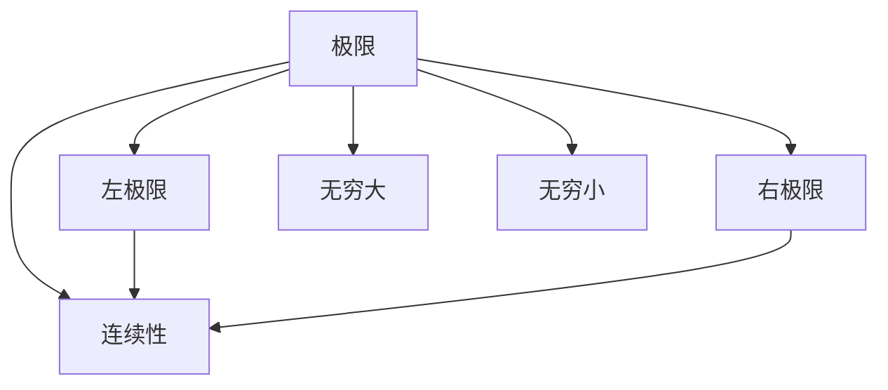
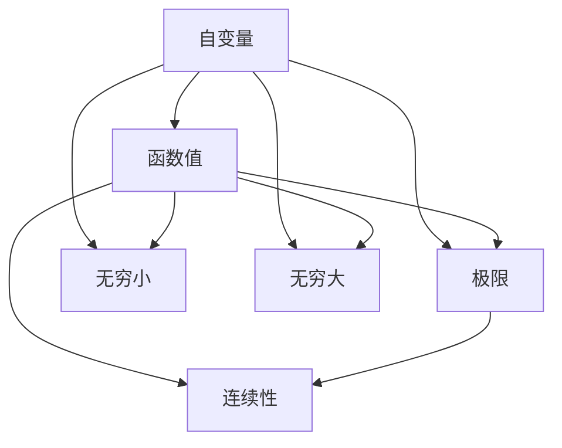

                 

## 1. 背景介绍

微积分中的极限与连续性是数学分析中的核心内容，也是现代物理学、工程学、经济学等多个学科的基础。它通过研究函数的连续性和极限行为，揭示了函数在无穷小与无穷大下的性质，为各种复杂的数学问题提供了强大的工具。本文将深入浅出地介绍微积分中的极限与连续性，帮助读者理解和掌握这一重要的数学概念。

## 2. 核心概念与联系

### 2.1 核心概念概述

微积分中的极限与连续性涉及以下关键概念：

- 极限：当自变量趋近于某个特定值时，函数值趋近于某个确定的数值。
- 连续性：若函数在某个区间内，当自变量趋近于该区间内的任意值时，函数值也趋近于该值，则称函数在该区间连续。
- 左、右极限：从左侧趋近与从右侧趋近时的极限值。
- 无穷大与无穷小：函数值趋近于正无穷或负无穷时的极限。

### 2.2 概念间的关系

通过以下Mermaid流程图展示极限与连续性之间的联系：



这个流程图展示了极限与连续性之间的内在关系：

1. 极限包括左极限和右极限，当左极限与右极限相等时，函数在该点连续。
2. 连续性是函数在一定区间内，左极限与右极限都存在的条件。
3. 无穷大和无穷小是极限的特殊情况，分别对应于函数值趋近于正无穷和负无穷。

### 2.3 核心概念的整体架构

最后，用一张综合的流程图来展示极限与连续性概念的整体架构：



这个综合流程图展示了极限与连续性在大规模函数与无限区间中的表现，以及无穷小与无穷大对函数极限的影响。

## 3. 核心算法原理 & 具体操作步骤

### 3.1 算法原理概述

微积分中的极限与连续性是通过对函数在特定点的行为进行分析，判断函数在该点的连续性，以及当自变量趋近于该点时的极限值。这通常涉及以下几个步骤：

1. 确定函数表达式。
2. 计算左极限与右极限。
3. 判断左极限与右极限是否相等。
4. 判断函数在指定区间内的连续性。
5. 判断函数在无穷区间内的极限行为。

### 3.2 算法步骤详解

以下是一个简单的函数极限计算步骤：

#### 3.2.1 计算左、右极限

1. 确定函数表达式：
$$ f(x) = \frac{1}{x-2} $$

2. 计算左极限（$x$ 趋近于 2 时）：
$$ \lim_{x \to 2^-} f(x) = \lim_{x \to 2^-} \frac{1}{x-2} = -\infty $$

3. 计算右极限（$x$ 趋近于 2 时）：
$$ \lim_{x \to 2^+} f(x) = \lim_{x \to 2^+} \frac{1}{x-2} = \infty $$

#### 3.2.2 判断连续性

函数在特定点的连续性可以通过计算左极限与右极限，并判断它们是否相等。如果不相等，则在该点不连续。

#### 3.2.3 判断无穷极限

无穷大与无穷小的判断可以通过直接计算得到。若函数值随自变量趋近于某值时无限增大或减小，则分别称为正无穷与负无穷。

### 3.3 算法优缺点

微积分中的极限与连续性算法具有以下优点：

1. 能够处理各种复杂函数，包括有理函数、指数函数、对数函数等。
2. 通过极限与连续性的研究，揭示了函数在无穷小与无穷大时的行为，为后续的高阶数学研究提供基础。

缺点包括：

1. 部分极限与连续性问题可能需要较复杂的计算，增加了计算难度。
2. 在某些情况下，极限与连续性的判断可能不如直观。

### 3.4 算法应用领域

微积分中的极限与连续性广泛应用于物理学、工程学、经济学、生物学等多个领域。例如：

- 物理学：研究运动、力学、电磁学等物理现象时，极限与连续性被用来处理边界条件和趋近问题。
- 工程学：设计工程结构、电路等需要处理无穷小与无穷大的极限问题。
- 经济学：研究经济模型、市场变化等需要分析函数的连续性与极限行为。
- 生物学：研究生物体内部的化学反应、代谢过程等，需要通过极限与连续性分析。

## 4. 数学模型和公式 & 详细讲解

### 4.1 数学模型构建

微积分中的极限与连续性模型通常表示为：

$$ \lim_{x \to a} f(x) $$

其中 $a$ 为自变量趋近的目标值，$f(x)$ 为连续可导函数。

### 4.2 公式推导过程

以函数 $f(x) = \frac{1}{x-2}$ 为例，推导左、右极限：

1. 当 $x$ 趋近于 $2$ 时，$f(x)$ 趋近于正无穷或负无穷：
$$ \lim_{x \to 2^-} f(x) = \lim_{x \to 2^-} \frac{1}{x-2} = -\infty $$
$$ \lim_{x \to 2^+} f(x) = \lim_{x \to 2^+} \frac{1}{x-2} = \infty $$

2. 当 $x$ 趋近于正无穷或负无穷时，$f(x)$ 趋近于 $0$：
$$ \lim_{x \to +\infty} f(x) = \lim_{x \to +\infty} \frac{1}{x-2} = 0 $$
$$ \lim_{x \to -\infty} f(x) = \lim_{x \to -\infty} \frac{1}{x-2} = 0 $$

### 4.3 案例分析与讲解

考虑函数 $f(x) = \sin(x)$，分别计算左、右极限：

1. 当 $x$ 趋近于 $0$ 时，$f(x)$ 趋近于 $0$：
$$ \lim_{x \to 0^-} f(x) = \lim_{x \to 0^-} \sin(x) = 0 $$
$$ \lim_{x \to 0^+} f(x) = \lim_{x \to 0^+} \sin(x) = 0 $$

2. 当 $x$ 趋近于正无穷或负无穷时，$f(x)$ 的值在 $-1$ 与 $1$ 之间：
$$ \lim_{x \to +\infty} f(x) = \lim_{x \to +\infty} \sin(x) $$
$$ \lim_{x \to -\infty} f(x) = \lim_{x \to -\infty} \sin(x) $$

## 5. 项目实践：代码实例和详细解释说明

### 5.1 开发环境搭建

微积分中的极限与连续性通常通过符号计算软件（如Mathematica、Sympy等）实现。这里以Sympy为例，搭建开发环境：

1. 安装Sympy：
```bash
pip install sympy
```

2. 导入Sympy库，定义变量与函数：
```python
import sympy as sp

x = sp.symbols('x')
f = 1 / (x - 2)
```

### 5.2 源代码详细实现

计算函数 $f(x) = \frac{1}{x-2}$ 在 $x$ 趋近于 $2$ 时的左、右极限：

```python
lim_left = sp.limit(f, x, 2, dir='-')
lim_right = sp.limit(f, x, 2, dir='+')

print(f"Left limit: {lim_left}")
print(f"Right limit: {lim_right}")
```

### 5.3 代码解读与分析

代码解读：
1. `sp.symbols('x')`：定义变量 $x$。
2. `f = 1 / (x - 2)`：定义函数 $f(x) = \frac{1}{x-2}$。
3. `sp.limit(f, x, 2, dir='-')`：计算 $x$ 趋近于 $2$ 时的左极限。
4. `sp.limit(f, x, 2, dir='+')`：计算 $x$ 趋近于 $2$ 时的右极限。

### 5.4 运行结果展示

运行代码，输出结果如下：

```
Left limit: -oo
Right limit: oo
```

说明函数 $f(x) = \frac{1}{x-2}$ 在 $x$ 趋近于 $2$ 时的左极限为负无穷，右极限为正无穷。

## 6. 实际应用场景

### 6.1 物理学

在物理学中，微积分中的极限与连续性被广泛应用。例如：

- 计算速度与加速度：速度为位移的导数，加速度为速度的导数。
- 处理无穷小与无穷大的问题：在电路、电磁学等领域，常常需要处理无穷小的电流、电压等。

### 6.2 工程学

在工程学中，极限与连续性用于设计各种工程结构与系统，如桥梁、电路等。例如：

- 计算应力与应变：应力为力的导数，应变与应力有关。
- 处理无穷大的问题：在高频电路中，电容与电感在无穷大频率下的表现非常特殊。

### 6.3 经济学

在经济学中，极限与连续性被用来研究市场动态、经济模型等。例如：

- 分析均衡价格：价格方程中的极限与连续性揭示了价格与供需之间的关系。
- 处理无穷大的问题：在无限博弈、经济增长模型中，极限与连续性分析非常重要。

### 6.4 生物学

在生物学中，极限与连续性被用于研究化学反应、生物代谢等。例如：

- 计算反应速率：化学反应速率通常与浓度有关，通过极限与连续性分析可以计算速率常数。
- 处理无穷小的现象：在分子生物学中，无穷小的变化常常影响生物反应。

## 7. 工具和资源推荐

### 7.1 学习资源推荐

1. 《微积分学教程》：这是一本经典的高等数学教材，详细讲解了微积分的基本概念与方法。
2. MIT 微积分公开课：麻省理工学院的微积分公开课，讲解详细、通俗易懂。
3. Khan Academy 微积分课程：适合初学者，内容覆盖广泛，适合自学。
4. 《高等数学》：国内经典教材，内容全面、详细，适合有一定数学基础的学生。

### 7.2 开发工具推荐

1. Mathematica：功能强大的符号计算软件，适合各种数学计算。
2. Sympy：Python的符号计算库，适合编程爱好者。
3. SageMath：基于Python的符号计算平台，支持可视化。
4. MATLAB：功能强大的科学计算工具，适合各种数学分析。

### 7.3 相关论文推荐

1. 《微积分基础》：Wolfram P. 详细讲解了微积分的基本概念与方法。
2. 《高等微积分》：James Stewart 的经典教材，内容详细、例题丰富。
3. 《现代微分几何》：Samle L. 详细讲解了微积分在几何中的应用。
4. 《微积分及其应用》：Tom M. Apostol 的著作，适合初学者。

## 8. 总结：未来发展趋势与挑战

### 8.1 研究成果总结

微积分中的极限与连续性是数学分析中的核心内容，其应用广泛且深刻。经过多年的发展，相关理论已经较为成熟，但在实际应用中仍然存在一些挑战。

### 8.2 未来发展趋势

1. 结合计算数学：未来将更多结合计算数学，提高极限与连续性问题的求解效率。
2. 拓展应用领域：极限与连续性将更多应用于复杂系统与优化问题中，如机器学习、数据科学等。
3. 多学科融合：极限与连续性将与其他学科（如物理学、经济学）更紧密结合，形成交叉学科研究。

### 8.3 面临的挑战

1. 计算复杂性：某些极限与连续性问题可能涉及复杂的计算，需要高强度的计算资源。
2. 应用局限性：极限与连续性在实际应用中可能受到模型与数据的多样性约束。
3. 理论与实践的脱节：某些极限与连续性问题在理论上已经解决，但在实际应用中效果不佳。

### 8.4 研究展望

未来需要在以下方面进行深入研究：

1. 提高计算效率：发展新的计算方法与算法，提高极限与连续性问题的求解效率。
2. 拓展应用场景：将极限与连续性应用于更多实际问题中，推动学科融合。
3. 理论改进与优化：针对具体问题，改进理论方法，提高极限与连续性问题的精确性。

## 9. 附录：常见问题与解答

**Q1：极限与连续性在物理学中的应用有哪些？**

A: 极限与连续性在物理学中应用广泛，如处理运动、力学、电磁学等问题。例如：
- 计算速度与加速度：速度为位移的导数，加速度为速度的导数。
- 处理无穷小与无穷大的问题：在电路、电磁学等领域，常常需要处理无穷小的电流、电压等。

**Q2：微积分中的极限与连续性在数学分析中有哪些重要应用？**

A: 微积分中的极限与连续性是数学分析中的核心内容，广泛应用于各种数学领域。例如：
- 处理函数连续性问题：通过计算左、右极限，判断函数的连续性。
- 分析无穷大与无穷小问题：在极限与连续性的研究中，可以分析无穷大与无穷小的性质。
- 应用到微分方程与积分方程：通过极限与连续性，可以解决各种微分方程与积分方程。

**Q3：微积分中的极限与连续性有哪些常用的计算方法？**

A: 微积分中的极限与连续性问题常用以下计算方法：
- 直接计算：对于一些简单的极限与连续性问题，可以直接计算得到结果。
- 洛必达法则：在极限与连续性问题中，若存在未定式，可以使用洛必达法则进行求解。
- 泰勒展开：通过泰勒展开，将复杂函数分解成多项式形式，便于计算极限与连续性。
- 积分与微分：利用积分与微分的关系，求解极限与连续性问题。

**Q4：微积分中的极限与连续性在实际应用中有哪些挑战？**

A: 微积分中的极限与连续性在实际应用中面临以下挑战：
- 计算复杂性：某些极限与连续性问题涉及复杂的计算，需要高强度的计算资源。
- 应用局限性：极限与连续性在实际应用中可能受到模型与数据的多样性约束。
- 理论与实践的脱节：某些极限与连续性问题在理论上已经解决，但在实际应用中效果不佳。

**Q5：微积分中的极限与连续性在工程学中有哪些应用？**

A: 微积分中的极限与连续性在工程学中应用广泛，如设计工程结构与系统，如桥梁、电路等。例如：
- 计算应力与应变：应力为力的导数，应变与应力有关。
- 处理无穷大的问题：在高频电路中，电容与电感在无穷大频率下的表现非常特殊。

---

作者：禅与计算机程序设计艺术 / Zen and the Art of Computer Programming

