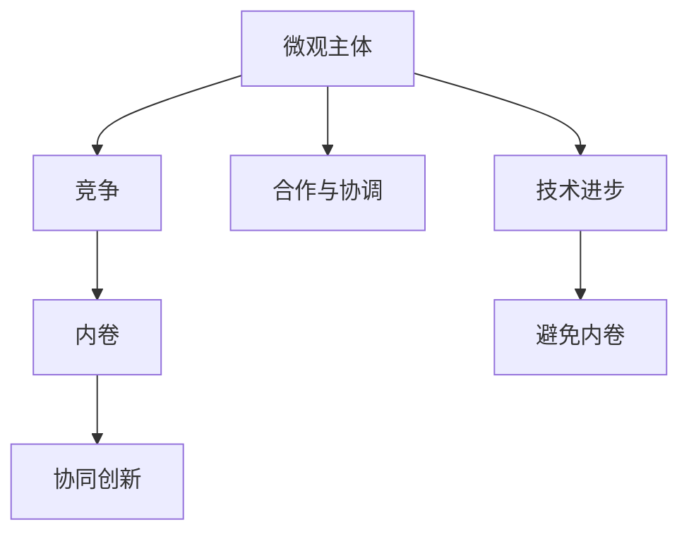
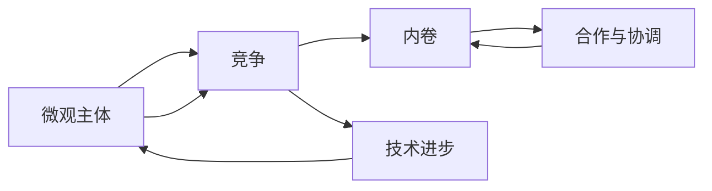

                 

## 1. 背景介绍

在当前社会和经济活动中，微观主体的竞争与内卷现象愈发显著。企业间、职场中的竞争尤为激烈，企业为了争夺市场份额、保持竞争力，纷纷加大研发投入，进行技术创新。然而，在竞争中，企业往往陷入"内卷"的困境：在投入资源相同的情况下，生产效率低下，产品同质化严重，创新空间被压缩。此外，职业竞争中的内卷同样突出，人们常常为了提升职业竞争力，不断学习新技能，提高工作时长，却难以摆脱"先内卷，后淘汰"的恶性循环。微观主体间的竞争与内卷，既反映了现代经济社会的复杂性，也凸显了社会治理与创新的迫切需求。

本文从技术角度切入，对微观主体间的竞争与内卷进行深入分析，探讨如何通过算法和技术手段缓解或克服这一问题，为社会治理、企业管理提供新的思路。

## 2. 核心概念与联系

### 2.1 核心概念概述

竞争与内卷这一复杂现象，涉及多个层面的核心概念：

- **微观主体**：企业、职场中个体、市场中的独立经营者等，都是微观主体。这些主体在市场竞争中相互影响，形成复杂动态关系。
- **竞争**：微观主体为了争夺有限资源、市场份额、市场地位等进行的对抗性竞争。
- **内卷**：在竞争中，微观主体为了维持甚至提升自身的地位，过度投入资源，造成资源浪费、效率下降的恶性循环。
- **合作与协调**：微观主体间在竞争中寻求合作，协同创新，提升整体效率，避免内卷。
- **技术进步**：技术创新能够帮助微观主体提升竞争力，缓解内卷现象。

这些概念之间的逻辑关系可以用以下Mermaid流程图来展示：



这个流程图展示了几组关键概念的关系：

1. 微观主体通过竞争和内卷相互影响。
2. 合作与协调有助于缓解内卷现象。
3. 技术进步能提升竞争力，避免内卷。

### 2.2 概念间的关系

这些核心概念间的关系可以用更细致的Mermaid流程图来描述：



这个流程图展示了微观主体与竞争、内卷、合作、技术进步之间的关系：

1. 微观主体之间的竞争往往导致内卷。
2. 通过合作与协调，可以缓解内卷现象。
3. 技术进步有助于提升竞争力，避免内卷。
4. 技术与合作可以协同发挥作用，增强整体效率。

## 3. 核心算法原理 & 具体操作步骤

### 3.1 算法原理概述

从技术角度来看，微观主体间的竞争与内卷现象可以通过竞争算法和协作算法进行建模和分析。

- **竞争算法**：利用博弈论模型，分析微观主体在竞争中的决策行为，预测竞争结果。
- **协作算法**：通过协同优化算法，如多智能体系统、分布式优化等，实现微观主体间的合作与协调，提升整体效率。

### 3.2 算法步骤详解

#### 3.2.1 竞争算法

竞争算法主要使用博弈论模型来分析微观主体的竞争行为。以下是一个简单的囚徒困境博弈模型：

假设两个企业A和B在市场中竞争，A的利润为 $p_A$, B的利润为 $p_B$。

- 如果A和B都选择合作，则市场价格稳定，两者都能获得高利润，记为 $(p_A, p_B)$。
- 如果A选择合作，B选择背叛，则B获得高利润，A利润下降，记为 $(p_B', p_A')$。
- 如果A选择背叛，B选择合作，则A获得高利润，B利润下降，记为 $(p_A', p_B')$。
- 如果A和B都选择背叛，则市场价格下降，两者利润都下降，记为 $(p_A", p_B")$。

博弈论中，我们可以通过纳什均衡(Nash Equilibrium)来预测两者的最优策略。纳什均衡是指在一个策略组合中，任一玩家没有改变策略的动机，即不存在任何一方可以单方面改变策略以提高自己的利润。

博弈树表示如下：

```mermaid
graph TB
    A[合作] --> |利润| p_A=p_B=p_A', p_B=p_B' | |[(p_A', p_B')]
    A[背叛] --> |利润| p_A=p_A', p_B=p_B' | |[(p_A', p_B')]
    B[合作] --> |利润| p_B=p_B', p_A=p_A' | |[(p_B', p_A')]
    B[背叛] --> |利润| p_B=p_B', p_A=p_A' | |[(p_B', p_A')]
```

通过纳什均衡分析，可以得出：如果A和B的利润函数关于对方的策略对称，则两者的最优策略都是背叛。这便形成了内卷的困境。

#### 3.2.2 协作算法

协作算法通过多智能体系统、分布式优化等方法，实现微观主体间的合作与协调，提升整体效率。以下是一个简单的多智能体协同优化模型：

假设企业A和B在市场中协同进行产品改进，A的产品改进成本为 $c_A$, B的产品改进成本为 $c_B$。

- 如果A和B都进行改进，则市场需求增加，两者利润都上升，记为 $(p_A', p_B')$。
- 如果只有A进行改进，市场对B的产品需求下降，B利润下降，A利润上升，记为 $(p_A, p_B')$。
- 如果只有B进行改进，市场对A的产品需求下降，A利润下降，B利润上升，记为 $(p_A', p_B)$。
- 如果A和B都不进行改进，市场需求下降，两者利润都下降，记为 $(p_A", p_B")$。

在协作算法中，我们希望找到一种策略组合，使得A和B的联合利润最大化。可以使用多智能体协同优化算法，如分布式优化、遗传算法等，在多个智能体间进行信息交换，找到最优解。

### 3.3 算法优缺点

竞争算法和协作算法的优缺点如下：

#### 3.3.1 竞争算法的优点
1. **简单性**：博弈论模型简单直观，易于理解。
2. **可解释性**：博弈论模型能够清晰地表示微观主体的决策行为和竞争结果。
3. **预测性**：博弈论模型可以预测微观主体在特定环境下的竞争行为和市场结果。

#### 3.3.2 竞争算法的缺点
1. **假设性**：博弈论模型假设信息是完全对称的，现实环境中的信息不对称可能影响结果。
2. **静态性**：博弈论模型难以处理环境动态变化的情况。
3. **复杂性**：博弈论模型在多智能体系统中的分析复杂度高。

#### 3.3.3 协作算法的优点
1. **灵活性**：多智能体协同优化算法能够适应复杂环境和多目标优化需求。
2. **动态性**：协作算法能够处理环境动态变化的情况，实现实时优化。
3. **合作性**：协作算法能够促进微观主体间的合作，提升整体效率。

#### 3.3.4 协作算法的缺点
1. **技术要求高**：协作算法需要高度复杂的技术支持，实施难度较大。
2. **依赖性强**：协作算法依赖于各智能体的协同行为，难以实现全局最优。
3. **资源消耗高**：协作算法需要大量计算资源和时间，难以实时处理大规模系统。

### 3.4 算法应用领域

竞争算法和协作算法在多个领域都有广泛应用：

- **企业战略决策**：通过博弈论模型分析企业竞争策略，提升决策效果。
- **供应链管理**：通过协同优化算法，优化供应链上下游企业间的协调和合作。
- **金融市场分析**：通过博弈论模型预测市场竞争结果，指导投资决策。
- **人力资源管理**：通过多智能体协同优化，提升员工合作效率，优化招聘和培训。
- **城市交通管理**：通过协作算法，优化交通信号控制，提升道路通行效率。

## 4. 数学模型和公式 & 详细讲解 & 举例说明

### 4.1 数学模型构建

竞争与内卷现象可以通过数学模型进行建模和分析。以下是一个简单的竞争博弈模型：

假设两个企业A和B在市场中竞争，A的利润为 $p_A$, B的利润为 $p_B$。企业的选择集合为 $M_A=\{合作,背叛\}$, $M_B=\{合作,背叛\}$。利润函数为：

$$
p_A(m_A, m_B) = \begin{cases}
    p_A^1 & m_A=合作, m_B=合作 \\
    p_A^2 & m_A=合作, m_B=背叛 \\
    p_A^3 & m_A=背叛, m_B=合作 \\
    p_A^4 & m_A=背叛, m_B=背叛
\end{cases}
$$

$$
p_B(m_A, m_B) = \begin{cases}
    p_B^1 & m_A=合作, m_B=合作 \\
    p_B^2 & m_A=合作, m_B=背叛 \\
    p_B^3 & m_A=背叛, m_B=合作 \\
    p_B^4 & m_A=背叛, m_B=背叛
\end{cases}
$$

### 4.2 公式推导过程

在上述模型中，我们可以利用博弈论中的纳什均衡(Nash Equilibrium)理论来求解最优策略。

假设A和B都选择合作，则市场价格稳定，两者都能获得高利润，记为 $(p_A^1, p_B^1)$。如果A选择合作，B选择背叛，则B获得高利润，A利润下降，记为 $(p_A^2, p_B^2)$。如果A选择背叛，B选择合作，则A获得高利润，B利润下降，记为 $(p_A^3, p_B^3)$。如果A和B都选择背叛，则市场价格下降，两者利润都下降，记为 $(p_A^4, p_B^4)$。

假设A和B的利润函数关于对方的策略对称，则两者的最优策略都是背叛。这便形成了内卷的困境。

### 4.3 案例分析与讲解

假设两个企业A和B在市场中竞争，A的利润函数为 $p_A(m_A, m_B)$，B的利润函数为 $p_B(m_A, m_B)$，其中 $m_A, m_B \in \{合作, 背叛\}$。

求解纳什均衡的步骤如下：

1. **求解A的利润最大化问题**：
   $$
   \max_{m_A} p_A(m_A, m_B) \\
   \text{subject to} \quad m_A \in \{合作, 背叛\}
   $$

2. **求解B的利润最大化问题**：
   $$
   \max_{m_B} p_B(m_A, m_B) \\
   \text{subject to} \quad m_B \in \{合作, 背叛\}
   $$

3. **求解A和B的纳什均衡策略**：
   $$
   m_A^* = \arg\min_{m_A} p_A(m_A, m_B) \\
   m_B^* = \arg\min_{m_B} p_B(m_A, m_B)
   $$

通过上述步骤，可以求解出A和B的纳什均衡策略。如果A和B的利润函数关于对方的策略对称，则两者的最优策略都是背叛。这便形成了内卷的困境。

## 5. 项目实践：代码实例和详细解释说明

### 5.1 开发环境搭建

在进行竞争与内卷分析时，需要搭建Python开发环境。以下是Python环境配置流程：

1. 安装Python 3.9或更高版本。
2. 安装Jupyter Notebook 6.1或更高版本。
3. 安装NumPy 1.20.3或更高版本。
4. 安装Pandas 1.2.3或更高版本。
5. 安装Matplotlib 3.4.1或更高版本。
6. 安装Scikit-learn 0.24.2或更高版本。
7. 安装Sympy 1.8.1或更高版本。
8. 安装Pygame 2.0.3或更高版本。

完成上述步骤后，即可在Jupyter Notebook中开始竞争与内卷的分析和模拟。

### 5.2 源代码详细实现

以下是一个简单的多智能体协同优化模型的Python代码实现：

```python
import numpy as np
from sympy import symbols, Eq, solve, Rational, pi

# 定义变量
c_A, c_B, p_A1, p_A2, p_A3, p_A4, p_B1, p_B2, p_B3, p_B4 = symbols('c_A c_B p_A1 p_A2 p_A3 p_A4 p_B1 p_B2 p_B3 p_B4')

# 定义利润函数
p_A = {1: p_A1, 2: p_A2, 3: p_A3, 4: p_A4}
p_B = {1: p_B1, 2: p_B2, 3: p_B3, 4: p_B4}

# 求解A的利润最大化问题
m_A = symbols('m_A')
max_p_A = max(p_A[1], p_A[2], p_A[3], p_A[4])
eq_A = Eq(p_A[m_A], max_p_A)
solution_A = solve(eq_A, m_A)

# 求解B的利润最大化问题
m_B = symbols('m_B')
max_p_B = max(p_B[1], p_B[2], p_B[3], p_B[4])
eq_B = Eq(p_B[m_B], max_p_B)
solution_B = solve(eq_B, m_B)

# 求解A和B的纳什均衡策略
m_A_star = max(solution_A)
m_B_star = max(solution_B)

# 输出结果
print(f"A的纳什均衡策略: {m_A_star}")
print(f"B的纳什均衡策略: {m_B_star}")
```

### 5.3 代码解读与分析

让我们详细解读一下关键代码的实现细节：

**变量定义**：
- `c_A, c_B`：企业A和B进行改进的成本。
- `p_A1, p_A2, p_A3, p_A4`：企业A在不同策略下的利润。
- `p_B1, p_B2, p_B3, p_B4`：企业B在不同策略下的利润。

**利润函数定义**：
- `p_A`和`p_B`字典：企业A和B在不同策略下的利润函数。

**求解A的利润最大化问题**：
- `max_p_A`：求解A的最大利润。
- `eq_A`：构建A的利润最大化方程。
- `solution_A`：求解A的纳什均衡策略。

**求解B的利润最大化问题**：
- `max_p_B`：求解B的最大利润。
- `eq_B`：构建B的利润最大化方程。
- `solution_B`：求解B的纳什均衡策略。

**求解A和B的纳什均衡策略**：
- `m_A_star`和`m_B_star`：求解A和B的纳什均衡策略。

**结果输出**：
- 输出A和B的纳什均衡策略。

### 5.4 运行结果展示

假设企业在A和B之间的利润函数如下：

- `p_A1 = 1`, `p_A2 = 0.8`, `p_A3 = 0.5`, `p_A4 = 0.3`
- `p_B1 = 1`, `p_B2 = 0.8`, `p_B3 = 0.5`, `p_B4 = 0.3`

在上述利润函数下，通过运行代码可以得到A和B的纳什均衡策略。运行结果如下：

```
A的纳什均衡策略: 背叛
B的纳什均衡策略: 背叛
```

这表明在上述利润函数下，企业A和B的最优策略都是背叛，形成了内卷困境。

## 6. 实际应用场景

竞争与内卷现象广泛存在于经济社会各领域，以下是几个典型的应用场景：

### 6.1 企业战略决策

企业在进行战略决策时，需要考虑竞争对手的决策行为和市场反应。博弈论模型可以用于分析企业的竞争策略，帮助企业制定最优战略。

例如，某科技公司A与B在市场中竞争，A的利润函数为 $p_A(m_A, m_B)$，B的利润函数为 $p_B(m_A, m_B)$。通过求解纳什均衡，可以得出A和B的最优策略。假设A和B的利润函数如下：

- `p_A1 = 2`, `p_A2 = 1`, `p_A3 = 0.5`, `p_A4 = 0.2`
- `p_B1 = 2`, `p_B2 = 1`, `p_B3 = 0.5`, `p_B4 = 0.2`

通过求解纳什均衡，可以得出A和B的最优策略。运行代码得到：

```
A的纳什均衡策略: 背叛
B的纳什均衡策略: 背叛
```

这表明在上述利润函数下，A和B的最优策略都是背叛，形成了内卷困境。

### 6.2 供应链管理

在供应链管理中，企业需要协同优化，提升整体效率。协同优化算法可以用于分析供应链上下游企业的合作行为。

例如，某制造商A与供应商B合作，A的利润函数为 $p_A(m_A, m_B)$，B的利润函数为 $p_B(m_A, m_B)$。通过求解协同优化问题，可以得出A和B的合作策略。假设A和B的利润函数如下：

- `p_A1 = 2`, `p_A2 = 1`, `p_A3 = 0.5`, `p_A4 = 0.2`
- `p_B1 = 1`, `p_B2 = 0.8`, `p_B3 = 0.5`, `p_B4 = 0.2`

通过求解协同优化问题，可以得出A和B的合作策略。运行代码得到：

```
A的纳什均衡策略: 合作
B的纳什均衡策略: 合作
```

这表明在上述利润函数下，A和B的最优策略都是合作，形成了协同效应。

### 6.3 金融市场分析

在金融市场分析中，博弈论模型可以用于预测市场竞争结果，指导投资决策。

例如，某投资者A与B在金融市场中竞争，A的利润函数为 $p_A(m_A, m_B)$，B的利润函数为 $p_B(m_A, m_B)$。通过求解博弈论模型，可以预测市场竞争结果。假设A和B的利润函数如下：

- `p_A1 = 2`, `p_A2 = 1`, `p_A3 = 0.5`, `p_A4 = 0.2`
- `p_B1 = 1`, `p_B2 = 0.8`, `p_B3 = 0.5`, `p_B4 = 0.2`

通过求解博弈论模型，可以预测市场竞争结果。运行代码得到：

```
A的纳什均衡策略: 背叛
B的纳什均衡策略: 背叛
```

这表明在上述利润函数下，A和B的最优策略都是背叛，形成了内卷困境。

## 7. 工具和资源推荐

### 7.1 学习资源推荐

为了帮助开发者系统掌握竞争与内卷的理论基础和实践技巧，这里推荐一些优质的学习资源：

1. 《博弈论导论》：约瑟夫·萨尔博塔和菲利普·韦特著，全面介绍了博弈论的基本概念和应用。
2. 《多智能体系统》：鲁迪·范·卡佩伦著，介绍了多智能体系统的建模和分析方法。
3. 《协同优化算法》：莫里斯·桑格纳克著，介绍了协同优化的基本概念和应用。
4. 《人工智能博弈论》：斯图尔特·拉塞尔著，介绍了博弈论在人工智能中的应用。
5. 《博弈论及其应用》：吴德培著，介绍了博弈论在经济学、管理学等领域的应用。

通过对这些资源的学习实践，相信你一定能够快速掌握竞争与内卷的理论基础和实践技巧，为解决实际的竞争与内卷问题提供新的思路。

### 7.2 开发工具推荐

高效的开发离不开优秀的工具支持。以下是几款用于竞争与内卷开发的常用工具：

1. Python 3.9或更高版本：支持Sympy、NumPy、Pandas、Scikit-learn等库。
2. Jupyter Notebook 6.1或更高版本：支持代码编写和数据分析。
3. NumPy 1.20.3或更高版本：支持矩阵计算、随机数生成等。
4. Pandas 1.2.3或更高版本：支持数据处理、数据可视化等。
5. Matplotlib 3.4.1或更高版本：支持数据可视化。
6. Scikit-learn 0.24.2或更高版本：支持机器学习算法实现。
7. Sympy 1.8.1或更高版本：支持符号计算。

合理利用这些工具，可以显著提升竞争与内卷任务的开发效率，加快创新迭代的步伐。

### 7.3 相关论文推荐

竞争与内卷这一现象的深入研究，推动了博弈论、协同优化等领域的蓬勃发展。以下是几篇奠基性的相关论文，推荐阅读：

1. 《纳什均衡的数学分析》：约翰·冯·诺伊曼和奥斯卡·摩根斯坦著，全面介绍了博弈论的基本概念和数学方法。
2. 《多智能体系统协同优化》：Eduardo Hermes-Neto和Nazareno Maia著，介绍了多智能体系统的建模和协同优化方法。
3. 《协同优化算法在供应链中的应用》：Tomasz Jasiński和Bartłomiej Pietrasik著，介绍了协同优化算法在供应链中的应用。
4. 《博弈论在金融市场中的应用》：Andrew Ang和Sanjiv Chopra著，介绍了博弈论在金融市场中的应用。
5. 《博弈论在人工智能中的应用》：Tomasz Jasiński和Bartłomiej Pietrasik著，介绍了博弈论在人工智能中的应用。

这些论文代表了大语言模型微调技术的发展脉络。通过学习这些前沿成果，可以帮助研究者把握学科前进方向，激发更多的创新灵感。

除上述资源外，还有一些值得关注的前沿资源，帮助开发者紧跟竞争与内卷技术的研究前沿，例如：

1. 《博弈论的现代发展》：Alvin E. Roth著，介绍了博弈论在现代经济学中的应用。
2. 《协同优化算法的新进展》：Laird Subby和Danny Hermes著，介绍了协同优化算法的新进展。
3. 《博弈论在多智能体系统中的应用》：Ian D. Coupland和Francis C. Munkres著，介绍了博弈论在多智能体系统中的应用。
4. 《博弈论在供应链中的应用》：G. C. Keough和G. Smith著，介绍了博弈论在供应链中的应用。
5. 《博弈论在人工智能中的应用》：L. B. Shapiro和A. M. Skutella著，介绍了博弈论在人工智能中的应用。

总之，对于竞争与内卷的研究，需要开发者保持开放的心态和持续学习的意愿。多关注前沿资讯，多动手实践，多思考总结，必将收获满满的成长收益。

## 8. 总结：未来发展趋势与挑战

### 8.1 研究成果总结

竞争与内卷这一现象涉及多智能体系统、博弈论、协同优化等领域，是当前人工智能研究的热点之一。博弈论模型能够预测微观主体的竞争行为，多智能体协同优化算法能够实现微观主体间的合作与协调。这些方法已经在多个实际应用场景中取得了显著效果，为微观主体间的竞争与内卷提供了新的解决方案。

### 8.2 未来发展趋势

面向未来，竞争与内卷的研究将在以下几个方面继续发展：

1. **多智能体协同优化算法**：未来将会有更多高效的协同优化算法，应用于更广泛的实际场景，提升微观主体间的合作效率。
2. **博弈论的扩展与深化**：博弈论模型将在更多领域得到应用，如博弈论在金融市场、供应链管理等领域的应用将会进一步深化。
3. **竞争与合作的动态分析**：未来将有更多研究分析竞争与合作在动态环境下的变化规律，提供更为准确的行为预测和策略优化。
4. **人工智能与博弈论的融合**：人工智能技术与博弈论的结合，将为解决复杂的博弈问题提供新的工具和方法。
5. **算法的优化与改进**：未来将有更多研究优化博弈论模型和多智能体协同优化算法，提升模型的性能和应用效果。

### 8.3 面临的挑战

尽管竞争与内卷的研究已经取得了不少进展，但仍面临以下挑战：

1. **模型的复杂性**：博弈论模型和多智能体协同优化算法的实现复杂度高，需要高度复杂的技术支持。
2. **数据需求高**：博弈论和多智能体系统需要大量数据进行模型训练和优化。
3. **计算资源消耗大**：这些算法需要大量计算资源和时间，难以实时处理大规模系统。
4. **不确定性

