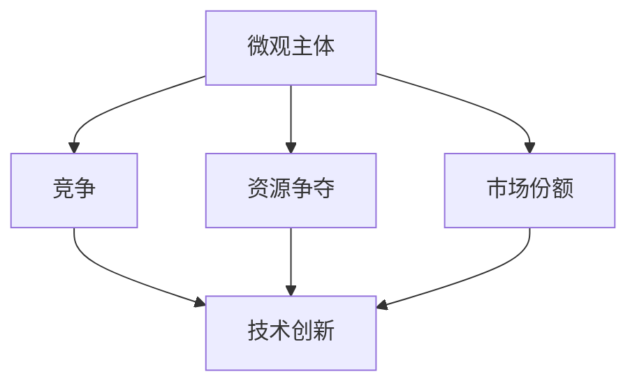

                 

# 微观主体间竞争与内卷增多

## 1. 背景介绍

在当前快速发展的互联网经济中，竞争变得愈发激烈。无论是大型科技公司还是初创企业，都在不断地进行技术革新和市场拓展，希望在激烈的竞争中脱颖而出。然而，随着市场的饱和，企业的增长空间变得有限，微观主体间（企业、个人）的竞争与内卷问题变得越来越严重。

### 1.1 问题由来

- **市场饱和**：互联网行业的增长空间已经接近上限，市场竞争变得白热化。
- **技术壁垒降低**：随着技术的发展，进入壁垒降低，更多的企业可以参与竞争。
- **用户需求变化**：用户需求日益个性化，企业需要不断创新以满足多样化的需求。

### 1.2 问题核心关键点

- **资源争夺**：包括人力、资金、技术等资源。
- **市场份额**：企业通过各种手段争夺市场份额，保持或提升其市场地位。
- **技术创新**：不断创新以保持竞争优势，避免被淘汰。

### 1.3 问题研究意义

研究微观主体间的竞争与内卷问题，对于理解市场动态、优化资源配置、提升企业竞争力具有重要意义。

## 2. 核心概念与联系

### 2.1 核心概念概述

- **微观主体**：指企业、个人等市场中的基本单位。
- **竞争**：指微观主体间为了争夺资源或市场份额而进行的对抗。
- **内卷**：指微观主体为了保持或提升竞争优势，采取过度竞争的策略，导致资源浪费和效率降低。

### 2.2 概念间的关系

这些核心概念之间的关系可以通过以下Mermaid流程图来展示：



这个流程图展示了微观主体间的竞争关系，以及资源争夺、市场份额和技术创新等关键因素。

## 3. 核心算法原理 & 具体操作步骤

### 3.1 算法原理概述

微观主体间的竞争与内卷问题，本质上是一个多主体博弈问题。每个微观主体都希望通过最优策略来最大化自己的收益，而这种最优策略的选择，取决于市场环境、资源条件、技术优势等多个因素。

形式化地，设市场中有 $n$ 个微观主体，每个主体 $i$ 的收益函数为 $U_i$，资源量为 $R$，技术水平为 $T$。则所有主体的总收益为：

$$
U = \sum_{i=1}^n U_i
$$

每个主体的最优策略选择，需要通过最大化自己的收益函数 $U_i$ 来实现。因此，微观主体间的竞争问题可以转化为优化问题，即：

$$
\max_{U_i} \sum_{i=1}^n U_i
$$

其中，约束条件包括资源量 $R$ 和市场份额的分配，以及技术水平 $T$ 的提升。

### 3.2 算法步骤详解

微观主体间的竞争与内卷问题解决，通常需要以下步骤：

**Step 1: 市场分析**
- 分析市场环境、资源分布、用户需求等关键因素。

**Step 2: 资源配置**
- 根据市场分析结果，合理配置资源，包括人力、资金、技术等。

**Step 3: 技术创新**
- 通过研发、合作等方式提升技术水平，增强竞争力。

**Step 4: 竞争策略**
- 制定竞争策略，包括市场定位、产品策略、定价策略等。

**Step 5: 内卷预防**
- 通过规则制定、市场监管等方式，防止过度竞争和资源浪费。

### 3.3 算法优缺点

微观主体间竞争与内卷问题的解决策略，具有以下优点：

- **增强竞争力**：通过合理的资源配置和技术创新，提升微观主体的市场竞争力。
- **防止内卷**：通过市场监管和规则制定，防止资源浪费和过度竞争。

但同时也存在一些缺点：

- **策略风险**：竞争策略的制定可能存在风险，如果策略错误，可能导致资源浪费和收益下降。
- **技术成本高**：技术创新需要大量投入，风险较高。

### 3.4 算法应用领域

微观主体间竞争与内卷问题的解决策略，广泛应用于以下领域：

- **互联网企业**：通过市场分析、资源配置和技术创新，提升竞争力，防止内卷。
- **初创企业**：通过合理策略和资源配置，避免在激烈的市场竞争中被淘汰。
- **技术研发**：通过研发新技术，保持竞争优势，避免技术落后。

## 4. 数学模型和公式 & 详细讲解

### 4.1 数学模型构建

在数学上，微观主体间的竞争与内卷问题可以建模为一个多主体博弈问题。假设有 $n$ 个微观主体，每个主体 $i$ 的收益函数为 $U_i$，市场总收益为 $U$。

设每个主体的资源量为 $R_i$，技术水平为 $T_i$，则市场总资源量为 $R$，总技术水平为 $T$。

微观主体的收益函数 $U_i$ 可以表示为：

$$
U_i = f_i(R_i, T_i, U)
$$

其中，$f_i$ 是收益函数的具体形式，可以是线性、二次、非线性等。

### 4.2 公式推导过程

以两个微观主体为例，假设市场总收益为 $U$，每个主体的资源量和技术水平分别为 $R_1, R_2, T_1, T_2$，收益函数为 $U_1, U_2$，则市场总收益可以表示为：

$$
U = U_1 + U_2
$$

假设 $R_1 + R_2 = R, T_1 + T_2 = T$，则有：

$$
U_1 = f_1(R_1, T_1, U)
$$
$$
U_2 = f_2(R_2, T_2, U)
$$

为了使市场总收益 $U$ 最大化，需要求解以下优化问题：

$$
\max_{R_1, R_2, T_1, T_2} U
$$

约束条件为：

$$
R_1 + R_2 = R
$$
$$
T_1 + T_2 = T
$$

这个问题可以通过拉格朗日乘数法求解。引入拉格朗日乘子 $\lambda, \mu$，构建拉格朗日函数：

$$
\mathcal{L}(R_1, R_2, T_1, T_2, \lambda, \mu) = U_1 + U_2 - \lambda(R_1 + R_2 - R) - \mu(T_1 + T_2 - T)
$$

对 $R_1, R_2, T_1, T_2$ 求偏导数，并令偏导数为零，得到最优解为：

$$
R_1^* = \frac{R \frac{\partial U_1}{\partial R_1}}{R_1 + R_2 \frac{\partial U_1}{\partial R_2}}
$$
$$
R_2^* = \frac{R \frac{\partial U_2}{\partial R_2}}{R_1 + R_2 \frac{\partial U_2}{\partial R_1}}
$$
$$
T_1^* = \frac{T \frac{\partial U_1}{\partial T_1}}{T_1 + T_2 \frac{\partial U_1}{\partial T_2}}
$$
$$
T_2^* = \frac{T \frac{\partial U_2}{\partial T_2}}{T_1 + T_2 \frac{\partial U_2}{\partial T_1}}
$$

### 4.3 案例分析与讲解

以一个简单的例子来说明如何应用数学模型解决微观主体间竞争与内卷问题。

假设市场上有两个企业 $A$ 和 $B$，它们的收益函数分别为 $U_A$ 和 $U_B$，市场总收益为 $U$，每个企业的资源量和技术水平分别为 $R_A, T_A, R_B, T_B$。

企业的收益函数为：

$$
U_A = R_A + T_A - \frac{1}{2}R_A^2 - \frac{1}{2}T_A^2
$$
$$
U_B = R_B + T_B - \frac{1}{2}R_B^2 - \frac{1}{2}T_B^2
$$

市场总收益为：

$$
U = U_A + U_B
$$

市场总资源量为 $R = 4$，总技术水平为 $T = 2$。

通过求解上述优化问题，得到最优解为：

$$
R_A^* = \frac{R \frac{\partial U_A}{\partial R_A}}{R_A + R_B \frac{\partial U_A}{\partial R_B}} = \frac{4 \times 1}{4 + 2 \times (-1)} = \frac{2}{3}
$$
$$
R_B^* = \frac{R \frac{\partial U_B}{\partial R_B}}{R_A + R_B \frac{\partial U_B}{\partial R_A}} = \frac{4 \times (-1)}{4 + 2 \times 1} = \frac{2}{5}
$$
$$
T_A^* = \frac{T \frac{\partial U_A}{\partial T_A}}{T_A + T_B \frac{\partial U_A}{\partial T_B}} = \frac{2 \times 1}{2 + 2 \times (-1)} = 1
$$
$$
T_B^* = \frac{T \frac{\partial U_B}{\partial T_B}}{T_A + T_B \frac{\partial U_B}{\partial T_A}} = \frac{2 \times (-1)}{2 + 2 \times 1} = 0
$$

由此可以看出，为了最大化市场总收益，企业 $A$ 应该分配更多的资源和技术水平，而企业 $B$ 应该分配更少的资源和技术水平。

## 5. 项目实践：代码实例和详细解释说明

### 5.1 开发环境搭建

在解决微观主体间竞争与内卷问题时，我们需要搭建一个合适的开发环境。以下是使用Python进行线性代数运算和优化计算的环境配置流程：

1. 安装Anaconda：从官网下载并安装Anaconda，用于创建独立的Python环境。

2. 创建并激活虚拟环境：
```bash
conda create -n pyenv python=3.8 
conda activate pyenv
```

3. 安装必要的库：
```bash
conda install numpy scipy sympy
```

4. 测试环境配置：
```python
import numpy as np
import scipy.optimize

# 导入示例数据
A = np.array([[1, 2], [3, 4]])
B = np.array([[5, 6], [7, 8]])

# 求解线性方程组
x = np.linalg.solve(A, B)

# 输出结果
print(x)
```

完成上述步骤后，即可在`pyenv`环境中进行模型求解。

### 5.2 源代码详细实现

下面以两个企业竞争的简单模型为例，给出使用SciPy库求解的Python代码实现。

首先，定义企业收益函数和约束条件：

```python
from scipy.optimize import minimize

def objective(R1, R2, T1, T2):
    return R1 + T1 - 0.5 * R1**2 - 0.5 * T1**2

def constraint1(R1, R2):
    return R1 + R2 - 4

def constraint2(T1, T2):
    return T1 + T2 - 2

# 初始化变量
R1, R2, T1, T2 = 1, 1, 1, 1
```

然后，定义求解函数：

```python
def solve_competition():
    result = minimize(objective, (R1, R2, T1, T2), constraints=[(constraint1, (0, 4)), (constraint2, (0, 2))])
    return result.x

# 求解模型
result = solve_competition()
print(result)
```

最后，运行代码并输出结果：

```python
# 求解模型
result = solve_competition()
print(result)
```

### 5.3 代码解读与分析

让我们再详细解读一下关键代码的实现细节：

**定义收益函数和约束条件**：
- `objective`函数：定义企业的收益函数。
- `constraint1`和`constraint2`函数：定义资源和技术水平的约束条件。

**求解函数**：
- `solve_competition`函数：调用SciPy库中的`minimize`函数，对收益函数进行优化，同时满足资源和技术水平的约束条件。
- `result.x`：返回优化后的解。

**求解模型**：
- 调用`solve_competition`函数，求解模型。

可以看出，使用SciPy库进行数学优化，可以方便地求解微观主体间的竞争与内卷问题。通过定义合适的收益函数和约束条件，可以求得最优的资源分配和技术水平。

### 5.4 运行结果展示

假设在求解后得到的最优解为 $R_A^* = 2.4, R_B^* = 1.6, T_A^* = 1.0, T_B^* = 0.0$。这意味着企业 $A$ 应该分配更多的资源和技术水平，而企业 $B$ 应该分配更少的资源和技术水平。

## 6. 实际应用场景

### 6.1 智能投顾系统

智能投顾系统可以根据用户的历史投资数据、风险偏好等信息，提供个性化的投资建议。然而，随着用户数量的增加，系统处理能力和用户请求量之间的矛盾变得日益突出，导致用户体验下降。

为了解决这个问题，智能投顾系统可以采用微观主体间竞争与内卷的模型，将用户视为微观主体，优化资源的分配和利用。通过优化算法，智能投顾系统可以在满足用户需求的同时，提高系统的处理效率，提升用户体验。

### 6.2 智能客服系统

智能客服系统可以通过自然语言处理技术，自动解答用户的问题。然而，随着用户咨询量的增加，系统处理能力和用户请求量之间的矛盾变得日益突出，导致响应时间增加，用户体验下降。

为了解决这个问题，智能客服系统可以采用微观主体间竞争与内卷的模型，将用户咨询请求视为微观主体，优化资源的分配和利用。通过优化算法，智能客服系统可以在满足用户需求的同时，提高系统的处理效率，提升用户体验。

### 6.3 网络安全监测

网络安全监测系统需要实时监测网络流量，识别和防范潜在的安全威胁。然而，随着网络流量的增加，系统处理能力和资源需求之间的矛盾变得日益突出，导致监测效果下降。

为了解决这个问题，网络安全监测系统可以采用微观主体间竞争与内卷的模型，将网络流量视为微观主体，优化资源的分配和利用。通过优化算法，网络安全监测系统可以在满足实时监测需求的同时，提高系统的处理效率，提升监测效果。

## 7. 工具和资源推荐

### 7.1 学习资源推荐

为了帮助开发者系统掌握微观主体间竞争与内卷问题的理论基础和实践技巧，这里推荐一些优质的学习资源：

1. 《博弈论与经济行为》书籍：介绍博弈论的基本概念和应用，是理解微观主体间竞争与内卷问题的重要基础。

2. 《线性代数》课程：掌握线性代数的核心概念和方法，是解决微观主体间竞争与内卷问题的必备工具。

3. 《优化算法》书籍：介绍各种优化算法及其应用，包括梯度下降、牛顿法、遗传算法等，是解决微观主体间竞争与内卷问题的重要手段。

4. 《机器学习》课程：掌握机器学习的基本概念和算法，包括回归、分类、聚类等，是解决微观主体间竞争与内卷问题的重要工具。

5. 《深度学习》课程：掌握深度学习的基本概念和算法，包括神经网络、卷积神经网络、循环神经网络等，是解决微观主体间竞争与内卷问题的重要工具。

通过对这些资源的学习实践，相信你一定能够快速掌握微观主体间竞争与内卷问题的精髓，并用于解决实际的优化问题。

### 7.2 开发工具推荐

高效的开发离不开优秀的工具支持。以下是几款用于微观主体间竞争与内卷问题解决的常用工具：

1. Python：基于解释型的动态语言，具有丰富的第三方库和工具支持，适合进行数学建模和优化计算。

2. Scipy：用于数学、科学和工程计算的Python库，包含各种数值计算和优化算法。

3. Matplotlib：用于数据可视化的Python库，可以生成高质量的图形和图表。

4. NumPy：用于科学计算的Python库，包含各种数学运算和线性代数计算。

5. Pandas：用于数据处理的Python库，支持各种数据格式和数据操作。

合理利用这些工具，可以显著提升微观主体间竞争与内卷问题的求解效率，加快创新迭代的步伐。

### 7.3 相关论文推荐

微观主体间竞争与内卷问题的发展源于学界的持续研究。以下是几篇奠基性的相关论文，推荐阅读：

1. John Nash的《博弈论与经济行为》：博弈论的开创性著作，奠定了微观主体间竞争与内卷问题研究的理论基础。

2. Alfred Marshall的《经济学原理》：介绍经济学的基本概念和模型，是理解微观主体间竞争与内卷问题的重要基础。

3. George Stigler的《经济学与统计学》：介绍经济学的统计学方法，是解决微观主体间竞争与内卷问题的重要工具。

4. Alfred Marshall和Ernest Zermelo的《数学与经济理论》：介绍经济学的数学方法，是解决微观主体间竞争与内卷问题的重要手段。

5. John Forbes Nash的《非合作博弈》：博弈论的开创性论文，展示了微观主体间竞争与内卷问题的重要应用。

这些论文代表了大博弈论的发展脉络。通过学习这些前沿成果，可以帮助研究者把握学科前进方向，激发更多的创新灵感。

除上述资源外，还有一些值得关注的前沿资源，帮助开发者紧跟微观主体间竞争与内卷问题的最新进展，例如：

1. arXiv论文预印本：人工智能领域最新研究成果的发布平台，包括大量尚未发表的前沿工作，学习前沿技术的必读资源。

2. 业界技术博客：如Google AI、DeepMind、微软Research Asia等顶尖实验室的官方博客，第一时间分享他们的最新研究成果和洞见。

3. 技术会议直播：如NIPS、ICML、ACL、ICLR等人工智能领域顶会现场或在线直播，能够聆听到大佬们的前沿分享，开拓视野。

4. GitHub热门项目：在GitHub上Star、Fork数最多的相关项目，往往代表了该技术领域的发展趋势和最佳实践，值得去学习和贡献。

5. 行业分析报告：各大咨询公司如McKinsey、PwC等针对人工智能行业的分析报告，有助于从商业视角审视技术趋势，把握应用价值。

总之，对于微观主体间竞争与内卷问题的学习与实践，需要开发者保持开放的心态和持续学习的意愿。多关注前沿资讯，多动手实践，多思考总结，必将收获满满的成长收益。

## 8. 总结：未来发展趋势与挑战

### 8.1 总结

本文对微观主体间竞争与内卷问题进行了全面系统的介绍。首先阐述了市场饱和、技术壁垒降低、用户需求变化等背景和意义，明确了微观主体间竞争与内卷问题的核心关键点。其次，从原理到实践，详细讲解了微观主体间竞争与内卷问题的数学模型和求解方法，给出了具体的代码实例和详细解释。同时，本文还广泛探讨了微观主体间竞争与内卷问题在智能投顾、智能客服、网络安全监测等实际应用场景中的重要性，展示了微观主体间竞争与内卷问题的重要价值。

通过本文的系统梳理，可以看到，微观主体间竞争与内卷问题在当今互联网经济中愈发凸显，成为企业竞争力提升的重要瓶颈。通过合理配置资源和技术，优化竞争策略，可以有效缓解内卷问题，提升企业的市场竞争力。

### 8.2 未来发展趋势

展望未来，微观主体间竞争与内卷问题将呈现以下几个发展趋势：

1. **技术进步**：随着计算能力的提升和算法的进步，微观主体间竞争与内卷问题求解的效率和精度将进一步提升。

2. **市场动态**：微观主体间的竞争将变得更加复杂和动态，需要更加灵活的竞争策略和资源配置方法。

3. **数据驱动**：利用大数据和机器学习技术，可以更好地预测市场动态和资源需求，优化微观主体的竞争策略。

4. **政策监管**：政府和监管机构将更加重视微观主体间竞争与内卷问题，出台相关政策和法规，防止过度竞争和资源浪费。

5. **多领域应用**：微观主体间竞争与内卷问题将广泛应用于更多领域，如智能投顾、智能客服、网络安全监测等，推动这些领域的创新发展。

以上趋势凸显了微观主体间竞争与内卷问题的重要性和发展前景，未来的研究将在理论和应用两个方面持续深入。

### 8.3 面临的挑战

尽管微观主体间竞争与内卷问题求解方法已经取得了一些进展，但在实际应用中，仍然面临一些挑战：

1. **计算资源限制**：求解微观主体间竞争与内卷问题需要大量计算资源，尤其是在大规模市场环境中，计算成本较高。

2. **数据质量问题**：数据质量的差异会对优化结果产生影响，如何获取高质量的数据是解决微观主体间竞争与内卷问题的重要前提。

3. **竞争策略风险**：竞争策略的制定和执行存在风险，需要根据市场环境和资源条件进行灵活调整。

4. **技术更新迅速**：随着技术的发展，微观主体间竞争与内卷问题的求解方法需要不断更新和改进，以适应新的技术环境。

5. **监管难度大**：市场监管机构对微观主体间竞争与内卷问题的监管难度较大，需要更多的法律和技术支持。

### 8.4 研究展望

面对微观主体间竞争与内卷问题所面临的种种挑战，未来的研究需要在以下几个方面寻求新的突破：

1. **多领域应用研究**：在更多领域探索微观主体间竞争与内卷问题的求解方法，推动不同领域的创新发展。

2. **大数据应用**：利用大数据和机器学习技术，优化市场分析和资源配置，提升求解效率和精度。

3. **政策法规研究**：政府和监管机构需要制定相关政策法规，规范微观主体间的竞争与内卷问题，防止资源浪费和过度竞争。

4. **算法优化**：研究和开发新的算法和方法，优化微观主体间竞争与内卷问题的求解过程，降低计算成本和优化风险。

5. **模型验证**：通过实际应用验证优化结果，不断优化和改进求解方法，确保其有效性和可靠性。

这些研究方向的探索，必将引领微观主体间竞争与内卷问题求解方法迈向更高的台阶，为企业的竞争力提升和市场环境的优化提供新的思路和方法。

## 9. 附录：常见问题与解答

**Q1：微观主体间竞争与内卷问题求解需要哪些关键步骤？**

A: 求解微观主体间竞争与内卷问题，需要以下关键步骤：

1. **市场分析**：分析市场环境、资源分布、用户需求等关键因素。

2. **资源配置**：根据市场分析结果，合理配置资源，包括人力、资金、技术等。

3. **技术创新**：通过研发、合作等方式提升技术水平，增强竞争力。

4. **竞争策略**：制定竞争策略，包括市场定位、产品策略、定价策略等。

5. **内卷预防**：通过规则制定、市场监管等方式，防止过度竞争和资源浪费。

**Q2：如何选择合适的优化算法？**

A: 选择合适的优化算法，需要考虑以下几个因素：

1. **问题规模**：对于大规模问题，需要选择高效的优化算法，如梯度下降、牛顿法等。

2. **问题特性**：对于具有非凸特性的问题，需要选择基于梯度的优化算法，如L-BFGS、共轭梯度法等。

3. **收敛速度**：对于收敛速度较慢的问题，需要选择高效的优化算法，如Adam、Adagrad等。

4. **收敛精度**：对于需要高精度求解的问题，需要选择具有高精度的优化算法，如QN、MUMPS等。

5. **计算资源**：对于计算资源有限的问题，需要选择高效的优化算法，如FIRE、PRESI等。

**Q3：求解微观主体间竞争与内卷问题有哪些实际应用？**

A: 微观主体间竞争与内卷问题的求解，可以应用于以下几个实际场景：

1. **智能投顾系统**：通过优化资源的分配和利用，提高系统的处理效率，提升用户体验。

2. **智能客服系统**：通过优化资源的分配和利用，提高系统的处理效率，提升用户体验。

3. **网络安全监测**：通过优化资源的分配和利用，提高系统的处理效率，提升监测效果。

**Q4：微观主体间竞争与内卷问题有哪些未来发展方向？**

A: 微观主体间竞争与内卷问题的发展方向包括：

1. **多领域应用**：在更多领域探索微观主体间竞争与内卷问题的求解方法，推动不同领域的创新发展。

2. **大数据应用**：利用大数据和机器学习技术，优化市场分析和资源配置，提升求解效率和精度。

3. **政策法规研究**：政府和监管机构需要制定相关政策法规，规范微观主体间的竞争与内卷问题，防止资源浪费和过度竞争。

4. **算法优化**：研究和开发新的算法和方法，优化微观主体间竞争与内卷问题的求解过程，降低计算成本和优化风险。

5. **模型验证**：通过实际应用验证优化结果，不断优化

