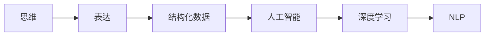

                 

# 思维与表达：结构化的内在联系

## 1. 背景介绍

在人工智能领域，思维与表达是一对重要的概念。它们不仅在逻辑推理、知识表示、自然语言处理等高级智能任务中扮演关键角色，而且在结构化数据处理、算法设计与优化等技术基础中同样不可或缺。理解思维与表达的内在联系，不仅有助于我们更好地掌握人工智能的核心技术，还能推动相关技术的持续发展和创新。

## 2. 核心概念与联系

### 2.1 核心概念概述

为了深入探讨思维与表达的联系，本节将介绍几个密切相关的核心概念：

- **思维**：是指人类或机器对于信息进行认知、分析和推理的过程，其核心在于如何将输入信息转化为决策、知识或解决方案。
- **表达**：是指将思维过程和结果以某种形式（如文本、图像、音频等）呈现出来的过程，其核心在于如何准确、高效地传递信息。
- **结构化数据**：指的是以某种固定结构（如表格、图、树等）存储和组织的数据，其核心在于数据的组织方式和结构性特征。
- **人工智能**：通过计算机模拟人类智能，实现对复杂信息的处理和决策的科学。
- **深度学习**：一种模仿人类神经系统的计算模型，能够处理大量非结构化数据，从中学习规律并进行推理和预测。
- **自然语言处理(NLP)**：使计算机能够理解、解释和生成人类语言，其核心在于语言模型的搭建和优化。

这些概念之间存在着紧密的联系和互动，共同构成了人工智能领域的技术框架。通过理解它们之间的关系，我们能够更好地设计、实现和优化人工智能系统。

### 2.2 概念间的关系

这些核心概念之间的关系可以通过以下Mermaid流程图来展示：



这个流程图展示了思维与表达的基本流程，以及它们与其他核心概念的联系：

1. 思维是表达的基础，通过理解输入信息，将其实质转化为易于表达的形式。
2. 表达是思维的结果，通过符号化、视觉化等形式，将思维的输出呈现给外界。
3. 结构化数据是表达的载体，通过固定结构的数据存储和组织，使得信息传递更加高效和可控。
4. 人工智能是思维和表达的综合体，通过机器学习、深度学习等技术，使得机器具备理解和生成能力。
5. 深度学习是实现人工智能的一种重要技术手段，特别是针对非结构化数据的处理和理解。
6. NLP是深度学习在自然语言处理中的应用，旨在使计算机能够理解、解释和生成人类语言。

这些概念共同构成了人工智能的技术基础，相互支持和促进，共同推动了AI领域的发展。

## 3. 核心算法原理 & 具体操作步骤

### 3.1 算法原理概述

思维与表达的联系可以通过算法设计来进一步具体化。以下我们将从算法原理的角度，探讨如何将思维转化为表达，以及如何通过算法优化表达的效果。

算法设计通常包括：

1. **数据预处理**：对输入数据进行清洗、特征提取、归一化等处理，以便于算法模型更好地理解和处理数据。
2. **模型搭建**：选择合适的算法模型，并设置相应的参数，以实现预期的思维和表达目标。
3. **训练和优化**：通过大量数据进行模型训练，调整参数以优化模型性能，使得模型能够准确地进行思维和表达。
4. **后处理**：对模型输出进行后处理，如解码、过滤、排序等，以实现最终的表达效果。

### 3.2 算法步骤详解

具体的算法步骤通常包括以下几个关键环节：

**Step 1: 数据预处理**
- **清洗数据**：去除噪声、错误、冗余信息，保留有用数据。
- **特征提取**：将原始数据转换为算法模型可处理的特征向量。
- **归一化处理**：将特征值缩放到一定的范围内，便于模型训练。

**Step 2: 模型搭建**
- **选择合适的算法**：如决策树、神经网络、支持向量机等。
- **设置算法参数**：如学习率、迭代次数、网络层数等。

**Step 3: 训练和优化**
- **模型训练**：通过输入数据和标签数据，训练算法模型。
- **参数调整**：根据训练结果，调整模型参数，提高模型性能。
- **评估模型**：使用测试数据评估模型性能，确定模型是否过拟合或欠拟合。

**Step 4: 后处理**
- **解码**：将模型输出转化为易于理解和表达的形式。
- **过滤**：对输出结果进行过滤，去除无用信息。
- **排序**：对输出结果进行排序，实现更好的表达效果。

### 3.3 算法优缺点

思维与表达的算法设计有着以下优缺点：

**优点**：
1. **准确性高**：通过大量的数据训练和参数优化，算法能够实现高精度的思维和表达。
2. **通用性强**：算法可以适用于多种场景和问题，具有广泛的应用价值。
3. **可扩展性高**：算法模型的复杂度和规模可以根据需求进行调整。

**缺点**：
1. **计算成本高**：训练和优化算法模型需要大量的计算资源和时间。
2. **数据依赖性大**：算法的性能依赖于数据质量和数量，数据不足可能影响效果。
3. **模型复杂度高**：复杂的算法模型可能难以解释和调试。

### 3.4 算法应用领域

思维与表达的算法设计在多个领域中得到了广泛应用，例如：

- **机器学习**：通过数据训练和模型优化，实现分类、聚类、回归等任务。
- **自然语言处理**：通过语言模型和深度学习，实现文本分类、信息抽取、问答系统等任务。
- **计算机视觉**：通过图像处理和卷积神经网络，实现图像分类、目标检测、人脸识别等任务。
- **智能推荐**：通过用户行为数据和模型优化，实现商品推荐、内容推荐等任务。
- **预测分析**：通过历史数据和算法模型，实现市场预测、金融风险评估等任务。

## 4. 数学模型和公式 & 详细讲解 & 举例说明

### 4.1 数学模型构建

为了更好地理解思维与表达的算法设计，本节将使用数学语言对算法模型进行严格刻画。

假设输入数据为 $x_1,x_2,\ldots,x_n$，标签数据为 $y_1,y_2,\ldots,y_n$。设算法模型为 $f(x,\theta)$，其中 $\theta$ 为模型参数。模型的训练目标为最小化损失函数 $\mathcal{L}$，即：

$$
\min_{\theta} \mathcal{L}(f(x),y) = \frac{1}{n} \sum_{i=1}^n \ell(f(x_i),y_i)
$$

其中 $\ell$ 为损失函数，如均方误差、交叉熵等。常用的损失函数及其公式推导如下：

- **均方误差（MSE）**：
$$
\ell(y,f(x)) = \frac{1}{n} \sum_{i=1}^n (y_i - f(x_i))^2
$$

- **交叉熵（CE）**：
$$
\ell(y,f(x)) = -\frac{1}{n} \sum_{i=1}^n y_i \log f(x_i)
$$

- **对数似然（Log-Likelihood）**：
$$
\ell(y,f(x)) = -\frac{1}{n} \sum_{i=1}^n y_i \log f(x_i) + (1-y_i) \log (1-f(x_i))
$$

### 4.2 公式推导过程

以下我们将以均方误差和交叉熵为例，详细推导它们的公式及其推导过程。

**均方误差（MSE）**：
$$
\mathcal{L}(f(x),y) = \frac{1}{n} \sum_{i=1}^n (y_i - f(x_i))^2
$$

**交叉熵（CE）**：
$$
\mathcal{L}(f(x),y) = -\frac{1}{n} \sum_{i=1}^n y_i \log f(x_i)
$$

通过这些损失函数，可以指导算法的训练过程，使得模型能够更好地理解输入数据和生成表达结果。

### 4.3 案例分析与讲解

以图像分类任务为例，假设有一个训练集 $\{(x_i,y_i)\}_{i=1}^n$，其中 $x_i$ 为图像数据，$y_i$ 为对应的类别标签。

**Step 1: 数据预处理**
- **清洗数据**：去除噪声、错误信息。
- **特征提取**：使用卷积神经网络提取图像特征。
- **归一化处理**：将特征值缩放到 $[0,1]$ 范围内。

**Step 2: 模型搭建**
- **选择合适的算法**：使用卷积神经网络。
- **设置算法参数**：如卷积核大小、步幅、层数等。

**Step 3: 训练和优化**
- **模型训练**：通过训练数据训练卷积神经网络。
- **参数调整**：根据训练结果调整网络参数，如学习率、迭代次数等。
- **评估模型**：使用测试数据评估模型性能，确定模型是否过拟合或欠拟合。

**Step 4: 后处理**
- **解码**：将模型输出转化为类别标签。
- **过滤**：对输出结果进行过滤，去除无用信息。
- **排序**：对输出结果进行排序，实现更好的表达效果。

## 5. 项目实践：代码实例和详细解释说明

### 5.1 开发环境搭建

在进行思维与表达的算法设计时，我们需要准备好开发环境。以下是使用Python进行TensorFlow开发的环境配置流程：

1. 安装Anaconda：从官网下载并安装Anaconda，用于创建独立的Python环境。

2. 创建并激活虚拟环境：
```bash
conda create -n tensorflow-env python=3.8 
conda activate tensorflow-env
```

3. 安装TensorFlow：根据CUDA版本，从官网获取对应的安装命令。例如：
```bash
conda install tensorflow tensorflow-gpu -c conda-forge
```

4. 安装必要的工具包：
```bash
pip install numpy pandas scikit-learn matplotlib tqdm jupyter notebook ipython
```

完成上述步骤后，即可在`tensorflow-env`环境中开始思维与表达的算法实践。

### 5.2 源代码详细实现

这里我们以图像分类任务为例，给出使用TensorFlow进行卷积神经网络（CNN）的代码实现。

首先，定义数据预处理函数：

```python
import tensorflow as tf
from tensorflow.keras.preprocessing.image import ImageDataGenerator

def preprocess_data(train_data_dir, test_data_dir):
    train_datagen = ImageDataGenerator(rescale=1./255)
    train_generator = train_datagen.flow_from_directory(
        train_data_dir,
        target_size=(224, 224),
        batch_size=32,
        class_mode='categorical')
    
    test_datagen = ImageDataGenerator(rescale=1./255)
    test_generator = test_datagen.flow_from_directory(
        test_data_dir,
        target_size=(224, 224),
        batch_size=32,
        class_mode='categorical')
    
    return train_generator, test_generator
```

然后，定义模型和损失函数：

```python
from tensorflow.keras.models import Sequential
from tensorflow.keras.layers import Conv2D, MaxPooling2D, Flatten, Dense

model = Sequential([
    Conv2D(32, (3, 3), activation='relu', input_shape=(224, 224, 3)),
    MaxPooling2D((2, 2)),
    Conv2D(64, (3, 3), activation='relu'),
    MaxPooling2D((2, 2)),
    Conv2D(128, (3, 3), activation='relu'),
    MaxPooling2D((2, 2)),
    Flatten(),
    Dense(256, activation='relu'),
    Dense(10, activation='softmax')
])

loss = tf.keras.losses.CategoricalCrossentropy()

```

接着，定义训练和评估函数：

```python
from tensorflow.keras.optimizers import Adam

def train(model, train_generator, test_generator, epochs, batch_size):
    model.compile(optimizer=Adam(learning_rate=0.001),
                  loss=loss,
                  metrics=['accuracy'])
    
    model.fit(
        train_generator,
        steps_per_epoch=train_generator.n // batch_size,
        epochs=epochs,
        validation_data=test_generator,
        validation_steps=test_generator.n // batch_size)
    
    score = model.evaluate(test_generator)
    print(f'Test loss: {score[0]:4f}')
    print(f'Test accuracy: {score[1]:4f}')

```

最后，启动训练流程并在测试集上评估：

```python
train_data_dir = 'path/to/train_data'
test_data_dir = 'path/to/test_data'

train_generator, test_generator = preprocess_data(train_data_dir, test_data_dir)
train(model, train_generator, test_generator, epochs=10, batch_size=32)
```

以上就是使用TensorFlow进行图像分类任务的代码实现。可以看到，TensorFlow提供了强大的工具和库，使得算法设计和实现变得更加便捷。

### 5.3 代码解读与分析

让我们再详细解读一下关键代码的实现细节：

**preprocess_data函数**：
- **数据增强**：使用`ImageDataGenerator`进行数据增强，包括图像归一化、随机裁剪、随机翻转等。
- **数据生成器**：使用`flow_from_directory`生成器从目录中加载图片数据，进行批处理和分批次生成样本。

**train函数**：
- **模型编译**：使用`compile`方法设置模型损失函数、优化器、评估指标等。
- **模型训练**：使用`fit`方法进行模型训练，设置训练轮数、批次大小等。
- **模型评估**：使用`evaluate`方法在测试集上评估模型性能，打印损失和准确率。

**训练流程**：
- **数据预处理**：通过`preprocess_data`函数加载和预处理训练集和测试集数据。
- **模型编译**：设置模型损失函数为交叉熵，优化器为Adam，评估指标为准确率。
- **模型训练**：调用`train`函数进行模型训练，设置训练轮数为10，批次大小为32。
- **模型评估**：在测试集上评估模型性能，输出损失和准确率。

可以看到，TensorFlow提供了强大的工具和库，使得算法设计和实现变得更加便捷。通过合理使用这些工具，可以显著提升算法设计和实现的效率，加速模型的训练和优化。

## 6. 实际应用场景

### 6.1 智能推荐系统

在智能推荐系统中，思维与表达的算法设计尤为重要。推荐系统通过用户的浏览、点击、评分等行为数据，结合思维与表达的算法设计，为用户推荐个性化的商品、内容等。

**数据预处理**：对用户行为数据进行清洗、特征提取、归一化等处理，提取有用的特征信息。

**模型搭建**：选择合适的算法模型，如协同过滤、基于内容的推荐、矩阵分解等。

**训练和优化**：通过用户行为数据进行模型训练，调整参数以优化模型性能。

**后处理**：对模型输出进行解码、过滤、排序等处理，生成个性化的推荐结果。

通过思维与表达的算法设计，推荐系统能够更好地理解用户需求，生成高质量的推荐内容，提升用户体验。

### 6.2 自然语言处理（NLP）

自然语言处理是思维与表达算法设计的重要应用领域。NLP通过语言模型和深度学习，实现文本分类、信息抽取、问答系统等任务。

**数据预处理**：对文本数据进行清洗、分词、去除停用词等处理，提取有用的特征信息。

**模型搭建**：选择合适的算法模型，如RNN、LSTM、Transformer等。

**训练和优化**：通过文本数据进行模型训练，调整参数以优化模型性能。

**后处理**：对模型输出进行解码、过滤、排序等处理，生成自然语言处理结果。

通过思维与表达的算法设计，NLP系统能够更好地理解自然语言，生成高质量的自然语言处理结果，提升系统性能。

### 6.3 预测分析

预测分析是思维与表达算法设计的又一重要应用领域。预测分析通过历史数据和算法模型，实现市场预测、金融风险评估等任务。

**数据预处理**：对历史数据进行清洗、特征提取、归一化等处理，提取有用的特征信息。

**模型搭建**：选择合适的算法模型，如线性回归、决策树、随机森林等。

**训练和优化**：通过历史数据进行模型训练，调整参数以优化模型性能。

**后处理**：对模型输出进行解码、过滤、排序等处理，生成预测分析结果。

通过思维与表达的算法设计，预测分析系统能够更好地理解历史数据，生成高质量的预测分析结果，提升决策效率。

## 7. 工具和资源推荐

### 7.1 学习资源推荐

为了帮助开发者系统掌握思维与表达的算法设计，这里推荐一些优质的学习资源：

1. **《深度学习》（Ian Goodfellow著）**：该书系统介绍了深度学习的原理和算法，包括前向传播、反向传播、损失函数等核心概念。
2. **Coursera深度学习课程**：由斯坦福大学Andrew Ng教授讲授的深度学习课程，涵盖深度学习的基础和高级技术，适合初学者和进阶者。
3. **《机器学习实战》（Peter Harrington著）**：该书介绍了机器学习的基本概念和实现，包括数据预处理、模型搭建、训练和优化等技术。
4. **Kaggle机器学习竞赛**：Kaggle平台提供了大量机器学习竞赛，可以通过实践提升算法设计和实现能力。
5. **Github代码库**：Github上大量开源机器学习项目和代码库，可以学习他人的算法设计和实现经验。

通过对这些资源的学习实践，相信你一定能够快速掌握思维与表达的算法设计，并用于解决实际的机器学习问题。

### 7.2 开发工具推荐

高效的开发离不开优秀的工具支持。以下是几款用于思维与表达的算法设计开发的常用工具：

1. **Python**：强大的编程语言，具有丰富的第三方库和工具，适合机器学习算法的设计和实现。
2. **TensorFlow**：由Google开发的深度学习框架，提供了丰富的算法和工具，适合深度学习算法的实现。
3. **PyTorch**：由Facebook开发的深度学习框架，灵活高效，适合动态图模型的设计和实现。
4. **Jupyter Notebook**：支持代码、数据、文档等多种格式的文件共享，方便多人协作开发。
5. **Git**：版本控制系统，适合团队协作和代码管理。

合理利用这些工具，可以显著提升算法设计和实现的效率，加速模型的训练和优化。

### 7.3 相关论文推荐

思维与表达的算法设计在多个领域中得到了广泛应用，以下是几篇奠基性的相关论文，推荐阅读：

1. **ImageNet大规模视觉识别竞赛挑战（ImageNet Large Scale Visual Recognition Challenge, ImageNet LSVC）**：该竞赛推动了深度学习在图像识别领域的发展，展示了卷积神经网络（CNN）的强大能力。
2. **自然语言处理与深度学习（Natural Language Processing and Deep Learning, NLP and DL）**：该论文介绍了自然语言处理和深度学习的基本原理和算法，展示了NLP算法的设计和实现。
3. **机器学习在金融预测中的应用（Machine Learning in Financial Forecasting）**：该论文介绍了机器学习在金融预测领域的应用，展示了预测分析算法的设计和实现。

这些论文代表了大语言模型微调技术的发展脉络。通过学习这些前沿成果，可以帮助研究者把握学科前进方向，激发更多的创新灵感。

除上述资源外，还有一些值得关注的前沿资源，帮助开发者紧跟思维与表达的算法设计技术的最新进展，例如：

1. **arXiv论文预印本**：人工智能领域最新研究成果的发布平台，包括大量尚未发表的前沿工作，学习前沿技术的必读资源。
2. **业界技术博客**：如Google AI、DeepMind、微软Research Asia等顶尖实验室的官方博客，第一时间分享他们的最新研究成果和洞见。
3. **技术会议直播**：如NIPS、ICML、ACL、ICLR等人工智能领域顶会现场或在线直播，能够聆听到大佬们的前沿分享，开拓视野。
4. **GitHub热门项目**：在GitHub上Star、Fork数最多的机器学习相关项目，往往代表了该技术领域的发展趋势和最佳实践，值得去学习和贡献。
5. **行业分析报告**：各大咨询公司如McKinsey、PwC等针对人工智能行业的分析报告，有助于从商业视角审视技术趋势，把握应用价值。

总之，对于思维与表达的算法设计的学习和实践，需要开发者保持开放的心态和持续学习的意愿。多关注前沿资讯，多动手实践，多思考总结，必将收获满满的成长收益。

## 8. 总结：未来发展趋势与挑战

### 8.1 研究成果总结

本文对思维与表达的算法设计进行了全面系统的介绍。首先阐述了思维与表达的基本概念和关系，明确了它们在机器学习和人工智能领域的重要地位。其次，从算法原理的角度，详细讲解了思维与表达的算法设计过程，包括数据预处理、模型搭建、训练和优化、后处理等环节。同时，本文还探讨了算法设计的优缺点和应用领域，展示了其在实际应用中的广泛价值。

通过本文的系统梳理，可以看到，思维与表达的算法设计在机器学习和人工智能领域有着重要的地位。这些算法不仅能够帮助模型更好地理解输入数据和生成表达结果，还能够推动相关技术的持续发展和创新。未来，伴随深度学习、自然语言处理等技术的不断演进，思维与表达的算法设计必将发挥更加重要的作用。

### 8.2 未来发展趋势

展望未来，思维与表达的算法设计将呈现以下几个发展趋势：

1. **深度学习模型的发展**：随着深度学习模型的不断进步，算法的性能将进一步提升，复杂度和可解释性也将得到改善。
2. **自然语言处理技术的发展**：自然语言处理技术的不断进步，将推动算法设计向更加智能和自然的表达方向发展。
3. **多模态数据的融合**：多模态数据的融合将使算法设计更加全面和准确，提升系统的性能和鲁棒性。
4. **可解释性和透明度的提高**：算法的可解释性和透明度将得到进一步提高，有助于提升系统的可信度和可控性。
5. **跨领域知识的整合**：跨领域知识的整合将使算法设计更加灵活和高效，提升系统的应用范围和能力。

这些趋势将推动思维与表达的算法设计向更加高效、智能、可解释和跨领域融合的方向发展。

### 8.3 面临的挑战

尽管思维与表达的算法设计已经取得了瞩目成就，但在迈向更加智能化、普适化应用的过程中，它仍面临着诸多挑战：

1. **数据质量瓶颈**：高质量的数据是算法设计的基础，但获取高质量数据的成本和难度较大。如何提升数据质量，减少对标注数据的依赖，是一大难题。
2. **模型复杂度问题**：复杂的算法模型不仅难以解释和调试，还容易导致过拟合。如何降低模型复杂度，提升模型的可解释性和泛化能力，需要进一步研究。
3. **计算资源限制**：深度学习模型的训练和优化需要大量的计算资源，如何在有限的计算资源下优化算法性能，是一个重要的问题。
4. **可解释性和透明度不足**：复杂的算法模型往往难以解释和理解，如何提高算法的透明度，使其更容易被用户接受，是一大挑战。
5. **跨领域融合问题**：不同领域的数据和算法设计方法差异较大，如何实现跨领域的融合，使算法设计更加普适，是一大难题。

这些挑战将伴随着算法设计的不断发展，需要进一步的研究和创新。

### 8.4 研究展望

面对思维与表达的算法设计所面临的挑战，未来的研究需要在以下几个方面寻求新的突破：

1. **数据增强技术的发展**：通过数据增强技术，提升数据质量和多样性，减少对标注数据的依赖。
2. **模型简化和优化**：通过模型简化和优化技术，降低模型复杂度，提升模型的可解释性和泛化能力。
3. **计算资源优化**：通过分布式计算、GPU加速等技术，优化算法的计算资源使用，提升训练和推理效率。
4. **可解释性提升**：通过可解释性技术，提升算法的透明度，使其更容易被用户理解和接受。
5. **跨领域融合研究**：通过跨领域融合研究，实现不同领域数据的整合和算法设计的协同，提升算法的普适性和灵活性。

这些研究方向的探索，将引领思维与表达的算法设计向更加高效、智能、可解释和跨领域融合的方向发展。

## 9. 附录：常见问题与解答

**Q1：数据预处理的重要性在哪里？**

A: 数据预处理是思维与表达的算法设计的重要环节。它能够去除噪声、错误、冗余信息，保留有用的特征信息，提升算法的性能。数据预处理的好坏直接影响算法模型的训练效果和性能表现。

**Q2：为什么需要选择合适的算法模型？**

A: 选择合适的算法模型是思维与表达的算法设计的重要步骤。不同的算法模型具有不同的优势和适用场景，需要根据具体问题和数据特点进行选择。选择合适的算法模型能够更好地理解输入数据和生成表达结果，提升算法性能。

**Q3：如何评估模型的性能？**

A: 模型性能的评估是思维与表达的算法设计的重要环节。常见的评估指标包括准确率、召回率、F1分数等。评估方法包括留出法、交叉验证法、自助法等。根据具体的任务和数据特点，选择合适的评估方法和指标，能够更好地评估模型性能。

**Q4：如何优化模型参数？**

A: 模型参数的优化是思维与表达的算法设计

