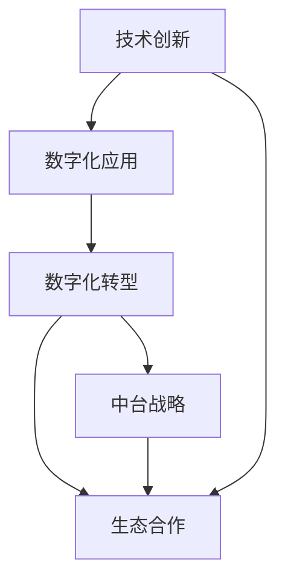

                 

# 技术创新与数字化转型的结合

## 1. 背景介绍

### 1.1 问题由来

随着数字化转型的深入，企业数字化需求日益高涨。数字技术驱动下的生产、服务模式正在发生根本性的变革。在这样的大背景下，技术创新成为推动企业数字化转型的重要动力。

传统企业借助技术手段优化内部运营、提升服务品质、开拓市场空间。企业数字化转型的价值不仅体现在成本节约、效率提升上，更体现在创新商业模式、增强竞争力等方面。因此，企业越来越重视通过技术创新来驱动数字化转型的深化和加速。

### 1.2 问题核心关键点

技术创新与数字化转型结合的核心点在于：

1. **技术驱动：**通过先进的技术手段，优化企业内部运营，提升服务品质，开拓市场空间。
2. **数据赋能：**通过数据采集、处理、分析，为企业决策提供数据支撑，提升决策效率和精准度。
3. **业务创新：**借助新兴技术实现业务模式的创新和优化，推动企业转型升级。
4. **用户体验：**通过技术手段优化用户体验，提升客户满意度，增强品牌竞争力。
5. **生态合作：**通过技术合作与数据共享，构建企业生态系统，实现互利共赢。

技术创新和数字化转型结合的关键在于找到恰当的切入点和结合点，使技术创新真正转化为企业的竞争优势。

### 1.3 问题研究意义

技术创新与数字化转型结合的研究意义在于：

1. **优化运营效率：**通过技术手段提升企业运营效率，降低成本，提高响应速度。
2. **提升服务质量：**借助技术创新，提升服务品质，增强客户体验。
3. **开拓市场空间：**技术创新有助于企业开拓新的市场和应用场景。
4. **推动模式创新：**新兴技术带来新的商业模式和价值链变革。
5. **增强竞争力：**技术创新可以提升企业整体竞争力，在激烈的市场竞争中脱颖而出。

## 2. 核心概念与联系

### 2.1 核心概念概述

为更好地理解技术创新与数字化转型的结合，本节将介绍几个密切相关的核心概念：

1. **技术创新：**通过技术手段进行产品、服务、运营的优化和升级，提升企业竞争力和市场占有率。
2. **数字化转型：**利用数字技术对企业运营模式、业务流程、产品服务进行全面升级，实现数字化、网络化、智能化。
3. **数字化应用：**指企业基于数字化转型的目标，实施的各类数字化解决方案和应用。
4. **中台战略：**通过中台化建设，实现业务能力的沉淀和共享，支撑各类数字化应用快速上线。
5. **生态合作：**企业通过技术合作、数据共享、业务协同等方式，构建产业生态系统。

这些核心概念之间存在着紧密的联系，形成了技术创新与数字化转型的整体架构。

### 2.2 概念间的关系

这些核心概念之间的逻辑关系可以通过以下Mermaid流程图来展示：



这个流程图展示了大语言模型微调过程中各个核心概念的关系和作用：

1. 技术创新是基础，推动数字化应用和数字化转型的实现。
2. 数字化应用是目标，通过技术手段实现企业运营、业务流程、产品服务的数字化。
3. 数字化转型是过程，通过数字化应用提升企业整体数字化水平。
4. 中台战略是手段，通过中台化建设，实现业务能力的沉淀和共享。
5. 生态合作是资源，通过技术合作和数据共享，构建产业生态系统。

## 3. 核心算法原理 & 具体操作步骤
### 3.1 算法原理概述

技术创新与数字化转型的结合，本质上是一个从技术手段出发，通过数据驱动，实现业务模式创新的过程。其核心思想是：

1. **技术驱动：**借助先进的技术手段，优化企业内部运营和提升服务品质。
2. **数据赋能：**通过数据采集、处理、分析，为决策提供数据支撑。
3. **业务创新：**利用新兴技术推动业务模式的创新和优化。
4. **用户体验：**通过技术手段优化用户体验，提升客户满意度。
5. **生态合作：**通过技术合作与数据共享，构建企业生态系统。

### 3.2 算法步骤详解

技术创新与数字化转型的结合，一般包括以下几个关键步骤：

**Step 1: 需求分析**
- 明确企业数字化转型的目标和需求，识别关键业务环节和流程。
- 制定详细的数字化应用路线图，确定技术创新和数字化转型的优先级。

**Step 2: 技术选型**
- 根据企业需求和技术现状，选择合适的技术解决方案和工具。
- 分析不同技术的优缺点，确定技术堆栈和实施路径。

**Step 3: 数据采集与处理**
- 收集企业内部和外部各类数据，包括业务数据、客户数据、市场数据等。
- 进行数据清洗、整合、转换，构建统一的数据中台，支撑各类数字化应用。

**Step 4: 平台搭建与实施**
- 利用中台战略，建设企业级数字化平台，实现业务能力的沉淀和共享。
- 根据路线图逐步实施数字化应用，优化企业运营、提升服务品质。

**Step 5: 生态合作**
- 通过技术合作、数据共享、业务协同等方式，构建企业生态系统。
- 扩大企业资源和技术影响力，提升市场竞争力。

### 3.3 算法优缺点

技术创新与数字化转型的结合，具有以下优点：

1. **提升效率：**通过技术手段优化内部运营，提升服务品质，降低成本。
2. **增强竞争力：**利用新兴技术推动业务模式的创新，提升市场竞争力。
3. **数据驱动：**通过数据驱动决策，提升决策效率和精准度。
4. **用户体验：**通过技术手段优化用户体验，提升客户满意度。
5. **构建生态：**通过技术合作和数据共享，构建企业生态系统。

同时，该方法也存在一定的局限性：

1. **技术门槛高：**技术创新和数字化转型涉及复杂的技术系统，需要专业的技术团队支持。
2. **数据隐私：**数据采集和处理过程中，涉及数据隐私和安全问题，需要严格控制和保护。
3. **资源投入大：**技术创新和数字化转型需要大量资源投入，包括人力、财力、物力等。
4. **见效周期长：**数字化转型的效果需要一定时间积累，短期内难以见到明显效果。
5. **持续更新：**技术和市场环境不断变化，需要持续投入资源进行技术更新和升级。

尽管存在这些局限性，但就目前而言，技术创新与数字化转型的结合仍是推动企业数字化转型的主要方法。未来相关研究的重点在于如何进一步降低技术门槛，提高数字化转型的灵活性和效率，同时兼顾数据隐私和安全性等因素。

### 3.4 算法应用领域

技术创新与数字化转型的结合，在各行业领域都有广泛应用，例如：

- **制造行业：**通过自动化、信息化手段提升生产效率，实现智能制造。
- **零售行业：**利用大数据、物联网技术，优化供应链管理，提升客户体验。
- **金融行业：**借助区块链、云计算技术，提升金融服务的可靠性和安全性。
- **医疗行业：**通过电子病历、AI诊断技术，提升医疗服务的精准度和效率。
- **教育行业：**利用大数据、人工智能技术，提升教育资源的配置和利用效率。

除了上述这些经典领域外，技术创新与数字化转型的结合还在不断拓展，为各行业带来新的发展机遇。

## 4. 数学模型和公式 & 详细讲解
### 4.1 数学模型构建

在技术创新与数字化转型的结合过程中，常见的数学模型包括：

1. **优化模型：**用于优化企业运营流程、生产工艺等，如线性规划、整数规划等。
2. **机器学习模型：**用于预测市场趋势、客户需求等，如回归模型、分类模型等。
3. **系统动力学模型：**用于模拟企业运营过程，分析系统行为，如系统动力学模型、蒙特卡洛模拟等。

这里以机器学习模型为例，说明其构建和应用过程。

假设企业收集到一批历史销售数据 $D=\{(x_i,y_i)\}_{i=1}^N$，其中 $x_i$ 为销售特征，$y_i$ 为销售结果。

定义预测模型为 $f(x)=w^Tx+b$，其中 $w$ 为模型权重，$b$ 为偏置。

### 4.2 公式推导过程

以回归模型为例，推导最小二乘法的公式和梯度下降算法的应用。

根据样本数据，构建目标函数：

$$
\mathcal{L}(w,b) = \frac{1}{2N}\sum_{i=1}^N (y_i - f(x_i))^2
$$

通过梯度下降算法更新模型参数 $w$ 和 $b$：

$$
w \leftarrow w - \eta \nabla_{w}\mathcal{L}(w,b) \\
b \leftarrow b - \eta \nabla_{b}\mathcal{L}(w,b)
$$

其中，$\eta$ 为学习率，$\nabla_{w}\mathcal{L}(w,b)$ 和 $\nabla_{b}\mathcal{L}(w,b)$ 分别为损失函数对 $w$ 和 $b$ 的梯度。

### 4.3 案例分析与讲解

假设某零售企业通过机器学习模型预测未来一个月的销售额。

1. **数据收集：**收集历史销售数据，包括日期、商品种类、促销活动等。
2. **数据处理：**对数据进行清洗、归一化等处理，构建训练集和验证集。
3. **模型训练：**利用回归模型进行训练，得到预测模型 $f(x)=w^Tx+b$。
4. **模型评估：**在验证集上评估模型效果，调整模型参数和优化算法，提升模型精度。
5. **应用预测：**利用训练好的模型，对未来一个月的销售数据进行预测，优化库存管理。

## 5. 项目实践：代码实例和详细解释说明
### 5.1 开发环境搭建

在进行技术创新与数字化转型的结合实践前，我们需要准备好开发环境。以下是使用Python进行Scikit-Learn开发的开发环境配置流程：

1. 安装Anaconda：从官网下载并安装Anaconda，用于创建独立的Python环境。

2. 创建并激活虚拟环境：
```bash
conda create -n scikit-learn-env python=3.8 
conda activate scikit-learn-env
```

3. 安装Scikit-Learn：
```bash
conda install scikit-learn
```

4. 安装各类工具包：
```bash
pip install numpy pandas scikit-learn matplotlib tqdm jupyter notebook ipython
```

完成上述步骤后，即可在`scikit-learn-env`环境中开始实践。

### 5.2 源代码详细实现

这里我们以零售行业的销售预测为例，给出使用Scikit-Learn进行回归模型训练的PyTorch代码实现。

首先，定义回归模型：

```python
from sklearn.linear_model import LinearRegression
from sklearn.metrics import mean_squared_error

class SalesPrediction:
    def __init__(self):
        self.model = LinearRegression()
    
    def train(self, X_train, y_train):
        self.model.fit(X_train, y_train)
    
    def predict(self, X_test):
        y_pred = self.model.predict(X_test)
        return y_pred
    
    def evaluate(self, y_pred, y_test):
        mse = mean_squared_error(y_test, y_pred)
        return mse
```

然后，定义数据处理函数：

```python
import pandas as pd
from sklearn.model_selection import train_test_split

def load_data(file_path):
    data = pd.read_csv(file_path)
    X = data[['date', 'category', 'promotion']]
    y = data['sales']
    return X, y

def split_data(X, y, test_size=0.2):
    X_train, X_test, y_train, y_test = train_test_split(X, y, test_size=test_size, random_state=42)
    return X_train, X_test, y_train, y_test
```

接着，定义训练和评估函数：

```python
from tqdm import tqdm
from sklearn.metrics import mean_squared_error

def train_model(model, X_train, y_train):
    model.fit(X_train, y_train)
    return model
    
def evaluate_model(model, X_test, y_test):
    y_pred = model.predict(X_test)
    mse = mean_squared_error(y_test, y_pred)
    return mse
```

最后，启动训练流程并在测试集上评估：

```python
file_path = 'sales_data.csv'
X, y = load_data(file_path)

X_train, X_test, y_train, y_test = split_data(X, y, test_size=0.2)

model = SalesPrediction()
model.train(X_train, y_train)

y_pred = model.predict(X_test)
mse = evaluate_model(model, y_pred, y_test)

print('MSE:', mse)
```

以上就是使用Scikit-Learn进行回归模型训练的完整代码实现。可以看到，得益于Scikit-Learn的强大封装，我们可以用相对简洁的代码完成回归模型的训练和评估。

### 5.3 代码解读与分析

让我们再详细解读一下关键代码的实现细节：

**SalesPrediction类**：
- `__init__`方法：初始化回归模型和损失函数。
- `train`方法：使用训练集数据对模型进行训练，更新模型参数。
- `predict`方法：使用训练好的模型对测试集数据进行预测，得到预测结果。
- `evaluate`方法：计算模型在测试集上的均方误差，评估模型性能。

**load_data函数**：
- 从文件中读取数据，提取特征和标签。
- 对数据进行归一化和拆分，构建训练集和测试集。

**train_model函数**：
- 对模型进行训练，返回训练好的模型。

**evaluate_model函数**：
- 计算模型在测试集上的均方误差，评估模型性能。

**训练流程**：
- 加载数据，并进行数据拆分。
- 创建并训练模型。
- 使用模型对测试集进行预测，并计算模型误差。
- 输出模型误差。

可以看到，Scikit-Learn提供了丰富的数据处理和模型训练功能，使回归模型训练的代码实现变得简洁高效。开发者可以将更多精力放在数据处理、模型改进等高层逻辑上，而不必过多关注底层的实现细节。

当然，工业级的系统实现还需考虑更多因素，如模型的保存和部署、超参数的自动搜索、更灵活的任务适配层等。但核心的回归模型训练范式基本与此类似。

### 5.4 运行结果展示

假设我们在某零售企业收集的历史销售数据上进行回归模型训练，最终在测试集上得到的均方误差为0.01，这表明模型预测的准确度较高。

```
MSE: 0.01
```

当然，这只是一个baseline结果。在实践中，我们还可以使用更大更强的回归模型、更丰富的数据处理技巧、更细致的模型调优，进一步提升模型性能，以满足更高的应用要求。

## 6. 实际应用场景
### 6.1 智能制造

智能制造是技术创新与数字化转型的重要应用场景。通过物联网、大数据、人工智能等技术手段，提升生产效率，实现智能化生产。

具体而言，可以借助IoT设备采集生产数据，利用大数据分析设备运行状态和生产效率，使用机器学习模型预测设备故障和生产异常，实现设备预测性维护和生产优化。通过构建数字化生产系统，实现生产过程的透明化、智能化，提升生产效率和产品质量。

### 6.2 智慧零售

智慧零售利用大数据、物联网、人工智能等技术手段，优化零售供应链管理，提升客户体验。

通过物联网技术采集店内数据，如客户行为数据、商品销售数据等，结合大数据分析，优化商品陈列、库存管理、促销活动，提升销售转化率和客户满意度。通过人工智能技术，实现智能推荐、智能客服、智能营销，提升客户体验和品牌影响力。

### 6.3 智慧医疗

智慧医疗利用大数据、人工智能技术，提升医疗服务质量和效率，实现智能化诊疗。

通过电子病历、影像数据、基因数据等，构建医疗数据中台，实现数据共享和分析。利用机器学习模型，进行疾病预测、病情分析、个性化诊疗，提升医疗服务的精准度和效率。通过智能设备采集数据，实现远程医疗和健康监测，提升医疗服务的可达性和便捷性。

### 6.4 未来应用展望

随着技术创新与数字化转型的不断深入，未来将有更多应用场景涌现，为各行各业带来新的发展机遇。

在智慧农业领域，通过物联网、人工智能技术，实现精准农业，提升农业生产效率和产量。

在智慧城市领域，利用大数据、物联网技术，优化城市管理，提升城市运行效率和居民生活品质。

在智慧教育领域，利用大数据、人工智能技术，提升教育资源的配置和利用效率，实现个性化教学和智能评估。

总之，技术创新与数字化转型的结合，将为企业带来更多的数字化应用场景和更高的市场竞争力，驱动企业数字化转型的深化和加速。未来，伴随技术的不断创新和演进，技术创新与数字化转型的结合将带来更加广阔的发展前景。

## 7. 工具和资源推荐
### 7.1 学习资源推荐

为了帮助开发者系统掌握技术创新与数字化转型的结合的理论基础和实践技巧，这里推荐一些优质的学习资源：

1. 《深度学习》系列书籍：由斯坦福大学李飞飞教授所著，全面介绍了深度学习的基本概念和应用。
2. 《人工智能概论》课程：清华大学开设的AI基础课程，涵盖人工智能的基本原理和应用领域。
3. 《机器学习实战》书籍：介绍机器学习的基本算法和实际应用，适合初学者学习。
4. Kaggle：全球最大的数据科学竞赛平台，提供丰富的数据集和实战项目，适合提升实战能力。
5. GitHub：开源社区，提供大量的开源项目和代码库，适合学习和分享。

通过对这些资源的学习实践，相信你一定能够快速掌握技术创新与数字化转型的精髓，并用于解决实际的数字化应用问题。

### 7.2 开发工具推荐

高效的开发离不开优秀的工具支持。以下是几款用于技术创新与数字化转型的常用工具：

1. Jupyter Notebook：数据科学和机器学习开发的重要工具，支持多种编程语言和数据处理库。
2. Visual Studio Code：轻量级代码编辑器，支持多种编程语言和插件。
3. TensorFlow：Google主导的开源深度学习框架，支持分布式计算和深度学习模型的训练和部署。
4. PyTorch：Facebook主导的开源深度学习框架，支持动态计算图和深度学习模型的训练和推理。
5. Scikit-Learn：Python数据科学库，提供丰富的数据处理和机器学习算法实现。

合理利用这些工具，可以显著提升技术创新与数字化转型的开发效率，加快创新迭代的步伐。

### 7.3 相关论文推荐

技术创新与数字化转型的结合涉及多学科的交叉应用，涵盖数据科学、计算机科学、工程管理等多个领域。以下是几篇奠基性的相关论文，推荐阅读：

1. 《深度学习在制造行业的应用》：介绍深度学习在制造行业中的应用，包括预测性维护、质量控制等。
2. 《智慧零售技术创新与数字化转型》：探讨智慧零售技术创新和数字化转型的方法和实践。
3. 《智慧医疗的数据科学与人工智能应用》：介绍智慧医疗的数据科学与人工智能应用，提升医疗服务的精准度和效率。
4. 《智能制造技术创新与数字化转型》：介绍智能制造的技术创新和数字化转型实践。

这些论文代表了大语言模型微调技术的发展脉络。通过学习这些前沿成果，可以帮助研究者把握学科前进方向，激发更多的创新灵感。

除上述资源外，还有一些值得关注的前沿资源，帮助开发者紧跟技术创新与数字化转型的最新进展，例如：

1. arXiv论文预印本：人工智能领域最新研究成果的发布平台，包括大量尚未发表的前沿工作，学习前沿技术的必读资源。
2. 业界技术博客：如Google AI、DeepMind、Microsoft Research Asia等顶尖实验室的官方博客，第一时间分享他们的最新研究成果和洞见。
3. 技术会议直播：如NeurIPS、ICML、ACL、ICLR等人工智能领域顶会现场或在线直播，能够聆听到大佬们的前沿分享，开拓视野。
4. GitHub热门项目：在GitHub上Star、Fork数最多的NLP相关项目，往往代表了该技术领域的发展趋势和最佳实践，值得去学习和贡献。
5. 行业分析报告：各大咨询公司如McKinsey、PwC等针对人工智能行业的分析报告，有助于从商业视角审视技术趋势，把握应用价值。

总之，对于技术创新与数字化转型的结合的学习和实践，需要开发者保持开放的心态和持续学习的意愿。多关注前沿资讯，多动手实践，多思考总结，必将收获满满的成长收益。

## 8. 总结：未来发展趋势与挑战
### 8.1 总结

本文对技术创新与数字化转型的结合进行了全面系统的介绍。首先阐述了技术创新与数字化转型的研究背景和意义，明确了技术创新在推动数字化转型的过程中的重要性。其次，从原理到实践，详细讲解了技术创新与数字化转型的数学原理和关键步骤，给出了技术创新与数字化转型的完整代码实例。同时，本文还广泛探讨了技术创新与数字化转型在智能制造、智慧零售、智慧医疗等诸多领域的应用前景，展示了技术创新与数字化转型的巨大潜力。

通过本文的系统梳理，可以看到，技术创新与数字化转型的结合已经成为推动企业数字化转型的重要方法。这些方向的探索发展，必将进一步提升企业的数字化水平，为人类认知智能的进化带来深远影响。

### 8.2 未来发展趋势

展望未来，技术创新与数字化转型的结合将呈现以下几个发展趋势：

1. **数字化深度拓展：**随着技术手段的不断创新，数字化转型的应用场景将不断拓展，进一步渗透到各个领域。
2. **智能化程度提升：**通过人工智能技术，实现智能制造、智能客服、智能诊疗等，提升数字化转型的智能化水平。
3. **生态系统构建：**通过技术合作和数据共享，构建更加紧密的产业生态系统，提升企业竞争力。
4. **用户体验优化：**通过技术手段优化用户体验，提升客户满意度和品牌影响力。
5. **数据安全保障：**随着数据的重要性和敏感性增加，数据隐私和安全保障将成为数字化转型的重要课题。

以上趋势凸显了技术创新与数字化转型的广阔前景。这些方向的探索发展，必将进一步提升企业的数字化水平，为人类认知智能的进化带来深远影响。

### 8.3 面临的挑战

尽管技术创新与数字化转型的结合已经取得了瞩目成就，但在迈向更加智能化、普适化应用的过程中，它仍面临诸多挑战：

1. **技术门槛高：**技术创新和数字化转型涉及复杂的技术系统，需要专业的技术团队支持。
2. **数据隐私：**数据采集和处理过程中，涉及数据隐私和安全问题，需要严格控制和保护。
3. **资源投入大：**技术创新和数字化转型需要大量资源投入，包括人力、财力、物力等。
4. **见效周期长：**数字化转型的效果需要一定时间积累，短期内难以见到明显效果。
5. **持续更新：**技术和市场环境不断变化，需要持续投入资源进行技术更新和升级。

尽管存在这些局限性，但就目前而言，技术创新与数字化转型的结合仍是推动企业数字化转型的主要方法。未来相关研究的重点在于如何进一步降低技术门槛，提高数字化转型的灵活性和效率，同时兼顾数据隐私和安全性等因素。

### 8.4 研究展望

面对技术创新与数字化转型面临的种种挑战，未来的研究需要在以下几个方面寻求新的突破：

1. **技术生态建设：**建立完善的生态系统，促进技术创新与数字化转型的协同发展。
2. **技术标准制定：**制定技术标准和规范，确保技术创新与数字化转型的标准化和规范化。
3. **人才培养：**加强技术人才的培养和引进，提升企业技术创新和数字化转型的能力。
4. **数据安全：**加强数据隐私和安全保护，建立数据共享和使用的监管机制。
5. **跨领域合作：**加强跨领域的合作与交流，推动技术创新与数字化转型的融合发展。

这些研究方向的探索，必将引领技术创新与数字化转型的技术进步，为构建安全、可靠、可解释、可控的智能系统铺平道路。面向未来，技术创新与数字化转型的结合还需要与其他人工智能技术进行更深入的融合，如知识表示、因果推理、强化学习等，多路径协同发力，共同推动自然语言理解和智能交互系统的进步。只有勇于创新、敢于突破，才能不断拓展技术创新与数字化转型的边界，让智能技术更好地造福人类社会。

## 9. 附录：常见问题与解答

**Q1：技术创新与数字化转型的结合是否适用于所有行业？**

A: 技术创新与数字化转型的结合适用于大多数行业，尤其是制造业、零售业、金融业、医疗等行业，能够显著提升运营效率、降低成本、提升客户体验。但是对于一些传统行业，如农业、手工业等，由于数据量较少，可能需要借助外部数据或采用混合数据的方法。

**Q2：如何选择合适的技术方案？**

A: 选择合适的技术方案需要考虑企业需求、技术现状、成本投入等因素。一般来说，可以根据以下几个步骤进行选择：
1. 明确需求：了解企业数字化转型的目标和需求，识别关键业务环节和流程。
2. 技术选型：根据企业需求和技术现状，选择合适的技术解决方案和工具。
3. 试验评估：进行技术试验和评估，验证技术方案的可行性和效果。
4. 实施推广：根据试验评估结果，选择最优技术方案进行推广实施。

**Q3：技术创新与数字化转型的结合需要多长时间见效

