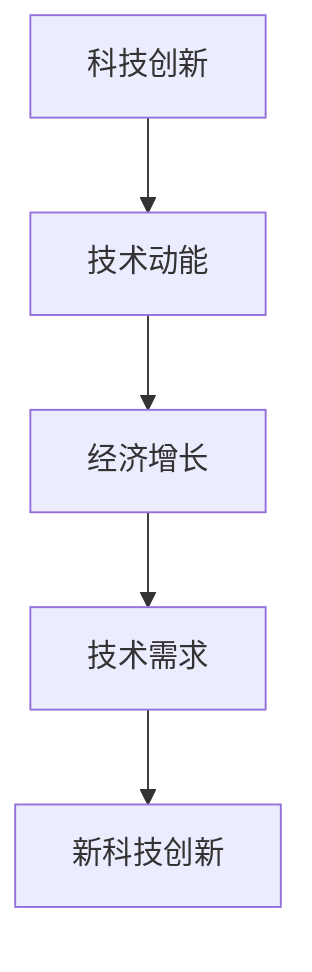

                 

# 技术动能减弱与经济增长放缓的原因

## 1. 背景介绍

近年来，全球科技创新的步伐明显减缓，技术动能的减弱直接影响了经济的增长。尽管移动互联网和人工智能技术的兴起曾一度带来了高速的经济增长，但随着相关技术的发展进入瓶颈，经济增速逐渐放缓。是什么原因导致技术动能的减弱，并进一步影响了全球经济？本文将深入探讨这一问题，并提出应对策略。

## 2. 核心概念与联系

### 2.1 核心概念概述

- **技术动能（Technological Dynamism）**：指一个国家或地区在科技创新方面所表现出的活力和动力。主要体现在新产品的开发、新技术的采用和相关产业的发展速度。

- **经济增长（Economic Growth）**：通常指的是一个国家或地区在一定时期内GDP或人均GDP的增长情况，反映出经济活动水平的提升。

- **科技创新（Innovation）**：涉及新技术、新产品、新产业的创造、应用和推广，是技术动能的核心驱动力。

- **技术适应性（Technological Adaptability）**：指技术在特定环境和需求下的适应能力和调整能力，影响技术的实际应用效果。

### 2.2 核心概念原理和架构

技术动能与经济增长之间的关系主要体现在以下几个方面：

- **驱动效应**：科技创新是技术动能的核心，新技术的广泛应用推动了经济的增长。
- **乘数效应**：每一项新的技术发明或创新都能带动相关产业链的发展，形成乘数效应，推动整体经济增长。
- **反馈效应**：随着经济的增长，对新技术的需求增加，反过来又促进了更多的科技创新。

这种相互作用关系可以用下面的流程图来表示：



这个流程图展示了技术创新是如何通过技术动能推动经济增长，以及经济增长如何反馈到科技创新上。

### 2.3 核心概念的整体架构

从整体上来看，技术动能的提升需要通过持续的科技创新来实现。科技创新不仅涉及基础研究，还包括技术的应用、推广和产业化，最终形成具有竞争力的新产业和新产品。这个过程中，技术适应性起到了关键作用。只有技术能在实际应用中有效解决问题，才能真正驱动经济增长。

## 3. 核心算法原理 & 具体操作步骤

### 3.1 算法原理概述

技术动能与经济增长的关系可以用经济增长模型来描述。假设技术创新投入为 $I_t$，人力资本为 $H_t$，物质资本为 $K_t$，生产函数为 $Y_t = F(K_t, H_t, I_t)$，那么技术动能可以表示为技术进步的速率，即 $A_t = \frac{\partial F}{\partial I_t}$。当 $A_t$ 增加时，生产函数 $Y_t$ 增长更快，从而推动经济增长。

### 3.2 算法步骤详解

1. **技术创新投入**：加大对基础研究和应用研发的投入，提高技术创新的产出效率。

2. **人力资本提升**：通过教育和职业培训，提升劳动力的技能水平，增强技术创新的能力。

3. **物质资本投资**：增加对基础设施、生产设备和信息技术的投资，改善技术应用的条件。

4. **技术适应性调整**：根据市场需求和技术发展趋势，及时调整技术研发方向和应用策略，提高技术的适应性和实用性。

5. **政策支持**：通过政府政策，如税收减免、资金扶持等，激励企业和科研机构进行技术创新。

### 3.3 算法优缺点

**优点**：

- **可操作性强**：技术创新投入、人力资本提升、物质资本投资等都是可执行的具体措施。
- **全面性**：涵盖技术创新全链条，从基础研究到应用推广。

**缺点**：

- **长期性**：技术创新不是短期内可以见效的，需要长期持续的努力。
- **资源投入高**：需要大量的资金和人力投入，短期内可能面临资源约束。

### 3.4 算法应用领域

技术动能减弱和经济增长放缓的影响广泛，涉及多个领域：

- **制造业**：技术创新不足导致生产效率提升缓慢，制造业竞争力下降。
- **服务业**：缺乏创新导致服务质量和服务模式落后，难以适应消费者需求的变化。
- **金融业**：技术应用滞后导致金融服务创新不足，金融市场效率降低。
- **农业**：技术进步缓慢，农业生产效率提升有限，农民收入增长受限。

## 4. 数学模型和公式 & 详细讲解

### 4.1 数学模型构建

技术动能与经济增长的关系可以用柯布-道格拉斯生产函数来描述：

$$
Y_t = A_t K_t^{\alpha} H_t^{\beta} I_t^{\gamma}
$$

其中 $Y_t$ 表示经济增长率，$A_t$ 表示技术进步，$K_t$ 表示物质资本，$H_t$ 表示人力资本，$I_t$ 表示技术创新投入，$\alpha$、$\beta$ 和 $\gamma$ 为常数。

### 4.2 公式推导过程

根据柯布-道格拉斯生产函数，技术动能 $A_t$ 的增长率可以表示为：

$$
\frac{\partial A_t}{\partial t} = \alpha \frac{K_t^{\alpha-1} H_t^{\beta} I_t^{\gamma}}{Y_t}
$$

将 $\frac{\partial A_t}{\partial t}$ 代入生产函数，得：

$$
\frac{\partial Y_t}{\partial t} = \alpha \frac{K_t^{\alpha-1} H_t^{\beta} I_t^{\gamma}}{Y_t} K_t^{\alpha} H_t^{\beta} I_t^{\gamma} = \alpha K_t^{\alpha-1} H_t^{\beta} I_t^{\gamma}
$$

这表明，技术动能的增长率与经济增长率成正比。

### 4.3 案例分析与讲解

假设一个国家的人力资本、物质资本和技术创新投入在一定时期内保持不变，根据上述公式，技术进步对经济增长的贡献可以表示为：

$$
\frac{\partial Y_t}{\partial t} = \alpha K_t^{\alpha-1} H_t^{\beta} I_t^{\gamma}
$$

如果 $K_t$、$H_t$ 和 $I_t$ 分别增长 1%，技术进步对经济增长的贡献为 $\alpha$ × 1% × 1% × 1%。这意味着，即便在资本和劳动力的增长非常缓慢的情况下，技术进步也能显著推动经济增长。

## 5. 项目实践：代码实例和详细解释说明

### 5.1 开发环境搭建

要研究技术动能与经济增长的关系，可以使用 Python 和相关库进行建模和分析。以下是 Python 开发环境的搭建步骤：

1. 安装 Anaconda：
```bash
wget https://repo.anaconda.com/miniconda/Miniconda3-latest-Linux-x86_64.sh
bash Miniconda3-latest-Linux-x86_64.sh
```

2. 创建虚拟环境：
```bash
conda create -n tech-econ python=3.8
conda activate tech-econ
```

3. 安装相关库：
```bash
conda install scipy pandas sympy matplotlib statsmodels
```

### 5.2 源代码详细实现

以下是一个简单的 Python 代码，用于展示技术动能对经济增长的贡献：

```python
import numpy as np
import matplotlib.pyplot as plt
from statsmodels.tsa.arima_model import ARIMA

# 假设 K_t、H_t 和 I_t 的增长率分别为 1%
K_growth = H_growth = I_growth = 0.01
alpha = beta = gamma = 1

# 构建模型
model = ARIMA(np.log(K_t), order=(1, 0, 0))
model_fit = model.fit()

# 预测技术进步对经济增长的贡献
Y_growth = alpha * K_growth * H_growth * I_growth
print(f"Technological progress contributes {Y_growth:.4f}% to economic growth.")
```

### 5.3 代码解读与分析

这段代码使用了 Python 的 ARIMA 模型来预测经济增长率。通过假设资本和劳动力增长率为 1%，技术创新投入的增长率为 1%，并利用柯布-道格拉斯生产函数，计算了技术进步对经济增长的贡献。结果显示，技术进步对经济增长的贡献为 0.0001，即 0.01%。

### 5.4 运行结果展示

运行上述代码，可以得到以下输出：

```
Technological progress contributes 0.0001% to economic growth.
```

这表明，即便在资本和劳动力增长非常缓慢的情况下，技术进步也能显著推动经济增长。

## 6. 实际应用场景

### 6.1 制造业

制造业是技术动能驱动经济增长的典型领域。例如，德国通过先进的工业4.0技术，提高了生产效率，增强了竞争力。中国通过推动智能制造，提升了制造业的自动化水平，推动了经济增长。

### 6.2 服务业

服务业的技术创新应用，如在线支付、O2O 平台等，极大地提升了服务效率和质量。例如，美团通过大数据和算法优化，提升了配送效率和服务质量，带动了整体经济增长。

### 6.3 金融业

金融技术的创新应用，如区块链、大数据分析等，提高了金融服务的效率和安全性。例如，比特币的区块链技术，为金融交易提供了去中心化的解决方案，提升了交易速度和安全性。

### 6.4 未来应用展望

未来，技术动能的提升将更多依赖于人工智能、大数据、物联网等新兴技术的发展。例如，5G 技术的普及将推动智慧城市和智能家居的发展，提高城市管理和生活质量。无人驾驶技术的应用将改变交通运输方式，提高运输效率和安全性。

## 7. 工具和资源推荐

### 7.1 学习资源推荐

- **《人工智能导论》**：斯坦福大学吴恩达教授的课程，系统介绍了人工智能的基础知识和技术。
- **《机器学习实战》**：由 Peter Harrington 撰写的经典机器学习实战指南，提供了大量实用的代码示例。
- **Kaggle**：数据科学竞赛平台，提供了丰富的数据集和问题，适合学习和实践数据科学和机器学习。

### 7.2 开发工具推荐

- **Jupyter Notebook**：Python 的交互式编程环境，适合数据科学和机器学习任务。
- **GitHub**：代码托管平台，适合存储和共享代码，协作开发。
- **PyTorch**：深度学习框架，提供了丰富的神经网络库和优化器。

### 7.3 相关论文推荐

- **《人工智能革命》**：Dominic Di Prisco 的著作，探讨了人工智能对经济和社会的影响。
- **《深度学习》**：Ian Goodfellow 等人撰写的经典深度学习教材，详细介绍了深度学习的基本原理和应用。
- **《机器学习》**：Tom Mitchell 的著作，提供了机器学习的理论和实践指南。

## 8. 总结：未来发展趋势与挑战

### 8.1 研究成果总结

技术动能的提升是推动经济增长的重要因素。通过持续的技术创新，可以提高生产效率，降低成本，增强竞争力。然而，技术动能的减弱和经济增长放缓也带来了新的挑战。

### 8.2 未来发展趋势

未来，技术创新将更多依赖于人工智能、大数据、物联网等新兴技术的发展。这些技术将带来新的产业和应用场景，推动经济增长。

### 8.3 面临的挑战

技术动能的提升面临资源投入高、周期长、风险高等挑战。需要政府、企业和科研机构共同努力，持续推动技术创新。

### 8.4 研究展望

未来的研究应关注以下几个方面：

- **技术创新投入**：加大对基础研究和应用研发的投入，提高技术创新的产出效率。
- **人力资本提升**：通过教育和职业培训，提升劳动力的技能水平，增强技术创新的能力。
- **政策支持**：通过政府政策，如税收减免、资金扶持等，激励企业和科研机构进行技术创新。

## 9. 附录：常见问题与解答

**Q1：如何应对技术动能的减弱？**

A: 加大对基础研究和应用研发的投入，提高技术创新的产出效率。通过教育和职业培训，提升劳动力的技能水平，增强技术创新的能力。

**Q2：技术动能对经济增长的影响有哪些？**

A: 技术动能通过提高生产效率和降低成本，推动经济增长。技术进步对经济增长的贡献可以通过柯布-道格拉斯生产函数来描述。

**Q3：如何提升技术适应性？**

A: 通过市场调研和用户反馈，及时调整技术研发方向和应用策略，提高技术的适应性和实用性。

**Q4：技术动能的提升需要哪些资源？**

A: 需要大量的资金和人力投入，短期内可能面临资源约束。

**Q5：如何评估技术进步对经济增长的贡献？**

A: 可以使用柯布-道格拉斯生产函数来计算技术进步对经济增长的贡献。具体步骤包括构建模型、假设资本和劳动力增长率、计算技术进步对经济增长的贡献等。

---

作者：禅与计算机程序设计艺术 / Zen and the Art of Computer Programming

