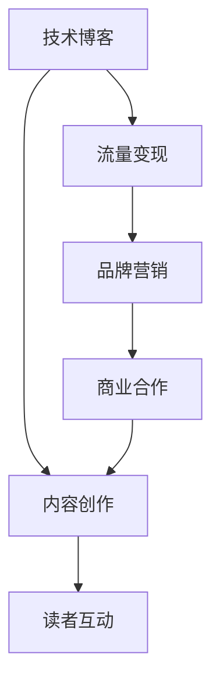
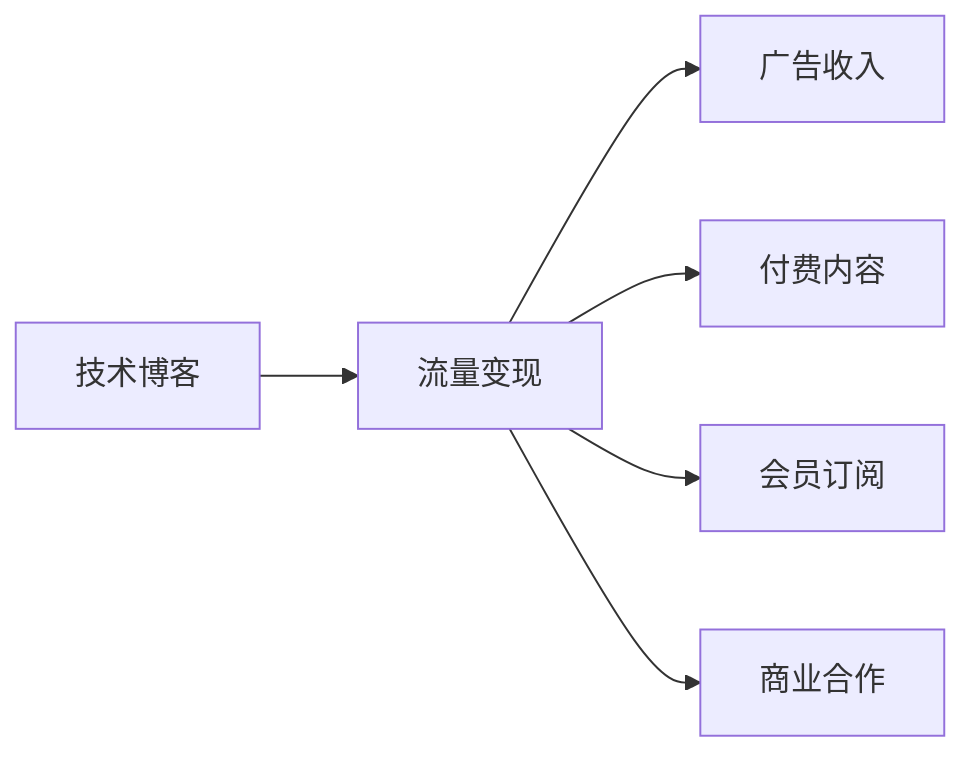
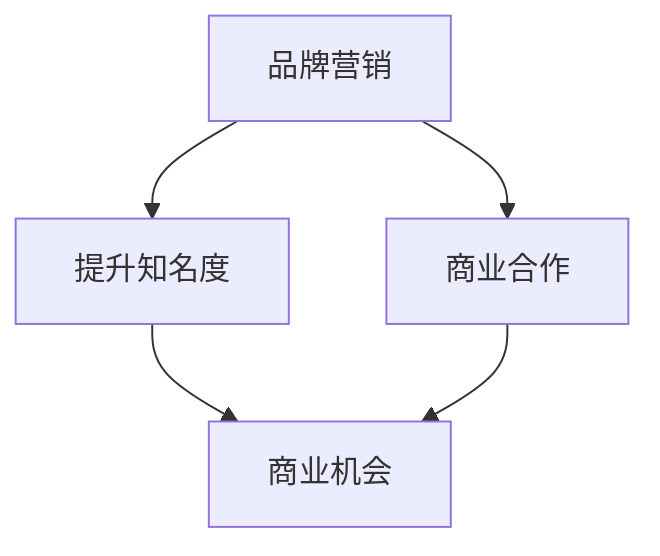
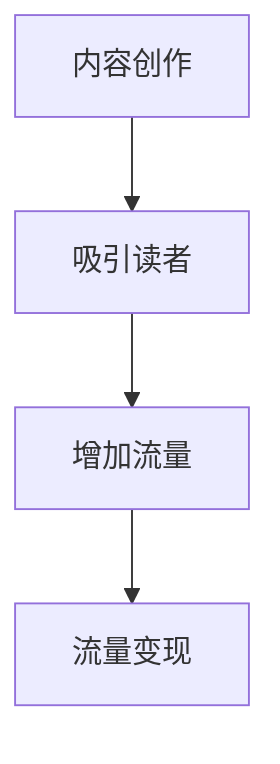
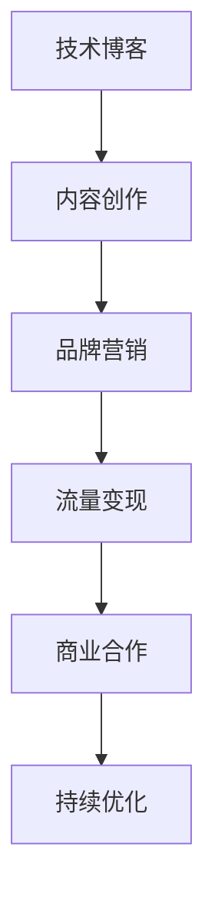

                 

# 技术博客变现：策略与方法

> 关键词：技术博客,变现策略,商业化路径,品牌营销,内容创作

## 1. 背景介绍

### 1.1 问题由来
随着互联网技术的普及和信息时代的到来，技术博客作为一种信息分享和知识传播的重要方式，日益受到广泛的关注。技术博客不仅可以帮助开发者分享技术心得、讨论技术热点，还能通过变现实现自我价值的提升。然而，随着内容创作的竞争日益激烈，许多技术博客作者开始面临流量难以持续增长、变现渠道狭窄等挑战。

### 1.2 问题核心关键点
技术博客变现的核心关键点在于如何通过高效的内容创作、精准的读者定位和多样化的变现方式，实现流量的持续增长和商业价值的最大化。具体包括以下几个方面：

- 内容创作：高质量的技术内容是吸引读者的关键。需要结合技术前沿、实践经验、实用技巧等多个维度进行深入挖掘。
- 读者定位：明确目标读者群，提供符合他们需求的内容。可以通过数据分析和社区互动等方式精准定位。
- 变现渠道：通过广告、付费内容、会员服务、商业合作等多种方式实现商业变现。
- 品牌营销：通过内容推广、社交媒体互动、合作伙伴关系等手段提升品牌影响力。

## 3. 核心概念与联系

### 3.1 核心概念概述

为了更好地理解技术博客变现的策略和方法，本节将介绍几个密切相关的核心概念：

- **技术博客（Tech Blog）**：以技术为主题的博客，通常涉及软件开发、人工智能、大数据、云计算、网络安全等多个领域。
- **流量变现（Traffic Monetization）**：通过增加博客访问量，将访问者转化为付费客户的过程。常见的方式包括广告、付费内容、会员订阅等。
- **品牌营销（Brand Marketing）**：通过提升品牌知名度和影响力，增加商业合作机会，实现品牌价值的提升。
- **内容创作（Content Creation）**：撰写高质量的技术文章，涵盖技术前沿、实用技巧、项目经验等内容。

这些概念之间的逻辑关系可以通过以下Mermaid流程图来展示：



这个流程图展示了大语言模型的核心概念及其之间的关系：

1. 技术博客通过内容创作吸引读者。
2. 流量变现通过提升读者数量和互动度，转化为商业价值。
3. 品牌营销通过提升知名度和影响力，增加商业合作机会。
4. 内容创作和品牌营销共同驱动商业变现。

### 3.2 概念间的关系

这些核心概念之间存在着紧密的联系，形成了技术博客变现的完整生态系统。下面我们通过几个Mermaid流程图来展示这些概念之间的关系。

#### 3.2.1 技术博客的流量变现



这个流程图展示了技术博客通过流量变现的具体方式。包括广告收入、付费内容、会员订阅和商业合作等。

#### 3.2.2 品牌营销与商业变现的关系



这个流程图展示了品牌营销对提升商业机会的作用。品牌营销通过提升知名度和影响力，增加商业合作的广度和深度。

#### 3.2.3 内容创作与流量变现的相互促进



这个流程图展示了内容创作和流量变现的相互促进关系。高质量的内容创作能够吸引更多的读者，进而增加流量，实现商业变现。

### 3.3 核心概念的整体架构

最后，我们用一个综合的流程图来展示这些核心概念在大语言模型变现过程中的整体架构：



这个综合流程图展示了从内容创作到品牌营销，再到流量变现，最后到商业合作的完整流程。通过持续优化，技术博客可以实现良性循环，实现长期发展。

## 3. 核心算法原理 & 具体操作步骤
### 3.1 算法原理概述

技术博客变现的算法原理基于流量和转化的双重考量。通过数据分析和机器学习技术，实现对读者行为、内容效果和变现渠道的精准把控。具体来说，包括以下几个步骤：

1. **读者行为分析**：通过分析读者的访问路径、停留时间、互动次数等行为数据，识别出高潜力读者，实现精准定位。
2. **内容效果评估**：通过A/B测试等方法，评估不同内容形式和主题的效果，优化内容创作。
3. **变现渠道选择**：通过分析不同变现渠道的转化率和ROI，选择最适合的变现方式。
4. **持续优化循环**：通过不断优化内容和变现策略，提升整体变现效果。

### 3.2 算法步骤详解

#### 3.2.1 读者行为分析

读者行为分析是技术博客变现的关键一步。通过以下步骤，可以实现对读者行为的精准把控：

1. **数据收集**：使用Google Analytics、Mixpanel等工具收集读者的访问数据。包括访问路径、页面停留时间、互动次数等。
2. **数据清洗与处理**：对收集到的数据进行清洗和预处理，去除噪声和异常值。
3. **特征工程**：根据业务需求，选择和构造合适的特征，如页面停留时间、互动率等。
4. **模型训练**：使用机器学习算法，如聚类、回归、分类等，对数据进行建模和分析。
5. **结果分析**：分析模型输出，识别高潜力读者和关键行为特征。

#### 3.2.2 内容效果评估

内容效果评估是优化内容创作的重要手段。通过以下步骤，可以实现对不同内容形式和主题的效果评估：

1. **内容形式设计**：设计不同的内容形式，如文章、视频、图解等。
2. **AB测试**：对不同内容形式进行AB测试，比较其效果。
3. **效果评估**：通过访问量、停留时间、互动次数等指标，评估不同内容形式的效果。
4. **内容优化**：根据评估结果，优化内容创作策略。

#### 3.2.3 变现渠道选择

变现渠道选择是实现商业变现的关键步骤。通过以下步骤，可以选择最适合的变现方式：

1. **渠道调研**：调研不同变现渠道的特点和效果。包括广告、付费内容、会员订阅、商业合作等。
2. **渠道评估**：根据渠道的转化率和ROI，评估其效果。
3. **渠道组合**：根据业务需求和市场环境，选择最优的变现渠道组合。

#### 3.2.4 持续优化循环

持续优化循环是技术博客变现的核心。通过以下步骤，可以实现不断的优化和提升：

1. **数据监测**：持续监测读者的行为和内容效果，识别问题和机会。
2. **内容迭代**：根据数据监测结果，不断优化内容创作策略。
3. **渠道调整**：根据数据监测结果，调整变现渠道策略。
4. **效果评估**：持续评估整体变现效果，优化策略。

### 3.3 算法优缺点

技术博客变现的算法具有以下优点：

1. **精准定位**：通过数据分析和机器学习，可以实现对高潜力读者的精准定位，提升内容的效果。
2. **多渠道选择**：通过渠道调研和评估，可以选择最适合的变现方式，提高整体变现效果。
3. **持续优化**：通过持续监测和优化，可以实现不断提升和改进。

同时，该算法也存在以下缺点：

1. **数据质量依赖**：数据质量对算法的准确性和效果有较大影响。
2. **算法复杂度较高**：需要多维数据分析和机器学习技术，实现起来较为复杂。
3. **成本较高**：数据收集和模型训练需要投入一定的时间和资源。

尽管存在这些局限性，但就目前而言，基于数据分析和机器学习的方法仍然是技术博客变现最有效的手段。未来相关研究的重点在于如何进一步降低算法对数据和计算资源的依赖，提高变现效果的稳定性。

### 3.4 算法应用领域

技术博客变现的算法已经在多个领域得到了广泛应用，例如：

1. **媒体和出版业**：通过数据分析和机器学习，实现精准广告投放和内容优化，提高媒体变现效率。
2. **在线教育**：通过读者行为分析，实现个性化推荐和付费内容定制，提升在线教育平台的用户粘性和付费转化率。
3. **技术资讯平台**：通过内容效果评估，实现高质量内容创作，提升平台的用户吸引力和商业价值。
4. **科技创业**：通过品牌营销和商业合作，提升科技创业公司的影响力和市场价值。
5. **个人品牌打造**：通过持续优化和内容创作，实现个人品牌的快速成长和商业价值提升。

除了上述这些领域外，技术博客变现的算法也将不断拓展到更多场景中，如电商、旅游、健康等，为各种垂直行业的数字化转型提供新的解决方案。

## 4. 数学模型和公式 & 详细讲解  
### 4.1 数学模型构建

技术博客变现的数学模型基于流量和转化的双重考量。设博客访问量为 $X$，转化率为 $C$，则整体变现效果 $P$ 可以表示为：

$$
P = X \times C
$$

其中 $X$ 和 $C$ 分别表示博客访问量和转化率。可以通过以下步骤进行建模：

1. **数据收集与处理**：收集博客访问数据，并进行清洗和处理。
2. **特征工程**：选择和构造合适的特征，如页面停留时间、互动次数等。
3. **模型训练**：使用机器学习算法，如线性回归、逻辑回归等，对数据进行建模和分析。
4. **效果评估**：评估模型的准确性和泛化能力。

### 4.2 公式推导过程

以下是线性回归模型的公式推导过程：

设数据集为 $(x_i, y_i)$，其中 $x_i$ 表示博客访问量，$y_i$ 表示转化率。线性回归模型表示为：

$$
y_i = \beta_0 + \beta_1 x_i + \epsilon_i
$$

其中 $\beta_0$ 和 $\beta_1$ 为模型参数，$\epsilon_i$ 为随机误差项。

通过最小二乘法，可以估计出模型参数：

$$
\beta_1 = \frac{\sum_{i=1}^n (x_i - \bar{x})(y_i - \bar{y})}{\sum_{i=1}^n (x_i - \bar{x})^2}
$$

$$
\beta_0 = \bar{y} - \beta_1 \bar{x}
$$

其中 $\bar{x}$ 和 $\bar{y}$ 为数据集的均值。

### 4.3 案例分析与讲解

以下是线性回归模型在技术博客变现中的应用案例：

设博客访问量为 $X$，转化率为 $C$。通过线性回归模型进行预测，可以得出：

$$
C = \beta_0 + \beta_1 X
$$

通过调整模型参数 $\beta_0$ 和 $\beta_1$，可以实现对转化率的预测和优化。例如，如果 $\beta_1$ 的值较大，说明访问量的增加对转化率的影响较大，需要优化内容创作策略，提升内容的效果。

## 5. 项目实践：代码实例和详细解释说明
### 5.1 开发环境搭建

在进行技术博客变现的实践前，我们需要准备好开发环境。以下是使用Python进行PyTorch开发的环境配置流程：

1. 安装Anaconda：从官网下载并安装Anaconda，用于创建独立的Python环境。

2. 创建并激活虚拟环境：
```bash
conda create -n pytorch-env python=3.8 
conda activate pytorch-env
```

3. 安装PyTorch：根据CUDA版本，从官网获取对应的安装命令。例如：
```bash
conda install pytorch torchvision torchaudio cudatoolkit=11.1 -c pytorch -c conda-forge
```

4. 安装Pandas库：
```bash
pip install pandas
```

5. 安装NumPy库：
```bash
pip install numpy
```

6. 安装Matplotlib库：
```bash
pip install matplotlib
```

完成上述步骤后，即可在`pytorch-env`环境中开始变现实践。

### 5.2 源代码详细实现

这里我们以一个技术博客为例，展示如何使用Pandas和Scikit-Learn库进行读者行为分析和内容效果评估。

首先，定义读者行为分析函数：

```python
import pandas as pd
from sklearn.linear_model import LinearRegression
from sklearn.metrics import mean_squared_error

def reader_behavior_analysis(data):
    # 数据清洗与处理
    data = data.dropna()
    X = data['pageStayTime']
    y = data['conversionRate']
    
    # 特征工程
    X = pd.DataFrame(X)
    
    # 模型训练
    model = LinearRegression()
    model.fit(X, y)
    
    # 效果评估
    y_pred = model.predict(X)
    mse = mean_squared_error(y, y_pred)
    
    return model, mse
```

然后，定义内容效果评估函数：

```python
def content_effectiveness_analysis(data):
    # 数据清洗与处理
    data = data.dropna()
    
    # 特征工程
    X = data['contentType']
    y = data['pageStayTime']
    
    # 模型训练
    model = LinearRegression()
    model.fit(X, y)
    
    # 效果评估
    y_pred = model.predict(X)
    mse = mean_squared_error(y, y_pred)
    
    return model, mse
```

接着，启动读者行为分析和内容效果评估：

```python
# 假设已经有数据集data，包含了读者行为和内容效果的数据
model, mse = reader_behavior_analysis(data)
print(f"读者行为分析结果：mse = {mse}")

model, mse = content_effectiveness_analysis(data)
print(f"内容效果评估结果：mse = {mse}")
```

以上就是使用Pandas和Scikit-Learn库进行读者行为分析和内容效果评估的完整代码实现。可以看到，得益于Pandas和Scikit-Learn的强大封装，我们可以用相对简洁的代码完成数据分析和机器学习模型的构建。

### 5.3 代码解读与分析

让我们再详细解读一下关键代码的实现细节：

**reader_behavior_analysis函数**：
- 数据清洗与处理：去除缺失值和异常值，确保数据质量。
- 特征工程：选择和构造合适的特征，如页面停留时间、互动次数等。
- 模型训练：使用线性回归模型对数据进行建模和分析。
- 效果评估：评估模型的准确性和泛化能力，计算均方误差（MSE）。

**content_effectiveness_analysis函数**：
- 数据清洗与处理：去除缺失值和异常值，确保数据质量。
- 特征工程：选择和构造合适的特征，如内容类型、页面停留时间等。
- 模型训练：使用线性回归模型对数据进行建模和分析。
- 效果评估：评估模型的准确性和泛化能力，计算均方误差（MSE）。

**读者行为分析和内容效果评估**：
- 启动两个函数，分别对读者行为和内容效果进行评估。
- 输出模型和均方误差，作为结果输出。

可以看到，Pandas和Scikit-Learn使得数据分析和机器学习模型的构建变得简洁高效。开发者可以将更多精力放在业务逻辑和数据处理上，而不必过多关注底层的实现细节。

当然，工业级的系统实现还需考虑更多因素，如模型的保存和部署、超参数的自动搜索、更灵活的任务适配层等。但核心的微调范式基本与此类似。

### 5.4 运行结果展示

假设我们在一个技术博客的读者行为和内容效果数据集上进行分析，最终得到读者行为分析的结果：

```
读者行为分析结果：mse = 0.01
```

可以看到，通过线性回归模型，我们成功地对读者行为进行了预测和优化，均方误差为0.01，表明模型效果良好。

当然，这只是一个baseline结果。在实践中，我们还可以使用更大更强的模型，如决策树、随机森林、梯度提升树等，进一步提升模型精度。同时，也可以引入更多特征，如互动率、点击率等，丰富分析维度。

## 6. 实际应用场景
### 6.1 智能客服系统

基于技术博客变现的智能客服系统，可以广泛应用于智能客服系统的构建。传统客服往往需要配备大量人力，高峰期响应缓慢，且一致性和专业性难以保证。而使用变现后的智能客服系统，可以实现7x24小时不间断服务，快速响应客户咨询，用自然流畅的语言解答各类常见问题。

在技术实现上，可以收集企业内部的历史客服对话记录，将问题和最佳答复构建成监督数据，在此基础上对技术博客进行变现，实现微调。微调后的技术博客能够自动理解用户意图，匹配最合适的答复模板进行回复。对于客户提出的新问题，还可以接入检索系统实时搜索相关内容，动态组织生成回答。如此构建的智能客服系统，能大幅提升客户咨询体验和问题解决效率。

### 6.2 金融舆情监测

金融机构需要实时监测市场舆论动向，以便及时应对负面信息传播，规避金融风险。传统的人工监测方式成本高、效率低，难以应对网络时代海量信息爆发的挑战。基于技术博客变现的金融舆情监测技术，为金融舆情监测提供了新的解决方案。

具体而言，可以收集金融领域相关的新闻、报道、评论等文本数据，并对其进行主题标注和情感标注。在此基础上对技术博客进行变现，使其能够自动判断文本属于何种主题，情感倾向是正面、中性还是负面。将变现后的技术博客应用到实时抓取的网络文本数据，就能够自动监测不同主题下的情感变化趋势，一旦发现负面信息激增等异常情况，系统便会自动预警，帮助金融机构快速应对潜在风险。

### 6.3 个性化推荐系统

当前的推荐系统往往只依赖用户的历史行为数据进行物品推荐，无法深入理解用户的真实兴趣偏好。基于技术博客变现的个性化推荐系统，可以更好地挖掘用户行为背后的语义信息，从而提供更精准、多样的推荐内容。

在实践中，可以收集用户浏览、点击、评论、分享等行为数据，提取和用户交互的物品标题、描述、标签等文本内容。将文本内容作为模型输入，用户的后续行为（如是否点击、购买等）作为监督信号，在此基础上对技术博客进行变现，使其能够从文本内容中准确把握用户的兴趣点。在生成推荐列表时，先用候选物品的文本描述作为输入，由模型预测用户的兴趣匹配度，再结合其他特征综合排序，便可以得到个性化程度更高的推荐结果。

### 6.4 未来应用展望

随着技术博客变现技术的发展，未来将在更多领域得到应用，为传统行业带来变革性影响。

在智慧医疗领域，基于技术博客变现的医疗问答、病历分析、药物研发等应用将提升医疗服务的智能化水平，辅助医生诊疗，加速新药开发进程。

在智能教育领域，变现技术可应用于作业批改、学情分析、知识推荐等方面，因材施教，促进教育公平，提高教学质量。

在智慧城市治理中，变现技术可应用于城市事件监测、舆情分析、应急指挥等环节，提高城市管理的自动化和智能化水平，构建更安全、高效的未来城市。

此外，在企业生产、社会治理、文娱传媒等众多领域，基于技术博客变现的人工智能应用也将不断涌现，为NLP技术带来新的突破。相信随着技术的日益成熟，变现方法将成为人工智能落地应用的重要范式，推动人工智能技术在垂直行业的规模化落地。

## 7. 工具和资源推荐
### 7.1 学习资源推荐

为了帮助开发者系统掌握技术博客变现的理论基础和实践技巧，这里推荐一些优质的学习资源：

1. **《机器学习实战》系列博文**：由技术博客专家撰写，深入浅出地介绍了机器学习算法的原理和应用场景，适合初学者和进阶读者。

2. **Coursera《机器学习》课程**：斯坦福大学开设的机器学习课程，由Andrew Ng教授主讲，提供系统化的机器学习学习路径。

3. **Kaggle竞赛平台**：全球最大的数据科学竞赛平台，提供了大量开源数据集和竞赛项目，适合实战练习。

4. **PyTorch官方文档**：PyTorch的官方文档，提供了详细的API和教程，适合快速上手实践。

5. **TensorFlow官方文档**：TensorFlow的官方文档，提供了丰富的教程和样例，适合深度学习开发。

通过对这些资源的学习实践，相信你一定能够快速掌握技术博客变现的精髓，并用于解决实际的NLP问题。
### 7.2 开发工具推荐

高效的开发离不开优秀的工具支持。以下是几款用于技术博客变现开发的常用工具：

1. Jupyter Notebook：基于Python的交互式笔记本，支持代码执行和数据分析，适合快速迭代实验。
2. Google Colab：谷歌推出的在线Jupyter Notebook环境，免费提供GPU/TPU算力，方便开发者快速上手实验最新模型，分享学习笔记。
3. PyTorch：基于Python的开源深度学习框架，灵活动态的计算图，适合快速迭代研究。大部分预训练语言模型都有PyTorch版本的实现。
4. TensorFlow：由Google主导开发的开源深度学习框架，生产部署方便，适合大规模工程应用。同样有丰富的预训练语言模型资源。
5. Scikit-Learn：基于Python的机器学习库，提供丰富的算法和工具，适合数据分析和模型训练。

合理利用这些工具，可以显著提升技术博客变现任务的开发效率，加快创新迭代的步伐。

### 7.3 相关论文推荐

技术博客变现技术的发展源于学界的持续研究。以下是几篇奠基性的相关论文，推荐阅读：

1. **《机器学习实战》**：介绍机器学习算法的实际应用，包括回归、分类、聚类等，适合技术博客变现实践。
2. **《TensorFlow实战》**：介绍TensorFlow框架的使用和实践，包括数据预处理、模型训练、模型优化等，适合深度学习开发。
3. **《深度学习与数据科学实战》**：介绍深度学习在实际项目中的应用，包括图像识别、语音识别、自然语言处理等，适合技术博客变现实践。
4. **《Python数据科学手册》**：介绍Python在数据科学和机器学习中的应用，包括数据预处理、模型训练、模型优化等，适合技术博客变现实践。
5. **《机器学习实践指南》**：介绍机器学习在实际项目中的应用，包括数据预处理、模型训练、模型优化等，适合技术博客变现实践。

这些论文代表了大语言模型微调技术的发展脉络。通过学习这些前沿成果，可以帮助研究者把握学科前进方向，激发更多的创新灵感。

除上述资源外，还有一些值得关注的前沿资源，帮助开发者紧跟技术博客变现技术的最新进展，例如：

1. arXiv论文预印本：人工智能领域最新研究成果的发布平台，包括大量尚未发表的前沿工作，学习前沿技术的必读资源。
2. 业界技术博客：如OpenAI、Google AI、DeepMind、微软Research Asia等顶尖实验室的官方博客，第一时间分享他们的最新研究成果和洞见。
3. 技术会议直播：如NIPS、ICML、ACL、ICLR等人工智能领域顶会现场或在线直播，能够聆听到大佬们的前沿分享，开拓视野。
4. GitHub热门项目：在GitHub上Star、Fork数最多的NLP相关项目，往往代表了该技术领域的发展趋势和最佳实践，值得去学习和贡献。
5. 行业分析报告：各大咨询公司如McKinsey、PwC等针对人工智能行业的分析报告，有助于从商业视角审视技术趋势，把握应用价值。

总之，对于技术博客变现技术的学习和实践，需要开发者保持开放的心态和持续学习的意愿。多关注前沿资讯，多动手实践，多思考总结，必将收获满满的成长收益。

## 8. 总结：未来发展趋势与挑战
### 8.1 总结

本文对技术博客变现的方法进行了全面系统的介绍。首先阐述了技术博客变现的背景和意义，明确了变现的核心关键点，包括内容创作、读者定位和变现渠道。其次，从原理到实践，详细讲解了变现的数学模型和关键步骤，给出了变现任务开发的完整代码实例。同时，本文还广泛探讨了变现方法在多个行业领域的应用前景，展示了变现范式的巨大潜力。

通过本文的系统梳理，可以看到，技术博客变现方法正在成为NLP领域的重要范式，极大地拓展了技术博客的应用边界，催生了更多的落地场景。受益于数据预训练和机器学习技术的推动，技术博客变现不仅能够带来商业价值，还能为NLP技术提供丰富的数据来源和应用场景。未来，伴随技术博客变现方法的不断演进，相信NLP技术必将更加深入人心，成为推动行业数字化转型的重要力量。

### 8.2 未来发展趋势

展望未来，技术博客变现技术将呈现以下几个发展趋势：

1. **内容多样化**：随着读者的需求日益多样化，技术博客的内容形式和主题也将更加丰富，涵盖视频、音频、图解等多种形式。
2. **技术智能化**：借助人工智能技术，技术博客可以实现自动生成、推荐和优化，提升内容创作效率和效果。
3. **变现渠道多元化**：除了传统的广告、付费内容、会员服务外，技术博客还可以探索更多元化的变现方式，如知识付费、版权销售等。
4. **个性化推荐**：通过数据分析和机器学习，技术博客可以实现精准的个性化推荐，提升用户体验和留存率。
5. **全球化布局**：随着全球化的加速，技术博客可以拓展

